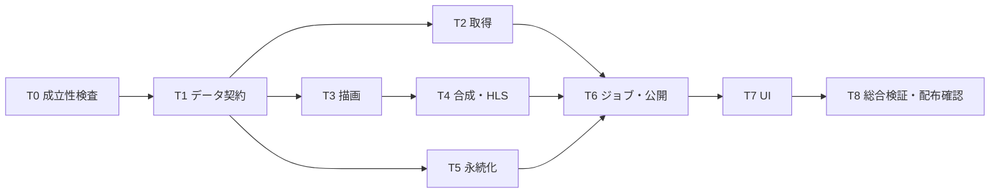

# ニコニコ動画・コメント付き事前エンコード実装計画書

作成: 2026-09-16 / 状態: 実装中（T1/T2基盤、T3描画、T4合成、T7リンクUIの初版） / 対象: ImagePadServer

**目的:** ニコニコ動画URLの取り込み時に、任意で流れるコメントを動画へ焼き込み、完成後に共有・キュー追加できるようにする。ユーザー指定によりリアルタイム性は要求しない。

**構成:** コメントの固定スナップショット → niconicommentsのCanvas2D描画 → FFmpegで元動画と合成 → 完成MP4 → 映像・音声コピーによるHLS VOD化 → 一括保存 → 共有。準備中の現在共有は維持する。

**現在の実装境界:** T3/T4とURL分岐の初版は既存HTTP要求内で完了まで待つ同期経路。長尺で要求を占有するため、T6のサーバー所有ジョブ・202応答・再接続可能な進捗へ移すまで実運用の既定ONにはしない。

**技術:** 既存Goサーバー、固定版niconicomments、専用の非表示Edge/Chrome、既存yt-dlp、CPU/libx264・AAC。製品実行時のNode.js/Electron追加は不要。ブラウザーが利用できない環境ではオプションを無効化し理由を示す。

**仕様:** [詳細設計](../specs/2026-09-16-niconico-comments-design.md)がデータ・時刻・例外処理の基準。[先行実装調査](../specs/2026-09-16-niconico-comments-research.md)に固定コミット、採否、確認済み範囲を記録した。

**共通制約:** 既存の未コミット変更を保護する。実装中もcommit/push/release、稼働中配信の停止は別の明示指示に従う。[H.264互換性契約](../../RTSP_H264_COMPATIBILITY_CONTRACT.md)を守る。ローカル合成・ブラウザーE2E・VRChat実機の結果を分ける。

## 1. 採用案と先行実装からの判断

| 調査対象 | 活用する内容 | この計画への反映 |
|---|---|---|
| NNDD | vpos、固定/流れるコメント、色・サイズ、衝突回避、シーク時の状態初期化 | 歴史的な比較fixtureを作る。AIR/旧通信仕様・呼び出し間隔依存の移動処理は移植しない |
| niconicomments | 現行/旧形式の描画、フォント計測、改行、配置、コメントアート関連 | **描画エンジンとして採用候補を固定**。`keepCA=false`から検証 |
| niconicomments-convert / Re:NNDD | オフラインのコメント映像化、フレーム送信、FFmpeg連携 | 有限バッファ、時刻指定、終了・キャンセルの検証に使う |
| NicoCommentDL | コメント取得・フレーム生成の別実装 | 型とタイムスタンプ処理の照合に使う |
| yt-dlp | 動画取得と現在のwatch/comment要求形状 | 動画取得に使用。コメントはforkを保持する専用アダプターで取得 |
| danmaku2ass / nicodanmaku2ass | ASS変換・簡易焼き込み | 代案。再現性とライセンス・配布形態の差から既定方式にはしない |

単なる右から左への文字移動では、改行、文字幅、フォント、上下固定、コメント同士の配置、旧形式、CAを再現できない。これらを既存描画実装へ寄せ、ImagePadServer側は取得・時刻・成果物の整合性を受け持つ。

**取得成立性は追加確認済み:** Cookieなしで`sm9`のコメント1,016件を実取得した（main 850、easy 166、owner 0）。動画ページと`actionTrackId`付きguest watch APIは200、threadsもHTTP/JSONとも200。初回406から取得不能とは判断しない。別動画・認証必須動画とCanvas→Go→FFmpegの性能は未検証。APIは公式の安定した公開契約とはみなさず、OSSの一次ソースに基づく交換可能なアダプターに隔離する。

2026-09-16に、実装したGoクライアントでも`IMAGEPAD_NICONICO_LIVE_TEST=1 rtk go test ./internal/niconico -run '^TestClientFetchesLivePublicVideo$' -count=1 -v`を実行し、公開動画`sm9`の非空スナップショット取得に成功した。

## 2. 完成するユーザー操作

1. ニコニコ動画URLを貼ると「コメント付きで変換する」を表示。初期OFF。
2. ONで即時共有またはキュー追加するとHTTP 202で受理し、取得・変換・仕上げの進捗を表示する。
3. サーバーがコメント付きMP4とHLSを完成させる。画面を閉じても受理済み処理は続く。
4. 即時共有は、その後ほかの共有操作がなければ完成時に切り替える。後続操作があれば履歴への追加だけにする。キュー追加は自動共有しない。
5. 履歴・お気に入りは完成済み動画を再利用する。入力欄のON/OFFを既存履歴へ再適用しない。

取得失敗と正常な0件を分ける。失敗時にコメントを落として成功扱いにしない。正常0件は「コメント0件」と明示して完成できる。再設定・新しいコメント取得はURLの再取り込みで行う。

## 3. 既存実装の変更点

調査時HEAD: `4a7d02df6a5c148c8182c0d3b7d3fb867960fe63`。作業ツリーに既存変更があるため、下表の関数を実装開始時に再確認する。

| 場所 | 現状と必要な変更 |
|---|---|
| `internal/server/server.go` / `handleUploadURL`, `handleUploadURLQueue` | コメントON分岐を既存の`clearPublication`より前に置く。同期HTTP処理と現在動画の先行変更を避ける |
| 同 / `processVideoFileAndPublish`, `processVideoFileAndQueue` | 既存経路は完成前にcurrent/historyを登録する。新経路は完成後の一括登録APIを使う |
| `internal/video/publisher.go` / `runQueueJob` | コメント合成用modeを追加。既存の変換実行枠で動かし、通常変換と無制限に並走させない |
| 同 / `runUploadedHLS`, `GeneratedFiles` | 通常HLS変換と共有globを再利用しない。完成MP4からcopy remuxし、明示した成果物一覧を返す |
| 同 / `downloadVideoURL`; `soundcloud_download.go` | Nico専用ジョブディレクトリとcontext付き取得を用意。共通`yt-dlp-source.*`掃除に混ぜない |
| `internal/library/store.go` | 完成MP4・HLS・非公開スナップショットを一式で登録。お気に入りのコピー、復元、削除も一式で扱う |
| `internal/server/ingest_status.go` | 単発の取り込み表示とは別に、再接続で読めるジョブ状態を追加 |
| `internal/server/browser_media_probe.go` | ブラウザー探索・CDP接続を参考にする。通常ブラウザーや既存プローブのプロセス所有権は共有しない |

## 4. 境界と入出力

下記は実装時に追加する契約案。型の詳細は詳細設計のsnapshot schema 1に従う。server→video→nicorender、server→niconicoの一方向とし、libraryからserver/videoをimportしない。

```go
// internal/niconico: URL検査・コメント取得・正規化。秘密情報は永続化しない。
type Provider interface {
    Fetch(ctx context.Context, videoID string) (Snapshot, error)
}

// internal/nicorender: ブラウザーの所有とフレーム順序を管理。
type FrameSink interface {
    WriteRGBA(ctx context.Context, sequence uint64, pixels []byte) error
}
// Render(ctx, snapshot, RenderOptions, FrameSink) (RenderReport, error)

// internal/video: 同じmedia IDに属する検査済み成果物を返す。
// EnqueueNicoCommentForID(ctx, mediaID, sourcePath, snapshotPath, options)
//     -> jobID, error
// NicoArtifacts(jobID) -> PreparedNicoArtifacts, error

// internal/library: 公開前の永続化。publicationは行わない。
// CommitPreparedNicoMedia(ctx, PreparedNicoMedia) -> HistoryItem, error
```

`PreparedNicoMedia`は`MediaID, RenderKey, MainMP4, HLSPlaylist, HLSSegments, PrivateSnapshot, Manifest, Metadata`を持つ。任意のパスをHTTP入力で受け取らず、ジョブの検査済みディレクトリ配下に限定する。ディレクトリのatomic renameとメタデータjournalを組み合わせ、復旧を冪等にする。

既存URL APIに`niconicoComments:{enabled:true}`を追加し、ONだけ202＋`acceptedJobId`を返す。状態には安全なジョブ項目と利用可否を追加。キャンセルは管理権限付き`POST /api/niconico-comment-jobs/cancel`。OFF/省略時の要求・応答・フォールバックは維持する。

## 5. タスクと依存関係

各タスクの担当範囲はファイル所有の境界。共有ファイルの編集は統合担当が順番に行う。自動的に実装を開始するための計画ではない。



### T0 — 成立性を先に確認する

依存: なし / 担当: メイン / 作成先: `docs/verification/niconico-comments/qualification.md`、検証用fixture。

- [x] 2026-09-16の追加検証で、匿名の`watch/sm9`→`nvComment`→threadsの成功、fork、件数、本文・表示時刻の型を確認。計1,016件。guest watch APIの必要パラメーター付き要求も200。
- [x] 実装した取得アダプターで`sm9`の取得を再現。Goライブテストが成功し、非空スナップショットとコメントIDを確認した。
- [ ] 別動画・認証が必要な場合の成功/拒否も検査する。
- [ ] niconicommentsの固定版を専用ブラウザーで起動し、30秒の作成fixtureをRGBA/PNGの両方でFFmpegへ渡す。文字縁・透明度・フレーム数を検査する。
- [ ] 720p/1080pで実行時間、ピークメモリ、ディスク使用量を測る。実時間より遅くても失敗にしない。2フレームを超えて蓄積しないことを確認する。
- [ ] 入手済みFFmpegのoverlay/rawvideo/libx264/AAC・フォント・ブラウザーを検査。採用版・ライセンス・検査出力を記録する。

完了条件: 正常取得と30秒の合成が実測で成立。現時点では匿名コメント取得は成立済み、30秒の合成・配布環境・実機確認は未実施。取得条件が変わった場合は原因と必要条件を記録し、有効化工程を止める。

### T1 — データ契約・URL・試験データ

依存: T0 / 所有: 新規`internal/niconico/{url,snapshot,options}.go`、対応`*_test.go`、`testdata/niconico/`。

- [x] 詳細設計のURL許可規則、watch ID、snapshot schema 1、`fork/id/no/vposMs/postedAt/commands/userId/isPremium`を`internal/niconico`の型へ反映した。
- [x] 描画と合成が共用するfps契約の初版を`internal/niconico/timeline.go`へ実装した。30/60/30000÷1001と末尾切り上げをテスト済み。P0・VFR正規化はT4で接続する。
- [ ] `PreparedNicoMedia`とmanifestの型・必須ファイル・hash・完成判定をT1で固定し、T4の生成とT5の保存が同じ契約を使うようにする。
- [ ] 投稿時刻を有効なISO日時へ正規化。本文・改行・空白は保持。重複除去はthread/fork/id単位。main/ownerを描画しeasyは保存のみ。
- [ ] 正常0件、全件形式異常、未知fork、負vpos、入力上限、同本文の複数コメントを別ケースにする。
- [ ] `TestParseVideoURL`, `TestSnapshotPreservesForkAndWhitespace`, `TestSnapshotEmptyVsInvalid`, `TestRenderKeyChangesWithInputs`を先に作る。

完了条件: URL偽装・userinfo・不正portを拒否。認証情報を除く全ての再描画入力を再現可能に保存する。現時点ではURL・スナップショット・fps契約の単体テストまで完了。

### T2 — コメントと動画の取得

依存: T1 / 所有: 新規`internal/niconico/{provider,http_client}.go`、`internal/video/niconico_download.go`と対応テスト。

- [x] 専用Providerへwatchとthreads要求を隔離。serverのHTTPS/host制限、HTTPとJSONの双方のstatus、32MiB上限、429/5xxの最大2回retryを実装した。
- [ ] saved cookie設定を使う場合も適用domain/path/expiryを評価する。watch cookieをコメントサーバーへ一括転送しない。threadKey・cookie・本文をログへ出さない。
- [ ] 動画は既存yt-dlp解決処理を使い、専用ディレクトリへcontext付きで取得。動画のvideoID/長さとスナップショットを照合する。
- [x] `httptest.Server`で成功、429再試行、不正ホスト、形式エラーを試験。実ネットワークのGoライブテストとは分けて実行した。
- [ ] 406、schema drift、途中切断、キャンセルを追加する。

完了条件: forkを失うyt-dlp字幕JSONのflattenを主入力にしない。失敗は型付き理由になり、0件へ変換されない。

### T3 — 決定した時刻でコメントを描画する

依存: T1 / 所有: 新規`internal/nicorender/`、`web/niconico-renderer/`、`internal/nicorender/assets/`、第三者通知。

- [x] `niconicomments` 0.4.1のbundle・MITライセンス・取得元を`internal/nicorender/assets/`へ固定した。
- [x] job単位の一時profileとheadless browserを所有し、ローカルHTMLへJSONを渡す。外部通信を抑止するブラウザー引数を設定した。
- [x] frame nの有理数時刻から`drawCanvas(floor(t*100))`を呼び、PNG→RGBAを2フレーム上限のpipeへ渡す。
- [ ] 論理1920×1080、出力360/720/1080p、固定font profileを記録。通常/上下固定/長文/改行/色/大小/旧形式/CAの代表画像を比較する。
- [ ] 描画例外、フレーム欠落、異なる世代、プロセス終了、キャンセルを注入し、透明フレームへの置換で成功させない。

完了条件: 同じ版・ブラウザー・font・入力で同じ出力。互換性の表明は確認したfixtureに限定する。

### T4 — コメント付きMP4とHLSを作る

依存: T3 / 所有: 新規`internal/video/niconico_encode.go`, `niconico_encode_test.go`、`publisher.go`のNico modeのみ。

- [x] ブラウザー描画とFFmpegを同じcontextで接続するオフライン合成プリミティブを追加し、既存HLS queueへcopy-remux modeを接続した。
- [ ] 原点P0を映像・音声で共有し、rotation/SAR、CFR/VFR、遅延音声、先行音声、長い音声末尾を扱う。フレーム数を`ceil(D*F)`に固定する。
- [x] fit＋黒余白の指定解像度へRGBAをoverlayし、CPU/libx264、yuv420p、AAC、`+faststart`を使用する。
- [x] 完成MP4から`-c copy`でHLS VODを作成し、playlistのENDLISTと全セグメントを検査する。
- [ ] HLS区間がキーフレームから始まるようMP4生成時にGOP/時刻ベースの強制キーフレームを設定する。
- [ ] actual H.264の1AU1映像スライス、MP4/HLSの冒頭・中間・末尾デコード、ENDLIST、音声尾部、CFRフレーム数を検査する。

完了条件: 中間MP4正常終了と成果物検査まで終わってから成功。HLS化で2回目の映像エンコードが走らない。FFmpegが無い試験環境は実エンコード検証未実施として区別する。

### T5 — 完成品を一括保存する

依存: T1 / 所有: 新規`internal/library/niconico_media.go`とテスト、`store.go`の保存/お気に入り/削除への限定接続。

- [ ] 型付きmanifestと`CommitPreparedNicoMedia`を追加。媒体IDを先に決め、MP4/HLS/snapshotの対応を検査してから一式を確定する。
- [ ] private付属データへ公開配信ルートが到達しない構造にする。現在の共有MP4も焼き込み済みのものへ統一する。
- [ ] journal→ファイルrename→メタデータ確定の各境界で強制失敗させ、再起動復旧が冪等になることを確認する。
- [ ] お気に入り化、解除、履歴prune、削除、再起動で全ファイルを追跡。参照が残る一式を消さない。旧保存形式は追加情報なしで読み込めるようにする。

完了条件: 未完成成果物を`Converted=true`にしない。共有globや別動画の`current.mp4`を採用しない。T5単体はT1の契約に従うfixtureで検証できるが、保存経路の統合完了はT4の実成果物でT6/T8を通すまで宣言しない。

### T6 — 非同期ジョブと共有切り替えを統合する

依存: T2/T4/T5 / 所有: 新規`internal/server/niconico_jobs.go`とテスト、`server.go`のURL/state/共有切り替えの接続。

- [ ] ONを`clearPublication`前に検査・分岐し、受理後はHTTP要求の寿命に依存しないサーバー所有contextで動かす。準備中の現在配信を維持する。
- [ ] Nico取得準備は同時1件、待機は初期4件まで。満杯は429で未受理にする。重い変換はT4の共通queueへ渡す。上限は製品側の初期値として設定・表示する。
- [ ] 原本、MP4、HLSが一時的に共存する容量を事前評価し、空き不足・書き込み失敗は現在共有を維持して終了。活動中ディレクトリを清掃しない。
- [ ] 一式の保存確定後に元動画と描画用一時データを削除する。失敗・キャンセル・再起動で中断した世代はjournal復旧後24時間以内に回収する。完成MP4/HLS/snapshot/manifestは履歴・お気に入りの参照寿命に従い、処理中のjobID/generationや参照中成果物は回収しない。
- [ ] ジョブ状態を永続化し、起動後は未完了を`interrupted`にする。認証情報・生API応答は保存しない。
- [ ] 全共有変更で同じpublication世代を進め、世代比較と完成品の公開を同一ロック/transaction内で行う。後続共有との比較直後の競合も試験する。
- [ ] state/API/cancelの認可と秘匿項目を試験。キャンセルは対象jobの取得・描画・エンコードだけを止める。

完了条件: `TestNicoPreparePreservesPublication`, `TestNicoReadyCannotOverrideNewSelection`, `TestNicoCancelDuringFinalize`, `TestNicoRestartInterrupted`, `TestNicoQueueNeverAutoPublishes`, `TestNicoPrivateArtifactsNotServed`が成立する。

### T7 — 入力・進捗・履歴のUI

依存: T6 / 所有: `internal/server/ui.go`の`imageURLInput`周辺、`ui_script_uploadevents.go`の`uploadFromLink`、`ui_script_statesync.go`の`applyState`、`ui_script_domrefs.go`の要素参照、`ui_script_historyqueue.go`の`renderHistory`、`ui_script_history_controller.go`、新規`niconico_ui_test.go`。

- [x] ニコニコURL判定とコメント焼き込みチェックボックスを即時共有/キュー追加の双方へ接続。初期OFF、対象外URL変更時OFF、事前変換の説明を表示する。
- [ ] 202を受付成功として扱い、state再取得で工程・キャンセル・失敗・0件を表示する。完了前の100%表示や動画切替をしない。
- [ ] コメントONの失敗を`maybeOfferBrowserMediaCandidates`経由の通常動画へ切り替えない。送信時の対象URLとオプションをジョブ単位で確定する。
- [ ] 完成履歴へコメント有無を表示。失敗はジョブ一覧へ表示し、未完成の履歴項目を作らない。
- [ ] ブラウザーE2Eでフォーム送信内容、ON/OFF、画面再読み込み、キャンセル、成功後履歴、後続共有維持を確認する。

完了条件: 詳細設計のR1/R2/R5/R6/R8/R9とAPI後方互換を画面操作で確認する。

### T8 — 総合検証と有効化判定

依存: T7 / 担当: 統合担当 / 所有: 検証記録、配布手順、第三者通知。

- [ ] `rtk go test ./internal/niconico ./internal/nicorender ./internal/video ./internal/library ./internal/server`を対象テストから実行し、最後に`rtk go test ./...`を実行。失敗の既存/新規を分ける。
- [ ] 配布環境相当のWindowsで開発用PATH/Node依存を外し、埋め込みJS・font・既存FFmpeg・Edge/Chromeで動くことを確認する。
- [ ] 10秒/長尺、30/60/30000÷1001fps、VFR、無音、遅延音声、4:3/縦/回転、0件/高密度/CA、非BMP文字を検査する。
- [ ] コメント基準フレーム時刻の誤差を最大1出力フレーム以内とし、既知A/Vマーカーは入力差から±1映像フレーム＋1AACフレーム以内、30分の終端でも累積ドリフトなしを確認する。
- [ ] 通常URL、YouTube、音楽、既存HLS、履歴、OBS/AirPlay選択への回帰を確認。実際のVRChat再生・コメント表示は別途実機結果を記録する。
- [ ] 採用ライブラリとfontの固定版、配布実ファイル、ライセンス通知を照合する。FFmpeg/ブラウザーの再配布変更があればその実物を追加検査する。

完了条件: R1～R10の検証結果と未対応ケースが記録され、T0の取得条件を満たす。未測定や実機未実施をPASSへ読み替えない。

## 6. 実装の進め方

Wave 0はT0、Wave 1はT1。契約が固まった後、T2/T3/T5は独立して進められる。T4はT3の完了後、T6はT2/T4/T5の完了後、最後にT7→T8を行う。並列実装を行う場合も、共有する`publisher.go`・`server.go`・`store.go`の編集は担当と順番を固定する。

主な再設計条件は、正常なコメント取得が成立しないこと、配布環境でブラウザーを利用できないこと、希望するCAが採用版とfontで再現できないこと。代案はASSによる簡易描画だが、再現範囲が変わるため自動で切り替えない。判断と実測根拠を詳細設計へ反映してから進める。
