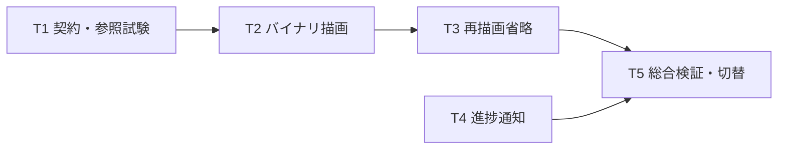

# ニコニココメント描画高速化 実装計画書

> **For agentic workers:** REQUIRED SUB-SKILL: Use superpowers:executing-plans to implement this plan task-by-task. Steps use checkbox (`- [ ]`) syntax for tracking. プロジェクトのSwarms規則に従い、計画承認後に `$parallel-task` で依存が解消した作業だけを実行する。ブラウザー起動・ジョブ寿命・共有ファイルの統合はメイン担当が行う。

作成: 2026-09-16 / 状態: T1/T2/T4実装済み・T3基本実装済み・T5性能採用判定待ち / 対象: ユーザー指定の改善案1・2・3

**Goal:** コメント件数・見た目・出力fps・動画内の表示時刻を維持し、画像の受け渡しと不要な処理を減らしてコメント付き変換を高速化する。

**Architecture:** niconicommentsと既存FrameClockを維持し、ブラウザーからGoへPNG/Base64を返す経路を、上限付きのバイナリWebSocketへ置換する。描画直後に画素を読み、変化のないコメント面は再利用する。進捗通知はNico変換に限定して300ms間隔へまとめる。

**Tech Stack:** Go、既存 `golang.org/x/net v0.53.0/websocket`、同梱niconicomments、専用headlessブラウザー、既存FFmpeg/libx264。依存ライブラリの追加・更新は不要。

**Spec:** [高速化調査と実測](../../verification/niconico-comments/performance-study-2026-09-16.md)、[既存機能の設計](../specs/2026-09-16-niconico-comments-design.md)、[既存実装計画](2026-09-16-niconico-comments.md)。旧文書の「Canvas2D」は実装と相違し、現在のbundleはWebGL2を優先する。本計画では実コードを基準に両方式の画素取得を分ける。

## 共通制約

- 対象は①RGBAバイナリ転送、②画面更新待ち・不要な再描画の削減、③進捗通知の間引き。GPU有効化、Canvas2Dへの強制切替、動画の区間分割並列化は対象外。
- `FPSNum:30, FPSDen:1`、既存 `FrameClock.CommentTimeMs(frame)/10`、`FrameCountForDurationMs`、`keepCA:false`、`lazy:false`、bundle・フォント・ブラウザー探索条件を維持する。
- 元動画fps・描画の所要時間・壁時計をコメント時刻に使わない。出力フレームの間引き、コメント件数削減、解像度低下で速度を稼がない。
- 同期HTTP要求内で処理する現在のジョブ構造、保存・公開、HLS生成の仕様は変更しない。非同期ジョブ化は既存計画の別作業。
- CPU/libx264と `sliced-threads=0:slices=1:slice-max-size=0:slice-max-mbs=0` を維持する。[H.264互換性契約](../../RTSP_H264_COMPATIBILITY_CONTRACT.md)を読む。
- 共有中の既存変更を保持し、commit/push/release、稼働サーバーの停止・再起動は本計画の実行に含めない。検証は専用プロセス・一時ディレクトリで行う。
- 実装と計測は別。従来の60フレーム測定から高速化倍率を保証しない。

## 入出力と寿命の決定事項

### フレーム契約

内部メッセージは40バイトの固定ヘッダーと任意の画素本体。整数はlittle endian。WebSocketの1バイナリメッセージを1フレームとする。

| offset | 型 | 内容 |
|---:|---|---|
| 0 | 4 bytes | magic `NCR1` |
| 4 / 5 / 6 / 7 | uint8 × 4 | version=1、kind=1(full)/2(repeat)、format=1、flags=0 |
| 8 | uint64 | 0始まりのsequence |
| 16 | uint64 | FrameClockが算出した動画内timeMs |
| 24 | uint32 | payloadBytes |
| 28 / 32 | uint32 × 2 | width、height |
| 36 | uint32 | reserved=0 |

format=1は**上から下・左から右、密なRGBA8、既存 `pngToRGBA` と互換のpremultiplied alpha**。今回の速度変更とアルファ合成仕様の変更を混ぜない。`full` は `width*height*4` バイト、`repeat` は0バイトで直前の完全フレームを参照する。最初のフレームは必ず `full`。不明なversion/kind/format/flags、寸法違い、長さ違い、順序違い、指定と異なるtimeMs、初回repeatはエラーにする。

Goが `{"type":"draw","sequence":0,"timeMs":0}` のように少量のJSON要求を送り、ブラウザーが指定された時刻だけを描く。JSは `Math.floor(timeMs/10)` を渡す。大きな画素をJSONやBase64にしない。Goはsequence/timeMsが安全なJS整数範囲内であることを開始時に検査する。

WebGL2の `readPixels` は上下を反転して正規化する。Canvas2Dの `getImageData` はstraight alphaなので、既存Goの変換と同じ丸めでpremultiplyする。色と透明度はT1の参照画像で検証する。直接readPixelsが既存PNG経路と同等にならない環境では、2D staging canvasへの `drawImage` → `getImageData` → 同じpremultiplyを使うバイナリ経路を比較候補とする。見た目の差を未確認のまま高速側へ切り替えない。

### 接続・順序・バックプレッシャー

- ジョブ専用 `127.0.0.1:0` のHTTPサーバーがHTML・同梱bundle・描画スクリプト・WebSocketを供給する。既存8080サーバーへ新ルートを追加しない。専用ブラウザーの遷移先だけを同じoriginのURLへ変更する。
- HTTP/WSはジョブごとのランダム256bitトークン付きパスとし、WSは同じorigin・正しいトークン・1接続だけを受理する。トークンをログへ出さない。CDPは起動とエラー確認に残す。
- draw要求の未完了上限は2。描画・送信はJS内で要求順に直列化し、Goも順に `WriteRGBA` する。`WriteRGBA` が受理されるまで次の送信枠を返さず、FFmpegの遅れをブラウザーまで伝える。
- Goはsink受理後に `{"type":"accepted","sequence":0}` を送り、それから次のdraw要求を送る。JSは未ACKのsequenceを最大2件保持し、acceptedで対応する枠だけを解放する。不明・重複ACKはエラー。acceptedはpipe受理を表し、エンコード完了を意味しない。新しいdraw要求そのものもGo側の空き枠がない限り発行しない。
- `WebSocket.send()` はキュー追加であって受信完了ではない。`bufferedAmount` も監視し、2フレーム相当を超えて要求を処理しない。
- 既存 `FramePipe(2)` を維持。画素は不変として渡し、初版では可変バッファのpoolを導入しない。repeat時は不変の直前フレームを共有できる。JSの送信用bufferも再利用前に送信処理の所有権を確認する。
- アプリが保持するGo側の完全画素は、未受理2・pipe内2・FFmpeg処理中1・直前キャッシュ1・正規化中の追加領域1の保守的上限7フレーム分。正規化も直列化する。WS内部の一時コピー、GC待ち、ブラウザー描画面は別計測する。動画尺に比例するキューを作らない。
- 受信上限は40+幅×高さ×4に設定。読み出し待ちの20秒timeout、接続準備10秒timeoutを初期値とする。FFmpegへの引き渡し待ちは受信待ちtimeoutと分け、contextで中断する。
- 最終指定フレームの受理後に正常終了。途中切断・JS例外・context終了では接続・専用ブラウザー・サーバーを閉じ、既存pipelineのエラー処理へ返す。欠落を透明画素に置換しない。
- 正常終了は最終acceptedの後に `{"type":"stop","reason":"completed"}` を送り、異常時は `canceled` / `sink-failed` / `protocol-error` のreasonを可能なら送信して閉じる。正常終了はGo側の全フレーム受理数で決め、クライアントのcloseだけでは成功にしない。JSはstop/oncloseで未処理要求を捨て新しい描画・送信を止める。実行中の同期描画の強制停止は所有する専用ブラウザープロセスの終了で行う。異常時の通知送信はbest effortとし、終了処理を待たせない。

## ファイルと依存関係

| タスク | depends_on | 担当・所有ファイル | 完了物 |
|---|---|---|---|
| T1 フレーム契約・参照試験 | [] | `internal/nicorender/frame_protocol.go`、同 `_test.go`、`testdata/niconico/performance/` | 検査可能なワイヤー形式・比較fixture |
| T2 バイナリ描画経路 | [T1] | メイン: `internal/nicorender/render.go`、新規 `render_transport.go`、`renderer_page.go`、`assets/frame_transport.js`、`render_transport_test.go`、既存 `pipe.go` の所有権コメント | 実ブラウザーから既存FrameSinkへの接続 |
| T3 再描画・転送の省略 | [T2] | `assets/frame_transport.js`、`render_transport.go`、新規 `render_reuse_test.go` | 空・固定区間のrepeat |
| T4 進捗通知300ms化 | [] | 新規 `internal/server/niconico_progress.go`、同 `_test.go`、メイン統合: `niconico_upload.go` | 開始・終了を取りこぼさない間引き |
| T5 総合検証・既定切替 | [T3,T4] | メイン: `render.go`、`render_test.go`、`internal/video/niconico_encode_test.go`、新規 `internal/nicorender/performance_test.go`、`internal/video/niconico_performance_test.go`、検証文書 | 比較成績・既定バイナリ経路 |



実装waveは①T1/T4、②T2、③T3、④T5。T1/T4は独立。T2以降の描画関連ファイルを複数担当が同時編集しない。作業者へ共有checkoutであることと、他担当の変更を戻さないことを伝える。

## T1 — フレーム契約と比較の基準を固定する

**depends_on:** [] / **validation:** 不正パケット拒否、既存画素形式の明文化、時刻対応の単体試験。

公開APIを増やさず、nicorender内部に以下を置く。

```go
type frameHeader struct {
    Kind byte
    Sequence, TimeMs uint64
    Width, Height uint32
}
func encodeFramePacket(h frameHeader, pixels []byte) ([]byte, error)
func decodeFramePacket(packet []byte, want frameHeader) (frameHeader, []byte, error)
```

`want.Kind=0` は受信側の「full/repeatのどちらも可」を表す。wire上のkind=0は常に拒否する。wantのsequence/timeMs/寸法は必ず照合し、初回repeatの禁止は受信側状態でも検査する。

- [x] `frame_protocol_test.go` に往復試験と、ヘッダー各項目の破損・短縮・余剰データ・巨大寸法の境界試験を追加した。

```go
func TestFramePacketRoundTrip(t *testing.T) {
    h := frameHeader{Kind: 1, Sequence: 7, TimeMs: 233, Width: 2, Height: 1}
    pix := []byte{255, 0, 0, 255, 0, 0, 128, 128}
    wire, err := encodeFramePacket(h, pix)
    if err != nil { t.Fatal(err) }
    got, decoded, err := decodeFramePacket(wire, h)
    if err != nil || got != h || !bytes.Equal(decoded, pix) {
        t.Fatalf("round trip: header=%+v pixels=%v err=%v", got, decoded, err)
    }
}
```

- [x] `encoding/binary.LittleEndian` による契約を実装し、`rtk go test ./internal/nicorender -run TestFramePacket -count=1` を通した。サイズ計算はuint64で検査してからintへ変換する。
- [ ] fixtureに `empty.json`、`flowing.json`、`fixed.json`、`styles.json`、`dense.json`、`script-events.json` と条件を記録した `README.md` を作る。固定から流れへの切替、改行・CA・色・半透明、イベント境界、コメントの登場と消滅を含める。
- [ ] `render_test.go` の既存collectingSinkを参考に、同一描画直後のPNG参照と生画素を比較する準備をする。上下が分かる色パッチとalpha=0/1/64/128/254/255を追加する。

## T2 — PNGを通さず画素を既存pipelineへ渡す

**depends_on:** [T1] / **validation:** 生画素経路、有限キュー、失敗・キャンセル、画素一致。

**Interfaces:** `Render`/`FrameSink` の既存シグネチャは維持する。追加する内部境界は次のとおり。

```go
func renderBinary(ctx context.Context, snapshot niconico.Snapshot,
    options RenderOptions, sink FrameSink) (RenderReport, error)
func requestBinaryDraw(ctx context.Context, session *browserSession,
    sequence, timeMs uint64, force bool) error
func (t *frameTransport) receivePacket(ctx context.Context,
    conn *websocket.Conn) ([]byte, error)
```

- [ ] `render_transport_test.go` に順序違い・時刻違い・初回repeat・途中切断・送信待ち中キャンセル・遅いsinkの試験を追加する。偽WSクライアントで3件目のdraw要求が `WriteRGBA` 受理前に出ないことを確認する。
- [x] JSのreadbackでWebGL2の上下反転、Canvas2Dのpremultiplyを行い、固定RGBA形式で送る。入力を直接上書きせず送信パケットを所有する。
- [x] ローカルHTTP/WSを `websocket.Server` で作り、origin/トークン/重複接続をhandshakeで検査する。binaryチャンクCodec、最大payload、read/write/closeの寿命を実装した。
- [x] JSのdraw要求処理を実装した。T2では毎回fullを返し、T3でrepeatへ切り替える。

```javascript
// 要求は直列キューで処理する。送信枠がある要求だけを受け付ける。
const vpos = Math.floor(request.timeMs / 10);
window.__niconi.drawCanvas(vpos, true);
// rAFを挟まず、WebGL2ならreadPixels、2DならgetImageDataで取得。
// 取得方式と画素形式を固定ヘッダーに合わせ、ArrayBufferで送る。
```

同梱bundleの `drawCanvas` は同期実行し、描画した場合true、省略した場合falseを返すことを実コードで確認済み。アダプターはこの契約を検査し、boolean以外や例外を成功扱いしない。JS例外は `window.__niconiError` に保存してWSを異常終了し、GoがCDPで理由を取得する。JS測定値も終了前にCDPで回収する。画像WSのブラウザー→Go方向はバイナリ専用を維持する。

- [x] `RenderOptions.Transport` と `ReuseUnchanged` を追加し、空文字/`png`を現行、`binary`を新経路へ分岐した。HTTP入力には露出せず、不正な値を拒否する。実ブラウザー試験は `TestRenderBinaryTransportWithHeadlessBrowser` と `TestRenderBinaryTransportMatchesPNGReference` として実行した。
- [x] 通常の `rtk go test ./internal/nicorender -count=1` を通した。binary経路の実ブラウザー試験は `IMAGEPAD_NICONICO_RENDER_TEST=1` で通過した。
- [x] 透明度と向きをPNG参照と比較し、実測の最大RGBA差分1以内を確認した。Canvas2D/WebGL2の相互一致は要求せず、実行方式ごとにPNGを参照した。

## T3 — 変化しないフレームを再利用する

**depends_on:** [T2] / **validation:** 全時刻を処理し、full/repeatの違いだけで同じ出力になる。

消費する境界はT1のkind=2とT2の直列要求処理。`FrameSink`へはrepeatも通常の1フレームとして渡す。

- [x] `render_reuse_test.go` で、空→流れ→上下固定→消滅の80フレームをfull固定とrepeat復元で逐次比較した。画素が全て一致し、奇数高さの上下反転も確認した。CA・スクリプト固有の境界はT5へ残す。
- [x] `ReuseUnchanged` 時は初回だけforce=true、以降は `drawCanvas(vpos, false)` とする。

```javascript
const changed = window.__niconi.drawCanvas(vpos, request.sequence === 0);
const repeat = request.sequence > 0 && changed === false;
// repeatならヘッダーのみ送る。fullの場合だけ描画直後に画素を取得する。
```

- [x] Goは各fullの受信時に `lastFull` を新しい不変画素へ更新し、repeat時は直前のfullをsinkへ渡す。毎回sequenceとtimeMsを検査し、WebGLの描画面が後で消去されてもキャッシュを再取得しない。空コメントのfull→repeatを実ブラウザーで確認した。
- [x] `rtk go test ./internal/nicorender -run 'TestFramePacket|TestFrameReuse' -count=1` 相当のフレーム契約・実ブラウザー試験を通し、`TestRenderBinaryTransportWithHeadlessBrowser` で正常0件でも必要な出力フレーム数を満たすことを確認した。固定・流れ・イベント境界の比較はT5へ残す。
- [ ] 流れるコメントの区間で安易なrepeatを発生させず、固定・無コメント区間の画素読み出し数と転送量が減ったことを計測する。

## T4 — Nicoの進捗通知を300ms間隔にする

**depends_on:** [] / **validation:** 通知頻度を制限し、初回・最終回・工程変更・失敗を遅延させない。

共通の `setIngestProgress` や全機能共通のイベント送信は変更しない。Nicoのコールバック手前に絞る。timer/goroutineは使わず、描画callback時に前回通知時刻を判定する。

```go
func newNicoProgressReporter(now func() time.Time,
    emit func(percent int, text string)) func(completed, total int64)
```

- [x] `niconico_progress_test.go` に偽時計を使う間引き・最終フレーム・total<=0・負数の試験を追加した。

```go
func TestNicoProgressThrottlesButEmitsFinal(t *testing.T) {
    now := time.Unix(0, 0)
    var percents []int
    report := newNicoProgressReporter(func() time.Time { return now },
        func(p int, _ string) { percents = append(percents, p) })
    report(1, 100)
    now = now.Add(100 * time.Millisecond); report(2, 100)
    now = now.Add(200 * time.Millisecond); report(3, 100)
    report(100, 100)
    if !reflect.DeepEqual(percents, []int{30, 31, 80}) { t.Fatal(percents) }
}
```

- [x] 初回、前回通知から300ms以上、completed>=totalかつtotal>0のときだけemitする。percentは現在の `30+completed*50/total` を30〜80へclampし、文言のfmt.Sprintfも通知時だけ行う。
- [x] `niconico_upload.go` の `RenderOptions.Progress` へreporterを接続した。開始通知、失敗・キャンセル・clearIngestの即時経路は維持した。
- [x] `rtk go test ./internal/server -run 'TestNicoProgress|TestNiconico|TestProcessPreparedNico' -count=1` を通した。完了フレームは80%までで、FFmpeg終了前に100%にしない。
- [ ] サンプル変換のブラウザー表示で進捗が継続更新されることを確認する。300msは通知の上限頻度であり、1フレームの処理が遅い場合に架空の進捗を発生させない。

## T5 — 比較検証後に既定経路を切り替える

**depends_on:** [T3,T4] / **validation:** 品質・エラー処理・実際の変換時間の全条件を満たす。

- [x] `internal/nicorender/performance_test.go` に描画単体の `TestNicoRenderPerformance`、`internal/video/niconico_performance_test.go` にMP4/HLSまでの `TestNicoPipelinePerformance` を追加した。環境変数 `IMAGEPAD_NICONICO_PERF_TEST=1` でだけ実行し、PNG/binaryを同一fixture、解像度、ブラウザー、フォント、fpsで比較する。nicorenderからvideoをimportする循環を作らない。
- [ ] 計測は `time.Now` / `time.Since` を使い、初期化、描画・画素取得、転送、Go変換、sink待ち、FFmpeg終了待ち、HLSを分ける。重なって動く時間を足して総時間としない。JS測定値は少量の診断メッセージにまとめる。
- [ ] 720p/1080p、通常/高密度/固定中心の30秒素材を各方式3回、実行順を交互にして測る。render単体とMP4/HLSまでの全体を分け、中央値・最大メモリ・バイナリ転送量を記録する。各ケースの1秒/10秒/末尾の画像も保存する。別に180秒の通常素材を720p/1080pの各方式で1回ずつ処理し、60秒時点・末尾の画像、長時間のメモリ増加と停止漏れを確認する。短時間比較と長時間検査を分けて報告する。
- [ ] 24/30/60fpsとVFRの入力動画で、出力30fpsの同一timeMsに同じコメント位置が出ること、音声同期、末尾フレーム数を確認する。30/60/30000÷1001のFrameClock単体試験も維持する。
- [ ] PNG/binaryの全フレームのsequence/timeMs/寸法をtraceへ記録し、件数・順序・時刻が一致することを機械比較する。短いfixtureはrepeat復元後の全フレームを逐次画素比較し、全画像をメモリへ保持しない。MP4もffprobeのデコードフレーム数と末尾時刻を検査する。代表時刻のスクリーンショットだけで合格にしない。
- [ ] FFmpeg失敗、ブラウザー終了、WS切断、キャンセルを注入し、pipelineが終了し未完成物を成功扱いにしないことを確認する。余分な専用ブラウザー/HTTP listenerが残らないことも確認する。
- [ ] 下記の回帰試験と実ブラウザー/FFmpeg試験を実行する。環境不足によるSKIPを実測合格と扱わない。

```powershell
rtk go test ./internal/niconico ./internal/nicorender -count=1
rtk go test ./internal/server -run 'TestNicoProgress|TestNiconico|TestProcessPreparedNico' -count=1
rtk go test ./internal/video -run TestEncodeNico -count=1
rtk proxy pwsh -NoProfile -Command '$env:IMAGEPAD_NICONICO_RENDER_TEST="1"; rtk go test ./internal/nicorender -run "TestRenderSingleFrame|TestBinary" -count=1 -v'
rtk proxy pwsh -NoProfile -Command '$env:IMAGEPAD_NICONICO_PIPELINE_TEST="1"; rtk go test ./internal/video -run TestEncodeNicoCommentedWithBrowserRenderer -count=1 -v'
rtk proxy pwsh -NoProfile -Command '$env:IMAGEPAD_NICONICO_PERF_TEST="1"; rtk go test ./internal/nicorender -run TestNicoRenderPerformance -count=1 -timeout 4h -v'
rtk proxy pwsh -NoProfile -Command '$env:IMAGEPAD_NICONICO_PERF_TEST="1"; rtk go test ./internal/video -run TestNicoPipelinePerformance -count=1 -timeout 4h -v'
```

性能試験2本は順番に実行し、同じ端末で並列ベンチマークしない。

- [ ] 品質・フレーム整合・有限キュー・終了処理の全試験を通し、通常/高密度の両解像度でrender中央値が旧方式より20%以上短縮、変換全体の中央値が5%超悪化しないことを初期の採用目標とする。未達なら段階別の律速を記録し、速度向上を断言せず既定切替を保留する。
- [x] コメント合成の実処理は明示的に `Transport:"binary", ReuseUnchanged:true` を使用する。`Transport:""`/`"png"` は内部の比較・復旧用に残し、T5の長時間採用判定が終わるまで既定値の切替は行わない。途中失敗時の自動再描画やコメントなしへのフォールバックは追加しない。
- [x] [追加改善の実測結果](../../verification/niconico-comments/performance-results-2026-09-16.md)に、同一実素材の6秒×3回と約155秒×1回、転送段階の測定、小fixtureの画素差分、未検証範囲を記録した。複数解像度・高密度・VFRを含むT5全体の採用判定は未完了。

### 実速度の追加調査

1080pで1フレーム136回の送信と多重コピーが残っていたため、1回の送信、上限検査後の直接受信、画素バッファへの直接読み出しへ修正した。6秒素材の変換全体は直前版10.372秒から6.776秒（各3回中央値）、約155秒の全長は130.617秒（1回）。転送分割・キャンセル・過大payloadの回帰試験を追加した。詳細と測定上の制約は上記の実測結果を参照。

ユーザーの追加提案「まとめて生成」に対し、`BatchFrames`で30フレーム分の指示・FrameClock時刻を一度に渡し、ブラウザー側の未ACK画像を2枚に制限する方式を追加した。全編の画像を先に蓄積する方式は採らず、既存FFmpegパイプの2枚上限と並行合成を維持する。バッチのみの全長比較は130.617秒→118.297秒（各1回）。さらに`SparseFrames`でゼロRGBAの連続区間を可逆圧縮する試験経路を追加し、総時間を計測して採否を判断する。高密度で圧縮データが増えるときはfullへ戻す。フレーム数、同一時刻の画素、ACKによる上限、合成失敗時の停止を回帰検証する。

全長でバッチ＋可逆圧縮は74.433秒となったため、本番のNico経路で両方を有効にする。コメント件数・解像度・fps・エンコーダー設定は維持する。全ケースの品質採用判定は引き続きT5に残す。

追加の「画質設定を維持する」最適化では、RLE・バッファ再利用・合成スレッド数の試作を比較したが、安定した短縮は確認できなかった。試作は採用せず、ブラウザー終了時の出力パイプ待ちの回避と終了時間の診断を追加した。実測値・未採用理由・次に検証すべき画像転送の境界は[追加調査結果](../../verification/niconico-comments/performance-followup-2026-09-16.md)を参照。稼働アプリへの切替は今回行っていない。

## 根拠と確認範囲

- 現行の `render.go`、`pipe.go`、`niconico_pipeline.go`、`niconico_upload.go`、`ingest_status.go`、同梱bundleを確認した。
- [Go websocketパッケージ](https://pkg.go.dev/golang.org/x/net@v0.53.0/websocket)のbinary codec・最大payload・deadlineを使う。Context7は対象パッケージを解決できなかったため公式資料を参照し、実装時はgo.modの固定版ソースでも確認する。
- [MDN readPixels](https://developer.mozilla.org/en-US/docs/Web/API/WebGLRenderingContext/readPixels)に基づき、WebGLの画素取得を2Dと区別する。[MDN WebSocket.send](https://developer.mozilla.org/en-US/docs/Web/API/WebSocket/send)に基づき、送信キューへの投入と処理完了を分ける。
- T1/T2/T4とT3の基本経路を実装し、実ブラウザー描画・PNG参照比較・FFmpegパイプラインのスモーク試験を通した。通常コメントのT3境界試験と実素材による追加速度検査は完了。サンプルUI確認、T5の全ケース性能・品質採用判定は未完了である。計画外の起動作業はユーザーの別途指示に基づいて実施する。commitは行っていない。
