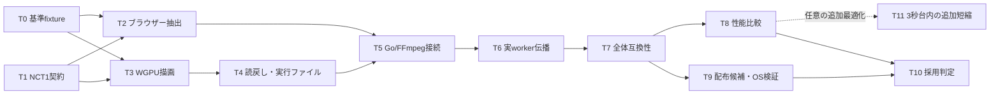

# ニコニココメント・タイムラインGPU合成 実行計画

> **For agentic workers:** REQUIRED SUB-SKILL: Use superpowers:subagent-driven-development or superpowers:executing-plans to implement this plan task-by-task. AGENTS.mdのSwarms手順に従い、依存を満たすwaveだけを実行する。主担当が結果を検証してから次のwaveへ進む。

**Goal:** コメント画像を再利用してGPUで移動させ、x264へ戻れる構成で、6秒・1080p30のコメント付き変換をエンコード込みで3秒台（中央値4秒未満）にする。各encoder/CPU条件を分けて実測し、移植性や未検証環境を混同しない。

**Architecture:** 固定版niconicommentsからコメント単位の画像と移動情報を抽出し、NCT1形式で専用Rust/WGPUヘルパーへ渡す。ヘルパーは透明RGBA面をGPU生成し、既存Nicoの直接パイプとFFmpeg overlay/encoderへ接続する。設定画面のGPU/CPU選択はNico workerまで伝え、GPUはNVENC、CPUはlibx264を選ぶ。NVENCが使えない/失敗した場合はCPU/libx264で自動再試行し、成功時に通知する。WGPUコメント合成の失敗とエンコーダー失敗は別に扱う。

**Tech Stack:** Go、埋め込みJavaScript、niconicomments上流0.4.1＋現行ローカル差分、Rust、wgpu **0.20.1**、WGSL、FFmpeg/libx264、任意のh264_nvenc、PowerShell、Python。

**Spec:** [精査済み設計書](../specs/2026-09-23-niconico-comment-timeline-wgpu-design.md)

状態: T0–T6の実装と主要package検証は完了。T7の実GPU位置readbackはPASS、透明領域・描画順も完全一致。一方、手動補間shaderはsoftware browser参照で360フレーム中352px、RTX/ANGLE D3D11参照で19pxが許容差1を超え、品質gateは未受入れ。整数4-tap補間＋8-bit round-to-even候補はsoftware参照の超過を4pxまで減らしたが、hardware参照では13,627pxが超過したため不採用。hardware linear samplerも両参照を同時に満たさず破棄した。production shaderはSHA `09022d0d...e9777`へ戻し、再ビルド・helper試験を通した。T8 fresh worker SHA `0d29c07f...baf0`の実コメントMP4+HLS tee 1080p30・6秒・5回測定では、CPU上限なしのNVENC/ring3とx264/ring2のconvert中央値が2.132秒/2.471秒。CPU20%を試験中だけJob Objectで適用した場合は3.197秒/5.786秒となり、通常運用にはCPU制限を設定しない。worker SHA `6a31f91c...56c62b`と`3008c30e...`の値は過去checkpointとして分離する。T11の速度最適化は上限なしの現行性能では追加不要。GPU/CPU選択、NVENC→x264再試行、WGPU失敗時の通知付きCPU描画fallbackは実装済み。2026-09-25の最終レビューで見つかったFFmpeg premultiplied-alpha metadata、renderer/encoder/output error分類、capture時のencoded asset保持は修正し、nicorender/video全体、workerとfallback UIの対象テスト、FFmpeg画素回帰、Vulkan synthetic MP4/HLS統合を再実行した。さらに2026-09-25に同じfresh workerで1080p30 x264/NVENC、1080p60 x264、720p60000/1001 x264、960×720 x264、720×720 x264の実コメントworker→WGPU→FFmpeg→MP4/HLSを各1回実行し、frame count/PTS/full decodeを確認した。T9はWindows RTX 5070 Tiでfresh release helper、明示path/embedded起動、manifest/tamper、共有ロック中のcleanup retryを検査済み。AMD/Intel/Apple Silicon/Linux実機は未検証。厳密pixel gateと広いGPU/OS受入れが残るため、通常のWGPUコメント合成経路は引き続きdefault-off。作成日: 2026-09-23、実行更新: 2026-09-25。

## 残作業を進める順序

1. **T7 — 出力・障害の受入れ (継続中):** software参照4px超過まで改善する整数shader候補もhardware参照で13,627px超過したため退けた。現在のstrict結果はsoftware 352px、ANGLE/D3D11 19pxが許容差1超過。閾値は変えない。720p/1080p・30/60fps・59.94fpsとaspect違い、実コメントMP4/HLS、device lost/promotion failureの組合せを引き続き検査する。既存成果物保護と子プロセス終了を維持する。
2. **T8 — 性能比較 (基本セル完了):** 現行worker SHAのNVENC/x264・CPU上限なし/CPU20%模擬の5回計測、およびMP4-onlyのコメントなし比較を完了。取得run、長尺、高密度、補助解像度/FPS、fallback率、GPU/RAMを追加計測し、ネット時間はローカル判定から分離する。
3. **T9 — 配布候補とOS別実機 (Windows NVIDIA一部完了):** Windows RTX 5070 Tiでhelper/hash/embedded/tamper/cleanupを検査済み。AMD/Intel、macOS arm64/Metal、Linux/Vulkanの実機を用意できた範囲で試し、未所有機種は未検証のまま残す。
4. **T10 — 最終レビュー (実装指摘反映済み、受入れ判定は保留):** reviewで確認したalpha metadata、renderer/encoder/output error分類、capture memoryの指摘を修正し、対象テストで再確認した。実コメントのworker→MP4/HLS E2EはWindows/NVIDIAの6セルまで確認済み。残る画素gate・実browser/GPU matrix・他OS/GPU実機の証拠を結び付ける。T7/T9資格が残る間はWGPUを通常経路へ昇格しない。

T11は、初回の実workerが4秒基準を外れたため計測を再開した。現行worker SHAの再計測はNVENC/x264・CPU上限なし/CPU20%模擬の各5回で3秒未満となったため、capture再利用やhandoff縮小の追加実装は保留する。速度結果を理由にT7画素gateやT9 portability条件を緩めない。

## Global Constraints

- CPU20%相当の制約は性能試験でゲーム実行中の余力を模擬する用途にだけ使う。製品の通常実行にCPU使用率上限を設けない。
- 共有エンコーダー設定はGPUを既定にし、CPU選択はlibx264を明示する。Nico workerではGPUをNVENCへ、CPUをx264へ対応付ける。NVENC固有の初期化/実行失敗ではx264を一度だけ再試行し、ユーザーへ切替通知を返す。コメント合成障害やキャンセルをエンコーダーフォールバック理由にしない。診断用`IMAGEPAD_NICO_ENCODER`で明示固定した場合はその選択を維持する。
- コメント評価時刻は`floor(frameIndex * FPSDen * 100 / FPSNum)`。
- x264は`sliced-threads=0:slices=1:slice-max-size=0:slice-max-mbs=0`を維持する。
- RTSP向けH.264では全アクセスユニットが厳密に1 VCLスライスという既存契約を維持する。
- `Backend=timeline`はWGPUを強制試行するが、キャンセル以外の失敗では元コメントを保ったCPU描画経路へ一度fallbackして通知する。`Backend=auto`では`TimelineEnabled=true`のときだけ新経路を先に試し、通常の`auto`ではdefault-offを維持する。encoder選択は合成fallbackと独立し、NVENC失敗時は別契約でx264を再試行する。
- 共有checkoutの未コミット差分を保持する。commit/push/release、稼働中配信の停止はこの計画の実行に含めない。
- `docs/RTSP_H264_COMPATIBILITY_CONTRACT.md`を実装前に読む。回帰テストの削除・閾値緩和で合格にしない。
- shellは`rtk`経由。コード発見はknowledge graph優先、現行Nicoがindexにない場合はlean-ctx/`rg`を使う。性能試験中は他の重いビルド/テストを並行実行しない。
- 外部ハードウェアがない行は「未検証」と記録する。ビルド成功をAMD/Intel/Apple Siliconの実機成功と呼ばない。
- 性能受入れは同一セル5回以上の中央値が4秒未満であること。最大値・p95・全サンプルを残し、x264/NVENC・CPU20%模擬/上限なしを独立して扱う。

## Review Focus

1. 負のコメント時刻、59.94fps、動画終了直前の1フレームで既存の切り捨てと一致すること。T0/T1/T7。
2. 同一画像をA→B→Aの順に重ねた半透明描画、上下方向、タイル分割で見た目が変わらないこと。T2/T3/T7。
3. 0件、可視0件、未来の投稿時刻なのに早出しで表示中のコメント、未対応効果入りを混同しないこと。T2/T5/T7。
4. EOF切断、device lost、FFmpeg閉鎖、cancel、既存MP4/HLSありの場合に部分成果物を公開しないこと。T4/T5/T6/T7。
5. 開発用の明示パスと埋め込み実行ファイル、実workerと直接呼び出し、CPU20試験と通常運用で異なる経路を誤認しないこと。T6/T8/T9/T10/T11。

## 1. 精査結果と実装境界

| 確認した現行コード | 計画への反映 |
|---|---|
| `internal/niconico/timeline.go`と`assets/sprites.js`はmsからvposへ切り捨て | マイクロ秒で滑らかに動かす変更を取り除く |
| `bundle.js:getPosX`はHTML5通常コメントでアフィン移動、`getCommentPos`は遅延配置 | 元の配置を一度確定。コメント数に応じた抽出を行う |
| `TIMELINE_COMMENT_SORT`はowner→index、WebGLはpremultiplied alpha | 並べ替え禁止、捕捉したprimitive順・投影・alphaを維持 |
| `niconico_args.go`はCPU側のFFmpeg overlayを含む | 今回のWGPUは透明コメント面。映像デコードやoverlayもGPUへ移したと説明しない |
| コメントtextureの再利用だけでは出力フレーム毎のsurface生成/読戻しを消せない | 6秒1080p30でRGBA8約1.493GBのhandoffが残ることを性能報告に含める。追加最適化は任意枠T11で扱う |
| `playlist-compositord`は音楽用状態とWindows NVENC依存を持つ | コメント専用crateを新設し、音楽の状態やmain.rsを改修しない |
| `runNicoNativePipeTimedInDir`がRGBAを直接FFmpegへ渡す | Goの画像配列やbase64へ毎フレーム戻す経路を増やさない |
| workerのbackend入力検査はauto/native/browserのみ | RenderOptionsだけでなくRequest/workerの伝播も変更・試験 |
| `nicoWorkerCPUOptions()`は現在Percent=100 | 20%制限を製品側に戻さない回帰条件を置く |
| 現行productionテストは30fps/180枚の固定判定が残る | 60fps試験用に新しい有理数対応harnessを作る。既存試験を弱めない |

`NCT1`抽出とWGPU描画は一つの機能として同じ契約を使う。音楽、動画デコーダー、別encoderの新規対応は別機能へ広げない。初版は静的HTML5コメントを対象にし、Flash/NicoScript時間変化/ボタン/背景枠/plugin/debug/commentLimitはジョブ全体を既存経路へ戻す。

## 2. 依存関係と所有権



| wave | 作業 | 実行上の条件 |
|---|---|---|
| 1 | T0 / T1 | 別ファイルなので並行可能。T0は既存成果物の参照作成、T1は新形式のみ |
| 2 | T2 / T3 | T0/T1レビュー後。JS/Go抽出とRust描画の所有権を分離 |
| 3 | T4 → T5 → T6 → T7 | パイプ・再試行・workerは順番に主担当が統合 |
| 4 | T8 / T9 | T8で選んだ条件をT9へ渡す。OS別機でのT9は並行可。同じPCでは計測とビルドを重ねない |
| 5 | T10 | T7/T8/T9の証拠を主担当が確認して結論を作る。T11は今回の受入れをブロックしない |
| 任意 | T11 | 3秒台をさらに縮める追加最適化。別の性能目標が設定された場合に再開する |

実装担当へは「共有checkoutで他者の変更を戻さない、担当ファイル以外を編集しない、インターフェース変更は主担当へ返す」と明示する。T5/T6のプロセス管理・実worker統合と最終判定は主担当が所有する。review担当は読み取り専用とする。

`gpu/nico-compositord/src/lib.rs`の所有権はT1完了後にT3へ、T3完了後にT4へ渡す。各段階で自分のmodule公開宣言だけを追加する。`Cargo.toml`/`Cargo.lock`は各taskが自分の担当依存だけを更新する。T1はSHA parser依存、T3は`wgpu`/`pollster`/`bytemuck`、T4は自己検査JSON依存（必要な場合）を担当する。T0の`fixtures.json`とT1の`wire/`は別ファイルであり、同じtestdata配下を一括更新しない。

## 3. 共通インターフェース

T1でGo/Rustの型とワイヤー形式を固定する。T2以降が独自の別スキーマを増やしてはならない。

```go
type TimelineHeader struct {
    Width, Height, FrameCount, FPSNum, FPSDen uint32
    BundleSHA256 [32]byte
}
type TimelineAsset struct {
    ID, Width, Height uint32
    SHA256 [32]byte
    RGBA []byte // premultiplied, top-left, tightly packed
}
type TimelineDraw struct {
    AssetID uint32
    StartVPos, EndVPos, AnchorVPos int32 // Start <= t < End
    OwnerOrder, CommentIndex, PrimitiveIndex uint32
    Rect [4]float32
    Projection [16]float32
    Alpha float32
    AnchorX, SpeedX float64 // comment origin at anchor; signed pixels per vpos
}
type CommentTimeline struct {
    Header TimelineHeader
    Assets []TimelineAsset
    Draws []TimelineDraw
}
func TimelineVPos(clock niconico.FrameClock, frame int64) (int32, error)
func ValidateCommentTimeline(scene CommentTimeline) error
func WriteCommentTimeline(w io.Writer, scene CommentTimeline) error
func ReadCommentTimeline(r io.Reader) (CommentTimeline, error)
```

`Rect`/`Projection`は既存WebGLへの入力と同じfloat32。`AnchorX`/`SpeedX`は元エンジンから得るfloat64の位置/符号付き傾きで、GPUとの幾何比較にも使う。通常の左移動は元の正のspeedへ負号を付け、固定コメントは0とする。primitiveのXはAnchorVPosで捕捉した基準矩形に移動量を加える。タイルの局所offsetを失わない。

ワイヤーはlittle-endian、構造体のメモリdumpを禁止する。

| 部分 | 順番・長さ |
|---|---|
| header | `NCT1` 4B、headerBytes u32=80、width/height/frameCount/fpsNum/fpsDen/assetCount/drawCount各u32、bundleSHA256 32B、totalRawAssetBytes u64、flags u32=3（premultiplied＋top-left） |
| asset | recordBytes u32、その後id/width/height各u32、sha256 32B、RGBA `width*height*4`B。recordBytesは44＋画素byte数 |
| draw | 上のTimelineDraw順で128B。AssetID等はu32、時刻はi32、Rect/Projection/Alphaはf32、末尾2個はf64 |
| 終端 | headerの個数を読み終わった後はEOFのみ。余分なbyteを拒否 |

上限は設計書4.2と同一: 3840×2160、1,000,000フレーム、60fps以下、FPS分子/分母各1,000,000以下、画像1枚128MiB/16384角以下、画像合計256MiB、10,000資産、100,000描画。header/recordを検査してから確保する。全画像のハッシュと参照先を確認してから描画を開始する。

T2の成果物:

```go
type TimelineCaptureReport struct {
    RenderReport
    EligibleComments, UnsupportedComments, DrawCanvasCalls, ElementDrawCalls int
    TimelineDraws, TimelineAssets int
    AssetBytes int64
    BundleSHA256 string
}
var ErrTimelineUnsupported = errors.New("niconico timeline unsupported")
func CaptureCommentTimeline(ctx context.Context, snapshot niconico.Snapshot,
    options RenderOptions) (CommentTimeline, TimelineCaptureReport, error)
```

T4/T5の境界:

```go
type TimelineRuntimeOptions struct {
    Backend string // auto, dx12, vulkan, metal; empty -> auto
    ReadbackSlots int // 0 -> 3; explicit values: 1, 2, 3
}
func PrepareTimelineCompositor(ctx context.Context, configured string,
    options TimelineRuntimeOptions) (string, func(), error)
func encodeNicoTimeline(ctx context.Context, compositor, ffmpeg, source, output string,
    snapshot niconico.Snapshot, render nicorender.RenderOptions,
    enc NicoEncodeOptions) (NicoEncodeReport, nicorender.RenderReport, error)
```

`RenderOptions`へ`TimelineEnabled bool`、`TimelineCompositorPath string`、`TimelineReadbackSlots int`、`TimelineGPUBackend string`を追加。`Backend="timeline"`は強制試行だが、GPU描画失敗はキャンセル時を除いてCPU描画へfallbackする。`TimelineEnabled`はautoにだけ作用する診断設定で初期値false。`CompositorPath`は既存NPS3用の意味を変えない。workerのRequestには同じ型で`TimelineEnabled`/`TimelineCompositor`/`TimelineReadbackSlots`/`TimelineGPUBackend`を追加し、JSON名を`timeline_enabled`/`timeline_compositor`/`timeline_readback_slots`/`timeline_gpu_backend`とする。encoder指定とは独立である。

リング数は0→3、GPU backendは空文字→autoへ正規化し、列挙値以外は子プロセス起動前に拒否する。能力検査と実変換に同じ`TimelineRuntimeOptions`を渡す。autoはWindowsでDX12→Vulkan、macOSでMetal、LinuxでVulkanの順にhardware adapterを探す。明示指定では別APIへ黙って変更しない。要求値と実際のGPU backend/adapter/ring数を区別してreportへ記録し、autoの場合は実APIがこの許可集合に属することを照合する。

### 3.1 実ツール試験の起動条件

新しいGoのbrowser/GPU/実worker試験は`NICO_TIMELINE_INTEGRATION=1`で明示実行する。未指定ならskip理由を表示するが、指定後に必須ツールや入力が欠けた場合はFAILとする。既存試験のopt-in仕様は変更しない。

| 環境変数 | 用途 |
|---|---|
| `NICO_TIMELINE_HELPER` | T4で生成するヘルパーの絶対パス |
| `NICO_TIMELINE_FFMPEG` | 使用するFFmpegの絶対パス |
| `NICO_TIMELINE_BROWSER` | 任意。未指定時は既存のブラウザー検出を使う |
| `NICO_TIMELINE_SOURCE` / `NICO_TIMELINE_SNAPSHOT` | 実動画・性能試験の必須入力。fixture単体試験では不要 |
| `NICO_TIMELINE_ARTIFACTS` | 新規の試験出力ディレクトリ |
| `NICO_TIMELINE_READBACK_SLOTS` / `NICO_TIMELINE_GPU_BACKEND` | 試験harnessからRequest/RenderOptionsへ設定する値。製品はこの環境変数を読まない |

### 製品workerの明示設定

サーバーは次の`IMAGEPAD_NICO_*`設定をRequestへコピーする。設定なしでは従来経路を維持する。

| 環境変数 | 既定値 | 用途 |
|---|---|---|
| `IMAGEPAD_NICO_RENDERER` | 空（auto相当） | `auto`/`browser`/`native`/`timeline`の選択。`timeline`は強制試行で、失敗時はCPU描画へ切り替える |
| `IMAGEPAD_NICO_TIMELINE_ENABLED` | `false` | `auto`のときだけtimelineを先に試す |
| `IMAGEPAD_NICO_TIMELINE_COMPOSITOR` | 空 | NCT1 WGPU helperの明示パス（T9組み込み前の試作段階） |
| `IMAGEPAD_NICO_TIMELINE_READBACK_SLOTS` | 0（runtimeで3） | GPU readback ring 1〜3 |
| `IMAGEPAD_NICO_TIMELINE_GPU_BACKEND` | 空（auto） | `auto`/`dx12`/`vulkan`/`metal` |

設定値の誤りはworker起動前に拒否する。`NICO_TIMELINE_*`は試験harness用で、製品serverは読まない。

T3の実GPUテストは`#[ignore = "requires hardware GPU"]`を付けて通常の`cargo test`から分離し、`--ignored`指定で実行する。純粋なwire/時刻/並び順のテストは常時実行する。実機未所有のOS/GPUは未検証として残す。

### 3.2 停止期限

以下は新しいtimeline試行の契約とする。旧経路の期限や製品CPU予算は変更しない。呼出元のより短いdeadline/cancelを常に優先する。

| 対象 | 期限・受入れ条件 |
|---|---|
| 能力検査 | 現行nativeと同じ実行10秒、`WaitDelay`2秒。開始から12秒以内に戻る |
| ブラウザー抽出 | 試行開始から60秒で打切り。cancel後の後始末を含め65秒以内に戻る |
| NCT送信・GPU・FFmpeg | パイプ開始時、以後は完了フレーム数が増えた時に無進捗時計を更新。30秒進捗なしで`ErrTimelineStalled`。最終フレーム後のFFmpeg終了待ちも同じ期限 |
| 中断・無進捗検出後 | 250ms以下の監視間隔。検出後5秒以内に所有browser/helper/FFmpeg終了、producer終了、一時ファイル非公開を確認 |

同じprogress行の反復やログだけでは無進捗時計を更新しない。timeline試行用の子contextだけをcancelし、呼出元が生きている場合のCPU描画fallbackとユーザーcancelを区別する。deadlineを短く注入できるunit testに加え、T7でGPU応答停止/pipe詰まりを実時間の期限でも検証する。

## T0: 基準出力・測定範囲を固定する

- **id:** T0
- **depends_on:** []
- **owner:** 参照fixture担当
- **location:** 新規`internal/nicorender/timeline_reference_test.go`、新規`internal/nicorender/testdata/timeline/fixtures.json`、新規`scripts/experiments/nico-timeline/README.md`
- **description:** 現行WebGLのpremultiplied readPixels、時刻、コメントの配置/順序を新実装に依存しない参照として保存する。
- **validation:** 全180/360フレームを収録し、画像形式・入力hash・bundle実体hash・browser/FFmpeg版・出力条件がmanifestで再現できる。

- [x] 共有checkoutが開始時点ですでに広範なdirty状態だったことを記録し、restore/clean/stashを行わず、今回の所有ファイルだけを追加変更として扱う。sm9 snapshotとsourceはrepo外に維持し、パスとSHA-256をfixture catalog/manifestへ記録する。
- [x] 固定fixtureを用意する: ordinary HTML5各位置、同じ画像を使う重複、半透明A→B→A、改行/色/サイズ/長文タイル、負のvpos、早出し、非16:9、0件、可視0件、Flash/NicoScript/装飾/limitの未対応fixture。実スナップショットはsm9の362件をhashで固定する。
- [x] helper `loadTimelineFixture(t *testing.T, name string) niconico.Snapshot`と`captureTimelineReference(t *testing.T, snapshot niconico.Snapshot, options RenderOptions) TimelineReference`をこのテストファイルに作る。`TimelineReference`はフレーム番号、vpos、draw順、raw RGBAのhash/保存先を持つ。reference取得時だけ従来の全フレーム描画を行う。
- [x] 現行時計の基準ベクトルを固定する。負のmsをGoの整数除算で0方向へ丸めない。

```go
func TestTimelineReferenceClock(t *testing.T) {
    clock := niconico.MustFrameClock(30, 1)
    for i, want := range []int64{0, 3, 6, 10} {
        got := int64(math.Floor(float64(clock.CommentTimeMs(int64(i))) / 10))
        if got != want { t.Fatalf("frame=%d got=%d want=%d", i, got, want) }
    }
    if got := int64(math.Floor(float64(clock.CommentTimeMs(-1)) / 10)); got != -4 {
        t.Fatalf("negative vpos=%d", got)
    }
}
```

- [x] `rtk go test ./internal/nicorender -run '^TestTimelineReference(FixtureCatalog|Clock)$' -count=1`。GPU/browser捕捉はopt-inで実行し、fixtureの捕捉不足をPASSにしない。360 frameの実capture成功とmanifest/hashを確認した。
- [x] `convert_wall`は既存`EncodeNicoCommentedWithRenderer`呼出し直前から戻りまで、`ready_wall`はHLS確定まで、`verification_wall`は独立検査時間と定義する。T8へ渡す。

## T1: NCT1とGo/Rust間の契約を固定する

- **id:** T1
- **depends_on:** []
- **owner:** プロトコル担当
- **location:** 新規`internal/nicorender/timeline_format.go`、`timeline_format_test.go`、`timeline_clock_test.go`、新規`gpu/nico-compositord/Cargo.toml`/`Cargo.lock`/`src/lib.rs`/`src/protocol.rs`、新規`internal/nicorender/testdata/timeline/wire/`、新規`scripts/experiments/nico-timeline/make_wire_fixture.py`
- **description:** §3の型、serializer、validator、Rust readerを実装する。crate作成・依存固定はこの成果物に含める。
- **validation:** 同じgoldenをGo/Rustで読む。Go出力を独立Python struct.pack生成物と比較する。不正入力をメモリ確保前に拒否。

- [x] 最初に時刻、round-trip、切断、上限、重複ID、非有限値の失敗テストを書く（Go 28件/Rust 4件のRED確認を実施）。

```go
func TestTimelineVPos(t *testing.T) {
    clock := niconico.MustFrameClock(60000, 1001)
    for _, tc := range []struct{ frame int64; want int32 }{
        {-1, -2}, {0, 0}, {1, 1}, {2, 3}, {60, 100},
    } {
        got, err := TimelineVPos(clock, tc.frame)
        if err != nil || got != tc.want { t.Fatalf("%+v got=%d err=%v", tc, got, err) }
    }
}
```

- [x] `rtk go test ./internal/nicorender -run '^TestTimeline(VPos|Format)' -count=1`で未実装による失敗を確認し、§3の宣言を実装する。整数乗算はchecked計算、negativeはfloorにする。
- [x] Rustの`pub fn read_scene<R: Read>(reader: R) -> Result<Scene, Error>`と`pub fn frame_vpos(frame: i64, num: u32, den: u32) -> Result<i32, Error>`を実装する。Goと同じ128B draw/80B headerをオフセットで読み、repr(C)依存にしない。
- [x] T1のRust crateはwire parserとSHA-256に必要な最小依存（`sha2 = "0.10"`）で始め、protocol単体を確認する。Cargo.lockを生成し、以後`--locked`。WGPU、pollster、bytemuck、自己検査JSON用serdeは描画/runtimeを始めるT3/T4の担当が必要に応じ追加し、0.20.1を固定する。フォント/NVENC/music依存を追加しない。
- [x] wire契約用goldenは`wire-multidraw-33x19-3frames.nct`へ分離する。これは赤い不透明assetと半透明の青asset、負のstart、動くdrawを含み、Go/Rustで同じ内容へparseする。全切断位置、unknown flags、欠落asset、巨大length、EOF切断も検証する。
- [x] GPU/readbackの純赤用`red-33x19-3frames.nct`は別sceneにする。赤asset 1個とdraw 1個だけを3フレーム静止表示し、画素座標rect `[0,0,33,19]`をpixel-to-clipのorthographic projection（Xは`2/33`、Yは`-2/19`、平行移動`(-1,+1)`）で面全体へ変換する。wire parserの複雑なfixtureを全面赤の期待値に流用しない。
- [x] 上記Go試験と`rtk cargo test --manifest-path gpu/nico-compositord/Cargo.toml --locked protocol`を通し、wire仕様を確定する。Go全体は75件、Rust全体は5件が独立再実行で成功。仕様変更が必要ならT2/T3を開始する前に両言語と設計書へ同時反映する。

## T2: コメント単位の抽出器を作る

- **id:** T2
- **depends_on:** [T0, T1]
- **owner:** JS/Go抽出担当
- **location:** 新規`internal/nicorender/assets/timeline.js`、`timeline_capture.go`、`timeline_capture_test.go`、`timeline_capture_integration_test.go`
- **description:** 同じbundleと既存sprite捕捉scriptを組み合わせ、出力フレームごとのdrawCanvasを不要にする。
- **validation:** 各eligible commentの抽出は基準時刻+最大2 probeに固定し、フレーム数に比例して増やさない。6秒/30fpsの実ブラウザー統合で上限と描画対応を確認し、12秒/30・60fpsを含む全体matrixはT7で行う。未対応は明確に拒否する。

- [x] `CaptureCommentTimeline`と§3のreport/error型を作る。`writeRendererPage`/browserSession/`spriteCaptureScript`を再利用し、新しいprofileや外部JS取得を増やしていない。
- [x] `snapshot.RendererThreads()`を入力に使う。`__niconi.comments`/`getCommentPos`/`sortTimelineComment`の存在とbundle実体hashを検査し、配置を確定する。入力vposだけで対象外コメントを先に捨てない。
- [x] パース済み要素/設定/状態によるallowlistで設計書4.1の対応表を実装した。標準bundle既定の`commentPlugins`に固定版`NiconiComments.FlashComment`と同一のfactory/conditionがちょうど1件ある場合だけ未使用factoryとして許可する。`plugins`、実plugin instance、追加/未知factory、HTML5Comment以外の実comment要素は`ErrTimelineUnsupported`へ包む。未知機能、可視性の非連続、矩形shader/動的helper出力も拒否する。認証/取得失敗やデータ破損を0件として扱わない。
- [x] 各対象要素を基準vposで描き、既存捕捉器からprimitiveと画像を受け取る。動き検査用の最大2追加時刻で同じ画像/投影/alphaとXのアフィン変換を確認する。これはallowlistの代わりの推測器ではない。図形・tileの局所offsetとdraw順を保持する。
- [x] 同じdim/画素/hashの画像をdedupeし、NCT1資産へ変換する。取得前に寸法/予算を確認し、base64/解凍中にも制限する。削除されたブラウザーテクスチャのpixelをNCT側の所有権で保持し、textureIDの再生成だけで別画像扱いしない。
- [x] v1 fixtureには有効なRFC3339 `PostedAt`を入れ、browser生成のcomment数が選択済み入力数と一致することを確認した。bundle parserが日時不正等で入力commentを黙って捨てた場合は「正常な0件」にせず、parsed comment count mismatchをdata errorとする。

```go
func TestTimelineCaptureUnsupportedIsTyped(t *testing.T) {
    if os.Getenv("NICO_TIMELINE_INTEGRATION") != "1" {
        t.Skip("set NICO_TIMELINE_INTEGRATION=1 for browser-backed NicoScript detection")
    }
    snapshot, err := niconico.NormalizeSnapshot(niconico.Snapshot{
        VideoID: "sm9", SelectedForks: []string{"owner"},
        Threads: []niconico.Thread{{Fork: "owner", Comments: []niconico.Comment{{
            ID: "reverse-script", VposMs: 1000, PostedAt: "2026-09-23T00:00:00Z", Body: "@逆 全",
        }}}},
    })
    if err != nil { t.Fatal(err) }
    options := RenderOptions{Width: 640, Height: 360, DurationMs: 6000, FPSNum: 30, FPSDen: 1}
    _, _, err = CaptureCommentTimeline(context.Background(), snapshot, options)
    if !errors.Is(err, ErrTimelineUnsupported) { t.Fatalf("got %v", err) }
}
```

- [x] ordinary captureで初期化後`DrawCanvasCalls==0`、`ElementDrawCalls<=3*EligibleComments`、未知primitive拒否、入力とbrowser parsed comment数一致を確認した。0件/可視0件は正常な透明timeline。全イベントは元の`TIMELINE_COMMENT_SORT` owner→indexとprimitive順を保つ。
- [x] `rtk go test ./internal/nicorender -run '^TestTimelineCapture' -count=1`は8件成功。`NICO_TIMELINE_INTEGRATION=1`のopt-in実ブラウザー統合は5件成功（default plugin state、ordinary、no-visible、owner reverseを含む）。`rtk go test ./internal/nicorender -count=1`は83件成功。Node構文、gofmt差分なし。browser test用Chromeの終了を確認した。

## T3: 順序を保つWGPU描画器を作る

- **id:** T3
- **depends_on:** [T0, T1]
- **owner:** GPU描画担当
- **location:** 新規`gpu/nico-compositord/src/renderer.rs`、`scene.rs`、`timeline.wgsl`、`tests/render_contract.rs`、T1から引継ぐ`src/lib.rs`のmodule公開宣言
- **description:** GPUへ固定資産を登録し、時刻uniformだけで位置を評価する。音楽側crateは編集しない。
- **validation:** synthetic fixtureのRGBA、投影、上下方向、alpha、A→B→A順序と時刻境界が一致する。

- [x] テスト用`render_one_for_test`を`tests/render_contract.rs`に用意する。実helperはRGBAとadapter/backend名を返す。`red-33x19-3frames.nct`の最初の赤面テストは全channel `[255,0,0,255]`完全一致。`wire-multidraw-33x19-3frames.nct`はwire parse専用とし描画テストへ流用しない。alpha、motion、top-left、A→B→Aをorthographic projectionのtest-only scene helperで個別検証した。
- [x] T1の`Cargo.toml`へ`wgpu = "=0.20.1"`、`pollster = "0.3"`、`bytemuck = { version = "1", features = ["derive"] }`を追加しlockを更新して`--locked`にした。crate `src/lib.rs`へrenderer/scene moduleを公開した。JSON報告依存はT4で追加する。
- [x] `Renderer::new`、`Renderer::submit_frame`を実装した。`RendererError`はT1 protocol parserのErrorから独立した表示可能な描画/GPUエラー型。`GpuOptions`はbackend選択とsoftware adapter許可（初期false）を持つ。
- [x] `Rgba8Unorm`、premultiplied `One/OneMinusSrcAlpha`、linear/clamp、depthなし、同じprojection、top-leftを設定した。WebGL clip-space ZとWGPU Z範囲を合わせ、Yを二重反転しない。
- [x] WGSLでint32 vpos差を先に計算し、`start<=vpos && vpos<end`以外はprimitiveを退避。Xを逐次加算せず`rect.x + float(vpos-anchor)*speed`で評価する。shader係数と整数画素の動き/境界は局所試験済み。実GPU位置readbackのサンプルをfloat64参照と比較するopt-in testを追加した。全frame・全コメントの受入れ判定はT7に残す。
- [x] 1秒区間の候補集合をstart/end indexから作り、owner/index/primitive順のrender bundleを保持した。隣接同一textureだけをまとめ、区間cacheは2個まで。全動画の各フレームdraw listは生成しない。未知GPU limitsは作成前に未対応を返す。

```rust
#[test]
fn owner_order_must_not_be_texture_order() {
    let order = vec![(0_u32, 0_u32, 7_u32), (0, 1, 9), (1, 2, 7)];
    let runs = nico_compositord::scene::contiguous_texture_runs(&order);
    assert_eq!(runs, vec![(7, 0, 1), (9, 1, 2), (7, 2, 3)]);
}
```

`contiguous_texture_runs(&[(u32,u32,u32)]) -> Vec<(u32,usize,usize)>`の入力は既にowner/index順、末尾要素はtexture ID、戻り値はID/start/endである。画像IDでsortしてはならない。

- [x] `rtk cargo test --manifest-path gpu/nico-compositord/Cargo.toml --locked --test render_contract -- --ignored --nocapture --test-threads=1`を実GPUで実行（RTX 5070 Ti / Vulkan: 4 passed）。`rtk cargo test --manifest-path gpu/nico-compositord/Cargo.toml --locked`は9 passed/4 ignored、`cargo fmt --check`も成功。純粋な順序/区間テストも通常suiteで成功。

## T4: 読戻しリング・CLI・能力検査を実装する

- **id:** T4
- **depends_on:** [T3]
- **owner:** 主担当またはGPU担当。子プロセス管理の判断は主担当
- **location:** 新規`gpu/nico-compositord/src/readback.rs`/`main.rs`、T3から引継ぐ`src/lib.rs`のmodule公開宣言、新規`internal/nicorender/timeline_runtime.go`/`timeline_runtime_test.go`、新規`scripts/test-nico-timeline-compositor.py`
- **description:** stdin=NCT1、stdout=RGBA、stderr=既存進捗形式を実装し、出力詰まりにも上限付きで動かす。
- **validation:** 33px幅のrow padding、出力順、再利用タイミング、EOF、broken pipe、cancel、device lostで破損フレーム/残留プロセスを生まない。

- [x] CLI `--self-test`、`--stdin`、`--backend auto|dx12|vulkan|metal`、`--readback-slots 1|2|3`、任意の`--report <path>`を実装した。自己検査JSONは`schema=1, protocol=NCT1, renderer=wgpu, version, backend, adapterName, adapterType, readbackSlots, maxTextureDimension2D`と実描画/読戻し結果を含む。`--stdin`のstdoutへログを出さない。report指定時は実変換プロセス自身のadapter/backend/slotsと完了frame数を64KiB以内JSONへ保存し、初期化/終了時にatomic replaceする。
- [x] `padded_bytes_per_row`とslot状態`Free→Submitted→Mapped→Writing→Free`を実装した。`COPY_DST|MAP_READ`、map callback、`Device::poll`の0.20.1 APIを使い、writerの出力完了とunmap後だけslotを再利用する。完成キュー2枚、ring最大3枚でGPU進行とwriterを分離した。
- [x] GPU submitの所有者を1つにした。map callback後にslot ID/sequence/`Arc<Buffer>`をwriterへ渡し、mapped viewはwriter thread内だけで使う。行paddingを外してbounded 1 MiB writer bufferからframe単位でflushし、view破棄→unmap→slot返却する。Writing中のslotを保持し、出力詰まり時もring数以上のframeを複製しない。満杯待機中はGPU pollを続け、毎frameの`Maintain::Wait`は置いていない。

```rust
#[test]
fn readback_padding_is_removed_before_stdout() {
    assert_eq!(nico_compositord::readback::padded_bytes_per_row(33).unwrap(), 256);
    assert_eq!(nico_compositord::readback::padded_bytes_per_row(1920).unwrap(), 7680);
}
```

- [x] 全frameをsequence順にwrite_allし、frame flush成功後だけ`NICO_PROGRESS completed total`をstderrへ出す。全frameと最終flush成功後だけ`NICO_DONE total`を出す。遅い消費側にもslot/queue上限を保つ。
- [x] T1の`red-33x19-3frames.nct`をCLIに入力し、出力長`33*19*4*3`、3frame同一hash、stderrの順序を検査する。truncated/trailing inputは出力前に拒否し、DONEを出さない。wire multidraw fixtureはparser専用のままにした。
- [x] `PrepareTimelineCompositor`は明示パスを絶対化し、10秒 probe + 2秒 drain上限でジョブ所有の自己検査を実行する。正規化したbackend/slotsをself-testと本実行の両方へ渡す。NPS3/未知ABI/software adapter/自己検査fixtureやtexture limit不足を拒否する。Windowsでは既存`hideNativeWindow`を使用し、ユーザーPCでRust build/downloadしない。未同梱時はErrUnavailable。
- [x] `rtk cargo test --manifest-path gpu/nico-compositord/Cargo.toml --locked`（16 passed/4 GPU tests ignored）、GPU opt-in render contract（4 passed）、`rtk go test ./internal/nicorender -count=1`（95 passed）を確認した。`cargo fmt --check`とPython構文検査も成功した。`cargo build --release --locked --target-dir build/nico-timeline`はsuccess。
- [x] `rtk proxy python scripts/test-nico-timeline-compositor.py --helper build/nico-timeline/release/nico-compositord.exe`は`--backend vulkan`と`--backend auto`の両方でPASS。Windows RTX 5070 TiでVulkanとDX12を使用。ring1/2/3は同じRGBA、truncated/trailing、broken pipe、backpressure cancelを検査した。各runは30秒上限、中断後5秒以内終了。Goからの実release helper self-testもexplicit Vulkanとautoで成功。

## T5: Goの変換パイプへ接続する

- **id:** T5
- **depends_on:** [T2, T4]
- **owner:** 主担当
- **location:** 新規`internal/video/niconico_timeline.go`/`niconico_timeline_test.go`、変更`internal/video/niconico_pipeline.go`、変更`internal/nicorender/render.go`、新規`internal/video/niconico_timeline_lifecycle_test.go`
- **description:** 新backendを既存FFmpeg引数生成と直接パイプへ接続する。旧nativeの呼出しやhelper ABIを変更しない。
- **validation:** encoder選択の独立、default選択の維持、既存出力保護、1回だけの再試行、cancel時の再試行禁止を確認。

- [x] `RenderOptions`へ§3の追加フィールドを入れる。選択関数`timelineSelection(backend string, enabled bool) string`を作り、戻り値を`legacy`/`required`/`try`とする。

```go
func TestTimelineSelection(t *testing.T) {
    for _, tc := range []struct{ backend string; enabled bool; want string }{
        {"auto", false, "legacy"}, {"auto", true, "try"},
        {"timeline", false, "required"}, {"browser", true, "legacy"},
        {"native", true, "legacy"},
    } {
        if got := timelineSelection(tc.backend, tc.enabled); got != tc.want {
            t.Fatalf("%+v got=%s", tc, got)
        }
    }
}
```

- [x] `encodeNicoTimeline`でオプション検査後にcapture/scene validateとruntime prepareを独立に進め、両方の成功を待ってFFmpegを開始する。片方の失敗時はもう片方もcancelして終了を待つ。自己検査と本実行のGPU初期化は両方とも計測に含める。capture終了時のbrowser cleanupとscene所有権を明確にし、不要な大きいbyte配列の複製を作らない。
- [x] `runNicoNativePipeTimedInDir`へNCT1 producerと`--stdin --backend <value> --readback-slots <n> --report <job-owned-path>`を渡す。producerのRenderReport.FrameCountは予定出力数とし、完了数はhelperのprogress/DONEで検証する。FFmpeg引数は`nicoEncodeArgs`そのものを使う。動画本体をGoへ展開しない。
- [x] timeline側のprogressラッパーと子contextで§3.2の無進捗監視を実装する。既存パイプ関数のABIは変えない。watchdog終了もjoinし、呼出元cancelと`ErrTimelineStalled`を別の原因として保存する。最終フレーム後にもencoder終了まで監視を続ける。
- [x] `NicoEncodeOptions.Encoder`をそのまま使い、timeline選択をNVENC指定へ変換しない。libx264または明示encoderの能力不足をencode前に明示する。preset/threads/CRF/GOP/audio/slicesは既存条件を保つ。
- [x] 試行ごとに専用MP4/HLS stagingを割り当てる。新経路失敗時は全子プロセスの終了を待ち、当該stagingだけを破棄して旧選択へ1回戻す。既存の`createNicoFallbackOutput`/`promoteNicoFallbackOutput`/tee用promotionと整合させる。既存成果物の上書きは全検査成功後だけ。
- [x] failure injectionで「RGBA数枚後にdevice lost」「FFmpeg先行終了」「snapshot不正」「キャンセル」「最終MP4/HLS置換失敗」をテストする。cancel時のfallback呼出し回数0、通常失敗は1、成功frame数は正確、表示進捗は逆戻りせず完了は最終試行にのみ対応することをassertする。
- [x] helper自身の`--report`出力を上限64KiBで読み、実backend/adapter/ring数と完了数を検証する。成功時の欠落や要求との不一致を成功扱いしない。Go reportへhelper hash、bundle hash、retry理由、段階時間を加え、失敗試行の時間を捨てない。reportファイルもその試行のstagingで管理する。
- [x] `rtk go test ./internal/video -run '^Test(NicoTimeline|NicoProduction|NicoNative)' -count=1`と`rtk go test ./internal/nicorender -count=1`。外部toolを要する既存opt-inケースはT7で別途動かす。

## T6: 実workerへ設定・結果を伝播する

- **id:** T6
- **depends_on:** [T5]
- **owner:** 主担当
- **location:** 変更`internal/nicoexportworker/protocol.go`/`worker.go`、変更対応テスト、新規`internal/server/niconico_timeline_worker_test.go`、必要な任意診断フィールドのみ`internal/nicoexportworker/protocol.go:Event`
- **description:** helperパスと有効化フラグが実際の子workerへ届き、結果の実経路も取り出せるようにする。
- **validation:** 親→Request→worker→renderer→Eventの往復、旧Requestとの互換性、通常CPU100、既存ジョブ進行/中断を確認。

- [x] Requestへ§3の4フィールドを追加し、backend検査へ`timeline`を追加する。既存のNPS3用Compositorと区別する。`worker.go`からRenderOptions→TimelineRuntimeOptions→helper引数へ明示伝播し、ring1/2/3とbackend指定の往復をテストする。不正なring/backend値は起動前に拒否する。
- [x] workerの完了Eventにoptionalなrenderer/backend/adapter/hash情報を付ける。UIへローカル絶対パスやコメント本文を出さない。現行のRunID/MediaID一致検査、event長上限と旧Request既定値を保つ。
- [x] injected `nicoExportWithRenderer`が受け取る引数を検査する既存worker testの形式で、`timeline`/`auto+enabled`/旧Requestを3ケース追加する。最後に実テストexeでRequestを読み込むケースを実行する。
- [x] サーバー側には通常実行が`nicoWorkerCPUOptions().Percent==100`である回帰検査を追加する。テストrunnerのCPU20はRequestへ書き戻さない。実workerの結果からtimelineとencoderの組を識別できることを検査する。

```go
func TestTimelineDoesNotSetProductionCPU20(t *testing.T) {
    if got := nicoWorkerCPUOptions().Percent; got != 100 {
        t.Fatalf("production CPU percent=%d, want 100", got)
    }
}
```

- [x] `rtk go test ./internal/nicoexportworker -count=1`、`rtk go test ./internal/server -run 'Test.*Nico.*(Worker|Timeline|CPU)' -count=1`。実workerのopt-in試験では実行パスとhelper hashも成果物に残す。
- [x] WGPU失敗をworker errorで終わらせず、CPU renderer開始前に`timeline_fallback` progress通知を1回送る。最終Eventにもfallback理由の一般通知を残し、cancelでは通知もCPU再試行もしない。Pipeline/worker/UI向け単体試験を再実行した。

## T7: 全フレームの互換性・失敗復旧を検証する

2026-09-24の部分実施: RTX 5070 Ti/Vulkanで実GPU position readbackを12 frames/48 active vertices試験し、最大誤差0.000162760pxを確認した。実時間30秒watchdogではtest subprocessの回収、既存MP4/HLS hash保持、staging残留なしを確認した。全frame・複数解像度/FPS・実GPU device-lostを含む統合matrixは未完了。詳細はtimeline acceptance reportを参照。

旧worker SHA `3008c30e...`時点の追試記録: 実GPU位置readbackを360時刻と境界/長時間点で再実行してPASS。1280×720/30fps/360 framesのsoftware browser厳密比較は許容差1超過352px、共通透明領域267,142,121px完全一致。NVENC/ring3・x264/ring2のMP4+HLS tee worker中央値は4.215秒/4.720秒だった。別profileのMP4-only direct NVENC/ring3はno-comments/timeline中央値1.087秒/3.445秒、paired差2.358秒。これらは旧workerと当時の実験記録で、現行workerの値は次の更新と受入れ報告を参照。
2026-09-24の最新追試: 実GPU位置readbackを360時刻と境界/長時間点で再実行してPASS。software browser基準との厳密比較は許容差1超過352px、共通透明領域267,142,121px完全一致。ANGLE/D3D11をRTX 5070 Tiで動かしたhardware browser参照でも手動補間候補は19px超過。linear sampler実験はhardware参照で1px超過まで改善したが、software参照では14,091px超過したため採用せず、`timeline.wgsl`は元のSHA `09022d0d...e9777`に復元した。画素gateはFAILで、閾値は変更しない。現行worker SHA `6a31f91c...56c62b`のMP4+HLS tee各5回では、NVENC/ring3のconvert/worker wall中央値2.034/2.136秒、x264/ring2は2.337/2.442秒。CPU20%模擬でも2.034/2.104秒、2.489/2.557秒で、全セルが3秒未満。旧SHA `3008c30e...`の4.215/4.720秒は履歴値として分離した。最新のMP4-only direct paired no-comments/timeline中央値はNVENC 0.704/2.043秒（コメント追加1.360秒）、x264 0.977/2.382秒（1.374秒）。出力条件の異なるdirectとworker結果は混ぜない。

参照capture整理: software stream `f41651a2...de3`とANGLE/D3D11 stream `a8cb09e2...d2b`は同じscene条件でもpixel単位で異なり、13,150pxがchannel差1超、31pxが差2超（最大3）。±1の出力で両方へ同時適合できない31pxがあるため、既存software referenceをstrict acceptance oracleとして維持し、hardware captureは別診断として記録する。さらに1/512重みの360-frame候補はsoftware差超過356pxで現行352pxより悪く、1/128とUV微小offset候補もframe62で悪化したため破棄した。候補の再試験後、shaderとdebug helperを元の状態へ戻し、source hashを再確認した。

2026-09-24の追加: `compare.py`は共有透明領域の完全一致を報告し、`--require-transparent-exterior-exact`で不一致を許容値に関係なく失敗にする。RGBA fixtureで可視画素の許容差と透明領域の厳密差分を分離して検証した。opt-in browser/WGPU統合テストにもstrict flagとmetrics assertionを接続し、Go test compile-onlyで確認した。既存360-frame raw比較成果物にはこの指標がないため、実アーティファクトへの厳密比較は未完了のまま。

2026-09-24の追加: 全評価点をGPU readbackするdiagnostic testを、各vpos個別submitからframe-vpos配列を使う一括submitへ変更した。通常360時点に加えて区間開始/終了と長時間点も同じreadbackで確認する。shader契約テストはbinding追加前に期待どおり失敗し、Rust test compile後にPASS。実GPU実行はOBS FFmpeg停止待ち。

2026-09-24の追加: browser/WGPU統合試験でT7の解像度/FPS matrixを指定できるようにし、1280×720・1920×1080、30/60、60000/1001、960×720、720×720の設定と範囲外拒否をunit testした。`internal/nicorender`は131 tests PASS。これらの実browser/GPU matrix runは未実施。

T9のOS/GPU結果表を受入れ報告へ追加し、Windows/NVIDIAの部分検証とAMD/Intel/Metal/Vulkan別環境の未検証を区別した。別OS/別ベンダーを推測で合格扱いしない。

- **id:** T7
- **depends_on:** [T6]
- **owner:** 互換性試験担当。実プロセス操作は主担当が確認
- **location:** 新規`internal/video/niconico_timeline_integration_test.go`、新規`scripts/experiments/nico-timeline/compare.py`/`test_compare.py`、T0のfixture追加、出力`build/nico-timeline/verification/`
- **description:** NCT抽出、GPU描画、FFmpeg、MP4/HLS、実workerまでを一つの経路として検証する。
- **validation:** 全180/360frameの画素/時刻、正しいfallback、音声と1スライス、cancel/失敗後のclean状態を証拠付きで確認する。

- [x] `compare_rgba(reference: Path, candidate: Path, width: int, height: int, frames: int) -> dict`を作る。raw長不一致を拒否し、全frameのmax_channel_diff、超過pixel数、hash、差分画像を返す。透明領域が広いことを利用した全画面平均だけの合否にしない。

```python
def test_rgba_comparison_rejects_missing_last_frame(tmp_path):
    reference = tmp_path / "reference.rgba"
    candidate = tmp_path / "candidate.rgba"
    reference.write_bytes(bytes([255, 0, 0, 255]) * 2)
    candidate.write_bytes(bytes([255, 0, 0, 255]))
    with pytest.raises(ValueError, match="length"):
        compare_rgba(reference, candidate, 1, 1, 2)
```

- [x] 実GPUから読み戻した位置をfloat64参照と全評価時刻で数値比較する。fractional speed、長い経過時間、区間開始/終了を含めてX差≤1/256pxを確認する。RTX 5070 Ti/Vulkanのignored hardware testで360時刻と追加境界/長時間点を一括readbackしPASS。
- [ ] 時刻/所属区間/draw順/資産hashの一致、X差≤1/256px、premultiplied各channel差≤1、コメント外完全一致を独立に確認する。現状の360-frame比較は画素差とdraw順の証拠がある一方、GPU実位置/asset hash/コメント外完全一致を一つの検証として確認していない。
- [ ] 1280×720/1920×1080で30/60fps、60000/1001の境界、960×720/720×720のaspectを検査する。表示位置はFrameClockに従い、処理速度やsleepで調整しない。
- [x] unsupported fixtureは内部ではtyped errorとして最適化経路を終了し、auto+enabledで元コメントを保持したlegacy出力へfallbackする。強制timelineのWGPU失敗もCPU描画へfallbackする。可視0件は透明成功、legacy fallback/cancelは別々に検証する。
- [x] 実WGPU helper / Vulkanとsynthetic NCT1 sceneを使い、x264/NVENCそれぞれで音声有り/無しのMP4+HLS teeを実decodeする。フレーム数、映像PTS、音声有無/長さ、pix_fmt、faststart、HLS keyframe、全AUのVCL数1を検査する。
- [x] 実コメントsnapshotを実workerに渡し、WGPU→FFmpeg→MP4/HLSを一気通しする。2026-09-25にfresh workspace workerで1080p30 x264/NVENC、1080p60 x264、720p60000/1001 x264、960×720、720×720 x264を各1回実行。実backend/Vulkan、adapter、fallback、encoder metadata、MP4/HLS frame countと全decodeを検証。詳細は`docs/verification/niconico-comments/timeline-acceptance.md`の実コメント追試節。
- [x] T5のfailure injectionに加え、低速pipe、キュー満杯でcancel、GPU応答停止を模したhelper、helperの強制終了、先頭/末尾で切断を実プロセスで試す。無進捗30秒＋監視間隔250ms＋終了5秒以内、明示cancelから5秒以内をassertする。所有子プロセスの残留なし、既存MP4/HLSのhash不変、partファイルが公開されないことを確認する。元のGPUドライバーや他ジョブを停止して障害を起こさない。2026-09-24: blocked helperの30秒watchdog、slow-consumer cancel、1 byte/39 byteへの先頭・末尾切断をprocess fixturesで実施。GPU driver/device-lostそのものは停止せず、helper hangとして模擬した。
- [x] `NICO_TIMELINE_INTEGRATION=1 rtk go test ./internal/video -run '^TestNicoTimelineIntegrationEncodersMP4HLS$' -count=1`（FFmpeg/ffprobe/helper/backend opt-inを設定）、`rtk go test ./internal/nicorender -run '^TestTimelineCaptureIntegration$' -count=1`、`rtk pytest scripts/experiments/nico-timeline/test_compare.py`を実行。必須caseのskipを合格数へ入れない。

## T8: コメント有無と構成候補を実測する

- **id:** T8
- **depends_on:** [T7]
- **owner:** 主担当（このPC上では計測を直列実行）
- **location:** 新規`internal/video/niconico_timeline_performance_test.go`/`internal/server/niconico_worker_performance_test.go`、新規`scripts/experiments/nico-timeline/benchmark.ps1`/`summarize.py`/`test_summarize.py`、既存`cmd/nico-budget-runner`を使用
- **description:** 画質/encoder条件を揃え、構成別の所要時間・資源使用量・適用率を比較して最も効率的な候補を選ぶ。
- **validation:** 同一入力hash・同一出力条件、5回以上の生データ、予算の作用範囲、実backendが記録されている。同一セルの中央値が4秒未満なら性能受入れとし、最大値/p95/全サンプルも報告する。取得runを最低1回実施し、ネット取得計測はローカル比較と性能判定へ混ぜない。取得runを実行できない場合は理由と未検証状態を記録し、ネット取得時間まで検証済みとは扱わない。

- [x] `TestNicoTimelinePerformance`とその内部の`encodeNoCommentsForTest`を新規testファイルに作る。testは1回の起動で指定variantを1回だけ実行する。コメント有りはcapture→encodeの全経路、no-commentsはrendererを全く起動せず同じscale/pad/fps/x264またはNVENC/audio/mux条件で変換する。no-comment条件のFFmpeg引数差がraw overlay入力/filterだけであることをテストで検査する。Go benchmarkの自動反復に試行回数を任せない。
- [x] benchmark scriptの必須引数は`-Source -Snapshot -FFmpeg -Helper -OutputRoot`。任意引数は`-Repeats`（既定5）、`-Width`/`-Height`/`-FPSNum`/`-FPSDen`、`-Encoder x264|nvenc`、`-GpuBackend auto|dx12|vulkan|metal`、`-CpuPercent 0|20`（0はrunnerを使わない）、`-Browser`、`-LegacyHelper`。省略時の旧helper/browserは現行の検出規則を使い、実体hashを保存する。パスは実在検査し、出力先は試験ごとに新しい専用ディレクトリにする。
- [x] scriptが§3.1の環境変数を子testプロセスに設定し、`NICO_TIMELINE_VARIANT`で候補を選ぶ。解像度/FPS/encoderも`NICO_TIMELINE_WIDTH`/`HEIGHT`/`FPS_NUM`/`FPS_DEN`/`ENCODER`へ同じprefixを付けて渡す。ring値はvariantから決め、実reportと一致検査する。環境変数は現在のセッションへ永続化しない。
- [x] 計測の前に`rtk go test -c -o build/nico-timeline/video.test.exe ./internal/video`と`rtk go build -o build/nico-timeline/nico-budget-runner.exe ./cmd/nico-budget-runner`を完了する。T4のrelease helperを使い、ビルドはwall計測から除く。
- [x] 実workerのopt-in計測testを追加し、1回のworker Requestからterminal Eventまでの`worker_wall`、worker内`convert_wall`、backend/fallback、CPU予算、入力/worker/FFmpeg/helper/output hashをrunごとに記録する。5回繰返しは`-count=5`で独立run directoryへ出力する。default skip・compileと時計unit testsはPASS。
- [x] 旧worker SHA `3008c30e...`でworker tee pathを各5回測定。fallbackは各0/5。NVENC convert median/max/p95=4.215/5.736/5.736秒、x264=4.720/4.892/4.892秒。これは旧workerの履歴値。
- [x] MP4-only direct pathでもno-commentsとNVENC/ring3を5組paired測定。medianは1.087秒/3.445秒、comments overhead median 2.358秒。4秒基準はPASS。stage medianはcapture 1.675秒、runtime prepare 0.505秒、encoder probe 0.154秒、helper pipe 1.720秒。capture/runtime/pipeはwall上で重なるため合算しない。
- [x] worker result Eventへstage timingを追加し、fresh worker SHA `6a31f91c...56c62b`を再build。MP4+HLS tee / 1080p30 / 6秒 / helper `08ce74c4...afd05` / FFmpeg `72a489ec...e6aa3` / 同一source・snapshotで5回ずつ実測。CPU上限なしconvert median/max/p95はNVENC 2.034/2.144/2.144秒、x264 2.337/2.758/2.758秒。worker wall medianは2.136秒/2.442秒。CPU20%模擬もconvert 2.034秒/2.489秒、fallbackはいずれも0/5。各runのworker SHA/helper SHA/CPU条件を記録し、異なるworker SHA間の速度差はコード最適化の因果効果と断定しない。
- [x] CPU上限なしのMP4-only paired no-comments/timelineをx264とNVENC各5組再実施。NVENC median 0.704/2.043秒、paired comment overhead 1.360秒。x264 median 0.977/2.382秒、paired overhead 1.374秒。worker teeとMP4-only directは別profileのまま扱う。
- [x] worker stage medianからcritical pathを確認。NVENC capture 0.957秒、runtime prepare 0.310秒、encoder probe 0.045秒、helper pipe 1.013秒。capture/runtime/probeは並行開始し、helper pipe内のcompositor 0.928秒とFFmpeg 1.012秒も重なるため加算しない。
- [x] 上限なしのx264とNVENC各々で`no-comments / browser / native / timeline-slots1 / timeline-slots2 / timeline-slots3`を5回測る。CPU20%はx264 ring2/ring3とNVENC ring3をno-comments基準と5回ずつ比較した。固定seedで交互実行し、fallbackが発生した計測をtimeline成功へ混ぜない。
- [ ] 任意の`-IncludeAcquisition` runでは既存の動画/コメント取得経路を通し、専用stagingへ取得してからコメント付き変換を1回実行する。ネット取得を含めた実行は行っていない。ローカル変換の4秒判定へネット時間を混ぜない。
- [x] CPU20は`rtk proxy <nico-budget-runner.exe> --cpu-percent 20 --record <run.json> --close-stdin -- <video.test.exe> -test.run '^TestNicoTimelinePerformance$' -test.count=1`で外側からかけた。worker・browser・helper・FFmpegの全子プロセスがJob Object対象であることをrunner recordで確認した。stdin転送は既定のまま保つ。
- [x] manifestへCPU/GPU/driver/OS、FFmpeg/helper/source/snapshot hash、解像度/FPS、FFmpeg引数、CPU条件、backend/encoder/ring、conversion/verification/stage時間、frame数、codec/pix_fmt、file size/hashを保存した。GPU使用率、ピークRAM、およびacquisition計測は未取得。並列stage時間はwall timeへ足していない。
- [x] 6秒1080p30を主比較として、x264 veryfastとNVENC p4を別セルで測った。
- [x] 720p30/60、1080p60、長尺154.955秒（snapshotのピーク16コメント/秒区間を含む）の補助比較を各主セル5回で実施する。NVENCは3条件すべて4秒基準以内、x264は720p60と1080p60で超過。
- [x] 統計関数`classify_times(seconds: list[float], limit: float = 4.0) -> dict`を実装する。5回未満はinsufficient、5回以上で中央値が4秒未満ならtarget_met。中央値・最大・nearest-rank p95を返し、遅い試行も合否表示から隠さない。負数/NaN/Infを拒否する。コメント追加時間は別関数`paired_comment_overhead(with_comments: dict[str, float], without_comments: dict[str, float]) -> dict`で同じcell/反復IDの差分を返す。ID不一致は拒否し、負の差を0へ丸めない。

```python
def test_median_below_four_seconds_passes_and_keeps_slow_outlier_visible():
    result = classify_times([3.199, 3.4, 3.555, 3.8, 4.116])
    assert result["target_met"] is True
    assert result["median"] == 3.555
    assert result["maximum"] == result["p95"] == 4.116
```

- [x] 以前のdirect benchmarkとworker SHA `3008c30e...`の値は履歴として残す。worker SHA `6a31f91c...`のMP4+HLS teeではNVENC/x264・CPU上限なし/CPU20%模擬の5回セルすべてでconvert中央値3秒未満、fallback 0/5だった。これは過去checkpointとして保持し、現行fresh worker SHA `0d29c07f...`は次の別計測で記録する。MP4-only paired runもコメント追加中央値を記録し、出力条件を混ぜない。CPU20%は試験条件だけにする。`benchmark.ps1`の集計limitは4秒。
- [x] fresh worker SHA `0d29c07f...`で実コメントMP4+HLS teeの1080p30をx264/NVENC、CPU上限なし/CPU20%の4セル各5回測定した。上限なしconvert中央値は2.471/2.132秒、CPU20%外側Job Object試験は5.786/3.197秒、全セルfallback 0/5。CPU20はrunner recordでrate 2000と平均sample 20.10%/19.23%を確認し、製品実運用へ設定していない。全run記録と出力hashはtimeline-acceptance.mdに記載。

## T9: OS別の実行ファイル・配布候補を検査する

- **id:** T9
- **depends_on:** [T7]
- **owner:** 配布候補担当。配信/リリース操作は行わない
- **location:** 新規`scripts/build-nico-timeline-compositor.ps1`/`build-nico-timeline-compositor.sh`/`nico_timeline_manifest.py`、新規`internal/nicorender/timeline_payload.go`/`timeline_payload_embedded.go`/`timeline_payload_stub.go`、`timeline_runtime.go`およびpayload unit test、`scripts/experiments/nico-timeline/README.md`
- **description:** 明示パスだけで動く試作品から、hashと対象OS/archを検査して使用できる配布候補へ進める。
- **validation:** 実バイナリのhash/ABI/OS/arch/実描画self-testを検証。改ざん・違うarchitecture・未同梱を拒否し、明示fallbackできる。

- [x] local build scriptsはT4のlocked release buildを共通化し、manifestへschema/protocol/OS/arch/hash/wgpu versionを記録する。fresh Windows amd64 release helperは2026-09-24にbuildし、RTX 5070 Ti/Vulkan self-testをPASS。payload SHA-256 `08ce74c4567a124b0edb9c0a1a3a27aaccf15ed6f1fb4addc9972859b93afd05`。
- [x] 明示pathとembeddedの両方をWindows RTX 5070 Ti/Vulkanで試した。embedded runtime 5回、manifest tamper/target mismatch 5回、materialize/hash cleanup 5回でPASS。Windows sharing violationの一時ロック再現テストも5回PASS。AMD/Intel/Metal/Vulkan別OSの実機結果には外挿しない。現行NPS3 payloadのhashとテストを保つ。
- [ ] Windows NVIDIA/AMD/Intel、macOS arm64 Metal、Linux Vulkanを結果表にする。各実機はx264でframe/color/alpha/PTSを検査し、ハードウェアencoderは能力があるときだけ追加する。同じWGSLのコンパイル成功だけで全GPU成功にしない。
- [ ] macOSはMac上でnative buildと実行、Linuxも対象環境で実行する。手元にない機種は未検証と記録し、実機行が揃うまでそのOS/GPUの対応を宣言しない。既存アプリ/browser/FFmpegの起動可否も含める。
- [ ] `PrepareTimelineCompositor`のembedded対応を追加した差分について、T4/T7の関連ケースだけを再実行する。ライセンスnoticeと依存lockを同梱候補へ加える。release workflowや稼働中exeは更新しない。

## T10: 採用条件と残る制限を報告する

T7の厳密画素gateと解像度/FPS・実コメントMP4/HLS matrix、T9の別OS/GPU実機検証が未完了のため中間検証レポートとする。fresh workerの1080p30 no-cap n=5ではNVENC/x264とも中央値3秒未満。test-only CPU20%条件ではNVENC中央値3.197秒、x264 5.786秒で、通常経路へCPU制限は加えない。WGPUはdefault-offを維持し、速度だけで候補を選ばず画素gateを通るportable案を検証する。

- **id:** T10
- **depends_on:** [T8, T9]
- **owner:** 主担当。計画/実装の独立review結果も統合
- **location:** 新規`docs/verification/niconico-comments/timeline-acceptance.md`、本計画のチェックボックス、設計書の状態
- **description:** 最速候補、品質、fallback適用率、3秒台の性能条件、未検証環境を一つの証拠索引へまとめる。
- **validation:** 結論から生データ/実行コマンド/hashへ辿れ、CPU20/無制限・encoder別・実機別の結果が混ざらない。

2026-09-24 23:54 JSTの再確認: `cargo build --locked`は復元済みproduction shaderを含め1 crate再コンパイルしてPASS。`cargo test --locked` 18 passed/5 ignored、helper Vulkan ring 1/2/3・入力異常・backpressure/cancel PASS、Go nicorender/workerとCPU fallback/upload通知/UI通知テストPASS、Python manifest/compare/summarize 25 passed、設定済みFFmpeg/ffprobe/helperを使うsynthetic MP4+HLS統合5 case PASS (5.276s)。full server suiteはディスク不足の履歴があり、今回も空き容量が少ないため実施していない。厳密なbrowser/GPU matrix、実コメントE2E、取得/長尺/高密度、AMD/Intel/Metal/Linuxは引き続き未完了。WGPU default-offを維持し、今回の状態は最終採用ではなく中間検証として扱う。

- [x] 今回触ったNico関連tracked diffに`rtk git diff --check`を実行し、関連Go、Rust/Pythonのpackage試験とscript syntaxを確認した。
- [ ] 最終採用判定前にT0–T9のtask diffを担当境界と突き合わせる。広範な共有checkout差分は変更しない。
- [x] reportにコメント有無の差、旧方式からの短縮率、3秒台の性能受入れ結果、支配stageを記載した。GPU readback/FFmpeg handoffの残りを数値で示した。
- [x] RTX 5070 Ti/NVENC/ring3の性能限定合格を記録した。x264 fallbackの出力正しさと性能未達は別欄にし、WGPU経路はdefault-offを維持する。
- [ ] 初版の未対応入力によるfallback率と長尺結果を測る。次の改善は計測されたcapture/readback bottleneckに絞る。
- [x] 本計画では新経路のdefault有効化、配布公開、commit/pushを行っていない。

## T11: 実worker未達の原因を測って短縮する

- **id:** T11
- **depends_on:** [T8]
- **owner:** 主担当
- **location:** `internal/nicorender/timeline_capture.go`、`internal/video/niconico_timeline.go`、`gpu/nico-compositord/`、`scripts/experiments/nico-timeline/`
- **description:** 初回real-workerが4秒基準を超えたためstage計測を追加した。fresh worker再測定は3秒未満となったため、追加速度実装は任意へ戻す。stage記録とpaired no-comments比較は保存し、品質gateを通らないsampler候補は採用しない。
- **validation:** 再開時に合意した新しい目標を5回以上のpaired実測で判定する。x264とNVENC、CPU20%模擬と上限なしを別セルで報告し、性能改善を理由にコメントや画質を落とさない。

- [x] T8のstage記録からcapture/encoder probe/runtime preparation/readback/pipe/FFmpeg各区間を因果順に分け、並行処理stageを足さずcritical pathを作る。
- [ ] browser session再利用またはcapture batchingと、helper capability self-test/本実行の初期化再利用を別々に測る。失敗をFFmpeg開始前に検出する契約とcleanup期限を保つ。
- [ ] WGPU→FFmpegの最大データ移動（1080p30・6秒でRGBA8約1.493GB）を低減できるportable handoffを候補化する。x264 fallbackとMetal/Vulkan/DX12の未対応を増やす案は採用せず、既存1-slice契約を保持する。
- [ ] 変更ごとにbrowser referenceとの360-frame比較、position/draw-order比較、MP4 decode/PTS/single-slice検査を再実行する。
- [ ] 候補ごとにno-commentsとtimelineを5回以上paired実測する。x264/NVENCおよびCPU20%/上限なしは別集計し、低画質化・コメント切捨て・時計丸めで時間を下げない。
- [ ] 新しい性能目標を設定した場合に再開し、変更後はT7の関連互換性検証とT8のpaired実測を再実施する。

## 4. 実行前に揃えるもの・参照資料

- 作業基準は現在のdirty checkout。隔離が必要な実装waveでは、主担当が承認済み関連差分だけをpatchで移し、必要ファイルのhash一致を確認する。HEADだけのworktreeを現在の基準と誤認しない。stash/restore/cleanで共有変更を退避しない。
- ローカルのsource/snapshotは既存実験の入力を利用できる場合でも実在・hashを取り直す。固定のTempパスに依存するscriptにしない。
- WGPUの古い固定版API: [Bufferとmap](https://docs.rs/wgpu/0.20.1/wgpu/struct.Buffer.html)、[行pitch](https://docs.rs/wgpu/0.20.1/wgpu/struct.ImageDataLayout.html)、[poll](https://docs.rs/wgpu/0.20.1/wgpu/struct.Device.html#method.poll)。Context7で得られた最新API例は0.20.1と異なるため、そのまま移植しない。
- [RTSP H.264互換性契約](../../RTSP_H264_COMPATIBILITY_CONTRACT.md)、`scripts/test-nico-compositor.py`、`scripts/experiments/nico-native-probe/raw_pixel_compare.py`、`internal/video/niconico_production_test.go`が既存の検証根拠。
- 設計書の要求は、時計/順序/資産=T0–T3、WGPU/読戻し=T3–T4、fallback/x264/状態保護=T5–T7、性能評価=T8、OS/同梱=T9、採用判断=T10に対応する。T11は任意の追加短縮である。

## 5. 計画書のレビュー記録

2026-09-23に現行ソースとの照合、主担当の自己レビュー、別担当による読み取り専用レビューを実施した。独立レビューで指摘された次の5点は修正し、再レビューで解消を確認した。

1. T4で使う実行ファイルを同タスク内でrelease buildする順序。
2. リング数/GPU backendをRequestから実行CLIへ渡し、実採用値を照合する契約。
3. `src/lib.rs`の所有権をT1→T3→T4へ渡す順序。
4. 能力検査・無進捗・cancelの期限と終了assert。
5. コメントなし基準との対応付き差分を独立関数で計算する契約。

文書2件の相対リンク、コードブロック、空白、タスク11件の必須項目、依存13辺の循環なしとMermaid一致を機械検査し、合格を確認した。実装レビューでwire契約goldenと全面赤描画期待値の不整合を発見し、pure-red fixtureを追加して計画/fixtureを修正した。2026-09-24時点でT0/T1はテスト済み、T2はRED確認後に実装中、T3は実装中。ここまでの確認はGo/Rust protocol試験とT0ブラウザー参照までで、WGPU実機検証、統合経路、3秒達成の結果ではない。

実行時の計画修正: T1のprotocol-only crateへWGPUの依存closureを含めず、T3で`wgpu = "=0.20.1"`を加えてlockを更新する。NCT1/clock試験にはGPU crateが不要であり、これによりT1の依存方向と検査範囲を狭く保つ。T3はこのlock更新を担当する。誤っていた場合のコストはT3でcrate lockを一度更新し直すこと。

実装レビューによるfixture修正: 修正前の`red-33x19-3frames.nct`には半透明青drawも含まれ、vpos 0/3/6のactive draw数は2/2/1だった。これはwire契約goldenとして`wire-multidraw-33x19-3frames.nct`へ改名して保持し、全面赤・3frame同一hash用にはpixel-to-clip投影を持つ赤1draw fixtureを追加した。後続レビューではmultidrawのidentity projectionも指摘されたため、wire fixtureはparser専用とし、描画contractはpixel-to-clip投影を持つtest-only scene helperへ分離した。またCargo manifest/lockの更新所有権をT1/T3/T4へ整合させた。独立レビューではGo/Rustのfield offset、事前長さ検査、negative floor clockに他の具体的欠陥は見つからなかった。

T3実装境界の決定: protocol::ErrorはT1の読込エラーに限定し、描画器は独立した`RendererError`を使う。Cargo crateのrendererからprotocol moduleの非公開constructorへ依存させない。

2026-09-24の独立再レビューで、T8にネット取得時間と取得開始からの全体時間を記録する実行が不足している点、および計画冒頭の進捗表示が古い点を確認した。T8へ取得runを最低1回追加し、ローカル比較および3秒判定から分離した。

続く独立再レビューで、T3の整数画素motion試験と速度係数検査を「GPU位置がfloat64参照との差1/256px以内」と過大に記述していた。T3完了記録を描画contractの局所検証に限定し、実GPU位置の全評価時刻比較をT7の明示的な未完了受入れ条件にした。状態と設計書を、実施済みRTX 5070 Ti/Vulkan試験、未実施の全フレーム互換・性能・他OS/GPUに分けて更新した。

T4実施記録: T4のRust CLI/非同期readback ring/Go self-test runtimeと実行harnessを実装した。release helperの実機経路はVulkan明示時とauto→DX12時に合格。自動化ではring1/2/3のbit-exact出力、initial/final report置換、malformed input、broken pipe、出力backpressure後の5秒以内終了を確認した。これはWindows RTX 5070 Tiの証拠で、Metal/Linux/AMD/Intelの資格確認やT7の全フレーム比較を代用しない。

2026-09-24のユーザー判断により性能受入れを「5回以上の中央値が4秒未満」へ変更した。NVENC/ring3の上限なし（中央値3.555秒、最大4.116秒）とCPU20%模擬（中央値3.199秒、最大3.253秒）は受入れ、x264/ring2は別セルで性能未達と記録した。全試行/最大値/p95は維持し、T11の追加最適化は任意へ移した。計測manifestを新しい既定値4秒で再集計し、summarizer test 9件を通した。
