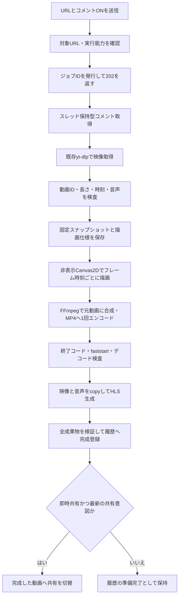

# ニコニコ動画・コメント付き事前エンコード設計

日付: 2026-09-16 / 状態: 設計基準。機能実装中。

実装手順は[実装計画書](../plans/2026-09-16-niconico-comments.md)、出典と調査結果は[先行実装調査](2026-09-16-niconico-comments-research.md)を参照。

## 1. 目的と確定した要件

ニコニコ動画のURLを貼ったときに「コメント付きで変換する」を選べるようにする。**コメントを映像に合成して事前エンコードする方式とし、リアルタイム性は要求しない。** 完成後の動画にコメントが含まれるため、ブラウザープレビューでも共有先でも同じコメントが見える。

| ID | 要件 |
|---|---|
| R1 | オプションは初期OFF。未指定の既存APIクライアントは従来動作 |
| R2 | 即時共有・キュー追加の両方で動画ごとにON/OFFを固定 |
| R3 | 取得したコメント集合を保存し、動画時刻に同期して一度だけ映像へ焼き込む |
| R4 | コメント付きMP4と配信用HLSが完成してから使用可能にする。HLSはMP4からコピー変換 |
| R5 | 変換中・失敗時・キャンセル時は現在の共有内容を維持する |
| R6 | 操作画面を閉じても受理済みジョブは継続。進捗と結果は再接続後も確認可能 |
| R7 | 通常コメント、位置・サイズ・色、改行、投稿者コメント、CAの基礎となる属性を保持 |
| R8 | 履歴・お気に入り・再起動後の再生でも完成済みコメント付き動画を利用 |
| R9 | 取得/描画/変換失敗を、コメント0件や通常動画への成功fallbackと混同しない |
| R10 | 既存の共有変更を保護し、非対象URL・音楽・OBS・AirPlayに機能を波及させない |

v1ではコメント投稿、リアルタイム追加取得、再生中のON/OFF、過去全件取得、ニコ生、マイリスト一括取得、任意の字幕ファイル取り込み、ニワン語の実行を対象にしない。コメント設定を変える場合はURLを再度取り込む。

## 2. 方式比較と推奨

| 方式 | 長所 | 制約 | 判断 |
|---|---|---|---|
| Goで配置→ASS→FFmpeg | FFmpeg中心で依存が少ない | CA・フォント・改行・旧仕様を別途再実装 | 簡易版の代案 |
| niconicomments→Canvas2D→FFmpeg | 既存の互換処理を使える。NNDD後継等に映像合成の先例 | 非表示ブラウザー、フォント、フレーム受け渡しの管理が必要 | **推奨** |
| 操作画面にだけCanvasを重ねる | 表示切替が容易 | 配信映像へ含まれない | 要件を満たさない |

実行側はGoが所有する専用の非表示Edge/Chromeとする。JSは固定版をexeへ埋め込み、ネットから読み込まない。Node.js/Electron/Tauriを製品の追加実行要件にしない。既存のブラウザー検出処理は参考にするが、利用者の通常プロファイルや開いているタブは使わない。

v1の主要受入れ環境はWindows 10/11 x64。ブラウザー未検出・起動不可なら、このオプションの利用不可理由を表示する。自動的に新規ブラウザーをインストールする処理はv1に含めない。他OSは明示ブラウザー指定と同じ試験を通した場合のみ対応を表明する。

## 3. データフロー



取得・レンダリング中は`clearPublication()`を呼ばない。既存の通常URL処理から必要以上に処理を共通化せず、コメントONの専用経路を入口で選ぶ。

## 4. URL・取得方式

### 対象判定

サーバーが正とする。許可するホストは`nicovideo.jp`、`www.nicovideo.jp`、`sp.nicovideo.jp`、`embed.nicovideo.jp`、`nico.ms`。HTTP/HTTPSのみ、userinfoと任意ポートは禁止。`watch/(sm|nm|so|nl)数字`、数字だけのwatch ID、`shorts/ss数字`、対応する短縮URLを構文検査しHTTPSの正規形へ変換する。マイリスト・生放送・類似ドメインは対象外。

短縮URLの動画IDがパスから確定する場合は任意のリダイレクト先へアクセスせず正規化する。数字ID等の別名はwatch応答の正規動画IDで確定し、映像メタデータのIDと照合する。URLの時刻クエリはv1では切り抜きに使用せず、全編を変換する。

### コメント取得アダプター

`internal/niconico`へ取得処理を閉じ込める。watch情報→`nvComment`→threads APIという現在の先行実装の構造を基準にし、返された`threads`を保持する。guest watch APIには`actionTrackId`を指定する。動画ページの`data-server-response`から同じ情報を取得する経路も追加検証で確認した。server URLを無検査で使わず、初期許可先をHTTPSの`public.nvcomment.nicovideo.jp:443`に限定する。別ホストが必要になった場合は実例を確認して許可先を更新する。

匿名を既定とし、認証が必要な動画は既存の保存Cookieを利用する設定が有効な場合だけ使用する。Cookieのdomain/path/secure/expiresを評価し、threadsホストへwatchホストのCookieを無条件転送しない。新規のログイン画面や認証回避は実装しない。認証情報・threadKey・署名付き動画URLをUI、ログ、保存スナップショットへ含めない。

HTTPとレスポンス内`meta.status`の両方を検査する。1リクエスト20秒、取得工程全体60秒を初期上限とする。429/5xxのみ最大2回再試行し、Retry-Afterが総時間を超える場合は中断。401/403/406/404、形式変更、不正ホストは無限再試行しない。展開後JSONは32MiB、コメントは合計50,000件、1本文はUTF-8で64KiBかつ16,384 Unicodeスカラー/256行以内。上限超過時は途中切捨てで成功にせず明示エラーとする。これらは本製品の処理上限であって公式サービスの上限ではない。

追加検証では匿名で`sm9`のコメント1,016件を取得できた（main 850、easy 166、owner 0、HTTP/JSONとも200）。初回406を取得不能の根拠にはしない。T0の正常取得の成立性は確認済みとし、実装時には同じ要求をアダプターで再現する。別動画・認証必須動画および描画・エンコードの検証は残る。テスト用fixtureは外部取得試験の代わりにはならない。

## 5. スナップショットと再現契約

保存形式`schemaVersion=1`。`videoId`、取得日時、provider版、選択fork、正規化規則版、threadsと取得件数を記録する。生のwatch応答全体は保存しない。

各コメントは`id`、`no`、`vposMs`、`body`、`commands`、`userId`、`isPremium`、`score`、`postedAt`、`nicoruCount`、`nicoruId`、`source`、`isMyPost`を保持し、threadの`id`と`fork`も残す。rendererに渡すのはv1形式。`userId`は公開APIへ出さず、必要なら同一スナップショット内で一貫した仮名へ変換する。同一ユーザーの関係を壊す全員同値化は行わない。

- 初期表示対象はmainとowner。easyは保存しても描画対象にはしない。未知forkは記録し、描画対象外の件数を残す。
- 重複排除はthread ID＋fork＋comment IDを基本とする。同文という理由で弾幕をまとめない。同一IDで内容が異なる場合はプロトコル不整合として扱う。
- 本文の改行・連続空白・全角空白・結合文字を保存する。`trim`やNFKCでCAの形を変えない。危険な制御文字の除外規則を版管理し、除外件数を記録する。
- 不正な時刻や日時のコメントを0秒・現在時刻へ補完しない。除外と理由を記録する。元が非空なのに全件不正なら取得形式エラー、正常な空配列なら`empty`とする。
- 負のvposは先頭で既に表示中の可能性があるため一律0へ丸めない。rendererの許容範囲で保持し、負時刻fixtureで挙動を検証する。

| 表示要素 | v1の契約 |
|---|---|
| 通常・ue・shita、big/medium/small、色 | 固定版niconicommentsの対応範囲を検証して使用 |
| 改行・長文リサイズ・罫線・CA | 独自配置に置き換えず、文字計測を含め同じエンジンを使用 |
| Flash/HTML5差 | `mode=default`、元のpostedAt・commandsを保存 |
| CA補正 | `keepCA=false`を標準。独自補正による表示変更を混ぜない |
| 表示系NicoScript | 固定版が純粋な描画として実装するものを試験対象にする |
| ジャンプ、投稿、外部リンク実行、ニワン語 | 実行しない。非対応件数を記録。映像の時間軸や外部状態を変えない |
| 完全再現の表明 | 一致を確認したfixture・フォント・版の範囲に限定。公式全仕様の完全互換とは呼ばない |

コメント取得集合の違い、NG共有、ユーザー個人のNG設定も公式画面との差になる。v1は取得スナップショットの再現を目的とし、公式の個別NG設定の同期は含めない。

## 6. 描画・時刻・映像合成

### 描画ランタイム

`internal/nicorender`に独立した所有者を置く。専用一時プロファイル、隠れた子プロセス、loopback専用ポート、ジョブ限定トークンを使用する。親のキャンセルとアプリ終了で所有プロセスだけを終了し、通常のEdge/Chromeは操作しない。サンドボックス無効化フラグを付けない。

HTML・JS・フォント・スナップショットは専用loopbackサーバーの許可ルートから供給する。外部通信は遮断し、コメントをHTMLやJavaScript文字列として展開しない。1ジョブ1描画ページでエンジン状態を分離する。公開API以外の内部timelineへの依存は避ける。

### 幾何とフォント

コメントの論理ステージは1920×1080。元動画はアスペクト比を保って16:9の出力へ収め、余白は黒とする。4:3・縦動画を横へ引き伸ばさない。回転情報とSARを適用した後の表示寸法から配置を決める。コメントONでこの16:9レイアウトになることをUI補足に記載する。

初期の出力画質は既存設定の360p/720p/1080pに従い、コメント用の高解像度ステージを一様に縮小する。フォント倍率と不透明度は1.0。実機にある互換フォントを検査し、なければ既存Noto Sans JP等の明示したfallbackを使う。明朝・罫線等の追加フォントが必要なら再配布許諾のある固定版だけを含める。OSフォントの無断同梱はしない。実際のフォント名・ファイルハッシュ、ブラウザー版を描画記録に保存する。

### 共通時間軸

フレーム番号を`n`、出力fpsを有理数`F=num/den`とし、`t(n)=n*den/num`秒、描画呼び出しは`floor(t(n)*100)`。`Date.now()`、requestAnimationFrameの頻度、処理に要した秒数で位置を決めない。先頭から最終フレームまで順に生成し、途中再試行は同じスナップショットで先頭からやり直す。

標準CFR入力は元fpsを有理数で保持し上限60fpsとする。VFR/不明fpsは30fpsへ正規化する。29.97を整数30と見なさず、音声を映像のフレーム数に合わせて伸縮しない。

元動画の最初の表示フレームPTSを共通原点P0とする。映像・音声の両方から同じ時間量P0を引く。音声にだけ独立した`STARTPTS`を適用して入力のA/V差を消さない。原点以前の音声は切り、遅れて始まる音声には必要な先頭無音を入れる。終端は検査したメディア長Dから決め、`N=ceil(D*F)`フレームとする。音声尾部が映像より長い場合は最後の映像フレームを延長し、コメント入力のEOFや`-shortest`で音声を切らない。

### フレーム受け渡し

推奨はCanvas2D→RGBA（straight alpha）→Go→FFmpegのrawvideo入力。T0でPNG pipeと速度・メモリを比較するが、通常の描画結果の意味は変えない。

フレームメッセージは`version, jobID, generation, sequence, width, height, byteLength`＋RGBA。Go側は連番・寸法・`W*H*4`の一致を検査して、固定長の画素部分だけをFFmpeg stdinへ流す。1フレームの送信完了を待って次へ進む。最大2フレーム分を上限とし、描画遅延でフレームを間引かない。空のフレームも正しい透明画素として1枚数える。途中EOF・破損・タイムアウト・描画例外は失敗。

720p30のRGBAは約111MB/s、1080p30は約249MB/sの転送量になる（算術値、実測ではない）。全フレームをファイルへ保存せず、有限バッファで流す。リアルタイム以上の速度を合格条件にせず、所要時間・CPU・ピークメモリ・ディスク使用量を測って提示する。

### FFmpegと成果物

`runNicoCommentEncode`で元動画とコメントRGBAを合成し、H.264/yuv420p＋AACの`commented.mp4`を作る。初期はCPU/libx264を基準とし、GPU経路は別の出力検証が通るまで有効化しない。色域・回転・アルファの黒縁を検査する。既存映像の動きだけからビットレートを下げる`ProbeMotionScore`・元ビットレート上限は、動く文字が加わるこの経路にはそのまま適用しない。

MP4は`+faststart`まで正常終了させ、ffprobe・フレーム数・先頭/中間/末尾のデコードを検査する。続いて`-c:v copy -c:a copy`で完成MP4をHLS VODへremuxする。これはMP4/AACを入力とするHLS化であり、TS/AACからRTSPへコピーする別経路とは区別する。HLSにフィルターや映像再エンコードを重ねない。

H.264は[既存互換性契約](../../RTSP_H264_COMPATIBILITY_CONTRACT.md)に合わせ、`sliced-threads=0:slices=1:slice-max-size=0:slice-max-mbs=0`を実効値で維持する。設定文字列だけでなく実出力の1AUあたりVCL NAL数を検査する。今回RTSPの新しい公開経路は作らない。

## 7. ジョブ・保存・公開の一貫性

処理状態は`queued → fetching_comments → downloading → rendering → encoding_finalizing → remuxing → validating → ready`。任意の途中状態から`failed`または`canceled`へ遷移できる。正常0件は別途`commentStatus=empty`を持ち、コメントなし成果物であることを表示する。

ジョブディレクトリは`private/nico/jobs/<jobID>/`。MP4、HLS、スナップショット、manifestをここで作り、検査前のファイルは共有ルートへ出さない。既存の`yt-dlp-source.*`共通掃除と`GeneratedFiles`のglobを使わない。

`CommitPreparedNicoMedia`を新設し、MP4を主動画、HLSを完成済み配信用成果物、スナップショットを非公開付属データとして登録する。MP4とHLSで同じmediaID・snapshotHash・renderKeyを使う。履歴や`Converted=true`だけを先に書かない。中断に備えたjournalとatomic renameを使い、再起動時に「一式完成」か「未公開」のどちらかへ復旧させる。

元動画はジョブ成功後に削除できる一時入力とする。v1では再設定時にURLから再取得する。失敗・キャンセルの一時入力は24時間以内に回収し、活動中ジョブを掃除対象にしない。完成MP4・HLS・スナップショット・manifestは履歴/お気に入りと同じ保持期間とし、関連ファイルを一緒に削除する。お気に入り解除後も履歴が参照している一式を先に消さない。

`renderKey = SHA256(sourceDigest + snapshotDigest + normalizedOptions + rendererVersion + browserVersion + fontDigests + geometry + fps + encoderPolicyVersion)`。同じURLでもコメント集合や描画版が違えば別成果物とする。v1では新規取り込みごとに新しいIDを発行し、履歴再生では完成済み成果物をそのまま使う。

即時共有ジョブは共有意図の世代番号を持つ。後から別動画・履歴・OBS/AirPlay等を選んだ場合、古いジョブの完了で共有を奪わない。その成果物は履歴の準備完了に留める。キュー追加ジョブは常に自動共有しない。全ての共有切替入口で同じ世代管理を用いる。

アプリ再起動で未完了だったジョブは`interrupted`を理由に失敗へ確定し、自動でネットワーク取得を再開しない。完成成果物は再取得・再描画なしで再生する。再試行は新しいジョブとして同じURLとオプションを使う。

## 8. APIとUI

既存の`POST /api/upload-url`と`POST /api/upload-url-queue`に任意項目を追加する。

```json
{
  "url": "https://www.nicovideo.jp/watch/sm9",
  "niconicoComments": { "enabled": true }
}
```

未指定/falseは既存応答を維持。trueは対象URL・動画プレイヤーON・音楽モードOFFを検査し、ジョブ受理時にHTTP 202で返す。既存stateの形を残し、追加項目として`acceptedJobId`を付ける。UIは202を失敗にせず、通常のstate再取得/SSEで追跡する。

`GET /api/state`へ`niconicoComments.available`、`unavailableReason`、`jobs[]`を追加する。各ジョブの公開項目は`id, phase, progressPercent, message, commentCount, commentStatus, resultMediaId, errorCode, canCancel`。絶対パス・本文・userId・認証情報は含めない。エンコード後段の進捗が不明なら推測100%を出さず「仕上げ中」と表示する。

キャンセルは管理権限で`POST /api/niconico-comment-jobs/cancel`、本文`{"jobId":"…"}`。停止対象をジョブ所有の取得・描画・FFmpegだけに限定する。

UIは対象URL入力時にチェックボックスを表示し、初期OFF、非対象URLへ変更時はOFFに戻す。「動画にコメントを入れて変換します。完了まで時間がかかります。映像は16:9の枠に収めます。」と補足する。履歴には完成した「コメント付き」「コメント0件」を表示し、「準備失敗」はジョブ一覧に表示する。既存コメント付き履歴を選ぶために入力欄のチェック状態を再適用しない。

## 9. エラー方針

| 状況 | コード/表示 | 現在の共有 |
|---|---|---|
| 非対象URLへON | 400 `niconico_comments_unsupported_url` | 維持 |
| 音楽モード/動画機能OFF | 409 `niconico_comments_mode_conflict` | 維持 |
| ブラウザー/FFmpeg/必要フォント不足 | 503 `niconico_comments_renderer_unavailable` | 維持 |
| 認証・アクセス制限 | ジョブ失敗 `niconico_comments_auth_or_access` | 維持 |
| 取得上限/形式変更 | ジョブ失敗 `niconico_comments_limit` / `niconico_comments_schema` | 維持 |
| 正常に0件 | 完成可能、`commentStatus=empty`・「取得できるコメントは0件でした」 | 完成後の選択規則に従う |
| 描画/MP4/HLS/保存失敗 | 工程別コードでジョブ失敗。コメントを落として成功にしない | 維持 |
| 後続の共有操作が発生 | 完成動画を履歴へ追加、`ready` | 後続の共有を維持 |

## 10. 完了条件

上記R1～R10を対応テストで確認し、実際のコメント付きMP4・HLSをデコードする。キャンセル・再起動・お気に入り復元・同時ジョブ・後続共有の競合を検証する。通常動画/音楽/OBS/AirPlayの回帰チェックを行う。VRChatでの表示は実機確認として別記し、ローカルの合成成功で代用しない。

ライセンスは採用した固定版と同梱する実ファイルを基準に通知・依存一覧を作る。今回の案ではAirPlay配布物を変更しない。変更が必要になった場合は既存の配布物・ライセンス検査を追加適用する。
