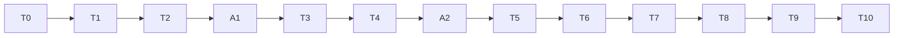

# ニコニココメント追加高速化 実行計画書

> **For agentic workers:** この文書を実行状態の正本とする。主実装者はGPT-6 Luna。3節のモデル制約と助言/助っ人の区別を最初に読む。T0–T10は工程であり、そのまま1担当へ丸投げしない。実際には5節のLuna作業単位だけを割り当てる。`swarm-planner`の依存関係を守り、計画の受理後は`parallel-task`で未ブロックwaveだけを扱う。実装担当は`superpowers:executing-plans`を使用する。共有checkoutで他者の変更を戻さない。ユーザーの指示を優先し、skill中の定型commit指示や自動格上げ規則は適用しない。

**作成日:** 2026-09-25 / **文書版:** 328 / **状態:** T0–T17 complete. The T1–T8 gate audit found a strong, repeatable T3+T4 warm-session saving. Cold no-regression is no longer a required gate for a reuse optimization whose intended workload is repeated jobs. T3+T4 is the Windows default with `IMAGEPAD_NICO_WORKER_SESSION=0` opt-out; other platforms keep the fresh-worker default. The T4-only variant remains diagnostic. All measured TEMP roots are audited and removed.

**Goal:** wGPU・既存の画質・コメントの動き・CPU選択と通知付きfallbackを維持し、5案を個別測定して再現する小さな短縮も採用する。

**Architecture:** ③Base64直接変換、④画像判定の早期終了を先行する。①は専用workerの継続セッション内でブラウザープロセスを保持し、ジョブごとにページと状態を作り直す。②は全体配置の確定を維持し、検証済みコメント資産の到着と描画・エンコードを重ねる。⑤は同じRustコードのLTO/PGOビルドを分離評価する。

**Tech Stack:** Go、同梱niconicomments、Chromium CDP、Rust、`wgpu = "=0.20.1"`、FFmpeg、Python統計、PowerShell実験runner。

**Spec:** [既存timeline設計](docs/superpowers/specs/2026-09-23-niconico-comment-timeline-wgpu-design.md)と、この計画の「4. 今回の設計差分」。新しい状態・wire境界は本書で明示し、既存NCT1の意味は変えない。

## 0. 再開するとき最初に読む場所

| 項目 | 現在値 |
|---|---|
| 正本 | `niconico-next-speed-plan.md`。docs配下の同名案内はリンクのみ |
| 現在タスク | T17 complete: audited T1–T8 adoption gates and promoted the formally measured T3+T4 reusable session path on Windows. |
| 次の実行作業 | T17 is closed. The next approved optimization item may resume; the measured T3+T4 route is enabled by default on Windows and can be disabled with `IMAGEPAD_NICO_WORKER_SESSION=0`. |
| 実装モデル | GPT-6 Luna (`gpt-6-luna`)。mainは統合責任の役割名であり、上位モデルを意味しない |
| Astraの状態 | A1/A2/A3 read-only advice is recorded. A3 is reflected in 4.2 and T6.5–T6.10 scope. No Astra helper implementation. |
| 候補と採用状態 | T1 remains enabled. T3+T4 combined reuse is the Windows default because both independent warm sessions pass the repeated-work speed and correctness/lifecycle checks. `IMAGEPAD_NICO_WORKER_SESSION=0` restores the fresh-worker route. T4-only remains diagnostic; T2 and T8 alternatives remain rejected or unproven for their measured reasons. |
| 今回の性能証拠 | NVENC A/A 5組は平均paired差`-0.0204562 s`、中央値`+0.06255 s`、candidate faster 3/5。x264 A/A 5組は平均`+0.06683854 s`、中央値`+0.0550773 s`、範囲`-0.2735345..+0.4579944 s`、candidate faster 4/5。全て同一実行物A/Aで、候補効果ではなく測定ノイズの確認。T9.5 PGO screen: CPU20/NVENC median `+0.065685 s`; CPU20/x264 `-0.023110 s`; unrestricted/NVENC `-0.029496 s`; unrestricted/x264 `-0.018472 s`. Confirmation session2 median `-0.036204 s` (95% CI `-0.071193..+0.039954`); session3 median `+0.053813 s` (95% CI `-0.054629..+0.165468`). Both intervals cross zero; one CPU20/NVENC PGO run fell back after native self-test timeout. `release-pgo` remains unproven. Evidence: `docs/verification/niconico-comments/t9-5-pgo-performance-2026-09-29.json`. |
| 変更許可 | 計画に沿った実行・テストと製品コードへの反映は承認済み。commit/push/release、稼働配信停止、アプリ再起動は引き続き対象外 |
| 既存作業 | 大量の変更済み・未追跡ファイルあり。HEADだけを現行基準にしない |
| 運用操作 | commit/push/release、稼働配信停止、アプリ再起動は実行範囲に含めない |

| 2026-09-30 T15 smoke telemetry diagnosis / v315 | 315 | Separate a benchmark-harness CPU snapshot tolerance miss from actual worker/Job failures before repeating the test | Re-read v314, T15 acceptance, and 6.1–6.3. One-pair CPU20 smoke reached 4 successful renders (cold candidate, fresh baseline, warm-up, first warm candidate). Every completed result had correct identity and verified Job rate 2000. At the first warm pair, the returned report said 5.828125 CPU seconds and external snapshots measured 5.984375; difference 156.25ms exceeded the 150ms consistency bound by 6.25ms. The smoke ended before MP4/HLS decode parity, so no speed/media result is accepted. No production source changed; the Go test temp outputs were removed and owner process audit found no worker/browser/helper/FFmpeg process. Durable diagnostic: `docs/verification/niconico-comments/t3-browser-pool-cpu020-smoke-2026-09-30.json`. Increase only the harness telemetry tolerance to `2*SampleInterval+100ms` (200ms), retain exact Job-rate verification, and rerun the smoke. |

| 2026-09-30 T15 T1 browser parity / v314 | 314 | Confirm the already-default native Base64 path in the installed Chrome before T3/T4 timing | `TestSpriteBase64NativeBrowserAndSeededPBOSyncParity` passed in Chrome 154. Browser reported 20 native `Uint8Array.toBase64` calls and 10 `btoa` comparison calls; seeded scene matched exactly at 2,547,978 bytes, SHA256 `dbbd2a75b9cdafe9d89081ee0d7448e27e607efbb91a67e59680af2459fd631a`. The suite confirmed native path is exercised; T1's end-to-end worker speed remains unproven. The T3/T4 harness compiles with opt-in off. Input/helper/browser/FFmpeg/worker hashes and the 12 GiB owner manifest are recorded in `docs/verification/niconico-comments/t3-browser-pool-cpu020-2026-09-30-owner.json`. A first invocation omitted the test's required `NICO_TIMELINE_SNAPSHOT`, failed before launching a browser, and was corrected by passing the previously hash-verified fixture. Next: one-pair CPU20 cold/warm wiring smoke, then full matrix only if output checks pass. |

| 2026-09-30 T15 cold/warm gate review / v313 | 313 | Make the T3/T4 comparison satisfy the plan's separate cold/warm rule before collecting performance data | Re-read v312 and section 6.1 after the first harness compile. Section 6.1 explicitly requires cold and warm as separate cells; the initial T15 draft covered warm pairs and reported setup separately but did not directly measure a cold first request. Expanded the protocol to 10 balanced cold pairs, each with a new session manager and independent cold start, plus 2 independent warm sessions × 10 pairs. Cold session startup is included in request wall and reported as its own cell; warm setup and one warm-up job are reported separately. Promotion requires both warm positive-speed criteria and a cold no-regression confidence bound. No benchmark run or product-source change has occurred yet. |

| 2026-09-30 T15 start CP / v312 | 312 | Requalify T3 BrowserPool and T4 session reuse under the user's CPU20 test condition before changing the default route | Re-read v311 and sections 0, T3, T4/T4.11, 6.1–6.3, and 7. Verified retained T14 source SHA `8aa46ff529686272ca233babfd24884f2b28ef25a24534f278e95560e755ae20` and snapshot SHA `b7be86d86016175c99925f5f1b5651d43279eeffcc54deb1c22c5b2e6e15e946`; current Chrome, FFmpeg, and helper identities will be captured before the run. Measure 2 independent sessions × 10 balanced fresh-worker vs warmed-session pairs at 720p30/6s/362 comments, identical NVENC/Vulkan/MP4+HLS settings, and 20% Job CPU rate for test processes only. Require every run's full-decoded MP4 frame hashes to match its pair, exact requested CPU cap, successful session retirement, and no owned media/browser process or temp/profile residue. Record warm-up/setup cost separately. T1's native Base64 path is already default-on where `Uint8Array.toBase64` exists and keeps its legacy fallback. If both session medians and the session-stratified 95% bootstrap lower bound are >0, add a test-first Windows default for session/BrowserPool with `IMAGEPAD_NICO_WORKER_SESSION=0` opt-out; leave production CPU options and unsupported non-Windows behavior unchanged. Otherwise retain opt-in and do not claim the speed path. |

| 2026-09-29 T11.5 alternate browser and host qualification / v272 | 272 | Current production timeline capture passes on isolated Edge and Brave hosts with GPU enabled and disabled on the available Windows/NVIDIA system | Re-read plan v271 SHA `27608f80039bc8bc80c37f6dccbba6bf76396c664534fc7f7d3d56be1952431a` and T11.5 acceptance. Edge 154 and Brave 154 each captured one 1080p comment asset in both GPU modes; GPU-enabled WebGL reported RTX 5070 Ti / D3D11. Edge and Brave serialized identical scenes within each mode. `internal/nicorender` full suite passed. No VRChat/game load or AMD-specific WGPU, other GPU, or other OS qualification; WGPU strict pixel gate/default remain unchanged. Probe source and its private browser processes were removed; one pre-existing 1 MiB profile was retained. An initial Edge `--version` invocation appeared to reach the existing session; process effect is unverified, no pre-existing browser process was stopped, and later version checks used file metadata. Evidence `docs/verification/niconico-comments/t11-5-environment-qualification-2026-09-29.json`, SHA256 `A53BFBA00BB4C310F8A76130BF9A938B054206063A02F97E75556910FB3A33C1`. No product source change, commit, push, or release. T11 complete. |

| 2026-09-29 T11.1 strict pixel closeout / v268 | 268 | The frozen software-reference pixel mismatch is reproduced exactly and localized to visible comment sampling/output rounding | Verified prior plan v267 SHA 58ebbfea0e3bafa8d52bb7fe73a2542a8ecc51b8b884bacfd94248cfc23a675b; re-read execution state, T11.1 acceptance, compatibility contract, integration test, shader, and comparator. Exact Chrome154 / GPU-disabled capture produced frozen browser stream SHA f41651a2...451de3 and exact T10 scene SHA 5a6ab486...1693bb; pinned Vulkan helper output SHA 0fd1df3e...50ef18. Gate reproduced max diff 2 / 352 pixels over tolerance 1, 126 frames with any overage, transparent exterior exact, draw order 0 mismatch, 7,630 position samples in tolerance. Per-frame channel report records 71/71/71/281 over-tolerance channel observations (RGBA); 281 are alpha-only channel exceedances with reference greater, and reference-alpha classes are 331 partial / 21 opaque / 0 transparent. Evidence: diagnosis a9ae4a52350c0312f34bc08fcd6c0dbf9adfd3afafeec526826166716379e1bc, per-frame report 8bd6cc16ac205eb844a2e6d3474c2e1ab1dece2bddd2721c55d0f6402cf9261e, owner record 42af53932a9e163fa949145cda975a76e38ac84f252e3df3acd7abfcc5fe6d9d, cleanup 1c9a888c959314775e0860e99442662de8abe4d79204d1de652c138012f5f957. Owned root removed after two identical hash passes (390 files / 3,143,161,708 bytes, tree SHA bb6a945f524925011baa2423f739457a75ace8df6d8ac619a4ae4b40b26c5061, 0 reparse points, hardlinks, unexpected entries, or process refs); C: free-space delta 3,143,716,864 bytes. Existing server PID 13116 and FFmpeg PID 16012 remain alive. No product source changed. Next active leaf: T11.2 manifest reason_not_testable validation.
| 2026-09-29 T11.2 manifest reason gate / v269 | 269 | Existing run manifests now reject skipped-run reasons that are missing, ill-typed, or inconsistent with the attempted target | TDD RED reproduced six invalid-manifest acceptances. Added fail-closed validation for the producer's existing nullable `skip_reason` field, first-unsupported-target precedence, mismatch, target fields, and reason/status consistency without a schema-version change. `rtk pytest -q scripts/experiments/nico-timeline/test_next_speed_manifest.py scripts/experiments/nico-timeline/test_next_speed_benchmark.py`: 83 passed. No unrelated files staged or modified by this leaf. Next: T11.3 bounded 256 MiB parser fixture.
| 2026-09-29 T11.3 Go parser cap fixture / v270 | 270 | Direct Go parser coverage now crosses the cumulative 256 MiB asset boundary using streamed synthetic pixels and a small metadata fixture | Added a synthetic NCT1 stream with only a header/three asset descriptors in memory. A zero-filling reader supplies the two valid 128 MiB payloads; the parser rejects the third asset before consuming its 4-byte payload. The test hashes streamed zero pixels in 64 KiB chunks and asserts exactly 256 MiB consumed. Targeted test passed; complete `internal/nicorender` suite passed (374 tests). No parser/product code or wire format changed. Next: T11.4 runtime output queue occupancy.
| 2026-09-29 T11.4 runtime frame-queue metrics / v271 | 271 | NCT2 reports now carry configured output queue capacity, observed frame-queue high-water, and final occupancy from the actual bounded writer queue | Re-read plan v270 SHA `76bde379ce1d47e06416626b4eab2906c5564aecae3a858ef7190043655f88ab` and the T11.4 acceptance. The NCT2 writer uses a bounded Mutex/Condvar queue; frame occupancy/high-water update atomically at enqueue/dequeue, excluding control messages and the writer-owned dequeued frame. Runtime JSON adds optional `outputQueueMetrics` (`capacity`, `highWater`, `finalOccupancy`); Go validates present metrics while accepting older reports without the optional object. NCT1 keeps its original queue/report. TDD RED reproduced unknown-field rejection and invalid zero-high-water rejection; saturation/drain/control-message tests now pass. Rust crate: 109 passed / 9 ignored; Go `internal/video`: 836 passed. Opt-in RTX 5070 Ti slow-consumer sample: capacity 2, frame high-water 1, final 0; 256 MiB assets, 3 frames, 7,524 RGBA bytes, CPU peak 234,881,600 / 268,435,456, GPU peak 402,665,644 / 805,306,368. Actual CLI parity: 3/3 NCT1/NCT2 cases exact, each NCT2 report capacity 2 / high-water 2 / final 0; stopped-output cancellation test passed. Locked/offline optimized release build passed in a unique TEMP target and that target was removed; sample input root was checked absent. Evidence `docs/verification/niconico-comments/t11-4-output-queue-2026-09-29.json`, SHA256 `2694fdae8e67399e25f7383447a8c26e916e6e5c0ab147c6ad3b7973071bc7c3`. No FFmpeg/H.264, pixel oracle, default-selection, app, release artifact, or shared service changes. Next: T11.5 environment availability audit.
| 2026-09-28 T8.1 kickoff / v233 | 233 | T7.8完了後の次作業として、build provenanceの厳格な独立manifestを設計・実装する | v232 SHA `84A7849B47BB42B97F4B1BA9074146C3976D3239DD0DEADA6E3934115117357F`を照合。0–3、4.3、T8/T8.1、6.1–6.2、7を再読。rustc/cargo 1.96.0、LLVM 22.1.2、host `x86_64-pc-windows-msvc`。プロセス環境にRUSTFLAGS/CARGO_PROFILE等の上書きなし、repo/home `.cargo/config.toml` なし、C:空き582,735,032,320 bytes。独立レビューでT8.1が次の未ブロックleafと確認。Go readerは`DisallowUnknownFields()`なので既存runtime manifestにbuild fieldsを足さず、sidecarを追加する。RED:新規`test_build_variants_manifest.py`は期待API/runner未実装のため10件失敗。次はmanifest validator/provenance generatorとisolated runnerを実装し、対象testをGREENにする。既存のuntracked Cargo/build filesは後続leafの所有範囲として未編集。 | main |
| 2026-09-28 T8.1 real cargo log probe / v234 | 234 | Fresh locked release compiled under a TEMP-owned target, but the fail-closed provenance parser rejected Cargo's Windows command wrapper | Re-read v233 before the run: T8.1, 6.1–6.2, 7; injected `RUSTFLAGS=-C target-cpu=native` and `CARGO_PROFILE_RELEASE_LTO=false` only into the runner process to verify scrubbing. Cargo exit 0 in 31.263s; actual log records `set ...&& ... rustc.exe` wrappers, so parser expecting the command's first token to be rustc returned `no rustc compiler invocations`. Provenance generation failed closed; no binary/source mismatch was accepted. Runner finally audited and removed exactly 1,053 target files / 501,676,438 bytes; tree SHA256 `8c66f1b9c118b7ce5dc9287099f880852d4f6f2a86c6f7d7459cff32358d51ea`; the target directory is absent. Owned root and build log remain temporarily for parser repair/retry. Next extract only the actual rustc executable plus argument tail, cover Windows wrapper and no-invocation cases, then retry in a new owned root. | main |
| 2026-09-28 T8.1 actual log parser repair / v235 | 235 | Cargo's real MSVC build lines now yield the compiler executable and effective argument tail without capturing the temporary `set` environment wrapper | Re-read v234 T8.1/6/7 before repair. Focused manifest tests: 60 passed. Applied parser to the saved real log: 103 rustc invocations extracted; inherited `RUSTFLAGS` and `CARGO_PROFILE_RELEASE_LTO` are recorded as scrubbed; no `target-cpu=native` flag reached rustc. The old isolated root still has no Cargo target (cleanup verified); it is retained only until exact-root audit and cleanup after a fresh-root retry. Next rerun the release build and validate the generated source/toolchain/effective-flags/binary sidecar end-to-end. | main |
| 2026-09-28 20:10 T8.1 fresh build and provenance PASS / v236 | 236 | A fresh isolated locked release build now has complete source/toolchain/effective-flag/binary provenance; runtime manifest compatibility is preserved | Verified v235 SHA `3F157E1AAE85D0692E1B744EB4A4123043BCDF5876AABD2EA06AC697141C97B9`; re-read 0–3, 4.3, T8/T8.1, 6.1–6.2, 7. Focused manifest tests: 60 passed. Fresh release build exit 0 in 31.126s with rustc/cargo 1.96.0, LLVM 22.1.2, target `x86_64-pc-windows-msvc`; source snapshot 18 inputs, 103 effective compiler invocations. `RUSTFLAGS` and `CARGO_PROFILE_RELEASE_LTO` were hashed/name-recorded and scrubbed; `target-cpu=native` absent. Build/runtime manifests and owner record agree on helper SHA256 `8eea10e38a153aaeb03afe5d1724785d12af522246462eb6dfb60c0b45b28fc4` (8,410,624 bytes); runtime schema/fields remain unchanged. Cargo intermediate target: 1,053 files / 501,676,438 bytes, tree SHA `fd48132d2abfe6964afbe282e5f9ea28ad18d919de7eca21293e5d5b01b64e59`, removed; fresh baseline helper retained at `%TEMP%\nct-next-speed-8035a83ead674b428ca0c18c9c0c4272` for T8.4. Old failed root separately audited (171 files / 12,937,058 bytes, tree SHA `dd2632bb3d08343aa4b80ef204975b641049a88202329cf90bc538d844359a17`, zero external process references) and removed, restoring 13,406,208 bytes. Durable evidence: `docs/verification/niconico-comments/t8-1-build-provenance-2026-09-28.json` SHA256 `3A8DADD7398BFA2D861A0757BD1F53D9780518F0F5582A6C2053A9B7F4CF860F`. T8.1 complete. Next add RED tests for the two explicit Cargo profiles and PowerShell selection while preserving default release. | main |

| 2026-09-28 20:20 T8.2 Cargo profiles and Windows selector PASS / v237 | 237 | ThinLTO candidates are explicit and opt-in while the existing release build remains the default | Verified v236 SHA `E7089121AAFC359BBC13378FB4C196639906A008DCF44FA6AFA274009AE6575A`; re-read 0–3, 4.3, T8/T8.2, 6.1–6.2, 7. Luna TDD RED: 3 expected failures; GREEN: `python -m pytest -q scripts/experiments/nico-timeline/test_profile_variants.py`, 3 passed. `cargo metadata --locked --no-deps --format-version 1` PASS; PowerShell parser PASS; `-Profile unsupported` is rejected before build (exit 1). Cargo Book confirms named profile selection/output directory and `--release` equivalence to `--profile release`: [Profiles - The Cargo Book](https://doc.rust-lang.org/cargo/reference/profiles.html). No candidate build/benchmark was run. File hashes: Cargo.toml `C84EB0D4902E95D0CFF75634CA0C8F87D663480F0B8574C6EB170C90E6BD74ED`; PowerShell script `37FED4A902EF7ECAF32CC20C26BC2B42D5EF11F2D3196CBA35E9E890DC1A6D2F`; test `08CA47F4324616D1609873F95ABBB3E3129D7A67E619AE35C1B7309B20B19B03`. Next T8.3 begins with POSIX script/tests RED. | main |
| 2026-09-28 20:37 T8.3 POSIX profile/provenance PASS / v238 | 238 | POSIX build entry now selects the release profiles and emits a separate provenance sidecar while preserving the runtime manifest | Verified v237 SHA `83DB0041A059154ADBB224BF5EB87B486841ED1D05A18009C0E73D95D98782F9`; re-read 0–3, 4.3, T8/T8.3, 6.1–6.2, 7. Initial RED: 4 failures (3 missing contract items and Windows system Bash/path conversion). GREEN: combined T8.3/T8.1/T8.2 focused suite 20 passed in 5.47s with no skips; Cargo metadata PASS; Git Bash `-n`, `--help`, and invalid-profile rejection PASS; scoped `git diff --check` PASS. Final review removed Bash-4-only `${name^^}` for macOS Bash 3.2 compatibility and added a regression assertion. Native Bash 3.2 and non-Windows build were not available, so those remain unverified. Runtime manifest schema remains unchanged; provenance is separate. Shell SHA256 `5A9B12C2EA0D23AA134C262CDB3DD3D900B232E17900EB2AE612712878F04D17`; test SHA256 `3BCE2E260F3359EAB877E49007E3208FAF1724FF63B0FB26F353C784FFE62BB8`. No candidate build/benchmark yet. Next T8.4 begins with exact baseline-root/process/disk-budget audit before any candidate build. | main |
| 2026-09-28 20:56 T8.4 empty environment provenance failure / v239 | 239 | The ThinLTO candidate compiled and runtime metadata was written, but the build-runner invocation failed while creating its build-provenance sidecar when no build overrides were present | Verified v238 SHA `284cb97c5ebd52643b3a60072fadc47abdd7cf64b16ccc9990df02cfd3bffda6`; re-read T8.4, 6.1, 7. Preflight reported `environmentOverrides=[]` and no scrubbed names. Cargo exited 0 in 83.792s; helper was written (8,651,776 bytes) and runtime-manifest generated, but build-provenance failed with `FileNotFoundError` for `environment-x86_64-pc-windows-msvc-release-thin.json`. Root cause: empty `$overrideRecords` produces no pipeline output, so `Set-Content` is never invoked. The runner recorded `release-thin` as failed, retained its log/artifact, and removed target intermediates: 1,053 files / 501,879,379 bytes, tree SHA `805386f3ef286ae069f743fb3ed7b5279cee3f84f6ff3173ee98c280e409e7fa`; target absent. Owned root totals 341 files / 26,335,450 bytes; image-path audit found no running process references; C: free 582,157,520,896 bytes. Source snapshot comparison found only `gpu/nico-compositord/Cargo.toml` differs between v236 release baseline and this candidate because T8.2 added the opt-in profiles. No candidate accepted and no performance claim. TDD regression/fix is in progress. After that, build release/release-thin/release-thin-one in a fresh common root to keep source snapshots identical; preserve both historical roots until evidence and cleanup review. | main |
| 2026-09-28 21:12 T8.4 runner repair verified / v240 | 240 | The empty-override provenance regression now passes end-to-end through the PowerShell runner and full experiment suite | Verified v239 SHA `22612A97DBF219F1BD3AAB6E4DE6EC988946FFD7F4C7DFBB495AADF1671F7D82`; re-read 0–3, 4.3, T8/T8.4–T8.5, 6.1–6.2, 7. RED was reproduced by the Luna-owned integration regression with a real runner/Python provenance pipeline and a narrow Cargo shim. Fix writes `[]` explicitly when override records are empty. Independent full suite: 206 passed in 194.25s; no failures or skips. Changed-file SHA256: runner `B27D995963577638A0E317CE903EBB24EE2390214542BD22BAC470EA197ACA3A`; test `54640DF5FA8FE982ED996AF7DDA7A113C3925F53C430AC94047C9A96C5B66345`. Existing v236 baseline and failed v239 attempt remain unchanged. Fresh C: free 562,887,335,936 bytes; next use a new owned root and runner's 16 GiB build reserve. No profile candidate accepted and no performance measurement yet. | main |
| 2026-09-28 21:24 T8.4 three-profile build and parity PASS / v241 | 241 | Three locked profiles share one source/toolchain snapshot and produce identical GPU output while passing helper and FFmpeg qualification | Verified v240 SHA `D6C7E932B2CD638E52AEC345ACC71AC1EE237DFA0930F29FCBD573431B2FE581`; re-read 0–3, 4.3, T8/T8.4–T8.5, 6.1–6.2, 7. New TEMP root contains 3 complete locked builds, 18 identical source inputs (source SHA `167ca8fa6e463f6f316cfaab21f77c24566ddcfe1675dfe3c679ba15caec6e89`), identical rustc/cargo/Cargo.lock, 103 effective invocations each, no environment overrides, no `target-cpu` or panic overrides. Cargo build seconds / bytes: release `55.954 / 8,410,624`; release-thin `54.181 / 8,651,776`; release-thin-one `89.436 / 8,053,248`. All target dirs cleaned; their inventories were 501,662,109 / 501,881,436 / 488,192,655 bytes. D3D12 self-tests and NCT1/NCT2 raw RGBA matched byte-for-byte; shared RGBA SHA `25706dc07e487c6499551a690d302a6e6e035be5fe9a784afd01806c62304ab2`. Per-profile compositor qualification passed readback slots 1/2/3, truncated/trailing input, broken pipe, and backpressure cancel. Per-profile real GPU/FFmpeg test passed x264/NVENC, short/no audio, MP4/HLS decode/PTS/slice/comment-pixel/faststart checks. Evidence JSON: `docs/verification/niconico-comments/t8-4-profile-build-2026-09-28.json`, SHA256 `65547b93943f03faae08d23ffda7cac6c51b73175b6b2df68c68e344d327c5fb`. Root remains 39,386,029 bytes for the profile comparison; no target dirs or helper processes remain; C: free 562,513,408,000 bytes. No profile selected and no performance conclusion yet. Next T8.5: reread the measurement contract, then run the comparable paired workload. | main |

| 2026-09-28 22:25 T8.5 fixed worker and measurement setup PASS / v242 | 242 | The profile comparison uses a fresh worker and test executable built from the same current Go source, with fixed input and FFmpeg provenance | Verified v241 SHA 394DC382254D1127C56270FB84B0FEDFF63181EB5A8FB91E911BD284F6EFCE88; re-read 0–3, 4.3, T8/T8.5, 6.1–6.2, 7, and T8.4 evidence. No VRChat or T8.5 worker was identified in the initial preflight; a later audit found an existing ImagePadServer/FFmpeg stream, preserved and recorded in v243. Real-game load is unavailable and will not be represented by the CPU20 simulation. Source/snapshot/FFmpeg 9.0.1 hashes remain 8aa46ff5...ae20 / b7be86d8...e946 / 72a489ec...6aa3. Fresh worker built in 57.442s (43,362,816 B, SHA CF0F8FB65273D56263A3ECC7AFF001A207BF8DEBCFCDDE6CB6268F42B366E469); server performance test binary built in 6.342s (44,897,792 B, SHA 51125AB11C15F41BC6D5BF2FFB61AAB37709DFB3EE0C0044C386338376F87F67). Worker source/test source SHA 469698FE...F335 / DCA7A058...B21E. Owned measurement root %TEMP%/nct-next-speed-t85-20260928-bb1098f9f560403882dc238daf8ec444 has manifest, isolated Go cache/temp, and no media outputs yet; current root usage 291,658,064 B and C: free 579,427,946,496 B. The run uses pinned DX12/RTX 5070 Ti, 1920×1080/30fps/6s, readback slots 3, production tee MP4+HLS, x264/NVENC, and separate CPU20-sim/unrestricted cells. The worker contract does not expose an MP4-only mode, so this helper-profile measurement remains on production tee. Runner syntax and encoder availability passed. No profile selected. Next execute 12 warm-ups, verify MP4/HLS decode and monotonic PTS per sample, then run 5 AB/BA pairs per candidate and cell; delete validated media and retain compact evidence. | main |

| 2026-09-28 22:48 T8.5 argument boundary corrected / v243 | 243 | The real-worker harness passes Go test flags through PowerShell and RTK without starting an unintended full package run | Verified v242 plan SHA 58B99F102FC80514B5EC43351B588FACA4D2C240A045353E05EF87C6B0B686A9. The initial worker run exited 2 before launching the worker because unquoted dotted flags were parsed as a bare -test flag; its log is retained and no MP4/HLS was created. A quoted list-only probe returned TestNicoTimelineWorkerPerformance through RTK; the budget-runner probe completed with exit 0 and JobCPURate 2000. No T8.5 test executable or helper remains running. The failed empty sample directory was removed; the error log and runner probe JSON remain in the owned root. Follow-up preflight found the existing ImagePadServer v1.8.0 app PID 13116 and its FFmpeg PID 16012 serving an RTSP/NVENC stream. Both remain untouched; VRChat is absent, so this is not labeled game-load evidence. Measurement root size is 291,674,733 B; corrected runner SHA D82E91EE02423C5E1263B391F30DDF1944EA47A70BF46F52C494F22095E40B24. Next run CPU20-sim warm-ups first, audit the existing stream, then run the unrestricted cell separately. No performance sample has been accepted or excluded as an optimization result. | main |

- **2026-09-29 T9.1 closeout / v251** — Verified v250 SHA `C3A03C8CAAE74E9D5CD58E214F54954F1416DC50B5238C973CF46F6A6C127714`; re-read 0, T9/T9.1–T9.2, 6–7 and reviewed both owned files. `pgo.ps1` SHA `424CCDEE0EB10B828D12C6A0B3CDFE1B2B9EAEE05E4FA5B0BEF5A900FBB7304F`; PGO manifest tests SHA `C9EE2563E92A0F3512A43B902D9C0D622F736325ACA038A21727CCF35A972F4C`. A stale-training-hash test initially found its fixture helper overwrote the intentionally bad value; corrected the helper so this case preserves the mismatch. Focused PGO manifest suite PASS 35/35. Combined PGO/build-variant/benchmark-manifest regression PASS 103/103. Explicit whitespace scan PASS. Real training/evaluation material hashes are not fabricated from synthetic validator fixtures; T9.2 records them from the owned real workload inputs and passes them through this validator. Next: test-first T9.2 under a dedicated owned root.
- **2026-09-29 T9.2 RED / v252** — Verified v251 SHA `27088F9648DAD770A74B7182C1CBA118A120B577ACC15F3E1C111EF8C6184712`; re-read 0, T9.2, 4.3, 6–7 and checked the existing isolated build runner. New test-only `test_pgo_generation.py` SHA `DADF20D35FE31A03F6C200705EFDCE4BAEEB829BF36D9614FA1999E13ECC1306` runs fake Cargo, training, and llvm-profdata commands only. RED confirmed 7 expected failures because `-RunTraining` is not implemented; the Cargo shim records `--target-dir`/`--target`/`--profile` and creates a fake helper. Evaluation input omits profileMetadata; success must write validated output metadata. Next implement T9.2 only in `pgo.ps1`.
- **2026-09-29 T9.2 closeout / v253** — Verified v252 SHA `f21896fe8a31492de78e69bae99c88dfed1666d132dab691597a0330e25d2fdc`; reread 0–3, 4.3, T9, 6–7 and rechecked the current worktree. Added an owned real-input preparation path: training/evaluation use 362/120 distinct comment IDs (shared 0); the held-out dense snapshot preserves all fields and IDs except `vposMs`, re-clocked into 0–1999 ms. The actual PGO runner copies source videos/snapshots into its fresh TEMP RunRoot, hashes each copy against the real manifests before build, runs the instrumented wgpu helper with stdout discarded, verifies all five GPU runtime reports/scenes, then merges raw profiles using rustc's LLVM 22.1.2 tool. Training and evaluation snapshots share videoId `sm9`, so this is held-out comments/material pairs within that video, not cross-video generalization. `pgo.ps1` SHA `33fb145d40726ffcb2c9a13c577a67ee23756e351506ca6d010f265f30678e57`; generation test SHA `82cccdd3eaf15d66ef343cbb36829bc206ca2b97c7c39dc46d81b37506bb223d`; preparation tool/test SHA `76927cf9a9c555e277b864c8f147910064e567a9f68dd323d95500f93494f4eb` / `610f3cbfe638d78980b0098c416d9af5ae8b9fe1a1862ce36924b619501b802a`; test-only Go runner SHA `53a6f0e7ad31ed3f2448bc947baf8ad489e01834bdf98f722422e5c17cf1bf64`. Combined focused pytest regression passed 79; PGO contract Go tests passed 9; full `go test ./internal/nicorender -count=1 -timeout=180s` passed 373. Actual `release` instrumented Cargo build, `TestNicoTimelinePGOWorkload`, and LLVM merge all exited 0. Five workloads completed on NVIDIA GeForce RTX 5070 Ti/DX12: NCT1 short 180 frames/72 comments; NCT2 long 4,645/358; NCT2 dense 180/362; NCT1 180/72; NCT2 180/72. `llvm-profdata show --detailed-summary` reported 27,422 functions. Merged profile 6,649,848 bytes, SHA `a966db269a47b5dc47fe629fd13cdf5bb4ee65f660f01a5d2237eb5dbf69bd5b`; 5 profraw files/31,789,624 bytes. Strict final manifest validator passed. Durable summary `docs/verification/niconico-comments/t9-2-pgo-training-2026-09-29.json` SHA `6b15a5bac5f860e4f592ad1d19fb433a91951418abf922bab9acb41ee29c3fbb`. Owned PGO root totals 409,496,543 bytes (under 24 GiB) and cargo-target was removed; merged profile and source/scene evidence remain for T9.3/T9.4. Temporary preparation root (5 files/33,278 bytes) was owner/path/reparse/process audited and removed; PGO test roots remaining: 0. Existing FFmpeg PID 16012 remained running and was not stopped. T9.2 complete; next T9.3 profile-use wiring.
- **2026-09-29 T9.3 profile-use build PASS / v254** — Verified v253 SHA `079E69538D7F925D63C9D1BE14CF5F06145D4A986CA49597772465E0ACA770BD`; re-read 0–3, 4.3, T9.3, 6–7. Test-first RED: 10 expected failures for missing PGO provenance/selector/dispatch APIs. Old T9.2 profile was rejected before Cargo because `build-variants.ps1` and `nico_timeline_manifest.py` are hashed source inputs and changed; exact failed attempt root was owner/path/reparse/process audited (3 files/4,039 bytes, no external process) then removed. Re-ran all five owned RTX 5070 Ti/DX12 training workloads under stable source hash `dfdc847b77293f55bd6d877b73496c6b1f30fb830c0513c63955d0eb22c050a0`; matching profile SHA `bd3c4185004ab713d32cc5f9f7b9265f782541e3e29c48e7f88cb720aac3697c`, training manifest SHA `ddc3ea605f561fa262ca468675b27f75a91f2dc0d5b4ad5195b0dd927aefe75b`. Profile-use build used Cargo `--profile release` and `-Cprofile-use=<absolute profile>`; exit 0 in 38.711s. Build provenance/runtime sidecars agree with the 7,697,920-byte helper SHA `2bd831e91dd971b712e8e549a39d82a07d642bd907d9a22fa867e0232a48a09f`; instrumented training helper SHA differs. Source/target/rustc 1.96.0/Cargo 1.96.0/LLVM 22.1.2/profile hashes match; 103 compiler invocations, 66 contain profile-use, 0 profile-generate, 0 `target-cpu=native`; environment overrides 0. NCT2 runtime/capability probe passed; Cargo intermediates 1,051 files/495,549,675 bytes were inventory-recorded and removed. Combined PGO/build/provenance/profile/benchmark focused regression: 93 passed, 0 failed/skipped; PowerShell parser and strict PGO manifests passed. Durable evidence `docs/verification/niconico-comments/t9-3-pgo-profile-use-2026-09-29.json` SHA256 `D631B63A1625B103521D7EB2E14C2FE8725424BFA9DDE5AC34EAAAD46C7C79C3`. Existing ImagePadServer FFmpeg PID 16012 remained running. No runtime app was restarted. Next T9.4 held-out output parity; performance is not yet evaluated.

### 0.1 計画再確認の必須タイミング


実装時は以下のたびに、実ファイルを再読する。会話要約や前回読んだ記憶で代用しない。

1. **新しいターン・担当交代・コンテキスト圧縮・中断からの再開直後:** 本節、1、2、3、親工程と実行するLuna作業単位、直近の実行記録を読む。実際の担当モデルも照合する。
2. **各作業単位開始時:** `depends_on`、担当範囲、前提、採用条件、必要なAstra助言の記録を読む。先行作業の実行ログとファイルhashを照合する。助言記録のない必要gateを通過済みにしない。
3. **製品コードの編集前、およびインターフェース変更前:** 本節の現在タスクと4の対応設計を読む。対象外の変更は先に文書へ理由と影響を書き、主担当が整合性を確認する。
4. **各RED/GREEN・実GPU試験・性能セッションの終了後:** 実行タスクと6の判定規則を読む。コマンド、終了コード、skip、失敗、artifactを記録してから次へ進む。
5. **採用/不採用の判断前・次waveへの移動前:** 1の不変条件、6の条件、当該タスクの未チェック項目を再読する。
6. **10ツール呼出し、または10分の作業の早い方:** 長いタスクの途中でも本節と実行タスクを読む。実行中プロセスがある場合は停止せず、その所有者・出力先も記録する。
7. **作業終了/ユーザーへの引継ぎ前:** 本節の現在タスク・次の1作業・判定・残留プロセス/ファイルを更新する。次の担当が推測なしで再開できる状態にする。
8. **Astra呼出し前後:** 3.2/3.3を再読する。助言か助っ人か、根拠、対象作業ID、所有ファイル、終了条件を記録し、戻った後のLuna作業IDを必ず指定する。

再確認の記録は主担当が次の表へ追記する。`再確認済み`だけでは不可。読んだ版・節と次の具体的な操作を残す。版を変えた場合は先行担当にも再読を指示する。サブエージェントは開始時に版/タスク/所有ファイルを返し、正本は同時編集しない。

| 日時 JST | 版 | タスク | 読み直した節 | 確認した事実・次の操作 | 担当 |
| 2026-09-30 T13 TEMP owner-root closeout / v302 | 302 | Finish T13 by removing its audited temporary build and experiment root after durable Go/Rust/media evidence is saved | Re-read v301 checkpoint and section 7 before removal; exact owner manifest and fresh audits were checked immediately before cleanup | Exact path `C:\Users\masah\AppData\Local\Temp\nct-t13-fragment-parity-20260929` matched its T13 owner manifest. Audit found 3,636 files / 6,540,006,896 bytes, within the 8 GiB owner cap; 0 reparse points, 0 protected inputs inside, 0 unexpected top-level entries, and 0 non-shell process references. The root was removed recursively using PowerShell `Remove-Item -LiteralPath` and verified absent. C: free space increased by 6,306,050,048 bytes. Durable cleanup report: `docs/verification/niconico-comments/t13-temp-cleanup-final-2026-09-30.json`, SHA `2d10afe87d215281773a4a76a37e624fff9d1f28695979bff021749f6f008df2`; encoded test evidence remains at the path/hash in the checkpoint. T13 complete with strict pixel parity unresolved; preserve WGPU default-off and CPU fallback. | main |
| 2026-09-30 17:12 T14.4 release/default regression closeout / v311 | 311 | Complete T14 after exact-helper qualification, integrated release payload path, regression suites, evidence capture, and owned-temp cleanup | Re-read v310 sections 0, 4.2, T14.2–T14.4, and 6.1–6.2 before tagged verification; re-read section 7 before cleanup; rechecked v311 acceptance/evidence and restored payload hashes before closeout | User accepted >=98% exact RGBA pixel agreement and authorized implementation. Current NCT2 helper SHA `a605dccee55f392cc81fc82d424d3dc214ce9c91c8a332657ab7126d9b377fbe` passed the Windows/amd64 payload verifier. Browser/WGPU 1080p30/360f exact match 99.5744776931%, max delta 2, zero pixels beyond delta 2, exact transparent exterior, zero draw-order mismatches, max X error 0.000228882 px. Paired 720p30/6s/NVENC/Vulkan/full-CPU fixture: WGPU won 9/10; median paired saving 1.6452685 s, 95% bootstrap CI 1.244119..2.3070771 s; one regression is retained. Fresh uncached Go suites `internal/nicorender`, `internal/server`, `internal/video`, and `cmd/imagepadserver` all passed (4.025s, 204.838s, 90.583s, 0.132s); payload-verifier Python tests 3/3 passed, gofmt and normalized-LF `bash -n` passed, payload verifier passed, and `git diff --check` exited 0 with checkout line-ending warnings only. Previous full sweep excluded 4 stale historical `build/*` packages; among 46 current packages one unrelated `internal/airplay/TestAirPlayRelayBridgeEndToEnd` failed in suite order on UDP bind `-10048`/missing FLV, then passed isolated. Timeline-embedded and combined native+timeline tagged package suites, embedded helper runtime extraction, and Windows amd64 production build passed while the matching helper was staged; original generated NCT1/native payloads were restored and all 4 repository hashes match their exact backups. Release ZIP simulation contained 178 entries, 162 license files, and the third-party notice. Removed only 12 allowlisted T14 TEMP roots/files after verifying all targets were direct children of `%TEMP%`, 0 reparse points, 0 non-shell process references, and exact backup hashes: 502 files / 6,479,816,698 bytes removed; C: free space rose by 6,481,088,512 bytes; all paths are absent. Durable evidence: `docs/verification/niconico-comments/t14-nct2-release-helper-qualification-2026-09-30.json`. No commit, push, release, app restart, or service stop. | main |
| 2026-09-30 15:46 T14 current-release qualification checkpoint / v310 | 310 | Promote NCT2/WGPU only after current release helper passes user-approved >=98% image match and paired speed criteria | Re-read v309 sections 0, 4.2, T14, 6.1–6.2 before changing the parity gate; next reread v310 T14.2–T14.4 before embedded staging | Fresh locked Windows x64 release helper: NCT2, WGPU 0.20.1, SHA-256 `a605dccee55f392cc81fc82d424d3dc214ce9c91c8a332657ab7126d9b377fbe`; manifest and PE target verified. Browser/WGPU 1080p30 360-frame comparison: 99.57448% exact RGBA pixels, max channel delta 2, transparent exterior exact, 0 draw-order mismatches, max position X error 0.000228882 px. User's latest 98% rule is now the test gate; the previous tolerance-1 assertion rejected only 44 pixels, so the test now permits max delta 2 while requiring >=98% exact pixels and retaining order/position/transparent guards. Current-helper 720p30/6s/NVENC/Vulkan/full-CPU screen on the same 362-comment fixture: 10 paired runs, WGPU faster 9/10; median browser-minus-WGPU comment overhead 1.64527 s, bootstrap 95% CI 1.24412..2.30708 s; median overhead 4.86234 s browser vs 3.20118 s WGPU. MP4/HLS integration with x264 and NVENC PASS, including one VCL slice per access unit; Q40.40 range error auto-fallback PASS with exactly one notice and successful browser render. Release workflow now builds and transfers the Windows NCT2 payload; release ZIP staging includes generated third-party notices/licenses. Still run embedded-runtime/default selection, production build, package suites, and release script checks. No release or runtime switch. | main |
| 2026-09-30 T13.4 encoded MP4/HLS qualification PASS / v301 | 301 | Qualify the exact captured candidate helper through real x264/NVENC MP4 and HLS output, preserving the H.264 contract | Re-read v300 checkpoint, sections 0–3, 4.2, T13.4, 6.2, and 7 before encode; next re-read v301 before owner-root cleanup | `NICO_TIMELINE_INTEGRATION=1` with Vulkan, bundled FFmpeg/ffprobe, and the SHA-pinned T13 candidate helper. `TestNicoTimelineIntegrationEncodersMP4HLS` exited 0 in 10.362s: short-audio/x264 2.33s, short-audio/NVENC 2.52s, no-audio/x264 1.81s, no-audio/NVENC 2.05s. 320×180, 30/1, 9 frames. Every MP4/HLS decode/probe, dimensions/fps/frame count/PTS/audio, MP4 one-VCL-slice-per-frame, HLS VCL-slice, and MP4 faststart assertion passed. FFmpeg SHA `72a489eccd008c2ec2c0a5856c5c75bc3d8bbfa90166c4566865c246445e6aa3`; ffprobe SHA `19202b23c0043f15ad1b7bce2344f406fd52bd6efd8f995ce02e7392a1cec52f`; helper SHA `38b96eee4bedd1cf1bf74829b7dd9fffec2e637cbddb0893ecbf6681b53ff009`. Durable output manifest/report `docs/verification/niconico-comments/t13-4-encoded-mp4-hls-2026-09-30.json`, SHA `c700d1e32d3a2ab08c36300291ae34122792a23d0bfeb08d43d48b1eea9f53c5`. This is encoded pipeline qualification only: strict 360-frame browser/WGPU parity remains failed at 13 over-tolerance pixels, max diff 2; do not promote WGPU. No product code, test expectations, encoder flags, or CPU fallback changed. Next audit and remove the exact T13-owned TEMP root after revalidating path, reparse points, process references, and durable evidence. | main |
| 2026-09-30 T13.4 owner-scoped raw cleanup / v300 | 300 | Remove one rejected comparison raw only after durable evidence and free T13 budget for encode qualification | Re-read v299 checkpoint, section 7 cleanup limits and T13.4 evidence before cleanup; re-read v300 checkpoint before the encode phase | The rejected combined candidate raw is 1,327,104,000 bytes; SHA `ec1749e92d153f2932d2f59d63ee816914c6d4425b5037fde3bf877cafa9eb14` matches its durable strict-gate report. It is within the T13-owned root, not a reparse point, and has zero non-shell process references. Removed only that exact file; owner usage is 6,539,968,945/8,589,934,592 bytes. Cleanup record: `docs/verification/niconico-comments/t13-temp-cleanup-before-encoded-2026-09-30.json`. Next create the dedicated encoded-test output directory after rechecking containment, absence, and space, then run the exact MP4/HLS integration test. No product code or test expectations changed. | main |
| 2026-09-30 T13.4 locked Rust suite PASS / v299 | 299 | Locked Rust unit and contract suites pass; proceed to encoded MP4/HLS qualification | Re-read v298 checkpoint, sections 0–3, 4.2, T13.4, 6.2, and 7 before running; re-read v299 checkpoint before encode phase | `rtk proxy cargo test --locked --manifest-path gpu/nico-compositord/Cargo.toml --target-dir <T13-owned cargo-target>` exited 0: lib 40/40, main 10/10, readback 18/18, render 5 passed/6 adapter-only ignored, stream 36 passed/3 adapter-only ignored, doc tests 0. Go `internal/nicorender` suite remains PASS (3.390s). FFmpeg and ffprobe are present in the bundled tools directory; exact candidate helper is preserved under the T13-owned artifacts path. Next check owner-manifest path/budget, free space, and nonexistence of the dedicated output directory, then run only `TestNicoTimelineIntegrationEncodersMP4HLS` with the exact candidate helper. No source changed; no encoder flags or single-slice assertions changed. | main |
| 2026-09-28 19:09 T7.8 stream/fresh/reuse full A/B and cleanup PASS / v232 | 232 | T7.8 closes with paired evidence, decoded media, and its owned temporary artifacts removed | Re-read working v231 SHA `AEA734B1F48C59F05F61BB52C8AC7B5268A82503BBDB18E925A10010D9490EB9`; sections 0–3, 4.2, T7/T7.8, 6.1, 7 | `TestNicoTimelineT78StreamABMeasurement` PASS in 172.03s: 80 measured jobs + 8 excluded warmups, 40 AB/BA pairs; 1280×720/30fps/6s, 60 comments, NVENC/Vulkan, MP4+HLS, CPU limit 100%, JobCPURate=10000. All ON jobs were `timeline-wgpu`/NCT2, no fallback, all six milestones reached; all OFF jobs used direct browser; reused sessions retained seven common Chrome PIDs each. OFF−ON call-wall median and bootstrap 95% CI: fresh s1 +0.414s [+0.296,+0.437], fresh s2 +0.315s [+0.254,+0.372], reuse s1 +0.956s [+0.877,+0.983], reuse s2 +0.916s [+0.875,+1.019]; each 10/10 pairs favored ON. Representative MP4/HLS in all four cells passed ffprobe and full decode at 1280×720, 30/1, 180 frames, 6.0s. This is an end-to-end renderer-path result: OFF uses the browser renderer, so the difference does not isolate NCT2 transport alone. Evidence JSON/log saved. Exact owned TEMP root audit: 1,469 files / 1,355,855,547 bytes, tree SHA256 `6EC6839060DDDB3326EB75A786EA2D530FB51D2AE22E656C89ABB8DF3910DB63`, no reparse points or external process references; removed, C: free space increased 1,304,477,696 bytes. Verified unchanged temporary harness SHA before deleting that one file. No production source changed. T7.8 closeout is complete; next continuation begins from this checkpoint after re-reading scope. | main |
| 2026-09-28 18:40 T7.8 stream/fresh/reuse smoke PASS / v231 | 231 | The current helper and measurement harness prove all four requested T7.8 cells execute as intended | Re-read v230 SHA EEA4E20E5CB10B3E5970C4B7EA5AD25F23888F0D10449AD3724A26E7D6907238; sections 0–3, 4.2, T7/T7.8, 6.1, 7 | Existing target/release helper was stale (`--capabilities` rejected it); built the current locked release helper into the owned TEMP target, leaving shared target unchanged. Current helper SHA `32755841DAECEB8AE424CA728B94FB61EC7EE36C00DE4EA432657628E0119CE8`; capability response explicitly NCT2/`--stdin-stream`. Fresh worker SHA `CF0F8FB65273D56263A3ECC7AFF001A207BF8DEBCFCDDE6CB6268F42B366E469`. Synthetic fixed input: 1280×720/30fps/6s with audio, 60 unique comments. One-pair pilot PASS for fresh and reused, ON and OFF; every ON result was `timeline-wgpu` + NCT2 with capture/asset/frame/end/helper/FFmpeg milestones, every OFF result was direct browser with no timeline attempt, and each job reported verified JobCPURate=10000. Reuse sample reports included a shared Chrome PID. Pilot values are diagnostic only. Next add capture_done to the assertion, run 10 pairs × 2 independent sessions for each lifecycle mode, decode representative MP4/HLS, then compute paired statistics. | main |
| 2026-09-28 18:16 T7.8 runner capability audit / v230 | 230 | Existing benchmark runner does not execute the required fresh/reuse × stream ON/OFF cells | Re-read v229 SHA 6D91381A05886456D70D010F426CBE8B5C98D1CF084330BA9341F5C6C835460B; sections 0–3, 4.2, T7/T7.8, 6.1, 7 | `next-speed-benchmark.ps1` records explicit skips for non-cold session mode and NCT2 (`T0.4 only implements cold/NCT1`). `TestNicoTimelineWorkerPerformance` runs one request per fresh worker and its JSON omits `TimelineProtocol`/milestone offsets. `nico-export-session` creates an owner-scoped BrowserPool, passes it to each job, and releases job-local page state before the next run. No product/test source changed. Next inspect request controls and available fixed input/tool artifacts; build an owned, temporary driver or reuse an existing supported path, and ensure every included ON sample proves NCT2 with reached timestamps. | main |
| 2026-09-28 18:15 T7.7 closeout / v229 | 229 | T7.7 closes with worker/media/regression contracts green and owned artifacts removed | Re-read v228 SHA C80F4DF773E60F2AE1934D0292306B05359659211557D409D60334137B1E1B5B; sections 0–3, 4.2, T7/T7.7/T7.8, 6.1, 7 | T7.7 evidence: corrected malformed NCT2 End actual-worker fallback E2E PASS; real Vulkan helper x264/NVENC × audio/no-audio MP4/HLS acceptance PASS; `go test ./internal/server -count=1` PASS (107.201s); focused output-preservation tests PASS; Rust readback/stream contracts PASS (18 + 36, 3 adapter-only ignored). Exact TEMP root under `%TEMP%` audited immediately before deletion: 1,078 files / 559,491,703 bytes, 0 reparse points, 0 owned process references, tree manifest SHA256 `EC4B2CC999ACC4BE0E91CA39094A26C6CA5C8042D0AA10B7D99416D89E0BB397`; removed successfully, path absent, free space +506,937,344 bytes. No production source changed. Begin T7.8 by inspecting its stream controls and A/B runner; separate fresh/reuse and ON/OFF cells. | main |
| 2026-09-28 18:05 T7.7 Rust page-count/deferred/empty-stream contracts PASS / v228 | 228 | NCT2 report counts only registered pages and empty streams complete without invented assets | Re-read v227 SHA CFE0F141E7E0214EB2106B394C6F98668D551B42C0EBDF401A31A32D9BF5AABC; sections 0–3, 4.2, T7/T7.7, 6.1 after the contract run | `rtk proxy cargo test --manifest-path gpu/nico-compositord/Cargo.toml --locked --test readback_contract --test stream_contract` PASS: readback 18/18; stream 36 passed, 3 adapter-only ignored. Covered registered-page-only completion count, deferred uploads not counted, zero-declaration final frontier without Watermark, exact status-marker conditions, and stream parser/uploader contracts. Prior actual Vulkan helper/media test covers hardware output; the 3 ignored cases require a separate explicit GPU-pressure run. Next process-audit and remove the exact owned TEMP root, then run final diff/format checks and close T7.7. | main |
| 2026-09-28 18:04 T7.7 failed-output staging protection tests PASS / v227 | 227 | Late failure and dual-output promotion rollback preserve the previous published artifact | Re-read v226 SHA 12139F750D66B639A36E1EF0736DEA119983424E6A7C52976D42C42D87994914; sections 0–3, 4.2, T7/T7.7, 6.1; verified the Rust registered/deferred test cases by source inspection | `rtk proxy go test ./internal/video -run '^(TestNicoTimelineDelayedFailureFallsBackOnceAndProtectsPublishedOutput|TestPromoteNicoTimelineArtifactsRollsBackBothOutputs)$' -count=1` PASS 0.202s; tests cover delayed helper failure, CPU-fallback failure, cancellation, prior-output retention, staging cleanup, and MP4/HLS promotion rollback. An earlier combined PowerShell wrapper produced no test output and exited 1; the selector was rerun directly and this PASS is the accepted result. Source review located Rust tests for registered page counts and deferred uploads; next run the Rust readback/stream suites, then audit and remove the exact owned TEMP root. | main |
| 2026-09-28 18:00 T7.7 server package regression suite PASS / v226 | 226 | Current server package remains green after late-NCT2 worker test changes | Re-read v225 SHA C1DDD1361ED6D1A5487EC5C2B2F00C6D0CE4EBF3ED541CB910C84639B707DAAF; sections 0–3, 4.2, T7/T7.7, 6.1 after the suite | `rtk proxy go test ./internal/server -count=1` PASS, exit 0, 107.201s. Focused late-NCT2 worker E2E and real-helper media acceptance were separately verified in v224/v225. Remaining closeout: confirm existing Rust deferred/no-upload count tests and publication-failure staging gates, process-audit the exact TEMP owner root, remove it, and run final scope/diff checks. | main |
| 2026-09-28 17:55 T7.7 real-helper FFmpeg media acceptance PASS / v225 | 225 | Real WGPU helper output satisfies MP4/HLS media contract for both encoders and audio modes | Re-read v224; sections 0–3, 4.2, T7/T7.7, 6.1; used the existing actual-helper integration harness with retained artifacts in the owned TEMP root | `TestNicoTimelineIntegrationEncodersMP4HLS` PASS 5.50s: x264/NVENC × short-audio/no-audio, Vulkan, 320×180, 9 frames. Harness verified MP4 and HLS decode, frame count/rational PTS, one VCL slice per access unit, short-audio handling, comment pixels, and MP4 faststart. Artifacts remain under `ImagePadServer-T7-7-worker-helper-20260928-1655\integration-output`; owned root before this run was 559,456,425 bytes with 582,745,505,792 bytes free on C:. Next run the full `internal/server` suite, then inspect staging/process cleanup and remove only the owned root. | main |
| 2026-09-28 17:51 T7.7 actual malformed End fallback E2E PASS / v224 | 224 | A valid NCT2 stream with a one-byte-truncated terminal End falls back through the real worker | Re-read v223; sections 0–3, 4.2, T7/T7.7, 6.1 after the test; inspected the exact fault-proxy record and process inventory | Corrected TEMP proxy validates version-1 Header envelope (payload length 80, sequence 0, `NCT2` at stream offset 16), truncates one byte from the final End record, and delegates to the real helper. Log: 848,572 input bytes; final type 9/payload 64/sequence 8; 848,571 forwarded; helper exit 1. Focused actual-worker HTTP E2E PASS 4.06s; production Job CPU allowance verified at 10000, worker CPU 4.750s. Assertions pass for auto fallback, exact one HTTP notice, NCT2 TimelineAttempt with first_asset_ready and no stream_end, HTTP 200, and MP4/HLS publication. No matching worker/compositor process remained. No production source changed. Decode/PTS/single-slice checks on this fallback output and the full server package suite are still pending; next run those checks, then inspect staging and clean only owned TEMP files. | main |
| 2026-09-28 17:45 T7.7 fault-proxy header-offset correction / v223 | 223 | The real worker ran but the fault proxy rejected the NCT2 stream before forwarding it | Re-read v222 SHA 2C9362FEB05E97095CFCA0AA40758B28AB67C86355D59087AA766EFED7662A96; sections 0–3, 4.2, T7/T7.7, 6.1; inspected wire contract and exact proxy log after the opt-in HTTP test | Focused test reached the expected fallback and exact-one HTTP notice checks, then failed because TimelineAttempt was nil; publication checks after that assertion were not reached. Proxy log recorded 848,572 bytes with prefix `010000005000000000000000000000004e435432...`: valid version-1 16-byte record envelope, 80-byte Header payload, sequence 0, and `NCT2` magic at offset 16. The TEMP proxy incorrectly tested bytes 0–3 and exited before invoking the helper; this is a harness defect, not evidence of a product regression. No production source changed. Next correct the proxy to validate the Header envelope and offset-16 magic, truncate exactly one byte from a terminal type-9/64-byte End record, and verify actual helper rejection, reached milestones, one CPU fallback notice, output publication, and staging cleanup. | main |
| 2026-09-28 17:37 T7.7 late-NCT2 actual-worker test RED / v222 | 222 | A valid helper does not enter fallback; the new test requires a real late NCT2 failure | Re-read v221 SHA 86A344318076CC7285E37F8617D8A658290EC3323747401E3FBDF3D97AFFDB89; sections 0–3, 4.2, T7/T7.7, 6.1; ran the new opt-in worker test against the unmodified compositor | Added a focused server opt-in test that requires actual NCT2 protocol metadata, first_asset_ready, absent stream_end, exactly one CPU fallback notice, and successful publication; fixture comment moved to 500ms so it falls inside the one-second test duration. RED: with the valid current compositor, real worker terminal Event was (TimelineFallback=false, FallbackNotice="), so the test failed at the expected fallback assertion (2.290s). An earlier attempted selector ran no tests because the initial patch had not landed; verified selector was then rerun after source confirmed the test. No production logic changed. Next build only an owned TEMP proxy that forwards capability/self-test to the actual helper and truncates the last byte of the terminal End envelope, then rerun for GREEN. | main |
| 2026-09-28 17:26 T7.7 actual worker auto-fallback notice exactly once PASS / v221 | 221 | Current-source worker returns one fallback notice through HTTP when timeline helper is unavailable | Re-read v220 SHA CE22EB00014F3E8CF4DE80EA55F4BF48AD83B771E4794059A1F55FAECD203321; sections 0–3, 4.2, T7/T7.7, 6.1, 7; inspected exact terminal-event and HTTP body assertions | TestHandleUploadURLNiconicoCommentsWithRealWorkerAutoFallback PASS 1.883s with current worker, CPU rate 10000, worker Event TimelineFallback=true, exact WGPU→CPU notice count 1 in HTTP JSON, and MP4/HLS publication. This covers early helper-unavailable fallback; it does not cover a late malformed stream. Prior v220 proves an injected actual NVENC failure followed by libx264 and successful publication. Next audit NCT2 wire/capability paths and design a temporary helper that fails after a valid stream prefix, preserving a seeded previous publication on terminal failure. | main |
| 2026-09-28 17:23 T7.7 actual worker NVENC→x264 fallback E2E PASS / v220 | 220 | The HTTP publication path retries with libx264 after an actual worker NVENC error | Re-read v219 SHA E4AA96FD06DECB89A8AD9FF91EC41F18529AA67F049DB21D9E072235EEB640A8; sections 0–3, 4.2, T7/T7.7, 6.1; confirmed PATH shim resolution and inspected shim calls after the test | TestHandleUploadURLNiconicoCommentsWithRealWorker PASS 3.732s; production JobCPURate=10000. With the shim first on PATH, it logged 9 calls: one actual h264_nvenc attempt returned No capable devices found, followed by a worker retry using libx264; test passed and confirmed published MP4 plus HLS playlist. Source fixture encoding was the earlier x264 call. No task-owned worker/helper/shim processes remain. Test does not itself expose terminal Event details, so timeline report remains separate evidence. Fixed one accidental form-feed in v219 markdown created by PowerShell escape parsing; no other plan content changed. Next run the existing exact-one fallback notice regression and inspect the open malformed-stream/publication gates. | main |
| 2026-09-28 17:22 T7.7 shim environment diagnostic PASS / v219 | 219 | Prepending the shim to PATH overrides the server test harness tool pinning as intended | Re-read v218 SHA FBA1F43A1184285769D972E506BA4129F531D71EEEF9B0A7EED587BDA67B3811; sections 0–3, 4.2, T7/T7.7, 6.1; temporary test inspected the child environment and executed the configured tool | With PATH beginning in the owned ffmpeg-shim directory, TestNicoShimEnvironmentDiagnostic PASS (0.251s): test process saw IMAGEPAD_FFMPEG equal to shim path, executed -version, and created its invocation log. The temporary test file was removed; source tree returns to prior scope. Next run actual-worker HTTP E2E under the same PATH so the injected h264_nvenc device error is followed by a real libx264 retry and successful MP4/HLS publication, then verify the existing exactly-once notice regression. | main |
| 2026-09-28 17:20 T7.7 NVENC shim PATH root cause / v218 | 218 | The server test harness deliberately replaces IMAGEPAD_FFMPEG using PATH lookup | Re-read v217 SHA 6F12493EDC665EAD8EE5B1D40A820F74A6E180C100E0D8447D27B648073DF98B; sections 0–3, 4.2, T7/T7.7, 6.1; inspected server TestMain, testServer/pinDevTools, and the diagnostic test output | Temporary TestNicoShimEnvironmentDiagnostic failed its shim-log assertion and reported IMAGEPAD_FFMPEG as the installed Gyan FFmpeg path despite the parent PowerShell setting. Root cause: internal/server/server_test.go TestMain replaces IMAGEPAD_FFMPEG with xec.LookPath using PATH; 	estServer calls pinDevTools, which repeats that override. Direct PowerShell/go-run shim smoke passes. No product source was changed and diagnostic test file was removed. Next prepend the shim directory to PATH so both lookups resolve it, verify via diagnostic test, then rerun the real-worker HTTP fallback and require recorded NVENC failure followed by x264. | main |
| 2026-09-28 17:17 T7.7 NVENC failure injection attempt inconclusive / v217 | 217 | Do not count HTTP success unless the temporary FFmpeg shim proves it was used | Re-read v216 SHA A02860834F4E222995FCCF3C9A7ED803618A7861DE7D1427E1294418B555745B; sections 0–3, 4.2, T7/T7.7, 6.1, 7; traced the environment setup and FFmpeg fixture helper | TestHandleUploadURLNiconicoCommentsWithRealWorker passed in 2.402s and production CPU rate was 10000, but expected shim log was absent, so this does not prove NVENC failure/x264 retry. Temporary shim SHA/log not yet accepted as evidence. Separate -version smoke through the shim from PowerShell and go run succeeded and wrote a log. No product source changed. Next run a minimal opt-in Go test to report IMAGEPAD_FFMPEG/shim-log env and execute the shim, then rerun actual-worker HTTP E2E with logged NVENC failure and later x264 call; preserve owned TEMP root. | main |
| 2026-09-28 17:05 T7.7 empty-snapshot Event + decode/RGB A/B PASS / v216 | 216 | Empty NCT2 stream reports completion and 60 decodable frames; comment output differs from empty control | Re-read v215 SHA 64ABC3A544E4D5B2303FB0FDF32F47F9EDEE705C8FAB705F28F0E3971985AB1F; sections 0–3, 4.2, T7/T7.7, 6.1, 7; parsed terminal Events and ffprobe/decode outputs | Current worker SHA CF0F8FB65273D56263A3ECC7AFF001A207BF8DEBCFCDDE6CB6268F42B366E469, helper SHA 550DB3038E0953F0F837E30E20DFDD6F880717134D8331FDF5894F4277658072. Direct empty-worker exit 0/PID 52548: NCT2, timeline-wgpu, Vulkan RTX 5070 Ti, fallback false, progress 60/60, stream_end 240,449,700ns, no first_asset_ready, Event SHA CD8462A68E3B091255F358FB0DB62FE83B2B8B25B083E98AFD37C54ABEBDA6CB; first_frame 241,028,500ns. Budgeted NVENC/Vulkan/tee 320x180/30fps/2s runs (CPU rate 10000): one-comment worker 1.867s/conversion 1.730s, MP4 SHA 1192fdc2067f92cf422f3e1d1fc9e90396fc4d84ccebf2e084ee15b7134b4678; empty 1.033s/0.960s, MP4 SHA 486ef103b136998cf0ca0ccbc7cb812275cd320b36fdb647bb5bcda7c7ad30d2 (3,221 B). ffprobe MP4 and HLS for both: 320x180, 30/1, 60 frames; all four decodes pass with -xerror. MP4 RGB streams are each 10,368,000 B; comment vs empty differs in 4/60 frames, 23,188 bytes, 12,468 pixels. Event hashes and decoded files remain under the owned TEMP root. Next audit/execute remaining T7.7 actual-worker failure and publication-protection cases, then process-check and clean only that root. | main |
| 2026-09-28 16:58 T7.7 budgeted empty-snapshot worker run PASS / v215 | 215 | Empty NCT2 worker exports with production CPU budget and tee outputs | Re-read v214 SHA 74A747A90676004B717EE527B209FB6E7EEA22101606790EB17284EC108A625C; sections 0–3, 4.2, T7/T7.7, 6.1; verified empty snapshot and per-run output record | Full `rtk proxy go test ./internal/server -count=1` PASS 109.142s with `TestNicoTimelineWorkerPerformance` opted into the zero-comment snapshot. Request used current worker/helper, 320×180/30fps/2s, NVENC/Vulkan/tee, CPU rate 10000. Record: backend `timeline-wgpu`, fallback=false, worker 1.033s / conversion 0.960s, 12 stage entries, MP4 SHA `486ef103b136998cf0ca0ccbc7cb812275cd320b36fdb647bb5bcda7c7ad30d2` (3,221 B), HLS playlist and TS present. No direct terminal Event/frame-count/raw-pixel comparison yet. Next capture empty Event, verify NCT2 stream_end/no first_asset_ready, probe/decode both outputs and compare RGB frames; then remove the owned TEMP root. | main |
| 2026-09-28 16:54 T7.7 actual worker NCT2 Event and asset-ready markers / v214 | 214 | One-comment real worker terminal Event proves NCT2 and completion milestones | Re-read v213 SHA 5BA22196588FC112F37E7045E4313A53BD17AB36876CFA0F1DD45120198677EE; sections 0–3, 4.2, T7/T7.7, 6.1; parsed newline-delimited Event output for the strict worker request | Direct terminal Event PASS: `timeline_protocol=NCT2`, `backend=timeline-wgpu`, NVIDIA GeForce RTX 5070 Ti/Vulkan, fallback=false, helper SHA `550DB3038E0953F0F837E30E20DFDD6F880717134D8331FDF5894F4277658072`; first_asset_ready 784,530,600ns; first_frame 787,080,400ns; capture_done 970,283,800ns; stream_end 971,789,900ns; helper_done 1,055,739,700ns; ffmpeg_done 1,102,993,600ns. The matching budgeted `TestNicoTimelineWorkerPerformance` run already passed with CPU rate 10000, timeline-wgpu/no fallback, worker 1.867s and conversion 1.730s. Direct invocation was diagnostic only and did not use the budget wrapper. Next run the empty snapshot through the budgeted worker, capture Event, verify no first-asset marker and all frames, then pixel-compare against comment output. | main |
| 2026-09-28 16:52 T7.7 actual worker strict WGPU one-comment PASS / v213 | 213 | Current worker runs a valid comment through timeline-wgpu + NVENC without fallback | Re-read v212 SHA 5BA22196588FC112F37E7045E4313A53BD17AB36876CFA0F1DD45120198677EE; sections 0–3, 4.2, T7/T7.7, 6.1; checked performance-test request and generated record/output paths | Fresh `cmd/imagepadserver` SHA `CF0F8FB65273D56263A3ECC7AFF001A207BF8DEBCFCDDE6CB6268F42B366E469`; fresh pinned compositor SHA `550DB3038E0953F0F837E30E20DFDD6F880717134D8331FDF5894F4277658072` (8,410,624 B). `TestNicoTimelineWorkerPerformance` PASS 2.675s with one valid-PostedAt comment, 320×180/30fps/2s, NVENC, Vulkan, tee: backend `timeline-wgpu`, fallback=false, job CPU rate 10000, worker 1.867s / conversion 1.730s, 12 stage entries; output MP4 SHA `1192fdc2067f92cf422f3e1d1fc9e90396fc4d84ccebf2e084ee15b7134b4678`, 5,617 B, plus HLS playlist and TS. Worker record confirms configured helper hash equals runtime helper hash. Event protocol/asset milestones are not serialized by this performance-test record. Next capture terminal Event JSON directly, then run empty snapshot through this worker/helper and verify its stream completion/frame output and comment-vs-empty decoded pixels. | main |
| 2026-09-28 16:40 T7.7 pinned compositor direct integration PASS / v212 | 212 | Real NCT2 one-asset/empty helper outputs satisfy encoder/media checks | Re-read v211 SHA FC3C5B81109313ADEE94DEB0750B05B48945B724C4CEF04012364773E8BAAFF2; sections 0–3, 4.2, T7/T7.7, 6.1; read RTSP H.264 compatibility contract, helper build script, and pinned Cargo manifest | Built compositor locked/offline using wgpu 0.20.1 in isolated TEMP; 8,410,624 B, SHA `BC90C280ECBA921D2E918A9C98EB8367E8580862625027220A0D5C8B02957583`; NCT2 protocol-v2 capability response passed. `TestNicoTimelineIntegrationEncodersMP4HLS` PASS 5.457s: NCT2 one-asset and empty/transparency helper cases; four 320×180/30fps/9-frame cells: x264/NVENC × short audio/no audio; all MP4/HLS decode, PTS, one VCL slice per frame, visible comment pixel, and faststart assertions passed on Vulkan adapter `niconico-timeline-wgpu/0.1.0`. Removed the exact owned TEMP root (488,577,777 B) after no task process/reparse points. Integration source SHA unchanged `A2FB0CCDF80337BAB20BEBBB0AD8A7D254AC9EA42E106DF7CE802FFEB8C74D81`. Next run strict current worker + actual helper with one comment, no fallback, and inspect event/report/output. | main |
| 2026-09-28 16:33 T7.7 current-source worker replay / v211 | 211 | Current-source worker proves actual fallback notice and post-spawn cancel | Re-read v210 SHA 71A959BC48ED48B8D4E12A06AA761FE5CF9ECD3AF0C341DC791FF5ED2E242FB6; sections 0–3, 4.2, T7/T7.7, 6.1; checked worker dispatch and saved-worker acceptance note | Built `cmd/imagepadserver` into TEMP, worker SHA `CF0F8FB65273D56263A3ECC7AFF001A207BF8DEBCFCDDE6CB6268F42B366E469` (43,362,816 B). Actual HTTP forced auto fallback and cancellation both PASS, combined 2.361s: verified CPU rate 10000 / 1.984 CPU s; terminal Event `TimelineFallback=true`, exact notice once in HTTP JSON, MP4/HLS publication passed. Cancellation observed PID 27992 before cancel, kept prior current identity/bytes, no staging. Saved worker failed fallback notice `(false, "")` and is stale, so excluded. Full server package PASS 107.344s; test file SHA `3F9BD341BB63C9FB95E7B30FC1C2BB52D735F2925B18694FBED4B549A84157BA`. Owned TEMP worker root removed after process count 0/hash/content/reparse checks. Next qualify current helper NCT2 one-asset output with the pinned H.264 contract and all encoder/audio variants. | main |
| 2026-09-28 16:30 T7.7 parent replay identifies stale saved worker / v210 | 210 | Forced fallback test must use a fresh current-source worker executable | Re-read v209 SHA 9512F672E4D8852D1D71786C94423947B5EE1B3297A95760B1F9F76344D2A787; sections 0–3, 4.2, T7/T7.7, 6.1; reviewed source test, worker dispatch, and prior acceptance note | Luna run against fresh worker passed forced auto fallback/HTTP notice, cancellation, and full server package (107.344s). Main verified test SHA `3F9BD341BB63C9FB95E7B30FC1C2BB52D735F2925B18694FBED4B549A84157BA` and diff-check. Parent replay using saved `build/nico-cpu20-tools/imagepadserver-worker-current.exe`: cancellation PASS (PID 45216, current bytes preserved, staging absent), but fallback returned Event `(TimelineFallback=false, FallbackNotice="")`; test exit 1. Prior `timeline-acceptance.md` states saved worker lacks current stage timing. Next build `cmd/imagepadserver` into a uniquely owned TEMP executable from current source, hash it, and rerun opt-in actual-worker cases. Remove only owned TEMP artifacts after confirming no worker remains. | main |
| 2026-09-28 16:24 T7.7 actual timeline fallback notice and post-spawn cancellation / v209 | 209 | Real HTTP forced timeline fallback now proves CPU notice; unique worker cancel passes | Re-read v208 SHA B9BB711FB6ED9D97579172DB82EA3F3A274DC28BE628EF85B38365B046BE93CF; sections 0–3, 4.2, T7/T7.7, 6.1; checked env defaults, test request, terminal Event, HTTP JSON, process observation | With timeline enabled, backend auto, 2 readback slots/Vulkan, and an absent compositor, actual-worker test passed in 1.70s: Event `TimelineFallback=true`, exact CPU notice, response notice once, verified CPU rate 10000 / 1.984 CPU s, output publication passed. Cancellation passed in 0.54s after observing PID 84348 for a uniquely copied TEMP executable; response was context canceled, old current identity/bytes remained, no staging survived. Full `go test ./internal/server -count=1` is running. Next await it, check scoped diff/hash and cleanup, then proceed to remaining T7.7 actual-worker/media gates. | main |
| 2026-09-28 16:18 T7.7 post-spawn cancel and fallback E2E audit / v208 | 208 | Actual HTTP cancellation is post-spawn; fallback E2E still did not force timeline rendering | Re-read v207 SHA 32666CE152AEB7D4A602DE7E4FB3F88FA4DBFDC7D0147A74A89C60ECD1344FF5; sections 0–3, 4.2, T7/T7.7, 6.1; reviewed test implementation and env defaults | TEMP-backed opt-in HTTP tests now avoid missing fixed fixtures. Cancellation observed the uniquely named worker process before cancel, returned context canceled, preserved prior current bytes, and removed staging. Full `go test ./internal/server -count=1` PASS in 110.365s; gofmt and scoped diff check PASS. The auto-fallback wrapper sets Backend=auto/missing compositor but leaves TimelineEnabled at default false; its success is not proof of timeline fallback or notice. Next force timeline enabled, assert a real worker fallback event and HTTP notice, and keep process observation tied to a unique invocation. | main |
| 2026-09-28 15:59 T7.7 actual-worker HTTP fallback and cancel audit / v207 | 207 | Real HTTP fallback passes; cancellation test currently cancels before spawn | Re-read v206 SHA FB060510F9EE7C8D3269BC3D6E4892F168BD965C591B556751C3600C25DF6BD1; sections 0–3, 4.2, T7/T7.7, 6.1; reviewed test code and process observation | TEMP overlay tests used a 640x360 10s black source and one valid-PostedAt comment. Auto-fallback case PASS in 1.72s; actual worker runner returned verified CPU allowance (1.906 CPU seconds), and MP4/playlist publication succeeded; this test does not assert the fallback notice. Cancellation case PASS in 0.14s with prior MP4 byte-identical and no staging, but workerStarted closes before runNicoWorkerWithBudget and process polling observed no worker child, so this is pre-spawn cancellation only. Overlay SHA 9624448D203C88A71A71259F34402683C568C3E85899EDE7DFA6798D9889969E; 43,397,355 owned TEMP bytes removed; no worker remained. Next make TEMP fixtures self-contained and ensure the cancel test waits for the worker process before canceling. | main |
| 2026-09-28 15:48 T7.7 empty stream actual-worker verification / v206 | 206 | v204 zero-declaration frontier works through real worker | Re-read v205 SHA 4F2C31C9F0BB1F94057CA17F98526F63C46DFC314DD213B91D216D839A1BBCF3; sections 0–3, 4.2, T7/T7.7, 6.1; checked helper capability/hash, terminal event and media output | Isolated locked/offline release helper passed protocol-2 capability validation, SHA 6BFF676FFC0F7700D5A924DAC858735EE83153D3552D73A36924F5BEC5E51EF2. Actual zero-comment worker exited 0 in ~1.3s: NCT2, stream_end present, progress 9/9, no asset marker/fallback. FFprobe: 9 frames at 30/1, PTS 0–0.266667s, duration 0.300s; decoded 1,555,200 RGB bytes were all zero over black synthetic source. No bytewise source/control comparison. Owned TEMP root removed (0 bytes); associated worker/Chrome exited. Existing HTTP E2E tests require absent fixed source/snapshot fixtures; fake seams are not actual-worker proof for NVENC failure, malformed stream, cancel, or publication protection. Next make TEMP-backed worker scenarios runnable and cover those gates. | main |
| 2026-09-28 15:31 T7.7 worker fallback pixel confirmation / v205 | 205 | Valid comment survives actual legacy-helper CPU fallback | Re-read v204 SHA 830E8E0A1100A10BEF24AFB870A1FC0EC55C4AD2F62B67B231FD6C391321DB9B; sections 0–3, 4.2, T7/T7.7, 6.1; checked integration harness hash and real decoded pixels | Temporary synthetic fixture had empty PostedAt; the pinned bundle skipped it before layout. With ISO PostedAt and VposMs 1500, direct browser render yielded 90 frames and 1,233,225 changed RGBA bytes vs empty control. The identical snapshot through actual worker with stale NCT1 helper produced one fallback notice per run and successful browser CPU outputs; decoded RGB differed in 1,326,761 of 15,552,000 bytes. No product defect reproduced. Overlay/media were cleaned; integration test file hash restored to A2FB0CCDF80337BAB20BEBBB0AD8A7D254AC9EA42E106DF7CE802FFEB8C74D81. Next audit and execute remaining actual-worker failure/cancel/publication gates; no product edit indicated by this diagnostic. | main |
| 2026-09-28 14:45 T7.7 empty NCT2 stream frontier correction / v204 | 204 | No-declaration validated Complete advances final readiness | Re-read v203 SHA `AA8E11C513AC56C2697FC6057BA13881B4BA4D83F2B61EF3C9C704D3C9592453`; sections 0–4.2, T7.7, 6; verified parser Complete requires all declarations complete | Real empty NCT2 worker timed out at 120s after valid Complete with no Watermark; coordinator kept ready_vpos=None and emitted zero frames. Focused readback RED confirmed Header + validated Complete without Watermark leaves submitted frames empty (expected frames (0,0),(1,1)). v204 adds final E=FrameClock(frame_count) only for zero-declaration stream; nonempty declaration Watermark values and Go report gate remain unchanged. Scope remains T7.7 readback.rs + contract test. Next: GREEN, full Rust/Go, then repeat one-asset and empty real worker cases plus fallback/cancel checks. | main |
| 2026-09-28 14:25 T7.7 runtime report scope correction / v203 | 203 | NCT2 streamed asset page countとfirst-asset markerの実helper整合 | Re-read v202 SHA `CBDB219064D524C868E3B8156780B65E830F9FFEB9883021F9DF92F6DC3E19C8`; sections 0–4.2, T7, 6 and RTSP H.264 contract | 実opt-in harnessを旧capture seamからstream seamへ移すと、4 encoder/audio caseすべてでruntime report `AssetPageCount=0` と `NICO_FIRST_ASSET_READY` presence=trueが再現。`main.rs`はempty Header sceneの`layout_report.page_count`を使い、`readback.rs`は最初の成功upload submissionでmarkerを出すため、実登録数をreportへ反映する必要がある。Go側のstrict mismatch gateを緩めず、T7.7のlocationをintegration testに加えてNCT2 streaming report producer/coordinatorとRust regression testまで限定拡張。NCT1、画像、配置、upload動作は変更しない。次: 成功registered streamed pagesをRuntimeReportへ伝え、one-asset successとempty/deferred/no-upload path parityを検査し、実worker受入れへ戻る。共有FFmpegは停止しない。 | main |
| 2026-09-28 14:04 T7.6.4 parent review / v202 | 202 | NCT2 diagnostic fieldsのterminal Event projection | Re-read v201 SHA 47CDC6EFB6BBB868C36D6CC1F5DD22260228D1EA3594DAE01EB21C2B8597F74E; sections 0.1, T7.6.3–T7.7; reviewed Event tags, application point, fallback attempt object, and WriteEvent cap | REDでNCT2 protocol/offsetsとattempt metadata欠落、oversized nested metadata受理を確認。GREENでterminal Eventのみ任意fields/nested attemptを追加、NCT1/未到達はomitempty、metadata-free goldenは`{"version":1,"type":"result","run_id":"run-1","media_id":"media-1","ok":true}`のまま、ProtocolVersion=1、64KiB超は無書込で拒否。親再実行full package normal 0.610s/race 1.825s、gofmt/scoped diff-check PASS。hash: protocol.go 0BE88B8798AB51AAA98F93E627FBF63F36E234A0ABB6403BA576EC9209BB1238; worker.go CF7281EB6021C4A031D4B10346DAB4B0C8D35E6F030E615112B13EB916DB85C2; protocol_test.go E4707B9E689004097217B26B3172FB15F3228B24A5044159F59CE24D899ABE1E; worker_test.go E006A3B9D54D123E0EEB62B24471D2E1738B21BC6B1F879EA671D9E0446E7D2A. 次はT7.7. | main |
| 2026-09-28 13:53 T7.6.3 parent review / v201 | 201 | Protocol/milestone reportとCPU fallback attempt引継ぎ | Re-read v200 SHA 3686C9E1C7E20409CFF2025BD9DEFEC36685182F78B340C23790A05776BD431D; sections 0.1, T7.6.2–T7.6.4; reviewed identity/success split, marker reconciliation, fallback propagation, and output staging | REDでmetadata欠落、両marker/page mismatch受理、fallback attempt protocol field不足を確認。GREEN後、late pipe failureのvalid identity/report/positive-page marker一致 fixtureでCPU fallback attemptに到達済み値を保持し、NCT1/未実行は省略。asset marker不一致は成功reportを拒否。全internal/videoをPASSさせた上でcapture前/失敗時error precedence回帰を明示テストで修正。親再実行focused normal/race、gofmt、scoped diff-check PASS。full package PASS 59.588s。hash: niconico_timeline.go AB0649DB8B0ADC5979BFE7F39143B9E83049E9083877CBBA3623EF3168546EDA; niconico_encode.go 5460924D3DA1FF0E844082B7718F4203439119BDA4F4FD9BCAE571AE4453D5F2; niconico_pipeline.go FA6772B7A6A326F234D5C070D734FEA4F1EB9A0AE5B55BC79883F1BC79CDB98F; niconico_timeline_test.go 2E0F1C454D0E32E08C00857423E6FACB672AA5A85A16C92731509B0E2DB59281. 次はT7.6.4. | main |
| 2026-09-28 13:25 T7.6.2 parent review / v200 | 200 | Go NCT2 status/milestone実装レビューとT7.6.3受け渡し | Re-read v199 SHA 4E2F694686A00B51078A45E58407BC680EABBEDC3616889DAC553E41D490501A; sections 0.1, T7.6.2–T7.6.3; reviewed status parser, monotonic origin, focused tests, and scoped file hashes | LunaのRED→GREEN、focused status/milestone tests、native tests、5 focused race tests、全internal/video通常試験はPASS。広いraceはTestNicoNativePipeLifecycle/successの既存2秒cleanup guardが単独再試行でも2.32sで再現。guardは変更せず、結果を限定事項として保持。NCT1互換・NCT2 stream_end必須性・6 optional offsetsを確認。対象file hash: niconico_native.go 42940A4C06DF081BDA4E3C0BD39BF305A79D0429D43393196A5A7A6E6675A675; niconico_native_test.go 83F0B5F203FB3EF2BEA6F6A5505271FF2D85E0B40EB3A518449BEFEAD9E4EB89. 次はT7.6.3でasset count reconciliationとreport/fallback attempt伝搬を実装・検証する。 | main |
| 2026-09-28 13:03 T7.6.2 asset marker reconciliation ruling / v199 | 199 | Asset marker有無をGo runtime reportと照合 | Re-read v198 SHA F7C299674A64D417663D81EE19CA2B6C22740323752E2EB52316BB10848AB5F4; sections 0.1, T7.6.2–T7.6.3; inspected runtime report fields and native status parser inputs | Ruling: the stderr parser has no asset count, so it records an optional first_asset_ready marker (if present, once and before stream_end). T7.6.3 reconciles it with RuntimeReport.asset_page_count: zero requires absence, positive requires presence. NCT2 still requires exactly one stream_end before NICO_DONE; NCT1 is unchanged. This avoids inferring asset readiness from frame count or an absent status line. Next: T7.6.2 implementation. | main |
| 2026-09-28 13:01 T7.6.2 status contract ruling / v198 | 198 | NCT2 status marker validity and legacy compatibility | Re-read v197 SHA 9C78154BC384D2AB56B2A36D5DFE0AFAF86D83035DB4ECDC29FC19B3462C9ADF; sections 0.1, T7/T7.6.1–T7.6.2, 6; inspected runNicoNativePipeTimedInDir mode arguments and NICO_DONE validation | Ruling: in --stdin-stream, NICO_STREAM_END must appear exactly once before NICO_DONE or native status completion fails; NICO_FIRST_ASSET_READY is optional for a zero-asset stream, otherwise at most once and before stream_end. --stdin NCT1 keeps its prior status contract. This makes missing NCT2 timing evidence fail visibly while preserving empty-scene and NCT1 behavior; cost if wrong is a CPU fallback for a helper missing the marker. Next: Luna implements T7.6.2 RED/GREEN. | main |
| 2026-09-28 12:59 T7.6.1 PASS / T7.6.2 CP / v197 | 197 | Rust NCT2 status markers and invalid/cancel suppression | Re-read v196 SHA 9C78154BC384D2AB56B2A36D5DFE0AFAF86D83035DB4ECDC29FC19B3462C9ADF; sections 0–2, 3.1–3.3/A2, 4.2, T7/T7.6.1–T7.6.2, 6 | Added an stderr TimelineStatusEmitter; first_asset_ready follows UploadAttempt::Submitted after upload registration, and stream_end follows parser Complete(Ok) for validated End+EOF. Tests cover deferred/submitted duplicate handling, empty-scene clean End+EOF, truncation, trailing bytes, and cancelled parser input; NICO_PROGRESS/NICO_DONE and RGBA stdout unchanged. RED focused marker test failed because emitter was absent; GREEN 3 marker tests. Parent reran focused marker tests (3 passed), full locked/offline Cargo suite (106 passed, 9 ignored, 0 failed), cargo fmt -- --check. Files remain untracked/unstaged; no real helper/GPU integration. Next: T7.6.2 same-clock Go marker/process timing. | main |
| 2026-09-28 12:48 T7.6 plan review / v196 | 196 | T7.6.2の6マイルストーン時計範囲を明確化 | Re-read v195 SHA 9382F5240D2502DEC5901AF557926F0359A4DCF5E67E2F69B83690E06E0F331E; 0.2 and T7.6.1–T7.6.4 | Luna review found stream_end receipt missing and “first marker” ambiguous. T7.6.2 now timestamps producer return, first_asset_ready, stream_end, first flushed frame, helper Wait, and FFmpeg Wait from one Go monotonic origin created before launching helper/FFmpeg/producer. T7.6.3 carries actual RuntimeReport.Protocol and reached offsets into report/attempt. No code/build/test. Next: T7.6.1. | main |
| 2026-09-28 12:36 T7.6 scope correction / v195 | 195 | Split NCT2 milestone and protocol wiring into implementable Luna units | Re-read v194 SHA 79CB498E13F2FF97E138C2E58A6797C89838E56AC65F1F0DFDFF3AEA319D4195; sections 0–2, 3.1–3.3, 4.2, T7/T7.5–T7.6, 6; inspected report/event, process monitor, pipeline fallback, and Rust readback ownership | Read-only audit confirmed RuntimeReport.Protocol is dropped before NicoEncodeReport/worker Event; Rust has first-frame/done status but no first_asset_ready/stream_end. first_asset_ready means the first verified asset upload is submitted and registered; queue completion is not required. stream_end is emitted only after validated End+EOF. capture_done is producer return; first_frame is first NICO_PROGRESS after frame flush; helper_done and ffmpeg_done are Go Wait returns. All reached milestones are elapsed offsets from one Go monotonic origin immediately before the NCT2 capture/helper/FFmpeg attempt; omit unreached marks and never derive total by summing overlapping stages. Preserve actual protocol and partial reached milestones in NicoEncodeAttempt so a successful CPU fallback result Event retains the failed NCT2 attempt. Keep ProtocolVersion=1, old event shape when metadata is absent, and the 64 KiB event limit. Split T7.6 into four sequential units; no code/build/test run. Next: Luna implements T7.6.1 marker emission and deterministic ordering/error tests. | main |
| 2026-09-28 11:46 T7.4 PASS / T7.5 CP / v193 | 193 | NCT2 stream capture and output publication gate | Re-read v192 SHA 4AEBF3F92E51C0ED06E780E69F638D8B9D8E0FC80841C753A3E468E7A910EA78; 0–2, 3.1–3.3/A2, 4.2, T7/T7.4–T7.5, 6, current timeline pipe/report/staging tests | T7.4 moves CaptureCommentTimelineStream into the producer, invokes helper with --stdin-stream and rejects non-NCT2 runtime reports. Existing MP4/HLS staging/promotion remains the only publication path; missing End, bytes after End, wrong protocol, empty MP4 and partial encode preserve old output. Parent fresh: go test ./internal/video -count=1 PASS (59.958s); go test -race ./internal/video -run 'TestNicoTimeline|TestPromoteNicoTimelineArtifacts' -count=1 PASS (31.602s); gofmt and scoped whitespace/conflict check PASS. Full package race from Luna exited 1 after 227.934s with reported races/failures in unmodified publisher/GPU-sidecar and existing native cleanup/filter tests; T7.4-scoped race passes, so package-wide race qualification remains open outside this child. Hashes: niconico_timeline.go B511F723CD37020BAA3EE62EB97201CD01E526673FD99716B0CB7BAE447BB8CF; niconico_timeline_test.go AB8D5B7357D840BC916822782A97B6114D81E2EE0887E6CBB96DAD39F33A7906. Both remain untracked/unstaged. No real helper, FFmpeg or real worker execution. T7.7 integration test still references the legacy capture seam; migrate it in T7.7. Next: Luna re-reads v193 CP and implements only T7.5 fallback owner/notification tests and behavior, preserving the original snapshot, exactly one fallback/notice on delayed failure, none on cancellation, and completed output protection. | main |
| 2026-09-28 11:10 T7.3 PASS / T7.4 CP / v192 | 192 | NCT2 helper-manifest producer/consumer integration and staged publication gate | Re-read v191 SHA B44175AC4FBE374AA8527C829CCBD0F0C54871EFE60FE59A53BB55F76E55A37C; 0.1–2, 3.1–3.3/A2, 4.2, T7/T7.3–T7.4, 6, current Python writer/Go reader and timeline publisher/tests | T7.3 producer and consumer agree on strict NCT2 schema/version/input/output/required capabilities/payload hash; NCT1 manifest shape remains exact; extra string capabilities are accepted consistently; duplicate/unknown/trailing JSON is rejected. Cross-target helpers that cannot execute fail closed. Fresh parent checks: go test ./internal/nicorender -count=1 PASS; go test -race ./internal/nicorender -count=1 PASS (4.514s); python -m pytest scripts/experiments/nico-timeline -q PASS (185, 111.98s); Ruff PASS. T7.4 targeted baseline tests PASS (30.793s). No helper build or real-worker claim. T7.3 hashes: timeline_payload.go 8F9275875BAA1447AE175E7C6D96A4415F20E3A259F6A09A4C1D798F55623536; timeline_payload_test.go 9AF085F466216CA3D34D67DB5E32807F6F94AA0A25D22225A8AFB7D4A800FA08; nico_timeline_manifest.py 72A4A9EF4DD11E27CC4C29F29E5F44310BC4BC0CD5F040ED1C9AE98BBC1C98AA; test_manifest.py 7E53159DE99AA212C0DCBCAB007499F31EA6F84EB82E898752CEEC7979A816B5. Next: Luna re-reads v192 CP and implements only T7.4 in niconico_timeline.go and its tests. Require private staging until End+clean EOF, all ordered frames, helper/FFmpeg exit and output inspection; preserve A2 readiness/boundary/Draw order, and leave fallback/reporting semantics to their planned children. | main |
| 2026-09-28 10:54 T7.3 scope correction / v191 | 191 | Complete the NCT2 helper-manifest producer/consumer contract | Re-read v190 SHA `5DEF8CB2871BF2142A14C4A8ACF8BE96820AD3C0944926484DAA133B760DBCF7`; 0.1–2, 4.2/A3, T7/T7.3, 6, Python manifest writer/tests and Go payload reader/tests | The new Python writer emits NCT2 capability/version/hash fields, but `timeline_payload.go` currently accepts only schema 1 + protocol NCT1 and rejects the NCT2 fields as unknown, so GoEmbed output cannot load. Keep T7.3 open and narrowly expand it to `timeline_payload.go` and its tests: strict NCT2 manifest schema/version/mode/capability/hash validation while preserving old NCT1 manifest JSON. Python generator focused tests 48 PASS, full experiment suite 185 PASS, parent focused rerun/Ruff PASS. Cross-target callers are documented; target binaries that cannot run locally must fail closed without an unverified manifest. Do not expand into build scripts or worker/capture yet. Next: Luna CP against v191 then implement only the Go manifest reader compatibility and tests; parent independently verifies writer/reader parity. | main |
| 2026-09-28 10:26 T7.2 PASS / T7.3 CP / v190 | 190 | Strict Go capability probe and verified NCT1 legacy-helper classification | Re-read v189 SHA `6DBE58B0817EB432F37EAD518173BA9C7BD9BBA1A06B92E67084C3C056D85FCA`; 0.1–2, 4.2/A3, T7/T7.2, 6, NCT2 wire contract, and current runtime/helper code/tests | TDD RED failed only for the missing capability/protocol APIs. NCT2 capability JSON now rejects missing/mismatched fields, unknown/duplicate keys, trailing data, and missing required capabilities. NCT1 fallback requires the exact old-option diagnostic with no stdout/overflow/timeout, then a valid strict NCT1 self-test; other errors never classify as legacy. Existing command timeout, 64 KiB bounded outputs, and WaitDelay remain. Parent independently ran `rtk proxy go test ./internal/nicorender -count=1` and `rtk proxy go test -race ./internal/nicorender -count=1`: both PASS; gofmt, scoped whitespace scan and `git diff --check` PASS. No real-helper integration claim. Only `timeline_runtime.go` and `timeline_runtime_test.go` changed; both remain unstaged/untracked. SHA-256: runtime `4FD639F93D17AAE31DB103CDEB13B34ED98F8320C09C84D62C50463681226F93`; tests `9E3966B86CF68E57467671651DCB26BBFB02648D6466798F3BDB102278A050BB`. `timeline_payload.go` unchanged at `46CA93422E9F43407294FEFEBC2A9340C5DC345668765547D83C79651B3A7670`. Next: Luna implements only T7.3 helper-manifest capability/hash validation and compatibility tests. | main |
| 2026-09-28 10:12 T7.1 PASS / T7.2 CP / v189 | 189 | Versioned NCT2 helper capability response with NCT1 self-test compatibility | Re-read v188 SHA `C18893795C2BC02C523F6FEFE876A435B470CF6C1425D47ECD451DD8C37E3376`; 0.1, 1–2, 3.1–3.3/A3, 4.2, T7/T7.1, 6.1–6.3, NCT2 wire contract, and current `main.rs`/tests | TDD RED reproduced missing capability APIs. Added explicit `--capabilities --protocol-version 2`, a separate stable NCT2 JSON response, and rejection of missing, unsupported, duplicate, or mode-ambiguous version selection; the NCT1 self-test response golden remains unchanged. Luna verified CLI v2 success and v3 rejection; parent independently reran the locked/offline crate suite: 103 passed, 9 ignored, 0 failed. `cargo fmt --check` and scoped whitespace check PASS. No adapter/performance claim. Only `main.rs` changed for T7.1, still unstaged/untracked; SHA-256 `22EAF7AD20016518ADDD3124A647E2F6EF6C276086FA4DB02CEEA7F8CB6FC8A3`. Next: Luna implements only T7.2 Go capability parsing and legacy helper classification. | main |
| 2026-09-28 10:02 T6.10 PASS / T7.1 CP / v188 | 188 | Actual-adapter NCT1/NCT2 parity, maximum-scene credit pressure, slow/stopped output cleanup | Re-read v187 SHA `AEB1A645C347A5E568B89E8D9EC80F1BA8F3A103598B2BC391BCBFCADA9388C5`; 0.1, 1–2, 3.1–3.3/A3, 4.2, T6.8.2–T6.10, 6.1–6.3, and current Rust tests/CLI | Test-only qualification added no production edits; no artificial RED was introduced because existing CLI/render paths were the subject of measurement. Independent focused hardware run: 3 opt-in tests PASS on NVIDIA GeForce RTX 5070 Ti (DiscreteGpu). NCT1 `--stdin` vs NCT2 `--stdin-stream`: fixed 30/1, translucent fractional owner-order, and 60000/1001 (`E=5`) cases; all 7,524 output bytes matched in each 3-frame case; reports and `NICO_DONE` confirmed. File-backed 2×128 MiB asset scene plus slow writer: CPU credit peak 234,881,600/268,435,456 bytes; GPU credit peak 402,665,644/805,306,368; 7,524 bytes written; both credits returned to 0. External Windows sample during the same real-adapter process PID 17644: peak RSS 404,250,624 bytes (~385.4 MiB), dedicated GPU memory 165,679,104 bytes (~158.0 MiB), shared GPU memory 33,492,992 bytes (~31.9 MiB). Stopped output with trailing input error: no success report; unblock hooks before writer drop/join; credits returned. Temp test dirs/processes after run: 0. Full locked/offline suite: 100 passed, 9 ignored, 0 failed; all 3 ignored hardware tests separately executed. `cargo fmt --check` and scoped whitespace/conflict check PASS. Test SHA-256 `stream_contract.rs` `D67D6E4C30A932717820FCD9FE369BB8D52F04791853D0C8B7697A5D946F2F4D`; only this test file changed and remains unstaged/untracked. Ruling: test asserts source-drop ordering only against a still-blocked writer; a source that already finished after the trailing byte may drop before later cancellation hooks, so hooks must precede writer join/drop. Cost if wrong: a naturally completed reader is not asserted to wait for cancellation, but no blocked resource remains. Ruling: report queue bound, not per-run writer occupancy: parser event queue high-water is 2/2 in its queue-full test, writer channel and readback ring capacity are both 2, but dynamic output-queue occupancy is not instrumented in the GPU run. No hot-path telemetry was added. Cost if wrong: actual queue utilization/backpressure depth remains unknown, though the implementation’s bounded capacity and cleanup tests still hold. T6.10 does not claim a five-second blocked-pipe guarantee; that remains T7 process-owner scope. Next: Luna executes only T7.1 in Rust main/self-test tests. | main |
| 2026-09-28 08:19 T6.9 PASS / T6.10 CP / v187 | 187 | NCT2 stdin-stream CLI, validated Header handoff, EOF and completion report | Re-read v186 SHA `60EF7D27A720855DEF104579DE7E98C5B528F796517D4A96B13D96B8C94BAB5B`; 0.1, 1–2, 3.1–3.3/A3, 4.2, T6.8.2–T6.10, 6.1–6.3, and current `main.rs`/`readback.rs`/`stream_protocol.rs`/`renderer.rs`/`lib.rs`/tests | Independent source review confirmed validated Header seeds the empty Renderer and the same credit-bearing event reaches the scheduler; NCT1 path is unchanged; NCT2 success report follows End+EOF, ordered frame flushes, and joins, with RGBA only on stdout. Independent locked/offline crate suite: 100 passed, 6 adapter-only tests ignored; fmt and scoped whitespace clean. Then explicit actual-adapter run with `NICO_TIMELINE_GPU_POSITION_TEST=1`: all 6 ignored render tests passed (position precision, motion/end boundary, alpha/order, separate-vs-atlas parity, orientation, pure-red fixture). No performance claim. Final SHA-256: `main.rs` `F95C2EF2C83320D32182305AD796E96BBE6195BBA2A4AB5427BA77E1BC15140E`; `readback.rs` `4BB8D9CA688185AB9024DD619EE5AD704DDE089E06FA689DFA8D1C08020FDBA1`; `readback_contract.rs` `1F3D2F7C8834D2A154DE0F89FD7DEB07B2CE50AB96AC377B653269F4EDA3A5DB`. No actual NCT2-vs-NCT1 full-stream parity or pressure qualification yet. Next: Luna executes only T6.10 in `stream_contract.rs` and owned pressure evidence; preserve existing protocol/render path. | main |
| 2026-09-28 07:15 T6.8.2 RED ownership correction / v184 | 184 | Persistent readback allocation credit and slot reuse contract | Re-read v183 SHA `32E8CDC60271E74F35C4A6620CCE4D1310C321BCF7D4DFB194C496751AAC4B1B`; 0.1, 1, 3.1–3.3/A3, 4.2, T6.7–T6.8.2, 6.1, and current readback tests | Parent review caught that the prior fake treated ring allocation credit as per-frame credit; A3 requires one persistent credit per physical slot until its buffer/ring owner drops. No production edits were made. Corrected test-only RED now keeps each slot credit alive across flush ack and reuse, proves exactly-once release on coordinator/ring destruction, records mapped-view drop from the actual guard before separate unmap, and models bounded input/output queues full with blocked downstream writer. Independent focused RED: `rtk proxy cargo test --manifest-path gpu/nico-compositord/Cargo.toml --locked --offline --test readback_contract -- --nocapture` exits 1 only on missing coordinator/event/driver imports; `rtk proxy rustfmt --check gpu/nico-compositord/tests/readback_contract.rs` exits 0. Test SHA-256 `readback_contract.rs` `5C772494D27CC21A501CD1CEC8A79E7DE8444D67485691713674B8EC4EE1C2FC`; production baselines unchanged: `stream_renderer.rs` `924E9670154A66BAAB47CF38D6337C579CE6DA35813973FB0DD01B06EA9EC9D4`, `readback.rs` `1B4E99682B2AECF40081763B314A142191579BB4504988FDDD2FA434839A24B1`. Next: Luna rereads v184 and implements only T6.8.2 in the same two production files; no other wiring or hardware/performance claim. | main |
| 2026-09-28 07:56 T6.8.2 PASS / T6.9 CP / v185 | 185 | Bounded incremental readback coordinator, cancellation, and capacity deferral | Re-read v184 SHA `F03A6A20EBA64EFA5C916BAD75CE9A99BBB4FD53F8E139A73846A00476B4C566`; 0.1, 1, 3.1–3.3/A3, 4.2, T6.8.2, T6.9, 6.1, and current `readback.rs`/`stream_renderer.rs`/`readback_contract.rs` | TDD RED/GREEN in only the three owned paths. Coordinator polls GPU/maps without blocking parser receive, submits strict-ready frames in sequence, retains one persistent allocation credit per ring slot, and keeps map view ownership on the writer thread through drop→unmap→flush→ack. Cancellation calls input/output unblock before joins; join failures remain errors. Independent review found and corrected a permanent `CreditsUnavailable` retry: retry only while a slot is `Submitted` and an existing GPU completion can release shared credits; permanent capacity exhaustion and a ready frame blocked behind a full mapped ring fail instead of looping. New tests reproduced both false-progress cases before the fix and cover transient completion recovery. Focused readback suite: 12 passed. Independent full `rtk proxy cargo test --manifest-path gpu/nico-compositord/Cargo.toml --locked --offline`: 97 passed, 6 adapter-only render tests ignored, 0 failed; `cargo fmt --check` and scoped trailing-whitespace scan clean. No hardware render or performance qualification. SHA-256: `readback.rs` `78C190D9A0B6C220A2A7EFE1046D60546CC64F0FA5C81EF4CA2376D8B0A5DEDF`; `stream_renderer.rs` `1C45FD202D06F87CD03092E35D00DE7DEB13BB8B051BB87930E50C83C36088E2`; `readback_contract.rs` `1D8E3519EB37BEAB600EB71809A01EA55F10B1059F8573C2780DA4A5CBF6D8C0`. All remain unstaged. Next: Luna rereads v185 and implements only T6.9 in `main.rs`/`lib.rs`/stream tests; no renderer or Go/browser edits. | main |
| 2026-09-28 08:00 T6.9 scope ruling / v186 | 186 | Header bootstrap and scheduler handoff for CLI integration | Re-read v185 SHA `6D7DEA8003DB7F5008D2A9F13A07B66DF5D208B5B5A2605D5480786F47EB26E4`; 0.1, 1, 3.1–3.3/A3, 4.2, T6.8.2–T6.9, 6.1, and current `main.rs`/`readback.rs`/`stream_protocol.rs`/`renderer.rs`/`lib.rs`/tests | Ruling: T6.9 must receive the parser-validated NCT2 Header before constructing the empty Scene/Renderer, then deliver that same event to the scheduler for contract validation. Raw header decoding in the CLI would duplicate wire validation; dropping the event would bypass the scheduler's Header state. Expand the narrow T6.9 seam to `main.rs` plus a pre-read-event handoff in `readback.rs`, with `lib.rs` and focused tests as needed; keep parser/protocol and renderer internals unchanged. Cost if wrong: one bounded ownership seam and related tests. Baselines SHA-256: `main.rs` `1EFDD3FBD3B9BDB119F3402848257BF122AAEE401C838D74E4C78291633DE544`; `readback.rs` `78C190D9A0B6C220A2A7EFE1046D60546CC64F0FA5C81EF4CA2376D8B0A5DEDF`; `stream_protocol.rs` `4BA8FA1E7FBDF806B62DE5DB3692CFE06D7097ECEAB83FDE1ACCDF29F9F3757C`; `renderer.rs` `865BCE0CB1F654C7490CC6A1F56FA22FE472A2223161199A923F50C8434F11E3`; `lib.rs` `B865B9CDE15163EC8168254C1690CC62C35E52F679B81556254EAE5AA6E9D480`; `stream_contract.rs` `81B2D920725CD7D54505113A47BC4C3E82D6C120DCA22CB9665F5F8D3A0802C8`. Next: Luna rereads v186 and implements T6.9 only; do not duplicate protocol parsing or modify renderer/Go/browser. | main |
| 2026-09-28 07:10 T6.8.2 RED / v183 | 183 | Single-owner incremental readback scheduler contract | Re-read v182 SHA `E4ED25A7A1958404EE9297D1B926D3CFB405164C2AF43B421DFAB292D6CC2963`; 0.1, 1, 3.1–3.3/A3, 4.2, T6.7–T6.8.2, 6.1, and current stream_renderer/readback/tests | Test-only RED is independently reproduced: `rtk proxy cargo test --manifest-path gpu/nico-compositord/Cargo.toml --locked --offline --test readback_contract -- --nocapture` exits 1 only for missing coordinator/event/driver API imports. Tests cover empty nonblocking input while GPU upload credit retires, reversed map callbacks with ordered writes, mapped-view Drop before separate unmap, slot/readback allocation credit held until matching flush ack, and full bounded input/output queues with blocked writer cancellation; input/output unblock must precede joins, and writer join failure is Err. `rustfmt --check` exits 0. Only test source changed. SHA-256: `readback_contract.rs` `D702D5408145BC9E9557A994757100D9F93A02290E27C7330FA69EC110427415`; unchanged production baselines: `stream_renderer.rs` `924E9670154A66BAAB47CF38D6337C579CE6DA35813973FB0DD01B06EA9EC9D4`, `readback.rs` `1B4E99682B2AECF40081763B314A142191579BB4504988FDDD2FA434839A24B1`. Next: Luna rereads v183 and implements only T6.8.2 within `stream_renderer.rs`/`readback.rs`; do not touch renderer/main/parser/protocol/Go/CLI or claim adapter/performance qualification. | main |
| 2026-09-28 06:04 T6.7 PASS / T6.8 CP / v179 | 179 | T6.7 incremental Draws, immutable generations, renderer CPU metadata credit | Re-read v178 SHA `D17DBE7456C74FCA97D82C96C2E2519002512B511AFFCA63D58122B100F5A109`; 0.1, 1, 3.2–3.3, 4.2, A3, T6.7–T6.8, 6.1, and current Rust renderer/scene/tests | TDD RED for missing SceneIndex rebuild/generation seams and missing renderer metadata credit. GREEN applies Element draws in owner/comment/primitive order; rebuilds SceneIndex and clears renderer same-second cache together; keys immutable bundle resources by `(second,generation)` and holds each submitted frame's `Arc<CachedSecond>` through queue completion. Uniform write immediately precedes submit. A3's downstream Draw metadata accounting is now explicit: `apply_element` receives the shared `CpuBudget`, reserves 48 MiB before the first nonempty Element, pre-reserves `MAX_DRAWS`, and retains `CpuCredit` with Renderer; pressure test proves failure leaves state unchanged and credit releases with its owner. Existing render-contract A→B→A test already asserts three ordered ranges, so no duplicate test remains. Independent locked/offline crate suite: 37 lib + 5 main + 4 readback + 5 render-contract + 35 stream-contract passed; 6 hardware-only tests ignored; 0 failed. `cargo fmt --check` and scoped whitespace scan pass. No adapter render or performance claim. SHA-256: `scene.rs` `9F0424EF29947C487F37D414659E8DAF9FC751FAF5674C148C849B83700193CA`; `renderer.rs` `6512E1204CF20B8C8919803E25B4EF615F7187C43B6931C7A8322F0FA010E0A5`. Next: Luna implements only T6.8 after rereading v179. | main |
| 2026-09-28 06:13 T6.8 scope ruling / v180 | 180 | T6.8 split into streamed asset registration then scheduler/readback cancellation | Re-read v179 SHA `3D683BEA196934031CFEFA51D172EEF54D3F4D8BB7498EFCAC3477FD2862B0AA`; 0.1, 1, 3.2–3.3, 4.2/A3, T6.7–T6.8, 6.1, and current stream_renderer/readback/renderer/main code | Ruling: split the expanded work into T6.8.1 (`renderer.rs` + `stream_renderer.rs` + tests) and dependent T6.8.2 (`stream_renderer.rs` + `readback.rs` + tests), preserving the 1–2 implementation-file Luna task size. Static renderer `asset_regions` is built only from the initial Scene; the stream uploader holds streamed textures privately, and `bundle_for_second` errors when an incremental Draw references an unregistered asset. Without the seam, T6.8 could only fail or emit incomplete frames. T6.8.1 registers a streamed GPU asset before its first Draw and keeps its texture/bind group/credit alive through scene close and in-flight generation retirement. Preserve legacy NCT1 asset/page construction and existing main.rs call sites. Explicit output-unblock ownership remains in T6.8.2; a real parent-process terminate/reap bound remains a later worker/process check, not a Rust-detach claim. No source edits occurred before this ruling. Baseline SHA-256: `stream_renderer.rs` `894969A884133BB58BAC874A18DD0231B624F0A60252EB2C747A102666AE6792`; `readback.rs` `1B4E99682B2AECF40081763B314A142191579BB4504988FDDD2FA434839A24B1`; `renderer.rs` `6512E1204CF20B8C8919803E25B4EF615F7187C43B6931C7A8322F0FA010E0A5`. Next: Luna implements only T6.8.1 after rereading v180. | main |
| 2026-09-28 06:23 T6.8.1 RED / v181 | 181 | Incremental Asset reaches the renderer registry before its Element | Re-read v180 SHA `D940CBA02C0D3EDACE617A2570DC3D1A58186A699581AE8C1DDFAAA5222C381F`; 0.1, 1, 3.1–3.3, 4.2/A3, T6.7–T6.8.1, 6.1, and current renderer/stream_renderer/stream_contract | TDD RED test `incremental_asset_upload_registers_a_resolvable_renderer_asset`; initial run had one test-fixture E0609 in addition to expected API E0599, corrected in test-only scaffolding. Parent independently reran `rtk proxy cargo test --manifest-path gpu/nico-compositord/Cargo.toml --locked --offline incremental_asset_upload_registers_a_resolvable_renderer_asset -- --nocapture`: exit 1, only E0599 that `StreamAssetUploader<FakeBackend>` has no `try_upload_incremental`; compile stopped at this expected missing incremental bridge. No production edits began. Test SHA-256 `stream_contract.rs` `CAA6FCD595389010FDCE614BBB7F33F11CD24E6290BBFC98FC63347A676A0DFD`; production baselines still match v180: `renderer.rs` `6512E1204CF20B8C8919803E25B4EF615F7187C43B6931C7A8322F0FA010E0A5`, `stream_renderer.rs` `894969A884133BB58BAC874A18DD0231B624F0A60252EB2C747A102666AE6792`. Next: Luna resumes only T6.8.1 after rereading v181. | main |
| 2026-09-28 06:29 T6.8.1 PASS / T6.8.2 CP / v182 | 182 | Incremental Asset registration, resolution and GPU owner retirement | Re-read v181 SHA `5CB653FCC9DD521A225797EB286D50703069D91A0FFA1EF8AEEBFB35632CC77C`; 0.1, 1, 3.1–3.3, 4.2/A3, T6.7–T6.8.1, 6.1, and current renderer/stream_renderer/readback/tests | TDD RED→GREEN independently confirmed: focused RED had only E0599 for missing `try_upload_incremental`; focused GREEN passes. Renderer registers incremental assets for existing bundle resolution; duplicate/static-ID validation precedes allocation; cached bundle owner refs retain texture, bind group and GPU credit until in-flight completion; contiguous binding runs preserve A→B→A. Independent full locked/offline crate suite exit 0: 39 lib + 5 main + 4 readback + 5 render-contract + 36 stream-contract = 89 passed, 6 adapter-only tests ignored, 0 failed. `cargo fmt --check` exit 0; scoped whitespace scan reports none. No GPU adapter/render or performance claim. Final SHA-256: `renderer.rs` `865BCE0CB1F654C7490CC6A1F56FA22FE472A2223161199A923F50C8434F11E3`; `stream_renderer.rs` `924E9670154A66BAAB47CF38D6337C579CE6DA35813973FB0DD01B06EA9EC9D4`; `stream_contract.rs` `81B2D920725CD7D54505113A47BC4C3E82D6C120DCA22CB9665F5F8D3A0802C8`. Main independent source review PASS; `main.rs`/`readback.rs` unchanged. Next: Luna implements only T6.8.2 after rereading v182. | main |
| 2026-09-28 05:28 T6.6 PASS / T6.7 CP / v178 | 178 | T6.6 budgeted incremental parser events | Re-read v177 SHA `7169364EEE163CBF90F0311CA015461668CC838107FD5C92158E42EED6C99766`; 0.1, 1, 3.2–3.3, 4.2, A3, T6.5–T6.7, and 6.1 | Luna implemented a separate incremental API; legacy StreamEvent, collect path, and NCT2 wire/validation remain unchanged. Header/Declarations/Asset/Element/Watermark follow wire order; Complete success follows End commitment and EOF. Clone allocations reserve checked CPU credits before creation; receive supports try/timed statuses and cancellation. TDD RED for missing API and full-budget error-event panic; both focused regressions now pass, including credit wait then Complete(Err). Independent locked/offline crate tests: 79 passed, 6 hardware-only ignored, 0 failed; fmt and owned-file whitespace checks pass. No adapter run or performance claim. SHA-256: `stream_budget.rs` `58F67435F1A19BFDA87F881A945E78F9BBB056CC45DD34F86C8EED1ABC400733`; `stream_protocol.rs` `4BA8FA1E7FBDF806B62DE5DB3692CFE06D7097ECEAB83FDE1ACCDF29F9F3757C`; `stream_contract.rs` `CBD64C3E3A3EBDA4E978F9A0FD73007AF134B8A9ADF00E8F3E03A183324C4C3D`. Next: Luna implements only T6.7 after rereading v178. | main |
| 2026-09-28 05:00 T6.5 PASS / T6.6 CP / v177 | 177 | T6.5 verified-asset GPU upload and staging ownership | Re-read v176 SHA `381C22EC8F97BD5328C93422DF74B9CCDEDD93B42392A84E9E0A0D2C32E71949`; 0.1, 1, 3.2–3.3, 4.2, A3, T6.5–T6.10, and current stream renderer/renderer/tests | Luna T6.5 and main independently reviewed the upload/credit path. Initial TDD RED: unresolved uploader API; focused GREEN: upload before Complete and credit boundaries. Review found uploader-drop could retire both GPU credits early; T6.5-F1 RED observed 260→0 before completion, then GREEN with callback-owned retirement of staging+credit and resident texture+credit until the matching token. Full locked/offline crate tests: 72 passed, 6 hardware-only ignored, 0 failed; fmt and owned-file whitespace scans passed. No real adapter, scheduler integration, or performance result. SHA-256: `stream_renderer.rs` `894969A884133BB58BAC874A18DD0231B624F0A60252EB2C747A102666AE6792`; `renderer.rs` `EC94E87B8CCE603767E09B3D3A656FBAA301FC1B9FDB932443F86C426CFE3B73`; `lib.rs` `B865B9CDE15163EC8168254C1690CC62C35E52F679B81556254EAE5AA6E9D480`; `stream_contract.rs` `8CEB0DFE8C4153B30B6D35E95BD6DF9FCB78E719BD2A59B6EC190A70C232D126`. Next: Luna implements only T6.6 after rereading v177 and this checkpoint. | main |
| 2026-09-28 04:21 A3 PASS / T6.5 CP / v176 | 176 | A3 GPU lifetime advice; T6.5 asset upload | Re-read v175 SHA `FFDD801A9B03513735F3EF62B3801275383B449438D3059629B38E392B7D5B12`; 0.1, 3.2–3.3, 4.2, A3, T6.4–T6.10 and current renderer/scene/readback/stream code | GPT-6 Astra high, read-only, task `/root/a3_gpu_lifetime_advice`; no edits/builds/tests/services. Input tuple SHA `e3e4d0e80d9970542ea44f164549601a89df1a0de5f4292067adde5e8cdab3ac` (sorted path+SHA manifest recorded in A3 memo). A3 found current events are only Asset/Complete; Complete follows End+EOF and recv blocks. Add budgeted Header/Declarations/Element/Watermark events plus nonblocking/timed receive before incremental draw scheduling. GPU ownership: CPU asset credit ends after CPU copy into upload staging; staging credit waits for its queue completion; resident texture and immutable bundle-generation credits wait until scene close plus all in-flight references retire. Invalidate both SceneIndex and renderer second caches; retain old generation through submitted frame completion. Ring allocation credit remains while allocated; slot reuse waits for writer flush, view drop, and unmap. Arbitrary blocking `Write` cannot promise a bounded join: define an unblock path or rely on the existing process owner to terminate helper, then prove the process-level bound. Add deterministic upload/credit, same-second replacement, input-stall, output-stall/cancel, unrecoverable-capacity, and last-frame/EOF fixtures. Next: Luna implements only T6.5, then T6.6 adds the parser event/scheduler surface before T6.7/T6.8 consume it. | main |
| 2026-09-28 04:18 T6.4 PASS / A3 CP / v175 | 175 | T6.4 Rust parser credits; A3 advice checkpoint | Re-read v174 SHA `6AC9A13BEBD5A54CE48076C32E102647135E0F0AAC3E65E0AD12789F495874C5`; 0.1, 3.2–3.3, 4.2, T6/T6.4/T6.5; current Rust queue/parser/tests | T6.4 passed independent review and full Rust crate tests. `cargo test --locked --offline` exited 0: 69 passed, 6 hardware-only render tests ignored; `cargo fmt --check` exited 0; whitespace scan clean. No renderer/GPU/readback integration or performance claim. SHA-256: `stream_budget.rs` `EEB7E5A1247D4FDB7A35AAC1FF8E0F60AE50C79960679CA29A362BE034FCFB44`; `stream_protocol.rs` `DED7284A91642470467ADABDC93457C9731B5B382CDF8727280F3C23BA860CDB`; `lib.rs` `DB56878BCB2E3051E1FEB6AFE0CFBC590D7D994859BFD6ADA6EB4167F59BAC78`; `stream_contract.rs` `74922427A5867EF077901ADEEC5B550B4F9E58F83D9B48C33353980DB85C36C0`. All remain unstaged. Next: run only the scheduled A3 read-only advice, then Luna resumes T6.5. | main |
| 2026-09-28 T6.4 live-budget clarification / v174 | 174 | T6.4 concurrent CPU credits | Re-read v173 SHA `453AA19F5404D304901FE448C7910E8F54F63837BF60D51CA05B86D1D3896387`; 0.1, 4.2, T6.4, NCT2 asset total and planned event ownership | The 256 MiB wire limit is cumulative scene RGBA bytes; the 256 MiB CPU budget is concurrent live managed allocation. Do not reject a valid scene because its cumulative pixels plus metadata exceed the live budget. Charge metadata/work buffers and each live asset/event; block for credits until the consumer drops prior verified assets, preserving input backpressure. An individual 128 MiB asset plus bounded metadata fits. Next Luna must reread v174 and implement the incremental queue under this distinction. | main |
| 2026-09-28 T6.4 queue-bound correction / v173 | 173 | T6.4 acceptance clarification | Re-read v172 SHA `9420EBB7E0DF4EF5DC203E6EC5FB8BC84845CB11AD5754361484FB7CF3D1FD91`; 0.1, 4.2, T6.4, existing Go output queue and Rust asset assembly limits | Clarified 4 MiB×2 applies to the Go-to-Rust encoded wire queue from T6.3; it must not become a 4 MiB limit on parsed events/assets. Rust may transfer one verified asset up to 128 MiB under the shared 256 MiB CPU budget, preserving existing NCT2 limits and avoiding a second pixel copy. Require queued event ownership/credits bounded by total CPU budget. No code edits began before this correction. Next reread v173/hash and resume T6.4 tests/implementation. | main |
| 2026-09-28 T6.4 CP / v172 | 172 | T6.4 bounded Rust parser queue | Re-read v171 SHA `9482BA5E8A8B96932451E7E4FED8B513AC83F9BAB87670DAA3440469B6F93D00`; 0.1, 1, 2, 3.2/3.3, 4.2, T6/T6.4, existing `stream_protocol.rs`, `protocol.rs`, `lib.rs`, `stream_contract.rs`, Cargo manifest | Existing synchronous NCT2 parser already validates records/assets and caps declared scene pixels at 256 MiB; its source SHA is `C03B79DD0EC14C24ABA0A201DEBEEB9B1DE5971BA281F28AE7FE4F71B30D2903`, tests hash `7686CB1420994771ECBD5D73A152CFB01FC179D910C817E9DE606D3EB31D9F2A`. T6.4 is limited to adding the CPU credit owner and bounded parser queue without changing NCT2 wire semantics, renderer, readback, CLI, or dependencies. Corrected the A3 schedule: it depends on T6.4 and covers T6.5–T6.7/T6.10, so it runs after T6.4 and before T6.5; no reason to call Astra for this parser-only task. Next assign the narrow T6.4 implementation to Luna and independently verify source, tests, cancellation/join, and 256 MiB/4 MiB×2 bounds. | main |
| 2026-09-28 T6.3 PASS / T6.4 CP / v171 | 171 | T6.3 Go credits and streaming producer | Re-read v170 SHA `A09E9123FDB3D431DC5D3A1678FA176A9194569B1012C6A6C89B2A1DD063FB57`; 0.1, 1–4.2, T6.3/T6.4, capture producer, queue lifecycle, NCT2 provenance boundary | T6.3 PASS. Implemented the fixed 512 MiB cancellable Go budget, pre-CDP response and pre-decode RGBA reservations, two copied 4 MiB output credits held through downstream write completion, final canonical-reference release, and checked pre-End/post-End flush barriers. Optional context writer is supported; plain `io.Writer` blocked-write limitation is documented and caller-owned writer is not closed. Independent checks: `go test ./internal/nicorender -count=1 -timeout=180s` PASS (2.641s); race package PASS (4.296s); `go vet ./internal/nicorender` PASS; gofmt and trailing whitespace clean; Rust readiness provenance test 1/1 PASS unchanged. Hashes: `timeline_stream_budget.go` `546C6E297F3F793EE478FA065E72366BE84F4A9DC89CC93DFA88D9EFC4825864`; `timeline_stream_budget_test.go` `59348A718A4B214133921F4B32CC9C90D21CBDBD8F2B8E6F863FC4E9FD2A596B`; `timeline_capture.go` `415F19CB430F0A745F7AD9644DA05C1329ECD87FFC30EB348060D29FF4B57BE1`; `timeline_capture_stream.go` `2A5F2ABD8BD32EF829085D720B16A2688848BDF1464B87C033D62080F620BDF8`; `timeline_capture_stream_test.go` `16E6C44ED5224FA9AEA226830DCEC7BFE47B09B9D73AAE91AD277516CA5CEAF1`. No Rust fixture refresh was needed. Files remain unstaged. Next: implement T6.4 only after rereading this v171 scope and current Rust budget/protocol implementation. | main |
| 2026-09-28 03:15 T6.3 scope ruling / v170 | 170 | T6.3 scope correction | Re-read v169 SHA `62C79F9349DFB0433AD3E2352C2486D1E7B09AE0DC081C89BF64264F187206BC`; 0.1, 4.2/T6.3, capture loop/validator/scene assembler/incremental writer, NCT2 §8 | Luna read-only trace confirmed the original file list omitted the actual producer integration in `timeline_capture.go`. Ruling: add only that existing call-site file; reserve the response bound before CDP evaluation and each element's preflighted RGBA bytes before decode, retain CPU credits while canonical buffers remain referenced, and queue copied 4 MiB output chunks under two credits. Asynchronous output also requires a flush barrier before End. Plain `io.Writer` cannot be interrupted during a blocked `Write`; use a context-aware optional interface and document the plain-writer limitation without closing caller-owned output. Do not change Rust or the shared validator unless the stated reservation hook proves insufficient. Next give Luna the v170 scope and implement T6.3 only. | main |
| 2026-09-28 03:01 T6.2.4 PASS / T6.3 CP / v169 | 169 | T6.2.4 fixture provenance closeout; T6.3 checkpoint | Re-read v168 SHA `6C42F6642BC8F0B98FE36F6B9537F4782E356F62AF8AB24ACEAD44D3D3DB6F35`; 0.1, 1–4.2, T6.2.3/T6.2.4, readiness capture test, Rust provenance test | Same pinned snapshot SHA `b7be86d86016175c99925f5f1b5651d43279eeffcc54deb1c22c5b2e6e15e946`, Chrome path, seed and options were used. Opt-in capture PASS: 72 comments/groups/Draws, 72 declarations, 73 prefixes, 180 frames. Replacing only old Go/JS source hashes makes fresh 9,911-byte JSON exactly match the updated fixture; fixture SHA `E12CBE3074D270964B333DB3D9F3F7550796F1B6D835CBED4D458A5E57A3A251`; Rust provenance test 1/1 PASS; full nicorender package PASS (2.783s); Cargo fmt check PASS. Rust test SHA `7686CB1420994771ECBD5D73A152CFB01FC179D910C817E9DE606D3EB31D9F2A`. An initial wrapper preflight was corrected after a mistyped expected snapshot hash; raw verification confirmed the pinned hash before capture. Owned temp JSON was removed, capture Chrome process check was empty. T6.2 is closed. Next CP for T6.3: inspect current budget ownership and producer lifetime, then implement/test only the bounded Go queue-credit-cancel connection. | main |
| 2026-09-28 02:54 T6.2.3 PASS / T6.2.4 CP / v168 | 168 | T6.2.3 closeout; T6.2.4 fixture provenance | Re-read v167 SHA `B29FC0E45D4C3BA96FFCA5E26A2E55401CE3729CB0ED01322069D3E81080BB4B`; 0.1, 1–4.2, T6.2.3/T6.2.4, NCT2 contract §§4–5, readiness capture test and Rust provenance test | Main independently verified Luna's hashes: capture Go `0641BE8FCBB0B183842C6F5E348D8715B0058AF935D27E34D63DCA2AD39CCF03`, stream test `7776B2CDB3C3E75456652BE8F23A43B40C183871AB89D3BF77786952CD444677`, timeline JS `C34E740F2A4BB91BFC9DC090CB9E484277E3DD4C11B4A6F0FA151D6C2C0119E0`; unchanged stream Go `6A17DA40D64A0B967197C6356F0D37DD7C43CDA49EBBC6E065B1B06FD0B5673C`. Focused/full nicorender tests, vet, format/whitespace, and preserved-Chrome parity PASS; 72/72 comments and Draws, 11 assets; NCT1 remains 1,903,788 bytes with the pinned SHA, streamed NCT2 matches whole-scene bytes exactly. Current readiness fixture still records the pre-T6.2.3 Go and JS hashes. Next recapture with the same snapshot/browser/seed, change only those two provenance hashes in JSON and Rust expectations, compare every other fixture byte, run focused Go/Rust checks, and remove the owned capture file. No protocol or NCT1 source changed. | main |
| 2026-09-28 T6.2.3 interval CP / v167 | 167 | T6.2.3 capture integration | Re-read v166 SHA `E7EAE4CEF76BFBEE2FE59CB748B92AF45C4A45F4A1E40D28C0874405F0B63E4C`; 0.1, 1–4.2, T6.2.3, NCT2 contract §§4–5; inspected the Go assembler/writer, capture bridge, stage-visibility tests, and pinned bundle `getPosX`/`BaseComment.draw` | Focused and full `nicorender` tests passed after adding a shared-texture-ID regression; current-Chrome NCT1 parity remains 1,903,788 bytes with SHA-256 `9e0e0c88f63a1dffc54256e6248d2b64a0561679bb74a260d575ab33bc592373`. Review found NCT2 requires each Draw's clipped interval to equal its declaration, but Go may stage-clip a Draw more narrowly than timeline membership; current `timeline.js` reports `c.pos.x` before `draw(vpos)`, so it is still zero. The pinned bundle exposes deterministic `getPosX` math and resolved layout `posY`; expand T6.2.3 scope to return the exact anchor at the capture probe, compute the declaration using the same Go visibility helper before Header, and let the writer reject any mismatch with captured Draws. Keep the NCT2 contract and NCT1 Draw bytes unchanged; add a deterministic screen-edge stream/collect parity regression. Then rerun focused/full package, format/whitespace, and current-Chrome NCT1 parity before T6.2.4. No fixture/Rust edit yet. | main |
| 2026-09-28 00:30 T6.1.2 PASS / T6.2 CP start / v160 | 160 | T6.1 closeout; T6.2 checkpoint | Re-read v159 SHA `9FA172469514324735590D706421B8EE70C3A3113C92A29C35B6B4371760B4AE`; 0.1, T6.1.2/T6.2, NCT2 contract, 6.1–6.3, 7; Go capture, readiness test/fixture and Rust provenance test | Main reran the exact preserved-snapshot readiness capture into a unique TEMP JSON: 72 declarations/73 prefixes, 180 frames, exit 0. Replacing the old `timeline_capture_go_sha256` value with the new Go source SHA made the checked fixture byte-for-byte equal to fresh output; all other fields are identical. Updated fixture SHA `0FFE9B2032ADC1DC90C687B01EFEBE3662488FACD742E4500776570DD70C1863`; Rust test SHA `E41CF402AC7146297D6A7FC6551470F42D8823077B0939868E1BBE9FDA77BFE2`. Go package PASS (2.601s); focused Rust readiness test PASS (1 passed); full locked Rust crate PASS (61 passed, 6 adapter-dependent ignored); Go and Cargo format checks PASS. Capture JSON was removed after exact path/reparse checks; no capture Chrome remains. T6.1.1/1.2 close; T6.2 is now the next main-owned CP, with no stream producer code started. | main |
| 2026-09-28 T6.2 plan review / v162 | 162 | T6.2.1 ready | Re-read v161 SHA `271930F182B1C43313A68C477D012964D1D8E4C1071D35A4EFE6DB499A3FD8E8`; 0.1, T6.2.1–T6.2.3, NCT2 contract §§1–8; Luna read-only review | Review found no contract/parity blocker. Clarified writer retained-state caps: declarations <=2 MB wire form, <=10,000 asset descriptors (52 bytes each, plus bounded ID metadata), ordered Draw bytes <=12.8 MB, no RGBA copy. A pre-End write error must not begin End; an error during End may leave a partial record but must propagate and never return success. T6.2.1 remains the only unblocked implementation task. | main |
| 2026-09-28 T6.2.1 PASS / v163 | 163 | T6.2.1 close; T6.2.2 CP start | Re-read v162 SHA `7E971A48DCC0581803422E50F0AEE3D7FF53022E3B23EBEA95C10D1E9B76B9EE`; 0.1, T6.2.1/T6.2.2, NCT2 contract §§1–8, new writer/tests; main reviewed validation, commitment, record ordering, state/error behavior | Implemented only new `timeline_stream_incremental.go` and `_test.go`. Output matches whole-scene writer for empty, parity, owner-time inversion, reversed asset transfer/commitment order, and readiness vectors. Full declaration retention is <=2 MB plus an 800,008-byte suffix-ready array; asset metadata is capped by 10,000 descriptors plus bounded map state; exact Draw commitment bytes cap at 12.8 MB; no RGBA retained. Main independently verified focused test PASS (0.538s), full `go test ./internal/nicorender -count=1 -timeout=180s` PASS (2.421s), `go vet ./internal/nicorender` PASS, gofmt clean, trailing-whitespace audit clean. File SHA-256: source `379BDDF0B0EE677B222F2E33AE60FD54B81318DDA55758253B249CE50537112D`; tests `20B5CC82F9BD4BE772DB615CA3F296DEAD797406821975D427F72423B449BED8`. No existing source, plan, fixture, or golden changed during implementation. | main |
| 2026-09-28 T6.2.2 CP / v164 | 164 | T6.2.2 implementation ready | Re-read v163 SHA `EE7EFD03C3BA101361451CD9F5F904DD15F18939AEAF0F02A5F44BC8EAADF0B4`; 0.1, T6.2.1–T6.2.3, `assembleTimelineCapturedScene`, callers, capture tests, readiness fixture provenance | The collector currently sorts owner/index then assigns stable asset IDs on first texture-fingerprint use; exact pixel comparison handles fingerprint collisions; Draws stay primitive ordered; final asset table sorts IDs. `timeline_capture.go` source SHA is pinned in the readiness fixture and Rust test, so provenance refresh must be a separate follow-up. T6.2.2 owns incremental assembler extraction plus collect-wrapper delegation and pure Go unit parity only. Capture integration remains later. Main will check the preserved snapshot NCT1 SHA `9e0e0c88f63a1dffc54256e6248d2b64a0561679bb74a260d575ab33bc592373` after the refactor. | main |
| 2026-09-28 T6.2 dependency review / v165 | 165 | T6.2.2 implementation ready | Re-read v164 SHA `56B82B3EFF4D9DB74F642E83423A1F6B7049DB85A81B6CB2A4B2786BE896E41E`; 0.1, T6.2.1–T6.2.4, T6.2 parent, NCT2 contract §§1–8; Luna read-only dependency review | Luna identified that the planned T6.2.3 provenance refresh would be invalidated by T6.2.4's later edit to the same `timeline_capture.go`. Reordered the children to T6.2.1 writer → T6.2.2 assembler → T6.2.3 capture integration → T6.2.4 provenance refresh. T6.2.2 remains source/test plus limited assembler delegation; no fixture or Rust change until the final refresh. | main |
| 2026-09-28 T6.2.2 PASS / v166 | 166 | T6.2.2 close; T6.2.3 CP start | Re-read v165 SHA `54079B052F8B4710341044BF75FF4613B270B3952989D2F7BC2F5565C822EBEF`; 0.1, 1–4, T6.2.2/T6.2.3, NCT2 contract §§1–8; reviewed shared assembler, collect delegation, element/collision tests | Luna's RED failed only for the missing assembler API; focused tests passed after implementation. Pre-edit and post-edit current-Chrome captures both produced 1,903,788-byte NCT1 SHA-256 `9e0e0c88f63a1dffc54256e6248d2b64a0561679bb74a260d575ab33bc592373`. Main independently reran the opt-in parity test, focused assembler tests, full `go test ./internal/nicorender -count=1 -timeout=180s`, `go vet ./internal/nicorender`, gofmt, and trailing-whitespace audit; all passed. File SHA-256: `timeline_capture.go` `2DA134233CBC085C3BB4B1F5B0D5722A293BA9994ABAD2948BF88509E27D9987`, assembler `A66D0FEA5988B7C22848F0A043E004B6C68C9B24D833CD4458DEB38AD274CC16`, tests `3BD313EE367489B29B4563494CA59CB648ED2C4035AF13975656DF6E1FC7700E`. No fixture/Rust change. Removed 19 stale, inactive renderer-owned Chrome profiles created Sep 22/26; recovered 245.7 MiB. | main |
| 2026-09-28 T6.2.1 PASS / v163 | 163 | T6.2.1 close; T6.2.2 CP start | Re-read v162 SHA `7E971A48DCC0581803422E50F0AEE3D7FF53022E3B23EBEA95C10D1E9B76B9EE`; 0.1, T6.2.1/T6.2.2, NCT2 contract §§1–8, new writer/tests; main reviewed validation, commitment, record ordering, state/error behavior | Implemented only new `timeline_stream_incremental.go` and `_test.go`. Output matches whole-scene writer for empty, parity, owner-time inversion, reversed asset transfer/commitment order, and readiness vectors. Full declaration retention is <=2 MB plus an 800,008-byte suffix-ready array; asset metadata is capped by 10,000 descriptors plus bounded map state; exact Draw commitment bytes cap at 12.8 MB; no RGBA retained. Main independently verified focused test PASS (0.538s), full `go test ./internal/nicorender -count=1 -timeout=180s` PASS (2.421s), `go vet ./internal/nicorender` PASS, gofmt clean, trailing-whitespace audit clean. File SHA-256: source `379BDDF0B0EE677B222F2E33AE60FD54B81318DDA55758253B249CE50537112D`; tests `20B5CC82F9BD4BE772DB615CA3F296DEAD797406821975D427F72423B449BED8`. No existing source, plan, fixture, or golden changed during implementation. | main |
| 2026-09-28 T6.2 plan review / v162 | 162 | T6.2.1 ready | Re-read v161 SHA `271930F182B1C43313A68C477D012964D1D8E4C1071D35A4EFE6DB499A3FD8E8`; 0.1, T6.2.1–T6.2.3, NCT2 contract §§1–8; Luna read-only review | Review found no contract/parity blocker. Clarified writer retained-state caps: declarations <=2 MB wire form, <=10,000 asset descriptors (52 bytes each, plus bounded ID metadata), ordered Draw bytes <=12.8 MB, no RGBA copy. A pre-End write error must not begin End; an error during End may leave a partial record but must propagate and never return success. T6.2.1 remains the only unblocked implementation task. | main |
| 2026-09-28 T6.2 CP close / v161 | 161 | T6.2 CP; T6.2.1 ready | Re-read v160 SHA `E2222A60E50253828B5A14455960BA43B34D2C505874429C870F0220F4282F90`; 0.1, T6.2/T6.3, NCT2 contract §§1–6, capture pipeline, shared validator, complete-stream writer and commitment | Existing `WriteCommentTimelineStream` accepts a completed `CommentTimelineStream`, validates every declaration/asset/draw and computes final commitment before first output byte. Therefore it cannot serve incremental capture. T6.2 is split into sequential T6.2.1 incremental writer, T6.2.2 per-element scene assembly with exact NCT1 parity, and T6.2.3 capture-driver sink/API integration. T6.2.1 owns only new `timeline_stream_incremental.go` and matching tests; retain full declarations plus bounded asset descriptors/draw commitment material, never asset RGBA; validate each element before its records, emit asset→element→suffix-min watermark, and propagate writer errors without End. Main reviews before unlocking T6.2.2. | main |
| 2026-09-28 00:30 T6.1.2 PASS / T6.2 CP start / v160 | 160 | T6.1 closeout; T6.2 checkpoint | Re-read v159 SHA `9FA172469514324735590D706421B8EE70C3A3113C92A29C35B6B4371760B4AE`; 0.1, T6.1.2/T6.2, NCT2 contract, 6.1–6.3, 7; Go capture, readiness test/fixture and Rust provenance test | Main reran the exact preserved-snapshot readiness capture into a unique TEMP JSON: 72 declarations/73 prefixes, 180 frames, exit 0. Replacing the old `timeline_capture_go_sha256` value with the new Go source SHA made the checked fixture byte-for-byte equal to fresh output; all other fields are identical. Updated fixture SHA `0FFE9B2032ADC1DC90C687B01EFEBE3662488FACD742E4500776570DD70C1863`; Rust test SHA `E41CF402AC7146297D6A7FC6551470F42D8823077B0939868E1BBE9FDA77BFE2`. Go package PASS (2.601s); focused Rust readiness test PASS (1 passed); full locked Rust crate PASS (61 passed, 6 adapter-dependent ignored); Go and Cargo format checks PASS. Capture JSON was removed after exact path/reparse checks; no capture Chrome remains. T6.1.1/1.2 close; T6.2 is now the next main-owned CP, with no stream producer code started. | main |
| 2026-09-28 00:26 T6.1.1 closeout / T6.1.2 start / v159 | 159 | T6.1.1 closeout; T6.1.2 | Re-read v158 SHA `FC0AC2B2CFA3FDDE9B0DAB41353EBB722FA1823F35FDC6F511938114F52EF96B`; 0.1, 1, 2, 3, T6.1.1/T6.1.2, 6.1–6.3, 7; changed Go source/tests and readiness provenance contract | T6.1.1 RED was the expected missing shared API; focused validation tests passed after extraction. Worker pre/post seeded Chrome captures matched NCT1 SHA `9e0e0c88f63a1dffc54256e6248d2b64a0561679bb74a260d575ab33bc592373` (1,903,788 B). Main independently reran the full Go package with an opt-in in-memory NCT1 parity test; exit 0/3.745s, proving the same digest. Luna's full package also passed; after the test-only overwrite assertion repair, focused validation passed (0.510s), gofmt/diff checks passed. Main gofmt over all three owned Go files was clean; capture-owned Chrome PID query returned none, and the temporary verification test was removed and verified absent. Final hashes: capture.go `400EF77569228672F4917E5B91D497F7E5F5614D2C5ED3D3E83CF1AD250BBE6F`, shared helper `461546003EB37D3D1A6A2AD115F922D34826482F254D88A0735DC82D577F1CCF`, tests `4BF11A8585AFB0157C97A06578826DFC94BB2DF5BE6BE01C0AE32A0FCCBF6344`. Only the assigned three Go files changed; fixture and Rust remain untouched. T6.1.1 closes; main now runs T6.1.2 against the same snapshot/browser/seed and changes source provenance only if all other fields remain exact. | main |
| 2026-09-28 00:10 T6.1.1 seeded NCT1 baseline / v158 | 158 | T6.1.1 baseline characterization | Re-read v157 SHA `58077877F4ACDDDF876B2264DBEBFA0241E74AB91195962BF0B95484E6EA33A3`; 0–3, T6.1.1, 6.1–6.3 and 7 | Before any `timeline_capture.go` edit, Luna ran the current-Chrome preserved-snapshot capture with 1920x1080, 6000ms, 30/1 and seed `0x4e49434f`; serialized NCT1 only to memory and reported 1,903,788 bytes, SHA-256 `9e0e0c88f63a1dffc54256e6248d2b64a0561679bb74a260d575ab33bc592373`; 180 frames, 72 eligible comments, 72 Draws, bundle SHA `28395344d16f977f2d3a1aece8643963257b11d9023f0e8d915107dd3d54f4df`. No scene/media file was written. Main records this as worker evidence pending independent post-edit parity/cleanup verification. Plan hash changed before source edits; next Luna rereads v158, then proceeds only within T6.1.1. | main |
| 2026-09-28 00:04 T6.1 CP / v157 | 157 | T6.1 CP; split T6.1.1/T6.1.2 | Re-read v156 SHA `2B2F8189FAE24657EA26E2DEA49B64BD9EE82CD4004191821F6291CF376FA54A`; 0–3, 0.1, 1–3, 4.2, T5.6, T6/T6.1, 6.1–6.3, 7; current capture loop, texture decoder, assembler, readiness test/fixture and Rust provenance check | T6.1 is mechanical only: keep `assembleTimelineCapturedScene` untouched and preserve per-element metric overwrite/report counter semantics, browser texture decode/release, capture order, and existing NCT1. Code graph has no indexed capture nodes; lean-ctx source reads were used. Baseline hashes: `timeline_capture.go` `1B1B632FED40FE4A9376D9C95DDBC13007ADAA54B69ACD8607AE69F7480384D3`, capture test `C715972DC64D9FF70CB84B423999C5E3D24097EA02FA57D8376EE8990B94D8DD`, readiness fixture `A1EDD62843299C2E72062AEBC23CF84AB06EA3A06BDB3D4327ADDF444D5A8AFF`; preserved snapshot SHA `b7be86d86016175c99925f5f1b5651d43279eeffcc54deb1c22c5b2e6e15e946`. The fixture and Rust test pin `timeline_capture.go` SHA `1b1b632f…384d3`; refactoring that file requires rerunning the same seeded 1920x1080/6s/30fps Chrome capture and updating only source provenance if declarations/readiness/frame arrays remain exact. Next Luna does T6.1.1; main owns the sequential fixture/Rust update in T6.1.2. | main |
| 2026-09-27 23:50 T5.6.2 and T5 parent PASS / v156 | 156 | T5 closeout / T6.1 checkpoint | Re-read v155 SHA `99B7810D63044C384203B08A5ACE6536EDA4304E492556DAFE8EB8965A949348`; T5 parent/leaf criteria, T6/T6.1 scope, 6.1–6.3, 7; T5 goldens, Go writer and Rust parser | T5.6.2 adds test-only normalized NCT1/NCT2 parity and Rust recomputation of the shared readiness fixture. Main reran `go test ./internal/nicorender -count=1` PASS (2.504s) and locked full Rust crate PASS (61 passed, 6 adapter-dependent ignored); Go/Rust format checks PASS. NCT1 SHA `d506db27b68a294e8e8a9d5db1f512d274da8b2c62543b5213c121e26f379948`, NCT2 commitment `c3f6fa5024466409879965d7cc0471aa33d5d3fb1b5842185bee5e923f785350`, 72 declarations/73 prefixes verified. T5.6.2 test hashes Go `7C29F71A769436EB1E46DBF1ECFF9B109807773C7475954AC23AC9E2FACC583F`, Rust `E3E90EA22B190CB36CE1DADDF4994D6833A3A635E01FE47EACC9753FEFFB2F50`; no production, golden, fixture, or unrelated paths changed in T5.6.2. Next main completes T6.1 CP before any extraction. | main |
| 2026-09-27 23:40 T5.6.1 capture/fixture PASS / v155 | 155 | T5.6.1 closeout / T5.6.2 start | Re-read v154 SHA `2B0294DA3CF635F7606C807C2CFC482620B2F380653FEE114CBF8E425DBBD782`; 0–3, 4.2, T5.6.1–T5.6.2, 6.1–6.3, 7; current capture and readiness helper contracts | Luna and main both ran the opt-in current-Chrome capture successfully. Preserved snapshot SHA `b7be86d86016175c99925f5f1b5651d43279eeffcc54deb1c22c5b2e6e15e946`; eligible=72, distinct Draw groups=72, Draws=72; intervals consistent; 72 declarations/73 prefixes. Main regenerated fixture to a unique TEMP file and matched checked-in SHA `A1EDD62843299C2E72062AEBC23CF84AB06EA3A06BDB3D4327ADDF444D5A8AFF`; the temporary JSON is removed. Package test PASS (2.489s), gofmt clean; no matching capture Chrome/media process remains. Only assigned new test and fixture paths were added; production sources unchanged. Next Luna performs T5.6.2 in the two scoped test files only. | main |
| 2026-09-27 23:24 T5.6 work-unit split / v154 | 154 | T5.6.1 planning | Re-read v153 SHA `533A83B5841C557B880A51DB91C14136ED069FA29A26D935937CA14095C0DFD4`; 0–3, 4.2, T5.6, 6.1–6.3; snapshot/capture boundaries and current T5 table | Split the validated T5.6 outcome into two sequential Luna units: T5.6.1 produces a small exact-current-source readiness fixture from the owned 362-comment snapshot; T5.6.2 adds Go/Rust tests for NCT1/NCT2 normalized parity and consumes that fixture in Rust. Both are test-only; no protocol/production changes. T5.6.1 rejects any missing eligible declaration or inconsistent Draw interval rather than estimating it. Next send only T5.6.1 with its exact file scope and acceptance criteria. | main |
| 2026-09-27 23:23 T5.6 CP PASS / v153 | 153 | T5.6 checkpoint | Re-read v152 SHA `97911C5C61345DCFC097839C3A4983DA8189945C661C46E7652851DCA288BEA4`; 0–3, 4.2, T5/T5.6, 6.1–6.3; NCT2 contract §§4–6; Go capture/format and Rust NCT1/NCT2 parser | Owned input `snapshot.json` exists and matches SHA `b7be86d86016175c99925f5f1b5651d43279eeffcc54deb1c22c5b2e6e15e946` (100,034 B; 362 comments). The retained seeded scene/sidecar match their recorded hashes (`dbbd2a75…`, 2,547,978 B), but its `timeline_capture.go` and `timeline.js` hashes differ from current source; its 72-Draw readiness schedule is stale and must not be used. Fixed parity assets are `wire-multidraw-33x19-3frames.nct` SHA `d506db27…` and `nct1-compat-multidraw.nct2` commitment `c3f6fa50…`; add direct Go/Rust normalized-scene assertions. Current-source diagnostic will capture the same snapshot at 1920×1080, 30/1 fps, 6,000 ms, fixed seed; use `EligibleComments` and owner/index-grouped Draws only if every eligible declaration is represented and each group's clipped Draw interval is consistent. If not, collect declaration metadata through a test-only browser hook; never infer missing zero-Draw entries. Save only hashes, parameters, intervals, and prefix/ready/frame-count data in shared testdata; no media or full scene. This measures structural frame availability by completed prefix, not wall-clock overlap; T6 measures actual completion timing. No existing ready diagnostic was found in the 20 experiment files. Next Luna adds tests and produces the small diagnostic fixture; no production code changes. | main |
| 2026-09-27 22:59 T5.5 closeout / T5.6 CP / v152 | 152 | T5.5 closeout, T5.6 checkpoint | Re-read v151 SHA `04F56AC2686BB7D3E0C13FDA3C9EE64155ACC4DE2341AA9CE16D39C09932A79C`; 0–3, 4.2, T5.5/T5.6, 6.1–6.2; NCT2 contract §6; independent Luna review and updated tests | No blocking review findings. The tautological draw-end predicates were replaced by explicit shared-vector fixture checks; T6.7 now owns the future production render-gate acceptance for `[100,200)` at 100/200. Main verification: `rtk proxy go test ./internal/nicorender -count=1` PASS (2.509s); `rtk proxy cargo test --manifest-path gpu/nico-compositord/Cargo.toml --locked --quiet` PASS (59 passed, 0 failed, 6 adapter-dependent ignored); Cargo fmt and Go fmt PASS; golden generator verified 3 NCT2 streams and `goldens.json`, NCT1 parity SHA unchanged at `d506db27b68a294e8e8a9d5db1f512d274da8b2c62543b5213c121e26f379948`. No production behavior or golden/vector files changed. Test hashes: Go `1BB4E777F2D9A96219C53D90E247E8D52A534F0C7BA84FDB4D46FE2AAE79F52A`; Rust contract `66AFDB9B3C198B846E79A523F6869C343F2676F06A955F4396DBF30E027CE2EE`; Rust unit source `C03B79DD0EC14C24ABA0A201DEBEEB9B1DE5971BA281F28AE7FE4F71B30D2903`. T5.5 closes. Next identify/validate the real-snapshot input and NCT1-normalized parity fixture for T5.6 before implementation. | main |
| 2026-09-27 22:57 T5.5 review remediation / v151 | 151 | T5.5 review follow-up | Re-read v150 SHA `4B5D534D4435C481C9E313BD0AE3D086962586C291C4EFC250EEF307295D9579`; 0–3, 4.2, T5.5, 6.1–6.2; NCT2 contract §6; T6.7; independent review and current tests | Independent Luna review found no blocker and identified the Go/Rust `draw-end-is-exclusive` predicates as tautological (`end < end`). Main verified there is no current production per-frame Draw visibility gate to exercise in T5.5; avoid duplicating that rule in test-only helpers. Keep the shared boundary values as fixture assertions only, state the implementation gap plainly, and add to T6.7 a real render-gate acceptance: `[100,200)` contributes at vpos 100 and does not contribute at vpos 200. Re-run focused/full affected suites before T5.5 closeout. | main |
| 2026-09-27 22:29 T5.5 CP / v150 | 150 | T5.5 checkpoint | Re-read v149 SHA `5FAE195F5302085B3CA94F71624EB87709526C8AF08908FD41C6C558C3417831`; 0–3, 4.2, T5.5, 6.1–6.2; NCT2 contract §6; Go/Rust helpers and tests; shared `vectors.json` | The contract defines suffix-min ready, E at prefix=count, strict `FrameClock < ready`, same-ready prefix progress, and requires explicit completion for zero-draw elements. Both helpers already implement suffix-min with clipping; no production defect is evidenced. TDD scope is test-first in Go tests and Rust contract/parser tests, consuming the same existing numeric vectors: `[0,200,0]`, `[0,200,100]`, `[0,0,0]`, negative starts, exact 99/100 boundary, fractional FPS, and zero-draw completion. Assert invalid claims at prefixes 1/2 and monotonic valid prefixes; preserve original Draw intervals. Only edit assigned tests unless a test exposes a real helper/parser mismatch; no renderer/T6 changes. Next Luna implements/tests and reports any expected RED or confirms existing behavior directly. | main |
| 2026-09-27 22:24 T5.4 closeout / T5.5 CP / v149 | 149 | T5.4 closeout, T5.5 checkpoint | Re-read v148 SHA `10609AA71993BDC655C4B8D4BA4B3323DC98BAA68C50D9A7C6DD35489B43CF40`; 0–3, 4.2, T5.4, 6.1–6.2; NCT2 contract sections 2, 5, 7–8; parser/tests and Go commitment writer | Independent Luna review reports no blocking findings. Main RED: focused suite first failed for exactly chunk corruption, mismatching AssetEnd SHA, and changed End commitment; adding RGBA assertion also failed to compile before API existed. Main GREEN: focused stream tests 20 passed; full locked crate 54 passed, 0 failed, 6 adapter-dependent GPU tests ignored; `cargo fmt --check` exit 0; generator verified 3 NCT2 streams and `goldens.json`, NCT1 parity SHA unchanged at `d506db27b68a294e8e8a9d5db1f512d274da8b2c62543b5213c121e26f379948`. Review confirmed bounded direct-to-final RGBA writes through an 8 KiB scratch buffer, fallible allocation under existing limits, both asset SHA comparisons before closing for Draw use, and canonical commitment ordering/serialization. T5.4 hashes: parser `59A6B9F76F69EDF388D0D7116382362AD9542EE0E755BC06B7CBF99891082701`; tests `C6E2D266CB5FD36E66A71F2A20888CC1D7BE83A1981C696B97C57E477C28F3CB`. Only parser/tests changed for T5.4; no GPU adapter qualification attempted. Next inspect pure ready-vpos semantics and define T5.5 boundary RED. | main |
| 2026-09-27 22:02 T5.4 CP / v148 | 148 | T5.4 checkpoint | Re-read v147 SHA `5FD46D46E364328170708F602952E48CCD8C97A5D3A3925C6BA0FCDF4D25DE0F`; 0–3, 4.2, T5.4, 6.1–6.2; NCT2 contract sections 2, 5, 7–8; current parser/read_record, NCT1 Draw representation, Go commitment writer | Boundary confirmed: T5.4 may retain only validated RGBA assets within the existing 128 MiB per-asset/256 MiB scene raw limits; do not buffer NCT2 or create a second pixel-sized copy, consume chunk data through bounded scratch into final storage while hashing, and expose/close an asset only after AssetEnd receipt plus declared and reported SHA match. At End compute SHA-256 over exactly domain `NCT2-SCENE-DIGEST-v1\0`, canonical final 80-byte NCT1 header, 52-byte asset descriptors sorted by ID with verified pixel digests, and exact 128-byte Draws in frozen ordinal/primitive order; compare with End and reject mismatch. RED must cover returned RGBA parity, altered chunk bytes, bad AssetEnd digest, and bad scene commitment. Refresh the T5.3 8 MiB fixture's pixel hashes/commitment so the structural positive case remains valid under T5.4. Scope is only `stream_protocol.rs` and `stream_contract.rs`; no renderer/CLI integration or NCT1 changes. Next Luna tests-first implementation, then independent review and main validation. | main |
| 2026-09-27 22:02 T5.3 closeout / T5.4 CP / v147 | 147 | T5.3 closeout, T5.4 checkpoint | Re-read v146 SHA `BBC179D3BB86A3D840939DEA75432C6F05FE45D179316DC6FE3396B69747601C`; 0–3, 4.2, T5.3/T5.4, 6.1–6.2; NCT2 contract sections 2/5; changed fixture and independent review | Independent Luna review reports no blocking findings: the valid fixture is a consistent 8 MiB asset in two contiguous 4 MiB chunks; the negative fixture reports the actual short-final byte count at AssetEnd and asserts the exact final-chunk error. Main focused stream tests: 16 passed; full locked crate: 50 passed, 0 failed, 6 adapter-dependent GPU tests ignored; `cargo fmt --check` exited 0; golden generator verified all 3 NCT2 streams and `goldens.json`, with NCT1 parity SHA unchanged at `d506db27b68a294e8e8a9d5db1f512d274da8b2c62543b5213c121e26f379948`. Structural fixtures intentionally retain stale pixel SHA/commitment because T5.3 does not verify them. T5.3 hashes: parser `A1A25AD4185FBF3AAB0365062ACC25C36048CA78DF3BB663BDCF591C91EA15D8`, `lib.rs` `AF178FB515219BD8B7CC0B59FD7E54B0059D041FC0A2FD3DE8356A881B4CF97F`, tests `895D3B82F32730E52C503A34F0EBD7CCFCA0156F4848CE3C3E8556168708D542`. Scoped status shows only these three Rust files and this plan as untracked. Next re-read the T5.4 boundary and contract, then capture RED for RGBA assembly/SHA/commitment mismatch behavior. | main |
| 2026-09-27 21:54 T5.3 review-driven test correction / v146 | 146 | T5.3 chunk-boundary test remediation | Re-read v145 SHA `14DA3A5D41FFBEC410E904FBAE0C9402875BA66546E27A78ABFD63C93909B578`; 0–3, 4.2, T5.3/T5.4, 6.1–6.2; NCT2 contract sections 2/5; reviewer result and changed test lines | Independent Luna review finds parser behavior meets structural contract, but the tests do not establish boundary behavior: “short final” also leaves the stream short at earlier checks and can pass without final-chunk validation, and no valid 4 MiB non-final chunk is accepted in a test. Require a valid two-chunk 8 MiB asset (4 MiB + 4 MiB) and a second chunk shorter than its remaining declared bytes, with its AssetEnd receipt matching bytes actually supplied and an assertion that failure is specifically at final-chunk validation. Limit follow-up to `tests/stream_contract.rs`; no production parser change unless the test demonstrates a real defect. Next Luna adds these fixtures, then reruns focused/full tests and fmt; main repeats verification and review. | main |
| 2026-09-27 21:53 T5.3 main verification / v145 | 145 | T5.3 independent-review closeout | Re-read v144 SHA `F5173A721432B72EE8152D47B21D5AAA6C658B14475AFDF6D1F10D6F01CF60BE`; 0–3, 4.2, T5.3/T5.4, 6.1–6.2; wire contract sections 2/5; updated parser/tests | Main focused `cargo test --locked --test stream_contract`: 14 passed; full locked crate: 48 passed, 0 failed, 6 adapter-dependent GPU tests ignored; `cargo fmt --check` and the fixed-golden generator both exited 0, with NCT1 parity SHA unchanged at `d506db27b68a294e8e8a9d5db1f512d274da8b2c62543b5213c121e26f379948`. Three intended Rust files and this plan are the only scoped untracked files; no plan/spec/golden edits from the worker. Independent review is still running and is explicitly checking short-final rejection and valid exact-size non-final acceptance. Next fix any evidence-backed gap, rerun, and only then close T5.3. | main |
| 2026-09-27 21:48 T5.3 structural implementation / v144 | 144 | T5.3 GREEN pending independent review/main rerun | Re-read v143 SHA `CCE1B5C5256977EE88DC3380B6BE3D625C9CEEE6DEAC8C9E5024AA01AAC57E58`; 0–3, 4.2, T5/T5.3–T5.4, 6.1–6.2; NCT2 contract sections 2/5; changed parser/tests | Luna captured behavioral RED (zero-width Begin, offset gap, chunk overrun, zero End receipt) and reports focused GREEN: 14 passed/0 failed before rustfmt. Main source inspection confirms metadata-only totals, checked RGBA dimensions and per-asset cap, open-transfer byte accounting, exact non-final/final chunk checks, and bounded data skipping; no pixel assembly or SHA verification was added. Worker hashes: parser `A1A25AD4185FBF3AAB0365062ACC25C36048CA78DF3BB663BDCF591C91EA15D8`, `lib.rs` unchanged `AF178FB515219BD8B7CC0B59FD7E54B0059D041FC0A2FD3DE8356A881B4CF97F`, tests `33C3BBB693866017FAB7943448C32283C2E65FDC4538E4367F7078933D5478EB`. Main re-read code/contract and confirmed fixed-golden generator exit 0; independent review and post-format main reruns are pending. Next run review and focused/full tests, fmt, hashes, and scope check before closing T5.3. | main |
| 2026-09-27 21:35 T5.3 review remediation CP / v143 | 143 | T5.3 scope correction | Re-read v142 SHA `1c994a85b4028bb6e4a811825a29e055fb04c926ad55bba0469c709020082823`; 0–3, 4.2, T5/T5.3–T5.4, 6.1–6.2; NCT2 wire contract sections 2 and 5; `stream_protocol.rs` and `stream_contract.rs` | Independent Luna review confirmed the parser currently accepts invalid dimensions/raw lengths, noncontiguous or short non-final chunks, and mismatched/empty AssetEnd receipts; the contract requires structural checks in T5.3. Correct boundary: T5.3 validates positive dimensions up to 16,384, checked `width*height*4`, 128 MiB per-asset and 256 MiB scene declarations, contiguous offsets, exact 4 MiB non-final and 1..4 MiB final chunks, and exact nonzero received total at AssetEnd, while discarding pixel bytes. T5.4 owns RGBA assembly, computed SHA verification, and commitment recomputation. Existing main verification remains 43 passed/0 failed/6 GPU-adapter tests ignored plus fmt PASS; T5.3 stays open until RED/GREEN, independent re-review, and fresh main verification. Next Luna fixes only the three assigned Rust files. | main |
| 2026-09-27 21:07 T5.3 CP PASS / v142 | 142 | T5.3 CP→RED | Re-read v141 SHA 659564B02D25F1B25AECF745E66FE475FC88992EB0CB397C43D1F2A06F186D64; 0–3, 4.2, T5/T5.3, 6.1–6.2; NCT2 wire contract sections 2–9 and `goldens.json`; Rust `Cargo.toml`, `lib.rs`, `main.rs`, NCT1 `protocol.rs`, and integration-test conventions | Confirmed 16-byte LE record envelope, sequence from 0, 16 MiB pre-allocation cap, fixed Header/Declarations/Element/End fields, exact EOF after End, and NCT1 remains unchanged. T5.3 is parser-only and does not allocate/retain image pixels or alter CLI/production dispatch; AssetBegin/Chunk/End assembly, hash verification, and stream memory limits are T5.4. Existing Rust `lib.rs`, `main.rs`, and `protocol.rs` were already untracked before this task; preserve them and make only the narrow module registration in `lib.rs`. Next Luna RED, then parser implementation in the three assigned files. | main |
| 2026-09-27 21:03 T5.2 closeout / T5.3 checkpoint / v141 | 141 | T5.2 closeout, T5.3 CP | Re-read v140 SHA 71AFC3EDDD420315C0007E154580445ED85F2B55F89D75D0F884FAC31A1DAED8; 0–3, T5/T5.2–T5.3, 6.1–6.2; updated NCT2 contract and Go writer/tests | Independent Luna review PASS: fixed-golden output and validation-before-write behavior match the contract; follow-up tests cover a corrupted pixel/SHA rejected before output and byte-exact output with repeated positive short writes. Contract now permits a short final chunk while requiring every non-final chunk to be 4 MiB. Main focused tests (`0.680s`) and full `nicorender` package (`3.525s`) passed; generator verified 3 streams and `goldens.json`; NCT1 parity SHA remains `d506db27b68a294e8e8a9d5db1f512d274da8b2c62543b5213c121e26f379948`; `gofmt -d` clean. T5.2 files: writer SHA `16640b04ac06a5dae1c6f02b9c42c016a7651c3971d07e8252a8787c91da7597`, tests SHA `fe7fca0c7ee67f52513c08f26a15d469c3e05a727b5287e45f66c7b0fccfe57e`; contract SHA `7524962c7e051a22a6da1a8d1b9c56823c7063bb7ec7500444a768f285a987b7`. Aggregate total-raw cap lacks a direct test because a realistic fixture would allocate over 256 MiB; retain as a coverage caveat. Next inspect Rust parser boundary and dispatch T5.3 only. | main |
| 2026-09-27 20:52 T5.2 implementation report / v140 | 140 | T5.2 review/verification | Re-read v139 SHA D4727331D702B78F4010FC2D0FB7E4F93A7C635B47CF027B9ABA84250DEDF3E9; 0–3, 4.2, T5/T5.2, 6.1–6.2; NCT2 contract and assigned files | Luna reports explicit declarations/elements (including zero-Draw), full prevalidation, asset/reference/limit/overflow checks, bounded record-by-record writes, and commitment without a second full-scene buffer. RED exited 1 for missing stream types; focused command exited 0 (0.843s), full `rtk proxy go test ./internal/nicorender -count=1` exited 0 (4.956s). `gofmt -d` and trailing-space scan were clean. Worker file hashes: writer `16640b04ac06a5dae1c6f02b9c42c016a7651c3971d07e8252a8787c91da7597`, tests `83533fd8c2f8507483e0c1b2e6ea2c530b0fb0a45a503bc77f1de056b5c18e4a`. These remain worker-reported until independently checked. Next dispatch read-only Luna review and rerun verification from main. | main |
| 2026-09-27 20:47 T5.2 focused GREEN / v139 | 139 | T5.2 | Re-read v138 SHA A718810F4679B66E2F97E1757043FAE30FC8C73D5181B834127839CD31A2F38A; 0–3, 4.2, T5/T5.2, 6.1–6.2; NCT2 contract and NCT1 format suite | Expected RED exited 1 on undefined NCT2 writer/types. Luna then reports `rtk proxy go test ./internal/nicorender -run 'Test(NCT2|TimelineFormat)' -count=1` exit 0. Two intermediate runs exposed test-fixture setup errors (equivalent clipped endpoints; indexing a new empty element list); fixtures were corrected and the focused tests then passed. NCT1 implementation remains unchanged. Next run the full nicorender package suite, then independent two-file review and main verification. | main |
| 2026-09-27 20:36 T5.2 focused RED / v138 | 138 | T5.2 | Re-read v137 SHA CC721B29AFBADC86B1C2E2C96F46E4FBB5ED5B275350EE23133E86A32AD20DC2; 0–3, 4.2, T5/T5.2, 6.1–6.2; existing NCT1 writer/tests and NCT2 contract | Luna implementer ran `rtk proxy go test ./internal/nicorender -run 'Test(NCT2|TimelineFormat)' -count=1`; exit 1 as expected because new stream types/writer are undefined. This is the intended missing-feature RED, not a test typo; NCT1 files remain untouched. Next implement only the assigned writer file, rerun the same focused command for GREEN, then package tests. | main |
| 2026-09-27 20:34 T5.1 closeout / T5.2 start / v137 | 137 | T5.1 closeout, T5.2 | Re-read v136 SHA 54EE99E8ACD6B3F0144A8E2054445EFC45D3C48116B6F9CED5684F9532B4CF64; 0–3, 0.1, A2 follow-up, 4.2, T5/T5.1–T5.2; NCT1 writer/tests and revised NCT2 contract | Independent GPT-6 Luna review PASS. Fresh stdlib generator exited 0 and verified all 3 static streams plus `goldens.json`; normalized NCT1 parity SHA remains `d506db27b68a294e8e8a9d5db1f512d274da8b2c62543b5213c121e26f379948`. Both JSON files parsed, the seven artifact hashes match the implementation report, and text artifacts have no trailing whitespace. Review caveat: clock/boundary/rejection entries in `vectors.json` are not all machine-checked by the generator; listed examples were manually checked against the formula. Proceed with T5.2 only in `timeline_stream_format.go` and `_test.go`; do not change NCT1. | main |
| 2026-09-27 20:21 T5.1 End digest feasibility ruling / v136 | 136 | T5.1 | Re-read v135 SHA D5C41AA74D39D069F33F54F59B3BB0CD37324319CF7E5323ECE8741A781BB4F9; 0–3, 0.1, A2 memo, 4.2, T5/T5.1; NCT1 writer and capture asset-order code | Luna source review confirmed final NCT1 header fields assetCount/drawCount/totalRaw are unknown when early assets are transferred. A2 follow-up (/root/a2_watermark_advice, gpt-6-astra high, read-only) confirmed SHA-256 of the full NCT1 bytes cannot be composed from per-asset hashes or prefixed after the fact; preserving it requires pixel retention, spool, or reacquisition. Adopt A2 minimal NCT2 Scene Commitment v1: domain separator + final canonical NCT1 header + asset-ID-sorted 52-byte descriptors (including verified pixel SHA) + original-order Draw bytes. NCT1 wire/golden bytes stay exact; regenerate NCT2 End hashes and review before T5.2. | main |
| 2026-09-27 20:02 T5.1 NCT2 contract/goldens and independent review PASS | 135 | T5.1 | Re-read v134 SHA 23C52985CAFE22D4BBD3953B826D646222D9CBDF8C48CB58F7C88D1FB3AFCF5F; 0–3, 0.1, 3.2/A2, 4.2, T5 and T5.1; source hashes listed in A2 memo | A2 read-only advice from /root/a2_watermark_advice (gpt-6-astra, high) proved suffix-min readiness, contiguous fully verified prefix, strict FrameClock<ready, independent End/EOF and staging/publication gates. NCT2 spec and 3 static streams verified with the stdlib generator. Luna read-only review found no protocol/golden defect, but caught the missing A2 completion record and ambiguous prefix-zero Watermark; both are corrected in v135. Next T5.2: Go writer, preserving NCT1. | main |
| 2026-09-27 16:55 T4.11 failed output cleanup / diagnostic rerun ready | 107 | T4.11 | Re-read v106 SHA 2B8E23DA450581C370E4A4B38C9BF76DD6F846117F865E6D5AB95C03CD7ECDF0; 0–3, 0.1, T4.11, owner manifest and output inventory, 6.1–6.3, 7 | Verified source/tool hashes unchanged (10/10), media process count 0, reparse points 0. Compared all 12 generated cold/prep/warm MP4/HLS files against the retained hash inventory, then removed only `worker-output/pair-01-cpu-000` (13,774,116 B); failure logs/RSS/hash list remain archived. Edge PID set remains 9. Diagnostic harness compile PASS. Next run the clean pair-01 diagnostic smoke. | main |
| 2026-09-27 17:03 T4.11 pair 1 output inventory / cleanup PASS | 109 | T4.11 | Re-read v108 SHA C59F981B1FA566340B91A06C856D41A1E1F2C6878FD25913A490B7FF2985FE44; T4.11 row, 6.1–6.3, 7; pair evidence/RSS and output hash inventory | Verified the 12 cold/prep/warm MP4/HLS files in groups of three corresponding names; all SHA-256 values matched. Inventory JSON SHA F4E612A615F8AB8D7043808DD8DD44B07F81F2583A275B9EC79ADFA9A20602DE. Removed only `worker-output/pair-01-cpu-000` (13,774,116 B) after checking owner-root containment, no reparse points, and no media process. Retained pair JSON/log/RSS and compact inventory. Next run pair 2 CPU0 warm-first and repeat the post-pair checks. | main |
| 2026-09-27 17:06 T4.11 pair 2 PASS | 110 | T4.11 | Re-read v109 SHA DA05CD5631F161446FC6675A45272062947924BD78C839E8892449EB7EA88DF8; T4.11 row, 6.1–6.3, 7; pair-02 evidence/RSS and output inventory | Pair 2 CPU0 warm-first PASS: worker wall cold/prep/warm 1.828/1.874/1.131 s; prep elapsed 1.973 s, warm elapsed 1.191 s; CPU reports 4.53125/4.21875/3.296875s, requested CPU0 budget verified. RSS 11 samples, peak 1,028,931,584 B / private 851,845,120 B, residuals 0. All 12 MP4/HLS files match; MP4 SHA B597017CD331AE8798D7E6B64AD8D72DE7CF865846BE67C7319733EBF5EB4461; inventory SHA D8B0DFD110B00B592CF8EB6DB5A896FBF613DF010AB85C49FE76B0AC5CB93090. WGPU backend, no fallback, warm session reused, retirement PASS. Removed 13,774,116 B generated output after hash inventory. Source/tool hashes unchanged, media-process count 0. Next pair 3 CPU0 cold-first. | main |
| 2026-09-27 17:08 T4.11 pair 3 PASS | 111 | T4.11 | Re-read v110 SHA 682424C1EE1D6F837BA2973CB67E1655E28DC44FAA9AE3AF64F2B2CC237DB141; T4.11 row, 6.1–6.3, 7; pair-03 evidence/RSS and output inventory | Pair 3 CPU0 cold-first PASS: worker wall cold/prep/warm 1.760/1.578/1.086 s; prep elapsed 1.669 s, warm elapsed 1.143 s; CPU reports 4.34375/4.65625/3.390625s, CPU budget verified. RSS 10 samples, peak 1,061,138,432 B / private 862,392,320 B, residuals 0. All 12 MP4/HLS files match; MP4 SHA B597017CD331AE8798D7E6B64AD8D72DE7CF865846BE67C7319733EBF5EB4461; inventory SHA E9CA2760B2FF0E4C5B9FECD313D653971EECCE9DC35B518607084314C497251E. WGPU backend, no fallback, warm reused, retirement PASS. Removed 13,774,116 B generated output. Source/tool hashes unchanged, Edge PIDs unchanged, media-process count 0. Next pair 4 CPU0 warm-first. | main |
| 2026-09-27 17:18 T4.11 pair 4 warm-first retirement failure | 112 | T4.11 | Re-read v111 SHA 2E52ECA5A0BA5B07007975173AC986DFF4BBFFD3863A7C6A5FD3E497C9491940; 0–3, 0.1, T4.11, 6.1–6.3, 7; pair-04 runner summary/RSS/stdout/stderr and 8-file output hash inventory; `closeAndWait`, Windows session teardown, inherited-output-pipe regression test | Pair 4 is invalid and not added to measurement data: warm-first prep/warm completed and outputs match, then `manager.close()` returned caller-IO pipe drain timeout; worker exit code 0 and session read error nil. Runner exit 1, RSS 28 samples, peak process-tree RSS 1,014,935,552 B / private 816,144,384 B, no observed residual process, media-process count 0, Edge PIDs unchanged. 8 partial MP4/HLS files (9,182,744 B) were archived by SHA in `telemetry/failed-attempt-04-pipe-drain/`; cleanup remains pending. Next add temporary full `SessionProcess.Report` diagnostics, compile, hash-verify and remove only this owned partial-output directory, then retry pair 4. | main |
| 2026-09-27 17:22 T4.11 pair 4 diagnostic/cleanup ready | 113 | T4.11 | Re-read v112 SHA F1853D2BDBA1C4C38481D93D851FD8AC9B720FB67E717CDFE25912596773FBE6; 0–3, 0.1, T4.11, 6.1–6.3, 7; owner manifest, source hashes, pair-04 partial output inventory | Temporary harness now includes serialized `SessionProcess.Report` on retirement failure; updated harness SHA E6BAAAEC3CF3D3521EA2B6A7BDF2D5837128B0FC6EB15E262B01EF2BF630F629. Initial compile attempt exposed an absent owner-local `GOTMPDIR`; after creating that owner directory, targeted compile/opt-in-off command PASS (exit 0, 0.122s). Verified source/tool hashes 10/10; verified exact owner containment, no reparse points, all 8 partial output paths/bytes/SHA against archived inventory, no owner-root media process, and unchanged Edge PIDs. Removed only pair-04 output directory, 9,182,744 B; retained telemetry and hash inventory; cleanup record SHA 826FE967EA2D9C4F2F711D96848DA21F82DB284F348D0CAF42FDAF37002ACCD7. Next reread T4.11/6/7, revalidate fixture/build/tool hashes and empty process baseline, then retry pair 4 warm-first. | main |
| 2026-09-27 17:26 T4.11 pair 4 warm-first PASS | 114 | T4.11 | Re-read v113 SHA F8A0C22BAE9E92A945B9AE6EFE13B71A8E9C356C768832DB415CE36931D5B457; T4.11, 6.1–6.3, 7; pair-04 evidence/RSS/summary and output inventory | Diagnostic rerun PASS: cold/prep/warm worker wall 1.688/1.707/1.096 s; prep elapsed 1.803 s; warm elapsed 1.154 s; Job CPU 4.515625/4.53125/3.53125 s (requested CPU 0 means uncapped; reported rate field 10000 is the unlimited representation). Timeline WGPU/Vulkan, NVIDIA GeForce RTX 5070 Ti, no fallback, warm session reused, retirement PASS. MP4 SHA B597017CD331AE8798D7E6B64AD8D72DE7CF865846BE67C7319733EBF5EB4461 and 12 MP4/HLS files match. RSS 14 samples, peak process-tree RSS 766,582,784 B / private 463,908,864 B; residual members 0. Inventory SHA B49EFF15B2FC24DB4A69F1C2144303533F4898B072089AB0ADFC3982079F7FC9; removed 13,774,116 B. Evidence SHA 86942DD9664C7E965039354212D4882E440AFB8E0CE434D4F2CCF47AB0FDAF89; runner summary SHA C67431B482A8421AB205C562127F8EBFEC34302E235D81D800A02DFA2EA241A8; RSS SHA F9ED018AB77FC56C047058E225D2A811CBA8086B5E983190E2B39671BE8A9583. No media process remains; Edge PID set unchanged. Earlier pair-04 attempt failure remains in `failed_attempt_04`, not counted. Next pair 5 CPU0 cold-first. | main |
| 2026-09-27 17:29 T4.11 pair 5 cold-first PASS | 115 | T4.11 | Re-read v114 SHA 891DA4DF3B6F03DAF01122C53DEA4795876782BE79BF249572CEE3CE552009A6; T4.11, 6.1–6.3, 7; pair-05 evidence/RSS/summary and output inventory | Pair 5 CPU0 cold-first PASS. Worker wall cold/prep/warm 1.968/1.582/1.437 s; prep elapsed 1.676 s; warm elapsed 1.498 s; Job CPU 5.015625/4.8125/3.390625 s. Timeline WGPU/Vulkan, no fallback, warm session reused, retirement PASS. MP4/HLS outputs match, MP4 SHA B597017CD331AE8798D7E6B64AD8D72DE7CF865846BE67C7319733EBF5EB4461. RSS 11 samples, peak process-tree RSS 1,104,089,088 B / private 910,852,096 B; residual members 0. Inventory SHA 4138F690267C0B031E9C7EE25208992BEBE08F8913EC9D182667AD9EF108A0F4; removed 13,774,116 B. Evidence SHA AF13E99A3B048B4AC703142E077BBE0A37DBB28798CC0A475CAE2912C854D0A8; runner summary SHA 58A2B13C7E680DC068808791FC952550D5A91942FA0190846A15C3EC9E32D9F5; RSS SHA 2CF71BB1BD23F88D6B30A9138E4578D667254148AD989DCB0D223C8452E90803. Media process count 0; Edge PID set unchanged. No speed conclusion. Next pair 6 CPU0 warm-first. | main |
| 2026-09-27 17:34 T4.11 pair 6 warm-first retirement failure | 116 | T4.11 | Re-read v115 SHA 01BA03CA4D3FF2B10EF2ACC83705FE97E7DB5ABF08770DB07C10069D1784B563; T4.11, 6.1–6.3, 7; complete stdout with process report, summary/RSS, partial-output inventory | Pair 6 invalid and excluded: `pipe drain incomplete` during retirement, worker exit 0, session read error nil. Full `SessionProcess.Report` now shows verified Job, `exit_code=0`, `cpu_seconds=8.453125`, `logical_cpus=8`, unlimited `job_cpu_rate=10000`, and historical sampled PIDs; runner exit 1. RSS 28 samples, process-tree peak RSS 1,030,332,416 B / private 862,912,512 B; observed residual processes 0. Edge PID set unchanged; owner-root media process count 0. Copied 5 logs/marker/RSS/summary and an 8-file hash list (prep/warm MP4/HLS) to `telemetry/failed-attempt-06-pipe-drain/`, verified the archive copies, then removed only the owned output directory (9,182,744 B). Next add natural-root-exit/held-descendant regression first. | main |
| 2026-09-27 17:40 T4.11.1 lifecycle hypothesis and test gap | 117 | T4.11/T4.3.1 | Re-read v116 SHA BA044E86EB6E305B3C91ABE98EC047A1636A0F5686A2D33DE2B47484F9792898; `job_windows.go` monitor/Close/enforceJob/deadline and `job_windows_test.go` inherited-pipe tests; archived pair-06 process report/RSS | Existing `TestSessionCloseReapsDescendantHoldingOutputPipe` passes 3/3 (exit 0, 0.485s) but explicitly calls `p.Close()` before `Wait`; it does not test natural root exit with a child retaining stdout through teardown timeout. Source path sets deadline when root exits, waits for active Job members until that deadline, then closes Job and waits for `pumpDone` using the same absolute deadline. This makes a post-deadline drain timeout plausible but not yet reproduced. Next write only the Windows RED fixture: natural root exit, child `Stdout=os.Stdout` to retain inherited pipe, and a gated caller writer released shortly after the original deadline. On failure cleanup must release writer and verify child reaped. If RED confirms, add a bounded post-termination pump-drain allowance and a slow-writer bounded-return test; otherwise revise hypothesis. | main |
| 2026-09-27 17:50 T4.11.1 RED confirmed / v118 plan | 118 | T4.11.1 | Re-read v117 SHA 59AA8F38748C94B3467A3C0F51EA03BCD280ADE2CFD2CBDFB849FDA682072A11; 0–3, 0.1, T4.11, 6.1–6.3, 7; natural-root-exit regression and existing bounded blocked-writer test | `TestSessionNaturalRootExitDrainsInheritedPipeAfterJobTeardown` RED observed on Windows (exit 1, 0.32s): root exits naturally, child holds inherited stdout, caller writer remains blocked past the 150ms teardown deadline and releases at 400ms; `Wait` returns `pipe drain incomplete` with root exit 0. Shared absolute deadline hypothesis confirmed. Updated current plan to v118; minimal repair is at most 500ms post-Job-termination drain grace, while genuinely blocked caller IO must still return boundedly. Next edit only `internal/nicoexportbudget/job_windows.go`, run both focused lifecycle tests, then full `go test ./internal/nicoexportbudget -count=1` before retrying pair 6. | main |
| 2026-09-27 17:53 T4.11.1 lifecycle fix GREEN / v119 plan | 119 | T4.11.1 | Re-read v118 SHA B5D8F0F68B8DCC0513A6FB10D3248885829E039B0EBDFCCEFA155D25B0C2C25C; 0–3, 0.1, T4.11, 6.1–6.3, 7, owner manifest | RED reproduced and archived (`telemetry/t411-1-natural-root-exit-red.log`, exit 1, SHA E496532996FF38A4B1B491F6F9C8A155D6B2320A71CCD06CF667A4FEEA546162). Minimal Windows backend fix adds a 500ms bounded drain grace only after the owned Job is closed; prioritizes an already-finished pump and rechecks completion at the limit before reporting a blocked-writer error. Focused natural-exit + bounded blocked-writer tests PASS, 1.354s, log SHA 82BE85A937D42E29B2F5410F8F6B74649B49D827AC5E65336E1AE25EA3E1C355. Full `go test ./internal/nicoexportbudget -count=1` PASS, 4.386s, log SHA AF04414997B6E36F66AC59F6C7A14053DF4042261A2BFCA6C9753E677246C51F. Next re-read T4.11/6/7, verify owner/input/tool/build hashes and process/output baselines, then retry pair 6 CPU0 warm-first. | main |
| 2026-09-27 18:00 T4.11 CPU0 pair 6 retry PASS / v120 plan | 120 | T4.11 | Re-read v119 SHA 3787E6A774C3BFC38B9F7573EA62B16DCBFC288EC37261BEE7BE12129C9BA255; 0–3, 0.1, T4.11, 6.1–6.3, 7, pair-06 evidence/summary/RSS/inventory | After fix, rebuilt worker SHA 3A24219625CF42535D274A8D25CED86DE792E890F323997788A11BC7316B0ED2. Pair 6 CPU0 warm-first PASS: worker wall cold/prep/warm 1.971283/1.777316/1.207035s; elapsed prep 1.921492s, warm 1.267077s; CPU 4.328125/4.046875/3.421875s. Session retired, warm session reused, WGPU/Vulkan on RTX 5070 Ti, no fallback; all MP4/HLS outputs match. RSS 14 samples; peak process-tree RSS 1,097,687,040 B / private 903,622,656 B; runner exit 0 and residual child process list empty. Output inventory has 12 files/13,774,116 B, all corresponding hashes equal, SHA 2D452BAABA693AAEAD1E1128437D80E9FF8FE4BE1BB917B8F347A7EDF3FCE157; removed only the verified owner pair-06 output directory. Evidence SHA 8C4A61BBA0F62EDFD23243F2BA5B52BE8B354A2A408B653E349CF88A675865F2; summary SHA 7D1B11EF1A76D0DDF2D093E9661B7E2810CEC23169F681E3BCAD948F7FE19B57; RSS SHA F700724AD33B16D81C17D98C85D6420B1BC24D8CB1EBDDDEA597D4A63F98FFF4. Prior failed pair 6 stays separately archived and excluded. CPU0 matrix is now 6/6; next CPU20 pair 1 cold-first after preflight. | main |
| 2026-09-27 18:05 T4.11 CPU20 pair 1 PASS / v121 plan | 121 | T4.11 | Re-read v120 SHA BC7F85C227D0258FA9D7993CEB8ECFF2154A77065CBC85AD4053F6ECEEFE067D; 0–3, 0.1, T4.11, 6.1–6.3, 7, pair-01-cpu-020 evidence/summary/RSS/inventory | Pair 1 CPU20 cold-first PASS: worker wall cold/prep/warm 2.700698/2.831951/2.819392s; elapsed 2.704200/2.928033/2.879892s; Job CPU 4.265625/4.515625/4.359375s and Job rate 2000 for each phase. WGPU/Vulkan RTX 5070 Ti, no fallback, session reused and retired; MP4 SHA B597017CD331AE8798D7E6B64AD8D72DE7CF865846BE67C7319733EBF5EB4461 and all 12 MP4/HLS files match. RSS 18 samples; peak process-tree RSS 1,192,386,560 B / private 941,948,928 B. Inventory SHA 57334F129C15879716DE500BC9CB506C8918C336D63AEAF9D7138EB9C7F6AAC1; 13,774,116 B removed. Evidence SHA 79755245C423109444D2179F73513BD180CC5CD7308BA6A2FCC1F77C3EB9A8BC; summary SHA C5C2A4F8388D956A2A9E30A940DBC94C0318D5B24CD78C8F8980AE39D6D6F5FF; RSS SHA 0CB70A8081BA8CD3959DD4D14C22022C28CDB9BCBFA066DC269468CB720E06F4. Runner exit 0/residuals empty. Subsequent read-only process snapshots were 7 then 0; owner-root processes 0, Edge set unchanged; no process was stopped. Next CPU20 pair 2 warm-first. | main |
| 2026-09-27 18:08 T4.11 CPU20 pair 2 PASS / v122 plan | 122 | T4.11 | Re-read v121 SHA 49805AF75AFA75E122737C7BFDC0F4CD602D7B21596A85DDE0FCE3E122A852EA; 0–3, 0.1, T4.11, 6.1–6.3, 7; pair-02-cpu-020 evidence/summary/RSS/inventory | Pair 2 CPU20 warm-first PASS: worker wall cold/prep/warm 2.635146/2.559076/2.799608s; elapsed 2.643647/2.659149/2.859281s; Job CPU 4.78125/4.109375/4.375s, each Job rate 2000. WGPU/Vulkan RTX 5070 Ti, no fallback, warm reused, session retired; MP4 SHA B597017CD331AE8798D7E6B64AD8D72DE7CF865846BE67C7319733EBF5EB4461 and corresponding output hashes match. RSS 18 samples, peak process-tree RSS 1,184,423,936 B / private 942,764,032 B. Inventory SHA 3411A1B84C42563075ED34D02FD1E11778CE3750AFA2B0E62CA07F27036F27A0; 13,774,116 B removed. Evidence SHA D3BE885355E2F3C4F71AE46FCCEF09C678EB025C127CE000935B6B0D6B7BC0BA; summary SHA CC61C84EAD677890342909FB738DD536260EFF9958C013191328754DBD158836; RSS SHA BDED72FFD136D431CA93CC77906241080ED5EF47751D73FD516DFD4646C9CC44. Runner exit 0/residuals empty; post-cleanup owner/media processes 0 and Edge set unchanged. Next CPU20 pair 3 cold-first. | main |
| 2026-09-27 18:12 T4.11 CPU20 pair 3 PASS / v123 plan | 123 | T4.11 | Re-read v122 SHA 59EF45B25AB594350A48F27229D7812F8A0ECD1FADFD11D5E23BBED6407B1DDC; 0–3, 0.1, T4.11, 6.1–6.3, 7; pair-03-cpu-020 evidence/summary/RSS/inventory | Pair 3 CPU20 cold-first PASS: worker wall cold/prep/warm 2.803927/2.768504/2.891441s; elapsed 2.807927/2.866574/2.953223s; Job CPU 4.40625/4.65625/4.921875s, each Job rate 2000. WGPU/Vulkan RTX 5070 Ti, no fallback, warm reused, session retired; MP4 SHA B597017CD331AE8798D7E6B64AD8D72DE7CF865846BE67C7319733EBF5EB4461 and all output hashes match. RSS 18 samples, peak process-tree RSS 1,171,398,656 B / private 943,390,720 B. Inventory SHA 3D5B526D09F33B038F7AE249411CB7344F008009F4B46D5951C8BB619B737998; 13,774,116 B removed. Evidence SHA 2DA8235B8C82C408452B07857B4B5C381402103EB3756FC67B3741C9F3B5C029; summary SHA 2BC08E4603C82906803DADAB03844AEE578E21A04BD6E7F5FEAFE549956B0BD2; RSS SHA 78B452AB829BE334AD023E02699DEB897A5ADB221E00337E31D219B99A9C9328. Runner exit 0/residuals empty; owner/media process counts 0 and Edge set unchanged. Next CPU20 pair 4 warm-first. | main |
| 2026-09-27 18:16 T4.11 CPU20 pair 4 attempt 1 invalid / v124 plan | 124 | T4.11 | Re-read v123 SHA A8F4E3A16CD113DEC39977F7DE6441114F0BF763B47CEE2FFD613DD765C2358B; 0–3, 0.1, T4.11, 6.1–6.3, 7; pair-04 summary/stdout/stderr/RSS, owner manifest, nicoWorkerSessionManager.closeAndWait, RunSession deferred pool close, commandBrowserChild.closeWithTimeout | Pair 4 warm-first is invalid and excluded: worker rendered prep/warm but exited 1 on retirement. Worker stderr records exit status 255 plus TerminateProcess: Access is denied. Source localizes both joined errors to owned Chrome tree termination followed by root-kill fallback; manager close then reports the worker exit. RSS retirement snapshots show 18 owned descendants before cleanup and 0 at the final sample; this does not establish which termination layer removed them. The taskkill output/process-specific exit evidence is unavailable. Archived telemetry and 8-file hash inventory in telemetry/failed-attempt-07-terminate-access-denied/; inventory SHA 775B2A316FADCD779209755391BF504956D7C0EE8F0E9461614E2E5C115F7B80; removed 9,182,744 B after hash/path/reparse/process checks, cleanup SHA 2027CD945B3663963595623366603C36B8A10E91729B33465871229C3FDC07FB. Owner/media processes 0, Edge PID count 9. Next repeat the same pair/build to determine whether retirement failure reproduces. | main |
| 2026-09-27 18:36 T4.11 CPU20 pair 4 retry PASS / v125 plan | 125 | T4.11 | Re-read v124 SHA B93E5EE2F1060869CF71983C0534673100ACC894DFBD3C4EF9574E32C496B01F; 0–3, 0.1, T4.11, 6.1–6.3, 7; pair-04 retry evidence/summary/RSS/output inventory/cleanup; retry preflight and archived attempt-07 | Same-build/input CPU20 warm-first retry passed; attempt 1 remains archived and excluded, and the retirement error did not reproduce. Worker wall cold/prep/warm 4.925898/8.127562/3.342707s; elapsed prep/warm 8.587678/3.613523s; Job CPU 5.15625/8.390625/3.640625s, each rate 2000. Timeline WGPU/Vulkan, RTX 5070 Ti, no fallback, warm reused, retirement PASS; all three rendered MP4 hashes B597017CD331AE8798D7E6B64AD8D72DE7CF865846BE67C7319733EBF5EB446. RSS 22 samples, peak RSS 1,330,601,984 B / private 992,464,896 B; residuals 0. Inventory SHA 44CE91845AB0F6B7B81D419B986B544AB6AC83693F682680BBE9854D0AC70BF9; all 12 files/13,774,116 B matched and were removed; cleanup SHA 08D557B200E8B1F96CE5F74C0E7924355EF9DE897E2794D485577D28A853EF8B. Edge PID set stable during retry. Next pair 5 CPU20 cold-first. | main |
| 2026-09-27 18:47 T4.11 CPU20 pair 5 attempt 1 invalid / v126 plan | 126 | T4.11 | Re-read v125 SHA E6DA7AEF8D0D781056712214EFB271E7FB691F19177BB606BA4A7E20735EDCBC; 0–3, 0.1, T4.11 row, 6.1–6.3, 7; pair-05 runner summary/stdout/stderr/RSS/marker and partial output inventory; manager.run post-job Snapshot path, observeNicoWorkerSessionRun | Pair 5 attempt 1 is invalid and excluded. The prep job rendered but the test assertion compared its manager-reported CPU 6.46875s with a later Snapshot delta 6.625s; the 0.15s limit was exceeded by 0.00625s. Source review shows manager.run measures the job at its ready message, while the harness takes the second snapshot only after observation and checks; this leaves an idle interval in the comparison. This is a harness-timing hypothesis, not a production CPU-budget failure. Summary exit 1, 16 RSS samples, phase ended at between/prep, no evidence JSON, residuals 0. Archived five telemetry files and an 8-file output inventory at telemetry/failed-attempt-08-cpu-report-mismatch/; inventory SHA 6606797B02656B6ED54F8E920DCDFB72E7F93548B56087F8A4D8F5D42E880CF0; removed 9,182,744 B after owner/path/reparse/process checks, cleanup SHA E2B0A78A486D193B650E9B82CB5876415960EA1C7E23BC6AA5348379F8AC5236. Edge PID set unchanged. Next amend only the test harness to capture the comparison Snapshot immediately after manager.run returns, retain 0.15s tolerance, then retry pair 5. | main |
| 2026-09-27 18:51 T4.11 measurement harness timing fix / v127 plan | 127 | T4.11 | Re-read v126 SHA 6A8C6C272493DFC215234301546CE908BC00C51B6510F448175412AAE258F686; 0–3, 0.1, T4.11, 6.1–6.3, 7, Windows pair test and shared outcome struct | T4.11 comparison Snapshot now runs immediately after `manager.run` returns inside its goroutine and is carried with the outcome; the existing 0.15s tolerance is unchanged. `gofmt` PASS. `go test ./internal/server -run '^$' -count=1 -timeout=120s` PASS, exit 0, 0.187s (compile-only). Updated test source hashes and owner manifest before rerun. Next validate worker/input/tool/build hashes, output/process/disk baselines and Edge PID set, then retry pair 5 CPU20 cold-first. No new performance result yet. | main |
| 2026-09-27 18:56 T4.11 CPU20 pair 5 cold-first retry PASS / v128 plan | 128 | T4.11 | Re-read v127 SHA 5CCA3D2A2EEF5C26C46C2E4404DC8373106FB454CF737E8A88DB78D0A32C12B0; T4.11, 6.1–6.3, 7; pair-05 evidence/summary/RSS/output inventory | Retry PASS, runner exit 0, test 13.40s. Worker wall cold/prep/warm 4.422438/3.919209/3.898553s; elapsed 4.426942/4.157599/3.983935s; CPU 5.53125/5.875/6.546875s, each Job rate 2000. Warm manager report vs immediate cumulative snapshot delta differs 0.09375s, below unchanged 0.15s tolerance. Session reused and retired; timeline-wgpu/Vulkan RTX 5070 Ti, no fallback. All three MP4 hashes equal B597017CD331AE8798D7E6B64AD8D72DE7CF865846BE67C7319733EBF5EB4461; all 12 phase-relative MP4/HLS files match. Evidence SHA B6C1F13824D371C3CC8A22636AF7581A081E9311044C8FA66FF053F44FCCC7A9; summary SHA 9346358056A37AD1FCB8BF449704F6CD4A50AC7A13FB831D7F913508D5AAE569; RSS SHA B4EF4F65796E51653F8BBA63F31488B785EDB8AADEE1DAB103D51541136B4210. RSS 22 samples; max RSS 1,168,408,576 B / private 931,299,328 B; residual processes 0 and Edge PID set unchanged. Output inventory SHA 2BF8239DE8140AA1A2F37F206C98902B79B6219B957AA860611D3A4C3B2A9DA0 covers 12 files / 13,774,116 B. Next remove only this verified output directory and record cleanup before pair 6 CPU20 warm-first. | main |
| 2026-09-27 18:58 T4.11 pair 5 output cleanup PASS / v129 plan | 129 | T4.11 | Re-read v128 SHA B95CE1097DDBB8D4B6AFB0A7CAE1E2DB3FF053ACE4DC9652A93B03469C5C333C; 0–3, 0.1, T4.11, 6.1–6.3, 7; owner manifest and pair-05 output inventory/cleanup | Verified exact owner-root containment, no reparse points/processes, all 12 paths/lengths/SHA-256 values matched the retained inventory. Removed only worker-output/pair-05-cpu-020: 13,774,116 B; cleanup JSON SHA 990D5C9F3395DDFAC634BC1077127934B52DC92DDC0E432B32D748245C6D322C; free space increased 13,811,712 B. Evidence/telemetry and failed-attempt-08 remain. Next preflight pair 6 CPU20 warm-first. | main |
| 2026-09-27 19:02 T4.11 CPU20 pair 6 warm-first PASS / v130 plan | 130 | T4.11 | Re-read v129 SHA DCA03F294941C2EE8C5E4B805FB70AAAC471FDA319AFDE4A9C846685BBBE4249; 0–3, 0.1, T4.11, 6.1–6.3, 7; pair-06 evidence/summary/RSS/output inventory | Pair 6 PASS, runner exit 0, test 15.76s. Worker wall cold/prep/warm 5.117673/5.846344/3.195871s; elapsed 5.131426/6.322397/3.293207s; CPU 6.125/8.3125/4.859375s, each Job rate 2000 and report/cumulative delta equal. Session reused and retired; timeline-wgpu/Vulkan RTX 5070 Ti, no fallback. All three MP4 hashes equal B597017CD331AE8798D7E6B64AD8D72DE7CF865846BE67C7319733EBF5EB4461; all 12 phase-relative MP4/HLS files match. Evidence SHA E8A6B1DB3FF6AE990C470B10A82B54F2BC021CDA518182320A31E58DE8D373B3; summary SHA C4BA4D1907B644ECD6A8203FD9150EF52E072750645DFAC0F43E082AEB28CD0E; RSS SHA 0DCEB65247FA785ABF856578C9041E928919EE4F123C93951E48B18EFB3AB93C. RSS 20 samples; max RSS 1,120,546,816 B / private 906,973,184 B; residual processes 0, Edge unchanged. Output inventory SHA E6C8B2859E68DAF443BCF59736625F985B57D1ACADE71F99623C6EEAC5582589 covers 12 files / 13,774,116 B. Next remove this verified output directory; then aggregate six valid pairs per CPU condition. | main |
| 2026-09-27 19:04 T4.11 pair 6 output cleanup PASS / v131 plan | 131 | T4.11 | Re-read v130 SHA 4C0C2C1340F408577F358E8DE2CD859B598B72A09E11E7962FE8084BB1258EB2; 0–3, 0.1, T4.11, 6.1–6.3, 7; owner manifest and pair-06 inventory/cleanup record | Verified retained cleanup record SHA 4D670DD889BF97A950AD2DFE15128056DD0FB42676D3FB604BA3E81E00D1568F matches output inventory SHA E6C8B2859E68DAF443BCF59736625F985B57D1ACADE71F99623C6EEAC5582589; records 12 files / 13,774,116 B removed and 13,811,712 B disk returned. Pair path absent, worker-output root empty, no reparse points/processes, Edge unchanged. Evidence retained. Next aggregate 6 valid pairs per CPU condition. | main |
| 2026-09-27 19:09 T4.11 matrix aggregation PASS / v132 plan | 132 | T4.11 | Re-read v131 SHA 61C485BD3BD4A3359EA7918033FBC497FF68B6A35E2C11DE96EB4890F89432EF; 0–3, 0.1, T4.11, 6.1–6.3, 7; all 12 valid evidence JSON files and the three archived failed matrix attempts | Aggregation script validated exactly six pairs per condition, alternating 3 cold-first/3 warm-first, retired sessions, requested Job CPU rates, wGPU/Vulkan/no-fallback, and same MP4 SHA B597017CD331AE8798D7E6B64AD8D72DE7CF865846BE67C7319733EBF5EB4461. Summary JSON evidence/t411-matrix-summary.json SHA 16718A768980F1BFC058DDE5492D5D183991E14615C6FDF216E2FBB09A13C1D4. CPU0 worker-wall medians cold/prep/warm 1.875/1.644/1.125s; cold-minus-warm median +0.686s, warm faster 6/6. CPU20 medians 3.613/3.376/3.044s; cold-minus-warm median +0.218s, warm faster 3/6, range -0.164..1.922s. Screening/descriptive only, not general speed evidence; prep cost is separate. Next remove owned builds/caches/fixtures/temporary test and run compile-only check; keep JSON/logs/failure archives. | main |
| 2026-09-27 19:19 T4.11 temporary harness cleanup and compile PASS / v133 plan | 133 | T4.11 closeout | Re-read v132 SHA C61FB094AB66FBE61C44D8849BFA0A000F6E8173E7A8517DB461EAAD12D9B4A2; 0–3, T4.11, 6.1–6.3, 7; owner manifest and temporary/shared test source hashes | Removed the temporary in-package T4.11 test only after its SHA matched manifest A61DCBEE3D6092BFB418A127841C4E715FE0D48D9381532A6F6F110D77A37393. Restored only the two comparison-snapshot fields in nicoWorkerSessionRunOutcome; shared source SHA returned to baseline 656FB0230D5DFC5A153C0C97A6B2D19D643198969D5CE6288653CCF78ACAEBE9. Post-cleanup compile-only command rtk proxy go test ./internal/server -run ^$ -count=1 -timeout=120s PASS, exit 0, 0.262s. Evidence JSON SHA 0B32C708C77AA4893E01477B647052321449AA2A8BA5619F16D723430A7A36AC. Next remove only owned generated build/cache/fixture/temp artifacts; retain measurement evidence and scripts. | main |
| 2026-09-27 19:23 T4.11 final owner-root cleanup PASS / v134 plan | 134 | T4.11 closeout | Re-read v133 SHA 173E0E11B3F463C809D7488BC599B11BEDDE1B76F3B305E32E844FCAC4BE8220; section 7 cleanup contract, owner manifest and exact root inventory | Removed only owned paths cargo-target (483,854,221 B), go-cache (196,665,313 B), gocache (445,295,364 B), Go temp/empty output folders, imagepadserver.exe (43,207,680 B), fixture snapshot (12,004 B) and fixture video (4,652,729 B). Total file bytes removed 1,173,687,311 B; free space increased 1,125,613,568 B. Cleanup JSON evidence/t411-owned-artifact-cleanup.json SHA 58C20E358057267A4E4B8683FC6990D1F519E14603D0ACEC7CD0366CA65DB6B2. Reparse points 0; owner/media processes 0. Preserved evidence, telemetry, ownership manifest, run-pair.ps1 and retire-pair-output.ps1; pair output roots empty. T4.11 closed. Next planned unit T5.1 after its listed prerequisites. | main |
| 2026-09-27 16:52 T4.11 retirement diagnostics instrumented | 106 | T4.11 | Re-read v105 SHA 128F5DF1614C624C9FE4BF85389BF9705A50DC6BA0E85B0978711F57991DFACF; 0–3, 0.1, T4.11, closeAndWait/RunSession/BrowserPool.Close, 6.1–6.3, 7 | Added temporary-only `SessionRetireStderr`; retirement failure now prints worker stderr tail, process exit report and session read error. Gofmt and owner-local compile-only command pass (exit 0). Existing failed attempt artifacts remain preserved; no product source changed and no new renderer was started. Next archive hashes, remove only the failed pair-01 output directory, revalidate source/tool hashes and empty media-process baseline, then rerun diagnostic pair 1 cold-first. | main |
| 2026-09-27 16:49 T4.11 smoke attempt 2 / session exit diagnostics | 105 | T4.11 | Re-read v104 SHA 88EEB17E82A5C28E9061B599F0040DA7EEB889D47267DB27441205717A687510; 0–3, 0.1, T4.11, worker retirement/browser close implementation, 6.1–6.3, 7 | Corrected-path smoke rendered cold, prep, warm; each MP4 was 2,259,773 B with identical SHA B597017CD331AE8798D7E6B64AD8D72DE7CF865846BE67C7319733EBF5EB4461 and HLS playlist/segment hashes also matched. Retirement then returned `budgeted session exited with code 1`; no per-pair JSON was written. RSS sampler captured 11 samples across startup/cold/prep/warm/retire; peak process-tree RSS 1,092,554,752 B, private bytes 896,831,488 B, 23 processes; no media process remained. Preserved run logs, summary, marker, RSS and an output hash inventory under `telemetry/failed-attempt-02-session-exit/`. Source trace shows `RunSession` retires via `BrowserPool.Close()`; the current test error omits worker stderr. Next add diagnostic-only stderr/report capture and rerun the same pair to identify the returned error before matrix. | main |
| 2026-09-27 16:45 T4.11 smoke attempt 1 / root validation correction | 104 | T4.11 | Re-read v103 SHA EFEF2E1972D3302EB6D3639AEC7E92E7B661EEACE50EADC03CBF439F1325CF9C; 0–3, 0.1, T4.11, 6.1–6.3, 7; failed smoke summary/log and test path checks | Pair runner launch exit 1 after 2.824s; test rejected `NICO_T411_ROOT` because the harness used a file-only helper for directory/file-output paths. RSS sampler captured 4 startup samples; marker/evidence absent, no media process launched, observed child residue 0. Preserved summary/stdout/stderr at `telemetry/failed-attempt-01-root-validation/`. Fixed owned-path resolution and owner-root containment checks; gofmt and opt-in-off compile test PASS. Updated harness SHA 8D6E0B75DDCB476E2FCF028C8441D820515FEEDDD6D3B98321CF8D4A5D6EDBB3. Next revalidate hashes/process baseline and rerun pair 1 cold-first. | main |
| 2026-09-27 16:42 T4.11 RSS sampler syntax PASS | 103 | T4.11 | Re-read v102 SHA 1BD0B63763C1C32541B82A997F8BC74DD30AF24F81576D82CE5042903266AB49; 0–3, 0.1, T4.11, 6.1–6.3, 7; worker tree and pair harness | Created owner-root `run-pair.ps1`; PowerShell Parser returned no syntax errors. Sampler follows only the `rtk`-rooted process tree, writes 250ms RSS/private-byte JSONL and phase maxima, captures stdout/stderr and exit code, validates marker/evidence/output hash equality, and checks observed-child residue. Script SHA E4AFD1E60FED4AF8E1AD8D58116DABEA170371E96BE038181EE7C82C825BDF4A. Pre-smoke process check found no imagepadserver/FFmpeg/Chrome/compositor process. Next run CPU 0% pair 1 cold-first; retain it only if all smoke gates pass. | main |
| 2026-09-27 16:36 T4.11 harness compile PASS | 102 | T4.11 | Re-read v101 SHA 04E55B51E4363E525B62E75BD0B7174D259FFF4D657741BD6A6833B028B6B115; 0–3, 0.1, T4.11, 6.1–6.3, 7; fixture/build manifest, existing performance helpers, pair harness | Temporary cold/prep/warm Windows test compiles with owner-local GOCACHE/GOTMPDIR (`go test ./internal/server -run "^TestNicoWorkerSessionT411Pair$" -count=1 -timeout=120s`, exit 0). First compile exposed one unused import; removed it, gofmt and recompile passed. Harness SHA BB45275AF1E9F012E13527A2F32EDFA1207260ABA50A0622A2F02AE648799017. No opt-in render has run. Next create owner-root sampler and perform one telemetry smoke pair before matrix. | main |
| 2026-09-27 16:27 T4.11 fixture/build PASS | 101 | T4.11 | Re-read v100 SHA 332F5FE4BCA772C17B7F491F6A0BA8ADD559F3CC4AFD995AA8482F585CF29CCC; 0–3, 0.1, T4.11, 6.1–6.3, 7; preflight manifest and all source hashes | Owned 720p30/6s/180-frame source and 120-comment snapshot created and validated. Go worker built exit 0 (43,162,112 B, SHA 441BF06D091842F9227EDE7728439E3144C7C19FEB750AC1C0C135640BC5A39A); Cargo.lock-pinned x86_64-pc-windows-msvc compositor built exit 0 in 58.74s (8,119,296 B, SHA 7257F3D931B96C19EC184A7E93ACB5DFA64597795AA19A30AC2276A8A6A5D795). Input hashes E56AA334E331526A19C5609B4C4207180D12D3CD011E68E65883DD5AB7E8ED05 / 8FBEA8D89B29996F56343CCED1AF3DE81111233B088B313619457C152D381114. All 10 source/tool hashes remain unchanged; Edge PID set remains 9, media process baseline 0. Next build temporary cold/prep/warm measurement test and RSS sampler; no product source edits. | main |
| 2026-09-27 16:19 T4.11 preflight / owner root | 100 | T4.11 | Re-read v99 SHA 3CCB99AB2F2BEB03AC9904501DAFB0D311FE76EC07F210249C2D3D271346EDA8; 0–3, 0.1, T4.11, 6.1–6.3, 7; perf tests/source hashes and owner manifest | Created fresh owner root `C:\Users\masah\AppData\Local\Temp\nct-t411-20260927-0c814eea` with manifest first. Conditions: 720p30/6s/120 comments, x264/tee/Vulkan/readback3, CPU0 and CPU20 separate, six cold/warm pairs each, one prep job before each warm target, alternating order. Existing session performance test captures wall/Job CPU but not job RSS; T4.11 will use a temporary package test and owner-root RSS sampler, removed after measurement. Preflight free C 592,860,938,240 B; existing Edge PIDs 9, no worker/Chrome/FFmpeg/helper process. Source, FFmpeg, Chrome and test file SHA values recorded in the owner manifest. No app or Edge process changed. Next generate owned fixture, build isolated binaries, then validate telemetry on one pair. | main |
| 2026-09-27 16:04 T4.10 full soak PASS / T4.11 start | 99 | T4.10, T4.11 | Re-read v98 SHA 2D9B7C9CDE52FC2C720EE318D4F80907AAB491845D43F13EFD9F26D60887C658; 0–3, 0.1, T4/T4.10/T4.11, 6.1–6.3, 7 | Full soak PASS, 2,316.343s / 38m36s; 64 same-session successes, retirement true, first active hold 70s / 74.963s worker wall, active idle guard true. Failure/cancel cleanup true; 393 RSS samples (worker 21.8–78.5 MiB; group 480.1–634.7 MiB); Server shutdown 11 handles/1.282s. Retained soak evidence SHA 632E00C7F5B1F6B2896FDD07AB4BE3A89D16C0A679EEA6C651844ACFDFAAFA20. Permanent focused tests PASS in 0.810s. Removed 6,493 owner-generated files; logical 1,111,701,157 B and disk space 1,065,455,616 B reclaimed. Owner root retains four evidence files; worker/temp/reparse leftovers 0. Next read T4.11 scope before running paired measurements. | main |
| 2026-09-27 15:52 T4.10 full soak checkpoint / batch 60 | 98 | T4.10 | Re-read v97 SHA 0CAA748AFB92AD6C7314F6016D2C1CD09A4AEA7251F5397AA078C9414B8ED2BF; 0–3, 6.1, T4/T4.10, 6.1–6.3, 7, soak acceptance | At 15:52:37 JST, batch 60 output directory is active; batches 1–59 completed. Worker RSS 63.9 MiB, 10 owned worker/Chrome processes, C free 591,683,489,792 B. No renderer stall since corrected validate-only gate. No code changes. Continue through batches 61–64 and lifecycle shutdown. | main |
| 2026-09-27 15:47 T4.10 full soak checkpoint / batch 50 | 97 | T4.10 | Re-read v96 SHA 0984FACFBB6914C9360C8AA270F9C8889D1D8D4D0F9F9DCA48BA103756BCE5EE; 0–3, 6.1, T4/T4.10, 6.1–6.3, 7 | At 15:47:01 JST, batch 50 output directory is active; batches 1–49 completed. Worker RSS 64.6 MiB, 8 owned worker/Chrome processes, C free 591,634,571,264 B. No renderer stall since corrected validate-only gate. No code changes. Continue through 64 jobs and lifecycle shutdown. | main |
| 2026-09-27 15:40 T4.10 full soak checkpoint / batch 40 | 96 | T4.10 | Re-read v95 SHA 10470DFD7E30237EBD7DF030ADFDFFA74435C9763E3B4427161207EDE9A5558C; 0–3, T4/T4.10, 6.1–6.3, 7, soak acceptance | At 15:40:56 JST, batch 40 output directory is active; batches 1–39 completed. Worker RSS 66.8 MiB, 8 owned worker/Chrome processes, C free 591,771,996,160 B. No renderer stall since corrected validate-only gate. No code changes. Continue through 64 jobs and lifecycle shutdown. | main |
| 2026-09-27 15:34 T4.10 full soak checkpoint / batch 30 | 95 | T4.10 | Re-read v94 SHA 47C5B227A2B6588BB554B18E4DD147D2D4EEE9A42A076EFF171219BF4E0A1565; 0–3, T4/T4.10, 6.1–6.3, 7; active output/process/RSS | At 15:34:20 JST, batch 30 output directory is active; batches 1–29 completed. Worker RSS 71.1 MiB, 10 owned worker/Chrome processes, C free 591,776,665,600 B. No renderer stall since corrected validate-only gate. No code changes. Continue through 64 jobs and lifecycle shutdown. | main |
| 2026-09-27 15:28 T4.10 full soak checkpoint / batch 19 | 94 | T4.10 | Re-read v93; 0–3, T4/T4.10, 6.1–6.3, 7; active output/process/RSS | At 15:28:13 JST, batch 19 output directory is active; sequential test therefore completed batches 1–18. Worker RSS 70.4 MiB, 8 owned processes, C free 592,032,538,624 B. No renderer stall since corrected validate-only gate. Continue without edits through 64 jobs and lifecycle shutdown. | main |
| 2026-09-27 15:23 T4.10 full soak progress checkpoint | 93 | T4.10 | Re-read v92; 0–3, T4/T4.10, 6.1–6.3, 7; active worker and owner temp/output | At 15:21:58 JST, the active output directory is batch 8, so batches 1–7 have completed; no inference of batch 8 success yet. Worker RSS 64.4 MiB; 8 owned processes; C free 592,074,653,696 B. Continue without code edits; monitor through 64-job retirement and shutdown. Also removed accidental control characters from newly added checkpoint prose. | main |
| 2026-09-27 15:16 T4.10 corrected smoke / full retry 3 | 92 | T4.10 | Re-read v91; 0–3, T4/T4.10, 6.1–6.3, 7; corrected callback gate and smoke evidence | Smoke attempt 6 exit 0, 26.326s runner / 25.246s test. batch-success:validate passed without renderer stall, worker wall 5.851s, same-session successes=2, active idle guard true. Cancel profile/MP4/HLS/tee/session temp cleanup all true, 12 handles signaled; lifecycle shutdown verified, 9 handles signaled in 916ms. Worker-temp empty, owner processes 0. Retry CPU-unlimited full soak, freeze code. | main |
| 2026-09-27 15:14 T4.10 harness gate fix / compile | 91 | T4.10 | Re-read v90; 0–3, T4/T4.10, 6.1–6.3, 7; callback flow and full-soak failure trace | Full attempt 2 root cause was blocking synchronous callback on render event, backpressuring worker stdout and hitting timeline stall watchdog. Temporary harness now ignores render-stage progress and holds only on validate (post-encode, pre-result/ready). gofmt and Windows package compile PASS (opt-in skip); product sources unchanged. Next run real-worker smoke; retry full only after gate passes. | main |
| 2026-09-27 15:13 T4.10 full soak attempt 2 / root cause | 90 | T4.10 | Re-read v89; 0–3, T4/T4.10, 6.1–6.3, 7; manager.run, RunSession, worker event emit, timeline activity watchdog | Full test exit 1 after 79.248s at batch 1; only 20 render progress events reached before ErrTimelineStalled, compositor exit 1, FFmpeg exit 1. Root cause: test blocks the first synchronous render onProgress callback; parent stops consuming worker stdout, worker progress emit backpressures the frame producer, timeline activity ceases, 30s watchdog fires. Existing source confirms manager.run invokes callback inline and worker emits progress synchronously. No product code changes. Cancel cleanup/session-temp assertions pass; after defer worker-temp empty and owner processes 0. Next gate only on post-encode validate, compile/smoke then full retry. | main |
| 2026-09-27 15:06 T4.10 full soak launch retry 2 | 89 | T4.10 | Re-read v88; 0–3, T4/T4.10, 6.1–6.3, 7; owner-local cache/temp directories and manifest | First launch attempt failed before tests because GOTMPDIR was absent; no owned process started. Created and verified owner-local gocache-soak/gotmp-soak, synchronized manifest v88, and reconfirmed no owner process. Start unchanged CPU-unlimited full soak. | main |
| 2026-09-27 15:05 T4.10 full soak pre-Go launch correction | 88 | T4.10 | Re-read v87; 0–3, T4/T4.10, 6.1–6.3, 7; owner manifest and Go temp environment | Full soak launch attempt exited 1 before tests: Go could not find owner gotmp-soak; no worker/browser/helper/FFmpeg process started. Created gocache-soak and gotmp-soak after validating paths under exact manifest root. Next verify baseline and rerun unchanged full test. | main |
| 2026-09-27 15:04 T4.10 smoke attempt 5 / full soak start | 87 | T4.10 | Re-read v86; 0–3, T4/T4.10, 6.1–6.3, 7; smoke evidence and owner manifest | Smoke attempt 5 exit 0, 24.299s runner / 23.239s test. All cancel cleanup flags true (profile/MP4/HLS/tee/session temp), 12 member handles signaled; 2 same-session jobs ready; lifecycle shutdown 10 handles signaled in 481ms. Preflight: owner root 1,059,110,118 B, C free 592,264,048,640 B, worker-temp empty, exact owner processes 0, reparse 0. Begin CPU-unlimited 30+ minute 64-job real-worker soak; do not edit code during run. | main |
| 2026-09-27 15:01 T4.10 real-worker smoke attempt 4 / evidence review | 86 | T4.10 | Re-read v85; 0–3, T4/T4.10, 6.1–6.3, 7; cancellation evidence fields | Smoke attempt 4 exit 0, 27.493s runner / 26.393s test: Server success, expected terminal failure, active render/encode cancel (313/1800 frames; FFmpeg/helper live; partial MP4/HLS present), two same-session successes, and lifecycle shutdown. All cancellation cleanup assertions passed and 12 owned member handles signaled; lifecycle shutdown signaled 10 handles in 1.161s. JSON cleanup booleans were not populated, so harness now records verified profile/output/HLS/tee/session-temp cleanup. Compile and rerun before full soak. | main |
| 2026-09-27 14:58 T4.10 orphan session cleanup / smoke retry | 85 | T4.10 | Re-read v84; 0–3, T4/T4.10, 6.1–6.3, 7, owner manifest | Exact direct-child session tree was inside the manifest-owned worker-temp; reparse=0, matching owned processes=0. Removed only imagepad-niconico-session-3345275628: 324 files / 18,767,192 B. Post-check owner temp root empty. Next rerun corrected real-worker smoke. | main |
| 2026-09-27 14:57 T4.10 smoke attempt 3 / isolated temp cleanup | 84 | T4.10 | Re-read v83; 0–3, T4/T4.10, 6.1–6.3, 7; owner manifest and harness temp-root guard | Corrected smoke invocation exited 1 before launching the worker because the manifest-owned worker-temp contained one prior imagepad-niconico-session-* tree: 324 files / 18,767,192 B. No owner worker/helper/FFmpeg/Chrome process and no reparse point were found. Next verify exact resolved child/root ownership again, remove only that session tree, and retry smoke. | main |
|---|---:|---|---|---|---|
| 2026-09-27 14:51 T4.10 real-worker smoke attempt 2 / shutdown evidence | 83 | T4.10 | Re-read v82 SHA `39263085AA9A9F54E6ADFF46F6ED1C09EB52A4A396076C12B7C386BBA7D38589`; 0–3, T4/T4.10, 6.1–6.3, 7; RunSession EOF, BrowserPool Close, manager retire grace | Smoke attempt 2 exit 1 after 22.356s. Reached Server-managed success, expected missing-snapshot terminal failure (process handles signaled and temp root removed), active render/encode cancel/reap, and two consecutive successes. On owner-context shutdown manager.current cleared; worker process Wait completed with exit code 1. `nct410WaitSessionGone` incorrectly treated the expected worker exit result as shutdown failure before handle/temp assertions. Harness now joins idempotent close, records exit/status/duration/stderr, and judges shutdown by exact worker/browser handles signaled plus removed session temp; no production files changed. Baseline after run: no owner worker/helper/FFmpeg or Chrome-profile process; reparse count 0. Next compile and rerun smoke, then begin the unchanged 30-minute soak. | main |
| 2026-09-27 14:45 T4.10 real-worker smoke attempt 1 / harness correction | 82 | T4.10 | Re-read v81 SHA `972BAE19B8D43387EF8DE7AD8E68AC368E36EF03F0E598BC2134F50ACEA3E94B`; 0–3, T4/T4.10, 6.1–6.3, 7 | Isolated Go worker build exit 0 (SHA `CF2502B8C164CEA5C3649FE3D3A31F33F3C93C8181E69A3AF7C9D1446154DDA2`), locked MSVC/wGPU compositor build exit 0 to owner `cargo-target` (SHA `A4B3796FA4FA6D725BCDBFD912D6C3DE03BC25E0A87D6615EFA6AA4E2F0F150F`), 60s 720p30 source generation and FFmpeg decode exit 0 (57,276,642 B; SHA `51EC67EA383807151EB54FFCC57783C71B689B12D34E2B6E66BF28E51ADBEECA`). Baseline process count 0; owner-root reparse count 0; existing project helper/Cargo lock hashes unchanged. Smoke attempt command `rtk proxy go test ./internal/server -run "^TestNicoWorkerSessionT410Soak$" -count=1 -timeout=15m` exit 1 after 6.319s: first real Server-owned success passed; intentional missing-snapshot failure terminated worker with expected exit code 1, but harness incorrectly required `Wait()` nil. Updated test to capture worker/browser handles and require signal/temp-root removal while recording the expected nonzero code; corrected test file gofmt/package compile PASS (opt-in skip). Next rerun smoke. | main |
| 2026-09-27 14:37 T4.10 soak harness compile | 81 | T4.10 | Re-read v80 SHA `8F943EFAAF1E27AEB76433B83E0300E62BDAA7D0D4A20B5C4EAFBAC0841949EB`; 0–3, T4/T4.10, 6.1–6.3, 7; session manager/process evidence APIs | Created temporary Windows in-package soak harness `internal/server/niconico_worker_session_soak_windows_test.go`; `rtk proxy gofmt -w ...` exit 0; `rtk proxy go test ./internal/server -run "^TestNicoWorkerSessionT410Soak$" -count=1 -timeout=120s` exit 0 (opt-in test skipped, package compiled). Owner manifest is manifest-first and now lists the temporary harness, planned isolated worker/compositor/input/cache/temp outputs, and external read-only FFmpeg/Chrome. No real worker launched. Next verify test source, build only under owner root, generate the 60s source/snapshot, and run smoke before full soak. | main |
| 2026-09-27 14:16 T4.10 lazy manager lock RED/GREEN / plan refresh | 80 | T4.10 | Re-read v79 SHA 19DEFDA9E015BDD5AA5B458738ED7BA175FB0705A5AE3B21CF0094DA41070915; 0–3, T4/T4.10, 6.1–6.3, 7; `runNicoWorkerSession` source | Owner root `C:\Users\masah\AppData\Local\Temp\nct-t410-20260927-060ea6f9`, manifest-first SHA C59F5DE3188DB06A5CEC7EB784B1DE7AB53A2AD6204BE4FAD35DF681904836B7. Test-first command `rtk proxy go test ./internal/server -run '^TestServerSessionManagerInitializationDoesNotReenterServerLock$' -count=1 -timeout=30s` failed as expected after 1.00s: manager lazy-init deadlocked before any worker/process launch. Fixed only `runNicoWorkerSession` to read the stored lifecycle owner under the existing write lock, falling back to Background when unset. GREEN command `rtk proxy go test ./internal/server -run '^(TestServerSessionManagerInitializationDoesNotReenterServerLock|TestNicoWorkerSession.*|TestNicoWorkerRequestDispatchKeepsLegacyDefaultAndGatesSessions)$' -count=1 -timeout=120s` PASS, package 0.551s; `gofmt -d` clean. Next create temporary in-package soak harness inside this root, then build isolated worker/input assets and preflight hashes/processes. | main |
| 2026-09-27 14:09 T4.10 preflight / plan refresh | 79 | T4.10 | Re-read v78 SHA 898951294BF8217C47BD6F945F04B921B0B80D145336255E5E8A8CA28C1C30BB; 0–3, T4/T4.10, 6.1–6.3, 7; source and retained T4.9 evidence | T4.9.1/T4.9.2 evidence and compacted owner root verified. T4.10 needs a single Server-owned manager run with success/failure/cancel, 64-job and idle recovery, active-idle guard, RSS trend, shutdown cleanup. Preflight found `runNicoWorkerSession` calls `lifecycleContext()` while holding the same `Server.mu`; add a child-process-free regression and repair this lock re-entry before the unchanged 30-minute soak. CPU0 only; Chrome/FFmpeg/helper/test process baseline is empty; C: free 593,357,418,496 B. Build/source/input/tool artifacts belong only in a fresh TEMP root; preserve project helper and FFmpeg binaries. | main |
| 2026-09-27 13:46 T4.9.2 final manifest size correction / plan refresh | 78 | T4.9.2 | Re-read v77 SHA 61EBA50FBD3837D3548AFDF867A24F2FDACA9275774306AD12073D6C0CABBCCC, 0–0.1, 7, compacted root manifest | Final validation fields enlarged the retained manifest after the v77 cleanup row recorded its earlier size. Rechecked compacted root: exactly evidence JSON/log/test-run/manifest remain, total 22,572 B; removed-byte count, zero process/reparse/dump checks, Edge baseline, and test evidence unchanged. Update the owner manifest to reference plan v78, then leave T4.10 unstarted. | main |
| 2026-09-27 13:46 T4.9.2 final manifest size correction / plan refresh | 78 | T4.9.2 | Re-read v77 SHA 61EBA50FBD3837D3548AFDF867A24F2FDACA9275774306AD12073D6C0CABBCCC, 0–0.1, 7, compacted root manifest | Final validation fields enlarged the retained manifest after the v77 cleanup row recorded its earlier size. Rechecked compacted root: exactly evidence JSON/log/test-run/manifest remain, total 22,572 B; removed-byte count, zero process/reparse/dump checks, Edge baseline, and test evidence unchanged. Update the owner manifest to reference plan v78, then leave T4.10 unstarted. | main |
| 2026-09-27 13:45 T4.9.2 owned-root compaction / plan refresh | 77 | T4.9.2 | Re-read v76 SHA B361CF9262951ED0110342BAA199C32C62963ABFFDA12D0D81500A9527954556, 0–3.1, T4.9.2, 6.1–6.3, 7, owner manifest | Acceptance PASSを再確認し、完全一致のowned rootのみをcleanup。削除前にroot一致、保持証拠3点のhash、9 Edge PID不変、関連process 0、reparse point 0を確認。go-cache/go-tmp/build-temp/test-temp/dumpsとfixture/source/snapshot/worker/watcher scriptを削除: 2,642 files / 294,767,796 B。証拠JSON/log/test-run/manifestの4 files / 21,979 Bを保持。C: freeは593,306,517,504 Bから593,602,977,792 Bへ増加。watcher ackは欠落、scan済みdump 0。最終 root に実験scratch/cacheは残らず、次の未開始工程はT4.10。pre-update manifest SHA CF489B94E6A077A0E644EB770C4EDEF3B60311C6FDCC49D32E68C2865EF8E5FE。 | main |
| 2026-09-27 13:43 T4.9.2 real active render cancellation PASS / plan refresh | 76 | T4.9.2 | Re-read v75 SHA 92B07BD3F934D15BAEB9D3CE415471B22CF312D0ACEF25778C1BD858EC74BAE3, 0–3.1, T4.9.2, 6.1–6.3, 7 | In root `C:\Users\masah\AppData\Local\Temp\nct-t492-live-20260927-8270e600`, command `rtk proxy go test ./internal/server -run '^TestNicoWorkerSessionCancelReapsOwnedMembers$' -count=1 -timeout=15m -v` exited 0 (test 1.99s, package 2.097s, runner 15.477s). Conditions: 60s 1280x720@30, 120 renderable postedAt comments, CPU0, x264, tee, Vulkan, 3 readback slots. Evidence `nico-session-cancel-dlptknm568jo.json` SHA ACFA57856ED419ADA99DD2688F65FABB15383A0A49D8378732CE50B78C581F80; log SHA 1080C625DCE082FB6DACE5DC17A64FD3AC74E21CC4CDC09B8DAB496DC8145A56; test-run SHA 4C51505B8F473BCEA143EB80C1FCDB529700A5B498642B6B6B131692600A61EB. At cancellation: render phase, 174/1800 frames, worker+FFmpeg live, run pending, MP4 1,310,768 B, HLS segment 1,314,872 B, fallback false. Teardown 267ms; 19/19 observed Job handles signaled, exact member PIDs absent, profile/session/scratch/partial MP4/HLS/tee staging removed. Edge PIDs unchanged (9); unrelated browser/media/worker/test process count 0. Watcher PID 66200 was absent without stop ack or sentinel; both test-temp and dump-copy scans found 0 dumps, recorded as an unresolved watcher-exit observation. Pre-compaction manifest SHA 527D4B7E6883D7C8FC1CC757393ECB76C8B953947E33BA90A1891F174280A1F7. Next compact only exact owned build/cache/fixture/test temp and watcher script after path/reparse/process recheck; preserve evidence/log/test-run/manifest. | main |
| 2026-09-27 13:32 T4.9.2 fresh-root live-cancel preflight / plan refresh | 75 | T4.9.2 | Re-read v74 SHA 41E270851CA280A58B90E7822F9CF5D6FB7CD258AD68EE0C5A447B0D9317281B, 0–3.1, T4.9.2, 6.1–6.3, 7, watcher script | Prepared root `C:\Users\masah\AppData\Local\Temp\nct-t492-live-20260927-8270e600`; ownership manifest SHA F89234991C9C0A9A6DBE347B44803E3EEE4B2A9E57E11770F656C34E7C075D5B records test/session/input/tool hashes and CPU0/x264/tee/Vulkan/3 slots. Final preflight: Edge PIDs unchanged (9), relevant competitor processes 0, C: free 593525342208 B, owned test-temp/dumps empty, projected DevToolsActivePort path 187 chars. Hidden dump watcher PID 66200 is active and restricted to this root; manifest-first ownership was validated. Next re-read v75 and run one real acceptance attempt. | main |
| 2026-09-27 13:20 T4.9.2 staging-aware observer GREEN / plan refresh | 74 | T4.9.2 | Re-read v73 SHA 043B6107298C2901EE57CD8DF27D7F7A2EFE23CA3B51AFF1B1F6E9EB12780E7E, 0–3.1, T4.9.2, 6.1–6.3, 7, encode/timeline tee cleanup | Connected scanner to observer and cancellation gate. Observer samples `out.mp4`/playlist/segments before reading a ready run result; final gate rechecks the same tee workspace and live worker/FFmpeg/pending run; evidence records per-file HLS bytes and post-Wait workspace deletion. Verified browser encode defers `os.RemoveAll(teeWorkDir)` and timeline encode does likewise. gofmt exit 0; focused cancellation/phase/snapshot/profile/private-temp tests exit 0, package 0.185s. Test SHA 656FB0230D5DFC5A153C0C97A6B2D19D643198969D5CE6288653CCF78ACAEBE9; session SHA DC8A3830310F99A6A9387364B63635A59B282AEEB0D4B2F29E03B7E3B9C54BCF unchanged. No browser/media integration run in this step. Next prepare fresh evidence root and attempt real cancellation once. | main |
| 2026-09-27 13:15 T4.9.2 tee staging scanner GREEN / plan refresh | 73 | T4.9.2 | Re-read v72 SHA DC97DAEB8A5825B3CA319EEFF0BE404CB16803362255792140A67FD6A6AE2E65, 0–3.1, T4.9.2, 6.1–6.3, 7 | Implemented only the Windows integration-test scanner; it reads one direct-child `.niconico-tee-*` workspace and regular `out.mp4`, playlist and segment files, ignores unrelated/root-external files, and rejects ambiguous workspaces. `rtk proxy gofmt -w internal/server/niconico_worker_performance_windows_test.go` exited 0. Focused scanner test exited 0 (package 0.126s). Test SHA 8715F4DD82E46E96DD099319B406965184A9F38739C8ACC2DDEB92DD162BC81D; production/session source unchanged. Next connect the scanner to the observer and post-Wait cleanup evidence. | main |
| 2026-09-27 13:13 T4.9.2 tee staging scanner RED / plan refresh | 72 | T4.9.2 | Re-read v71 SHA B890745B629DB9EF45B8B5F6E770E82AF443AE2B1B2659A6D2D36AD553159AF3, T4.9.2, 6.1–6.3, 7 | Added tests for empty root, direct-child `.niconico-tee-*` MP4/HLS contents, ignoring unrelated/outside files, and ambiguous workspace rejection. Focused command `rtk proxy go test ./internal/server -run '^TestNicoSessionCancellationTeeStaging$' -count=1 -timeout=30s` exited 1 as expected: undefined scanner at the three test callsites; no product code or media process changed/launched. Test SHA 8E619A4B0F604981052038F14561AAF49E5018DFBF7A3B4A51E92AD8E85AAA2A. Next implement scanner in this Windows test file, then rerun focused tests. | main |
| 2026-09-27 13:09 T4.9.2 tee staging observer diagnosis / plan refresh | 71 | T4.9.2 | Re-read v70 SHA EE2405589DB21EC1F4ABCDF3F50B0814932D0A40556EC0B688500FA9DDB772E7, 0–3.1, T4.9.2, 6.1–6.3, 7, observer and tee promotion sources | Run in owned root `nct-next-speed-t492-gate-20260927-5d7e`: focused real acceptance exited 1 (test 5.26s/package 5.380s; runner 6.425s), no cancellation issued. Worker completed 1800/1800 with fallback=false. Observer checked requested final output/HLS paths; implementation writes to `.niconico-tee-*` under the owned output directory and promotes only after FFmpeg completes, so live staging was never sampled. 29 captured Job handles all signaled; profile/session temp removed; Edge baseline unchanged; watcher PID 67248 stopped by sentinel/ack, 0 dumps, no browser/media/worker/test process remains. Evidence JSON SHA 47A94FD67A1A9A86FC1356447CB2D51285B6ECB651F2F65173C4CEF9F2CAE79C; test log SHA AF88372F5F3D7B1F7BD2C575EF74EF0FD50DE8F48F5584E8F81EF78C1E5E8815. No production/session edits. Next add and RED-test a scanner limited to direct children of the test-owned output directory, then update observer to sample actual MP4/HLS staging before checking the run result. | main |
| 2026-09-27 12:03 T4.9.2 short-path fixture prepared / plan refresh | 67 | T4.9.2 | 0–3.1、T4.9.2、6.1–6.3、7、fresh fixture and manifest | Re-read v66 SHA 25CD6733D796CAC6197483DB55E8DDE69EF2E05B4B669F84FCEF1E6FB03B3467. Manifest-first root C:/Users/masah/AppData/Local/Temp/nct-next-speed-t492-shortpath-20260927-c8ebe13b; initial manifest SHA D4D3AEE88D0E556393DE10F6AB46BEFEE5C9331467E338139EAE53532C48DA27. Regenerated equivalent source (30.000s, 1280x720@30 H.264 + AAC) SHA D81F28106D503840B75E37DB50642330170F0A43D302DF77017F51BA1BD1C57A (17,933,743 B), valid 120-comment selected-main snapshot SHA 6F4FBA92A77B4D4B23A9E49642D03D432BC0AB728118E9D082575B49504BC337 (22,948 B). Projected DevToolsActivePort path 197 chars; guard <=240. Updated owner manifest SHA 2823EFAC253749750CDE6FA477987CFDEE9BBB492E478F1A4CFA3D7D1CB8B464. All nine Edge processes unchanged; competing browser/media/test processes 0. Next build worker and run controlled acceptance once. | main |
| 2026-09-27 12:17 T4.9.2 short-path render-completion result / plan refresh | 68 | T4.9.2 | Re-read 0–0.1, T4.9.2, 6.1–6.3, 7 and run evidence | Re-read v67 SHA FAE472E20CC32D5921D8CA4F1F450A0427CE9E0B96A7A130551D31D2A17CED1B. One controlled 30s/720p30/120-comment run with CPU0, x264, tee, Vulkan, 3 slots; Chrome and current worker started, timeline fallback=false, then worker returned success before cancellation observation with frames 900/900; test exit 1 (test 3.77s/package 3.879s), no cancellation issued, no partial MP4/HLS acceptance. 19 observed Job-member handles all signaled; profile/session/scratch removed; dump watcher PID 52736 stopped via sentinel/ack, 0 dumps, no browser/media/worker/test process remains, nine Edge PIDs unchanged. DevToolsActivePort projected path 197 chars. Worker SHA 56B26AEB4AFB7C7388799B349D82BC7508AF8271EB6B42D6811020DE6B1D9DA2; source D81F28106D503840B75E37DB50642330170F0A43D302DF77017F51BA1BD1C57A; snapshot 6F4FBA92A77B4D4B23A9E49642D03D432BC0AB728118E9D082575B49504BC337. Evidence root nct-next-speed-t492-shortpath-20260927-c8ebe13b; evidence SHA 1E610A0064AF6146F4BFA1A9EB2D417050B3D833C69C1A214FF539EB36B7C204, stdout SHA F89D2597FD5004EAEF5F5807F2A2D10AB1E3236CE0A1F3289602982B9989B1CA; owner manifest records actual test failure and the post-test recorder issue. The run did not reach cancel, so extend only owned source/request duration to 60s; regenerate 120 valid main comments over 0..59.5s, keep all other conditions and production code unchanged, then perform one fresh-root acceptance attempt. | main |
| 2026-09-27 12:51 T4.9.2 cancellation gate test-first / plan refresh | 70 | T4.9.2 | Re-read v69 SHA 31C84FEC420BEE1875947D2E3768F7CB85DE77EEAE629E007CD78FC9C257C9D7; T4.9.2 and sections 0–3, 6.1–6.3, 7 | Added phase predicate cases and test-only gate for incomplete render or completed render with live FFmpeg; requires run pending, live worker/FFmpeg, nonzero MP4, and HLS entries immediately before cancel. RED: focused test compile-failed at undefined predicate as expected. GREEN: phase/snapshot/profile and private-temp retirement/start-failure focused tests passed (0.172s). Test source SHA 886BADFCB10C034BAF84E27F80793152178B35A97130D2A24B3E9E8CBE7AC65B; session SHA DC8A3830310F99A6A9387364B63635A59B282AEEB0D4B2F29E03B7E3B9C54BCF unchanged. No production/session code or media process changed/launched. Fresh manifest-first root C:/Users/masah/AppData/Local/Temp/nct-next-speed-t492-gate-20260927-5d7e; worker, source, snapshot not yet generated. Next re-read v70, prepare fixtures/build, preflight, then one controlled real cancellation run. | main |
| 2026-09-27 12:31 T4.9.2 60s render-completion result / plan refresh | 69 | T4.9.2 | Re-read 0–0.1, T4.9.2, 6.1–6.3, 7 and 60s run evidence | Re-read v68 SHA 6B5DDB6A6B9434856F42FE89C0243F70B66AE555FC67B8B54A93BDEC9CDC7DCE. One controlled 60s/720p30/120-comment run, CPU0/x264/tee/Vulkan/3 slots; Chrome/current worker completed without timeline fallback, but all 1800/1800 frames completed before observer return, so test exit 1 (5.48s/package 5.606s), no cancellation issued and no partial-output acceptance. 30 observed Job member handles all signaled; profile/session/scratch removed; watcher PID 30800 stopped by sentinel/ack, 0 dumps, no browser/media/worker/test process remains, nine Edge PIDs unchanged. Evidence root
ct-next-speed-t492-60s-20260927-4a9c; source SHA DA40AAE7D4EB7C5337F1842BEAF776D83E2338F8EEFFC924CB8A26ABF4654B35 (60.000s H.264 1280x720@30 + AAC), snapshot SHA BFDF9711A79285B6ED1C34D30ADC939C33F621B6DFF756FF8E1628095FC68F92 (120 valid main comments, 0..59.5s), worker SHA 56B26AEB4AFB7C7388799B349D82BC7508AF8271EB6B42D6811020DE6B1D9DA2. Evidence SHA C25BB8377FD002C04FFD3ADA9EA7F2C68A4268F953D4E4D5BB17267FEF5B9ABA; stdout SHA 553EEB0DBFAEA2FCBC9055BCFEF710BEA05517FC6E3FACCAA1CFC809F101D0A0. Compact cleanup removed 281,394,540 B, kept evidence JSON/log/manifest only, reparse points 0. Duration is already capped; v69 will change only test acceptance to recognize active encode after render completion, requiring pending run, live FFmpeg, and nonzero MP4/HLS before cancellation. | main |
| 2026-09-27 11:58 T4.9.2 short-path fixture correction / focused tests | 66 | T4.9.2 | 0–3.1、T4.9.2、6.1–6.3、7、path-length failure evidence | Re-read v65 SHA 86811348045A01F8AF5FB20F7FF8DBECB13215C6908707D6297FB08F86241545. The failed run profile path was 250 chars and DevToolsActivePort path 269; scratch root had a long run-ID prefix nested below evidence-root TEMP. Changed only the integration-test scratch prefix from nct-next-speed-t492-<runID>- to ncs- and added a <=240-char DevToolsActivePort path preflight. Production/session/browser launch code is untouched. gofmt exited 0; focused snapshot validation and private-temp retirement/start-failure tests passed (0.163s). Test source SHA 91F647D02F418A4B7AEE9941CF2275E7657E3FE77E201890A462D1E72590B5FA. Next create a fresh owner manifest and equivalent metadata fixture, then evaluate the changed test temp path once. | main |
| 2026-09-27 11:53 T4.9.2 test-path hypothesis / controlled retry plan | 65 | T4.9.2 | 0–3.1、T4.9.2、6.1–6.3、7、retained cancellation evidence and test path construction | Re-read v64 SHA 14388C5D4552D1CFADD5A84335D0CCE4FC169F7724E199BE608F025504A306D1. Failure evidence shows the test-owned Chrome profile path is 250 characters and its DevToolsActivePort path is 269. The Windows long-path registry setting is enabled, but Chrome executable manifest support is not established. Current integration fixture creates scratchRoot using a long nct-next-speed-t492-<runID>- basename while its parent TEMP points inside the long evidence root; new worker session temp and Chrome profile add two more path components. This makes the test-only directory depth the minimal, testable hypothesis. Change only the scratch prefix and add a conservative <=240-character preflight, then repeat the same acceptance once with the same worker config, input, browser, and tools. If startup still fails, preserve the new stderr/evidence and stop before another retry. | main |
| 2026-09-27 11:36 T4.9.2 failed-root cleanup / plan refresh | 64 | T4.9.2 | 0–3.1、T4.9.2、6.1–6.3、7、both owner manifests and process snapshots | Re-read v63 SHA 558A87C7B4471002A9B3F6D5FDDE5075F1FC31271B0EAC74DB9FB7D27265DC81 before cleanup. Fresh root pre-clean manifest 7E3BC000; removed 260,476,971 B including isolated GOCACHE/build temp, worker executable, source.mp4, snapshot, test-temp and watcher files; retained only evidence JSON/log/test-run/ownership manifest (17,019 B), final manifest SHA 9566DB24173F6C30727772DC512E3F6EDF205FB7CB62BE6E4554819B1CEE608C. Previous failed root pre-clean manifest 543F2A82; watcher PID 32808 absent with stop ack, no dump files. Removed 271,333,914 B including GOCACHE, source/snapshot/probe, caller-temp/dumps and watcher files; retained only evidence JSON/log/test-run/ownership manifest (24,430 B), final manifest SHA 827FFA00881579CEEF159FF419889B95F4CA5DCBA3AA3F33456E42B2A4200B85. Combined reclaimed 531,810,885 B. Both owner roots matched manifests, reparse count 0, no Chrome/media/worker/test process, and all nine baseline Edge PIDs remained unchanged. Next trace worker-to-browser environment propagation against the last passing worker acceptance; cancellation rerun stays gated on browser startup under the actual session environment. | main |
| 2026-09-27 11:29 T4.9.2 current-worker cancellation acceptance result | 63 | T4.9.2 | 0–3.1、T4.9.2、6.1–6.3、7、failure evidence | Re-read v62 SHA A730A34975E54EBE49630BA02D22BBE12324FADE8351F510FF8A8B31A77436C3; revalidated all input/tool/worker/test hashes and nine Edge PIDs. One run, TestNicoWorkerSessionCancelReapsOwnedMembers, exit 1 (13.2105s total; package 8.676s). Chrome browser-pool startup stopped at DevToolsActivePort timeout / exit 128 before active render; frames 0/0, fallback false, no partial MP4/HLS. Teardown 24ms; profile, scratch, session temp removed; all 4 Job handles signaled. TerminateProcess: Access is denied appeared in stderr; no owned process remained. Watcher PID 31888 received stop sentinel and ack; 0 dumps. Evidence JSON C028BB747C8F2EB2D3CB4D1E8AC3C9112C6AC2F88F21560C4666900097B1E690, log BC9C3622BDC996D29A579D5A898391DBB0A193389EBE774D33AEA181C9FEF9F3, test-run D594C4A38FD837F3A99516CF51630CBF0F230199DF81A752FC49F460DDD643F1, result manifest 7E3BC0008017B2F71CE2F182EE837FC08C84AFCEFCA10E39A10E2465E515F1CE. T4.9.2 remains incomplete; next cleanup exact owned run data and isolate session TEMP env against the known-good worker path before any cancellation retest. | main |
| 2026-09-27 11:25 T4.9.2 current worker build and acceptance preflight | 62 | T4.9.2 | 0–3.1、T4.9.2、6.1–6.3、7、fresh manifest and build output | Re-read v61 SHA 0B87FB56A9002D199624CE958326608DE30545D76B6BCAA2C6CBFBD12715F946. Fresh-root go build ./cmd/imagepadserver exited 0 in 11.94s with isolated GOCACHE/build-temp. Current worker 43,206,144 B, SHA 56B26AEB4AFB7C7388799B349D82BC7508AF8271EB6B42D6811020DE6B1D9DA2. Manifest updated after build and fixture verification; current SHA 884301FE3148A924FC50759E2D1250EE29C7BBED8D69D6E48FC64AD55D290526. A hidden dump watcher PID 31888 monitors only this run’s test-temp and copies stable .dmp files into owned dumps/; source SHA B662FBBDE42D8E13D9FD5CF69CB892F537A01F964C16075BC932A9343F282C8E. Nine Edge PIDs unchanged; no Chrome, FFmpeg, worker or test process before run. One real cancellation run is now ready; after it stop/reap the watcher, record evidence, and clean only exact owned artifacts. | main |
| 2026-09-27 11:02 T4.9.2 valid fixture prepared / fresh-root manifest | 61 | T4.9.2 | 0–3.1、T4.9.2、6.1–6.3、7、fresh ownership manifest | Re-read v60 SHA 3F35F47810189F6BD59B283CE6DA21ED0D252BB94E542CA4EA35C0284AB09D4F. Created manifest-first root C:/Users/masah/AppData/Local/Temp/nct-next-speed-t492-current-worker-20260927-dab9816e7e58279aa93b03e479e040e0; initial manifest SHA B8C72952, updated manifest SHA A095F8E2. Copied source unchanged (15,081,192 B, SHA 5105966D). Repaired selected main snapshot: 120/120 comments have RFC3339Nano postedAt=2026-01-01T00:00:00Z, 16,256 B, SHA DC40E330. FFprobe confirms 1280x720, 30/1, H.264 video + audio, 30.000 s. Browser SHA E8BCE397, FFmpeg 09948D4C, helper 2407EFE3, ffprobe A6618E99, test source 7B8453CB, session source DC8A3830; 9 Edge PIDs unchanged and no Chrome/media/worker/test process. C: free remains above 594 GB. No browser launched. Next build current worker into this owned root using isolated GOCACHE and reverify hashes before acceptance. | main |
| 2026-09-27 10:57 T4.9.2 regression gate PASS / host-process preflight | 60 | T4.9.2 | 0–3.1、T4.9.2、6.1–6.3、7、manifest and process snapshot | Re-read v59 SHA 2B83B672179EFE4189C623F6316CA9388D14F4B8F3E99052F64AED45E53B176B. All three regression groups passed: worker/budget packages (0.638s/3.149s), server Test.*Nico (1.947s), cmd Test.*Worker (0.565s). Prior failed root manifest shows 271,357,257 B. Dump watcher PID 32808 has a stopped sentinel and is absent from the process table. The nine Edge PIDs exactly match the owner manifest; no Chrome/FFmpeg/worker/test process is present. C: free 594,022,883,328 B. Existing evidence is preserved. Next create a fresh manifest-owned root and repair/verify the fixture before the single real acceptance run. | main |
| 2026-09-27 10:55 T4.9.2 related regressions PASS / fresh acceptance setup | 59 | T4.9.2 | 0–3.1、T4.9.2、6.1–6.3、7、package outputs and ownership manifest | Re-read v58 SHA A94C43A0A7C0D9A433B853D5D3244E5B5BD0F972A71CD34FE49BDBA9827E2307. go test ./internal/nicoexportworker ./internal/nicoexportbudget -count=1 -timeout=180s PASS (0.638s / 3.149s); go test ./internal/server -run Test.*Nico -count=1 -timeout=180s PASS (1.947s); go test ./cmd/imagepadserver -run Test.*Worker -count=1 -timeout=180s PASS (0.565s). Cancellation Windows test SHA 7B8453CBB780FDE61DA2AC825CE3FE78BA54AE1585882F135FC033055979795F; session source SHA DC8A3830310F99A6A9387364B63635A59B282AEEB0D4B2F29E03B7E3B9C54BCF. No Chrome/media process launched. Previous failed root retains 271,357,257 B including cache and evidence; its manifest records watcher PID 32808 and nine Edge baseline processes. Next verify watcher and preserve compact evidence before creating the fresh acceptance root. | main |
| 2026-09-27 10:52 T4.9.2 cancellation fixture focused tests PASS / plan refresh | 58 | T4.9.2 | 0–3.1、T4.9.2、6.1–6.3、7、test output | Re-read v57 SHA 5203ECC80878987CF3B18762CA2F869265BF00E3856D00AA763C8ADC2D47E2A0. Corrected the two evidenceRoot bindings in their separate test scopes. gofmt exit 0; source SHA 7B8453CBB780FDE61DA2AC825CE3FE78BA54AE1585882F135FC033055979795F. Focused Go tests exited 0, package 0.193s: snapshot validator accepts 120 valid selected comments, rejects missing/invalid postedAt and 119 comments; private temp root cleanup after retirement and process-start failure tests pass. No browser/media process launched. Next run related worker/server regression suites. | main |
| 2026-09-27 10:50 T4.9.2 binding-fix compile failure / plan refresh | 57 | T4.9.2 | 0–3.1、T4.9.2、6.1–6.3、7、Windows test source | Re-read v56 SHA F9B29C39DD7DB4BFCD8AF7AB94F0E7FB4F6210A1AB05CFFBD23CDF3C3431C2BD. Focused go test exited 1 before test body: the first binding patch hit the earlier performance test (undefined err at lines 217–219), while cancellation still redeclared err at line 317. Source SHA 960746567F82699849388EC906A71025FCFE9F202A016F3C0A156A5EBDFC3E62. No browser/media process launched. Next apply := and = to their separate function scopes, then rerun focused tests. | main |
| 2026-09-27 10:47 T4.9.2 cancellation-gate compile failure / plan refresh | 56 | T4.9.2 | 0–3.1、T4.9.2、6.1–6.3、7、Windows test source | Re-read v55 SHA 9C4DDBE8C373B3E0F52715AB79EE1B46F308E1AF65547F9B42D53281A5980E75. Added selected/renderable 120-comment + RFC3339Nano preflight and a cancel gate requiring incomplete render-frame progress with worker/browser/helper/FFmpeg live, no timeline fallback, and partial MP4/HLS present. gofmt exited 0. Test source SHA 112E91B2D3986092F69B65401384D1ED19527A6F8EC8C16D89F44FC8ABF2D598. Focused go test exited 1 before test execution: evidenceRoot, err := filepath.Abs(evidenceRoot) redeclared no new variables. No browser/media process launched. Next change only that binding and rerun focused tests. | main |
| 2026-09-27 10:41 T4.9.2 private temp GREEN / plan refresh | 55 | T4.9.2 | 0–3、T4.9 leaf、6.1、7、test output | Re-read v54 SHA 919B683917F780AF4690A667B5D0844B127FF42544381DD47AF51339220A45F6. Production source niconico_worker_session.go SHA DC8A3830310F99A6A9387364B63635A59B282AEEB0D4B2F29E03B7E3B9C54BCF now creates a unique session temp root, overrides TEMP/TMP/TMPDIR only in the worker ProcessSpec environment, and removes the root after Close/Wait/stdout drain; start failure removes it too. Test source SHA 30C917F722BED1B74EEED9FFF61250DBE0D62BD2B817F1B36DCF3A43C046D456 covers Chrome-style leftover subtree cleanup after retirement and start failure cleanup. Command rtk proxy go test ./internal/server -run ^TestNicoWorkerSession(OwnsPrivateTempDirectoryUntilRetirement|StartFailureRemovesPrivateTempDirectory)$ -count=1 -timeout=30s exited 0; package 0.303s. No Chrome/media process launched. Next add valid snapshot gate and active render progress evidence, then fresh real acceptance. | main |
| 2026-09-27 10:34 T4.9.2 private-temp RED / plan refresh | 54 | T4.9.2 | 0–3、T4.9.2 leaf、6.1、7、test result | Re-read v53 SHA 13F308B00E05F7A7B0460BAD261AB3FCDE09A4FF73182D893946C1F5AEE090C3. Added TestNicoWorkerSessionOwnsPrivateTempDirectoryUntilRetirement in niconico_worker_session_test.go (SHA 34A435D6AB523C0AC1AE672BE6CB78820B9F39DB4B3218A42C2AC43DA64141CF). rtk proxy go test ./internal/server -run ^TestNicoWorkerSessionOwnsPrivateTempDirectoryUntilRetirement$ -count=1 -timeout=30s exited 1 as expected: worker TEMP environment values were absent. This RED proves the process spec has no private temp directory propagation/retirement cleanup contract. No browser/media process launched; no production files changed. Next implement the narrowly scoped session temp owner and cleanup, then focused GREEN. | main |
| 2026-09-27 10:31 T4.9.2 first cancellation run diagnosis / plan refresh | 53 | T4.9.2 | 0–3、T4.9 leaf、6.1–6.3、7、run/evidence JSON | Re-read v52 SHA 33BE59D1351CAF281D3D689CD5C34F4C759358D4D3B06198287C9901C7456619. Real test exit 1 in 7.285 s; source 684DD696, worker 8B0EC0D0, Chrome E8BCE397, FFmpeg 09948D4C, helper 2407EFE3. Snapshot selected 120 comments but omitted required postedAt, so browser accepted 0. All 47 sampled member handles signaled and profile was removed. Empty Chrome URL-fetcher dirs remained in isolated scratch. MP4/HLS existed at manager return, but worker complete was logged 5 seconds before cancel; cleanup failure is not established. Evidence JSON SHA 2AC9EBF2; stdout SHA 67E3EF9A; compact test-run JSON SHA 54593EF8. No owned process or reparse point remains; all 9 baseline Edge processes are unchanged. Correct manifest records the failed run. Next fix fixture and require cancellation during a proven unfinished render before any product cleanup conclusion; no production edit yet. | main |
| 2026-09-27 02:30 T4.9.1 offline test diagnosis / plan refresh | 45 | T4.9.1 | 0、T4.9.1 leaf、6.1、7、test output、temporary diagnostic | Pre-update plan SHA bad56358C63F3FEFEB0CDBD8F42093D36CDBAFE18B45D5A2760CD07061C22C9D. Current-source rtk proxy go test ./internal/nicoexportworker ./internal/nicoexportbudget PASS (0.636s/3.160s); cmd/imagepadserver -run Test.*Worker PASS (0.546s). internal/server -run Test.*Nico FAIL only TestCleanupAbandonedNicoStagingRemovesOnlyOldOwnedDirectories (removed=0, want 2). Temporary diagnostic recorded filepath.EvalSymlinks returning Access is denied on both system-temp and workspace-temp test roots; pathWithin therefore returned false. No product/test assertion changed. Removed the exact diagnostic test and owned temp root. Next: actual current-worker T4.9.1 only when High-integrity token or debugger is available; do not repeat same browser binary/flags/host. | main |
| 2026-09-27 09:29 T4.9.1 debugger availability refresh | 46 | T4.9.1 | 0、T4.9.1 leaf、6.1、7、current worker/test hashes、WinDbg/token/process preflight | Re-read v45 (pre-update plan SHA CA25385756E02944CE912158ACB9432E35030232F65686EE6F5574A2FD0CF9CC). WinDbg package 1.2606.22001.0 is installed; process token remains Medium/non-admin. Current worker SHA 8B0EC0D0DEF4EC2C0CA676B649C52EDC983E3D7E3A2E0CEA49949CE0690A52D7; test source SHA 684DD696B17247FDF3E0BA6D3487A786B1A5A8D1527D1AECA9274E0AB7CB72E5. Chrome count 0, existing Edge count 5, C: free 596756983808 B. Next: create a unique owned evidence/scratch root, isolate TEMP/TMP/TMPDIR, capture only test-owned Chrome dumps, and run current-worker T4.9.1 once. Do not enter T4.9.2 unless it passes. | main |
| 2026-09-27 09:34 T4.9.1 fixture preflight / plan recheck | 47 | T4.9.1 | 0、T4.9.1 leaf、6.1、6.2、7、worker test source、fixture validation | Re-read v46 (pre-update plan SHA E1E1548E910177F2CB91468819396A8158829FFA76245088083F129D28EDE3A2). Existing owned source/snapshot fixtures were already removed; no unrelated files touched. Created owned root C:\Users\masah\AppData\Local\Temp\nct-next-speed-t491-debug-20260927-a118858d0c9e427791f74f98c19ba922 with manifest before fixture generation. Current worker 8B0EC0D0; test source 684DD696; Chrome 153 hash E8BCE397; FFmpeg 8.1.1 hash 09948D4C; release helper 2407EFE3. Generated 6.000 s 1280x720 30fps H.264/AAC source (SHA 3672EA45869C2E4669B9D57B1E1CAE21D041B6F407D357CA22B7D582C8C0D27C) and v1 snapshot with 120 main comments (SHA EF676274A9ADE7AC6E32D8E18B0434EB87C380351BD9AB17E490C204A1638666); ffprobe and JSON checks passed. Both CPU conditions use identical hashes; test purpose remains process membership and CPU-delta accounting. Next run T4.9.1 once with an exact-root dump watcher. | main |
| 2026-09-27 02:10 T4.9.1 current-worker build / plan refresh | 44 | T4.9.1 | 0、T4.9.1 leaf、6.1、7、retained prior PASS test-run.json | Pre-update plan SHA 200ECC3AB4473C179A50A81FFAC4EADEDD04C7487E21F2556D5497A3B463DC70. Historical PASS evidence remains at %TEMP%\nct-next-speed-t49-20260926-165301-812b7a65491b40d1a490ff0d5bcc23af/test-run.json (JSON SHA 76B24C07644A10C1C83BDDF25C18E46F0562059D1EE1254E50651F1C5D1253, test source E2CDC4A5, worker B44D084A). Subsequent T4.9.3/.4 lifecycle changes mean it does not validate the current worker. Built current ./cmd/imagepadserver with .gocache-t49-main to C:\Users\masah\AppData\Local\Temp\nct-next-speed-current-worker-20260927\imagepadserver.exe, SHA 8B0EC0D0DEF4EC2C0CA676B649C52EDC983E3D7E3A2E0CEA49949CE0690A52D7, 43,198,976 bytes; ownership manifest is beside it. No browser/test process was launched and no existing app/process was touched. Next: only run T4.9.1 with a genuinely available High-integrity token or debugger; then T4.9.2 after a fresh PASS. | main |
| 2026-09-27 00:32 T4.9.1 Chromium crash report and debugger availability | 43 | T4.9.1 | 0–3、T4.9.1、6.1、7、official Chromium issue 544806583、Microsoft WinDbg install documentation、token/tool inventory、test-run.json | Current token remains Medium Mandatory/non-admin; the required High-integrity comparison did not occur. WinDbg/windbgx/cdb/procdump/Procmon are absent and winget is not on PATH; the prior Crashpad dump was removed during owned cleanup. Official Chromium issue 544806583 describes another host where injected NVIDIA nViewH64.dll caused STATUS_BREAKPOINT and an NVIDIA desktop/driver update resolved it. This does not match the current dump, whose only non-Windows/non-Chrome module is Defender MpOav.dll; it does not justify a driver change here. No browser/test was launched and existing Brave/Edge process sets were left untouched. Next: resume only with an actual High-integrity T4.9.1 comparison or a fresh dump captured under an available debugger; proceed to T4.9.2 only after T4.9.1 passes. | main |
| 2026-09-26 23:39 T4.9.1 crash record / privilege comparison | 35 | T4.9.1 | 0–3、T4.9.1、6.1、7、test-run.json and token evidence | Pre-update plan SHA A7469638F1ADC4C7E6E50BAF26ED918DEB5634B8F86811BAA42E81B4935ED5BA. Captured the failing run in C:\Users\masah\AppData\Local\Temp\nct-next-speed-t491-recheck-20260926-f7d8a24d91aa4ae997b4cf1b9dca05fa\test-run.json (SHA 7DE695B688756A9D5729D355D9549233302A4086EC26D9DC3D789E910CB8894B). Current identity is AkatPC\CodexSandboxOffline, Medium integrity, not Administrator; the historical T4.9.1 PASS is explicitly recorded as elevated. The crash dump resolves to chrome.dll+0xB7E88FD; one external module path is Defender MpOav.dll, but there is no causal proof. Preserve the JSON, remove only the exact profile/TEMP and isolated APPDATA/LOCALAPPDATA subdirectories after verifying no processes/reparse points; retain GOCACHE for one comparable elevated retry. If the approval reviewer rejects elevation, report that and do not substitute another privilege path. | main |
| 2026-09-26 23:54 T4.9.1 medium-token retry | 37 | T4.9.1 | 0、T4.9.1、6.1、7、test-run.json、stderr/process evidence | v36の現在タスク、T4.9、6.1、7を再読。require_escalated実行後のtokenもMedium/非Administrator。CPU0の2 job loop後、manager.closeでworker exit 1。helperが戻る前にFatalとなりcompact session JSONなし、CPU20未実行。関連processなし、owned tempは空。次はテスト診断出力だけ改善し、同条件runを非acceptance診断として再実行。runner SHA 93D598CED090747B2F3C63AC8CCAAFB1BC4CDD9C59C472AF76EC96F3D95B88EB、source SHA 195D704B9E40FFB48CE3FB810253451052805F44A73D3044A000185B2BE13C2A | main |
| 2026-09-26 23:59 T4.9.1 diagnostic evidence instrumentation | 38 | T4.9.1 | 0、T4.9.1、6.1、7 | v37を再読。CPU0 two jobs後のclose/wait exit 1、CPU20未実行、actual token Mediumを記録。Test-only変更でclose error/stderrをJSONへ保存し、close error時もcallerへevidenceを返すようにした。runner hash guard更新済み。gofmt diffなし。製品コード・browser/GPU args不変更。次はMedium-token診断のみ。test source SHA 5FE89321EBCEC2C0F6E64E82A3DD201BC33E7D456D21C001385EFEE522F0E553、runner SHA 0426F4A3F17BF06441D97600DFD452870BC121325B40B957C1D75D53D2C2F2F1 | main |
| 2026-09-27 00:02 T4.9.1 diagnostic compile failure | 39 | T4.9.1 | 0、T4.9.1、6.1、7、test-run.json | v38を再読。Diagnostic test commandはpackage exit 1、compileでtest source lines 852/853のundefined session。browser/worker/FFmpegは起動しておらず、process count 0。Go test TempDir/outputなし。原因はretirement stderrを参照する変数がjob loop scope外。次にsession handleをloop外で保持するテストだけの修正。 | main |
| 2026-09-27 00:05 T4.9.1 diagnostic scope fix | 40 | T4.9.1 | 0、T4.9.1、6.1、7 | v39を再読。Windows testでretirement session pointerをloop外に保持し、close後stderrを記録する診断用修正を適用。gofmt clean。runner source hash guard更新済み。製品コード、fixture値、browser/GPU flags不変更。修正後test SHA 684DD696B17247FDF3E0BA6D3487A786B1A5A8D1527D1AECA9274E0AB7CB72E5、runner SHA 84ECA9839D046C038F1CC9D8F03E9FAE8DFE6F4A887E4D393715E36F8BE06BB5。次はMedium-token diagnosticのみ。 | main |
| 2026-09-27 00:11 T4.9.1 CDP crash repeated | 41 | T4.9.1 | 0、T4.9.1、6.1、7、test-run.json、Crashpad、Windows event logs | v40を再読。Diagnostic runnerはexit 1、3.670s。CPU0 job1 frame0でCDP WebSocket forcibly closed、legacy fallback、native compositor not embedded、TerminateProcess Access denied。Crashpad 1,792,208 B SHA 3BE1BB49E4DD8CE8291C4DADC1B083FD8DA159F38588A14C72E343EE7A833D95、13 streams、thread 14536、0x80000003 at chrome.dll+0xB7E88FD、138 modules。唯一の外部module pathはMpOav.dll。Defender Operational IDs 1116/1117/1121–1124/5007とApplication WER 1000/1001の該当eventなし。CPU20未実行、compact attempt recordへdump/summaryを保存、関連process 0。次は正確なowned temp cleanup後、GPU driver/creation-time Job境界をread-only診断。 | main |
| 2026-09-27 00:19 T4.9.1 host and Job boundary diagnosis | 42 | T4.9.1 | 0、T4.9.1、6.1、7、test-run.json、GPU driver、Job launch | v41を再読。nvidia-smi reports NVIDIA GeForce RTX 5070 Ti / driver 610.47. WMI Win32_VideoController and Get-PnpDevice returned Access Denied. Static source review of job_windows.go confirms PROC_THREAD_ATTRIBUTE_JOB_LIST, CREATE_SUSPENDED, processIsInJob validation before ResumeThread. This verifies worker Job creation boundary but does not prove why Chrome closed CDP. Defender and Application/WER windows around 00:08 have no matching events. Cleanup removed 181 files / 8,210,033 B from exact owned appdata/localappdata/temp paths; GOCACHE 206,469,409 B, manifest and test-run JSON retained. Test-run SHA 8D47186D30EDADFBD5F459E41A54D97621DDB5D83C1B4903F12F6E6C1D1DA48D. No relevant processes or reparse points; free C: 599,319,695,360 B. No further run on unchanged Chrome/host. | main |
| 2026-09-26 23:32 T4.9.1 dump/profile/process diagnosis | 34 | T4.9.1 | 0–3、T4.9.1、6.1、7、owned root and Crashpad dump | Pre-update plan SHA 58A81187AAF19594368D563617DE2B338410C44D6B67EAEACD7D7EC2A5BFEE37. Exact owned root C:\Users\masah\AppData\Local\Temp\nct-next-speed-t491-recheck-20260926-f7d8a24d91aa4ae997b4cf1b9dca05fa matches its manifest; reparse count is 0, no Chrome/worker/FFmpeg/helper/test process remains. The profile retains one 1,799,712-byte dump SHA 318980385FAEED4D4A2F21357676116134FE585BB8489F86CA73539747EAB460: STATUS_BREAKPOINT 0x80000003 at chrome.dll+0xB7E88FD, 138 modules; the only loaded path outside Windows/Chrome is Defender MpOav.dll (C:\ProgramData\Microsoft\Windows Defender\Platform\4.18.26080.4-0\MpOav.dll). Root totals 201,990,241 B: 193,772,335 B GOCACHE, 8,135,247 B profile/temp, 81,922 B isolated APPDATA; no MP4/HLS outputs found. Crash address/offset matches the earlier old-worker control. Prior T4.9.1 PASS is recorded as elevated, while this retry did not request elevation; verify token and decide whether to rerun under the same privilege before diagnosing the DLL. | main |
| 2026-09-26 23:28 T4.9.1 product-path positive-control FAIL / diagnosis | 33 | T4.9.1 | 0–3、T4.9.1/4.9.2、6.1、7、runner output | Pre-update plan SHA B6E8A4BC914A451BD5FC42038CB3F30D438D9E69C8A461A05EC37A9EA2101FD6. The isolated runner SHA 93D598CED090747B2F3C63AC8CCAAFB1BC4CDD9C59C472AF76EC96F3D95B88EB verified all seven fixture/tool hashes and launched the real product path with APPDATA/LOCALAPPDATA/TEMP/GOCACHE under C:\Users\masah\AppData\Local\Temp\nct-next-speed-t491-recheck-20260926-f7d8a24d91aa4ae997b4cf1b9dca05fa. The opt-in test ran (no skip), exit 1 in 3.317s: CPU0 first job failed at frame 0 when Chrome forcibly closed CDP during BrowserContext preparation; timeline attempted legacy fallback, reported native compositor unavailable, then worker exited 1. Test teardown also reported TerminateProcess: Access is denied. CPU20 and cancellation were not reached; this is no performance PASS. Next inspect only this owned root for Crashpad dump/profile/temp/cache and verify the exact launched process set is gone before deciding further diagnosis. | main |
| 2026-09-26 23:26 T4.9.1 isolated-runner retry start | 32 | T4.9.1 | 0–3、T4.9.1、6.1、7、runner parse and owner manifest | Pre-update plan SHA 11F5FCE653584E244CE51C911F8AB9A1AC5FCC0622F8B7FECFA9837161EDB99B. Replaced inline command with syntax-checked runner SHA 93D598CED090747B2F3C63AC8CCAAFB1BC4CDD9C59C472AF76EC96F3D95B88EB; it verifies the exact prior fixture hashes and sets APPDATA, LOCALAPPDATA, TEMP/TMP/TMPDIR, and GOCACHE under the owned root. Manifest now lists all four temporary subdirectories and cleanup; its SHA is 7F189646790F83E7E53FD4507B7E0F7A309194891C3BFE7AB411B29A7983B73E. The prior quoting failure left the root unchanged except for the manifest; no relevant processes remain. Next execute only the existing T4.9.1 test through this runner. | main |
| 2026-09-26 23:20 T4.9.1 runner quoting failure / cleanup check | 32 | T4.9.1 | 0–3、T4.9.1、6.1、7、test output and process/root check | Pre-update plan SHA 9AA5ADF7B2964A2FD41FB58EE80158033E827701AC42897709CCC77DC07F80D5. Inline PowerShell quoting stripped string quotes from every env assignment, so the command did not provide the required test variables and is not a valid worker measurement (exit 1). It attempted to use the real APPDATA media path but access was denied; that path is absent. Process inventory shows no Chrome, FFmpeg, compositor, imagepadserver, or server.test process; the evidence root contains only ownership-manifest.json. Next use a temporary .ps1 runner with literal assignments, and redirect APPDATA/LOCALAPPDATA/TEMP plus GOCACHE under the owned root before retrying. | main |
| 2026-09-26 23:13 T4.9.1陽性対照の所有root準備 | 32 | T4.9.1 | 0–3、T4.9.1/4.9.2、6.1、7、fixture hashes | Pre-update plan SHA 7D019FD8D6202FAA72ADE55866D3643A7234B39757FE9F3E78AB68350D479339. New owned root C:\Users\masah\AppData\Local\Temp\nct-next-speed-t491-recheck-20260926-f7d8a24d91aa4ae997b4cf1b9dca05fa has manifest SHA E4781F71C27CB59794D43B7D2E38891A04B763F2DFE11AE4787582ED3CEF93A6; only compact result JSON and manifest will be retained, with Go cache removed after the test. Previous passing worker/input/tool/Chrome hashes match. Next run the opt-in CPU0/20 success test in an isolated child PowerShell with duration 6000ms, x264/Vulkan/tee, slots 3, and a GOCACHE inside this owned root. | main |
| 2026-09-26 23:12 製品起動境界の照合 / T4.9.1再測定開始 | 31 | T4.9.1 | 0–3、T4.9.1/4.9.2、6.1、7、`render.go`, T4.9.1 test/evidence JSON | Pre-update plan SHA `CBDF94D8722638FBFD5EADFA1E95849EA71684753C7C49031D7F70D3C09B3421`. `browserLaunchArgs` has no `--no-sandbox`, while the standalone CDP harness does; therefore its Stable/Beta failures are not equivalent to the product launch. Historical T3.6.3 real Chrome integration passed, but a later T4.9.1 real-worker control failed at frame 0. Exact 720p30/6s inputs and tools are still present with hashes matching the prior passing run; Chrome 153.0.8010.53 matches its prior hash; no Chrome process is running. Rerun the retained T4.9.1 positive control through the worker's product launch path using the same binary/inputs, then only continue to T4.9.2 if it passes. | main |
| 2026-09-26 20:51 T4.9.2 final single-process diagnostic result / handoff | 13 | T4.9.2 | 0–0.1、T4.9.2/4.9.4、6.1、7、diagnostic harness output and cleanup | Pre-update plan SHA `261D55ADF5C0373BE32991B7DD21CA6F5D00E201CD96BC3AD1C3097243F8843E`. Chromium 148 single-process CDP smoke returned `Runtime.enable` and stayed stable 3s with no dump. It created three Chrome processes (baseline 0); all three launch PIDs were stopped after confirming exact executable and launch-time window. A transient fourth process then exited; Chrome count returned to 0 and the exact private profile was removed. Existing Edge processes were not touched. This only shows the one-process diagnostic can run; the standard multi-process path still fails before CDP, so T4.9.2 is not accepted. Resume only when a changed build/host passes the normal multi-process smoke, then positive control, then cancellation. | main |
| 2026-09-26 21:21 T4.9.2 Brave 154 smoke result / metadata retry start | 15 | T4.9.2 | 0–0.1、4.9.2/4.9.4、6.1、7、smoke result and cleanup | Pre-update plan SHA 03B6AD5C5BF5733195A83C7D9C9CA50C15A9CDF7D0EC5F081B00EB46FAD71512. Brave 154.1.96.59 with standard renderer flags opened its isolated CDP WebSocket, then the remote endpoint closed before a Runtime.enable response. One Crashpad dump was found, but the first harness recorded only the count and removed the profile before parsing exception metadata. The Job Object cleanup left no new Brave PID; all 24 PIDs present at test start remained, and the private profile was removed. Repeat once with dump code/address/module count captured before cleanup; do not kill or alter baseline Brave processes. | main |
| 2026-09-26 21:27 T4.9.2 Brave 154 metadata result / event-log check | 16 | T4.9.2 | 0–0.1、4.9.2/4.9.4、6.1、7、minidump metadata and cleanup | Pre-update plan SHA DC684D0615A4CF4C29C713B88CA42E40C0920C4C31D245A6DEB6EE7DE4962C71. Same Brave 154.1.96.59 binary/hash and standard renderer flags reproduced the pre-Runtime.enable WebSocket close. Before removing the owned profile, minidump parsing captured exception code 0x80000003, address 0x00007FFEE857CD6D, 144 modules, and 1,747,984 dump bytes. Job Object cleanup left no new Brave PIDs; 24 baseline PIDs were preserved at teardown; the unique scratch root and owner manifest were removed. This is not worker acceptance. Next inspect existing Application/WER events around the smoke timestamps without launching another browser. | main |
| 2026-09-26 21:28 T4.9.2 Application/WER query result / alternate browser search | 17 | T4.9.2 | 0–0.1、4.9.2/4.9.4、6.1、7、local event query and browser inventory | Pre-update plan SHA D2FD5ED1C9CA24A9DE5E901894526212D8C145690416FCB0F503BFF090AB8E42. Read-only Application log query covered Event IDs 1000/1001, providers Application Error/Windows Error Reporting, 20:00–21:27 JST, and returned no matching events. No browser was launched; 24 Brave processes, 9 Edge processes, zero Chrome processes and zero owned Brave scratch roots remained at the verification snapshot. Next enumerate additional installed Chromium products and check official portable Chrome-for-Testing builds; do not touch installed/user browser state. | main |
| 2026-09-26 21:31 T4.9.2 WebView2 154 smoke start | 18 | T4.9.2 | 0–0.1、4.9.2/4.9.4、6.1、7、renderer args and installed-runtime inventory | Pre-update plan SHA CC3DCF7998C60E7EE83BA774F7ADB5103460BC13BCD8AEEF649327832DFA32A6. Found C:\Program Files (x86)\Microsoft\EdgeWebView\Application\154.0.4258.37\msedgewebview2.exe, version 154.0.4258.37, SHA 3F48B1AB9A5D5E65A96307B6655E29882BD70BB682CE4B67A9E7A7F07F61019D. This runtime is distinct from Edge 153 and prior Chromium 148/149 and Brave 154. Baseline msedgewebview2 count 12; keep those processes untouched and use the test harness's isolated profile/KILL_ON_JOB_CLOSE Job. Disk C has over 540 GiB free. This is CDP prerequisite evidence only. | main |
| 2026-09-26 21:33 T4.9.2 WebView2 154 smoke result / Chrome-for-Testing research | 19 | T4.9.2 | 0–0.1、4.9.2/4.9.4、6.1、7、WebView2 output and cleanup | Pre-update plan SHA CCD34E347303E5F39C786710F352E4D906C3761986E915718CDAF8FC15CE28AD. Standard renderer arguments launched msedgewebview2.exe 154.0.4258.37, but it exited before loopback CDP became ready; no Crashpad dump was produced. The dedicated Job Object left no new msedgewebview2 PID, all 12 baseline processes remained, and the owned TEMP root/manifest was removed. This runtime cannot serve as a standalone worker browser under this launch contract. Next research official Chrome for Testing full-browser builds for a changed Windows binary. | main |
| 2026-09-26 21:09 T4.9.2 Brave 154 smoke start | 14 | T4.9.2 | 0–0.1、4.9.2/4.9.4、6.1、7、renderer launch args and browser inventory | Pre-update plan SHA 6258D45809C204F49B9C3B9781AE6DE254ADAD9F5D08BBB07A073B740B8353E6. Found Brave at C:\Program Files\BraveSoftware\Brave-Browser\Application\brave.exe, version 154.1.96.59, SHA 76DACBCED9F24A76BD0B9D11C7C58AF1CDBCDC282A439840F4689243A377DB11; this browser was not in the earlier Chrome/Edge/Playwright inventory. Disk C has 542.84 GiB free. Baseline Brave process count is 23, so no broad process-name termination; launch only a fresh profile in a dedicated Windows Job Object and close only that Job. Run standard renderer args and require CDP Runtime.enable; this is a prerequisite only, not render/cancel acceptance. | main |
| 2026-09-26 20:47 T4.9.2 software-mode result / final diagnostic start | 12 | T4.9.2 | 0–0.1、4.9.2/4.9.4、6.1、7、diagnostic harness and Chromium output | Pre-update plan SHA `3D0CA3F4EECC22C840293893FAC61BF9FB97583D08B35C6D8FE5A18E3DA92960`. Chromium 148 `software` mode (same cached binary) still failed before Runtime.enable with Crashpad `0x80000003`; GPU child failures and `FATAL: GPU process isn't usable` remained. Isolated profile was removed and Chrome process count returned to baseline. Next run one `single-process` host diagnostic only; even a pass is not T4.9.1/4.9.2 worker acceptance because process topology differs. |
| 2026-09-26 20:42 T4.9.2 GPU-process failure / software-mode start | 11 | T4.9.2 | 0–0.1、4.9.2/4.9.4、6.1、7、render.go GPU modes and logged Chromium output | Pre-update plan SHA `59C9216BE4079123A808479A4A78D8A0753C899145B731FB0ECB4A62A5AF634F`. The one logged 148 rerun showed GPU process exit `-1073741790` twice then `FATAL: GPU process isn't usable. Goodbye.` after three crashes; persistent cache opens also logged Windows sharing violations. Source `browserLaunchArgs` already defines `software` as disable-gpu + disable-gpu-compositing + disable-UseSkiaRenderer. Next test those exact flags on cached Chromium 148 with private logs/profile; this isolates whether the GPU child is the trigger while keeping the comment compositor backend unchanged. | main |
| 2026-09-26 20:40 T4.9.2 logged Chromium diagnosis start | 10 | T4.9.2 | 0–0.1、T4.9.2/4.9.4、6.1、7、cached Chromium 148 smoke results | Pre-update plan SHA `BF59D68E0F1245F1A1CFF7F486D65248A71BBB7D187ABEE7ED7ADA73E15D060F`. Chromium 148 also crashed before Runtime.enable, and all temporary browser processes/profiles are gone. The temporary harness now captures only owned stdout/stderr in the private profile and filters for fatal/check/GPU lines; run it once on 148 with `--enable-logging=stderr --v=1`, then delete logs/profile. Do not repeat if it produces no actionable output. | main |
| 2026-09-26 20:38 T4.9.2 cached Chromium 148 result / log diagnosis | 10 | T4.9.2 | 0–0.1、T4.9.2/4.9.4、6.1、7、smoke output and owned-root cleanup | Pre-update plan SHA `22DE61FFE1D3308B0947D752D40C16AD0A1985FFC19DD21D28A5E138FA5DD5FB`. Chromium 148.0.7778.96 (`290FA7018FDA22C52ADA5EDDB0113BAF3EBC41FD0FDE6085EDDB19793606C635`) also failed before a Runtime.enable response and wrote one Crashpad dump (`0x80000003` at `0x00007FFE9D46FE1D`, 139 modules). Its owned process count returned to 0 and profile was removed. Chrome/Edge 153 and cached Chromium 149/148 are all affected, so next collect stderr logging once on 148 instead of repeating uninstrumented smokes. | main |
| 2026-09-26 20:35 T4.9.2 cached Chromium 149 result / 148 start | 9 | T4.9.2 | 0–0.1、T4.9.2/4.9.4、6.1、7、smoke output/cleanup | Pre-update plan SHA `32BF13465B3CD08FBCDD3B462461AADEE7B4E5CFC7C999B1E2C5378ACCFE2E93`. Chromium 149.0.7827.55 (`B798F9E53A98D29EB7F36F8C409F905D3184780A04D2BCB56989067194784BD1`) reached the page websocket but never returned `Runtime.enable`; Crashpad recorded `0x80000003` at `0x00007FFE9D43428D` with 140 modules. Its exact temp profile was deleted and Chrome process count returned to 0. Next test only the cached 148 binary; don't restart this same 149 run. | main |
| 2026-09-26 20:32 T4.9.2 cached Chromium smoke start | 8 | T4.9.2 | 0–0.1、T4.9.2/4.9.4、6.1、7、smoke/browser evidence | Pre-update plan SHA `8AEDBE0F07A2CEBE3E64753514B8321DA5347F89DB5B6CA65CBBC49413C9A82E`. System Chrome/Edge profiles are unsuitable for another same-build attempt. Found Playwright cache executables: Chromium 149 `B798F9E53A98D29EB7F36F8C409F905D3184780A04D2BCB56989067194784BD1` and Chromium 148 `290FA7018FDA22C52ADA5EDDB0113BAF3EBC41FD0FDE6085EDDB19793606C635`. Test 149 first with an isolated profile/loopback port and the renderer's exact headless/disabled-GPU flags; do not touch the system Chrome/Edge processes. | main |
| 2026-09-26 20:27 T4.9.2 handoff / plan re-read | 7 | T4.9.2 | 0–0.1、6.1、7、Chrome/Edge crash evidence and cleanup status | Pre-update plan SHA `14C506AFE2D8CA3E9A07014FED79ABED1285AB4C3D12888F8F3266420EC026F7`. Edge smoke failed before CDP; Chrome and Edge crash under isolated profiles, so no real-worker acceptance is valid now. Confirmed Chrome process count 0, existing Edge count still 9, zero `nct-chrome-smoke-*`/`nct-edge-smoke-*` temp directories, and zero temporary smoke scripts. Resume only after a changed browser build or host passes isolated CDP `Runtime.enable`; then run positive control and T4.9.2 in order. | main |
| 2026-09-26 20:25 T4.9.2 Edge smoke result | 7 | T4.9.2 | 0–0.1、T4.9.2/4.9.4、6.1、7、Edge smoke evidence | Pre-update plan SHA `6EC8F0C9520D443A7EA48D6026839192F2DDDF2884CB78F63D6403A0D5409160`. Edge 153.0.4234.48 (`9A84277C86316B975E5927A12F2355001B2E46F274C7A61B2FA0278AAF435996`) exited before `/json/version` responded; Crashpad had two dumps and `0x80000003` at `0x00007FFF1B0EAC8D`. It never reached Runtime.enable. Existing Edge process count stayed 9; the owned root PID 22904 had already exited, the private profile was removed, and no `nct-edge-smoke-*` directories remained. Chrome count is 0. Combined with the two Chrome smoke failures, current host cannot meet the positive-control prerequisite. Do not rerun T4.9.1/T4.9.2 on these same browser binaries; resume after a different browser build/host passes isolated CDP smoke, then positive control, then cancellation. | main |
| 2026-09-26 20:19 T4.9.2 Edge smoke start | 6 | T4.9.2 | 0–0.1、4.9.2/4.9.4、6.1、7、Chrome/Edge smoke outcomes | Pre-update plan SHA `57FFFB1EB55DA3CC8621D66BE845C93525664A335E8A179DA9327ECBF5D96F65`. Chrome-alone crash is confirmed and its artifacts were removed. Edge has 9 pre-existing processes; use a unique user-data-dir and separate debug port, capture the baseline process count, terminate only the PID tree created by this launch, and require process count to return to baseline before deleting the profile. Smoke is diagnostic only; if it passes, still require the T4.9.1 success control before T4.9.2. | main |
| 2026-09-26 20:18 T4.9.2 Chrome crash / Edge smoke start | 6 | T4.9.2 | 0–0.1、T4.9.2/4.9.4、6.1、7、browser launch and cleanup contract | Pre-update plan SHA `06AFD13155FDC12A0206D720DFF8CB9F02C159681B661BAA69FDF1309A792C84`. Chrome `E8BCE39747EA63C9C7D4306F7635D2916C9ECB0CF913FBCF5E7ACC4539B5B8A0`, version 153.0.8010.53, reproduced `0x80000003` at `0x00007FFEC0C888FD` with default disabled-GPU flags and with `SkiaGraphiteUsePersistentCache` disabled; both private profiles and dumps were removed and no Chrome process remained. Edge `C:\Program Files (x86)\Microsoft\Edge\Application\msedge.exe` version 153.0.4234.48 is installed; baseline has 9 Edge processes. Next run an isolated-profile Edge CDP smoke and target only its created process tree. | main |
| 2026-09-26 20:08 T4.9.2 isolated Chrome smoke start | 5 | T4.9.2 | 0–0.1、4.9.2/4.9.4、6.1、7、`internal/nicorender/render.go` browser launch contract | Pre-update plan SHA `3629DDF18846C3ED520E9F90A12DF2C9C661CCC2151D4BD2016500A5B52B8BC3`. Confirmed the render browser starts with `--headless=new`, isolated `--user-data-dir`, loopback CDP, background updates/extensions disabled, and GPU disabled by default. Next run one standalone Chrome launch using those flags, open a blank page over CDP, issue `Runtime.enable`, then terminate only the owned process tree and inspect its private profile for a crash dump. This is diagnostic only and cannot satisfy T4.9.1/4.9.2. | main |
| 2026-09-26 20:05 T4.9.2 Chrome positive-control diagnosis | 5 | T4.9.2 | 0–0.1、T4.9.2/4.9.4、6.1、7、positive-control evidence and Crashpad summary | Pre-update plan SHA `C611DE30F0DFF1268C663FF3B1B39926C5362C5D149DCE1AC0E20AD1A8805B0A`. Existing EOF/cancel lifecycle changes and focused tests remain complete, but the real acceptance gate is open. Current worker, preserved old worker, and the prior T4.9.1 success fixture all fail at Chrome frame 0 before output/cancel observation. Crashpad identifies `chrome.dll` STATUS_BREAKPOINT; exact call stack is unresolved. The plan now requires an isolated minimal CDP smoke before retrying positive control, then T4.9.2. `git diff --check` returned clean. | main |
| 2026-09-26 18:12 T4.9.3 event/exit review | 4 | T4.9.3.1 | 0–4.1、T4.9.3.1、6.1、7、worker.go/session.go and budget wait handling | Pre-update plan SHA `D0E4CDD09306A2F9CCEAE3BF7919D8A33121F61841747D48AA3449012357E1E8`. Main confirmed `worker.go` emits one failure result on cancellation, so the worker protocol test must permit exactly one terminal error result while forbidding success/cleanup/ready. A second source audit found clean EOF is currently surfaced as `io.ErrUnexpectedEOF`; `main` would exit 1, and Windows session Wait reports nonzero unless `Close()` marked `intentionalStop`, which graceful EOF intentionally avoids. Plan now defines clean EOF as exit 0 only after job/pool cleanup succeeds; malformed/truncated input and cleanup failures remain nonzero. T4.9.3.1 must test active-run error result once plus pool-factory EOF cancellation/unwind; then rerun worker/budget packages before parent lifecycle work. | main |
| 2026-09-26 18:06 T4.9.3 review / T4.9.3.1 split | 4 | T4.9.3→T4.9.3.1 | 0–4.1、T4.9.3/4、6.1、7、worker session implementation/tests | Pre-update plan SHA `EE96CF46AC53611E90354BFD50C89F79562C56663093B17251F8AB5421DFCD88`. Luna's T4.9.3 worker code is in the two scoped files (session.go `08A4EB349400AB53FCA5A7D169A4C4921D65AA79EA49CCE35B315E0AAF7534B9`; session_test.go `C0845DF4BB91848659EA8EDA0F3028C62D56F609A748D42402F7C5FFB452FE94`). Main independently ran `go test ./internal/nicoexportworker ./internal/nicoexportbudget -count=1 -timeout=120s`, PASS/exit 0 (0.618s/2.998s); gofmt clean. Review found a cancellation gap: after `run` is accepted but before synchronous `deps.newPool(ownerCtx, request)` returns, the loop is not selecting the active input channel. EOF can therefore fail to cancel a slow Chrome/browser pool startup within parent grace. Extend T4.9.3 with T4.9.3.1: cancel the session owner during pool creation, wait for the factory to unwind, close any partially returned pool, and emit no result/ready. Next: Luna test-first worker fix, then re-run both packages before parent T4.9.4. | main |
| 2026-09-26 17:50 T4.9.2 FAIL / T4.9.3 start | 4 | T4.9.2→T4.9.3 | 0–4.1、T4.9、6.1、7、worker/session source/tests | Pre-update plan SHA `78AF6B22A408D30B4D8CB53CE00CCD5A50E7F87AD2001A8DB1F156D2501B8468`. Main reread current task, cleanup contract, failure fixture, and retention rules. Real cancel test failed without skip: 26 owned Job member handles were reaped but partial MP4/HLS/profile survived immediate Close/Wait; source confirms `failSession→SessionProcess.Close` kills worker before deferred cleanup. Exact evidence is in 0.2. Luna analysis agrees EOF is the graceful cancel signal and existing Job kill is final fallback; no protocol envelope change. A further parent-source audit found `SessionProcess` and the Windows backend both watch their StartSession context and auto-Close on cancellation; plan T4.9.4 now requires a manager-controlled generation context so owner cancellation cannot preempt EOF grace. Plan updated; T4.9.3 owns only `internal/nicoexportworker/session.go`/`session_test.go`. Fixture SHA `1391B1A3674332EF16B1895415171867A8AB3875CFC7B7792AC2BA197D78E11D` remains unchanged. Next: worker EOF cancellation RED/GREEN, then reread the updated 4.1/T4.9.4 plan before parent implementation. | main |
| 2026-09-26 16:53 T4.9.1 closeout / T4.9.2 handoff | 4 | T4.9.1→T4.9.2 | 0–3、T4.8/T4.9、6.1、7、新Windows integration test | Pre-update plan SHA `ABE4BDEE55D58B472BD4946157452DCE0C6ED1126F948E77299D9370B0577162`. Main reread §§0–3, the current leaf, §6.1 and §7, then reviewed Luna's only new file `internal/server/niconico_worker_performance_windows_test.go` (SHA `E2CDC4A538DB4BE48717C3B421927A7AB05CFF03FAC87C5BD380F08CD7BDCEBC`). Fresh worker `.testartifact-t49\imagepadserver.exe` SHA `B44D084AF9D61DB9D84E6AB21C5C252F4585D53982EAA374931CD23802CAAB9A` (43,172,352 B). Elevated real integration `go test ./internal/server -run "^TestNicoWorkerSessionPerformanceOwnership$" -count=1 -timeout=40m -v` PASS/exit 0 in 10.91 s with no skip: 720p30/6 s, x264/Vulkan/tee, separate CPU0 (JobCPURate 10000) and CPU20 (2000) managers, two serial jobs each. Job CPU reports exactly matched cumulative before/after deltas for all four runs: CPU0 `5.922/5.922 s`, `4.562/4.562 s`; CPU20 `5.078/5.078 s`, `6.125/6.125 s`. Live Job samples identified Chrome/helper/FFmpeg by image path; Chrome PID 63968 was reused within CPU0's pair and PID 20888 within CPU20's pair. All 12 observed member PIDs were absent after Close/Wait. Focused lifecycle/dispatch suite PASS 0.449 s (its opt-in real integrations skipped); `gofmt -d` clean. Go `testing.TempDir` outputs are gone and no task temp directories remain. Retained only four compact evidence JSON files (10,637 B) at `%TEMP%\nct-next-speed-t49-20260926-165301-812b7a65491b40d1a490ff0d5bcc23af`; worker/input/tool hashes and per-run output hashes are recorded in `test-run.json` and the condition JSON. `.testartifact-t49` and `.gocache-t49-main` remain owned and needed for T4.9.2; clean them only after that gate. Next ask Luna for T4.9.2 only: cancel a running job, capture Job member handles/profile/output ownership, and prove Close/Wait leaves no child/profile/output without touching outside processes. | main |
| 2026-09-26 15:55 T4.7 closeout / T4.8 handoff | 4 | T4.7→T4.8 | 0、4.1、T4.7/T4.8、6.1、T4.7 diff/tests | Pre-update plan SHA `2C6BDD1166E5AD24467A3356E5CF812925CB6B89C7D0EB6C6824E9795874B258`. Luna’s test-first fix: both intentional-close and preexisting-transport regressions were observed RED; backend now records transport errors only before its mutex-protected `intentionalStop`, and manager calls process Close before closing session streams. Main independently ran `go test ./internal/nicoexportbudget -count=1` PASS (3.126s); `go test ./internal/server -run 'Test.*Nico' -count=1` PASS (1.667s); focused session/lifecycle/server tests PASS (0.187s, the opt-in integration skipped in this invocation); `go test ./cmd/imagepadserver -run '^TestNicoExport(Session|Worker)' -count=1` PASS (0.571s); `TestBrowserPoolChromeIntegration` elevated PASS, all 3 subtests (Chrome PID 60572, fresh NCT1 parity 425,028 bytes); elevated `TestNicoWorkerSessionReusesBrowserPIDAcrossRunIDs` PASS (720p30/1s, x264/Vulkan/tee; same live Chrome PID 73348 across both RunIDs, manager Close+Wait clean). Current worker rebuilt. `gofmt -d` and `git diff --check` clean. Targeted query found PID 73348 gone after completion. Removed only main-owned `.testartifact-t47` (43,149,824 B) and `.gocache-t47-main` (2,828 files / 253,519,426 B), exact resolved paths under workspace with no reparse point; both are absent. Source hashes: job backend `960F223D5A036E43D50CF7B13A943F29268BDE66F1CC031E770C7270D8C24C1C`, test `5026723A7D60F0A9515FFBA95E4CF3C06FFB6A25CF047E487FB27579771C7D07`, manager `83868632BFDEC6EF10CA0689685ED0838AAC0E9970CDE69A39FC7FEC24B12709`, manager test `6BC75B2170427159EAE82B13CDEE61F37EC76F55F35FFAEE778B40D0F968AA18`. T4.7 acceptance is complete. Start T4.8 only after rereading this plan and its exact leaf-task contract; keep parent task T4 open. | main |
| 2026-09-26 16:37 T4.9 plan split / Luna handoff | 4 | T4.9.1 | 0、1、2、3、T4.8/T4.9、6.1、7 | Pre-update plan SHA `B7BC0BC0ADC855888579A726C274231A017E6C6C0657AD6D93BA2A5C720AC9C2`. T4.8 is independently closed with all focused fake-session tests and elevated Nico regressions PASS. T4.9 is split into serial successful-job CPU0/20 plus live Job image/CPU-delta evidence (T4.9.1), then cancel/reap evidence (T4.9.2). No product CPU limit is introduced; use owned short 720p fixtures and report exact observed members. Next ask Luna to implement only T4.9.1 in the new Windows integration test file; main will run the actual process evidence and cleanup. | main |
| 2026-09-26 16:31 T4.8 closeout / T4.9 handoff | 4 | T4.8→T4.9 | 0、1、2、3、T4.8/T4.9、6.1、7、session source/tests | Pre-update plan SHA `550053F7B64C0B4654BBE7A2957044CB1C1A1E2793F283DAD236E4E3C4F2F989`. Luna implemented T4.8 in `niconico_worker_session.go`/`niconico_worker_session_test.go`; main independently reviewed and ran the full focused set: `go test ./internal/server -run '^(TestNicoWorkerSession.*|TestServerUsesLifecycleContextForSessionOwner|TestNicoWorkerRequestDispatchKeepsLegacyDefaultAndGatesSessions)$' -count=1 -timeout=90s -v` PASS (0.449s; opt-in Windows real-browser test skipped without its gate). Coverage includes idle timer reset/60s retirement, active-job protection, 64th completed job, worker SHA/launch identity changes including headless/GPU flags, cancel/EOF terminal generation and fresh restart. Informational full binary SHA cost: 37,196,288 bytes, 22.5282ms first / 22.015ms warm; retained content hashing. Initial un-elevated `Test.*Nico` failed because sandbox denied `filepath.EvalSymlinks` in the existing temp-path containment test; changed only its hardcoded stale fixture clock from 2026-09-22 to `time.Now().UTC()` (relative old/recent ages and assertions unchanged), then elevated exact test PASS and elevated `go test ./internal/server -run 'Test.*Nico' -count=1 -timeout=120s` PASS (1.697s). `gofmt -d`/scoped diff-check clean. Removed only `.gocache-t48-main` after verifying exact workspace path/no reparse: 2,650 files / 205,674,776 bytes; absent after removal. Hashes: manager `E3DE0B66E6447263F0156DF55F29A4D246ED08C0E57068523963C2BB3C4143C2`, manager test `23E093A2E681381E6B1D60A489F96DBA995D84DA39EF6567927366D609BEA5C2`, cleanup fixture `4C693BE3B2B46DAFEE78B02E151A0D35B9C690F43B986D5429BE7B6BB298D282`. No real process/CPU ownership evidence yet; that is T4.9. | main |
| 2026-09-26 15:55 T4.7 closeout / T4.8 handoff | 4 | T4.7→T4.8 | 0、4.1、T4.7/T4.8、6.1、T4.7 diff/tests | Pre-update plan SHA `2C6BDD1166E5AD24467A3356E5CF812925CB6B89C7D0EB6C6824E9795874B258`. Luna’s test-first fix: both intentional-close and preexisting-transport regressions were observed RED; backend now records transport errors only before its mutex-protected `intentionalStop`, and manager calls process Close before closing session streams. Main independently ran `go test ./internal/nicoexportbudget -count=1` PASS (3.126s); `go test ./internal/server -run 'Test.*Nico' -count=1` PASS (1.667s); focused session/lifecycle/server tests PASS (0.187s, the opt-in integration skipped in this invocation); `go test ./cmd/imagepadserver -run '^TestNicoExport(Session|Worker)' -count=1` PASS (0.571s); `TestBrowserPoolChromeIntegration` elevated PASS, all 3 subtests (Chrome PID 60572, fresh NCT1 parity 425,028 bytes); elevated `TestNicoWorkerSessionReusesBrowserPIDAcrossRunIDs` PASS (720p30/1s, x264/Vulkan/tee; same live Chrome PID 73348 across both RunIDs, manager Close+Wait clean). Current worker rebuilt. `gofmt -d` and `git diff --check` clean. Targeted query found PID 73348 gone after completion. Removed only main-owned `.testartifact-t47` (43,149,824 B) and `.gocache-t47-main` (2,828 files / 253,519,426 B), exact resolved paths under workspace with no reparse point; both are absent. Source hashes: job backend `960F223D5A036E43D50CF7B13A943F29268BDE66F1CC031E770C7270D8C24C1C`, test `5026723A7D60F0A9515FFBA95E4CF3C06FFB6A25CF047E487FB27579771C7D07`, manager `83868632BFDEC6EF10CA0689685ED0838AAC0E9970CDE69A39FC7FEC24B12709`, manager test `6BC75B2170427159EAE82B13CDEE61F37EC76F55F35FFAEE778B40D0F968AA18`. T4.7 acceptance is complete. Start T4.8 only after rereading this plan and its exact leaf-task contract; keep parent task T4 open. | main |
| 2026-09-26 15:41 T4.7 clean-shutdown defect checkpoint | 4 | T4.7 | 0、4.1、T4.7、6.1、job_windows backend/session close source | Pre-update plan SHA `545726C88165645DC6272B8CC2EAB99C00265988F40734FCCDA34798FA584799`. Main elevated `TestBrowserPoolChromeIntegration` PASS all 3 subtests. Real `TestNicoWorkerSessionReusesBrowserPIDAcrossRunIDs` completed both RunIDs on the same Chrome PID but returned `stdin pipe: io: read/write on closed pipe` during manager Close/Wait. Source trace: `closeAndWait` closes its pipes before `SessionProcess.Close`; Windows backend records every pump error regardless of `intentionalStop`, and Wait joins that transport error. Scope extension: `job_windows.go`/`job_windows_test.go` plus existing session manager close ordering. Next Luna writes expected intentional-close regression first, preserves preexisting transport failures and Job/deadline/CPU guarantees, implements the narrow fix, then main reruns Windows/fake/dispatch and both elevated Chrome tests. Only after a clean rerun may T4.7 close; no T4.8 before then. Exact main-owned `.testartifact-t47` (worker exe 43,148,288 B) and `.gocache-t47-main` remain for verification; do not touch unidentified Chrome/Edge residue. | main |
| 2026-09-26 15:32 T4.7 real-browser failure checkpoint | 4 | T4.7 | 0、4.1、T4.7、6.1、integration fixture/session source | Pre-update plan SHA `998586E57D1550B09F53D7762E1F6C4AE97C1BA2B79C20A83EFE3E9B664F4C9C`. Main independently ran `go test ./internal/server -run "^TestNicoWorkerSession|^TestServerUsesLifecycleContext|^TestNicoWorkerRequestDispatch" -count=1 -v`: PASS (fake lifecycle/request-boundary, ready commit, terminal/fresh, cancel/shutdown Close+Wait, lifecycle owner, legacy-default/session-gate). Opt-in real test skipped on this normal run. Main then ran `TestNicoWorkerSessionReusesBrowserPIDAcrossRunIDs` with freshly built current worker, Chrome, FFmpeg, existing timeline helper, 720p/1s x264, and the available 1s 1080p source plus high-density snapshot. It failed after 2.52s during frame 0 with CDP WebSocket reset and stdin pipe close; no browser PID reuse was proven. Luna reproduced and reports standalone `TestBrowserPoolChromeIntegration` outside session/Job also fails with the same forced websocket close and `TerminateProcess: Access is denied`, indicating a local BrowserPool/Chrome environment failure rather than evidence against session reuse. Luna added bounded session stderr propagation and is auditing only test-owned `imagepad-niconi-profile-*` residue. T4.7 remains incomplete; next run uses the lighter paired f1 snapshot after residue audit and confirms exact cleanup/error behavior before any closeout. | main |
| 2026-09-26 15:19 T4.7 implementation checkpoint | 4 | T4.7 | 0、4.1、T4.7、6.1、manager/dispatch/fake tests | Pre-update plan SHA `BD928CF12F86333A11FEC1D49117C1CF0828E51CC82934E902E787018881F68E`. Luna reports focused `go test ./internal/server -run '^TestNicoWorkerSession|^TestServerUsesLifecycleContext' -count=1` PASS after fake signal channel fixes; manager now skips an owner watcher for nil Done contexts, preserves configured JobCPURate while returning CPUSeconds/sample deltas, and upload dispatch is gated by `IMAGEPAD_NICO_WORKER_SESSION=1` with legacy runner default. Main source review confirms session path is now referenced from upload runner selection and Server manager initialization uses `Server.mu`. The current test files contain no Windows real two-RunID/browser-PID integration fixture despite the T4.7 acceptance row requiring it. Next: Luna adds/runs that fixture and reports the exact command; then main independently reviews and tests the stable implementation. | main |
| 2026-09-26 15:01 T4.7 execution checkpoint | 4 | T4.7 | 0、4.1、T4.7、6.1、owner files/source hashes | Pre-update plan SHA `725F3C3CDFDB77207A4513CCBF4AA86A414D4B4C1BFB71AF58747DDE8DDA3C44`. Luna reread confirms per-Server owner and fake streaming-process seam. Main rechecked baseline hashes for `server.go`, `niconico_upload.go`, and `niconico_worker.go`; all remain exactly at the 14:50 CP values. No T4.7 test/source edits or process launches are present yet. Next concrete action: complete fake-process tests and capture behavior-level RED before implementation; no real processes until fakes pass. | main |
| 2026-09-26 14:50 T4.7 CP / lifecycle ownership ruling | 4 | T4.7 CP→T4.7 | 0–4.1、T4.7、6.1、parent upload/worker/server, SessionProcess/protocol | Pre-update plan SHA `E00BE9F9C928B628EBBF0E93FD614891E2825B05AB811B3CAC943ED037F7174E`. Graph lookup for server Nico worker/queue returned 0; source fallback. Existing `nicoExportMu` serializes requests; current runner starts finite worker per request; fallback remains caller-owned with new RunID/staging. `app.Run` creates `lifecycleCtx` and calls `Server.SetLifecycleContext`; the current runner receives HTTP request context. Source hashes app `9179F01C9A8CCEB500C806EF6CA44E037A3C25FAA0E446E119B14A276EE44E1B`, server `028BDB7A1287EEA1B42EE0341D516BBE10CFB931A25EA11DEAAFFFA996E82C6E`, upload `D8C1FDB5CEB54ABA3EA2672BE9540C93EB619BB22F5DD4D0DDC9155E65777C94`, worker `BCE8665C99D64FEF1BAF5219FCA66D59A96E6DBB7748481012B81CC04BD5276C`, upload test `27C35761A2323581B721875783A7C5F322918F756F68E9E6F9CAC3A578BA15BB`, worker test `320975C3CDD00757C29CEC7E3C8DE96C714DA0B7B4F877AB495350B681AE29B7`, SessionProcess `E8F2981CD427CBEDA1542F5DEB82D6D51840CCFE087D7B4778911ED0A114A711`, protocol `953D2DFE24C5E6EC116FE95E4949FEF6667804ED81E1EA16401FBC94B47055B3`, RunSession `061D4E0F2899307E7401EA9A862F80D4870BB4C852864B082BA342B5573C6E9F`. **Ruling:** per-Server manager owned by `s.lifecycleContext()`; HTTP request context only owns one job's operations. Successful job leaves session reusable; terminal/cancel and Server shutdown Close+Wait. Minimal T4.7 scope expands to `server.go`/`niconico_upload.go` for lifecycle wiring. No source edits/tests/processes in CP; no Astra advice needed. Next Luna updates implementation plan hash and starts RED only in scoped files. | main |
| 2026-09-26 14:42 T4.6 closeout / T4.7 handoff | 4 | T4.6→T4.7 CP | 0–4.1、T4.6、6.1、main.go/dispatch tests | Current plan SHA before update `A294029BCE59F046500ADB475099EE8D49D290F5D114F4E1B21C18738B0D491C`. Luna RED was undefined session dispatch (compile fail); GREEN focused/full `cmd/imagepadserver` tests PASS. Main independently reran focused `go test ./cmd/imagepadserver -run "^TestNicoExport(Session|Worker)" -count=1` PASS (0.573s) and full package PASS (0.559s); gofmt/diff-check exit 0. Added only the separate `nico-export-session --session-id` branch/parser; missing/invalid ID rejects before handshake; valid ID appears in hello/ready; legacy one-shot worker remains unchanged. Hashes main `469698FE33D076FAD1E84A4276438E39D1831FA734E045AB02094E9167FDF335`, test `0258C227510BA078E2C5BCCB7C89060518D73E3183B2EA8A93A9F2D6AF3E9E44`. Luna cache 2,698 files/188,632,582 B and main cache 2,695 files/188,631,294 B removed; exact paths absent. Next Luna T4.7 CP for parent worker/session integration. | main |
| 2026-09-26 14:37 T4.6 CP / dispatch contract | 4 | T4.6 CP→T4.6 | 0–4.1、T4.6、6.1、main.go/worker dispatch test/RunSession | Pre-update plan SHA `62A6E5FFE1B0B3A1D4E464986B7EB1276C0F5860D499DCCDB66593004001852D`. Graph lookup for cmd/imagepadserver worker/dispatch symbols returned 0, so source fallback was used. `main()` currently dispatches only `nico-export-worker`; `runNicoExportWorker` uses `ReadRequest` and one-shot `Run`. Source hashes: main `80750F31F6F2FD154C64138F3499BB15BEC0CFD541B11185D624DA3A9026B139`, test `CEEF8DAF7A9D2B901378D0772E60CB4B6C2AADA5BAF8AB815CFEFD1F2DDC0BCB`. No edits/tests/processes in CP. Ruling: add a separate `nico-export-session --session-id <id>` dispatch/parser that calls `RunSession`; test missing/invalid ID and that the supplied ID reaches hello/ready; keep the legacy one-request/EOF worker contract byte-compatible. Next Luna T4.6 RED/GREEN in main.go and worker_dispatch_test.go only. | main |
| 2026-09-26 14:34 T4.5 closeout / T4.6 handoff | 4 | T4.5→T4.6 | 0–4.1、T4.5、6.1、session/worker/request validation | Pre-update plan SHA `184B44FD6F946F5952721A0B1636DF925EB6FE6A737DBB3A8725D32574DA90F7`. Luna RED/GREEN implemented `RunSession`, typed Request forwarding, BrowserPool lazy creation after `Request.Validate`, one-path reuse/path-change terminal, cleanup/result/ready commit boundary, terminal failures and nil-safe default runner. Independent review exposed nil-pool panic on invalid Request; Luna added entrypoint regression and RED reproduced it. Main fresh-cache focused `go test ./internal/nicoexportworker -run "^TestRunSession" -count=1` PASS (0.575s), full package PASS (0.616s), gofmt/diff-check exit 0. Luna focused/package/gofmt/diff-check also PASS. Source hashes session.go `061D4E0F2899307E7401EA9A862F80D4870BB4C852864B082BA342B5573C6E9F`, test `3DDFD28A181137CB2E65FBCD6FA094B9842E319243193D45199D41BA01970CF9`, worker `8594386603DE7EE46CC0C21058F1694860A7EFB27E6A0AA8806E28B16E17D441`. Owned caches: Luna 2,324 files/158,680,754 B removed; main 2,300 files/155,910,654 B removed; exact paths absent. Limitation: an arbitrary blocked `io.Reader` cannot be interrupted by context alone; production parent must close/terminate the session process to release idle stdin. Next Luna T4.6 CP/RED on CLI session ID dispatch only. | main |
| 2026-09-26 14:22 BrowserPath pool ruling / T4.5 implementation in progress | 4 | T4.5 | 0–4.1、T4.5、6.1、BrowserPool/Request | Current plan SHA before this note `FF1782445B70D77DA966EDB2586395AA9A92E09EC44124592057D074B6CDC012`. Request carries BrowserPath, while BrowserPool is session-owned; lazy-create exactly once from the first valid Request, reuse for same path, reject path changes terminally so parent starts a fresh process. Cost: path spelling/config changes can cause a cold restart. Required tests: factory gets first path once, same path reuses, changed path rejects before runner, factory error is terminal. Luna reports behavioral RED against the API scaffold and focused GREEN; it is running full package/diff verification. Next main reviews source/diff and independently verifies. | main |
| 2026-09-26 14:04 T4.5 CP / session identity ruling | 4 | T4.5 CP→T4.5 | 0–4.1、T4.5、6.1、worker/Request/session codec/BrowserPool/A1 | Luna read-only CP plan SHA `8B63F49B63C8EC0DE8F4425FC6552128C978333BA493F9EDB5F17E17B2EEC39D`; worker/browser-pool graph had no scoped nodes, source fallback used. Main confirmed `Run` validates full Request and emits legacy Events; private `RenderOptions.WithBrowserPool` injects the session-owned `NewBrowserPool(ownerCtx, options)`; `Acquire` reserves one lease, `Release` tears down job-local state while preserving process; uncertain acquire/release/close errors must terminalize. `worker.go` is pre-existing modified and remains untouched until T4.5 scope. Hashes: session codec 953D2DFE24C5E6EC116FE95E4949FEF6667804ED81E1EA16401FBC94B47055B3, test C5DD435839F064896C04F0785EDBF56CCBFA4F2B37D38690DE1E0E5111276F66, worker B483AEC6EFF3B611579DC9C21479414C43B3FA6B9B5F8A7BAA624B23B8A0FDE3, legacy protocol A5E6B3FB5996BED8C8DECECF47CCA4016953313327AA904176AAACF770F620EE, BrowserPool 84C68D4844865AEEDD957BD8176B62DAA3FB0EF04D9EBA01713A8D6876D1687D, render 6D44EAAA1634B731A525E315F116AF91B7394680459DFAD1572427D9160132A0. **Ruling:** parent generates one 1–64 char validToken session ID per process generation, passes it via required `--session-id`; T4.5 takes it to seed codec/state, T4.6 parses it, T4.7 generates/passes it. Control messages remain stdin/stdout. Cost if wrong: direct session command invocation now needs an ID; mismatch intentionally rejects the session. No edits/tests/processes in CP. Next Luna T4.5 RED/GREEN on session.go/worker.go/session_test.go only. | main |
| 2026-09-26 13:55 T4.5.1 closeout / T4.5 CP handoff | 4 | T4.5.1→T4.5 CP | 0–4.1、T4.5.1、6.1、modified session codec/tests、Request/legacy worker | Luna REDはRequest round-trip欠落、ID mismatch/non-run payload受理、outer size cap bypassを再現。Luna focused/package PASS (0.526/0.584s)。Main fresh-cache focused `go test ./internal/nicoexportworker -run "TestSessionRun|TestSessionRequestForbidden" -count=1` PASS (0.537s)、full package `go test ./internal/nicoexportworker -count=1` PASS (0.573s)、gofmt PASS、PowerShell whitespace scan 2 files/0 trailing whitespace。`git diff --check` exit 0だが既存checkoutのCRLF conversion warningsあり。補助Python scanはuv trampoline Access Deniedで起動せず、PowerShell scanで代替した。legacy `protocol.go`/`worker.go` SHAはT4.5 CP時と同一。Final `session_protocol.go` 953D2DFE24C5E6EC116FE95E4949FEF6667804ED81E1EA16401FBC94B47055B3、test C5DD435839F064896C04F0785EDBF56CCBFA4F2B37D38690DE1E0E5111276F66。Luna cache 2,325 files/157,516,637 B、main cache 2,300 files/155,526,759 Bを削除し不存在を確認。次はnew source SHAを見てT4.5 CP。 | main |
| 2026-09-26 13:44 T4.5 CP / wire ruling | 4 | T4.5 CP→T4.5.1 | 0–4.1、T4.5、6.1、session protocol/legacy Request/worker | Lunaのread-only CPとmain source確認で、現行`SessionMessage`はrun IDだけでRequestを運べず、`worker.Run`はフルRequest必須。graphにsymbolがなくsource readへfallback。CP plan SHA `EE6AC23700CD2CBE4039FF01915F43D80FCBC2CCA8DF2EC5DD670C7D353619EA`; `session_protocol.go` C0BBAB7DD132D082B3580435EA0123FEE3A72B44B5EB9B881B4FF48FA9937487、test ECC6B8DE67B7D14967D65C75321355DD5203A4CB6078BF3686595A5A92F45DD2、`protocol.go` A5E6B3FB5996BED8C8DECECF47CCA4016953313327AA904176AAACF770F620EE、`worker.go` B483AEC6EFF3B611579DC9C21479414C43B3FA6B9B5F8A7BAA624B23B8A0FDE3。**Ruling:** runだけにtyped Requestを必須追加し、ID一致/non-run拒否/128KiB全体上限をT4.5.1でtest-first実装。version 1維持。コード未変更・test未実施。次はLuna T4.5.1 RED→GREEN、その後main独立検証してT4.5 CPを再度行う。 | main |
| 2026-09-26 03:50 T1.4 build checkpoint | 4 | T1.4 | 0–2、4.3、T1、6.1–6.3、7、Go overlay | temp root/owner manifestを作成後、同じcurrent sourceからlegacy overlay worker `fa16bf5c6c1be9bca9a058178ccadfcb8d3d955795fd500d0a9f829b9ffa7c21`とnative worker `a8cbf4acb4a0ee960c73c45a6156f34ce176d9a7e9bb766b63c7cce5339b5949`をbuild。両者42,780,672 B、Go1.26.3/windows-amd64/同deps。test binary 44,313,600 B SHA `05adcd619d8de3ec2e0f8c29e3e5173dd7891d1c342c5e64903e8272e64dbe5e`。legacy overlay sprites 19,474 B SHA `611f8f8eeb02f35ec1bd685fca7cd3dfdfc1727664bf8aa849acdd59eae22d2a`、overlay SHA `7ac01032781b310e29476e34d88ece1a4b5ed82473147d588eb81ac889e70f18`。Go embed listにassets/sprites.jsを確認し、exe内ASCII probeはbaseline native-call=false/candidate=true。perf env unsetの`go test` smokeはPASS/expected skip・worker未起動。直接test exeのflag probeはworker未起動で`-test` parse error、以降go test wrapperを使う。次はbaseline/candidate各warm-up | main |
| 2026-09-26 04:00 T1.4 warm-up checkpoint | 4 | T1.4 | 0–2、4.3、T1、6.1–6.3、7、warm-up outputs | baseline/candidateを現行source＋legacy overlay差だけで各1回warm-upし、両方PASS、NVENC/Vulkan/timeline-wgpu、fallback=false、JobCPURate=2000、test cap=20、1920x1080/6s/30fpsを確認。baseline 5.401s/serialize 3ms、candidate 4.706s/serialize 0.1msだが各1回のため性能証拠に使わない。MP4/HLS 8 files/35,297,804 BをSHA記録後削除。次はAB/BA 5組、各組で出力hash比較後にraw回収 | main |
| 2026-09-26 04:04 T1.4 pair 1 checkpoint | 4 | T1.4 | T1、6.1–6.3、7、pair-01 evidence | baseline→candidateのpair 1は両run PASS/no fallback、条件一致。worker 3.124s→3.273sでbaseline-candidate=-0.149s、serialize 2.2ms→0msで差+2.2ms。playlist hash一致、MP4とTS 3 filesのhashは不一致（scene/encode完全同一を意味しないので別途performance値とは切り離す）。raw 8 files/35,296,754 Bをhash後削除。screenは1/5、効果は未判定。次はcandidate→baseline順のpair 2 | main |
| 2026-09-26 04:07 T1.4 pairs 2-3 checkpoint | 4 | T1.4 | 0–2、T1、6.1–6.3、7、pair-02/03 evidence | pair 2 candidate→baseline、pair 3 baseline→candidate。全4run PASS/no fallback/条件一致。baseline-candidate worker差はpair2 -0.017381s、pair3 -0.498115s（候補は各々少し/約0.5s遅い）、serialize短縮は+2.3ms/+1.7ms。各pair playlist一致、MP4/TS hash差分3本。raw 16 files/70,795,849 Bを比較後削除。計3/5、worker短縮は観測されず採否保留。次はpair4 candidate→baseline | main |
| 2026-09-26 04:13 T1.4 closeout | 4 | T1.4 | 0–2、T1、6.1–6.3、7、12 sample evidence、cleanup inventory | baseline/candidate同一current sourceでwarm-up各1回＋cold worker 5組（AB/BA交互）を実施。全12run PASS、skip/fallbackなし、NVENC/Vulkan・20% test cap・JobCPURate=2000。workerのbaseline-candidate差は平均-0.089083s、中央値-0.017381s、範囲-0.498115..+0.232521s、candidate faster 1/5。serialize差は全pairで+1.7..+2.4ms、平均+2.18ms。total speed status=unproven、低リスクなnative Base64経路は維持するがworker/export高速化とは主張しない。playlist hashは全pair一致、MP4/TS hashは差分を記録。生成出力48 files/212,082,931 B削除。owned build/cacheと重複run records 2,730 files/363,171,613 Bを削除、cleanup inventory SHA 4668c2cb3832e7f5ac691fc88a405d2e4d595a6584026b15324790f256690f31。残存temp rootは証跡55 files/731,080 B、C:空き617,587,986,432 B、owned worker process/media residue 0。次はT2.1 | main |
| 2026-09-26 04:25 T2.1 start CP | 4 | T2.1 | 0–2、4.3、T2、6.1、T1 adoption、sprite pack/codec | T1 native Base64は低リスク保持、total speedはunprovenのため双方の共通baselineへ固定。T2.1はsprites.js変更前に256/257色、gray/alpha、先頭/中間/末尾non-grayのRGBA oracleとpixel-read proxy fixtureを追加し、raw確定後停止だけをREDにする。Code graphはImagePadServer範囲で該当symbol 0件、文字列検索へfallbackして現行JS/Go codec境界を確認。次はfixture/testを先に作成・RED | main |
| 2026-09-26 04:28 T2.1 RED checkpoint | 4 | T2.1 | T2.1 fixtures、4.3、6.1、Go codec oracle | pixel-index Proxyでpalette走査だけを数え、legacy subarray経由のBase64読出しはcounterへ混ぜない。現行Node fastpathとGo wrapperは意図したRED: 257 distinct non-gray後にexpected 257 pixels/1028 channel reads、actual 1024 pixels/4096 reads。先行256 palette（non-gray at first/middle/last）とalpha-only 256はoracle pass。257 gray-alpha no non-grayとlate non-gray raw/grayalphaのbyte oracleを追加。Go TestSpriteCodecPaletteBoundaryFixturesRoundTrip PASS、diff check exit 0。sprites.js未変更。次はT2.2の二箇所のearly returnのみ実装して同じREDを解消 | main |
| 2026-09-26 04:40 T2.2 GREEN checkpoint | 4 | T2.2 | 0–2、4.3、T2、6.1、T2.1 fixture diff | early returnをpalette overflow閾値画素の後と、overflow済みの後続pixelをgray判定した後の2箇所へ限定。Node scan 9/Base64 10 fixtures、focused Go fixtures、`go test ./internal/nicorender -count=1`、diff check全てexit 0。現行sprites.js SHA `65b82573c5a1d6f93226ac9e7787bfe51db864aa37bcc0872b2b9c975dce4eea`。次は実comment browser parity | main |
| 2026-09-26 04:51 T2.3 start CP | 4 | T2.3 | 0–2、4.3、T2.3、6.1、7、T1.3 browser evidence、fixture loader | 既存integration testは実browser captureを行うがlegacy比較をしないため、opt-in `TestSpritePaletteEarlyExitRealBrowserParity`を追加し、embedded legacy/candidate markerを先に検査してからNCT1を出力する。対象はwhite `ordinary-naka`/1 commentとhash固定sm9/362/362 comments、seed `0x4e49434f`。snapshot `C:\Users\masah\AppData\Local\Temp\imagepad-nico-perf-20260916\snapshot.json`は100,034 B/SHA `b7be86d86016175c99925f5f1b5651d43279eeffcc54deb1c22c5b2e6e15e946`。T2.2だけを除いたlegacy JS overlay SHA `86f6221daa6585117590b46abb20a9795fe945016c12f8afc0235d7cced4e51c`、overlay SHA `1dd446e3c883266cbf31ce6a2c6251b17bc81e664c0e6b55a53c2fc9d273dac4`。TEMP owner root作成済み、max reserve 2 GiB、C:開始空き617,548,500,992 B。opt-in off compile/smoke exit 0、browser未起動。次はoverlay baseline/candidate実Chrome capture、NCT1/RGBA byte compare | main |
| 2026-09-26 04:55 T2.3 GREEN checkpoint | 4 | T2.3 | T2.3、6.1、7、browser outputs | legacy full scan Go overlayとcandidateを実Chromeで実行、requested embedded script variantをtest内で確認。white ordinary-nakaと外部snapshot sm9/362両方でNCT1全byte一致。ordinary NCT1 164,232 B SHA 6720d9520a7966a581937a1ed2f80d35c0fc70d558f23dc1a4eb937b829ecf23、RGBA 163,976 B SHA 16b5e9b8656332c5f2709457b8f1161cb1356214b0135e3aa791c601ba0ab414。sm9 NCT1 1,903,788 B SHA 9e0e0c88f63a1dffc54256e6248d2b64a0561679bb74a260d575ab33bc592373、RGBA 1,893,964 B SHA cb6553bb0b4dff193470ca7f3252be7d7c26a3b5e1011cf773779c63b4513f94。payload bytesもvariant間一致。single pack_wallは採否に不使用。次はT2.4 | main |
| 2026-09-26 04:57 T2.4 start CP | 4 | T2.4 | 0–2、4.3、T2.4、6.1、7、T2.3 outputs | NCT1 exact parityは確認済み、単発pack_wallは2–6.5msのため性能採否に使わない。T2.4はpack-only A/Bとallocation/peakを要求し、screenはAB/BA 5組、小改善の兆候があれば10組×2独立session。次は既存Node/browser fixture harnessでpack-only測定とmemory指標を調べ、browser/serialize/FFmpegをpack値へ混ぜない。owner rootは2,005 files/121,957,939 B | main |
| 2026-09-26 05:25 T2.4 refined screen and ruling | 4 | T2.4 | 0–2、4.3、T2、6.1、refined-screen summary | Overflow-only placement still regressed: ordinary baseline-candidate mean delta -0.007143 ms, median -0.009935, candidate faster 1/5; sm9 delta -0.069897 ms, median -0.056078, candidate faster 0/5. Across both 5-pair screens candidate won ordinary 1/10 and sm9 0/10. Packed hashes, typed-array counts/bytes, and scan reads were identical; no early exit occurred on either real fixture. Refined summary SHA256 48ef4ea0dbf4b4b5e63053efd536d11a14e203461977b571c9d16f70b13a1d98. TDD RED after changing expected high-color scan to the selected full-scan baseline: actual 1,028 channel reads versus expected 4,096. Ruling supersedes prior branch-placement ruling: reject T2.2 early-return in production and restore the exact full-scan pack loop, preserving unrelated T1 Base64 and existing PBO changes. Reason: two AB/BA screens show repeatable pack slowdown with zero real-input scan/allocation savings; cost if wrong: high-color textures may scan their remaining tail. Next run Node/Go parity and clean only owner-root artifacts | main |
| 2026-09-26 05:35 T2.4 closeout | 4 | T2.4 | 0–2、4.3、T2、6.1、7、所有root inventory | Candidate rejected. Baseline source 86f622… and final sprites.js raw SHA 6b35e6… differ only in CRLF/LF; normalized SHA256 matches dd3ac5303bf0cfe6500441c9f12d1801ae9ef1f04dea21baa855033fdb44b9e8. Final Node palette/Base64 fixtures PASS, go test ./internal/nicorender -count=1 PASS (2.065s), git diff --check exit 0. TDD full-scan expectation RED on candidate (1,028 vs 4,096 reads), then GREEN on restored loop. Cleanup removed 2,004 owned files/121,943,003 B (duplicated NCT1 captures, dedicated Go cache, pilot JSON); retained 46 evidence files/176,987 B including paired JSON/summaries and runner. No reparse points or test-related processes. C: free 617,522,950,144 B, up 79,060,992 B from post-screen pre-clean snapshot. T2 complete; next T3.1 after rereading 4.1/A1 gates | main |
| 2026-09-26 05:46 T3.1/A1 CP + advice | 4 | A1/T3.1 | 0–2、3.2–3.3、4.1、T3/T3.1、6.1、7、現行render/job/worker source | Code graph search returned 0, so permitted text search/read fallback was used. Actual GPT-6 Astra high, role astra_advice, read-only; contract tuple SHA256 `2cf9b75aac4cedf9ea505712f4fc98c2815f0154d1a0c065c027a5cfae6c4dc1` (plan `b22f31a1680a91be425b6c70b3dcebd750f12065fb5ea9a33c99eef4da42ea21`, render.go `4edf2ba8c09ed8ab81b9af13f16e2a8f1d013414acaf1eba55ff7ed157e0c2c7`, job_windows.go `f83455654217e86ffbc3911ebef16008a1e6f47b2fbbb8c7b4ed92d3de26e2f2`, worker.go `b483aec6eff3b611579dc9c21479414c43b3fa6b9b5f8a7baa624b23b8a0fde3`). Advice: worker session owns BrowserPool on session context; each job owns one lease on its cancellable context; result is provisional until cleanup and matching ready; errors/cancel/protocol/EOF/uncertain resource ownership make session terminal; one cleanup claimant and lease generation prevent double completion/stale callbacks. A1 found current suspended-create→assign gap: parent death before assignment leaves an unassigned suspended child outside kill-on-close. T4.3 must close or explicitly bound this before claiming all-instant parent-death cleanup. No files changed by Astra. Next Luna T3.1 contract fixture/type only. | main |
| 2026-09-26 05:50 T4.3 startup research | 4 | T4.3 (future gate) | Microsoft `UpdateProcThreadAttribute`/`CreateProcess` docs, project Windows target, local x/sys/SDK headers | Official Microsoft docs describe `PROC_THREAD_ATTRIBUTE_JOB_LIST` for assigning a Job list at process creation on Windows 10+ and require STARTUPINFOEX/`EXTENDED_STARTUPINFO_PRESENT`. Current app target is Windows 10/11 x64; x/sys v0.47 has `NewProcThreadAttributeList`/`Update`, but its constants omit JOB_LIST. Local SDK defines `ProcThreadAttributeJobList=13` and `PROC_THREAD_ATTRIBUTE_JOB_LIST=ProcThreadAttributeValue(13,FALSE,TRUE,FALSE)` (`0x0002000d`). This is a candidate only: T4.3 must verify creation-time membership, suspend/resume ordering, close-on-owner-death with a real child-process fixture, parent/nested-job behavior, and API failure cleanup before adopting. Do not add a legacy unassigned fallback while claiming the gap closed. Sources: [Microsoft UpdateProcThreadAttribute](https://learn.microsoft.com/en-us/windows/win32/api/processthreadsapi/nf-processthreadsapi-updateprocthreadattribute), [Microsoft CreateProcess](https://learn.microsoft.com/en-us/windows/win32/api/processthreadsapi/nf-processthreadsapi-createprocessa). | main |
| 2026-09-26 06:04 T3.1 closeout / T3.2 start CP | 4 | T3.1→T3.2 | 0–2、4.1、T3/T3.1/T3.2、6.1、A1 memo、browser_pool source/tests | Luna implemented lease identity, single active slot, duplicate/stale release rejection, cleanup order, idempotent Close, rollback, and owner/job cancellation handling. Owner cancellation now cancels in-flight CDP calls; a deliberately cancellation-ignoring fake returns a known context late, which is disposed without creating a target. Main independently verified `go test ./internal/nicorender -run '^TestBrowserPool' -count=1` exit 0; `go test -race ./internal/nicorender -run '^TestBrowserPool' -count=1` exit 0; `go test ./internal/nicorender -count=1` exit 0; owner-cancel/create-error tests with `-count=10` exit 0; `git diff --check` exit 0; owned-file trailing-whitespace scan clean. browser_pool.go SHA256 `07D1BCA8235E220CC341D98A162C6C90546CC9DE53E770B704E426285C0F0138`; browser_pool_test.go SHA256 `9E8F381054D21317F7A612399ABC26E436CB183F721497D8C48752D637E8C0B4`. No real browser/process started; real adapter must honor/unblock context for bounded Close, to be verified in T3.4/T3.6. Next Luna leaf is T3.2 process startup plus browser-level WebSocket discovery; keep page CDP on T3.3. | main |
| 2026-09-26 06:08 T3.2 CP | 4 | T3.2 | 0–2、4.1、T3/T3.2、6.1、render.go startup/discovery | Code graph `search_graph` returned zero for `startBrowser`, `browserSession`, `findBrowserWebSocket`, and `BrowserPool`; allowed `rg` fallback found existing `startBrowser` starts a job-scoped Chrome and connects a page WebSocket discovered from `/json/list`. `browserSession.close` owns process tree/profile; current args/settings are centralized in `browserLaunchArgs`. T3.2 must add owner/session-scoped dedicated process plus `/json/version` browser WebSocket discovery, keep page Target/session creation for T3.3, and preserve the old fresh `startBrowser` path. Next Luna leaf: implement only this boundary and deterministic tests. | main |
| 2026-09-26 06:25 T3.2 closeout / T3.3 start CP | 4 | T3.2→T3.3 | 0–2、4.1、T3/T3.2/T3.3、6.1、render.go/browser_pool.go/tests | Dedicated owner-scoped process is now stored separately from browser WebSocket URL; discovery calls only `/json/version`, validates exact `127.0.0.1:<reserved-port>/devtools/browser/...`, and leaves Target/page CDP disabled until T3.3. Existing fresh `startBrowser` + `/json/list` path is unchanged. Main independently verified focused `go test ./internal/nicorender -run 'Test(DiscoverBrowserWebSocket|ParseBrowserWebSocket|WaitBrowserWebSocket|DedicatedBrowser|BrowserPool)' -count=1` exit 0; same focused `-race` exit 0; `go test ./internal/nicorender -count=1` exit 0; `git diff --check` exit 0; owned code whitespace scan clean. Hashes: render.go `B093A121C12E644B7145AA09030A6831D8207485437959D82A6EED3DFE8FFB4F`, browser_pool.go `659AC8188832A9451534A81FAF5E84A7A6C8501DD64CB7CDE8AF2E9B34459731`, browser_pool_test.go `9E8F381054D21317F7A612399ABC26E436CB183F721497D8C48752D637E8C0B4`, browser_process_test.go `7606DF105628769216D7B23198BDD49AB9882253F1536E9D18D37757A830037B`. No real Chrome/child process was started. Remaining: existing taskkill/Wait close has no explicit deadline (T3.4/T3.6); free-port TOCTOU can permit same host/port takeover, not solved by URL validation. Next T3.3: browser-level CDP commands and per-job BrowserContext/Target/page connection only. | main |
| 2026-09-26 06:27 T3.3 CP | 4 | T3.3 | 0–2、3.2/A1 memo、4.1、T3/T3.3、6.1、browser_pool/render CDP source | Code graph `search_graph` returned zero for `browserSession`, `browserPoolCDP`, `Target.createBrowserContext`, and `waitWebSocket`; permitted source fallback will be used for exact call/message behavior. T3.3 adds CDP commands under the dedicated browser URL and per-job BrowserContext/Target/page session; keep one active lease, roll back every known partial resource, and keep page work session-scoped. T3.4 owns the full cleanup/deadline policy; T3.5 owns capture wiring; T3.6 owns real-browser state isolation. Next: Luna implements only T3.3 and fake CDP tests. | main |
| 2026-09-26 06:45 T3.3 closeout | 4 | T3.3 | 0–2、3.2/A1 memo、4.1、T3/T3.3、6.1、CDP Page.navigate source, final code/tests | Luna added BrowserContext/Target/page WebSocket through the browser CDP connection, `/json/list` target resolution, target ID/loopback validation, `Runtime.enable` and `Page.navigate`, and partial-resource rollback. Main review caught ignored Page.navigate `errorText`; new local fake-WebSocket test was RED before parsing it, then verified failed navigation closes the page session and disposes the context. Main independently ran `rtk proxy go test ./internal/nicorender -run '^TestBrowserPool|^TestValidateTargetPage' -count=1`, focused same with `-race`, `rtk proxy go test ./internal/nicorender -count=1`, and `rtk git diff --check`; all exit 0. SHA256: browser_pool.go `61BC4C6EE277E5F1C516F3DD7676660A6A19161E69C34D447926ACE743B6A147`; browser_pool_test.go `0765F6359A69E28FFD0711922B036E5788A3E1C6A27EF921BF2CA13C07C0ED05`. Fake CDP/local HTTP/WebSocket only; no real browser/process, shutdown deadline, or capture wiring claim. Source: [official ChromeDevTools Page.pdl](https://github.com/ChromeDevTools/devtools-protocol/blob/master/pdl/domains/Page.pdl). Next: T3.4 cleanup ownership, cancel/fault distinction, and 5s close bound. | main |
| 2026-09-26 06:48 T3.4 scope correction CP | 4 | T3.4 | 0–2、3.2–3.3/A1 memo、4.1、T3/T3.4、6.1、render.go browser owner | Re-read cleanup contract before T3.4. Code graph search returned zero for `browserProcessOwner`/`startDedicatedBrowser`, so allowed source fallback showed dedicated close calls `taskkill.Run()` and `cmd.Wait()` without a deadline; default dedicated launcher also uses `exec.CommandContext(owner)`, which may kill only Chrome's root on owner cancel before process-tree cleanup. This means the planned 5s bound cannot be verified in `browser_pool.go` alone. Extend T3.4 ownership to `internal/nicorender/render.go` and `internal/nicorender/browser_process_test.go`; keep fresh-browser behavior unchanged unless its shared primitive requires a compatibility-preserving adjustment. Luna should prove cancellation/process-tree/profile cleanup with fake child and bounded sleeper tests, return a surfaced timeout/error, and avoid claiming actual Windows descendant cleanup without a Windows process fixture. Next: run only this corrected T3.4 scope; consult Astra only if concrete lifecycle counterexamples remain after applying A1. | main |
| 2026-09-26 06:52 T3.4 start CP | 4 | T3.4 | 0–2、3.2–3.3/A1 memo、4.1、T3/T3.4、6.1、7、render.go/browser_pool.go owner seams | Re-read worker model rules, A1 ownership/transition table, 4.1 session/browser policy, T3.4 acceptance, common test/cleanup rules. Current dedicated browser owner blocks on taskkill/Wait and inherits owner `CommandContext`; explicit pool Close also waits for Acquire without canceling its CDP context. T3.4 scope is corrected to four owned Go files, fresh path compatibility is required, and no real process/browser will be started. Luna assigned TDD for lease cleanup/cancel-vs-fault distinction and bounded dedicated child close/reap/profile sequencing. Next: inspect RED evidence and exact implementation against A1 before main runs focused/race/package verification. | main |
| 2026-09-26 03:38 T1.4 start CP | 4 | T1.4 | 0–2、4.3、T1、6.1–6.3、7、Go build overlay | T0 source inventoryとの差は4 file。うち`niconico_worker.go`でproduction Job CPU率20→100が変わっているためT0 workerを性能baselineに流用しない。現行sourceを共有し、baselineのみGo `-overlay`で`sprites.js`のBase64呼出しをlegacy固定する。試験外Job capはtest-only 20%で統一し、production sourceの100%既定は保持。root候補`%TEMP%\nct-next-speed-t1.4-20260926a`は未作成、C:空き618,046,849,024 B。次は親manifestを作ってからroot/build artifactsを生成する | main |
| 2026-09-26 03:18 T1.3 GREEN/closeout | 4 | T1.3 | 0–2、4.3、T1、6.1–6.3、7、browser harness | opt-in実Chrome 153 gate PASS/exit 0/skip=false。native/legacy 10 fixture全一致、nativeCalls=20・btoaCalls=10・legacyChunks=516。sm9/362/seed `0x4e49434f`のsync/PBO sceneは2,547,978 B・SHA `dbbd2a75b9cdafe9d89081ee0d7448e27e607efbb91a67e59680af2459fd631a`で全byte一致。sync=1.756s、PBO=2.061s、PBO bytes=2,071,948、pending peak=721,824 B。時間は正しさfixtureで性能判断に不使用。Chrome exe SHA `e8bce39747ea63c9c7d4306f7635d2916c9ecb0cf913fbcf5e7acc4539b5b8a0`、snapshot SHA `b7be86d86016175c99925f5f1b5651d43279eeffcc54deb1c22c5b2e6e15e946`。integration test 30,942 B SHA `bf269d0584db2162a30a3a08901aa891a49867954e7a7719d08543515472043d`。log 710 B SHA `1c85f5611fc297e85adf76fbfb03fe642256f109b7904591676ae0fd2694badf`、manifestはtemp rootに保持しscene fileなし。Chrome profile残りは今回より古い9/22作成のみ。次はT1.4 Base64-only A/B | main |
| 2026-09-25 計画作成 | 1 | planning | 0–7 | 5案と既存実装を照合。独立レビューと文書検査を行う | main |
| 2026-09-25 圧縮後再開 | 2 | planning | 0–8 | T0–T10は未開始。失敗時のsession終了、合算資源上限、fallback通知をレビューに沿って明確化し、文書検査を行う | main |
| 2026-09-25 計画完成 | 2 | planning | 0、3–8 | 独立再レビューで5指摘の解消を確認。11タスク/22 checkpoint/リンク/文字検査を通過。実装開始時は本書を再読してT0の基準manifestを作る | main |
| 2026-09-26 07:25 T3.4 closeout / T3.5 start boundary | 4 | T3.4→T3.5 | 0–2、A1/4.1、T3/T3.4/T3.5、6.1、7、4ファイル | Code graph search returned 0 for the new BrowserPool/process symbols; source fallback was used. Review found explicit Close/owner cancellation at CreateTarget/OpenPageSession/Prepare was incorrectly classified terminal after successful rollback. Luna added RED tests for those stages and owner-vs-job cancellation; shutdown cancellation is now non-faulting only when pool/owner shutdown is underway and rollback/page cleanup succeeds; job cancellation while the pool remains open and any cleanup failure remain terminal. Main independently ran focused lifecycle tests and focused `-race`, `go test ./internal/nicorender -count=1`, `git diff --check`, and a 4-file trailing-whitespace/final-newline scan; all passed. `browser_pool.go` SHA256 `A5EE94FBD50BAF8A2BDE9CF9431C0D6705999B57F92879D2A75FC3F26A4C66B3`; `browser_pool_test.go` `1B584EB4807630234BF9A11F015F005E018D7906C404E38F6D5CC2D03028C501`; `render.go` `8C149ADB601D154117D23976E7CBB717DD3AD09A8E8E3818FE7C1D85660E6615`; `browser_process_test.go` `1984239483F02C2CEA5CAE856E02510C84F914DA9898C7BD1B0887F28D1796B3`. Fakes only; no Chrome/child process/profile artifact. Descendant cleanup remains unproven until T4.3/T4.9; real Chrome isolation is T3.6. Next: reread T3.5 contract and capture call path before assigning that leaf. | main |
| 2026-09-26 07:33 T3.5 CP | 4 | T3.5 | 0–2、4.1、T3/T3.5、6.1、7、RenderOptions/timeline capture/CDP source/tests | Code graph search returned 0 for the capture symbols; `ctx_compose` identified `captureCommentTimelineWithCaptureLimits`, then source `rg`/`ctx_read` established the current path. Capture validates input, returns early for zero comments, writes the renderer page, calls fresh `startBrowser`, waits ready, evaluates sprite/timeline JS, then defers session close before page/bundle removal. It depends on `browserSession.call/waitReady`; the new lease page seam currently has Prepare/Close only, so T3.5 must bridge runtime evaluation without duplicating or changing capture semantics. `RenderOptions` has no pool field; §4.1 specifies an exported pool constructor while the reference itself stays private, so preserve JSON invisibility and provide a narrow injection method usable by the later worker package. T3.5 acceptance remains exact same-input scene parity plus nil→fresh behavior; real Chrome isolation is T3.6. No code changed during this CP. Next: assign Luna only capture/pool wiring and its tests, retain context-per-job, cancellation/cleanup ownership, 60s capture and 5s process bounds; no real browser in this leaf. | main |
| 2026-09-26 09:15 T3.5 closeout / T3.6 start CP | 4 | T3.5->T3.6 | 0-2, 4.1, T3.5/T3.6, 6.1, 7, capture/BrowserPool source/tests | Luna wired private RenderOptions pool into timeline capture only; nil uses fresh starter. PNG/binary Render and render_transport.go remain out of scope. Fake tests: focused 7 PASS, RED observed before fix, seeded fresh/pool serialized NCT1 bytes equal, page path retained through release, success/error/cancel cleanup once, disposal error surfaced, pool field unexported. Luna reports focused race 7 PASS. Main independently verified focused 7, package suite 209, gofmt, and diff check; race could not be rerun here (WinLibs GCC spawn Access Denied; Zig 0.16 missing synchronization; MSYS2 UCRT GCC cgo exited 2). No real Chrome/process or speed claim. Hashes: render.go 09B2E88FD70697BA84BDA53A669129C9080CACA06E4D8070F0F5577AF2C62C1E; timeline_capture.go 1B1B632FED40FE4A9376D9C95DDBC13007ADAA54B69ACD8607AE69F7480384D3; browser_pool.go 84C68D4844865AEEDD957BD8176B62DAA3FB0EF04D9EBA01713A8D6876D1687D; browser_pool_test.go F9884C33E706CE8DE83446BDF6EBB4E9656D45B07F8D592AB01E78705C80DED4; timeline_capture_browser_pool_test.go D93442F402D899757AE57FE89FA5631D9D904FC7C1D1D1EC7989F04DE1A96C44. Temporary Zig caches and exact Go -work directory removed. Chrome 153.0.8010.53 is available; five Edge processes were observed and left untouched. Next: inspect port-0 Chrome discovery and actual integration under a dedicated profile; do not touch Edge. | main |
| 2026-09-26 09:34 T3.6 design CP | 4 | T3.6.1 | 0–2, 4.1, T3/T3.6, 6.1, 7, `render.go`/`browser_pool.go`/tests | Plan and actual implementation reread. The current dedicated launch pre-reserves an OS port then passes it to Chrome, leaving a TOCTOU window; the same runtime seam also serves legacy fresh launch, so scope must remain pool-only. Chromium ChromeDriver source and tests document Chrome-selected port 0 and parsing `DevToolsActivePort` ([launcher](https://chromium.googlesource.com/chromium/src/+/main/chrome/test/chromedriver/chrome_launcher.cc), [tests](https://chromium.googlesource.com/chromium/src/+/main/chrome/test/chromedriver/test/run_py_tests.py)). Decision: pass `--remote-debugging-port=0` only to dedicated Chrome; poll the new private profile's file with bounded context-aware wait, strictly parse port and `/devtools/browser/...`, then require `/json/version` WebSocket host/port/path to match loopback and the file. Fresh `startBrowser` remains unchanged. Code-graph narrow query had no exact symbol hit; `ctx_compose` established the relevant source/test seams. No code changed at this checkpoint. Next assign only T3.6.1; T3.6.2 real Chrome remains dependent. | main |
| 2026-09-26 09:43 T3.6.1 implementation checkpoint | 4 | T3.6.1 | 0–2, 4.1, T3.6.1, 6.1, 7, implementation status | Reread ownership/scope, freshness and evidence rules. Luna reports test-first expected RED for missing dynamic active-port discovery, then production changes started; a first compile error was a missing `strconv` import and was reported fixed. GREEN/focused/race/package results are not yet available. No real Chrome process launched. Keep T3.6.2 blocked until Luna's final report and main's independent review; do not count this partial checkpoint as task completion. | main |
| 2026-09-26 09:49 T3.6.1 closeout / T3.6.2 start CP | 4 | T3.6.1→T3.6.2 | 0–2, 1, 4.1, T3.6.1/T3.6.2, 6.1, 7, changed source/tests | Reviewed runtime path: dedicated launch clears stale profile file, passes remote-debugging-port=0, polls exactly two active-port lines with owner cancellation/8s bound, then validates loopback URL port and exact escaped path/no query. Legacy `startBrowser` still uses its existing reserved-port path. Fake tests cover valid/stale, malformed/extra/missing timeout, cancel, mismatch. Main ran focused `rtk go test ./internal/nicorender -run '^(TestDedicatedBrowserUsesChromeSelectedPortAndActivePortPath|TestDedicatedBrowserRejectsMalformedOrMissingActivePort|TestDedicatedBrowserDiscoveryHonorsOwnerCancellation|TestBrowserWebSocketMustMatchActivePortAuthorityAndPath)$' -count=1`: exit 0, 14 pass; package `rtk go test ./internal/nicorender -count=1`: exit 0, 223 pass; `gofmt -d` empty; `rtk git diff --check` exit 0. Luna focused race 14 PASS; main's focused race invocation failed before tests because local cgo could not spawn GCC (Windows Access Denied). Hashes: render.go `17D720596F5053B1E8669E3BCA3E6DC593D31176EBFA4D9534C3E5F00E48978B`; browser_pool_test.go `9E93FD8A75900BB5863DF09236A2335CF240646937A30F958BC9265BBA342490`. Chrome version/path reconfirmed 153.0.8010.53; no Chrome process/profile created, five Edge processes retained unchanged, no durable artifact. T3.6.2 next: run only explicit Chrome under a dedicated profile and prove consecutive capture isolation/failure cleanup; no speed claim. | main |
| 2026-09-26 10:00 T3.6.2 first-run failure CP | 4 | T3.6.2 diagnosis | 0–2, 1, A1/4.1, T3.6.2, 6.1, 7 | First opt-in real-Chrome run report: three owned pool closes returned `TerminateProcess: Access is denied`, so their temporary profiles remained; separate parity fixture produced zero comments. Luna reports no production code change and has paused implementation. Exact PIDs, command lines, taskkill/Kill/Wait results and profile paths are still being collected. Do not delete/kill anything without proving ownership; no Edge or user Chrome action. Next isolate which process operation failed, whether Chrome was already dead, and why the fixture snapshot had no comments; then clean only exact test-owned leftovers and make one evidence-driven test/cleanup change. | main |
| 2026-09-26 10:04 T3.6.2 ownership/fixture diagnosis CP | 4 | T3.6.2 diagnosis | 0–2, 1, A1/4.1, T3.6.2, 6.1, 7 | Follow-up inventory found exactly three test-created profiles `imagepad-niconi-profile-3931720754`, `-3760740396`, `-1735333111`; all are now absent after a fresh process inventory found no chrome.exe. Edge PIDs `41436,23680,39624,64200,46552` remain. The original Chrome PIDs and taskkill/Kill/Wait detail were not recorded and cannot be reconstructed, so the `TerminateProcess: Access is denied` cause remains unproven. Zero comments is rooted: `timelinePoolTestSnapshot()` leaves `PostedAt` empty and v1 `fromV1()` drops it when `date2time()` is undefined. No production files changed. Next run one instrumented test-only close with explicit Chrome and a deterministic valid `PostedAt`; capture PID/parent/path, tree kill output/exit, liveness before Kill, Kill and Wait results, then verify only its own profile/process is gone. The previous cleanup used a manual profile removal after confirming no Chrome was live; future retries must record the process/cleanup path. | main |
| 2026-09-26 10:13 T3.6.2 root cause / parity CP | 4 | T3.6.2→T3.6.3 | 0–2、1、A1/4.1、T3.6.2/T3.6.3、6.1、7、browser process owner and real Chrome evidence | Corrected the 10:04 uncertainty with a one-run test-only diagnostic: explicit Chrome 153 root PID 57936, Go parent 61176, private profile `imagepad-niconi-profile-2260977419`; `taskkill /PID 57936 /T /F` exit 0 terminated descendants and root; immediately before `Process.Kill`, CIM had no root PID, then unconditional `Process.Kill` returned `TerminateProcess: Access is denied`; `cmd.Wait` reaped it with expected exit status 1. The test's exact owned profile was removed after confirming no Chrome process used it. A corrected valid-PostedAt real-browser parity run reused root PID 62544 for pooled A/B; pooled B NCT1 was 425,028 bytes and byte-identical to fresh B. A/B had distinct BrowserContext/Target realms; B showed no A global/canvas/background/WebGL prototype hook/localStorage marker. WebGLRenderingContext presence was checked, but GPU driver/device isolation was not. Navigation-failure assertions were reached; explicit disconnect/healthy Close still fail through the same bug, so no T3.6.3 acceptance yet. Six test-created profiles are absent; fresh inventory shows no chrome.exe and the same five Edge PIDs remain untouched. Luna owns TDD fix in only `render.go` and `browser_process_test.go`; main will review/run focused/package/gofmt/diff checks, then T3.6.3 will rerun full cleanup acceptance. No speed claim. | main |
| 2026-09-25 担当方針変更 | 3 | planning | 0、3、5–8 | ユーザー指定によりLunaを主実装者に固定。工程を小分けし、Astra助言と条件付き助っ人を別管理する | main |
| 2026-09-26 10:20 T3.6.2 independent review / T3.6.3 start CP | 4 | T3.6.2→T3.6.3 | 0–2、1、A1/4.1、T3.6.2/T3.6.3、6.1、7、changed source/tests | Luna's TDD fix only changes `render.go` and adds cases in `browser_process_test.go`: Win32 errno 5 is ignored only after successful tree termination and successful bounded Wait. Regression cases retain errors/profile when tree termination fails, Wait fails/times out, or root Kill has an unrelated error. Main independently reviewed order and conditions; focused owner tests all pass (7 executions including subtests), package `rtk proxy go test ./internal/nicorender -count=1` exits 0, gofmt output empty, diff-check exits 0. Focused race invocation failed before tests because cgo could not spawn local GCC (`Access is denied`); no race result. No Chrome launched during T3.6.2. Exact hashes: render.go `6D44EAAA1634B731A525E315F116AF91B7394680459DFAD1572427D9160132A0`; browser_process_test.go `884ECDAD7846950F8C8AA821FCFB6FD820EF2A5D71F9E4E23E038841111B05E8`. Next run T3.6.3 opt-in Chrome integration and verify owned process/profile cleanup. | main |
| 2026-09-26 10:49 T3 closeout / T4.1 handoff CP | 4 | T3→T4.1 | 0–2、1、4.1、T3、T4、6.1、7、integration output and changed tests | Main elevated Chrome 153 integration: all 3 subtests PASS/no skip; pooled A/B reused one owned PID; pooled B matched fresh B NCT1 byte-for-byte (425,028 B); page realm isolation, navigation failure, explicit disconnect, process reap and profile deletion passed. Process inventory before/after retained the same five Edge PIDs; preexisting profile set also matched. Sandbox runs had failed during process control and left four owned temp profiles; after fresh inventory confirmed no matching Chrome process, those exact profiles were removed. Added TestTimelineCapturePooledEmptyDenseEmptySkipsBrowserLeaseForEmptySnapshots: focused test PASS (0.540s), go test ./internal/nicorender -count=1 PASS (2.665s), gofmt/diff-check clean. Default Go cache was denied before tests; reran with repo-local GOCACHE and removed it. Test SHA256 91BB8CB4BFB008B66ECD397074AA2E90A4B4354924FFF244E19C434269806644. T3 closed; next T4.1 begins with its CP/RED only. Race remains unverified because earlier GCC spawn was denied; GPU driver/device isolation and speed effect remain unclaimed. | main |
| 2026-09-26 11:00 T4.1 CP / Luna assignment | 4 | T4.1 | 0–2、4.1、T4、6.1、4.3、existing protocol source/tests、A1 | T4.1 is a pure codec/state machine in new session_protocol.go/tests; message sequence is hello→ready→run→event/result→cleanup→ready; session_id and existing RunID/MediaID must be checked. Outer line limit 128 KiB; existing event payload stays 64 KiB. Legacy ReadRequest/ProtocolVersion 1 is preserved. Process-handle signature stays in T4.2; T4.3 validates Windows Job ownership. A1's process creation/Job-assignment startup gap stays open until tested on Windows; no guessed fallback may claim it solved. Code graph has no indexed nicoexportworker nodes, so source was read via ctx_read. Next: Luna T4.1 RED→GREEN on exactly the two planned files. | main |
| 2026-09-26 11:18 T4.1 closeout / T4.2 CP handoff | 4 | T4.1→T4.2 CP | 0–2、4.1、T4/T4.1/T4.2、6.1、4.3、A1、changed source/tests | T4.1 added only `session_protocol.go` and `session_protocol_test.go`; legacy protocol remains unchanged. Session envelope validates version/type/session/run/media IDs, outer 128 KiB and nested 64 KiB limits; incremental decoder returns complete lines before EOF and tracks line length in O(1) per byte across chunked/multiline feeds; success is provisional until matching cleanup and ready, failure is terminal. RED observed for missing API and fixture boundary/state errors. Main verification: `go test ./internal/nicoexportworker -count=1` exit 0 (0.586s); `gofmt -d` empty/exit 0; `git diff --check` exit 0. An initial relative GOCACHE attempt failed because Go requires an absolute path; rerun used repo-local absolute GOCACHE and passed. Cache `.gocache-t41-main-review` was path-checked, confirmed not a reparse point, removed and verified absent. Final SHA256: `session_protocol.go` C0BBAB7DD132D082B3580435EA0123FEE3A72B44B5EB9B881B4FF48FA9937487; `session_protocol_test.go` ECC6B8DE67B7D14967D65C75321355DD5203A4CB6078BF3686595A5A92F45DD2. A1 startup gap remains open for T4.3. Next: Luna rereads the T4.2 contract and current process/job source, then fixes the exact T4.2 type/API/test scope before RED; no process launching. | main |
| 2026-09-26 11:25 T4.2 CP / lifecycle contract | 4 | T4.2 | 0–3、4.1、T4/T4.2、6.1、A1、types.go/job_windows.go/job_other.go/tests | Graph search returned no nicoexportbudget symbols, so `ctx_read` source fallback confirmed `Run` currently owns one Windows Job, child/thread handles, pipes, sampler and final Report; non-Windows Run is unsupported. `Report` snapshots must deep-copy Samples, top-level PIDs and each Sample.PIDs. A1 requires one underlying waiter/reaper, idempotent Close, cached Wait result/error. Resolved seam: T4.2 tests the lifecycle wrapper through a private fake backend and defines its public methods; T4.3 binds exported `StartSession(ctx,spec,options)` to platform startup and refactors Run. No placeholder launcher, Windows process startup edit, or child process in T4.2. Main accepts Luna's proposed exact three-file scope. Next: Luna T4.2 RED→GREEN for concurrent Close/cancel/Wait, cached Wait, in-flight/completed Snapshot and deep-copy ownership. | main |
| 2026-09-26 11:25 T4.2 CP / lifecycle contract | 4 | T4.2 | 0–3、4.1、T4/T4.2、6.1、A1、types.go/job_windows.go/job_other.go/tests | Graph search returned no nicoexportbudget symbols, so `ctx_read` source fallback confirmed `Run` currently owns one Windows Job, child/thread handles, pipes, sampler and final Report; non-Windows Run is unsupported. `Report` snapshots must deep-copy Samples, top-level PIDs and each Sample.PIDs. A1 requires one underlying waiter/reaper, idempotent Close, cached Wait result/error. Resolved seam: T4.2 tests the lifecycle wrapper through a private fake backend and defines its public methods; T4.3 binds exported `StartSession(ctx,spec,options)` to platform startup and refactors Run. No placeholder launcher, Windows process startup edit, or child process in T4.2. Main accepts Luna's proposed exact three-file scope. Next: Luna T4.2 RED→GREEN for concurrent Close/cancel/Wait, cached Wait, in-flight/completed Snapshot and deep-copy ownership. | main |
| 2026-09-26 11:37 T4.2 closeout / T4.3 CP handoff | 4 | T4.2→T4.3 CP | 0–3、4.1、T4/T4.2/T4.3、6.1、4.3、A1、changed source/tests | T4.2 added SessionProcess over a private backend; context cancellation invokes Close once, Wait owns one cached reap/result/error, and Snapshot/Wait return detached Reports including nested PIDs. Tests use a gated fake backend for concurrent Close, concurrent Close+Wait, Wait during Snapshot, cancellation, cached errors/results, and deep-copy isolation. RED observed for missing lifecycle/copy APIs. Main full package `go test ./internal/nicoexportbudget -count=1` exit 0 (2.194s); gofmt empty/exit 0; diff-check exit 0. Main race attempt exited 1 before test execution: runtime/cgo could not spawn the local WinLibs GCC (`Access is denied`), so no race result. Full package also ran pre-existing Windows helper-process tests; new T4.2 fixtures launched no process. Main cache `.gocache-t42-main-final` was checked, removed and verified absent; worker caches were also removed. Final SHA256: `types.go` 97FDE48E212A5A46D27725D162A5ECEE57E8BDC4AE179FC340E3EFF8594D7125; `session_process.go` E8F2981CD427CBEDA1542F5DEB82D6D51840CCFE087D7B4778911ED0A114A711; `session_process_test.go` B98E1FE360ED2797ABC8A288D6F7F03C47B19C84F85DB3D5685E9FDC3EE16356. No T4.3 process-start proof yet. Next: Luna T4.3 CP reuses existing A1; no code/process action before CP. | main |
| 2026-09-26 11:48 T4.3 CP / implementation handoff | 4 | T4.3 CP→T4.3 | 0–3、4.1/T4.3、6.1、A1、Windows Job/process source/tests、Microsoft API docs | Code graph lacked relevant nicoexportbudget nodes; `ctx_search`/`ctx_read` established current `Run` startup order and existing helper fixtures. `PROC_THREAD_ATTRIBUTE_JOB_LIST` is documented for assignment during process creation on Windows 10+; local SDK value is `0x0002000d`; x/sys v0.47 exposes attribute-list and STARTUPINFOEX APIs but not this constant. Main reviewed the finding; creation-time membership and cleanup remain unproven. Scope stays three files. Use an owned test child to query Job membership before resume, then test kill-on-owner-close while suspended and after readiness; include descendant membership and deterministic attribute/create/resume failure cleanup. Check parent/nested Job compatibility and fail closed if unsupported. A1 already covers this lifecycle contract; no new Astra consultation. No code/build/process started. Next Luna task: T4.3 RED→GREEN using the validated Windows primitive for both existing `Run` and session startup. | main |
| 2026-09-26 12:34 T4.3 closeout / T4.3.1 handoff | 4 | T4.3→T4.3.1 | 0–3、4.1、T4.3/T4.3.1、6.1、A1 follow-up、changed Windows fixtures | Windows child tests cover creation-time membership, suspended owner-close kill, descendant membership/reap, attribute/CreateProcess/resume failures, CPU100/20 session, and nested StartSession inside an outer Job. Focused nested test and full package passed in Luna run. A1 follow-up found TerminateJobObject failure can leave one-shot Close unable to enforce termination while monitor ignores the error and waits indefinitely. Advice requires one monitor reaper, exclusive Job retirement, absolute deadline, bounded pipe joining, joined errors, and explicit tree-unverified status if enforcement fails. Next: implement T4.3.1 only. | main |
| 2026-09-26 12:41 T4.3 main verification | 4 | T4.3 | 0–3、T4.3/T4.3.1、6.1、A1 follow-up、changed Windows tests | Main independent `go test ./internal/nicoexportbudget -count=1` PASS/exit 0 (12.524s); focused `TestStartSessionInsideOuterJobUsesNestedCreationTimeMembership` PASS/exit 0 (0.463s); `gofmt -d` and `git diff --check` exit 0. Default GOCACHE returned Access Denied; repo-local `.gocache-t43-mainreview` is retained only for the next same-package verification and must be removed then. Process-name inventory found no `nicoexportbudget` helper/test process; full CIM command-line inventory was Access Denied. T4.3 source SHA `job_windows.go` E76EB10F3F1CCCD9EBCC8F44C5841B3FF824FC17E58D04C41F546EE96FF55574, test SHA `job_windows_test.go` EB4FD0302FB22F636C859B8C64B1D05FA56CD36777F4AA5A757552B6488BB698. Next: Luna T4.3.1 RED. | main |
| 2026-09-26 13:10 T4.3.1 closeout / T4.4 CP handoff | 4 | T4.3.1→T4.4 CP | 0–4.1、T4.3.1/T4.4、6.1、A1 follow-up、changed Windows source/tests | Main independent review confirmed the double-failure fixture retains SYNCHRONIZE handles for root/descendant, closes the real owner Job during recovery, and waits for both. Focused `TestSessionDoubleJobFailureAndDeadlineReportsUnverifiedTree` PASS/exit 0 (0.557s); `go test ./internal/nicoexportbudget -count=1` PASS/exit 0 (3.025s); gofmt and `git diff --check` clean. `go test -race ./internal/nicoexportbudget -count=1` exited 1 before tests because cgo could not spawn WinLibs GCC (`Access is denied`); race coverage remains unverified. Process-name inventory found no `nicoexportbudget` process. Repo-local `.gocache-t43-mainreview` was path/reparse-checked, removed, and verified absent. Final SHA256: `job_windows.go` A2343A55D8B51E4529355516F81824C4E97F17AEF8BF48487BB383DE704483C9; `job_windows_test.go` 4B15B669784CD3CEAC36795D26E23D8337DA71830417E3CA04420D98C9EA4D28. Next: Luna T4.4 CP only; reread contract and inspect non-Windows binding before editing. | main |
| 2026-09-26 13:17 T4.4 CP / RED-GREEN dispatch | 4 | T4.4 | 0–4.1、T4.3.1/T4.4、6.1、existing platform sources/API/tests | Luna CP and main hash/source cross-check agree on v4 plan SHA `F555A4B6318F41208CE8ECA749BFCFFDF6BA9915934A996A6C65804E62075BBE`. Current `job_other.go` only implements an unconditional `Run`→`ErrUnsupported`; shared `StartSession` is absent in !windows. No non-Windows test exists. Owned edit scope is `job_other.go` + `job_other_test.go`. Keep existing Run behavior and add the matching StartSession stub returning `nil, ErrUnsupported`; test both sentinel/report behavior independently of invalid input, cross-compile Linux tests only (`go test -c`, do not execute), then rerun native Windows package suite. Non-Windows runtime behavior remains cross-build-only evidence on this host. Next Luna step: write the tagged test first and observe Linux cross-compile RED before production edit. | main |
| 2026-09-26 13:26 T4.4 closeout / T4.5 CP handoff | 4 | T4.4→T4.5 CP | 0–4.1、T4.4/T4.5、6.1、changed non-Windows binding/tests | Main independent Linux `go test -c ./internal/nicoexportbudget -o .t44-main-cross/nicoexportbudget-linux-amd64.test` PASS/exit 0; artifact 4,418,056 B/SHA `8180F12C206DD32A8E433D44D97FBF2C4DFDC30AA3C9EDF8FBAC0677DE676E00` was not executed. Native Windows `go test ./internal/nicoexportbudget -count=1` PASS/exit 0 (3.158s); gofmt/diff-check clean. Exact artifact, empty output directory, and `.gocache-t44-main` were removed and verified absent; test-process query returned zero. `job_other.go` SHA `1AF7EDCD233C8BDE5E17BB4CEDFB93ECBB918E5B3304283D7B3581DB76D2AC38`; `job_other_test.go` SHA `3A2EBBFC158B8CAA33DE1DE72449B5E95C2C22C60DA1A830C240629D8CE8C17D`. Existing Run implementation is unchanged. Next Luna task: T4.5 CP before editing. | main |
| 2026-09-25 版3完成 | 3 | planning | 0、3、5、8 | 70子作業とA1–A3を確認。全84ノードの依存検査に循環なし。Lunaレビューの担当表指摘を反映。次はT0.1 | main |
| 2026-09-25 T0.1初回棚卸し | 3 | in_progress | 0、4、5、6 | README固定hashと一致するsm9 source/snapshotを発見。current sourceに対応するworker/helperは未buildのためbaseline IDは未発行 | main |
| 2026-09-25 T0.1 build dispatch | 3 | T0.1 | 0、3、5、T0、T0.1、6.1 | sm9 inputsとFFmpegをhash固定。9/25 dirty sourceからLunaが専用pathへhelper/workerをbuild中。結果照合後にmanifestを完成し、次はT0.2 | main |
| 2026-09-25 T0.1 geometry check | 3 | T0.1 | T0、T0.1、6.1 | 実worker test defaultsは出力1920x1080・30/1・6000ms。入力MP4が720pでも計画の1080p30出力条件と整合。合成/変換はせず隔離build結果を待つ | main |
| 2026-09-25 T0.1 build verified | 3 | T0.1 | 0、T0、T0.1、6.1 | helper/workerの専用build成功、manifest hash一致、source未変更。695-file inventoryの再現性一覧を作成中。baseline IDは一覧確認後に発行 | main |
| 2026-09-25 T0.1 inventory cross-check | 3 | T0.1 | 0、T0、T0.1、6.1 | 695件すべてのサイズ/hash不一致0、aggregate一致。入力・FFmpeg・helper・worker・geometryから構成IDを割当。計画を再読しrunner inventory部が未実装と確認したためT0.1継続、T0.2へは未着手 | main |
| 2026-09-25 T0.1 runner hash guard | 3 | T0.1 | 0、T0.1、6.1 | Lunaがinventory runnerと欠落source/worker/helper拒否probeを追加。成功入力は計画記録のFFmpeg hash誤記を検出して停止。実ファイルhashをmainでも再計算し、tuple/ID修正後の成功run待ち | main |
| 2026-09-25 T0.1 complete | 3 | T0.1 | 0、T0.1、6.1 | FFmpeg実hashとtuple/IDを修正。runnerが695件の現物hashを照合してinventoryを生成。missing source/worker/helperを拒否し、mainもJSONとmissing-source拒否を再確認。性能測定は未実施。次はT0.2 | main |
| 2026-09-25 T0.2 start | 3 | T0.2 | T0、T0.2 | Lunaへmanifest field/mode/skip validatorとfixtureのみを依頼。T0.1 inventoryと性能artifactは不変更、実worker/FFmpeg/GPUは起動しない | main |
| 2026-09-25 T0.2 complete | 3 | T0.2 | T0、T0.2、T9 | 必須field、型/enum、cold/warm・NCT1/NCT2一致、skip/failed非eligible、3種base profileとPGO suffix/hashを確認。Luna・mainともpytest 54 passed。T0.1 inventory SHA不変。次はT0.3、cleanup実行はmain所有 | main |
| 2026-09-25 T0.3 start | 3 | T0.3 | 0、T0、T0.3、7 | 容量上限・volume空き条件・manifest所有物限定cleanupを再確認。Lunaは新規module/testだけを所有し、実artifact削除や実験起動はしない。mainが差分をレビュー後、自作fixtureのみで回収検証する | main |
| 2026-09-25 T0.3 fixture design | 3 | T0.3 | 0、T0、T0.3、7 | Lunaの開始確認で所有2ファイル・依存・§7の12/24/36GiB上限、20/40/8GiB空き条件、manifest path検証を再確認。fixture/API設計中で未編集・実artifact削除なし。RED/GREEN後にmainがレビューする | main |
| 2026-09-25 T0.3 complete | 3 | T0.3 | 0、T0、T0.3、7 | main連続pytest 79 passed。junction・hardlink・stale hash・manifest/log alias・audit失敗partial cleanupを自作fixtureで確認。module 27,363 B SHA `ef659a42206402d711e8d75b75d70c889fa8b56762159766cdf6f1fbfb9cd445`, tests 18,559 B SHA `c61207e5feb4a814a45e2d87f518ffa20021955438de2af503762c6156acef63`。T0.1 inventory SHA不変。実artifact削除/worker/FFmpeg/GPU起動なし。次はT0.4 | main |
| 2026-09-25 T0.4 start | 3 | T0.4 | 0–3、T0、T0.4、6.1、7 | T0.3完了、T0.4のcold 1case runner要件とcandidate/skip/exit判定を再確認。Lunaはrunner実行部と対応fixtureだけを担当し、A/A反復測定・実artifact削除・製品変更はしない。mainが差分と失敗時の除外を検証後にT0.5へ進む | main |
| 2026-09-25 T0.4 review/follow-up | 3 | T0.4 | 0、T0.4、6.1、7 | Luna初回pytest 6 passed。main reviewで任意の既存byte countが0で容量予約を迂回できる点、caseごとにpair_idが独立生成されpaired比較を結べない点、環境継承でworker条件が未固定の点を検出。Lunaへowned manifest由来容量、共有pair_id、明示条件/入力hashの限定修正を依頼。実worker等は未起動 | main |
| 2026-09-25 T0.4 lifecycle gate | 4 | T0.4 | 0、T0.4、6.1、7 | 追加受入条件としてbounded timeout、timeout/cancel時のentire process tree kill+wait、fake sleeper回収fixture、RunManifestPathがRunRoot外である事前拒否、repo root基準のworking directory記録を追記。実worker等は未起動 | main |
| 2026-09-25 T0.4 plan-version review | 4 | T0.4 | 0、T0.4、6.1、7 | main reviewでplan文書版4に対してrunnerのrun manifest writer/validatorとvalidator fixtureがplan_version=3固定の不整合を発見。run evidenceの正本整合を保つため版4へ揃える。容量40GiB条件はbuild reserve > 0のbuild taskで適用し、T0.4のbuild reserve=0ではraw 20GiB gateだけを適用する。実worker前にmainがT0.1 build rootとraw所有物の完全manifestを用意する | main |
| 2026-09-25 T0.4 writer cleanup review | 4 | T0.4 | 0、T0.4、6.1、7 | main reviewでatomic run-manifest rename失敗時に隣接一時fileが残り得ることを発見。強制rename failure fixtureで一時file回収を確認し、final manifest欠落/失敗runがeligibleにならないことを受入へ追加する | main |
| 2026-09-25 T0.4 complete | 4 | T0.4 | 0、T0.4、6.1、7 | writer/validatorをplan_version 4へ統一。generated-manifest E2E、v3 rejection、timeout/CTRL_BREAK tree回収、rename race temp cleanup、容量manifest偽装/欠落、skip/exit/candidate/env/path fixtureを確認。Lunaとmain独立に3 focused filesを実行し95 passed/0 skipped。3所有ファイルSHA: runner `a96577a9e68ea3c668b7ba1ba3d8eaf5c90794fd491f92dd4cc531e6e072d6bd`, runner tests `4a67924967d15494b6ddac8bdf5337c7edfbc0ff93525ac77fdc3266f806711b`, manifest tests `c61d5dbdd4f86404eb26698e808bafe8e4662f6191549e0cb04086d4fad3506f`. 実worker/FFmpeg/GPUなし。T0.5前にmainがT0.1 build/raw所有manifestを用意する | main |
| 2026-09-25 T0.5 CPU cap audit | 4 | T0.5 | 0、T0.5、1、6.1、7 | source auditでopt-in perf testは`NICO_TIMELINE_WORKER_TEST_CPU_PERCENT`をJSON記録へしか使わず、`runNicoWorkerWithBudgetAndDiagnostics`が常に`nicoWorkerCPUOptions()`のPercent=100を指定していると確認。20%想定の実測を始めない。Lunaがproduction既定100を保ったtest-only budget injectionと実rate assertionを実装・テストする | main |
| 2026-09-25 T0.5 CPU cap main verification / manifest gate | 4 | T0.5 | 0、T0.5、6.1、7 | `nicoWorkerCPUOptionsForPerformanceTest`の0/20 mapping、既存production=100 fixture、opt-in perf skipをmainで確認。`git diff --check` exit 0。real workerなし。build tree 3,168 files/713,165,769 B、root配下reparse 0。owned manifest作成はOneDrive Cloud Files ancestor `0x9000701A`で拒否され、empty raw manifestはゼロ件の`Measure-Object.Sum`処理で失敗。作成試行のtemp/raw rootはcatchで除去。Lunaへ汎用trusted-boundaryの安全性とempty manifest修正をtest-first依頼。A/A未開始 | main |
| 2026-09-25 T0.5 validator main review / hardlink gate | 4 | T0.5 | 0、T0.3、T0.5、6.1、7 | Lunaのoptional `trusted_ancestors` + handle-final-path cleanup、empty `total_bytes=0`をmainが確認。artifact suite 29 passed、runner integration 15 passed。実パスにはOneDrive/ドキュメント/GitHub/repo/build/nico-timelineの6 ancestor reparseがある。再棚卸しでT0.1 tree内のHardLink 90 files/105,157,000 logical bytesを発見し、現在のhardlink拒否が容量manifest作成を止めた。作成試行はTemp root/manifestを回収。Lunaへread-only capacity inventoryのhardlink対応とcleanup拒否維持をtest-first依頼。実worker/FFmpeg/GPU/cleanup/A/Aなし | main |
| 2026-09-26 T0.5 capacity inventory gate | 4 | T0.5 | 0、T0.3、T0.5、6.1、7 | Mainがartifact suite 32 passed、runner integration 15 passedを確認。`capacity_only=true` build manifestは3,168 files/713,165,769 B・90 hardlinksを全hash照合しvalid。raw manifestもvalid・0 B。4 GiB raw reserve accepted、C: free 628,563,234,816 B。source/snapshot/FFmpeg/worker/helperのhashを再確認（helperは`helper/nico-compositord.exe`）。実worker/FFmpeg/GPU/A/Aなし。次にperf test binaryを専用Temp root内で一度buildし、go cache/tempもそのroot内に置いてmanifestへ含める。理由: repeated `go test` buildsによる未所有global cache書込みを避け、各caseをworker計測へ絞る。build costはtimed worker recordに含まれず、test functionと実worker経路は同じ。誤判断のコスト: go test harness起動時間を含む外側wallを比較対象にするなら別途再測が必要 | main |
| 2026-09-26 T0.5 perf harness gate | 4 | T0.5 | 0、T0.4、T0.5、6.1、7 | 予約gate accepted: raw projected 4,298,070,485 B、build projected 757,479,369 B、combined 5,055,549,854 B。Go 1.26.3 `go test -c -buildvcs=false`でtest binaryを専用build rootへ生成し、1 testのみ含むことを`-test.list`で確認。binary SHA `f42455247fdbed145ecba2e82922ff8a010ca08d458989fb9c1ac4ffe2eed0e1`、44,313,600 B、manifest SHA `0dacb091359f2addb31a3ad4254f829982161dda51225deba538cd1a32115ce3`。compile cache 2,639 files/235,820,151 Bは通常manifestで照合後、所有manifest cleanupでfileを全回収し、残った258 empty dirsを非再帰で除去。cache inventoryと2,000,000 Bのcleanup auditはraw evidence rootへ移し、3,103,189 B/2 filesのmanifest SHA `cfc6e15c9c76e53e89818711b84e3b42143da9fbc7c32333979ea375107b43f7`でvalid。runner SHA `a96577a9e68ea3c668b7ba1ba3d8eaf5c90794fd491f92dd4cc531e6e072d6bd`、test run roots/manifest pathsは未作成。実worker/FFmpeg/GPUなし。次はPair01 baseline | main |
| 2026-09-26 T0.5 capacity snapshot fix / A/A checkpoint | 4 | T0.5 | 0、T0.4、T0.5、6.1、7 | Pair01 baseline/candidateとPair02 candidateは成功し、NVENC・CPU20・1080p30・6秒・tee・Vulkan・cold/NCT1、timeline-wgpu、fallback=false、JobCPURate=2000を確認。Pair01 worker秒はbaseline 3.4438604 / candidate 3.316448、Pair02 candidate 3.2113503。Pair02 baselineはmanifestごとのC: `AvailableFreeSpace`再読込中の自然な変化を不一致と誤認し、preflightでfail-closed。worker/FFmpeg/GPU未起動、run rootは2 files/64 B、eligible=falseで保持。RED fixture `test_capacity_evidence_uses_one_free_space_snapshot_per_volume`は修正前1 failed/exit 1。Lunaが同一volumeの初期snapshotをraw/build manifestで共有し、free_bytesとsampled_utcを記録する修正を実施。起動直前のfresh capacity gate、raw/build thresholds、12/24/36 GiB limitsは不変更。main focused tests: runner 16 passed/exit 0、artifact 32 passed/exit 0。変更ファイルSHA: runner `7b54695f42168d1fa18849411bfdaa3894003845e9ca288d84481481f6f6d8c8`、test `4733f202a59c0b6771183759285888984c2666a0317aa092d083cc2c955b9026`。raw evidence manifestは6 files/3,123,744 B、SHA `f40ce6029425d2cc0702f0c95047c187d95f817dbb6a759f047fc40f63deba21`。次は旧失敗を保持したまま、新規RunRootでPair02 baselineを再試行 | main |
| 2026-09-26 T0.5 Pair02 baseline retry | 4 | T0.5 | 0、T0.4、T0.5、6.1、7 | 旧preflight failureを保持したまま新規RunRoot/RunManifestで再試行しcompleted・eligible=true。baseline worker `2.8845583 s`、convert `2.7800693 s`、NVENC/tee/Vulkan RTX 5070 Ti、timeline-wgpu、fallback=false、JobCPURate=2000、test_cpu_percent=20。入力 source/snapshot/worker/helper/FFmpeg SHAは前runと同一。出力MP4 8,752,362 B SHA `bc2e2e7b4f93cf9e292e4eee6f17633501575eb89fa883e59bb791f5a4256704`。出力manifest `4e1d41824cd8c552c9699eac0daeff92d3348e5cf746681a592d02eb4aca854d` valid、MP4/HLS playlist/2 segmentsを所有。retry run recordは8,626 B。raw evidence manifestを7 files/3,132,370 Bへ更新し、SHA `756c476eadeb257a6db2948752a4c58be19dc91d1c6aac3933bc1d9673abbc64`で再検証。worker/FFmpeg終了済み。次はPair03 baseline | main |
| 2026-09-26 T0.5 Pair03 baseline | 4 | T0.5 | 0、T0.4、T0.5、6.1、7 | Pair03 baseline completed・eligible=true。NVENC/tee/Vulkan RTX 5070 Ti、timeline-wgpu、fallback=false、JobCPURate=2000、test_cpu_percent=20、1080p30/6秒。worker `3.2937435 s`、convert `3.1906009 s`。MP4 8,773,443 B SHA `29770c063ef71d785daa1e16be4ba06837976eca5b840a7c235daf7bb94352c9`、HLS playlist/2 segmentsを検証。run manifest SHA `d67e9530140809565570f1970c31cd65ebb2c0a06c5e47b2361645e803696247`、output manifest SHA `38692883f0cdd64d48883c9d1885495c96b94d3828b7ee8930a3f575ee25c2cd`。raw evidence root 8 files/3,141,537 B、manifest SHA `1489159b5f3396c18ebabff0c3d10c7dd6b659c3b44add317665c9b9a2183aec`でvalid。worker終了済み。次はPair03 candidate | main |
| 2026-09-26 T0.5 Pair03 candidate | 4 | T0.5 | 0、T0.4、T0.5、6.1、7 | Pair03 candidate completed・eligible=true。同条件・同実行hash、NVENC/tee/Vulkan RTX 5070 Ti、timeline-wgpu、fallback=false、JobCPURate=2000、test_cpu_percent=20。worker `3.2311935 s`、convert `3.1257244 s`。Pair03のbaselineとの差は約0.063秒でscreen段階の観測値に留め、優位性とは判定しない。MP4 8,668,226 B SHA `beff0e6cd1f1422ec0627acbd65723f9ad6507b3004e1fe68382e5b071f351a6`、HLS playlist/2 segmentsを検証。run manifest SHA `51fedceeb6a32666a286b3f309f15b7da89e4ea4af02ec9964caa613ca6b3fb5`、output manifest SHA `471778ada9950a94c825047fc96d97039ec78568a5899382ece56edb4fda6303`。raw evidence root 9 files/3,151,248 B、manifest SHA `94a8b1d6fc6f66e7045429cd75dcbbeff89254bab410116ac5a1f310150dbd3a`でvalid。worker終了済み。次はPair04 candidate | main |

| 2026-09-26 T0.5 Pair04 candidate | 4 | T0.5 | 0、T0.4、T0.5、6.1、7 | Pair04 candidate completed・eligible=true。NVENC/tee/Vulkan RTX 5070 Ti、timeline-wgpu、fallback=false、JobCPURate=2000、test_cpu_percent=20、1080p30/6秒。worker `3.1483145 s`、convert `3.0446395 s`。MP4 8,747,935 B SHA `ec057175abea096338f58955884757bd1b1579056ac2b23784ea22dc928ddf62`、HLS playlist/2 segmentsを検証。run manifest SHA `a28e5ae79586e4208f5f061edc0342bc24403b333daf857f09473e50d2e33022`、output manifest SHA `397f03e4349efe0d87ff0073dbfbdb1b3d546520500d7c0e0ada198e9ba461de`。raw evidence root 10 files/3,161,503 B、manifest SHA `b4f1534f5691148876f316160413322973ccbd92c78f003cdea07deff2f915ae`でvalid。worker終了済み。次はPair04 baseline | main |

| 2026-09-26 T0.5 Pair04 baseline | 4 | T0.5 | 0、T0.4、T0.5、6.1、7 | Pair04 baseline completed・eligible=true。同条件でworker `2.9331901 s`、convert `2.8299655 s`。candidate 3.1483145 sより約0.215秒短いが、screen A/Aのばらつきとみなし性能差とは判定しない。NVENC/tee/Vulkan RTX 5070 Ti、timeline-wgpu、fallback=false、JobCPURate=2000、test_cpu_percent=20、1080p30/6秒。MP4 8,673,762 B SHA `19f99bee19f98414900bc2a0c50d26f3655d8a0bbeefe8c72124e3571d7ae543`、HLS playlist/2 segmentsを検証。run manifest SHA `68c0137de40865f2d5677dc6d782c47356b3ea3d8c63a0a845d2e6cb6320aff4`、output manifest SHA `3043168ec8813f33880919528a0220a1c4c55b72815408585cd300be112254f3`。raw evidence root 11 files/3,172,298 B、manifest SHA `f032c193ecda104ac29588652156fb33a82bb0a53bca5c05d6ed61089ed5f14f`でvalid。worker終了済み。次はPair05 baseline | main |

| 2026-09-26 T0.5 Pair05 baseline | 4 | T0.5 | 0、T0.4、T0.5、6.1、7 | Pair05 baseline completed・eligible=true。NVENC/tee/Vulkan RTX 5070 Ti、timeline-wgpu、fallback=false、JobCPURate=2000、test_cpu_percent=20、1080p30/6秒。worker `3.2848803 s`、convert `3.1826159 s`。MP4 8,707,865 B SHA `c0212e46be73deaf7306bced0525e558cda8fef9e723f6ab4568bd0f01332aa3`、HLS playlist/2 segmentsを検証。run manifest SHA `4f02ce712a5bf59050c1cd6d40c5ee7ebe9ef8f678b12ee588152de81e127b41`、output manifest SHA `aedea9988c1bd57156bf059085e5ff314d8449d080058dbc357a27596ff41055`。raw evidence root 12 files/3,183,634 B、manifest SHA `a095a143e72d45fb5d7f5cd247f0471b96bc32e15082a7f5aae708571a0e352b`でvalid。worker終了済み。次はPair05 candidate | main |

| 2026-09-26 T0.5 NVENC A/A complete | 4 | T0.5 | 0、T0、T0.5、6.1、7 | NVENC・CPU20・1080p30/6秒・tee・Vulkan・cold/NCT1でAB/BA 5組を完了。Pair別baseline/candidate worker秒: p01 `3.4438604/3.3164480`、p02 `2.8845583/3.2113503`（baseline retry1を有効標本、初回preflight失敗は保持・eligible外）、p03 `3.2937435/3.2311935`、p04 `2.9331901/3.1483145`、p05 `3.2848803/3.0352073`。同一worker/helper/FFmpeg/source/snapshot hash、RTX 5070 Ti timeline-wgpu、fallback=false、全JobCPURate=2000/test_cpu_percent=20、全10出力manifest/MP4/HLS playlist/2 segmentsを検証。paired delta（baseline-candidate）mean `-0.0204562 s`、median `+0.06255 s`、candidate faster 3/5、range `-0.3267920..+0.2496730 s`。同一実行物A/Aなので性能候補差はなく、差はnoise calibrationと判断。raw evidence root 13 files/3,195,514 B、manifest SHA `5125df86b0e456a5b7698a1fcffc7681edde7708a446a50e478fcabcbca26229` valid。初回p02 baseline preflight failureを証拠から削除せず保持。runner suite 16、artifact suite 32 pass。worker/FFmpeg終了済み。T0.5完了、次はNVENCと混ぜずT0.6 x264 CPU20 A/A 5組 | main |

| 2026-09-26 T0.6 x264 Pair01 baseline | 4 | T0.6 | 0、T0、T0.6、6.1、7 | NVENC A/A完了後、encoder別cellでx264 Pair01 baselineをcompleted・eligible=trueで測定。x264/tee/Vulkan RTX 5070 Ti、timeline-wgpu、fallback=false、JobCPURate=2000、test_cpu_percent=20、1080p30/6秒。worker `5.673776 s`、convert `5.5700864 s`。MP4 6,349,173 B SHA `333ce358bc37859b4588b890d0078d18f8aac56407ca2192436fe12d05baea4b`、HLS playlist/2 segmentsを検証。run manifest SHA `475c9805b5db4bdc13753c3a5886d9ee244dda4c70eda27c5c24ace0417f334f`、output manifest SHA `5cf51ba44868343da68348c54a71ff273dddd10a002a99111bd1eda82a114cb0`。raw evidence root 14 files/3,207,929 B、manifest SHA `60e5a65d2d50e885c75ef2b7711d14e48657032d6f8a72862b913afa72ad8698` valid。次はx264 Pair01 candidate | main |

| 2026-09-26 T0.6 x264 Pair01 candidate | 4 | T0.6 | 0、T0、T0.6、6.1、7 | x264 Pair01 candidate completed・eligible=true。同条件、worker `5.9473105 s`、convert `5.8429038 s`。baselineとの差はcandidateが約0.274秒遅いが、同一実行物A/Aのノイズとして性能差とは判定しない。x264/tee/Vulkan RTX 5070 Ti、timeline-wgpu、fallback=false、JobCPURate=2000、test_cpu_percent=20、1080p30/6秒。MP4 6,379,898 B SHA `6d95d368ace9964967c7becbe1f30bd2558d8dd95b7d6e8b5123645109c9da98`、HLS playlist/2 segmentsを検証。run manifest SHA `87a1d661a02f794c261c66e4e551ec797a5a5cc5bd7bdfaf6c03e2174744ff68`、output manifest SHA `9c122b60e38ff8e4e8b4dd597b12dec03fece243354907cdf1fd203afbda0bd5`。raw evidence root 15 files/3,220,886 B、manifest SHA `ea93e1e2976cd7619278175c6df4ab27261bced5f352ed4162c022835be00e3c` valid。次はx264 Pair02 candidate | main |

| 2026-09-26 T0.6 x264 Pair02 candidate | 4 | T0.6 | 0、T0、T0.6、6.1、7 | x264 Pair02 candidate completed・eligible=true。NVENCとは別pair ID、同じsource/snapshot/実行物hash・CPU20・1080p30・tee・Vulkan条件。worker `5.5724178 s`、convert `5.4674726 s`。x264/RTX 5070 Ti、timeline-wgpu、fallback=false、JobCPURate=2000、test_cpu_percent=20。MP4 6,396,780 B SHA `1f7500c3c9732533805956ffaf71208da3ad17fe1ef82bc51744d3058fc88421`、HLS playlist/2 segmentsを検証。run manifest SHA `247a84e84dd6aae80a228b4515d5f7a569de0f33c199e251ddbc7fed6acda060`、output manifest SHA `2086e28f0d56fd276c8b0a9b0b4cd5d0c928126874deba1b84c3a358febf8d21`。raw evidence root 16 files/3,234,384 B、manifest SHA `7e0462f61eed77864b35a4408908ea5b8349eef257f3ab9657d221532eec429e` valid。次はPair02 baseline | main |

| 2026-09-26 T0.6 x264 Pair02 baseline | 4 | T0.6 | 0、T0、T0.6、6.1、7 | x264 Pair02 baseline completed・eligible=true。同一pair条件でworker `5.6274951 s`、convert `5.5262223 s`。candidateとの差は約0.055秒に留まり、A/A測定の揺れとして記録し性能差とは判定しない。x264/tee/Vulkan RTX 5070 Ti、timeline-wgpu、fallback=false、JobCPURate=2000、test_cpu_percent=20、1080p30/6秒。MP4 6,314,690 B SHA `6347e4bcf379b1a2541b99ead4fce2c4301f8e7bc082ecc87eb34e37db8fedd4`、HLS playlist/2 segmentsを検証。run manifest SHA `f0788096ad487c94ca093348660816cbcb51d63e8c8644771ec59e95e643f371`、output manifest SHA `2026cc78ccef730acbac7df37e3d6d570fe4f93f2e5caf2400503e58ce810188`。raw evidence root 17 files/3,248,420 B、manifest SHA `e07bf14e382849856b6ffb2fc5db17ae1c0bbfdc725a184e16874b006cb6dc8f` valid。次はx264 Pair03 baseline | main |

| 2026-09-26 T0.6 x264 Pair03 baseline | 4 | T0.6 | 0、T0、T0.6、6.1、7 | x264 Pair03 baseline completed・eligible=true。worker `5.8895011 s`、convert `5.7781153 s`。x264/tee/Vulkan RTX 5070 Ti、timeline-wgpu、fallback=false、JobCPURate=2000、test_cpu_percent=20、1080p30/6秒。MP4 6,366,553 B SHA `010202489c58f25e6da41903fa352ba7da9752d8b92b11b8622f11a5a720833d`、HLS playlist/2 segmentsを検証。run manifest SHA `e6579d9cc540af47b248bb9c855548fd1941e511cbab06315dc4947400bd0db8`、output manifest SHA `b8d5c0e6608da1df769566a62d9cb4470f7a875fcef60bb79332052167a07e84`。raw evidence root 18 files/3,262,995 B、manifest SHA `d1a99b685e4ff090be06678b7617efe1b2c8ab8cc7a4f1a43ff958050bcf5de0` valid。次はx264 Pair03 candidate | main |
| 2026-09-26 T0.6 x264 Pair03 candidate | 4 | T0.6 | 0、T0、T0.6、6.1、7 | Pair03 candidate completed・eligible=true。x264/tee/Vulkan RTX 5070 Ti、timeline-wgpu、fallback=false、JobCPURate=2000、test_cpu_percent=20、1080p30/6秒。worker `5.7958266 s`、convert `5.6923039 s`。同一実行物A/Aのbaselineとの差は`+0.0936745 s`（baseline-candidate）で、性能効果ではなく測定ばらつきとして扱う。MP4 6,346,419 B SHA `789e988c3b18015fe3aff568d5085936617e9bd16432be5a03271293cf626671`、HLS playlist/2 segmentsを検証。run manifest SHA `a9668553afe6aa88816da84afe681db0842faa47dfb1594f155491e67b15aba6`、output manifest SHA `0d1031d23cc3b9acb19945e515b901da126659c78215741a4f1ca4486727983d`。raw evidence root 19 files/3,278,112 B、manifest SHA `0d71830e90403cf405e6c89045f8f985a6b6442f269aca3d3d07a777419acb14`でvalid。NVENC 10+x264 6の計16 sampleを保持。worker/FFmpeg終了済み。次はx264 Pair04 candidate | main |
| 2026-09-26 T0.6 x264 Pair04 candidate | 4 | T0.6 | 0、T0、T0.6、6.1、7 | Pair04 candidate completed・eligible=true。x264/tee/Vulkan RTX 5070 Ti、timeline-wgpu、fallback=false、JobCPURate=2000、test_cpu_percent=20、1080p30/6秒。worker `6.0079114 s`、convert `5.8918653 s`。capacity reservation accepted、同一pairのbaselineは未測定。MP4 6,349,699 B SHA `7420741271e6a8b5e17e005bedcb4a4397745cc19577cd62af1b46f137ba1e5e`、HLS playlist/2 segmentsを検証。run manifest SHA `499fd1de350fead6408c7fb285f18cce33028058ec16a06639f1e985306e40a9`、output manifest SHA `4ed9637ee01b4d43c2662136bf7b8b84876ae744cca05d7f313b62d59d4b629d`。raw evidence root 20 files/3,293,770 B、manifest SHA `c3d6dad0616fd7cf7985f7c086a8a4cd0a2d704086fb3ba9acbe3a42d803310b`でvalid。x264 7 samples、計17 eligible sample。worker/FFmpeg終了済み。次はx264 Pair04 baseline | main |
| 2026-09-26 T0.6 x264 Pair04 baseline | 4 | T0.6 | 0、T0、T0.6、6.1、7 | Pair04 baseline completed・eligible=true。同一条件・同一pairでworker `6.0088924 s`、convert `5.7526519 s`。candidate `6.0079114 s`との差は`+0.0009810 s`（baseline-candidate）にすぎず、同一実行物A/Aの測定ばらつきとして扱う。x264/tee/Vulkan RTX 5070 Ti、timeline-wgpu、fallback=false、JobCPURate=2000、test_cpu_percent=20、1080p30/6秒。MP4 6,421,504 B SHA `58e96c43d10bae776cff8d02807db5017ac4fc3f332db60e45ad0cfedebd51f4`、HLS playlist/2 segmentsを検証。run manifest SHA `d8078bda1d0d3d716a2ab8e0558f6ddf1e0d10008e83e57ff487ab8b50e67608`、output manifest SHA `351aa4193ef71cb59d4402338879536f8e1eaaae1b2028722f9a2fe2837db539`。raw evidence root 21 files/3,309,966 B、manifest SHA `6c958f95c8d7e683621ce1adf13c4bae04e4a218d34f5666186d29647b5df769`でvalid。x264 8 samples、計18 eligible sample。worker/FFmpeg終了済み。次はx264 Pair05 baseline | main |
| 2026-09-26 T0.6 x264 Pair05 baseline | 4 | T0.6 | 0、T0、T0.6、6.1、7 | Pair05 baseline completed・eligible=true。x264/tee/Vulkan RTX 5070 Ti、timeline-wgpu、fallback=false、JobCPURate=2000、test_cpu_percent=20、1080p30/6秒。worker `6.3762121 s`、convert `6.214337 s`。capacity reservation accepted。MP4 6,370,968 B SHA `39d7b8f748e74735ca4497fbf56b5a278cd73578c7b4391e8a0ad415ef3c38b4`、HLS playlist/2 segmentsを検証。run manifest SHA `248573002eaa9f4865c9e500c8a83fe04b5d18d4249be8d60681b2541ae03231`、output manifest SHA `4029bd8e4b5a1b82675111d24d86538f3f99628be14f42feea70a5fcd0b32667`。raw evidence root 22 files/3,326,701 B、manifest SHA `f949ac3594e72edae10bbfea99257cca570158b039da5b979433a353fd640713`でvalid。NVENC 10+x264 9の計19 eligible sample。worker/FFmpeg終了済み。次はx264 Pair05 candidate | main |
| 2026-09-26 T0.6 x264 Pair05 candidate | 4 | T0.6 | 0、T0、T0.6、6.1、7 | Pair05 candidate completed・eligible=true。同一pair/source/snapshot/worker/helper/FFmpeg hashesでx264/tee/Vulkan RTX 5070 Ti、timeline-wgpu、fallback=false、JobCPURate=2000、test_cpu_percent=20、1080p30/6秒。worker `5.9182177 s`、convert `5.8116762 s`。baselineとの差`+0.4579944 s`（baseline-candidate）は同一実行物A/Aのばらつき。MP4 6,340,254 B SHA `10d26bc91c143aeaff8fca4b256e705fc8ad3589f0ea1011c921dcba9b4ea9cd`、HLS playlist/2 segmentsを検証。run manifest SHA `ac340f077b94af0322097a9a789111e0638f9ee192d9cebdb4d5ab1302732be9`、output manifest SHA `708752dcc9b1377e0d6736cc4c4ed41cc15f4fb570f7335a2ffcc02715cad8c7`。raw evidence root 23 files/3,343,978 B、manifest SHA `14b41bb1e817f757d05134fdacb5f318b144a58c5feb68a23c33ee4161d18c07`でvalid。NVENC 10+x264 10の全20 sampleを保存。worker/FFmpeg終了済み。次はowned MP4/HLS cleanup | main |

| 2026-09-26 T0.6 checkpoint after Pair04 candidate | 4 | T0.6 | 0、1、2、3、T0/T0.6、6.1、7 | Pair03 candidate run/output manifestsを現物検証し計画と証跡を同期。Pair04 candidateはcompleted/eligible・容量予約accepted・x264/tee/Vulkan/RTX 5070 Ti/timeline-wgpu/fallback=false/JobCPURate=2000/test_cpu_percent=20。raw root 20 files/3,293,770 B、manifest SHA `c3d6dad0616fd7cf7985f7c086a8a4cd0a2d704086fb3ba9acbe3a42d803310b` valid。次はPair04 baselineを同一条件で測定し、paired差は両方そろってから記録する | main |
| 2026-09-26 T0.6 checkpoint after Pair04 baseline | 4 | T0.6 | 0、1、2、3、T0/T0.6、6.1、7 | Pair04 baseline/candidateの出力manifestを検証しpaired差`+0.0009810 s`をA/A noiseとして記録。raw root 21 files/3,309,966 B、manifest SHA `6c958f95c8d7e683621ce1adf13c4bae04e4a218d34f5666186d29647b5df769` valid。次はPair05 baselineを同一条件で測定 | main |
| 2026-09-26 T0.6 checkpoint after Pair05 baseline | 4 | T0.6 | 0、1、2、3、T0/T0.6、6.1、7 | Pair05 baseline run/output manifestを検証。capacity reservation accepted、eligible=true、x264/tee/Vulkan/RTX 5070 Ti/timeline-wgpu/fallback=false/JobCPURate=2000/test_cpu_percent=20。raw root 22 files/3,326,701 B、manifest SHA `f949ac3594e72edae10bbfea99257cca570158b039da5b979433a353fd640713` valid。次はPair05 candidateでA/A 5組を完了する | main |
| 2026-09-26 T0.6 checkpoint after all A/A samples | 4 | T0.6 | 0、1、2、3、T0/T0.6、6.1、7 | 全20 run manifestと10 x264 output manifestを検証。x264全5 paired差は平均`+0.06683854 s`、中央値`+0.0550773 s`、範囲`-0.2735345..+0.4579944 s`、candidate faster 4/5。全runは同一source/snapshot/executable、CPU20、JobCPURate=2000、timeline-wgpu、fallback=false。raw root 23 files/3,343,978 B、manifest SHA `14b41bb1e817f757d05134fdacb5f318b144a58c5feb68a23c33ee4161d18c07` valid。候補効果は未証明。次はprocess終了を確認してowned MP4/HLSだけをcleanupし、JSON/hash/auditを残す | main |
| 2026-09-26 02:29 T0.6 media verification/cleanup closeout | 4 | T0.6/T0 | 0、T0/T0.6、T1、6.1、7 | 20 eligible worker-run JSONでCPU20/JobCPURate=2000・timeline-wgpu・fallback=false・共通source/buildを再照合。NVENC/x264のMP4とHLS playlist計40出力をFFmpegでdecodeし、180 frame・30/1・AAC・PTS連続・先頭keyframe・1 frame 1 VCLを確認。TS 40 segmentもframe/VCL数を照合。追加検査案に一時含めたB-frame禁止は既存検査・この計画の要件外と分かったため除外（製品条件は変更なし）。20 owner manifestsからMP4/HLS/TS 80 fileを`Remove-NicoOwnedArtifacts`で削除、305,937,433 B reclaimed。20 audit logs/160 events、media summary/preflight/cleanup summaryをraw rootへ保存。非media worker JSON/log 60 files/102,055 Bと各owner manifestは保持。残留対象processなし。raw root 46 files/manifest SHA `9274fb406833d281583c03e698665e8c352113fa4aae0b6da8ea3c637e1a38fb` valid。T0全子作業/容量/cleanup完了。次はT1.1開始前CP | main |
| 2026-09-26 02:38 T1.1 CP/start | 4 | T1.1 | 0–2、4.3、T1、6、7、T1.1 | T0完了/cleanup evidenceを照合。固定設計に沿い、機械的legacy分離と境界試験だけをT1.1に限定し、native API切替はT1.2へ残す。graph検索は0件だったのでAGENTSの許可条件により該当JS/Go sourceとtest harnessを文字列検索で確認。次はJS期待値を先に作りRED確認 | main |
| 2026-09-26 02:45 T1.1 GREEN/closeout | 4 | T1.1 | 0、T1.1、6.1–6.3、7 | 初回REDは直接byte test hookの未実装。legacy分離とhook追加後、空/1/2/3byte、全byte、offset subarray、16383/16384/16385byte、1080p RGBAの10 fixtureをbyte-for-byte照合してPASS。oracle式の取り違え（fixture生成 `31*i+9` に対してexpectedが旧 `131*i+17`）を修正。default JSはnative spyだけ`native=0,btoa=1`でRED、Go wrapperのexpected-RED検査はPASS。`go test ./internal/nicorender -count=1` PASS/1.739s、`git diff --check` exit 0、新規testの末尾空白0。T1.2ではnative成功/fallback/例外をREDにする | main |
| 2026-09-26 02:48 T1.2 start CP | 4 | T1.2 | 0–2、4.3、T1、6.1–6.3、7 | T1.1 source/test hashとGREEN結果を照合。契約は標準alphabet/padding、byteOffset/byteLength尊重、API不在のみlegacy fallback、native例外は伝播。wGPU/packing/render behaviorは範囲外。まずJS/Go fixtureをnative自動選択・test-only legacy・APIなしfallback・例外伝播でREDにし、そこまで製品分岐は編集しない | main |
| 2026-09-26 02:51 T1.2 RED | 4 | T1.2 | 0、4.3、T1、6.1、7 | 拡張JS testでAPIなしのlegacy 10 fixtureがpass。`rtk proxy node ... --expect-native-red` exit 0、既存sourceではnative spy `0`/btoa `1`のexpected RED。Go wrapper focused test exit 0、`git diff --check` exit 0。product `sprites.js`は未変更。次はnative/toBase64選択だけを実装する | main |
| 2026-09-26 02:54 T1.2 GREEN/closeout | 4 | T1.2 | 0、4.3、T1、6.1–6.3、7 | `encodeBytes`のみをnative APIへ分岐し、default/explicit native、test-only legacy、APIなし時legacy、native例外伝播を検証。legacy/native各10 boundary fixtureのpadding・offset subarray・1080p RGBAが全一致。native spy 1/call、`btoa`/`String.fromCharCode` 0。直接JS test、Go focused wrapper、`go test ./internal/nicorender -count=1`（2.057s）、Node syntax、gofmt diff、`git diff --check`はexit 0。`sprites.js`は19,643 B SHA `5e68c39b8da257fe294125dc8752fd1b5b54bb1fe7c350f2c9a9825d732e1e10`（dirty全体hash）、JS test 7,880 B SHA `8c5ec62426ff0f2920d9a890e8eb2dc1cd25caa8ab16b06c2bee18e1ef3ab143`、Go wrapper 837 B SHA `479e62945bb8d1ff5a9f8ec7c33776fc7aa42823b6115a3b902276d3735265aa`。実Chrome/sync/PBO seeded-scene比較とA/Bは未実施。次はT1.3開始CP | main |
| 2026-09-26 03:00 T1.3 start CP | 4 | T1.3 | 0–2、4.3、T1、6.1–6.3、7、browser harness | T1.2 hash/package PASSを照合。graph test symbolは0件のため許可されたsource searchへfallback。T0 raw rootにはsaved sceneがないが、T0 run manifestと一致する外部snapshot `C:\Users\masah\AppData\Local\Temp\imagepad-nico-perf-20260916\snapshot.json` (100,034 B, SHA `b7be86d86016175c99925f5f1b5651d43279eeffcc54deb1c22c5b2e6e15e946`, sm9/362/1920x1080/30fps、timeline_capture_integration_test.go（30,942 B SHA bf269d0584db2162a30a3a08901aa891a49867954e7a7719d08543515472043d)が存在し、fixture catalog hashも一致。Chrome 153.0.8010.53とEdge 153.0.4234.48を確認。保存済みsceneをT0と誤称せず、新しいopt-in testで実native/legacy byte一致と同seed sync/PBO sceneをメモリ比較する | main |
| 2026-09-26 03:12 T1.3 integration setup | 4 | T1.3 | 0–2、4.3、T1/T1.3、6.1–6.3、7 | 専用browser testを追加。Chrome実APIとlegacy/native 10 fixture、sm9/362同seed sync/PBOを比較し、sceneをfile化せずJSON bytes/hashをlogする。`go test ./internal/nicorender -count=1` PASS/3.569s（opt-in browser gateは通常実行では起動していない）、gofmt diff empty。入力snapshot T0/catalog SHA一致。Chrome `153.0.8010.53`, exe SHA `e8bce39747ea63c9c7d4306f7635d2916c9ecb0cf913fbcf5e7acc4539b5b8a0`; snapshot 100,034 B SHA `b7be86d86016175c99925f5f1b5651d43279eeffcc54deb1c22c5b2e6e15e946`; C:空き618,809,147,392 B。専用temp evidence rootは不存在。次はroot/manifestを作ってfocused opt-in実browser testを起動する | main |

### 0.2 実行記録の形式
- **2026-09-29 T10.1 manifest closeout / v258** — Verified prior plan v257 SHA `fd7f51716d571e1fa903e49a0cdf7d16e92b050bc294c3794c0506029e9fc170`. Reconciled candidate evidence and stale parent checklist rows against completed leaves. T4.11 summary SHA `16718A768980F1BFC058DDE5492D5D183991E14615C6FDF216E2FBB09A13C1D4` records CPU0/CPU20-test cold/prep/warm six-pair matrices; CPU0 warm was faster 6/6 (median +0.686s), CPU20-test 3/6 (+0.218s, range -0.164..1.922s), descriptive only. T7.8 evidence SHA `c08d9dbf86fdc36e6b92fc6669d81172fce38a747bb04579077e563e7c575962` qualifies only the 720p30 NVENC/Vulkan/RTX 5070 Ti end-to-end stream route; strict software pixel gate still fails at maximum difference 2 / 352 pixels above tolerance 1. Candidate decisions: stream route is scoped performance-qualified but stays opt-in; BrowserPool reuse and Base64 end-to-end effect are unproven; palette early-return is rejected; Rust profile stays `release` after T9.5 evidence SHA `7be498a22ec6fea6f0faebe6863f07f00c336591f16f2843a3a10c034f5f6d94`. T10.2 manifest pins T0 inventory/source/build/input/runtime hashes and defines 12 paired cells / 60 pairs / 120 sample runs, 24 excluded warm-ups, 20 no-comment controls (164 scheduled attempts before confirmation), with cold-only historical T0 comparison and current-source cold/warm ON/OFF. R1 separates speed qualification from product default promotion (cost if wrong: route may remain opt-in until pixel parity is resolved); R2 keeps T0 cold-only (cost if wrong: no historical warm comparison). Open items remain alternate browser host diagnosis, direct huge-scene Go cap coverage, output queue occupancy, T8 `reason_not_testable` gate, strict pixel parity, other GPU/OS/game-load, and T10.2–T10.5. T10.1 docs and manifest hashes are recorded in progress.md; JSON parsing/matrix arithmetic passed. No product source changed and no app/service was restarted. Next: T10.2 owned-root preflight, then measurements only after exact identity checks.
- **2026-09-29 T9.5 cleanup closeout / v257** — Verified plan v256 SHA `B80083CF89CEEBDBDF4B23581E6CEA051A7E821E95260E22EBBDCC3E63DA4985`; T9 parent status is complete and T10 remains not started. Re-read the T9/T10 boundary and cleanup contract. Evidence `docs/verification/niconico-comments/t9-5-pgo-performance-2026-09-29.json` SHA256 `7BE498A22EC6FEA6F0FAEBE6863F07F00C336591F16F2843A3A10C034F5F6D94` parses with 40 screen samples, 60 confirmation attempts, 1 separately recorded fallback, and both confirmation intervals crossing zero. Rechecked exact T9.5 TEMP inventory against all 350 per-file hashes/sizes, zero reparse points and zero external process references, then removed 107,658,774 bytes; root is absent. Across recorded T9.2/T9.3/T9.4/T9.5 cleanup, 1,133,688,273 bytes were removed. The merged PGO profile remains 6,649,848 bytes with the recorded hash for a possible targeted remeasurement; delete after T10 unless requested. C: free after this root removal: 590,715,428,864 bytes. No production code changed; live server/FFmpeg were not stopped or restarted. Next is T10.1 manifest-only work.
- **2026-09-29 T9.1 kickoff / v250** — Verified v249 plan SHA F4C35C95897F6FC80269DA799896DAA8974E68102BF28E47140C3F19226BCD73; reread sections 0–3, 4.3, T9, 6–7. Read-only Luna review confirmed T9.1 alone is unblocked and T9.2–T9.5 form a strict dependency chain. rustc 1.96.0 / LLVM 22.1.2 / x86_64-pc-windows-msvc confirmed. The toolchain did not include llvm-profdata; available rustup component llvm-tools installed to the exact stable toolchain, placing llvm-profdata.exe at C:/Users/masah/.rustup/toolchains/stable-x86_64-pc-windows-msvc/lib/rustlib/x86_64-pc-windows-msvc/bin/llvm-profdata.exe (version 22.1.2-rust-1.96.0-stable). C: free after install: 593,556,017,152 bytes. Context7 official Rust/LLVM docs confirm instrumented build, held-out training executions, merge, profile-use rebuild, absolute profile paths, target-scoped Cargo flags, and same flags. Existing benchmark validator already requires training_manifest_hash for PGO samples. Codebase graph had no indexed nodes for the untracked Python build manifest module, so source inspection fell back to RTK/RG as allowed. No repo source or test files edited yet. Next T9.1 first write manifest tests and observe expected RED.
- **2026-09-29 T8.5 closeout / v249** — Verified v248 plan SHA 17FCF6026401CD54D8FBEF57D3D841C78F45F8EA7720900482AF1E1792B05D4E, T8 CP, 6.1 and 7. Evidence JSON SHA256 5B1BE49EE3952D358099E703147094E81695DF7A3D8CB7827DBE85085CE2CED6 parses with 172/172 sample validations PASS; none of the four confirmation sessions passes its gate, so release remains default. Removed only C:/Users/masah/AppData/Local/Temp/nct-next-speed-t85-20260928-bb1098f9f560403882dc238daf8ec444 after exact path/manifest/reparse/media/process audit: 3,722 files / 306,224,813 bytes removed; root absent afterward. Existing ImagePadServer PID 13116 and FFmpeg PID 16012 remained alive. No product code change or commit. T8 is closed; this closeout did not start another plan item.
- **2026-09-29 T8.5 decision / v248** — Verified canonical plan v247 SHA 6E941C74E7D4492B749F236741F8A03950BA5F730FB9EF095A5F549BEB782947, T8.5, 6.1–6.2 and 7. Evidence JSON parses with 172/172 sample status PASS; all 4 confirmation session gates fail because every 95% CI lower bound crosses zero. No profile is promoted; release remains default. The screen/confirmation and build-time/size results are recorded above and in docs/verification/niconico-comments/t8-5-profile-performance-2026-09-29.json (SHA256 5B1BE49EE3952D358099E703147094E81695DF7A3D8CB7827DBE85085CE2CED6). Audited exact TEMP root C:/Users/masah/AppData/Local/Temp/nct-next-speed-t85-20260928-bb1098f9f560403882dc238daf8ec444: 3,722 files / 306,224,813 bytes, root matches ownership manifest, zero reparse points, zero MP4/TS/M3U8, zero process references. Existing server PID 13116 and FFmpeg PID 16012 are alive; VRChat absent. Only removal of this exact root and post-removal verification remain.

- **2026-09-27 11:25 JST / T4.9.2 current-worker build and acceptance preflight** — Re-read canonical plan v61 SHA 0B87FB56A9002D199624CE958326608DE30545D76B6BCAA2C6CBFBD12715F946, sections 0–3.1, T4.9.2, 6.1–6.3 and 7. Fresh-root go build ./cmd/imagepadserver exited 0; build time 11.94 s, isolated build temp and GOCACHE. Current worker image is 43,206,144 bytes, SHA 56B26AEB4AFB7C7388799B349D82BC7508AF8271EB6B42D6811020DE6B1D9DA2. Manifest SHA 884301FE3148A924FC50759E2D1250EE29C7BBED8D69D6E48FC64AD55D290526 records fixture/tool/session/test hashes. The one-run dump watcher (script SHA B662FBBDE42D8E13D9FD5CF69CB892F537A01F964C16075BC932A9343F282C8E) runs hidden as PID 31888, watches only the owned test-temp subtree, and copies stable dumps to the owned dumps directory. Nine baseline Edge PIDs are unchanged; Chrome, FFmpeg, worker and test process counts are zero. Next reread v62, recheck those hashes/processes, then run the opted-in active-render cancellation acceptance exactly once and stop the watcher afterward.

- **2026-09-27 11:02 JST / T4.9.2 valid fixture and fresh root prepared** — Re-read canonical plan v60 SHA 3F35F47810189F6BD59B283CE6DA21ED0D252BB94E542CA4EA35C0284AB09D4F, sections 0–3.1, T4.9.2, 6.1–6.3 and 7. Created manifest before copying inputs at C:/Users/masah/AppData/Local/Temp/nct-next-speed-t492-current-worker-20260927-dab9816e7e58279aa93b03e479e040e0; initial manifest SHA B8C72952, updated manifest SHA A095F8E2. Source copy matches the verified 30 s source SHA 5105966DC461FD1CF9A27CF650A4D290B6CE752AD1FE27218D8B909D96AF980D. Repaired snapshot SHA DC40E3300CD40FB5F7226308353396A7AD2C7CCC4EDADEDF0C55DE03A955DA02, 16,256 bytes; all 120 selected comments have valid RFC3339Nano postedAt. FFprobe reports 1280x720, 30/1, video+audio, 30.000 s. Browser/FFmpeg/helper/ffprobe hashes E8BCE397/09948D4C/2407EFE3/A6618E99; current test/session source hashes 7B8453CB/DC8A3830. The case-only hash-format preflight difference was normalized and the source matched exactly. Nine Edge PIDs remain unchanged, no Chrome or media worker process is present, no browser was launched, and C: had >594 GB free. Next build the current worker into the fresh root and update the manifest before the single real cancellation run.

- **2026-09-27 10:57 JST / T4.9.2 regression gate and process preflight PASS** — Re-read canonical plan v59 SHA 2B83B672179EFE4189C623F6316CA9388D14F4B8F3E99052F64AED45E53B176B, sections 0–3.1, T4.9.2, 6.1–6.3 and 7. Worker/budget packages, server Nico tests, and cmd worker tests all exited 0 as recorded in the preceding checkpoint. Inspected failed-run owner manifest: evidence root has 271,357,257 B. Dump watcher PID 32808 is absent; its stopped sentinel records 10:23:44 JST. The 9 msedge PIDs are unchanged from the manifest. No Chrome, FFmpeg, worker, or test process is present; C: free 594,022,883,328 B. Old failed-run files are retained until a fresh acceptance is complete; next use a separate fresh manifest-owned root with corrected postedAt fixture and current worker binary.

- **2026-09-27 10:55 JST / T4.9.2 related regressions PASS** — Re-read canonical plan v58 SHA A94C43A0A7C0D9A433B853D5D3244E5B5BD0F972A71CD34FE49BDBA9827E2307, sections 0–3.1, T4.9.2, 6.1–6.3 and 7. Full internal/nicoexportworker and internal/nicoexportbudget packages passed (0.638s / 3.149s), server Test.*Nico passed (1.947s), and cmd Test.*Worker passed (0.565s), each exit 0. Source/test hashes remain worker-session DC8A3830310F99A6A9387364B63635A59B282AEEB0D4B2F29E03B7E3B9C54BCF and Windows test 7B8453CBB780FDE61DA2AC825CE3FE78BA54AE1585882F135FC033055979795F. No Chrome/media process launched. Prior failed evidence root size is 271,357,257 bytes, including compact evidence, old invalid fixture, cache, and dump watcher files; its manifest records nine Edge baseline PIDs and watcher PID 32808. Next verify the exact watcher process is stopped, retain compact evidence, then create a fresh manifest-owned root and repair the fixture before one current-worker cancellation acceptance.

- **2026-09-27 10:52 JST / T4.9.2 cancellation fixture focused tests PASS** — Re-read canonical plan v57 SHA 5203ECC80878987CF3B18762CA2F869265BF00E3856D00AA763C8ADC2D47E2A0, sections 0–3.1, T4.9.2 leaf, 6.1–6.3 and 7. Corrected the performance test to use := and cancellation test to reuse err with =; gofmt exit 0. Windows test source SHA 7B8453CBB780FDE61DA2AC825CE3FE78BA54AE1585882F135FC033055979795F. Focused go test exited 0, package 0.193s. Snapshot validator accepts 120 selected comments with RFC3339Nano timestamps and rejects missing/invalid dates and 119 comments. Both private temp cleanup tests pass. No browser/media process launched. Next run related server/worker regression suites before one fresh real cancellation acceptance.

- **2026-09-27 10:50 JST / T4.9.2 binding-fix compile failure** — Re-read canonical plan v56 SHA F9B29C39DD7DB4BFCD8AF7AB94F0E7FB4F6210A1AB05CFFBD23CDF3C3431C2BD, current task row, T4.9.2 leaf, and 6.1–6.3/7. The focused validator/session cleanup command exited 1 before test execution: first edit changed the earlier performance test to assignment without an existing err (lines 217–219), while cancellation still had the short declaration at line 317. Test source SHA 960746567F82699849388EC906A71025FCFE9F202A016F3C0A156A5EBDFC3E62. No browser/media process launched. Next restore := in the performance test and use = only in the cancellation test, then rerun focused tests.

- **2026-09-27 10:47 JST / T4.9.2 cancellation-gate compile failure** — Re-read canonical plan v55 SHA 9C4DDBE8C373B3E0F52715AB79EE1B46F308E1AF65547F9B42D53281A5980E75, sections 0–3.1, T4.9 leaf, 6.1–6.3 and 7. Added snapshot preflight requiring at least 120 selected comments with valid RFC3339Nano postedAt, plus cancellation only after 0 < render frames completed < total, timeline fallback=false, worker/browser/helper/FFmpeg live, and MP4/HLS staging visible. gofmt exited 0; test source SHA 112E91B2D3986092F69B65401384D1ED19527A6F8EC8C16D89F44FC8ABF2D598. Focused go test exited 1 before test execution because the Windows test redeclared evidenceRoot, err at filepath.Abs; no browser/media process started. Next fix that local binding and rerun the focused validator plus session temp cleanup tests.

- **2026-09-27 10:08 JST / T4.9.1 current-worker acceptance PASS; record and next-step version checked in v52** — Re-read plan v47 SHA 35914FB91CC89A1DE82BEAFCF922015B4480D1E43573B7636AB2D14F2532AA4F, sections 0–3, T4.9 leaf, 6.1–6.2 and 7 before advancing. Test command: rtk proxy go test ./internal/server -run TestNicoWorkerSessionPerformanceOwnership -count=1 -timeout=40m -v; exit 0, package 10.107s. Test source SHA 684DD696B17247FDF3E0BA6D3487A786B1A5A8D1527D1AECA9274E0AB7CB72E5; worker SHA 8B0EC0D0DEF4EC2C0CA676B649C52EDC983E3D7E3A2E0CEA49949CE0690A52D7. Four jobs passed on a 720p30, 6-second, 120-comment synthetic fixture with x264, tee, Vulkan and readback slots 3, across CPU0 and CPU20. Browser/helper/FFmpeg were live in each active Job; reported CPU equaled cumulative Job CPU delta for all jobs. All outputs were 1,260,803 bytes with identical SHA256 02ecb833f02a589f5a5d121e78cc52bb3549160fb8f0880b542169ab7652c620. Evidence JSON SHA 7B150F023CC0DB5108CAFADFE029D6B00BB5C581E7A2B154DAF5B0F1E9948F48; no crash dump was produced. Owned root retained 16,566 B compact evidence after removing fixtures, 193,774,189-B cache, scratch and watcher; Chrome/FFmpeg/helper/worker/test counts were 0, and existing Edge processes were not modified. Next: one T4.9.2 cancellation run with 30-second 720p30/120-comment synthetic input, requiring bounded cleanup and no outside process changes. | main
- **2026-09-27 10:34 JST / T4.9.2 temp-root RED** — Re-read v53 SHA 13F308B00E05F7A7B0460BAD261AB3FCDE09A4FF73182D893946C1F5AEE090C3. Added TestNicoWorkerSessionOwnsPrivateTempDirectoryUntilRetirement (test SHA 34A435D6AB523C0AC1AE672BE6CB78820B9F39DB4B3218A42C2AC43DA64141CF). Command rtk proxy go test ./internal/server -run ^TestNicoWorkerSessionOwnsPrivateTempDirectoryUntilRetirement$ -count=1 -timeout=30s exited 1 in 0.245s as expected because worker TEMP was absent. This establishes the missing session-owned temp contract; no product edits or browser/media process launch yet. Next implement and run focused GREEN, then fixture validator and active-render cancellation gate before one fresh real run.
- **2026-09-27 10:41 JST / T4.9.2 temp-root GREEN** — Re-read v54 SHA 919B683917F780AF4690A667B5D0844B127FF42544381DD47AF51339220A45F6. Implemented worker-only TEMP/TMP/TMPDIR overrides and exact private root cleanup after worker Wait/read drain; start failures also remove the root. Test source SHA 30C917F722BED1B74EEED9FFF61250DBE0D62BD2B817F1B36DCF3A43C046D456 and worker-session source SHA DC8A3830310F99A6A9387364B63635A59B282AEEB0D4B2F29E03B7E3B9C54BCF. Focused go test command for retirement sentinel cleanup and process-start failure exited 0, package 0.303s. No browser/media process launched. Next fix the cancellation fixture validation/progress gate before a new real run.
- **2026-09-26 23:39 JST / T4.9.1 crash evidence and privilege check** — Saved test-run.json at C:\Users\masah\AppData\Local\Temp\nct-next-speed-t491-recheck-20260926-f7d8a24d91aa4ae997b4cf1b9dca05fa\test-run.json, SHA 7DE695B688756A9D5729D355D9549233302A4086EC26D9DC3D789E910CB8894B. It records the complete T4.9.1 failure, all fixture/tool hashes, and the 1,799,712-byte Crashpad dump metadata. Token check for the completed run returned AkatPC\CodexSandboxOffline, Medium Mandatory Level, not Administrator; prior T4.9.1 PASS log says elevated. Only Chrome.dll offset correlation with Defender MpOav.dll is known, not causation. Next clean the captured profile and isolated appdata/temp, retain the owned GOCACHE, then rerun this exact positive control under elevation for comparability. No browser builds or production changes.
- **2026-09-26 23:54 JST / T4.9.1 retry via require_escalated** — Re-read v36 status, T4.9.1, 6.1 and 7. Ran rtk proxy pwsh -NoProfile -File .nct-t491-product-path-rerun.ps1; pre-run plan SHA 9A5028F1804A400314ABCB00BE1127A7733D0CE2EE0847F269AF39D1321110F4, runner SHA 93D598CED090747B2F3C63AC8CCAAFB1BC4CDD9C59C472AF76EC96F3D95B88EB, worker/test/source hashes remained guarded by runner. Result exit 1, package elapsed 6.144s. Stack reached manager.close after the two CPU0 job loop iterations, then process Wait reported exit code 1; CPU20 did not start. The helper Fatal occurred before caller JSON serialization, so no per-job JSON was written. A post-run check using the same escalated execution request still returned AKATPC\\masah, ADMIN_ROLE=False, Medium Mandatory Level; this is not an elevated comparison. No related process remains and owned root temp is empty. Next add test-only retirement error/stderr evidence, update the runner hash guard, and repeat only as a diagnostic; do not call this acceptance.
- **2026-09-26 23:59 JST / T4.9.1 diagnostic evidence instrumentation** — Re-read v37 status, T4.9.1, 6.1 and 7. The require_escalated request returned a Medium non-administrator Windows token, so the preceding retry is not an elevated comparison. Applied only to the untracked Windows integration test: store session retirement error and stderr tail in compact JSON; return accumulated per-job evidence after a close failure so CPU0/20 results are serialized; avoid duplicate close error from test cleanup. Updated the isolated runner test-source hash guard. No product code, browser binary, GPU arguments or test fixture settings changed. gofmt diff is empty. Source SHA 5FE89321EBCEC2C0F6E64E82A3DD201BC33E7D456D21C001385EFEE522F0E553; runner SHA 0426F4A3F17BF06441D97600DFD452870BC121325B40B957C1D75D53D2C2F2F1. Next reread v38 then run only a Medium-token diagnostic; do not treat it as acceptance.
- **2026-09-27 00:02 JST / T4.9.1 diagnostic test compile failure** — Re-read v38 status, T4.9.1, 6.1 and 7. Ran the hash-guarded Medium-token diagnostic runner with pre-run plan SHA CFFAD0B97A673CE3C29B7AADF930317B78EFAA4198237B192BF65166CDAC34E4, test source SHA 5FE89321EBCEC2C0F6E64E82A3DD201BC33E7D456D21C001385EFEE522F0E553, runner SHA 0426F4A3F17BF06441D97600DFD452870BC121325B40B957C1D75D53D2C2F2F1. Go test exited 1 before test execution: undefined session at test lines 852 and 853, where retirement stderr was referenced outside the job loop scope. No browser/helper/FFmpeg started and no output was produced; no relevant process remains. Correct only the diagnostic test scope, update the runner hash guard, then rerun as a diagnostic.
- **2026-09-27 00:05 JST / T4.9.1 diagnostic scope fix** — Re-read v39 status, T4.9.1, 6.1 and 7. The diagnostic test now stores the latest session pointer outside the two-job loop and uses it only to read the retirement stderr tail. Close errors are recorded in evidence while the caller can persist CPU0/20 job JSON. This is a Windows test-only change; product code and fixture settings are unchanged. gofmt diff is empty. Source SHA 684DD696B17247FDF3E0BA6D3487A786B1A5A8D1527D1AECA9274E0AB7CB72E5, isolated runner SHA 84ECA9839D046C038F1CC9D8F03E9FAE8DFE6F4A887E4D393715E36F8BE06BB5. The next run remains a Medium-token diagnostic, not elevation acceptance.
- **2026-09-27 00:11 JST / T4.9.1 CDP crash repeated** — Re-read v40 status, T4.9.1, 6.1 and 7. Ran the instrumented Medium-token diagnostic with pre-run plan SHA 54CC77B0EE2773A0BAEA96E50873B2BEE6B98E9F4E42CA839177CEBE177F6874, test SHA 684DD696B17247FDF3E0BA6D3487A786B1A5A8D1527D1AECA9274E0AB7CB72E5 and runner SHA 84ECA9839D046C038F1CC9D8F03E9FAE8DFE6F4A887E4D393715E36F8BE06BB5. Go test reached the product-path fixture and failed after 3.670s at CPU0 job1/frame 0. Chrome forcibly closed CDP WebSockets during page preparation; legacy fallback then reported native compositor not embedded. Worker exit was 1 and teardown also reported TerminateProcess: Access is denied. Crashpad dump is 1,792,208 B, SHA 3BE1BB49E4DD8CE8291C4DADC1B083FD8DA159F38588A14C72E343EE7A833D95; 13 streams, thread 14536, exception 0x80000003 at chrome.dll+0xB7E88FD, 138 modules. MpOav.dll is the only loaded path outside Windows/Chrome, which is correlation only. Defender Operational query for IDs 1116/1117/1121–1124/5007 and Application WER 1000/1001 query returned no matching event. CPU20 did not start. The attempt summary and dump hash are in owned test-run.json; no relevant processes remain. Do not relaunch the same Chrome/flags/host; cleanup the exact profile and continue read-only GPU driver and creation-time Job-boundary diagnosis.
- **2026-09-27 00:19 JST / T4.9.1 host and Job boundary diagnosis** — Re-read v41 status, T4.9.1, 6.1 and 7. Queried nvidia-smi read-only: NVIDIA GeForce RTX 5070 Ti, driver 610.47. Win32_VideoController and Get-PnpDevice diagnostics returned Access Denied in this process. Code search via the graph index did not find this unindexed modified module, so exact source was inspected: job_windows.go creates the worker with PROC_THREAD_ATTRIBUTE_JOB_LIST and CREATE_SUSPENDED, verifies processIsInJob, then resumes it. This confirms the worker creation-time Job boundary; it is not evidence of the Chrome crash cause. Defender Operational and Application/WER windows around 00:08 had no matching events. Cleaned only owned appdata/localappdata/temp after manifest/path/process/reparse checks: removed 181 files / 8,210,033 B; retained 206,469,409 B GOCACHE, ownership manifest, and test-run.json. Test-run SHA 8D47186D30EDADFBD5F459E41A54D97621DDB5D83C1B4903F12F6E6C1D1DA48D. Temporary runners/parsers were removed. Do not repeat the same Chrome/flags/host; await an actual High-integrity comparison or a justified Chrome/driver/host change.

- **2026-09-26 23:32 JST / T4.9.1 Crashpad/profile diagnosis** — Failure run root C:\Users\masah\AppData\Local\Temp\nct-next-speed-t491-recheck-20260926-f7d8a24d91aa4ae997b4cf1b9dca05fa; no worker/browser/FFmpeg/helper/test processes remain, and no MP4/HLS output files were found. Its unique profile remains at temp/imagepad-niconi-profile-2884669867 with a 1,799,712-byte Crashpad dump SHA 318980385FAEED4D4A2F21357676116134FE585BB8489F86CA73539747EAB460. Parsed minidump metadata: 13 streams, thread 70316, STATUS_BREAKPOINT 0x80000003, address 0x00007FFEC7A188FD resolved to chrome.dll+0xB7E88FD, 138 modules. The only loaded module path outside Windows and Chrome is C:\ProgramData\Microsoft\Windows Defender\Platform\4.18.26080.4-0\MpOav.dll; this is correlation, not proof of cause. Root size is 201,990,241 B (GOCACHE 193,772,335 B; profile/TEMP 8,135,247 B; isolated APPDATA 81,922 B), with zero reparse points. The dump address matches the prior old-worker control. Determine current token elevation against the historical elevated PASS before removing the profile/dump and deciding on a comparable rerun. No changes to product/browser flags.

- **2026-09-26 23:28 JST / T4.9.1 product-path positive-control rerun: FAIL** — Command: rtk proxy pwsh -NoProfile -File .nct-t491-product-path-rerun.ps1 (runner SHA 93D598CED090747B2F3C63AC8CCAAFB1BC4CDD9C59C472AF76EC96F3D95B88EB; verified worker/input/tool/browser/test hashes; all APPDATA/LOCALAPPDATA/TEMP/GOCACHE paths redirected under C:\Users\masah\AppData\Local\Temp\nct-next-speed-t491-recheck-20260926-f7d8a24d91aa4ae997b4cf1b9dca05fa; owner manifest SHA 7F189646790F83E7E53FD4507B7E0F7A309194891C3BFE7AB411B29A7983B73E). Test ran without skip and returned exit 1 in 3.317s. CPU0 job 1 failed at frame 0 with Chrome forcibly closing the browser CDP socket during context preparation. Worker attempted legacy fallback, which could not load the embedded native compositor, and exited 1; teardown also reported TerminateProcess: Access is denied. CPU20 and cancel acceptance did not run. Preserve this as a real product-path failure; inspect owned temp artifacts/processes now.

- **2026-09-26 23:26 JST / T4.9.1 isolated-runner retry start** — Pre-update plan SHA 11F5FCE653584E244CE51C911F8AB9A1AC5FCC0622F8B7FECFA9837161EDB99B. The syntax-checked repo temporary runner SHA is 93D598CED090747B2F3C63AC8CCAAFB1BC4CDD9C59C472AF76EC96F3D95B88EB. It verifies all seven worker/input/tool/test hashes, confirms zero Chrome baseline, and redirects APPDATA, LOCALAPPDATA, TEMP/TMP/TMPDIR and GOCACHE under the owned TEMP root C:\Users\masah\AppData\Local\Temp\nct-next-speed-t491-recheck-20260926-f7d8a24d91aa4ae997b4cf1b9dca05fa; the updated owner manifest SHA is 7F189646790F83E7E53FD4507B7E0F7A309194891C3BFE7AB411B29A7983B73E. Run rtk proxy pwsh -NoProfile -File .nct-t491-product-path-rerun.ps1, which executes only the T4.9.1 CPU0/20 x264/Vulkan/tee positive control. Remove its runner and temporary subdirectories after collecting process and evidence state.

- 2026-09-26 23:20 JST / T4.9.1 failed command wrapper (not a test result) — rtk proxy pwsh -Command with inline env assignments returned exit 1 because the outer PowerShell removed quotes and treated the values as commands. Output included attempts to execute the snapshot and Chrome paths, FFmpeg default usage, and Go test cache Access Denied. The test did not run with its opt-in variables; no PASS/FAIL evidence is assigned to T4.9.1. Follow-up checks: no relevant worker/media/test processes remain, the attempted APPDATA media path does not exist, and the owned evidence root C:\Users\masah\AppData\Local\Temp\nct-next-speed-t491-recheck-20260926-f7d8a24d91aa4ae997b4cf1b9dca05fa still contains only its 733-byte owner manifest. Re-run only through a temporary PowerShell script file with every test/appdata/temp/cache path isolated beneath that root; remove its temporary runner, temp files and cache afterward.

- 2026-09-26 23:13 JST / T4.9.1 product-path positive-control rerun start — Pre-update canonical plan SHA 7D019FD8D6202FAA72ADE55866D3643A7234B39757FE9F3E78AB68350D479339. Fresh evidence root C:\Users\masah\AppData\Local\Temp\nct-next-speed-t491-recheck-20260926-f7d8a24d91aa4ae997b4cf1b9dca05fa and owner manifest SHA E4781F71C27CB59794D43B7D2E38891A04B763F2DFE11AE4787582ED3CEF93A6 are ready. Reverified worker B44D084AF9D61DB9D84E6AB21C5C252F4585D53982EAA374931CD23802CAAB9A, source 8AA46FF529686272CA233BABFD24884F2B28EF25A24534F278E95560E755AE20, snapshot B7BE86D86016175C99925F5F1B5651D43279EEFFCC54DEB1C22C5B2E6E15E946, helper 2407EFE3C0C3A2AFC07F81909BDBF3CF663421C102BF5CA6C1423DEFBE4ADCF6, FFmpeg 09948D4CDD0650DA6FF5A87577469F2A218DC2615AE379F8F734D24C49DE0F73, Chrome 153.0.8010.53 E8BCE39747EA63C9C7D4306F7635D2916C9ECB0CF913FBCF5E7ACC4539B5B8A0, and test source 195D704B9E40FFB48CE3FB810253451052805F44A73D3044A000185B2BE13C2A. Run rtk proxy go test ./internal/server -run "^TestNicoWorkerSessionPerformanceOwnership$" -count=1 -timeout=40m -v inside PowerShell with per-child env only: NICO_TIMELINE_SESSION_PERF=1, exact paths from these hashes, duration 6000ms, encoder x264, output tee, GPU backend vulkan, slots 3, evidence root above, and GOCACHE at C:\Users\masah\AppData\Local\Temp\nct-next-speed-t491-recheck-20260926-f7d8a24d91aa4ae997b4cf1b9dca05fa\gocache. No product/browser code changes or new browser builds.

- **2026-09-26 23:12 JST / T4.9.1 product-path positive-control rerun planned** — Pre-update canonical plan SHA `CBDF94D8722638FBFD5EADFA1E95849EA71684753C7C49031D7F70D3C09B3421`. Source review confirms `internal/nicorender/render.go:465–469` launches default disabled-GPU Chrome without `--no-sandbox`; temporary standalone CDP harness had added that flag, so its crash result is not a product-path test. Prior T3.6.3 real Chrome integration passed; the later real T4.9.1 positive control failed at frame 0, so this remains an open environment/product-path discrepancy. Preflight confirms exact prior fixture hashes: worker B44D084..., source 8AA46F..., snapshot B7BE86..., helper 2407EFE..., FFmpeg 09948D..., Chrome 153.0.8010.53 E8BCE3..., and current test source 195D70...; all inputs remain available. Chrome process count is 0 and C: free space is 599043596288 B. Create a fresh compact TEMP evidence root/manifest, rerun the unchanged `TestNicoWorkerSessionPerformanceOwnership` with CPU0/20, x264/Vulkan/tee, and no source/product changes. Do not fetch browser builds. | main |

- **2026-09-26 17:42 JST / T4.9.2 real cancel acceptance: FAIL** — `go test ./internal/server -run "^TestNicoWorkerSessionCancelReapsOwnedMembers$" -count=1 -timeout=40m -v` (no skip, exit 1, 5.766s), 720p30/6s source with a 60s worker request, x264/Vulkan/tee, unrestricted test Job. Manager returned `context canceled` and teardown in 13ms. All 26 captured Job-member handles (worker, Chrome tree, helper, FFmpeg) were signaled and absent after test; however partial MP4/HLS and the isolated Chrome profile still existed immediately after Close/Wait. Root cause verified in source: parent `failSession` calls `SessionProcess.Close()` first, whose Windows kill-on-close Job kills the worker before `Run`'s partial-output cleanup and `RunSession`'s `BrowserPool.Close()` defers execute. Luna read-only analysis proposed stdin EOF as graceful cancellation, active stdin monitoring in worker, parent bounded graceful drain/wait, then existing Job termination as final fallback; no new protocol envelope is needed. Evidence root `%TEMP%\nct-next-speed-t492-20260926-173023-b801e3607078`; test-owned Chrome profile was removed only after all captured handles were signaled, exact cmdline/PIDs were absent, and no reparse points existed. No test temp directories, profile, or worker process remain. Raw JSON and ownership manifest remain for audit. Next: T4.9.3 → T4.9.4 → rerun T4.9.2.

各タスクの`log`に以下を追記し、冒頭の再開表も更新する。大きなログは外部JSONへ保存し、本書には所在/hash/結論を置く。

```text
日時 / plan_version / phase_id / task_id / baseline_id / candidate_id:
担当の実model ID / reasoning / role (luna_impl・luna_review・astra_advice・astra_helper):
開始時に読んだ節:
助言IDとmemoの版/hash / escalation記録 (該当時のみ):
変更ファイルと実行物SHA-256:
実行コマンド / exit code / passed・failed・skipped:
証拠ファイル / 全試行数 / 失敗・外れ値:
decision: accepted | rejected | unproven | not_applicable
完了条件の残り / 次に行う1作業:
所有プロセス / 一時ディレクトリ / 削除済み容量 / 残留理由:
```

`status=complete`はタスクで指定した検証と採否判断が終了した意味であり、高速化成功と同義ではない。`decision=unproven/rejected`でも根拠・従来経路保持・後片付けが揃えば調査タスクは完了できる。未実施をPASSにせず、実行不能な検証は未完了として残す。

## 1. 全体の不変条件

- **wGPU 0.20.1を維持。** HALの直接利用、NVENC専用GPU共有、別グリフ描画器への置換を追加しない。
- CPUのx264選択を残す。GPU/未対応の失敗は既存の通知付きCPU fallbackを維持する。キャンセルは再試行しない。コメントを捨てた出力を成功扱いしない。
- **CPU20%は試験負荷の模擬だけ。** 製品側へCPU上限を設定しない。上限なしと外側Jobによる20%を別集計する。
- コメント本文・件数・配置/衝突状態・順序・フォント・premultiplied alpha・解像度・fps・時刻丸めを変えない。NicoScript/CA等の既存未対応を無視して通さない。
- FFmpegの画質/preset/音声/GOP条件を変えない。`sliced-threads=0:slices=1:slice-max-size=0:slice-max-mbs=0`と実H.264の1AU=1 VCL sliceを維持。[契約](docs/RTSP_H264_COMPATIBILITY_CONTRACT.md)を実装前にも読む。
- PBO既定sync、Atlas既定separate、capture batch既定4を保持。これらの再調整、全画面RGBA転送量削減、AAC copy、HW decode、GPU自己診断の省略/結果cacheは今回の5案に混ぜない。
- 既存のbrowserとのstrict画素差は別gate。候補と現行wGPUの一致だけで全体のdefault-onや他GPU/OS対応を宣言しない。
- ベンチマーク中に別の重いbuild/testを並走させない。共有checkoutの既存変更を保護し、`git clean`、一括restore/stage、履歴改変は行わない。
- 性能目標はエンコード込み3秒を引き続き意識し、ユーザーが認めた3秒台の実績を覆さない。新案の採否は同条件の相対差で決め、達成済み秒数を全素材へ一般化しない。

## 2. 過去施策との対応・現在の境界

| 案 | 今回の差分 | 既存と重なる部分/新たな確認点 |
|---|---|---|
| ①ブラウザー再利用 | ジョブ間でプロセスを保持。ページ/BrowserContextは毎回新規 | 終了待ち修正・JS buffer再利用とは別。初回短縮は保証しない |
| ②抽出と本処理の並行化 | 画像抽出中に資産upload/安全なフレーム描画/encodeを進める | 旧NPS3では実施済み。現行NCT1は全件受信後に描画。runtime準備・encoder probeは既に並列 |
| ③Base64直接変換 | `Uint8Array.toBase64()`の存在時だけ利用 | 文字列化実装の変更。圧縮方式/転送byte数の変更ではない |
| ④画像判定早期終了 | palette不可かつ非grayが確定したら走査終了 | palette/Deflate自体は既存。返すencoding/palette/dataを完全一致させる |
| ⑤LTO/PGO | コードを固定してbuild条件だけ比較 | 現在は通常release build。LTO、codegen units、PGOを同時に変えて原因を混ぜない |

現行コードを再確認した基準点:

- `internal/server/niconico_worker.go:218`は1要求ごとに`nico-export-worker`を起動。`ReadRequest`はEOFまで読み、複数JSON行を拒否する。
- `internal/nicorender/render.go:326`の`browserSession`はprocessとpage CDP接続を一体所有する。`startBrowser`のcontextはそのジョブに属する。
- `internal/nicorender/assets/timeline.js:27`は全体の`getCommentPos`/`sortTimelineComment`を完了させる。これを維持する。
- `internal/nicorender/timeline_capture.go:379`はowner/index順に抽出し、最後にsceneを組み立てる。時刻順への単純並べ替えはしない。
- `gpu/nico-compositord/src/main.rs:276`は`read_scene`完了後にRendererを作る。stdoutはRGBA専用。
- `internal/nicorender/assets/sprites.js:60,72`に③④の対象がある。⑤の基準は`gpu/nico-compositord/Cargo.toml`と`scripts/build-nico-timeline-compositor.ps1`。

行番号は探索の目印。再開時はsymbolと実ファイルを照合する。過去記録は[timeline受入れ](docs/verification/niconico-comments/timeline-acceptance.md)、[PBO/Atlas計画](niconico-pbo-atlas-plan.md)、[旧並行化](docs/verification/niconico-comments/sprite-followup-2026-09-17.md)、[旧圧縮比較](docs/verification/niconico-comments/performance-followup-2026-09-16.md)を参照。

## 3. 実行順序・Lunaの作業粒度・Astraの呼出し条件



A3はT6内のCPU側準備が済んだT6.4と、GPU側を接続するT6.5の間だけに置く。A1–A3は読取専用の助言gateであり、実装担当の交代ではない。

| wave | 工程/案 | 実装・検証担当 | 統合責任 | 次へ進む条件 |
|---:|---|---|---|---|
| 0 | T0・計測基盤 | GPT-6 Luna | main | 基準と記録方式が再現可能 |
| 1 | T1・③ | GPT-6 Luna | main | exact比較と単独採否が終了 |
| 2 | T2・④ | GPT-6 Luna | main | exact比較と単独採否が終了 |
| 3 | T3・①process/page分離 | GPT-6 Luna | main | A1助言を反映し、coldと新規contextの互換性 |
| 4 | T4・①継続worker | GPT-6 Luna | main | 実workerのcold/warmと終了処理 |
| 5 | T5・②wire/ready境界 | GPT-6 Luna | main | A2助言を反映し、形式契約と差分fixtureを固定 |
| 6 | T6・②producer/consumer | GPT-6 Luna | main | A3助言を反映し、抽出順維持・画素一致・背圧 |
| 7 | T7・②FFmpeg統合 | GPT-6 Luna | main | 実worker/fallback/部分出力保護 |
| 8 | T8・⑤LTO | GPT-6 Luna | main | 単独比較、採用build条件固定 |
| 9 | T9・⑤PGO | GPT-6 Luna | main | 学習外素材で比較、資産回収 |
| 10 | T10・組合せ | GPT-6 Luna | main | 全体再測定、記録、後片付け |

実装と性能測定は上の順序で進める。複数担当の同時編集で`sprites.js`、`timeline_capture.go`、`renderer.rs`、worker契約を競合させない。独立する読取レビューと小さなfixture案の作成だけは並行可。統合・process操作・容量回収・稼働環境の判断はmainに保持する。各担当へ正本の版、親工程と作業ID、所有ファイル、検証条件、他者変更保護、commit禁止を渡す。

### 3.1 Lunaに渡す1作業の契約

- 通常実装・テスト・原因調査・性能測定・修正・独立レビューは**GPT-6 Luna (`gpt-6-luna`)**。通常はmedium、固定済みprotocol/GPU契約に従う実装はhighを使える。Lunaの推論量調整はAstraへの交代ではない。
- T0–T10は親工程。依頼には必ず`T6.3`のような子IDを1つ指定する。**1つの振る舞い/契約、原則1–2実装ファイルと対応test、1種類の失敗を含む検証**を1単位にする。広がったら子IDを分割し、依存関係と完了条件を本書へ追記してから続ける。新しい分散状態機械・wire・GPU寿命設計を1つの実装依頼へまとめない。
- 各子作業は0.1のCP→親工程の設計/該当助言→限定RED→実装→限定GREEN→差分確認→記録を行う。計測専用作業ではREDを捏造せず、入力/実行物検証→指定case実測→全run保存→記録とする。長い試験中も10呼出し/10分の再確認を守る。
- 入力は関連する節、固定済みAPI/golden、先行作業の証拠。出力は限定差分、実行コマンド/exit/skip、未解決事項、次の子ID。関係のない全履歴を担当へ渡さない。
- 子作業のチェック完了だけで親工程を完了にしない。親工程の共通検証・採否・cleanupも満たしてから親`status`を更新する。作業表の`[ ]`は`not_started`。開始時は`in_progress`、終了後は`[x]`と0.2のtask_id記録を残す。
- 既存skillの「3回失敗」「10ファイル」「2分以上の推論」「最終レビューだから最上位」等は、この計画のAstra呼出し理由にしない。通常レビューもLuna。Sol/Terra/gemma等への置換もこの担当指定では行わない。
- 実際の呼出しでmodel IDを指定/確認する。この文書の変更だけで現在の会話モデルが切り替わったとは扱わない。Lunaが利用不能ならその事実を報告し、Astraでの通常実装に自動代替しない。

### 3.2 あらかじめ組み込むAstra助言

以下の3件だけを極めて難しい境界設計への事前助言として予約する。**owner: GPT-6 Astra (`gpt-6-astra`)、role: astra_advice、permission: read-only**。ファイル編集、build/benchmark、サービス操作は行わせない。各gateは1テーマ・1依頼を基本とし、継続質問には未解決の具体的な反例を必要とする。同じ契約版/hashの助言が既にあれば再利用して呼出しを増やさない。

| 状態 | id | depends_on | location / 助言対象 | 返す内容・validation | 反映するLuna作業 |
|---|---|---|---|---|---|
| [x] | A1 | [T2] | 4.1、`internal/nicorender/render.go`、`internal/nicoexportbudget/job_windows.go`、worker session契約 | process/page/Job/contextの所有者表、成功/失敗/cancel/EOFの遷移、cleanup順、二重完了/親死亡の反例。割当-before-resumeとkill-on-closeを同時に保つ手順が固定できること | T3.1、T3.4、T4.1–T4.4 |
| [x] | A2 | [T4] | 4.2、全layout→ready計算→staging公開の契約 | suffix-min安全条件、owner/time逆順・厳密境界・End/EOF失敗、staging公開条件を確認し、必要反例を返す | T5.1、T5.5、T7.4–T7.5 |
| [x] | A3 | [T6.4] | 4.2、`gpu/nico-compositord/src/renderer.rs`/`scene.rs`/`readback.rs`、CPU側queue証拠 | submit/map/write/unmap/credit返却と同秒bundle世代の所有者表、循環待ちがない処理順、cancel時の反例。wgpu 0.20.1の既存API内でLunaが実装できる局所手順とfixtureへ落とす | T6.5–T6.8、T6.10 |

相談の入力は対象契約、疑問点3つ以内、必要箇所のコード、既存fixture/traceだけに絞る。出力は不変条件・状態/所有者表・必要なら30行程度の擬似コード・必須反例に限定する。Astraへ工程丸ごとの設計/実装/最終レビューを渡さない。Lunaが回答を本書の対応設計へ反映し、矛盾と反例を確認してからgateを完了させる。助言が契約変更を要する場合はその影響先の子IDも更新する。

助言台帳は本書へ保存する。予約だけを「助言済み」と報告しない。

```text
advice_id / plan_version / actual_model / contract_hash:
質問した一点 / 読ませた箇所:
回答要旨 / 採用した不変条件・擬似コード / 不採用理由:
対応するtest・反例 / 反映先の子ID / Lunaが再開する子ID:
実tool/turnの参照 / 完了判定:
```

#### A1 advice memo (2026-09-26, plan v4)

Actual model `gpt-6-astra`, reasoning `high`, role `astra_advice`; read-only. Input contract tuple SHA256 `2cf9b75aac4cedf9ea505712f4fc98c2815f0154d1a0c065c027a5cfae6c4dc1`; constituent hashes are recorded in the 0.2 checkpoint. Astra did not edit, build, test, or operate services.

| Resource/state | Sole owner | Lifetime and completion |
|---|---|---|
| Windows Job Object, worker process handles/pipes | Parent `SessionProcess` | Session lifetime; one underlying wait/reaper; `Close` idempotent; cache `Wait` result. Worker does not own the Job. |
| Chrome process/tree, private profile, browser CDP | Worker `BrowserPool` | Worker/session owner context, not the cancellable job context. `Starting → Idle ↔ Leased → Closing → Closed`; faults prohibit another acquire. |
| BrowserContext, Target, page CDP/listeners | One lease | Reserve the only slot before async creation. `Acquiring → Active → Releasing → Released`; partial creation rolls back. |
| Render/job context and job output | Worker job runner | Child of session context; cancellation stops page I/O/work but does not own Chrome `CommandContext`. |
| Result/ready acceptance and publication | Parent session state machine | Success result is provisional. Matching post-cleanup `ready` commits once; failure before it is not success. |

Transitions: on success, quiesce producers/callbacks, emit one result, clean up the lease, then emit matching ready; retain Chrome. A job error/cancel is terminal under 4.1 even if the BrowserPool successfully released only that lease. On protocol violation, unexpected EOF, browser/CDP disconnect, process death, uncertain creation/disposal, or cleanup failure: make the pool/session terminal, reject new leases, cancel active work, and have the parent terminate/wait its Job. On parent shutdown: stop admission, cancel/unblock I/O, attempt bounded lease cleanup, close browser CDP, terminate/reap Chrome, then remove its profile; Job termination is the final enforcement if graceful cleanup stalls. Disposal uses a bounded cleanup context independent of an already-cancelled job context.

Ordinary release stops page users, closes/unregisters page connections/listeners, disposes the known BrowserContext through browser CDP while accounting for its Target, and keeps the lease slot reserved until disposal completes. A valid page/application error or CDP command error with known ownership can release a lease; a lost response to successful context creation or uncertain disposal makes the pool terminal. A page socket intentionally closed during release/cancel is not by itself a browser failure.

Invariants/counterexamples: preserve `JOB_OBJECT_LIMIT_KILL_ON_JOB_CLOSE` together with suspended-create → successful Job assignment → resume; assignment failure terminates the still-suspended process, resume failure terminates the Job. Parent owns the Job handle and avoids inherited/duplicated handles. Use one lease cleanup claimant, one wait/reaper, one accepted job completion, and lease identity/generation so duplicate release or late CDP responses cannot affect a newer lease. Test cancel racing success; duplicate release of A after B starts; success result followed by death before ready; lost create response; Close racing Acquire; and parent death with Chrome/FFmpeg descendants.

**Open implementation finding:** current `nicoexportbudget.Run` creates a suspended process before assigning it. Abrupt parent death between those calls leaves that child unassigned and suspended, so the inspected code does not establish cleanup across every startup instant. T4.3 must close this gap (or keep the guarantee explicitly bounded) before claiming full parent-death coverage. The inspected sources also do not prove future descendant membership or exclusive Job-handle ownership; test those in T4.3.

#### A1 follow-up advice memo (2026-09-26, T4.3.1)

Read-only advice for the concrete `TerminateJobObject` failure counterexample. Preserve one backend state transition `running → stopping → finished`, one absolute teardown deadline, one monitor reaper, and one Job-handle owner. Under exclusive `handleMu`, attempt job termination; on failure retire/close the owned kill-on-close Job handle exactly once, keep the independent root process handle until reaping, and retain original plus fallback errors. Monitor must never query/terminate/wait through a retired Job; while open, all Job access uses `handleMu`. If both Job enforcement mechanisms fail, attempt bounded root `TerminateProcess`, but return explicit tree-termination-unverified because root termination cannot prove descendants stopped. Do not use historical PIDs as kill targets. Bound pipe joining at the same deadline and report incomplete drain for blocked caller-provided IO. Protect report/error state with `mu`, lock order `handleMu → mu`, and do not hold either lock over waits or joins. Essential fixtures: termination error with successful Job close, both enforcement calls failing, deadline/no signal, concurrent Close/Wait/Snapshot/sample, descendant holding stdout, repeated Wait, and blocked writer. No code/build/process operation by Astra. Luna implements the scoped follow-up.

#### A2 advice memo (2026-09-27, T5.1)

Actual model gpt-6-astra, reasoning high, role astra_advice; read-only. Advice task: /root/a2_watermark_advice. Inputs were plan v134 SHA256 23C52985CAFE22D4BBD3953B826D646222D9CBDF8C48CB58F7C88D1FB3AFCF5F; design spec 3D9847C16521BEE6EF9977292E43CDF52A071D28DD8CF6882D1F267730260CF9; internal/nicorender/timeline_format.go 5FE3569D591E1674154C12B12335CFB582A95E34B1614BA30D146D899CCE04D4; and internal/nicorender/timeline_capture.go 1B1B632FED40FE4A9376D9C95DDBC13007ADAA54B69ACD8607AE69F7480384D3.

Advice and adopted invariants:
- Freeze every declaration after full layout and unsupported-feature checks. Completion prefix k means every element in [0,k) has its full ElementComplete record, every Draw and ordering rule validated, and every referenced asset fully received and SHA-verified. Explicitly complete zero-primitive elements; never skip an ordinal.
- Recompute ready(k) as the minimum clipped start in the uncompleted suffix, or E when the suffix is empty. Monotonicity alone is not proof. Same-ready prefix increases are valid; ready may not decrease. For starts [0,200,0], expected values are [0,0,0,E].
- Use exact integer FrameClock and strict FrameClock(f) < ready(k); equality waits. Keep original Draw intervals and values unchanged. Define E as FrameClock(N), with clipping used only by readiness declarations.
- Keep parser-validated prefix separate from renderer-applied scene generation. A permitted frame must include all prefix Draws and verified assets in original owner/index/primitive order. T6/A3 specifies synchronization.
- End and clean EOF are separate. Require valid End, EOF without trailing bytes, all N ordered frames, successful helper and FFmpeg exits, and output validation before staging can publish. Continue reading through End/EOF after the last frame. Failure preserves existing output and permits one CPU fallback from the original snapshot; cancellation does not fallback.

Adversarial cases adopted in the T5.1 vectors/spec: owner/time inversion [0,200,0] and [0,200,100], equal starts, exact-start/end/ready boundaries, negative clipping with original Draw preservation, 60000/1001, explicit zero-Draw completion, bad prefix/value, incomplete assets, and End/EOF/trailing-byte/process/output failures.

T5.1 record: the contract specifies the fixed 80-byte NCT2 header, 16-byte envelope, declarations/assets/elements/watermarks/End layouts and limits; 3 immutable streams include empty-scene, NCT1-parity and owner-time-inversion cases. Luna read-only independent review found no protocol or golden defect and identified two documentation gaps: A2 was not marked/recorded complete, and prefix-zero Watermark serialization was ambiguous. Both were fixed in v135. Astra did not edit, build, test, or operate services.
#### A2 follow-up: streaming End commitment feasibility (2026-09-27, T5.1)

Actual model gpt-6-astra, reasoning high, role astra_advice; read-only. Follow-up task: /root/a2_watermark_advice. Input contract: v135 spec SHA256 CF9DE7FB613A27E85F48F59C7D2FDB632C838BB5BD7891D8F8D683BDF15A92D8 plus the existing NCT1 serializer and the T6 no-retained-pixel constraint.

Finding: a SHA-256 over exact canonical NCT1 bytes is not composable from per-asset hashes and cannot prepend the final NCT1 header after streaming. The header contains final assetCount, drawCount, and totalRaw before the asset/Draw bodies. Maintaining that exact value requires retaining/spooling/reacquiring raw pixels; none is part of the intended bounded streaming path.

Adopted smallest contract adjustment: End keeps the same 32-byte slot and size, but names it NCT2 Scene Commitment v1, not an NCT1 full-byte hash. Compute SHA256 over exact concatenation:

    NCT2-SCENE-DIGEST-v1 domain bytes || 0x00 || H || sorted asset descriptors || ordered Draw bytes

H is the final canonical 80-byte NCT1 header including counts, totals and flags. Each asset descriptor is 52 bytes sorted by asset ID: id:u32, width:u32, height:u32, rawLength:u64, and SHA-256 of verified RGBA bytes. Each Draw is the exact 128-byte record in frozen ordinal/primitive order. Exclude envelope/chunk/watermark/End bytes and raw pixel bytes; the verified per-asset SHA binds every pixel. Declaration digest/completion checks stay separate. The commitment is independent of chunk boundaries and transfer order; NCT1 behavior and byte-for-byte parity goldens remain unchanged.

Required T5.1 vectors: fixed expected commitments for NCT1-parity, empty-scene, and owner-order fixtures; metadata/Draw and updated-pixel-hash changes alter commitment; shuffled asset transfer/order leaves it unchanged. Update reference generator, NCT2 stream End fields and manifest, retain exact NCT1 golden parity. Astra did not edit, build, test, or operate services.
#### A3 advice memo (2026-09-28, T6.4→T6.5)

Actual model `gpt-6-astra`, reasoning high, role `astra_advice`; read-only. Task `/root/a3_gpu_lifetime_advice`; plan v175 SHA256 `FFDD801A9B03513735F3EF62B3801275383B449438D3059629B38E392B7D5B12`. Input tuple SHA256 `e3e4d0e80d9970542ea44f164549601a89df1a0de5f4292067adde5e8cdab3ac`, defined as SHA256 over newline-terminated, sorted `repo-relative-path + space + file-SHA256` records for the plan, timeline spec, renderer/scene/readback, stream budget/protocol/tests and Cargo.lock. No edits/builds/tests/benchmarks/service operations by Astra.

**Current-code finding:** `StreamEvent` currently has only Asset and Complete; Complete is sent only after End and EOF, and `StreamParser::recv()` blocks. T6.5 can consume verified Asset events, but planned T6.7 incremental scene updates require a new budgeted Header/Declarations/Element/Watermark event surface and a nonblocking or timed receive bridge, which T6.6 now owns. Preserve the existing collect API and NCT2 validation. Current `readback.rs` detaches its writer on failure; arbitrary blocking `Write` cannot satisfy a bounded join without an unblock contract or process-owner termination.

| Resource | Owner / transfer | Release condition |
|---|---|---|
| CPU pixels + move-only credit | Parser event → single upload consumer | After the final CPU copy into mapped upload staging; GPU completion is not needed for this CPU copy. |
| Upload staging + GPU credit | Pending upload → queue submission record | After matching queue completion notification; never on mere slot reuse. |
| Resident texture/bind group + credit | GPU asset registry, then in-flight bundle/frame references | Scene closes and the last encoding/submission reference retires. |
| Bundle generation/draw resources + credit | Immutable cache generation plus each submitted frame | Drop only after cache invalidation and every in-flight frame reference retires. |
| Readback buffer allocation | Persistent ring slot storage | Credit lasts until the buffer is actually dropped after writer completion. Slot reuse additionally requires write+flush, mapped-view drop and unmap. |
| Target allocation | Render session | After every submission that references it completes and the target is dropped. |

Use one queue-submission owner; register `Queue::on_submitted_work_done` after each bounded submission and drive callbacks with `Device::poll(Maintain::Poll)` from the coordinator. Completion callbacks only send a token/flag. Confirm these APIs against locked wgpu 0.20.1. Drain map callbacks and writer acknowledgements in the coordinator. Upload verified assets promptly even at ready=0. Use one explicitly budgeted padded staging buffer in flight, avoiding an extra pixel Vec; keep the exact `align256(width*4)*height` bytes charged. Watermark N is renderable only after the renderer applied prefix N and each asset upload was submitted earlier on the same queue. Do not block on parser receive while GPU completion or output progress is pending. Keep `SceneIndex` and render-bundle caches invalidated together. Each second uses an immutable `(second,generation)` owner; each submitted frame retains its generation until queue completion. Preserve A→B→A texture runs and submit each frame immediately after its uniform write.

Required fixture assertions: (1) two 128 MiB assets at ready=0 with 48 MiB parser metadata: first CPU credit returns after staging copy, second asset proceeds, staging credit remains through completion, all budgets return once; (2) same-second generation 1 stays live while submitted, generation 2 includes late A→B→A draws, frame 10 is not resubmitted; (3) source stalls after an Asset but GPU completion still retires without another receive; (4) full event/ring queues plus blocked output cancel calls unblock before joins, never reuses a Writing slot, drops map views before unmap, preserves frame order under reversed map callbacks; (5) permanent resident-capacity exhaustion cannot wait for scene end while blocking its own admission; (6) last frame cannot report success until End+EOF, and the owner invokes unblock on deadline.

Scope ruling: T6.5 owns verified-asset upload/staging only. T6.6 adds bounded budgeted parser events and scheduler-friendly receive; T6.7 applies incremental Draws and immutable second generations; T6.8 joins GPU polling/readback/writer state and defines output unblock ownership. A hard cancellation-time claim for an arbitrary blocked writer belongs at the helper process-owner boundary and must be verified by the worker/process test, not by detaching a Rust thread. T6.9 remains CLI wiring; T6.10 performs hardware parity and peak-credit/pressure validation. Luna resumes at T6.5.

### 3.3 Astra助っ人がコードを書ける例外

**助言で手順を固定できない高度なコーディングと、実行中の証拠に応じた動的判断が両方必要な場合だけ**、Astraへ最小範囲の実装を渡せる。現時点では該当作業を確定していない。GPU/Rust/複数ファイルという名前、遅さ、時間超過、単なる失敗回数だけでは許可しない。

呼出し前にLuna/mainが次の全項目を0.2の記録へ揃える。これはユーザーへ毎回確認を求める規則ではなく、今回与えられた条件付き許可を判定する手順とする。

1. **具体的な難所:** 最小再現入力、失敗する検査、fresh trace/diffと、同時に満たせていない不変条件を特定している。
2. **助言を先に使った証拠:** A1–A3または同じ制限の単発助言を適用し、Lunaが局所化/再分割して確認した仮説と結果がある。助言者自身が「コード変更とGPU/processの実行結果を交互に見ないと次を決められない」と判断した場合は、その技術的理由を残す。根拠なしの試行回数稼ぎは不要。
3. **助言では足りない理由:** 固定した擬似コードや独立fixtureへ落とすだけでは解けず、相互作用する資源寿命/同期条件などを高度な局所実装と新しいtraceに応じて連続判断する必要がある。通常のdecoder修正、compile error、環境不足、単純なtimeout、測定誤差は該当しない。
4. **最小の依頼:** 例として`T6.7-E1`の子IDを発行し、1つの難所、所有ファイル/関数、許可するローカル再現試験、成功条件、時間を使い切った場合の引継ぎを固定する。同じファイルをLunaが同時編集しない。秘密/稼働環境/削除/配布操作はmainに残す。
5. **すぐLunaへ返す:** 局所不変条件が実証できたらAstraの作業は終了。差分・新trace・次の手順をLunaへ渡し、周辺配線、通常の修正、全体検証、性能比較、cleanupを継続させない。助っ人差分もLunaが検査する。

```text
escalation_id / parent_task / actual_model / role=astra_helper:
破れている不変条件 / 最小再現 / evidence hash:
Lunaの分割・検証 / 既存助言ID / 助言だけでは足りない理由:
所有するファイル・関数 / 許可したローカル試験 / 触らない範囲:
終了条件 / 得られたdiff・trace / Lunaへ返す子ID:
```

### 3.4 作業表のファイル略記

5節の子作業は次のrepo相対prefixを使う。略記が異なる担当へ曖昧に伝わらないよう、依頼時は展開して渡す。対応testは同じprefix内。

| prefix | ディレクトリ |
|---|---|
| NR | `internal/nicorender/` |
| NW | `internal/nicoexportworker/` |
| NB | `internal/nicoexportbudget/` |
| NS | `internal/server/` |
| NV | `internal/video/` |
| CMD | `cmd/imagepadserver/` |
| GPU | `gpu/nico-compositord/src/` |
| GT | `gpu/nico-compositord/tests/` |
| EX | `scripts/experiments/nico-timeline/` |
| SC | `scripts/` |
| DOC | `docs/verification/niconico-comments/` |

## 4. 今回の設計差分

### 4.1 ①の寿命: processを保持し、ジョブ状態は分離する

`BrowserPool`を新設し、所有worker sessionのcontextで専用headless processを起動する。`Acquire(ctx,pagePath)`は新しいBrowserContextとTargetを作り、ジョブ専用`browserSession`を返す。`Release`はcontext/target/CDP listenerを破棄し、processだけを残す。乱数seed、DOM、niconicomments、画像ID、GL hook、フォント設定、PBO、pending queueをジョブ間で持ち越さない。OS/browser内部cacheの効果はwarm値として分ける。

```go
// 新設する契約。ブラウザーを借りる経路だけが使用する。
type BrowserPool struct { /* process所有、lease状態、mutex */ }
func NewBrowserPool(owner context.Context, options RenderOptions) (*BrowserPool, error)
func (p *BrowserPool) Acquire(ctx context.Context, pagePath string) (*browserSession, error)
func (p *BrowserPool) Release(session *browserSession) error
func (p *BrowserPool) Close() error
```

process-level CDPとpage-level CDPを区別する。`/json/version`はbrowser WebSocket URLの発見に使い、`Target.createBrowserContext/createTarget/disposeBrowserContext`はCDP WebSocketで送信する。現在の`Page.enable`回避とsandbox設定を保持する。未対応browserはfresh起動へ戻し、その事実をreportに残す。

新しい`nico-export-session`サブコマンドを追加し、既存の1要求/1processコマンドとprotocolを保存する。継続セッションは同時1ジョブ、stdin/stdoutだけの版付き制御形式を使う。親session managerは各worker process generationごとに`validToken`形式（1–64 ASCII英数字/`-`/`_`）のopaque session IDを生成し、必須`--session-id`起動引数として渡す。workerはこれでSessionDecoder/SessionStateをseedし、helloと全messageへ同じIDを入れる。起動IDはbootstrap metadataであり、control trafficはstdin/stdoutに限る。sessionはBrowserPoolを最初のvalid Requestまでlazy-createし、そのRequestの`BrowserPath`で起動する。以後同じsession内のBrowserPath変更はterminal errorにし、親が新しいsession/processを起動する。`run` messageは既存workerの実行に必要な全fieldを持つ型付き`Request` payloadを必須とし、envelopeの`run_id/media_id`はpayload内の`RunID/MediaID`と一致させる。payloadは`run`だけで許可し、hello/ready/progress/result/cleanupでは拒否する。初回実装前のschema確定なのでSessionProtocolVersion=1を維持する。`session_id`と既存`RunID/MediaID`を全eventで照合する。正常系は`hello → ready → run(Request) → event/result(success) → cleanup → ready`。親は対応するreadyまで受け取ってからジョブ完了と扱う。ジョブ失敗・キャンセル・protocol違反・cleanup失敗はterminalで、次のreadyを返さない。親がsession全体を終了してWaitし、次要求でfresh sessionを作る。video層がGPU失敗からCPU fallbackを完了し、検証済み成果物を返せた場合はジョブ成功として扱う。

旧`ReadRequest`を継続stdinへ流用するとEOF待ちになるため、専用decoderを作る。1制御messageはenvelope込み最大128KiB、内包する既存eventは64KiB上限を維持する。`Request`を含めたJSON全体へ同じ128KiB上限を適用する。ID・種別・payloadの個別上限もT4のgoldenへ固定し、欠落Request、envelope/payload ID不一致、非run上のRequest、余分なrun、重複result、違うID、結果後の進捗を拒否する。Requestのdomain validationはworkerが行い、wire codecはpayload有無と識別子一致を担当する。

親Serverは既存Nico直列queueの内側でper-Server sessionを1個だけ持つ。session/process ownerは`Server.lifecycleContext()`であり、HTTP request contextは個別jobの送受信だけを所有する。成功jobのrequest context終了ではsessionを閉じず、terminal failure/cancelではprocessをClose+Waitし次回coldに戻す。Server lifecycle cancellation、pipe EOFでも必ずClose+Waitする。書き出し要求で遅延起動し、idle 60秒または64ジョブ終了後に回収する（初期値。active jobを時間で打ち切らない）。browser path/flags、worker hashが変われば次の要求前に再生成する。

Terminal cancellation cleanup order: parent first closes the worker's stdin writer to deliver EOF, continues draining stdout/stderr, and waits for the worker's bounded cleanup grace. `RunSession` must monitor stdin concurrently with an active job; EOF cancels the job context, lets the shared `Run` unwind and remove partial MP4/HLS, then closes the session-owned BrowserPool so CDP/browser/profile cleanup runs before process exit. Cancellation stays terminal and emits no next `ready`. Parent uses the existing bounded `SessionProcess.Close()`/Job kill-on-close only after the graceful deadline, then collects the cached `Wait()` result. Request cancellation, Server lifecycle shutdown, idle retirement, and job-count retirement share the same ordered retirement path; stdout must remain readable until worker exit. No new wire message is introduced.

Clean stdin EOF is an intentional terminal retirement: after all worker-owned job and BrowserPool cleanup succeeds, `RunSession` exits successfully so the process has exit code 0. EOF during an active job may still emit the core's single terminal error `result`, but never success, cleanup, or another `ready`. Truncated/malformed input, pool cleanup failure, or other real worker failures remain errors and nonzero exits.

`SessionProcess` and the Windows backend both watch their `StartSession` context and call `Close()` on cancellation. Therefore do not pass `m.owner` directly as the process-generation context: the manager must remain the sole owner that observes Server lifecycle cancellation and begins graceful EOF retirement. Create a session-owned context with `context.WithCancel(context.WithoutCancel(m.owner))`; retain its cancel function and invoke it only after the worker has exited and `Wait()` has reaped it (also cancel on failed startup). Only the bounded fallback may invoke `SessionProcess.Close()` while the worker is still active. Keep startup failures and unpublished-session cleanup bounded and owned by the manager.

process起動/Job割当/終了所有は`internal/nicoexportbudget`の既存契約を分離再利用する。新設する`SessionProcess`は`StartSession(ctx context.Context, spec ProcessSpec, options Options) (*SessionProcess, error)`、`Close() error`、`Wait() (Report, error)`、`Snapshot() (Report, error)`を持ち、既存`Run`も同じ低レベル起動処理を使う。Snapshotは累積値のcopyを返し、Closeは冪等、Waitは回収済みの終了結果を返せる契約にする。Windowsのkill-on-job-close、割当成功前に子を実行しない条件を保つ。通常Percent=100。試験では継続worker/Chrome/FFmpeg/helperを含む外側Job全体を20%にする。累積CPUはジョブ開始/終了差分で報告する。

現行Windows `Run`のsource監査では、suspended childの作成とJob割当の間に親が死ぬと、その子はまだJob外でありkill-on-close対象にならない。T4.3ではJob所属を保証する起動手順を調査・fixture化し、この窓を閉じるまで親死亡全時点の回収成功を主張しない。

候補として、Windows 10+の`PROC_THREAD_ATTRIBUTE_JOB_LIST`を`STARTUPINFOEX`でprocess creationへ渡す方法を調査した。Microsoft docsは作成時にJob listを割り当てられる属性として説明し、現行のx/sys `ProcThreadAttributeListContainer`はattribute list操作を提供する（v0.47ではJOB_LIST定数は未公開）。T4.3で実子processによる「作成時点でJob所属」「CREATE_SUSPENDED後、resume前のowner終了でkill-on-close」「API/属性失敗の回収」を通すまでは、採用・ギャップ解消を断定しない。Target OSはWindows 10/11 x64。利用APIと要件は[UpdateProcThreadAttribute](https://learn.microsoft.com/en-us/windows/win32/api/processthreadsapi/nf-processthreadsapi-updateprocthreadattribute)と[CreateProcess](https://learn.microsoft.com/en-us/windows/win32/api/processthreadsapi/nf-processthreadsapi-createprocessa)を参照。

### 4.2 ②の安全な先行範囲: 全体配置は先に確定

初期配置・unsupported検査・各コメントの半開可視区間を全件確定し、owner/index順をfreezeする。出力frame数をN、E=FrameClock(N)とし、readiness用の各endpointだけを[0,E]へclipする。Drawには元区間を保持する。その後の画像抽出を既存owner/index順のまま進める。抽出済みprefixをk、未抽出コメントのclipped startをD[i].clippedStartとして、先へ描画してよい境界は次で計算する。

```text
ready_vpos(k) = min(D[i].clippedStart for i >= k), 未抽出がなければE
描画許可: FrameClock(frame) < ready_vpos(k)
```

宣言が0件のNCT2 streamでは、parserがvalidated Completeを返した時点で最終frontierを`E`とする。空streamにWatermarkはなく、未解決のElement/assetもないため、これが全frameの安全な終端境界となる。宣言があるstreamは各Element完了後の既存Watermark順序・値を維持する。

境界と同時刻のframeは待つ。初期pair (0, ready_vpos(0)) は暗黙で、送信Watermarkはprefix 0から厳密に進める。各elementの全primitive/参照資産が検証済みになった後だけprefixを進める。ownerと時刻の順が違う入力、最初から全コメントが重なる入力では境界が進まないことも正常。parser完了prefixとrenderer適用済みscene世代を分け、描画側がWatermarkまでに資産とDrawを適用したことを保証する同期はT6/A3で固定する。待ちを隠すために抽出順や配置を変えない。T5で実素材の境界推移を測り、フレーム先行余地が小さくてもGPU資産upload/初期化との重畳を別に測る。

GPU側資産はcredit付きの明示stagingを使う。CPU asset creditは最終CPU pixel copy後に返し、staging GPU creditは対応queue work完了後に返す。resident textureはscene終了と最後の参照中submission完了まで維持する。1秒bundleはimmutable世代として管理し、`SceneIndex`とrendererの同秒cacheを同時invalidateする。各frameのuniform更新後すぐにsubmitし、未submit command bufferの間に共有uniformを書き換えない。readback ringのallocation creditはbufferを破棄するまで保持し、slotをFreeへ戻すのはwriter flush、mapped view解放、unmapの後だけとする。

NCT2のstreamed AssetはGPU upload後、最初に参照するElementより前にRendererのasset-region/page registryへ登録する。asset IDのregion、bind group、texture、resident creditを共有ownerに保持し、scene closeかつ参照bundle/submissionが退役するまで解放しない。既存NCT1の初期sceneから作るstatic page/atlas経路は維持する。

`StreamEvent`の現行Asset/Completeだけではincremental Draw/Watermark schedulingを実装できない。T6.6でHeader/Declarations/Element/Watermarkをbudgeted eventとして順次公開し、try/timed receiveを加える。CompleteはEnd+EOF後の最終検証結果を維持し、既存collect APIとNCT2 wire validationを変えない。coordinatorはparser receiveを待つ間もGPU completion/map callback/writer ackを進め、queue満杯や低速consumerでも循環待ちを作らない。

NCT1の「全受信・検証後に出力」契約を保存し、新しい**NCT2**を明示指定で追加する。helperは`--stdin-stream`でNCT2だけを読む。NCT2でもstdoutはRGBAだけとし、開始能力/進捗/最終reportは既存のstderr/report経路へ載せる。

| NCT2 record | 内容と必須条件 |
|---|---|
| Header | `NCT2` magic、version=2、既存frame/geometry/fps/bundle hash、宣言件数。整数はlittle-endian |
| Declarations | ordinal、owner/index、clipped start/endを全件。順序・重複・上限を検査してから資産を読む |
| AssetBegin/Chunk/End | ID、寸法、RGBA長、SHA-256。chunk最大4MiB、連続offset、総長一致、hash一致後だけ描画で参照可 |
| Element | 宣言ordinalと全Draw。資産は到着済み、Draw区間は宣言と一致、primitive順は単調。0 primitiveも明示完了 |
| Watermark | 完了prefixとexclusive vpos。readerがDeclarationsから再計算し、一致と単調性を検証 |
| End | counts, total bytes, final watermark, NCT2 Scene Commitment v1; validate all declarations and EOF/publication gates |

各recordはtype:u32, length:u32, sequence:u64の16-byte envelope。sequenceは0から欠落なく単調増加、未知type/重複/overflow/超過lengthをallocation前に拒否する。Draw本体は既存128-byte配置を使う。NCT1は既存goldenと全byte一致させる。NCT2 Endの32-byte値はNCT1全byte SHAではなく、NCT2-SCENE-DIGEST-v1でfinal NCT1 header、asset ID昇順の検証済みpixel SHA descriptor、固定Draw列を結ぶscene commitmentとする。record offset/commitmentの式はNCT2 wire contractに固定する。

資産上限128MiB/個、256MiB/scene、10,000 assets、100,000 draws、capture 48MiB/message等は維持する。入力queueは4MiB chunk×2を上限とし、Go/Rust両側でbyte creditとdecode/uploadの所有権を数える。1個の大画像は既存128MiBまで組立て可能だが、queue制限を無制限bufferへ読み替えない。固有資産はscene上限内で保持し、今回新しいcache/eviction方式を足さない。

NCT2のアプリ管理payloadは**合計1.5GiB以下**を初期予算にする。固定配分はGo 512MiB、Rust CPU 256MiB、GPU側768MiBで、queueだけでなくCDP/制御record、decode/組立て中画像、複製buffer、upload staging、resident texture、描画先、alignment込みreadback ringを数える。配分間の動的な貸借は追加しない。各ownerがallocation前にcreditを確保し、CPU bufferは最終参照解放後、GPU stagingは対応submission完了後、readbackはwrite/unmap後、resident textureはscene終了と参照中submission完了後に返す。送信済みCPU画素を全件複製保存せず、dedupe情報、検証済みasset SHA、Draw metadataとGPU資産を保持する。End commitmentはこれらのmetadataから計算できる。正規化比較で全sceneを保持するのは検証経路だけにする。

上限到達時は進行可能なconsumerを止めず背圧を掛け、単一要求が配分へ収まらなければallocation前に明示エラーとする。browser/FFmpeg/driver内部の非管理メモリはこの論理creditへ含められないため、process treeの実RSS/VRAMも別計測する。T6で各配分と合計の実peakを報告し、上限変更が必要なら本書を改版し、正当な既存入力を拒否しない検査をやり直す。

任意の同期`Write`は内部から中断できない。キャンセル時のwriter unblock ownerをjoinより先に起動する。stream writerがunblockできない場合は既存helper process ownerのterminate/reapを境界にし、T7 process testで上限時間内の終了を証明する。Rust threadのdetachだけはcleanup成功と数えない。GPU/driver hangのhard deadlineもin-process pollingだけで保証せず、process-level結果として別記録する。

Go producer、helperのparser、GPU/render/writerを有界queueで接続する。readerを止めたまま未到着資産を待つ循環待ちを作らない。GPU submitの所有者は1つ。各immutable bundle generationをcacheとin-flight frameが共有し、同秒Draw追加時は`SceneIndex`とrenderer双方のcacheをinvalidateする。old generationのcredit/resourceは最後のin-flight参照完了まで返さない。1秒区切りはcacheの単位で、コメント配置を固定時間幅で分割する規則ではない。

readbackは`Submitted → Mapped → Writing → Free`のslot stateとframe sequence ackを保つ。out-of-order map callbackはsequence順にwriterへ渡し、`Free`へ戻す前にmapped viewをdropしunmapしてflush完了を受ける。cancel/error時はadmissionを止め、input/outputのunblock ownerをjoinより先に呼ぶ。writer unblock不能時の強制終了はhelper process ownerの責任とし、T7 process testで終了上限を検証する。

NCT2は全件検証前のRGBAを**stagingのFFmpegだけ**へ送れる。producerはEnd送信後にhelper stdinを閉じ、readerはEOFまで確認する。End後のEOF待ちにも無進捗期限を適用し、pipeを開いたまま完了を待つ循環待ちを作らない。End/EOF、全frame、helper/FFmpeg終了、MP4/HLS検査が揃うまで公開しない。後半の壊れたasset/unsupported/CDP切断でも途中出力は採用しない。元snapshotで既存CPU fallbackを一度実行し、キャンセルではfallbackしない。旧NCT1 helperしかない場合はNCT1へ戻し、streaming実行と報告しない。

### 4.3 ③④⑤の狭い変更単位

③は`encodeBytes`の変換部分のみを次の分岐にする。既存metric計測は両方を囲む。

```javascript
const nativeToBase64 = Uint8Array.prototype.toBase64;
const encoded = typeof nativeToBase64 === 'function'
  ? nativeToBase64.call(bytes)
  : legacyEncodeBytes(bytes); // 現在のfromCharCode + btoaをこの関数へ移す
```

標準alphabet、paddingありを使う。slice/subarrayの`byteOffset/byteLength`を守り、背後のArrayBuffer全体を変換しない。API未存在時だけ旧処理へ戻す。例外を黙って成功へ変えない。

④は既存loop内でpalette不可判定を更新した直後、次を評価する。palette不可の後で非gray画素に到達する場合にも評価する。

```javascript
if (!paletteComplete && !isGray) {
  return { data: pixels, encoding: '', palette: new Uint8Array(0) };
}
```

⑤は`release → release-thin → release-thin/codegen-units=1 → 選択設定+PGO`を一因子ずつ比較する。`panic=abort`、fast-math、`target-cpu=native`、wgpu更新は混ぜない。PGO収集用binaryを速度比較や配布に使わず、同じrustc/LLVM/target/ソースで学習・最終buildを行う。

## 5. タスク詳細

### T0: 基準と再開可能な計測手順を固定する

- **id:** T0
- **depends_on:** []
- **owner:** GPT-6 Luna (`gpt-6-luna`)、mainが統合責任を持つ
- **kind:** milestone（工程丸ごとの実装依頼は禁止）
- **leaf_tasks:** [T0.1, T0.2, T0.3, T0.4, T0.5, T0.6]
- **location:** 本書、新規`scripts/experiments/nico-timeline/next-speed-benchmark.ps1`/`next-speed-artifacts.psm1`、新規`test_next_speed_manifest.py`/`test_next_speed_artifacts.py`、既存`optimization_summary.py`、`internal/video/niconico_timeline_performance_test.go`、`internal/server/niconico_worker_performance_test.go`
- **description:** dirty sourceを含む実基準、個別toggle、cold/warm区別、checkpoint記録と容量管理を揃える。
- **validation:** 候補不一致/欠落/skipを検出でき、A/A比較とcold実workerが再現する。
- **status:** complete
- **log:** 2026-09-25: worker env variablesは未設定。README記録のsm9 source/snapshotが既知Temp pathに残っており、固定hashと一致。FFmpeg 9.0.1も既知Nico pathから確認。worker test defaultは出力1920x1080・30/1・6000ms。Lunaが専用`build/nico-timeline/next-speed-t0.1/repro-20260925a/`へcurrent dirty sourceからhelper/workerをbuildし、helper/manifest/built target hashが一致。helper SHA `dd5da6504abd2883c7c1f2d4b272e1917e35b3beec591a3de75d5ceb7e0a5be0`、manifest SHA `6da4115669d7cc992bf37b84c4ba75669fcfdd60022e97d17b29af101579309f`、worker SHA `e12c4bc6e808b2f305d6257d95d64472ba079e7523009979dc8f9a3a244174e2`。695件のsource manifestをmain側で再hash照合し、不一致0、aggregate `8d954df31754bfda0b477f56f9f9bfeaa93bc1b47ba53e5f9b3ef36d52797cde`一致（manifest SHA `b3bdfb627ed67501e3e8a10a544a4b25236a3d8c3df7b4f3d7727ee1f90a045a`）。source video SHA `8aa46ff529686272ca233babfd24884f2b28ef25a24534f278e95560e755ae20`、snapshot SHA `b7be86d86016175c99925f5f1b5651d43279eeffcc54deb1c22c5b2e6e15e946`。FFmpegの計画記録hashは誤記で、実ファイルをLuna/mainの両方で確認したSHAは`72a489eccd008c2ec2c0a5856c5c75bc3d8bbfa90166c4566865c246445e6aa3`（102,856,192 B）。修正tuple hashは`2dfe24f70069fd9804b14568a3ef6fe94a59d1bb0c5b953d52c53bbbe97a8c49`、baseline構成IDは`nct-v3-sm9-1080p30-20260925-2dfe24f70069`。inventory runnerは`next-speed-benchmark.ps1`（SHA `f95fec2e22102b1e7fe657309ab388a4a39b6b7764cb8305c80076367d9c754b`）で、成功inventory `build/nico-timeline/next-speed-t0.1/repro-20260925a/inventory.json`（SHA `7121633e340f90dddb415544cf69505ac612f3129cd5aa96ac3a2723934ad491`）を生成。695 rows/aggregate/tuple hash/`baseline_id`/A/A合格フラグfalseをmainがJSONから再検証。missing source/worker/helperのprobeはexit 1で成功JSONを作らず、mainもmissing-source probe後に既存inventory SHAの不変とprobe JSON不在を確認。runnerはworker/FFmpeg/GPUを起動しない。A/A性能測定は未実施。
- **files edited/created:** 計画書、benchmark runner/artifact moduleとそのtests、perf試験専用のCPU-budget injection（production既定100%）、専用build artifact tree（712,858,090 bytes）、T0.5/T0.6のTemp証跡。製品の描画/encode経路は変更していない。
- **closeout (2026-09-26 02:29 JST):** T0.5 NVENC/T0.6 x264をCPU20・各5組で完了。20 runのworker JSONでjob_cpu_rate=2000、test_cpu_percent=20、timeline-wgpu、fallback=false、同一source/snapshot/worker/helper/FFmpegを検査。MP4/HLS playlist 40本をFFmpeg 9.0.1で全decodeし、H.264 1920x1080 yuv420p 30/1、180 frames、AAC、連続PTS（許容0.002s）、先頭keyframe、1 frame 1 VCLを確認。TS 40 segmentもdecode-frame/VCL数の一致を確認。B-frame禁止の追加案は既存検査・本計画の要件外と確認して除外。80 media filesを所有manifest経由で305,937,433 bytes回収。20 cleanup audit/160イベント、media validation summary 52,520 B SHA `4f228d8a3148c3e576626cd4450d45bb9e4e1dcc9075bff8ba871d5a34dd7dda`、preflight 42,031 B SHA `73c842c3e3dff8ca882858704c46eee6bb7afcf3324d64599d367208add66989`、cleanup summary 7,588 B SHA `30fa7163680c838151233dc661651b2756c45a04bf401396fea5063d6c1033c0`を保持。非media worker JSON/log 60 files/102,055 Bと元owner manifestはアーカイブ保持（media行はcleanup後にstale）。raw evidence manifest 46 files、SHA `9274fb406833d281583c03e698665e8c352113fa4aae0b6da8ea3c637e1a38fb` valid。runner 16 tests、artifact 32 testsの既存T0検証pass。対象worker/FFmpeg processなし。次はT1.1。

- [x] CP: 0–4、6–7を実ファイルから読み直し、Git状態と対象ファイルhashを保存。source/snapshot/helper/FFmpeg/browser/workerの実在・版/hashを確認する。
- [x] `next-speed-benchmark.ps1`へ`-Comparison base64|pack|browser|stream|lto|pgo|combined`、`-BaselineWorker`、`-CandidateWorker`、`-BaselineHelper`、`-CandidateHelper`、`-SessionMode cold|warm`、入力/出力先/encoder/geometry/CPU条件を必須検証して渡す。既存PBO/Atlas runnerのenumへ無関係な意味を足さない。
- [x] manifestは`plan_version, task_id, candidate_id, baseline_id, pair_id, session_mode, process_generation, browser_reused, stream_protocol, build_profile, training_manifest_hash`を保存。warmを要求してcoldだったrun、NCT2要求でNCT1だったrun、mode欠落をsampleとして拒否するテストを先に書く。
- [x] T0では個別候補の指定と実行物識別をrunner/manifestへ用意する。実際のON/OFF配線はT1/T2/T4/T7/T8の該当子作業で実装し、T0へ未完成の製品改修をまとめない。③④は既存のJS test hookで強制baselineを比較できるようにし、UI設定は増やさない。
- [x] run IDごとの専用Temp root、所有artifact manifest、削除前hash、終了コード、失敗logをtry/finallyで保存する。runnerに7の合算予算preflightとmanifest所有物だけを回収するcleanupを実装し、root外path・reparse point・未所有pathの拒否、失敗/cancel後の回収容量記録をfixtureで検査する。
- [x] 対照A/Aを5組、6秒1080p30をNVENC/x264で各5組測る。以降はこの秒数を基準とし、過去の別FFmpeg/GPU backend値を混ぜない。
- [x] CP: T0の証拠・採否・次の操作を更新する。次はT1.1開始前CP。

#### T0のLuna作業単位

**leaf_owner:** GPT-6 Luna (`gpt-6-luna`)。親工程の設計・検証条件を継承する。各行でCPと0.2の記録を行う。

| 状態 | id | depends_on | location | description / 成果物 | validation |
|---|---|---|---|---|---|
| [x] | T0.1 | [] | `EX/next-speed-benchmark.ps1`（inventory部）、所有run manifest | 入力とdirty source・実行物の版/hashだけを採取し、baseline IDを発行する | 入力不存在/実行物hash欠落を拒否。製品コード変更なし |
| [x] | T0.2 | [T0.1] | `EX/next-speed-benchmark.ps1`（manifest部）、`EX/test_next_speed_manifest.py` | 必須field・実mode一致・skip除外をschema検査へ落とす | warm要求/cold実行、NCT2要求/NCT1実行、mode欠落のfixtureを拒否 |
| [x] | T0.3 | [T0.2] | 新規`EX/next-speed-artifacts.psm1`と`EX/test_next_speed_artifacts.py` | 予約容量とmanifest所有物の検証/回収関数を分離する。削除実行はmainだけ | mainでmanifest/artifact 79 tests passed。root外/reparse/junction/hardlink/未所有path拒否、実fixture回収bytes・partial/audit failureを確認 |
| [x] | T0.4 | [T0.3] | `EX/next-speed-benchmark.ps1`（実行部）、新規runner fixture、manifest validator fixture | 既存cold経路を1caseずつ実行し、candidate/executable/input/configをmanifestへ記録。paired runは共有pair ID、容量は検証済みowned manifestから積算。未実装modeは明示skipとして区別 | mainで95 tests passed。A/B実行物入替、exit非0、候補未搭載、容量manifest欠落/不一致、worker env、plan_version=4、生成manifest E2E、RunManifestPath/cwd、timeout/cancel tree回収、atomic rename失敗時temp cleanupを確認。実worker/FFmpeg/GPUは起動していない |
| [x] | T0.5 | [T0.4] | `internal/server/niconico_worker.go`（test injectionのみ）、`internal/server/niconico_worker_performance_test.go`、所有run manifest・測定JSON | opt-in perf試験のCPU Job率設定とreportを一致させ、NVENC・CPU20%条件でA/A 5組を実行し全run/資源量を保存 | CPU20%時はJobCPURate=2000。production `nicoWorkerCPUOptions()`はPercent=100のまま。10 sample eligible、旧preflight failure 1件は除外して保持 |
| [x] | T0.6 | [T0.5] | 所有run manifest・本書T0 log（コード変更なし） | x264・同CPU20%条件でA/A 5組を実行し、T0の基準・cleanup・次作業を確定 | NVENCと別cellに保存。全20 runのCPU Job rate/worker条件を再検査し、全出力のdecode/PTS/AAC/single-slice後に80 media files/305,937,433 Bを所有manifest経由で削除。raw evidence manifest valid |

T0.1の棚卸しでは、候補snapshot `build/nico-cpu20/t11-fixtures-20260921/snapshot-high-density.json`（711,377 bytes、SHA256 `1bc560220f7db04768a215468e15e40ab400e1e7bef83a058327e1b8feebd806`）のメタデータを確認した。1448コメント、`vposMs`は0–9996msなので20秒の予備fixtureに時刻範囲は収まる。ただし動画は別テスト由来で実素材ではなく、実worker/helperとの対応も未確定。予備ペア候補にはできるが、この時点ではbaseline IDを発行せず候補間比較も始めない。

T0.1のread-only fingerprint（2026-09-25）:

| 種別 | artifact | bytes | SHA256 | 扱い |
|---|---|---:|---|---|
| worker候補 | `build/nico-timeline/imagepadserver-worker-current.exe` | 42,716,160 | `cedf2e786a8a65e927725575a4a1fc049d04aacd19d7802dd00010708cc199f9` | dirty sourceからのbuild provenance未確認 |
| helper候補 | `build/nico-timeline/release/nico-compositord.exe` | 8,092,160 | `cdb755e2bda2e67e4eb625477f8e53b9490753ad03f856282810f22959fa0c97` | 他候補とhash不一致 |
| helper候補 | `build/nico-timeline/artifacts/x86_64-pc-windows-msvc/nico-compositord.bin` | 8,093,696 | `2e7f505d3aa2ad7fb4dafc005e479082d94636f73402e32eb2d38bbad12f94d5` | 他候補とhash不一致 |
| embedded helper | `internal/nicorender/timeline_payload/nico-compositord.bin` | 8,094,720 | `08ce74c4567a124b0edb9c0a1a3a27aaccf15ed6f1fb4addc9972859b93afd05` | 現行dirty source内。上記artifactとのbuild provenance未確認 |
| FFmpeg | WinGet FFmpeg 8.1.1 full build `bin/ffmpeg.exe` | 227,398,656 | `09948d4cdd0650da6ff5a87577469f2a218dc2615ae379f8f734d24c49de0f73` | 実worker設定との一致未確認 |
| Nico FFmpeg | `build/nico-native-integration/tools/ffmpeg.exe` (9.0.1 essentials) | 102,856,192 | `72a489eccd008c2ec2c0a5856c5c75bc3d8bbfa90166c4566865c246445e6aa3` | README path、実ファイルhashを再確認済み |
| sm9 snapshot | `%LOCALAPPDATA%/Temp/imagepad-nico-perf-20260916/snapshot.json` | 100,034 | `b7be86d86016175c99925f5f1b5651d43279eeffcc54deb1c22c5b2e6e15e946` | README固定hash一致、362 comments |
| sm9 source video | `%LOCALAPPDATA%/Temp/imagepad-nico-perf-20260916/source-6s.mp4` | 2,326,013 | `8aa46ff529686272ca233babfd24884f2b28ef25a24534f278e95560e755ae20` | README固定hash一致、6.072733秒、1280x720、30000/1001fps H.264/AAC |
| 予備動画 | `build/vrc-mediaengine-probe/fixture-720p30.mp4` | 13,464,632 | `91b537fc2cb3e41d3350dba1f551d0c6954ee48b5673de6556067fe3d7b4eb7a` | 20秒720p30 H.264/AAC。Nico実素材ではなく予備fixture |
| コメントsnapshot候補 | `build/nico-cpu20/t11-fixtures-20260921/snapshot-high-density.json` | 711,377 | `1bc560220f7db04768a215468e15e40ab400e1e7bef83a058327e1b8feebd806` | 対応source未確認 |

現行dirty source fingerprint: `sprites.js` `8cf35e1251a0d712d632fa9b0cec3951ecf7f5ba2101a452bb0575257d5f6706`; `render.go` `4edf2ba8c09ed8ab81b9af13f16e2a8f1d013414acaf1eba55ff7ed157e0c2c7`; `timeline_capture.go` `a95e5dbb040784234e9106ad16b94d61f96af4f7fe8287688ec59a220069d539`; `niconico_timeline.go` `4c0f0c520e7ff1bb315436766e87b6116f73664a28e9e33f247ceeae835186f2`; `niconico_worker.go` `eb7fcafb32906acdb31d06f38da139c3be7c95ea7353217f808794cd74736ce2`; `nicoexportworker/protocol.go` `a5e6b3fb5996bedc8c8dececf47cca4016953313327aa904176aaacf770f620ee`; compositor `main.rs` `1efdd3fbd3b9bdb119f3402848257bf122aaee401c838d74e4c78291633de544`, `Cargo.toml` `25def669068771621bb303b538c95695eb2b4a49776abe839a55e5864a7cb18f`, `Cargo.lock` `d4430e8966851bce7af0f7a5d0175c51461b980b61d59bfaf2846fbe9c59d4b3`; manifest script `f1fda416fde70c49f480a7e927a54e16aebad9bc5308f2abc088fce683bfdc47`. These hashes fingerprint the dirty checkout only; they do not establish a matching built worker.

Toolchain/provenance follow-up: current Git HEAD is `d36ebe8f399b6868601f0b90a58892ba604d0528`; the pre-existing worker candidate reports Go 1.26.3, the same VCS revision, and `vcs.modified=true`, which does not identify the exact dirty source snapshot used at build time. Rust/Cargo are 1.96.0. Both pre-existing helper manifests report NCT1, Windows amd64, wgpu 0.20.1, and `x86_64-pc-windows-msvc`, but their helper hashes differ. The fresh worker build uses `-buildvcs=false`, so its source inventory is recorded separately in `source-manifest.json`.

Fresh isolated build result: `cargo build --release --locked --offline --manifest-path gpu/nico-compositord/Cargo.toml --target x86_64-pc-windows-msvc --target-dir build/nico-timeline/next-speed-t0.1/repro-20260925a/cargo` exited 0 in 39.17s. The manifest generator exited 0. Go build with absolute run-local `GOCACHE/GOTMPDIR`, `GOPROXY=off`, `GOSUMDB=off`, and `GOTOOLCHAIN=local` exited 0 in 24.2s; an initial relative-GOCACHE attempt exited 1 before compilation. Outputs: helper exe 8,119,808 B, worker exe 42,778,112 B, manifest 245 B. Build tree total 712,858,090 B including caches/target files. No worker launch or GPU probe. `build/nico-timeline/next-speed-t0.1/repro-20260925a/source-manifest.json` is verified: 695 files, size/hash mismatches 0, aggregate `8d954df31754bfda0b477f56f9f9bfeaa93bc1b47ba53e5f9b3ef36d52797cde`, manifest SHA `b3bdfb627ed67501e3e8a10a544a4b25236a3d8c3df7b4f3d7727ee1f90a045a`. The corrected tuple hash is `2dfe24f70069fd9804b14568a3ef6fe94a59d1bb0c5b953d52c53bbbe97a8c49`; its ID is `nct-v3-sm9-1080p30-20260925-2dfe24f70069`. `scripts/experiments/nico-timeline/next-speed-benchmark.ps1` (SHA `f95fec2e22102b1e7fe657309ab388a4a39b6b7764cb8305c80076367d9c754b`) generated inventory JSON (SHA `7121633e340f90dddb415544cf69505ac612f3129cd5aa96ac3a2723934ad491`) with 695 rows, correct aggregate and `baseline_id`; main independently checked the JSON. Missing source/worker/helper probes exited 1 and wrote no success JSON; main also confirmed missing-source rejection left the inventory hash unchanged. No worker/FFmpeg/GPU launch or A/A performance measurement occurred. T0.1 is complete; this ID is not an A/A pass.

### T1: ③Base64直接変換

- **id:** T1
- **depends_on:** [T0]
- **owner:** GPT-6 Luna (`gpt-6-luna`)、mainが統合責任を持つ
- **kind:** milestone（工程丸ごとの実装依頼は禁止）
- **leaf_tasks:** [T1.1, T1.2, T1.3, T1.4]
- **location:** `internal/nicorender/assets/sprites.js`、新規`assets/sprite_fastpaths.test.js`、新規`sprite_fastpaths_test.go`、`timeline_capture_integration_test.go`
- **description:** 4.3のnative API分岐を追加し、旧変換と文字列単位で一致させる。
- **validation:** native/legacy両方の実行証拠、seeded sceneの全byte一致、個別A/B。
- **status:** complete
- **log:** 2026-09-26 02:38 JST: T0完了後、0–2/4.3/T1/6/7を再読し、T1.1はlegacy分離と境界fixtureのみ、native切替をT1.2へ分離する。2026-09-26 02:45 JST T1.1 GREEN: 初回REDはbyte test hook欠落。legacy分離とhook追加後、10 boundary fixtureがlegacy Base64で全一致。expected生成式の誤りをテスト側だけ修正。native spyだけ`native=0,btoa=1`で期待RED。`go test ./internal/nicorender -count=1` PASS/1.739s、`git diff --check` exit 0。2026-09-26 02:51 JST T1.2 RED: native/legacy選択・未搭載fallback・例外伝播のfixturesを追加。APIなしlegacy 10件はpassし、native期待は`native=0,btoa=1`でexpected RED。直接JS、Go wrapper、diff check exit 0。2026-09-26 02:54 JST T1.2 GREEN: native分岐を実装。JS/Go focused、`go test ./internal/nicorender -count=1` 2.057s、Node syntax、gofmt diff、diff check全てexit 0。native/legacy境界・API fallback・例外伝播pass。2026-09-26 03:12 JST T1.3 integration setup: opt-in actual Chrome test added and compiles; no browser result yet. Next run native API + sm9/362 seeded sync/PBO parity with owned log. 2026-09-26 03:18 JST T1.3 GREEN: opt-in Chrome153 PASS/skip=false、10 Base64 fixture全一致、nativeCalls=20/btoaCalls=10、seeded scene sync/PBO exact match 2,547,978 B SHA dbbd2a75b9cdafe9d89081ee0d7448e27e607efbb91a67e59680af2459fd631a。性能値の採否には使わない。次はT1.4 A/B。
- **T1.4 result:** NVENC 1080p30/6s/tee/cold・test-only CPU20%でbaseline-candidate差はmean -0.089083s、median -0.017381s（candidate faster 1/5）。serialize差はmean +2.18ms（5/5）。効果がworker全体へ届く証拠はなくunproven。native Base64は低リスク経路として保持し、end-to-endの高速化とは言わない。
- **files edited/created:** `internal/nicorender/assets/sprites.js`（T1.1 legacy分離・T1.2 native分岐/test hook。既存dirty全体を含む現hash `5e68c39b8da257fe294125dc8752fd1b5b54bb1fe7c350f2c9a9825d732e1e10`）、`internal/nicorender/assets/sprite_fastpaths.test.js`（7,880 B SHA `8c5ec62426ff0f2920d9a890e8eb2dc1cd25caa8ab16b06c2bee18e1ef3ab143`）、`internal/nicorender/sprite_fastpaths_test.go`（837 B SHA `479e62945bb8d1ff5a9f8ec7c33776fc7aa42823b6115a3b902276d3735265aa`）。

- [x] CP: 0–2、4.3、T1、6を読む。
- [x] 空、長さ1/2/3/16383/16384/16385、0–255全byte、非zero-offset subarray、大画像、APIなし、API例外を試験化する。標準Base64と末尾`=`も一致させる。
- [x] 既存test用VMと実browserの両方で新分岐を通す。native関数spyの呼出し1回/legacy文字列化0回の期待でREDを確認する。API未搭載環境をnative成功と数えない。
- [x] 4.3の変更を実装し、Go/JS fixture、sync/PBO双方とseeded NCT1全byte一致を検査する。
- [x] CP: T1.4を完了。total worker効果はunproven、serialize短縮は観測。低リスクnative Base64実装を保持し、次はT2へ進む。

#### T1のLuna作業単位

**leaf_owner:** GPT-6 Luna (`gpt-6-luna`)。親工程の設計・検証条件を継承する。各行でCPと0.2の記録を行う。

| 状態 | id | depends_on | location | description / 成果物 | validation |
|---|---|---|---|---|---|
| [x] | T1.1 | [T0] | `NR/assets/sprites.js`、`NR/assets/sprite_fastpaths.test.js`/`NR/sprite_fastpaths_test.go` | 現行変換をlegacy関数へ機械的分離し、親工程の境界fixtureを固定 | 現行Base64全一致。native spyの新経路期待だけがRED |
| [x] | T1.2 | [T1.1] | `NR/assets/sprites.js`と上記tests | 4.3のnative分岐とtest専用のnative/legacy指定を入れる | native1回/旧文字列化0回、未搭載fallback、例外伝播、subarray/padding一致 |
| [x] | T1.3 | [T1.2] | `NR/timeline_capture_integration_test.go`、browser test log/hash | 実browserのnative搭載を確認し、sync/PBOとseeded NCT1を比較 | Chrome native通過、全byte一致、skipなし。時間値は性能判断に不使用 |
| [x] | T1.4 | [T1.3] | 所有測定JSON・本書T1 log（product code変更なし） | current-source workerのnative Base64とlegacy overlay baselineをcold workerでAB/BA 5組測る | 10 screen run＋warm-up 2 run PASS。serializeは全組短縮、total worker speedはunproven。media/build/cache回収済み |

### T2: ④palette判定の早期終了

- **id:** T2
- **depends_on:** [T1]
- **owner:** GPT-6 Luna (`gpt-6-luna`)、mainが統合責任を持つ
- **kind:** milestone（工程丸ごとの実装依頼は禁止）
- **leaf_tasks:** [T2.1, T2.2, T2.3, T2.4]
- **location:** `assets/sprites.js`、`assets/sprite_fastpaths.test.js`、`sprite_fastpaths_test.go`、`sprite_codec_test.go`
- **description:** palette早期returnを試作し、同一実素材のpack-only A/Bで退行を避けられる場合にだけ採用する。
- **validation:** encoding/palette/dataのexact一致、走査件数/割当、白黒・実コメント素材のpack-only A/Bと採否。
- **status:** complete (T2.2 candidate rejected at T2.4)
- **log:** 2026-09-26 04:25 JST: T2.1開始。T1のnative Base64をbaseline両群へ固定し、4.3/6.1とexisting palette packerを再読。graph indexでsymbol未検出のためrgへfallback。次はpixel-read counterとRGBA oracle fixtureを追加してRED。 2026-09-26 04:28 JST T2.1 RED: Node and Go fastpath wrapper fail exactly at 4096 reads versus expected 1028 after 257 colors; separate Go 256-palette/grayalpha257/raw257 decoder oracle passes. No sprites.js implementation edits yet. 2026-09-26 04:40 JST T2.2 GREEN: 4.3どおり、palette overflowと非grayが揃った画素、およびoverflow後に初めて非grayとなる画素でraw RGBAへ即時return。Node 9 palette scan fixturesとBase64 10 fixtures PASS、focused Go fixture PASS、`go test ./internal/nicorender -count=1` PASS、diff check exit 0。sprites.js SHA256 `65b82573c5a1d6f93226ac9e7787bfe51db864aa37bcc0872b2b9c975dce4eea`。2026-09-26 05:17 JST T2.4 screen: current legacy `sprites.js` SHA `86f6221daa6585117590b46abb20a9795fe945016c12f8afc0235d7cced4e51c` vs candidate SHA `65b82573c5a1d6f93226ac9e7787bfe51db864aa37bcc0872b2b9c975dce4eea`; same T2.3 browser-generated NCT1 files (ordinary 164,232 B SHA `6720d9520a7966a581937a1ed2f80d35c0fc70d558f23dc1a4eb937b829ecf23`; sm9 1,903,788 B SHA `9e0e0c88f63a1dffc54256e6248d2b64a0561679bb74a260d575ab33bc592373`). Five AB/BA pairs per fixture in one screen session, pack-only Node V8, Base64/browser/FFmpeg excluded. Ordinary baseline-candidate per-set means: `0.308941/0.316338`, `0.302387/0.309086`, `0.302848/0.304935`, `0.300860/0.306050`, `0.299812/0.309005 ms`; `baseline-candidate` mean `-0.006113 ms`, median `-0.006699 ms`, candidate faster `0/5`. sm9 means `3.722077/3.833867`, `3.759358/3.890381`, `3.745020/3.977338`, `3.733786/3.851534`, `3.767251/3.861283 ms`; difference mean `-0.137382 ms`, median `-0.117748 ms`, candidate faster `0/5`. All 20 packed-output hashes match per input/variant; allocation counts/bytes match (ordinary 122,982 B; sm9 1,321,533 B), scan reads also match (ordinary 245,964; sm9 2,738,770), confirming no early exit on these actual comments. Peak RSS is process-noisy: ordinary baseline 430,080–643,072 B/candidate 184,320–499,712 B; sm9 baseline 1,052,672–1,449,984 B/candidate 1,343,488–1,994,752 B; retained ArrayBuffer delta is identical per fixture. Screen JSON: `pack-ab/screen/summary.json`. TDD RED 05:16: `sprite_fastpaths.test.js` instruments the early-exit predicate and reports 512 checks on a complete 512-pixel palette (expected 0). **Ruling:** move the predicate into the palette-overflow threshold branch; preserve the already-overflowed later-pixel check. This removes a common-path per-pixel decision while retaining the rare high-color early exit. Cost if wrong: overflow/gray semantics or early-stop scan count regresses, covered by existing exact-byte/read-count fixtures. Next: implement only this placement refactor, run Node and Go regressions, then repeat the same five-pair screen before deciding whether to retain T2.2.
- **files edited/created:** T2.1 tests `NR/assets/sprite_fastpaths.test.js`、`NR/sprite_fastpaths_test.go`、`NR/sprite_codec_test.go`。T2.2 adds only the early-return behavior to the already-dirty `NR/assets/sprites.js`; existing Base64/PBO edits preserved.

- [x] CP: 0–2、4.3、T2、6を読む。T1の低リスクnative Base64をbaselineへ含める。
- [x] 256色、257色、同じRGBでalphaだけ多数、grayの256色超、非grayが先頭/中間/末尾、palette超過後に初めて非grayになる画像を作る。
- [x] test専用の走査counterを用い、前半でraw確定した画像を末尾まで読まない期待でREDを確認する。時間閾値を単体テストにしない。
- [x] 4.3の早期returnを実装。raw確定前にgrayへ誤判定しないこと、透明画素のRGB/alphaを正規化しないことを検査する。
- [x] 同じ実コメントのpacked payload/NCT1/最終RGBAを比較する。色数の多いsyntheticだけの結果を通常素材の改善と呼ばない。
- [x] CP: `pack_wall`、allocation/peak memory、同一実素材2×5-pair screen後に本書を再読。候補slowdown/実素材でscan削減なしを理由に不採用とし、full-scan baselineを保持する。

#### T2のLuna作業単位

**leaf_owner:** GPT-6 Luna (`gpt-6-luna`)。親工程の設計・検証条件を継承する。各行でCPと0.2の記録を行う。

| 状態 | id | depends_on | location | description / 成果物 | validation |
|---|---|---|---|---|---|
| [x] | T2.1 | [T1] | NR/assets/sprite_fastpaths.test.js / NR/sprite_codec_test.go | 256/257色・gray/alpha・late non-gray fixtureとscan counterを追加 | palette不可後にrawへ切替える条件だけが現行full scanでRED。Go codec oracle PASS。 |
| [x] | T2.2 | [T2.1] | NR/assets/sprites.jsと対応tests | palette不可/non-gray確定時の早期returnを試作 | 正確性fixture PASS。T2.4 pack-only実素材screenでslowdown/実素材scan削減なしのため不採用、製品loopから除去。 |
| [x] | T2.3 | [T2.2] | `NR/timeline_capture_integration_test.go`、所有比較結果 | 実コメントと白黒素材のNCT1/最終RGBAを照合する | Chrome legacy overlay/candidate、両fixtureのNCT1全byte一致。 |
| [x] | T2.4 | [T2.3] | `NR/assets/sprites.js`、`NR/assets/sprite_fastpaths.test.js`、所有測定JSON・本書T2 log | 2回のpack-only screenで遅いと判明したT2.2候補を不採用にし、元のfull-scanへ戻して確認 | 2素材でpacked hash/alloc一致、slowdownとscan削減なしを記録。loop復帰後Node/Go package PASS、raw/cacheをcleanup |

### T3: ①browser processとpage leaseを分離する

- **id:** T3
- **depends_on:** [T2]
- **owner:** GPT-6 Luna (`gpt-6-luna`)、mainが統合責任を持つ
- **kind:** milestone（工程丸ごとの実装依頼は禁止）
- **leaf_tasks:** [T3.1, T3.2, T3.3, T3.4, T3.5, T3.6.1, T3.6.2, T3.6.3]
- **location:** `internal/nicorender/render.go`、新規`browser_pool.go`/`browser_pool_test.go`/`browser_pool_integration_test.go`、`timeline_capture.go`、`render_test.go`
- **description:** 4.1のBrowserPoolを追加し、fresh経路を保存したままジョブごとに空のBrowserContextでcaptureする。
- **validation:** seeded scene一致、job間状態非混入、切断/lease失敗/二重closeの回収。
- **status:** complete
- **log:** T3.1–T3.6.3 complete。fake CDPでlease/process/page ownership、cancellation、rollback、duplicate release/Close、navigation failureを固定。T3.6.2でtree termination後のWin32 Access Deniedを条件付きで処理し、successful Wait後だけprofile cleanupを許可。T3.6.3ではChrome 153の実integration全3 subtestsをPASS/no skip。pooled A/Bは同一PIDを再利用し、pooled Bはfresh BとNCT1全byte一致 (425,028 bytes)。page realm isolationとnavigation/disconnect cleanupを確認。Edge PIDs/既存profile set不変。sandbox process権限制限で残ったtest-owned profilesはinactive確認後に個別回収。速度効果・GPU driver/device隔離は未検証。詳細は10:20/10:45 checkpoints。
- **files edited/created:** `internal/nicorender/render.go`、`internal/nicorender/browser_pool.go`、`internal/nicorender/browser_pool_test.go`、`internal/nicorender/browser_process_test.go`、`internal/nicorender/timeline_capture.go`、`internal/nicorender/timeline_capture_browser_pool_test.go`、`internal/nicorender/browser_pool_integration_test.go`。

- [x] CP: 0–2、4.1、T3を読み、contextのprocess/page所有者を図とtestで固定。
- [x] RED: 2つのcaptureでprocess起動1回、BrowserContext作成/破棄2回、active lease最大1、二重release拒否、Closeの冪等性をfake CDPで確認。
- [x] process-level WebSocket discoveryとpage sessionを分離。`RenderOptions`へJSON非公開のpool参照を追加し、nilなら既存fresh経路を維持。
- [x] job A/Bで異なるseedとsceneをcaptureし、実ChromeでBとfresh Bの全NCT1一致・realm分離を確認。zero-comment→dense→zero-commentはzero-comment fast pathがleaseを取らない契約をfocused testで確認。GPU modeはdedicated process起動時の設定でjob中変更の対象外。`TestBrowserLaunchArgsKeepSafeDefaultAndAllowDiagnosticModes`でmode別argsを確認し、mode変更時はpoolを再生成する。CDP disconnect/navigation失敗時の回収は実Chromeで確認。
- [x] 1ジョブctx cancelではlease/pageだけをcleanupし、壊れたprocessはpool全体をterminal化するfake testsを確認。capture deadline 60秒とowned process close 5秒以内の境界を維持。
- [x] CP: T3.6.2修正後、T3.6.3で実Chrome同process連続成功・fresh parity・navigation failure/disconnect時回収・profile削除を再確認。別worker間のwarm性能とGPU driver/device状態はT4/実機検証まで未検証と記録。

#### T3のLuna作業単位

**leaf_owner:** GPT-6 Luna (`gpt-6-luna`)。親工程の設計・検証条件を継承する。各行でCPと0.2の記録を行う。

| 状態 | id | depends_on | location | description / 成果物 | validation |
|---|---|---|---|---|---|
| [x] | T3.1 | [T2, A1] | 新規`NR/browser_pool.go`/`NR/browser_pool_test.go` | A1の所有者表を契約testと型へ固定する。process実装はまだ配線しない | active lease1、二重release拒否、Close冪等、fake CDPの2job状態を固定 |
| [x] | T3.2 | [T3.1] | `NR/render.go`/`NR/browser_pool.go`と対応tests | 専用process起動とbrowser WebSocket discoveryだけをpage接続から分ける | /json/versionは発見だけ、Target操作はCDP。既存fresh起動が回帰しない |
| [x] | T3.3 | [T3.2] | `NR/browser_pool.go`/`NR/browser_pool_test.go` | Acquireで新しいBrowserContext/Targetとpage sessionを作る | 同一browser-level control socket上で2 context/target/page sessionを生成。部分作成rollback、page WebSocketと対象ID検証、Page.navigate.errorText失敗、focused/race/package testsをmainで再実行 |
| [x] | T3.4 | [T3.3] | `NR/browser_pool.go`/`NR/browser_pool_test.go`/`NR/render.go`/`NR/browser_process_test.go` | Release/Close/cancelの片付け順をA1どおり実装し、専用browser process closeに期限を付ける | pageだけのcancelとpool故障を区別。CDP I/O unblock、二重完了/二重close、taskkill/Wait/profile回収の5秒境界をfake fixtureで検査。fresh-browser path維持 |
| [x] | T3.5 | [T3.4] | `NR/render.go`/`NR/timeline_capture.go`/minimal `NR/browser_pool.go` glueと対応tests | RenderOptionsの非公開pool参照をtimeline captureへ配線し、nil時はfreshを使う | RED→GREEN。seeded fresh/pool NCT1 byte一致、page/session/context cleanup順、error/cancel releaseとfield privacy。focused 7/package 209 PASS。Luna focused race 7 PASS報告。実Chromeなし、速度改善未計測 |
| [x] | T3.6.1 | [T3.5] | `NR/render.go`/`NR/browser_pool_test.go` | dedicated poolだけにChrome選択port (`--remote-debugging-port=0`) とprivate profileの`DevToolsActivePort` discoveryを導入。fresh `startBrowser`は変更しない | RED→GREEN。stale file消去、Chrome-selected port、strict port/path parse、missing/malformed/extra content、owner cancel、host/port/escaped path/query mismatch。Main focused 14 PASS/package 223 PASS/gofmt/diff-check clean。Luna race 14 PASS。Main race blocked by local GCC spawn Access Denied. Hashes in 09:49 CP |
| [x] | T3.6.2 | [T3.6.1] | `NR/render.go`/`NR/browser_process_test.go` | taskkill成功後にroot KillがWin32 `ERROR_ACCESS_DENIED`を返す場合の再現を回帰testへ固定し、成功したtree terminationと成功Waitが両方確認できた場合だけcloseを成功扱いにする | RED→GREEN。profile削除はWait確認後のみ。Access Denied以外のroot Kill error、tree termination失敗、Wait失敗/timeoutはerrorを保持しprofileを残す。bounded closeと1回Wait維持。Luna focused 9/package 229 PASS。Main focused 7 executions/package PASS、gofmt/diff-check clean。Race blocked before tests by local GCC spawn Access Denied. 詳細は10:20 CP |
| [x] | T3.6.3 | [T3.6.2] | 新規`NR/browser_pool_integration_test.go`と必要最小限のtest seam | 修正済み専用process/profileでChrome同一processの連続capture、ページ状態分離、失敗時cleanupを検証 | Main elevated opt-in run: Chrome 153, all 3 subtests PASS/no skip; same owned PID for pooled A/B; B and fresh B NCT1 identical (425,028 bytes); page realm isolation; navigation failure/disconnect reaps only owned process and removes profile. Edge PIDs and preexisting profile set unchanged. GPU driver state and speed remain unclaimed |

### T4: ①継続workerを親側へ接続する

- **id:** T4
- **depends_on:** [T3]
- **owner:** GPT-6 Luna (`gpt-6-luna`)、mainが統合責任を持つ
- **kind:** milestone（工程丸ごとの実装依頼は禁止）
- **leaf_tasks:** [T4.1, T4.2, T4.3, T4.4, T4.5.1, T4.5, T4.6, T4.7, T4.8, T4.9, T4.10, T4.11]
- **location:** 新規`internal/nicoexportworker/session.go`/`session_test.go`/`session_protocol.go`/`session_protocol_test.go`、同`worker.go`/`protocol.go`、`cmd/imagepadserver/main.go`/`worker_dispatch_test.go`、新規`internal/server/niconico_worker_session.go`/`niconico_worker_session_test.go`、同`niconico_worker.go`/`niconico_worker_performance_test.go`、新規`internal/nicoexportbudget/session_process.go`、同`types.go`/`job_windows.go`/`job_other.go`と対応test
- **description:** 旧1件workerを残し、4.1のsessionを明示診断指定で実workerから使う。
- **validation:** 実際に別RunIDの連続2件で同じbrowser PIDを再利用。cold/warmの速度・CPU・RAM、cancel/親終了の回収。
- **status:** complete
- **log:** T3完了後にT4.1 CP/RED/GREENを完了。0–2、4.1、T4、6.1、4.3、既存protocol/read pathとtestsを再確認。T4.1は純codec/envelope/state machineのみ、T4.2がprocess handle、T4.3がWindows Job起動を担当する。A1の「作成時点でJob所属」のstartup gapを4.1/4.3 acceptanceへ維持し、未検証のJOB_LIST fallbackで解消済みとしない。次はT4.2 CP。
- **log:** T3完了後にT4.1/T4.2 CPとRED/GREENを完了。T4.2はfake backend越しのSessionProcess lifecycle contractに限定し、実process backendと公開StartSessionのplatform bindingはT4.3で実装する。A1はT4.1–T4.4を対象に含むためT4.3 CPで再利用する。A1の「作成時点でJob所属」のstartup gapを維持し、未検証のJOB_LIST fallbackで解消済みとしない。次はT4.3 CP。
- **files edited/created:** 新規`internal/nicoexportworker/session_protocol.go`、`internal/nicoexportworker/session_protocol_test.go`、変更`internal/nicoexportbudget/types.go`、新規`internal/nicoexportbudget/session_process.go`、`internal/nicoexportbudget/session_process_test.go`。

- [x] CP: 0–2、4.1、T4、6.1を読み直した。新制御decoder/envelope/state transitionをT4.1の純codecへ限定。StartSessionの型は4.1どおりT4.2で公開し、T4.1ではSessionProcess interfaceのshapeだけを前提契約に記録する。
- [x] RED/GREEN: T4.1のcodec/state-machine fixtureでEOFなし受信、128/64 KiB境界、誤session/run/media ID、重複result、success result→cleanup→ready、failed result terminalを固定。初回は未実装APIと状態/境界fixtureの失敗を確認し、実装後はfocused package test pass。chunked/multiline decoderでO(1)行長カウントも検査。main再実行は`go test ./internal/nicoexportworker -count=1` exit 0、gofmt/diff-check clean。second concurrent run/parent EOF/idle/CPU deltaは後続T4 taskで扱う。
- [x] CP T4.2: 0–3、4.1、T4/T4.2、6.1、A1、現行types/Windows/non-Windows sourceとtestsを再確認。T4.2ではfake backendでSessionProcessのClose/Wait/Snapshot lifecycleを固定し、実platform StartSession bindingはT4.3へ分離する。
- [x] RED/GREEN T4.2: concurrent Close、Close+Wait overlapでbackend呼出し各1回、cancel→Close、Wait結果/エラーcache、Wait中/後のSnapshot、top-level/nested PID deep copyをgated fake backendで固定。Full package testもmain再実行PASS。公開StartSessionのplatform binding/実process起動はT4.3。
- [x] CP T4.3: version 4と現行`job_windows.go`/`session_process.go`/Windows fixtures、T4.3契約、A1を再読。`Run`はkill-on-close Job作成→suspended child作成→assign→resumeの順で、create後assign前に親が消えるstartup gapが残る。Windows SDK 10.0.26100.0は`ProcThreadAttributeJobList=13`/attribute value `0x0002000d`、x/sys v0.47.0はSTARTUPINFOEX/attribute-list APIを持つがJOB_LIST定数を公開しない。MicrosoftはWindows 10+のprocess creation時Job assignmentと`STARTUPINFOEX`/`EXTENDED_STARTUPINFO_PRESENT`要件を文書化。これは候補であり、Job membership、suspend/resume、owner close、descendant/nested Job、親Job互換性、失敗時handle cleanupはWindows実子fixtureで未検証。A1が同一lifecycle contractを含み既存契約をカバーするため追加Astra助言なし。CPで編集/build/process起動なし。次は`job_windows.go`/`session_process.go`/`job_windows_test.go`に限定してRED→GREENし、必須条件を証明できない場合はfail closed。根拠: [UpdateProcThreadAttribute](https://learn.microsoft.com/en-us/windows/win32/api/processthreadsapi/nf-processthreadsapi-updateprocthreadattribute)、[CreateProcess](https://learn.microsoft.com/en-us/windows/win32/api/processthreadsapi/nf-processthreadsapi-createprocessa)、[Nested Jobs](https://learn.microsoft.com/en-us/windows/win32/procthread/nested-jobs)。
- [x] T4.3 RED/GREEN: Windows実子で`PROC_THREAD_ATTRIBUTE_JOB_LIST`のcreation-time membership、suspended中owner Job closeのkill、root→descendant membership/reap、attribute/CreateProcess/resume failure cleanup、CPU100/20 StartSessionを検査。nested fixtureはhelperをouter Job内に作成してからresumeし、その内側のStartSession childがinner/outer両Jobに所属することとouter closeでの回収を確認。main独立package test/focused nested test、gofmt/diff-check全てPASS。追加failure reviewでone-shot Close時のTerminateJobObject failureがWaitを無期限にし得る反例を確認したため、T4.3.1完了まではT4親工程を閉じない。
- [x] T4.3.1 CP: plan v4の0–3、4.1、T4.3/T4.3.1、6.1、A1 follow-upと変更sourceを再読。Luna hash `E403D2C7AFC5731181F8EA9E0D22335BF017589E95900E78A08AE193173ADAB1`、`job_windows.go` `E76EB10F3F1CCCD9EBCC8F44C5841B3FF824FC17E58D04C41F546EE96FF55574`、test `EB4FD0302FB22F636C859B8C64B1D05FA56CD36777F4AA5A757552B6488BB698`。Graphに対象symbolがなくctx source readへfallback。T4.3.1の状態遷移/lock/deadline/エラー契約を固定。次はinjected failure fixtureを先に書いてRED。
- [x] T4.3.1 RED/GREEN: injected Job termination failure→owned Job close fallback、二重失敗→root best-effortとtree-unverified error、deadline後のbounded pipe drain、Close/Wait/Snapshot/sample競合、repeated Waitを検査。main focused `TestSessionDoubleJobFailureAndDeadlineReportsUnverifiedTree` PASS (exit 0, 0.557s)、`go test ./internal/nicoexportbudget -count=1` PASS (exit 0, 3.025s)、gofmt/diff-check clean。`go test -race ./internal/nicoexportbudget -count=1` はtest開始前にcgo GCC起動時の`Access is denied`でexit 1、race coverageは未検証として保持。任意blocking reader/writerは中断不能な限界を残すが、Waitはteardown deadlineを越えずincomplete drainを返す。
- [x] T4.4 CP: plan v4の0–4.1、T4.3.1/T4.4、6.1を読み直し、plan SHA `F555A4B6318F41208CE8ECA749BFCFFDF6BA9915934A996A6C65804E62075BBE`を確認。graphに対象symbolがなくsource fallbackで確認。`job_other.go` SHA `33BB6EFC20F06AFDAB749F722676C87D592519DFDA48E3E889F5D9475F03788B`、Windows backend `A2343A55D8B51E4529355516F81824C4E97F17AEF8BF48487BB383DE704483C9`、`session_process.go` `E8F2981CD427CBEDA1542F5DEB82D6D51840CCFE087D7B4778911ED0A114A711`。現状の非Windows Runはspec/options/contextを見ず`Report{Reason: ErrUnsupported.Error()}, ErrUnsupported`を返し、StartSession symbolも非Windowsにない。変更範囲は`job_other.go`と新規`job_other_test.go`のみ。Runの挙動を保ち、StartSessionは同じ署名で`nil, ErrUnsupported`。testsで両APIのsentinel/reportと入力に依存せずunsupportedを返すことを固定し、GOOS=linux test compileだけを行い実行しない。次はfixture先行のRED→GREEN。
- [x] T4.4 RED/GREEN: `job_other_test.go`でRunのErrUnsupported/report reasonとStartSession nil+ErrUnsupportedをテスト。Linux compile-only REDは`job_other_test.go:34:14 undefined: StartSession`でexit 1。stub追加後`GOOS=linux GOARCH=amd64 go test -c ./internal/nicoexportbudget -o .t44-cross/nicoexportbudget-linux-amd64.test` PASS/exit 0。native Windows `go test ./internal/nicoexportbudget -count=1` PASS/exit 0 (main再実行3.158s)、gofmt/diff-check clean。cross binaryは4,418,056 B/SHA `8180F12C206DD32A8E433D44D97FBF2C4DFDC30AA3C9EDF8FBAC0677DE676E00`確認後に未実行のまま削除。`.t44-cross`と`.gocache-t44-main`もpath-checked cleanupし、test process 0。Linux runtime behaviorはこのhostではcompile-onlyで未実行。
- [x] T4.5.1 RED/GREEN: `run` messageへ型付きRequestを追加。欠落Request、RunID/MediaID不一致、hello/ready/progress/result/cleanup上のRequest、Request込み128KiB超過を検査。LunaのREDは各behavior assertionで失敗。GREENのfocused/package tests PASS。mainもfocused/package testをfresh local cacheで再実行しPASS。`SessionProtocolVersion=1`、Event 64KiB cap、legacy protocolを維持。gofmt/whitespace PASS。所有Go cacheを削除確認。
- [x] T4.5 CP: post-payload plan/source/hash再読。graphにworker/browser pool nodeがなくsource fallbackを使用。1-job coreは`Run`のvalidation/source/snapshot/staging/render/HLS/output cleanupを所有。session coreからoptional poolとevent sinkを渡せる。`NewBrowserPool(ownerCtx, options)`をsessionが所有し、`WithBrowserPool`をrender optionsへ注入。job contextで単一leaseを取得し、`Release`はjob-local context/target/listenerを破棄しprocessを維持する。成功resultはcore後も暫定で、lease cleanup成功後にcleanup→readyで確定。core/result/cancel/decode/EOF/identity/write/pool acquire/release/closeの失敗はsession terminal、重送信なし。T4.5 filesはsession.go/worker.go/session_test.go。testsはfake runner/pool seamでserial two jobs/independent paths/terminal after failure/no duplicate result/fresh new sessionを固定。session ID bootstrapは親generated required startup argとし、T4.6 parse/T4.7 generationに配線する。
- [x] `Run`の1ジョブ処理を共有し、session runtimeからBrowserPoolだけを注入する。各ジョブのFFmpeg/helper/output stagingは従来どおり独立させる。T4.5 shared coreとpackage testsで確認。
- [x] 1ジョブ失敗/キャンセル時は親がsession全体を終了・Waitし、次の要求はfreshから開始する。処理途中の自動二重送信はしない。元要求のCPU fallbackは既存video層だけが所有する。T4.9.2–T4.9.4実worker/process回収結果とsession/fallback regression testsで確認。
- [x] 30分の成功・失敗・cancel混在連続試験、64ジョブ/idle60秒の回収、active job中のidle無効、Server終了の残存process検査を行う。常駐RSSの推移を保存する。T4.10: 64 same-session successes, 70s active guard, 393 RSS samples, exact retirement and lifecycle cleanup PASS.
- [x] coldとwarmを別セルで6のpaired比較。warmは同じ準備ジョブ1件を各A/B sessionで処理した後の次ジョブを測り、準備ジョブの時間/CPU/RAMも保存する。T4.11: CPU0/CPU20各6組、準備job費用を分離。
- [x] CP: 終了後に採否を記録。warm効果だけなら「連続書き出しのみ改善」とする。coldや初回3秒の改善へ読み替えない。T4.11の結果は小標本・記述的で、一般的なwarm速度効果はunproven。

#### T4のLuna作業単位

**leaf_owner:** GPT-6 Luna (`gpt-6-luna`)。親工程の設計・検証条件を継承する。各行でCPと0.2の記録を行う。

| 状態 | id | depends_on | location | description / 成果物 | validation |
|---|---|---|---|---|---|
| [x] | T4.1 | [T3] | 新規`NW/session_protocol.go`/`NW/session_protocol_test.go` | A1と4.1からenvelope/decoder/状態遷移を純粋なcodecへ分離する | EOFなし受信、128/64KiB境界、誤ID、重複result、成功後ready/terminal差を固定。O(1) line-byte tracking。main package test / gofmt / diff-check PASS |
| [x] | T4.2 | [T4.1] | `NB/types.go`、新規`NB/session_process.go`/`session_process_test.go` | fake backendでSessionProcessのClose/Wait/Snapshot lifecycleと累積Report snapshot ownershipを固定。公開StartSessionのplatform bindingはT4.3 | fake backendでcancel/Close競合、single reaper、Wait中Snapshot、deep copy、Wait結果再取得を検査。main full package / gofmt / diff-check PASS |
| [x] | T4.3 | [T4.2] | `NB/job_windows.go`/`NB/session_process.go`とWindows tests | Windows起動/Job割当を共通handleへ接続し、既存Runも同じ起動primitiveを使う | `PROC_THREAD_ATTRIBUTE_JOB_LIST` creation-time membership、suspended/resume、owner close、descendant/nested Job、属性/作成/resume失敗cleanup、CPU100/20を実Windowsで検査。main full package・focused nested test・gofmt/diff-check PASS |
| [x] | T4.3.1 | [T4.3] | `NB/job_windows.go`/`NB/job_windows_test.go` | Close/monitor/Wait teardownを単一owner・単一期限に統一し、Job API障害でもbounded return、tree cleanup不明は明示エラー | injected termination/fallback/timeout、concurrent Close/Wait/Snapshot/sample、pipe drain timeout、repeated Wait。focused/lifecycle/package PASS。raceはcgo GCC Access Deniedにより開始前に失敗、未検証を記録。A1 follow-up反映 |
| [x] | T4.4 | [T4.3.1] | `NB/job_other.go`と`NB/job_other_test.go` | Windowsと同じStartSession APIを非Windowsで公開し、Job Objects未対応時はErrUnsupportedを返す。既存Runは維持 | test-first Linux compile-only RED→GREEN。Linux cross-build PASS、Windows native package PASS。Linux runtime test binaryは実行せず、実機試験と区別 |
| [x] | T4.5.1 | [T4.4] | `NW/session_protocol.go`/`NW/session_protocol_test.go` | `run`だけに型付き`*Request` payloadを追加し、envelope RunID/MediaIDとの一致を検証。control/response message上のpayloadは拒否 | valid full Request round-trip、欠落/mismatch/non-run payload拒否、Request込み128KiB境界をtest-first。Luna/main package tests、gofmt/whitespace PASS、owned caches removed。version 1維持 |
| [x] | T4.5 | [T4.5.1] | 新規`NW/session.go`、`NW/worker.go`と`NW/session_test.go` | `RunSession`がsession IDを受け取り、初回RequestのBrowserPathからsession-owned BrowserPoolをlazy-createして1job coreへRequest/pool/event sinkを渡す | success cleanup後ready、同path pool再利用、path変更/factory failure/invalid Request/pool close/write/cancelはterminal。Luna + main focused/full package PASS、gofmt/diff-check PASS、owned caches removed。fake runner/poolのみ。 |
| [x] | T4.6 | [T4.5] | `CMD/main.go`/`CMD/worker_dispatch_test.go` | nico-export-session dispatchで必須`--session-id`をparseする | test-first: missing/invalid IDはhandshake前に拒否、valid IDはhello/readyに一致。Luna/main focused/full package PASS、gofmt/diff-check PASS。旧worker path unchanged |
| [x] | T4.7 | [T4.6] | 新規`NS/niconico_worker_session.go`、`NS/niconico_worker.go`、`NS/server.go`、`NS/niconico_upload.go`と対応tests（最小拡張: `internal/nicoexportbudget/job_windows.go`/`job_windows_test.go`） | per-Server managerを追加。`s.lifecycleContext()`がsession/processを所有し、request contextはjob操作だけを所有。parent-generated validTokenをCLIへ渡し、既存直列queueでsessionを遅延生成 | fake processでID/handshake/result/cleanup→ready/Close+Wait境界。成功後同sessionを再利用、terminal/cancel/shutdown後はfresh。Windows実RunID2件でbrowser PID再利用。終了pipe regression RED/GREEN、Job/CPU/deadline保持、独立Chrome acceptanceすべてPASS |
| [x] | T4.8 | [T4.7] | `NS/niconico_worker_session.go`/`NS/niconico_worker_session_test.go` | idle/件数/版変更/失敗時のsession回収だけを追加する | fake-clock tests prove idle60秒/64jobs、active例外、hash/launch flags変更、cancel/EOF後fresh再開。独立focused/Nico server tests PASS。real process/CPU ownership is deliberately T4.9. |
| [x] | T4.9 | [T4.8] | 新規`NS/niconico_worker_performance_windows_test.go`、`NS/niconico_worker_performance_test.go`、所有CPU/process証拠 | 実Windows workerのprocess/CPU所有範囲を成功jobとcancelで測る | CPU0/20別session、Chrome/helper/FFmpegのJob所属、per-job CPU差分、cancel後残存0。証拠・cleanupはv78の0.2記録 |
| [x] | T4.10 | [T4.9] | Server初回manager lock回帰修正、所有30分連続試験結果 | 回帰GREEN後、同じServer-owned managerでsuccess/failure/cancelと同session内64成功job回収を含む30分以上のsoakを実行。60秒超active job、RSS trend、lifecycle shutdownを採取。soak中はコード変更しない | PASS: 2,316.343s; 64/64 same-session successes; first validate hold 70,000ms / worker wall 74.963s / active idle guard true; 64-job retirement true. Failure and active render cancellation observed; 168/1,800 frames before cancel with FFmpeg/helper live; profile, partial MP4, HLS, tee and session temp removed. 393 RSS samples: worker 21.8–78.5 MiB, process group 480.1–634.7 MiB. Server shutdown: 11 handles signaled in 1,282ms. Worker/process/temp/reparse residuals 0. Evidence nct410-soak.json SHA256 632E00C7F5B1F6B2896FDD07AB4BE3A89D16C0A679EEA6C651844ACFDFAAFA20; focused permanent tests PASS. Removed 6,493 generated files; disk space reclaimed 1,065,455,616 B. |
| [x] | T4.11 | [T4.10] | 所有測定JSON・本書T4 log; conditional T4.11.1 touched NB/job_windows.go and Windows tests | cold/warmを別々にA/Bし、準備job費用/採否を記録 | Matrix complete: CPU0% and CPU20% each have 6 valid pairs, 3/3 balanced order. Summary JSON provides phase mean/median/min/max, pair differences and source hashes. CPU0 warm was faster in 6/6 with 0.686s median cold-minus-warm; CPU20 warm was faster in 3/6 with 0.218s median and noisy range -0.164..1.922s. Preparation cost is reported separately. Descriptive only; no general speed claim. All pair outputs hash-verified and cleaned. |

#### T4.9 Luna work units

**leaf_owner:** GPT-6 Luna (`gpt-6-luna`); main owns real execution, process evidence, and cleanup.

| 状態 | id | depends_on | location | description / 成果物 | validation |
|---|---|---|---|---|---|
| [x] | T4.9.1 | [T4.8] | 新規`NS/niconico_worker_performance_windows_test.go` | successful serial jobsをCPU0/20の別managerで動かし、active Job PID imageとjob間CPU deltaを採取する | browser/helper/FFmpegがlive時にJob samplesへ現れ、2件目CPUSecondsがcumulative snapshot差分と一致。4 runの条件/hash/output/evidence manifestを保存。PASS: test-run.json 4 jobs、全output SHA 02ecb833、browser/helper/FFmpeg live Job samples、CPU delta一致、Chrome/worker/helper/FFmpeg残存0、所有fixture/cache cleanup確認。詳細は2026-09-27 10:08の0.2記録。 |
| [x] | T4.9.2 | [T4.9.4] | NS/niconico_worker_performance_windows_test.go | valid postedAt付き120コメントfixtureで実browser受理を検証し、workerが成功result/完了状態に達する前のactive render/encode中にcancelする。output/HLSの存在だけではpartialを立証しない。Close/Wait後のmember handlesとowned tempを採取する | PASS: 60s/720p30/120 comments, CPU0/x264/tee/Vulkan/3 slots; 174/1800 frames時にworker/FFmpeg live・run pending・partial MP4/HLS実測後cancel。19/19 Job handles signaled、member PID 0、profile/session/scratch/MP4/HLS/tee削除、Edge不変。test exit 0。証拠JSON/log/test-runとwatcher ack欠落・dump scan 0件は2026-09-27 13:43の0.2記録。 |
| [x] | T4.9.3 | [T4.9.1] | `NW/session.go`, `NW/session_test.go` | active job中もstdinを監視し、EOFをjob context cancellationへ接続する。job unwind/output cleanup完了後にBrowserPoolを一度閉じてterminal exitする | open-pipe fixtureでEOF cancel、cleanup-before-pool-close、成功result/次readyなしを固定。shared coreが送るterminal error resultは一度だけ許可。extra/malformed active inputはterminal cancel。persistent stdinのserial success jobsは維持。T4.9.3.1 pool factory cancellationも完了後にclose。worker+budget packages PASS |
| [x] | T4.9.3.1 | [T4.9.3] | `NW/session.go`, `NW/session_test.go` | 初回Request後の同期BrowserPool factory待機中にstdin EOF/active extra inputを受けたらowner contextをcancelし、factory unwindと部分pool cleanupを待ってterminal exitする。EOF retirement cleanup成功時はprocess exit 0とする | open-pipe testでfactoryがctx cancellationを受けてreturn。runJobは未起動、返されたpoolは一度close、success result/cleanup/readyなし。active-run EOF regressionではcleanup後にcoreのterminal error resultを一度出し、pool close後にexit 0。idle EOFもcleanup後exit 0。truncated/malformed inputとpool close failureはerror exit。REDは3 subcase timeoutで再現、focused worker/budget package tests PASS、gofmt clean |
| [x] | T4.9.4 | [T4.9.3.1] | `NS/niconico_worker_session.go`, `NS/niconico_worker_session_test.go` | 15秒のgrace内にEOFを先に送りstdoutをdrainしながらworker cleanup/exitを待つ。期限超過だけ既存SessionProcess.Close/Job terminationへfallbackし、cached Waitを回収。request cancel/shutdown/idle/job-count retireを同じ経路に統一。`StartSession`には`context.WithCancel(context.WithoutCancel(m.owner))`のsession-owned contextを渡してcancel関数を保持し、worker Wait後だけcancelする。test seamでgraceを短縮する | fake process testsでstdin-first、stdout継続drain、grace成功時Close順、deadline時fallback一度だけ、Wait一度、owner cancellation後もWait前のprocess contextがlive、cancel/shutdownの回収を固定。実backendはcaller-owned stdout writerを閉じないため、process Wait後に親がwriterを閉じてからreadDoneをjoinする。focused lifecycle tests PASS |

Each child uses a short 720p30 fixture and its own fresh Server/session; never change production CPU limits. Keep CPU 0 (unrestricted Job) and CPU 20 as separate rows. If FFmpeg/helper lifetime is too short for observation, lengthen only the owned test fixture duration within the 12 GiB raw/artifact budget; do not infer membership from executable configuration or a PID observed after it exited.

- [x] CP/real-process T4.9.1: source/test/build/input hashes and current test contract were checked before execution. The four per-run CPU/output/process rows and image-path observations are in the compact JSON files named by the `%TEMP%` evidence root in the 0.2 checkpoint. Requested worker duration matched the owned 6 s source; only CPU0 and CPU20 Job caps differ. Test MP4/HLS output lived under Go `testing.TempDir` and was removed at exit.
- [x] CP/T4.9.2 FAIL and fix handoff: the first real cancel run proved Job kill/Wait alone reaps members but skips worker-owned artifact/profile cleanup. T4.9.3/3.1 worker EOF cancellation and T4.9.4 bounded parent retirement are complete with focused tests; keep parent T4.9 open until the unchanged real fixture proves cleanup and process reaping.
- [x] CP/T4.9.3.1: read canonical plan SHA `91192A26F7F4DD094D9A096E59D5936D555A80AFF6219AA30043F94D9ECD0267`; source SHA `09D3FDC977CE18BAA6A0206A0D401DA2EEC307C134A5977A9A46CB7322AB4C89`, test SHA `090626BF4D526C5C5E999B1E45E1493B6D9500A344218B3B4E37D4A7D055AEB1`. Luna reported factory EOF/malformed/extra-input RED (each timed out before change). Main independently ran `go test ./internal/nicoexportworker ./internal/nicoexportbudget -count=1 -timeout=120s` (PASS) and `gofmt -d` (clean). Review confirmed partial pool close, no runJob during factory cancellation, cleanup/result/pool ordering, clean EOF status, and persistent sequential jobs. Next is T4.9.4; real Windows rerun remains blocked on it.
- [x] CP/T4.9.4 completion: pre-update canonical plan SHA `01D3F59E76ECFDF13D901D3C03AA7276FBBBFD8AC2F9D7F529AAAC50D4C0B2DF`. Re-read task/ownership rules; production grace remains 15 seconds with a short injectable test grace, stdin EOF first, stdout drained, and existing Job termination only after grace. Independent review found the fake had closed caller-owned `spec.Stdout`, unlike the Windows backend pump. The fake now leaves it open; after `process.Wait()` returns the manager closes its stdout writer and joins `readDone`. Source SHA `95F0AD9CFAAAB01C6DD0E61D6B53CA967E216FE2F3B9B0848E270596F8B4F296`, test SHA `36A0EC61A62F1EDBF6F9883E5B84B384AD75F70A30AFC228D364214D49F02566`. Main independently ran `go test ./internal/server -run '^TestNicoWorkerSession' -count=1 -timeout=120s` and `go test ./internal/nicoexportworker ./internal/nicoexportbudget -count=1 -timeout=120s`, both PASS, plus `gofmt -d` clean. Default Go cache initially returned Access Denied; rerun with repo-local `.gocache-t494` passed. Next: fresh T4.9.2 real Windows cancel run; parent T4.9 remains open.
- [x] CP/T4.9.2 rerun start: pre-update canonical plan SHA `FC7C52B10C1A914BE8B50B496E2423A28AE875B771ED839BF72C1D0E3EBF072F`. Verified source `8AA46FF529686272CA233BABFD24884F2B28EF25A24534F278E95560E755AE20`, snapshot `B7BE86D86016175C99925F5F1B5651D43279EEFFCC54DEB1C22C5B2E6E15E946`, FFmpeg `09948D4CDD0650DA6FF5A87577469F2A218DC2615AE379F8F734D24C49DE0F73`, helper `2407EFE3C0C3A2AFC07F81909BDBF3CF663421C102BF5CA6C1423DEFBE4ADCF6`, Chrome `E8BCE39747EA63C9C7D4306F7635D2916C9ECB0CF913FBCF5E7ACC4539B5B8A0`; old evidence and worker artifact preserved. Fresh worker SHA `8B0EC0D0DEF4EC2C0CA676B649C52EDC983E3D7E3A2E0CEA49949CE0690A52D7` ran with the unchanged fixture and new evidence root, but this attempt failed before cancel observation due to a short-lived sampled Chrome PID disappearing before the CIM profile query.
- [x] CP/T4.9.2 rerun1 failure / diagnosis: pre-update plan SHA `AE7128D99F5ED407BA0518B125AF89537FD4229F7D58D9BCE7DAC0792A1FB683`; second evidence root `%LOCALAPPDATA%\Temp\nct-next-speed-t492fix-6b1c64a314bb4739827f64ec712234ff`. The diagnostic rerun reproduced the short-lived Chromium PID race. Before test teardown, `runDone` was still pending and worker stderr was empty; after the test's deferred cancel, worker stderr showed `stdin EOF` while Browser WebSocket discovery was canceled. This indicates the fixture itself stopped the active startup by treating a PID that exited between Job sampling and CIM lookup as fatal. Worker/browser handles were signaled and partial MP4/HLS removed; one profile plus a Chrome URL-fetcher scratch marker remained in the exact test-owned root. The failure JSON is preserved; its exact scratch root was later removed after handle/process/reparse checks.
- [x] CP/T4.9.2 profile-observation fix: pre-update plan SHA `1B04F6B2DF2B7E8C861ECB44C6C13634C8016C0F03212A95B95637D18D375C52`. Test-first RED failed compilation on the missing helper; GREEN `go test ./internal/server -run '^TestNicoSessionProfileUnderRoot$' -count=1 -timeout=30s` PASS. The integration observer now discovers the unique `imagepad-niconi-profile-*` directory under its private scratch root (`TEMP`/`TMP`/`TMPDIR` are redirected there), eliminating the sampled, short-lived PID/CIM lookup. Integration test SHA `BD78E67FB47004721FEBF0553712D96E596057975C55F231837EE46D99A13D60`; gofmt clean. Production worker and fixture conditions are unchanged.
- [x] CP/T4.9.2 rerun2 interrupted: pre-update plan SHA `41BDB4FCA9FC1CF60DBF9A3229301A7E806A35F3E4632DF819C46E0141534DE3`. Profile-root discovery passed focused tests and removed the PID/CIM race, but the live test observed no active worker/browser/FFmpeg/compositor and continued polling for its 10-minute deadline. After verifying only this exact test binary (`server.test.exe`, PID 44264, started 19:26:41) remained and no worker/media processes were active, main stopped that owned runner at 407.555s to avoid a known idle wait. Fresh evidence root `%LOCALAPPDATA%\Temp\nct-next-speed-t492fix-75a18ee17e4447d3946415f1c65b1d22` was empty; its exact scratch root `nct-next-speed-t492-session-cancel-dlp6cr1c33i4-37645736` and Go test temp root `TestNicoWorkerSessionCancelReapsOwnedMembers3426894609` were subsequently removed after path/reparse/process checks. Worker SHA remains `8B0EC0D0DEF4EC2C0CA676B649C52EDC983E3D7E3A2E0CEA49949CE0690A52D7`; integration test SHA `158DAA70C115C362F12C1E7DBC0A9A8A355085494FF30098E450E7D830B84BB3`.
- [x] CP/T4.9.2 fail-fast observer: pre-update plan SHA `17F63073A3610BA33D53B565138CDE4D24B6825BE1BF4E2F71B1B517F0228C9F`. Observer now checks the buffered run result and captured worker handle while polling; it returns promptly with worker stderr/run failure if setup exits before live-output preconditions. Focused `go test ./internal/server -run '^TestNicoSessionProfileUnderRoot$|^TestNicoWorkerSession' -count=1 -timeout=120s` passed with repo-local GOCACHE; gofmt is clean. Integration test SHA `158DAA70C115C362F12C1E7DBC0A9A8A355085494FF30098E450E7D830B84BB3`.
- [x] CP/T4.9.2 rerun3 start: pre-update plan SHA `32ED4FFFFABB764B1F8015B364A39F9F9B51AC559A76E481E020BC72A595A1DA`. Re-read the current task and confirmed test SHA `158DAA70C115C362F12C1E7DBC0A9A8A355085494FF30098E450E7D830B84BB3`, worker SHA `8B0EC0D0DEF4EC2C0CA676B649C52EDC983E3D7E3A2E0CEA49949CE0690A52D7`, source `8AA46FF529686272CA233BABFD24884F2B28EF25A24534F278E95560E755AE20`, snapshot `B7BE86D86016175C99925F5F1B5651D43279EEFFCC54DEB1C22C5B2E6E15E946`, FFmpeg `09948D4CDD0650DA6FF5A87577469F2A218DC2615AE379F8F734D24C49DE0F73`, helper `2407EFE3C0C3A2AFC07F81909BDBF3CF663421C102BF5CA6C1423DEFBE4ADCF6`, Chrome `E8BCE39747EA63C9C7D4306F7635D2916C9ECB0CF913FBCF5E7ACC4539B5B8A0`. Preserved the previous three compact JSON evidence roots; verified the two captured members in each diagnosis record were signaled and their PIDs absent, then removed only their exact scratch roots. Removed the exact interrupted run's empty evidence root, scratch, and Go test temp root after path/reparse/process checks. No test/worker/browser/FFmpeg/compositor processes remain. Running the fresh-root acceptance test next.
- [x] CP/T4.9.2 rerun3 failure: evidence root `%LOCALAPPDATA%\Temp\nct-next-speed-t492fix-08c553c64dae48caaa9f01f1cfa78477`; test SHA at execution `158DAA70C115C362F12C1E7DBC0A9A8A355085494FF30098E450E7D830B84BB3`, worker SHA `8B0EC0D0DEF4EC2C0CA676B649C52EDC983E3D7E3A2E0CEA49949CE0690A52D7`. The fail-fast observer now returns in 5.325s with a worker-run error before cancellation: frame 0 browser CDP websocket was forcibly closed; timeline capture fell back, then reported `native compositor is not embedded`; worker exited 1. `TerminateProcess: Access is denied` also appeared in teardown diagnostics. No partial MP4/HLS existed, so this attempt does not prove T4.9.2. Evidence records 23 captured worker/browser/helper/FFmpeg handles and all 23 signaled; exact scratch `%LOCALAPPDATA%\Temp\nct-next-speed-t492-session-cancel-dlp6nred85eg-123846026` retains one private Chrome profile with a 1.78 MB crash dump. Main verifies no worker/browser/FFmpeg/compositor processes remain. Follow-up now records `ProfilePath` even when pre-cancel observation fails; current test SHA is `195D704B9E40FFB48CE3FB810253451052805F44A73D3044A000185B2BE13C2A` and its focused/session test command passes. Use the preserved pre-EOF worker artifact as a control before cleaning this crash-profile root.
- [x] CP/T4.9.2 old-worker control start: pre-update plan SHA `CC5BF9E98E80545FBDEA964C6CA9BDC6A0FC07E1AFD6A6B517B752B21CCA1A94`. Verified preserved worker SHA `B44D084AF9D61DB9D84E6AB21C5C252F4585D53982EAA374931CD23802CAAB9A`, current worker SHA `8B0EC0D0DEF4EC2C0CA676B649C52EDC983E3D7E3A2E0CEA49949CE0690A52D7`, and test SHA `195D704B9E40FFB48CE3FB810253451052805F44A73D3044A000185B2BE13C2A`. Focused `TestNicoSessionProfileUnderRoot` and `TestNicoWorkerSession*` passed; no relevant worker/test processes remained before control run. The exact acceptance fixture ran against the preserved old worker in fresh evidence root `d80a00a3fafb4797badbea539fbf83e2`.
- [x] CP/T4.9.2 old-worker control result: pre-update plan SHA `771490C67C5A406AADE58BE7BB5BD3A3F84F947C89F3B203723B4565A5EA5FE6`; evidence root `%LOCALAPPDATA%\Temp\nct-next-speed-t492control-d80a00a3fafb4797badbea539fbf83e2`. Preserved old worker `B44D084AF9D61DB9D84E6AB21C5C252F4585D53982EAA374931CD23802CAAB9A` reproduces the same frame-0 Chrome CDP forced-close, `native compositor is not embedded` fallback, exit 1, and teardown `TerminateProcess: Access is denied`. It exits before any partial MP4/HLS, so this also cannot satisfy T4.9.2. JSON now records exact profile path and 22 captured handles; all were signaled. Scratch retains the isolated profile and 1.76 MB Crashpad dump for diagnosis. Because the previous worker fails identically, evidence points to a shared Chrome/host/test condition rather than the new EOF code. Next check the prior T4.9.1 successful-worker scenario and the crash report; keep JSON, clean exact scratch after diagnosis.
- [x] CP/T4.9.2 positive-control diagnosis: pre-update canonical plan SHA `577754D5518EB397087B76E7C0397C7A70D9DC20FAD6A963344A2328F6368CD3`. Reread T4.9.2/cleanup rules and verified old worker hash `B44D084AF9D61DB9D84E6AB21C5C252F4585D53982EAA374931CD23802CAAB9A`, unchanged 6 s source/tools/Chrome hashes, and T4.9.1 successful-render fixture. `TestNicoWorkerSessionPerformanceOwnership` failed in 4.861 s at frame 0 with the same forced CDP websocket close, `native compositor is not embedded`, and exit 1, before output/cancel acceptance; this confirms the test host currently cannot run the positive control. On the T4.9.2 old-worker dump, Crashpad exception is thread 56428, `0x80000003` STATUS_BREAKPOINT at `chrome.dll+0xB7E88FD`; 140 modules were present and the only non-Chrome/non-Windows module was Windows Defender `MpOav.dll`. No matching Application Error/WER event or dump decoder (`cdb`, WinDbg, dumpchk, procdump, minidump_stackwalk) was available, so the exact stack/cause is unresolved. Keep T4.9.2 open. Next perform an isolated minimal Chrome/CDP smoke under an owned profile before another render trial; then rerun positive control and cancellation in order.
- [x] CP/T4.9.2 isolated Chrome smoke start: pre-update plan SHA `3629DDF18846C3ED520E9F90A12DF2C9C661CCC2151D4BD2016500A5B52B8BC3`. Confirmed the production browser launch contract and isolated-profile cleanup boundaries. Run only the standalone blank-page/CDP diagnostic; do not interpret it as render or lifecycle acceptance.
- [x] CP/T4.9.2 isolated Chrome smoke result: the canonical default disabled-GPU launch reached a CDP page websocket but Chrome returned no `Runtime.enable` response before crashing. A second launch adding `--disable-features=SkiaGraphiteUsePersistentCache` failed the same way. Both Crashpad dumps are 13-stream/140-module records with `0x80000003` at `0x00007FFEC0C888FD`, matching the prior worker crash address. The temporary profiles contained 1.78 MB and 1.77 MB dumps, respectively; both exact scratch directories and the temporary runner were removed after confirming zero Chrome processes. This independently reproduces the host Chrome failure; it does not establish rendering or lifecycle acceptance. Edge 153.0.4234.48 is available for the next isolated Chromium control.
- [x] CP/T4.9.2 Edge smoke start: pre-update plan SHA `57FFFB1EB55DA3CC8621D66BE845C93525664A335E8A179DA9327ECBF5D96F65`. Confirmed Edge's exact installed path/version and a baseline count of 9 existing Edge processes. The diagnostic must use an isolated profile and leave those processes untouched.
- [x] CP/T4.9.2 Edge smoke result: pre-update plan SHA `6EC8F0C9520D443A7EA48D6026839192F2DDDF2884CB78F63D6403A0D5409160`. The isolated Edge process exited before loopback `/json/version` became ready and produced two Crashpad dumps; exception `0x80000003` at `0x00007FFF1B0EAC8D`. Existing Edge count returned to its baseline of 9. The owned PID 22904 had already exited before cleanup; the profile was safely deleted after process-count/path checks, and no scratch directories remain. No Chrome/Edge render or lifecycle acceptance can run until a separate isolated CDP smoke succeeds under a changed browser/runtime environment.
- [x] CP/T4.9.2 cached Chromium smoke start: pre-update plan SHA `8AEDBE0F07A2CEBE3E64753514B8321DA5347F89DB5B6CA65CBBC49413C9A82E`. Verified both Playwright-cached executable versions and hashes. Test Chromium 149 first; if it passes, continue with the existing T4.9.1 worker control and T4.9.2 cancel gate. If it fails, test 148 before concluding the current host has no usable Chromium CDP runtime.
- [x] CP/T4.9.2 cached Chromium 149 result: process exited before Runtime.enable reply with Crashpad `0x80000003`, address `0x00007FFE9D43428D`; captured module count 140. Baseline/final `chrome.exe` count was 0; private profile removed. The same CDP smoke is still pending only for cached Chromium 148. The 149 crash is another build-independent symptom candidate, not worker lifecycle evidence.
- [x] CP/T4.9.2 cached Chromium 148 start: pre-update plan SHA `22DE61FFE1D3308B0947D752D40C16AD0A1985FFC19DD21D28A5E138FA5DD5FB`; use exact binary SHA `290FA7018FDA22C52ADA5EDDB0113BAF3EBC41FD0FDE6085EDDB19793606C635` with the same private-profile CDP smoke. This was the last alternate full Chrome build in the local cache.
- [x] CP/T4.9.2 cached Chromium 148 result: `error:MethodInvocationException` before Runtime.enable response; Crashpad `0x80000003` at `0x00007FFE9D46FE1D`, 139 modules. Baseline/final Chrome process count 0; private profile removed. Cached Chrome builds 148/149 and installed Chrome/Edge all crash; next is a single log-enabled reproduction, not another plain retry.
- [x] CP/T4.9.2 logged Chromium diagnosis start: pre-update plan SHA `BF59D68E0F1245F1A1CFF7F486D65248A71BBB7D187ABEE7ED7ADA73E15D060F`. Same Chromium 148 binary/flags/profile scheme, with stderr verbosity enabled and private log capture to identify a fatal check or driver message.
- [x] CP/T4.9.2 logged Chromium diagnosis result: stderr confirms persistent-cache file sharing violations, GPU child exit code `-1073741790`, three GPU crashes, then `FATAL: GPU process isn't usable. Goodbye.` Crash dump still has `0x80000003` at `0x00007FFE9D46FE1D`. The browser process exited and the private profile/logs were removed; no Chrome process remains. Next use the codebase's existing `software` launch-mode flags to isolate the GPU child failure.
- [x] CP/T4.9.2 software-mode smoke start: pre-update plan SHA `59C9216BE4079123A808479A4A78D8A0753C899145B731FB0ECB4A62A5AF634F`. Use only the already-supported `software` flags on cached Chromium 148, keep the isolated profile/loopback CDP boundary, collect stderr, then remove all owned scratch. Do not change the compositor's wGPU selection.
- [x] CP/T4.9.2 software-mode smoke result: cached Chromium 148 still failed before Runtime.enable (`cdp_open_no_runtime_response`) with Crashpad `0x80000003`; GPU child failures/FATAL persisted despite the existing software-mode flags. Chrome process count returned to 0 and the exact private profile was removed. This is host/browser diagnostic evidence only, not worker acceptance.
- [x] CP/T4.9.2 final single-process diagnostic: cached Chromium 148 returned Runtime.enable and remained stable for 3s with no dump. Harness teardown left three launch processes; main verified their executable path/start window and stopped only those PIDs. A briefly observed extra process exited; Chrome count then returned to 0. Removed exact profile `nct-cached-smoke-25494e1092214300b06a1abd3346beb8`; zero matching smoke profiles remain. Existing Edge processes were not touched. This is diagnostic only because it changes process topology; T4.9.2 remains open until a normal multi-process smoke, positive control, and cancel acceptance pass on a changed browser build/host.
- [x] CP/T4.9.2 Brave 154 smoke start: 21:09 JST preflight found a distinct Brave 154.1.96.59 binary (SHA 76DACBCED9F24A76BD0B9D11C7C58AF1CDBCDC282A439840F4689243A377DB11), 542.84 GiB free on C, and 23 pre-existing Brave processes. Re-read plan v13 SHA 6258D45809C204F49B9C3B9781AE6DE254ADAD9F5D08BBB07A073B740B8353E6 and renderer default flags. Next launch a unique-profile CDP smoke in a dedicated Windows Job Object; do not terminate or alter the pre-existing processes.
- [x] CP/T4.9.2 Brave 154 first smoke result: standard renderer args reached the isolated page WebSocket, then it closed before Runtime.enable (MethodInvocationException). One Crashpad dump was present. Baseline Brave count was 24 immediately before launch and all 24 remained afterward; the dedicated Job left no new PIDs and removed the exact profile. The first harness omitted dump parsing, so no exception code/address was retained. Next and only same-build retry: parse minidump metadata before cleanup.
- [x] CP/T4.9.2 Brave 154 metadata retry start: pre-update plan SHA 03B6AD5C5BF5733195A83C7D9C9CA50C15A9CDF7D0EC5F081B00EB46FAD71512. Re-read plan v14 status, T4.9.2 acceptance, renderer default args, section 6.1, and cleanup contract. Same Brave hash/version and standard flags; add only pre-cleanup Crashpad exception metadata extraction. Isolated profile remains under TEMP and the process tree is contained by a KILL_ON_JOB_CLOSE Job Object.
- [x] CP/T4.9.2 Brave 154 metadata retry result: same standard flags reproduced the WebSocket close before Runtime.enable. Parsed the Crashpad dump before cleanup: exception code 0x80000003, address 0x00007FFEE857CD6D, 144 modules, 1,747,984 bytes. Dedicated Job cleanup left no new PIDs, all 24 launch-time baseline PIDs were present after teardown, and the owned scratch root/manifest were removed. No render/cancel acceptance. Next query existing Application/WER events around 21:09 and 21:21 JST; do not relaunch this build.
- [x] CP/T4.9.2 read Application/WER events near the two Brave 154 smokes and earlier Chrome/Edge failures for event IDs 1000/1001. Do not start another browser; use any faulting module/event detail to choose the next host/environment action, otherwise keep the normal-process acceptance open pending changed external state. No actionable faulting module was established; the separate host/launch-boundary item below remains open.
- [x] CP/T4.9.2 Application/WER event query: read Application Error and Windows Error Reporting providers, Event IDs 1000/1001, from 20:00 through 21:27 JST and filtered browser names; Get-WinEvent reported no matching events. No further launch of Brave 154. Next inspect untested installed Chromium builds or an official portable Chrome-for-Testing build.
- [x] CP/T4.9.2 WebView2 154 smoke start: 21:31 JST preflight recorded binary SHA 3F48B1AB9A5D5E65A96307B6655E29882BD70BB682CE4B67A9E7A7F07F61019D, 12 existing msedgewebview2 processes, >540 GiB free, and zero owned diagnostic scratch roots. Re-read v17 plan SHA CC3DCF7998C60E7EE83BA774F7ADB5103460BC13BCD8AEEF649327832DFA32A6. This is a separate runtime build; standard flags only, isolated profile, KILL_ON_JOB_CLOSE. Do not stop existing WebView2 processes.
- [x] CP/T4.9.2 WebView2 154 smoke result: standard renderer flags caused msedgewebview2.exe 154.0.4258.37 to exit before CDP readiness, with no dump. Baseline count was 12 and all 12 remained; the KILL_ON_JOB_CLOSE Job left no new PID; the exact owned TEMP root and manifest were removed. No render/cancel acceptance.
- [x] CP/T4.9.2 official Chrome-for-Testing research: Google's official last-known-good JSON at `https://googlechromelabs.github.io/chrome-for-testing/last-known-good-versions-with-downloads.json` reported timestamp `2026-09-26T10:17:54.204Z`, Stable full Chrome `154.0.8037.57`, win64 asset `https://storage.googleapis.com/chrome-for-testing-public/154.0.8037.57/win64/chrome-win64.zip`; Beta is `155.0.8059.12`. Stable 154 is distinct from installed Chrome 153.0.8010.53 and cached Chromium 148/149. Do not use the headless-shell asset.
- [x] CP/T4.9.2 CFT preflight: reread plan v22 SHA `D4C7A98AE9DC06056B6DBACDA1458E5EFE6AB3455695ABB7E286DD068D34566F` through sections 0–3, T4.9/T4.9.2, 6.1 and 7. At 2026-09-26 22:39 JST, C: available space was `599322574848` B, above the 20 GiB experiment threshold and sufficient for a <=2 GiB reserve. The permissioned read-only HEAD returned HTTP 200, length `205808814` bytes, Google Storage MD5 `BpFTc5nUB8I7TZiCrPjW+Q==`. Chrome process count remains 0 in the latest snapshot; no CFT-owned root exists. Next reread v23 and create one unique TEMP root with its owner manifest before downloading.
- [x] CP/T4.9.2 CFT download/extraction: reread plan v23 SHA `4930604C3376926CF8F12D86BE40FEF75CE227EA01D0F0B7174391455BFA8E34`; verified C: free `599321812992` B before creating an owner manifest. Downloaded only from the official URL to `C:\Users\masah\AppData\Local\Temp\nct-next-speed-cft-154-20260926-502a60c741414d2c8e217663a551d509`. ZIP 205808814 B, Google Storage MD5 `BpFTc5nUB8I7TZiCrPjW+Q==`, SHA256 `676F51FB82608330DB5510FFBA53D9E2762D3D7A99464AFCE54F9E9E25AD6BF7`; extracted root had 308 files / 660649110 B. `chrome.exe` version `154.0.8037.57`, SHA256 `6B5DA320179B656AEFDB74FF10BC0BD33BA8D5EA869347E04E0A6B2BDD815E96`. Owner manifest contains URL, expected/published checksum, root, and cleanup rule. No browser was launched. Latest observed Chrome count 0, Brave 25, Edge 9, WebView2 12. Next reread v24 and run standard multi-process CDP smoke with only the CFT binary.
- [x] CP/T4.9.2 CFT download/extraction: reread plan v23 SHA `4930604C3376926CF8F12D86BE40FEF75CE227EA01D0F0B7174391455BFA8E34`; verified C: free `599321812992` B before creating an owner manifest. Downloaded only from the official URL to `C:\Users\masah\AppData\Local\Temp\nct-next-speed-cft-154-20260926-502a60c741414d2c8e217663a551d509`. ZIP 205808814 B, Google Storage MD5 `BpFTc5nUB8I7TZiCrPjW+Q==`, SHA256 `676F51FB82608330DB5510FFBA53D9E2762D3D7A99464AFCE54F9E9E25AD6BF7`; extracted root had 308 files / 660649110 B. `chrome.exe` version `154.0.8037.57`, SHA256 `6B5DA320179B656AEFDB74FF10BC0BD33BA8D5EA869347E04E0A6B2BDD815E96`. Owner manifest contains URL, expected/published checksum, root, and cleanup rule. No browser was launched. Latest observed Chrome count 0, Brave 25, Edge 9, WebView2 12. Next reread v24 and run standard multi-process CDP smoke with only the CFT binary.
- [x] CP/T4.9.2 CFT Stable 154 standard smoke: reread plan v24 SHA `4B1C07B421E3D02A490617FFFACB2FE7CF36992F0C8A9C52C9637DE95C7C8DE3`, T4.9.2 and 6.1/7. Ran `rtk proxy pwsh -NoProfile -File .nct-brave-cdp-smoke.ps1 -BrowserPath <verified CFT chrome.exe>`. Browser `154.0.8037.57`, SHA `6B5DA320179B656AEFDB74FF10BC0BD33BA8D5EA869347E04E0A6B2BDD815E96`, standard multi-process harness, baseline chrome PIDs 0. Result JSON: `state=error`, `runtimeEnable=false`, elapsed `1844 ms`, one dump/2,798,672 B, exception `0x80000003` at `0x00007FFEC690DE3D`, 121 modules; WebSocket closed before close handshake. Dedicated Job left `remainingNewProcessIds=[]`; `scratchRemoved=true`; baseline PID count 0. This is diagnostic evidence only, not T4.9.1 or cancel acceptance. Exact CFT root was subsequently removed after exact path/manifest checks.
- [x] CP/T4.9.2 CFT Stable 154 owned-root cleanup: reread plan v25 SHA `BEC45FB7E3976E145331B6F6DD7CA04611D176BACCAA909C4815DCB3121E3C26`. Manifest root matched the exact TEMP directory, chrome process count 0, reparse points 0. Before deletion: 308 files / 660649110 B; ZIP SHA256 `676F51FB82608330DB5510FFBA53D9E2762D3D7A99464AFCE54F9E9E25AD6BF7`, executable SHA256 `6B5DA320179B656AEFDB74FF10BC0BD33BA8D5EA869347E04E0A6B2BDD815E96`, manifest SHA256 `33E839D24915BFB07174319EDB013CEACB0A65C4D04622E63F6215359EADD4A3`. Removed exact root; post-check `Removed=True`, free space `599084621824` B. No unrelated browser processes were stopped.
- [x] CP/T4.9.2 CfT Beta fresh data: reread plan v26 SHA `C6DB19CD6B8FDC9A6A476EE26DC339ADA4989EBB7C0621407FF1AF9C8F2DD08E`; official last-known-good JSON still reports timestamp `2026-09-26T10:17:54.204Z`, Beta full Chrome `155.0.8059.12`, win64 asset `https://storage.googleapis.com/chrome-for-testing-public/155.0.8059.12/win64/chrome-win64.zip`. This build is distinct from Chrome/Edge/Brave 153/154, Playwright Chromium 148/149, and CFT Stable 154 (which failed pre-Runtime.enable). Next use a read-only HEAD for asset size; if the download remains within the experiment budget, try this single new major build in the standard multi-process harness.
- [x] CP/T4.9.2 CfT Beta HEAD/preflight: reread plan v27 SHA `2207F4AC8DFBA20C3C0E9B28F8D366EA7127711DB54F86323FA467DCA67E414E`; at 2026-09-26 22:52 JST C: free was `599081705472` B and `chrome` process count 0. Official HEAD for the win64 full-browser asset returned HTTP 200, length `207283631` B, Google Storage MD5 `gY4qi1/AcZdPL0XRMOzPWg==`. The 197.6 MiB archive plus <=2 GiB reserve fits the plan.
- [x] CP/T4.9.2 CfT Beta download/extraction: reread plan v28 SHA `6094C50978C9CB221153CCDA8CCBE1A1EED4C87F3D9E73B967FF4502D8241754`; C: free before was `599078977536` B. Downloaded only from official URL to `C:\Users\masah\AppData\Local\Temp\nct-next-speed-cft-beta-155-20260926-1ffb1e19c3054e3491aa33fef91b073c`. ZIP 207283631 B, Google Storage MD5 `gY4qi1/AcZdPL0XRMOzPWg==`, SHA256 `48E66B6D93271398C68564AC8CA081B862CB7B78851EC3EAE376A9A8D1941A15`; extracted root had 307 files / 665524905 B. `chrome.exe` version `155.0.8059.12`, SHA256 `74222067D9E6A3AB417A6B1BA00688BADED1C7807BB6EF8D1FDF8B6E74D725B8`. Owner manifest records URL, expected/published checksum, root, and cleanup rule. Current `chrome` process count 0. The standard smoke result follows.
- [x] CP/T4.9.2 CfT Beta 155 standard smoke: reread plan v29 SHA `7FB3147199FAD3BE3BE72D56925FC09F9C1C89876B090D13D69FBC6302EF664A`. Ran the existing Job Object harness with `--headless=new`, standard multi-process topology, `--disable-gpu`, isolated profile. `155.0.8059.12`, SHA `74222067D9E6A3AB417A6B1BA00688BADED1C7807BB6EF8D1FDF8B6E74D725B8`, baseline chrome PIDs 0. Result `state=error`, `runtimeEnable=false`, elapsed 1737 ms, one dump/2902144 B, exception `0x80000003` at `0x00007FFEC68D759D`, 131 modules; CDP endpoint closed before response (`Unable to connect to the remote server`). Job cleanup reported no new PIDs and removed harness scratch. This matches the Stable 154 pre-Runtime.enable breakpoint class; no worker/cancel acceptance. Next clean the exact Beta root, then inspect the host GPU driver and the creation-time Job/Chrome child-process boundary; do not fetch more browser builds yet.
- [x] CP/T4.9.2 CfT Beta owned-root cleanup: reread plan v30 SHA `A8B3945B7DAD12540EF4534CAC2E2DD13027E5317617928F485C37F4F9524FF6`. Manifest matched the exact TEMP root, `chrome` process count 0, reparse points 0. Before deletion: 307 files / 665524905 B; ZIP SHA256 `48E66B6D93271398C68564AC8CA081B862CB7B78851EC3EAE376A9A8D1941A15`, executable SHA256 `74222067D9E6A3AB417A6B1BA00688BADED1C7807BB6EF8D1FDF8B6E74D725B8`, manifest SHA256 `4A1C1422BE6436904B1E9B340C45076DD1199779BDC30940F4D0A497B2325C0A`. Removed exact root; `Removed=True`, C: free `599021236224` B. Existing browser processes were not stopped.
- [ ] CP/T4.9.2 host/launch-boundary diagnosis: after v31 reread, compare the code's actual launch environment with the T3.6.3 real-browser pass, inspect read-only Windows/GPU driver and Job Object constraints, and choose the next changed condition based on evidence. Do not rerun a browser version or alter the wGPU route until a specific cause is identified.
- [x] CP/T4.9.2 alternate browser discovery: no additional Chrome/Brave/Opera/Vivaldi/Chromium product was listed in installed roots or uninstall registry beyond known Chrome 153, Edge 153, Brave 154 and WebView2 runtime. WebView2 Runtime 154.0.4258.37 was found at C:\Program Files (x86)\Microsoft\EdgeWebView\Application\154.0.4258.37\msedgewebview2.exe (SHA 3F48B1AB9A5D5E65A96307B6655E29882BD70BB682CE4B67A9E7A7F07F61019D); baseline had 12 processes. Next test this distinct runtime with a private profile and dedicated Job Object.

#### T4.5 session wire and pool rulings

- **Ruling:** `Type=="run"`にだけ必須の型付き`*Request` payloadを追加し、payload内のRunID/MediaIDがenvelopeと一致することを要求する。hello/ready/progress/result/cleanupのRequestは拒否し、制御message全体128KiB上限を維持する。初回実装前のschema確定なのでSessionProtocolVersion=1を維持する。
- **Why:** 現行run envelopeはIDしか運べず、既存`Run`が必須とするinput/output paths、encoder/browser設定、geometry等をsessionへ渡す手段がない。別transportも4.1に定義されていない。
- **Cost if wrong:** 将来のrun senderがRequest payloadを省略すると拒否される。128KiBを超えるRequestもwire境界で拒否され、schemaは未配布のv1初回実装前に固定する必要がある。
- **T4.5.1 tests:** valid Request JSON round-trip、欠落Request、envelope/payload RunID/MediaID mismatch、各non-run typeへのRequest注入、Request込み128KiB超過、state-machine helperのRequest fixture更新。既存decoder testsはline/session ID validationを引き続き固定する。
- **Ruling:** parent session managerがprocess generationごとにopaque `validToken` session IDを生成して必須`--session-id`起動引数で渡す。T4.5の`RunSession`は引数をdecoder/stateへ渡し、T4.6がparse、T4.7が生成/launchを配線する。control trafficはstdin/stdoutのまま。
- **Why:** `SessionDecoder`/`SessionState`はmessage受信前からexpected session IDを要求する。worker-generated IDを最初のhelloからlearnさせる変更は不要なdecoder/state拡張になる。
- **Cost if wrong:** 新session commandの直接起動でもIDが必須になる。parent/childの起動argと検証IDが食い違えばsessionを拒否する。
- **Ruling:** BrowserPoolは最初のvalid Requestまでlazy-createし、そのRequestのBrowserPathをsession設定として固定する。同じpathの後続Requestは既存poolを再利用し、path変更はrunner起動前にterminal rejectionとする。親は異なるBrowserPathに対してfresh session/processを起動する。
- **Why:** BrowserPathはsession起動argumentではなく各Requestに含まれる。poolがすでにbrowser processを所有した後に別pathのRequestを許すと、指定pathを無視して誤ったbrowserを使う。
- **Cost if wrong:** semantically identical path spellings/configuration changes can trigger a needless cold restart; accepting a mismatch could silently use the wrong browser binary.
- **T4.5 CP tests:** fake runner and pool factory; startup hello→ready use the supplied session ID; invalid Request is rejected by shared validation before browser startup; first valid Request creates the pool once with its BrowserPath, same-path Request reuses it, changed path fails before runner, and factory error is terminal; two valid Request IDs/output staging paths serialized; success result→cleanup→ready; error/cancel/protocol/EOF/pool cleanup terminal with no duplicate result or ready; fresh session after terminal failure. An arbitrary blocked `io.Reader` may keep the cancellation read goroutine blocked; production parent must terminate/close the child process pipe on cancellation.

#### T4.7 parent session ownership ruling

- **Ruling:** the session manager is owned per `Server`. `Server.lifecycleContext()` owns the reusable process/session; the HTTP request context owns only the active job's input/output wait. A successful request completion does not cancel the session. Terminal job failure/cancellation and Server lifecycle cancellation close and wait the process before returning; the next job creates a fresh session. T4.8 adds idle/job-count retirement.
- **Why:** `processNiconicoCommentedURL` currently passes `r.Context()` to the runner, which is canceled when that request returns and therefore cannot own a reusable process. The existing plan requires both reuse after success and cleanup on Server shutdown. The Server lifecycle context is the existing shutdown signal.
- **Cost if wrong:** tying the manager to the request context destroys the session after each successful export; tying it to `context.Background()` can leave the process outside graceful Server shutdown and makes tests/ownership ambiguous.
- **T4.7 files:** `internal/server/server.go` adds a per-Server manager field; `niconico_upload.go` passes the lifecycle owner separately from request context; new `niconico_worker_session.go` owns process and protocol; `niconico_worker.go` supplies launch/request/result helpers; tests use fake SessionProcess and a Windows-owned browser PID integration fixture. A clean-shutdown regression minimally extends scope to `internal/nicoexportbudget/job_windows.go`/`job_windows_test.go`; retain the bounded Job teardown, CPU budget, and real transport error reporting.
- **Astra:** no extra advice needed; the context lifetime and cleanup contract are already explicit in the plan and existing Server API.

### T5: ②NCT2形式とready境界を固定する

- **id:** T5
- **depends_on:** [T4, A2]
- **owner:** GPT-6 Luna (`gpt-6-luna`)、mainが統合責任を持つ
- **kind:** milestone（工程丸ごとの実装依頼は禁止）
- **leaf_tasks:** [T5.1, T5.2, T5.3, T5.4, T5.5, T5.6]
- **location:** 新規`internal/nicorender/timeline_stream_format.go`/`timeline_stream_format_test.go`、新規`gpu/nico-compositord/src/stream_protocol.rs`/`tests/stream_contract.rs`、同`lib.rs`、新規`internal/nicorender/testdata/timeline/stream/`、新規`docs/superpowers/specs/2026-09-25-nct2-wire-contract.md`、`timeline_capture.go`
- **description:** 4.2の形式をGo/Rust共通goldenで固定し、実素材で先行可能なframe境界を診断する。
- **validation:** 全truncation/余剰/上限/不正watermark拒否、NCT1 golden byte parity、NCT2 Scene Commitment v1のGo/Rust一致、時刻とowner順が異なるケース。T5.6は固定NCT1/NCT2 parity goldenと、現行captureから抽出した実snapshotのdeclaration/ready/prefix/frame coverageを共有fixtureで検査する。実時間の重畳性能はT6で測る。
- **status:** complete
- **log:** T5.1 PASS on v137. Independent GPT-6 Luna review confirmed the revised NCT2 Scene Commitment v1 semantics, offsets/limits, fixture/manifest consistency, and separate exact-NCT1 parity evidence. Fresh `rtk proxy python internal/nicorender/testdata/timeline/stream/generate_goldens.py` exited 0; NCT1 parity SHA remains `d506db27b68a294e8e8a9d5db1f512d274da8b2c62543b5213c121e26f379948`. Reviewer noted non-commitment vectors are manually checked but not all machine-asserted by the generator; preserve that coverage caveat for the later vector-consumption tests. T5.2 expected RED occurred for missing writer/types; after implementation, main independently verified focused and full `nicorender` tests, exact fixed streams, formatting, and unchanged NCT1 parity. Independent review and remediation follow-up both PASS. Review-driven tests now cover bad asset SHA rejection before output and positive short writes; the contract clarifies the shorter final chunk. Total raw-scene cap has no direct Go test because a representative test requires over 256 MiB of pixel data. T5.2 is closed. T5.3 structural parsing then passed independent Luna review plus focused/full Rust tests and golden checks on v147. T5.4 bounded RGBA assembly and both digest layers passed Luna review plus fresh main tests on v149. T5.5 shared readiness vectors passed on v152. T5.6.1 current-source real-snapshot capture and T5.6.2 Go/Rust normalized parity/readiness tests passed on v156. Main reran the complete affected Go package and locked Rust crate; all required fixed hashes and readiness prefixes matched. T5 closes; proceed to T6.1 only after its CP. No browser wall-clock overlap or producer/consumer performance claim is made by T5.
- **files edited/created:** T5.1 NCT2 contract and internal/nicorender/testdata/timeline/stream reference/goldens; T5.2 `timeline_stream_format.go`, `timeline_stream_format_test.go`, and the NCT2 contract's chunk-size clarification; T5.6.1 readiness capture test/compact fixture; T5.6.2 Go/Rust parity and readiness tests. Existing NCT1 writer behavior remains unchanged.

- **T5.3 review correction:** The initial parser review verified envelope/state/header/declaration/draw/watermark/end/EOF behavior but found AssetBegin/Chunk/End structural checks missing. T5.3 owns declared dimension/byte limits, chunk offset/shape, and received-byte-count checks without pixel retention; T5.4 owns RGBA assembly, computed per-asset SHA, and scene commitment recomputation. SHA validation itself is not claimed by T5.3.

- [x] CP: 0–2、4.2、T5を読む。Header/Declarations固定レコード/End digestのfield offsetと長さを両言語で同じ表へ確定する。T5.1 contractとshared goldenで確認。
- [x] RED: `starts=[0,200,0]`のprefix1ではready=0、prefix3で末尾となるfixture、境界等時刻、負vpos、空scene、0 primitiveを検査する。T5.1/T5.5 shared vectorsとT5.6 readiness fixturesで確認。
- [x] AssetBeginで正の寸法（各最大16,384）、checked `width*height*4`一致、個別128 MiB/scene累計256 MiB上限を検査する。metadata-only helperとRust parser boundary evidenceはT5.3/T5.4。Go側の直接parser境界fixtureはT11.3で追加: 小さなheader/descriptorとzero-streamから256 MiBを読み、超過assetのpayload前に拒否する。
- [x] AssetChunkのID・連続offset・データ長を検査し、non-finalは4 MiB、finalは残量1..4 MiBだけを受理する。positive 4 MiB + 4 MiB transferを受理し、残量より短いfinalをchunk-size errorで拒否する。空・短い中間chunk・重複/逆順offset・超過・未知IDも拒否する。T5.2/T5.3 vectors and tests.
- [x] AssetEndのopen IDと非zero received byte countがraw lengthに一致することを検査する。pixel bytesは固定scratch bufferで破棄し、SHA照合/組立てはT5.4に残す。T5.3/T5.4 parser and digest tests.
- [x] Draw宣言外区間、End前EOF、End後余剰、過大allocationを拒否するparserを作る。T5.3/T5.4 structural and bounded-assembly tests.
- [x] parserはGPUを必要としない。既存NCT1 parser/goldenをそのまま通し、NCT2を正規化したsceneのbyte/digestを一致させる。T5.6.2 Go/Rust parity PASS.
- [x] 実snapshotで抽出順・各完了時刻・ready境界を記録。frame先行余地が小さくても、その事実を残してT6のupload/初期化重畳と区別する。T5.6.1/5.6.2 fixture PASS; no browser wall-clock overlap claim.
- [x] CP: protocol表・golden hash・限界値を再読。形式が揃うまでproducer/consumerの同時実装へ進まない。Shared contract/golden was fixed before the T6 consumer integration.

#### T5のLuna作業単位

**leaf_owner:** GPT-6 Luna (`gpt-6-luna`)。親工程の設計・検証条件を継承する。各行でCPと0.2の記録を行う。

| 状態 | id | depends_on | location | description / 成果物 | validation |
|---|---|---|---|---|---|
| [x] | T5.1 | [T4, A2] | NCT2 contract, reference generator and static streams | A2を反映し全offset/上限/commitment digestと手作りgoldenを固定する | NCT1全byte parity維持。scene commitmentのempty/parity/order/hash変更を固定。Luna独立レビューPASS |
| [x] | T5.2 | [T5.1] | `NR/timeline_stream_format.go`/`NR/timeline_stream_format_test.go` | Go writerを固定契約どおり実装し、reviewで見つかった短い最終chunkの契約を明確化する | fixed golden全byte一致、validation-before-write、bad asset SHA、positive short writes、NCT1 parity。Luna独立レビューとmain検証PASS |
| [x] | T5.3 | [T5.2] | 新規`GPU/stream_protocol.rs`、`GPU/lib.rs`と`GT/stream_contract.rs` | GPU非依存parserへAssetBegin寸法/長さ/上限、chunk形状/offset、AssetEnd受信量の構造検査を追加する。RGBAを保持しない | 同じgolden、truncation/order、寸法/raw length/asset・scene上限、chunk境界と連続offset、空/不一致Endを拒否。Luna独立レビューとmain検証PASS |
| [x] | T5.4 | [T5.3] | `GPU/stream_protocol.rs`/`GT/stream_contract.rs` | bounded RGBA assemblyと計算SHAを追加し、AssetEndとEndのdigestを照合する | chunk全byteと受信量一致、全golden commitment一致、不正asset/commitment拒否。T5.3構造検査を維持し、失敗assetをDrawへ公開しない |
| [x] | T5.5 | [T5.4] | `NR/timeline_stream_format_test.go`/`GT/stream_contract.rs`、必要時のみ`GPU/stream_protocol.rs` tests | shared `vectors.json`でready計算/再計算を両言語で固定する | 全ready vector、prefix=countでE、誤watermark拒否、same-ready進行、負vposのwire Draw維持、zero-draw明示完了、厳密な99/100 boundary、fractional FPS。全package/crate tests PASS。 |
| [x] | T5.6 | [T5.5] | T5.6.1–T5.6.2 | fixed NCT1/NCT2 fixtureを正規化比較し、現行captureから実snapshotのdeclaration順とready推移を検証する | Go/Rustが同じNCT1 SHA/scene commitmentとshared readiness fixtureを検査。prefixごとのready vpos/frame countを記録し、browser wall-clock重畳は主張せずT6へ送る |

#### T5.6のLuna作業単位

**leaf_owner:** GPT-6 Luna (`gpt-6-luna`)。既存変更を保護し、計画書はmainだけが編集する。

| 状態 | id | depends_on | location | description / 成果物 | validation |
|---|---|---|---|---|---|
| [x] | T5.6.1 | [T5.5] | 新規`internal/nicorender/timeline_capture_readiness_test.go`、生成`internal/nicorender/testdata/timeline/stream/real-snapshot-readiness.json` | test-only opt-in captureで固定snapshotを現行コードから再captureし、eligible commentのowner/index/visible intervalを小さなmanifest付きJSONへ書く。NCT1 scene自体は保存しない | Snapshot SHAが`b7be86d86016175c99925f5f1b5651d43279eeffcc54deb1c22c5b2e6e15e946`、eligible数と固有Draw owner/index group数が一致、group内のclip intervalが一致。prefixごとのready vposと30fpsで利用可能なframe数を再計算しhash保存。媒体・processを残さない |
| [x] | T5.6.2 | [T5.6.1] | `internal/nicorender/timeline_stream_format_test.go`、`gpu/nico-compositord/tests/stream_contract.rs` | NCT2 parity streamから正規化したsceneがNCT1 legacy goldenと一致することを両言語で固定し、Rust側はT5.6.1のreadiness fixtureも検査する | NCT1 SHA `d506db27b68a294e8e8a9d5db1f512d274da8b2c62543b5213c121e26f379948`、NCT2 commitment `c3f6fa5024466409879965d7cc0471aa33d5d3fb1b5842185bee5e923f785350`。両言語でshared fixtureの宣言順/ready/frame countを一致。Go package/Rust crate testsとformat PASS |

### T6: ②抽出producerとwGPU consumerを接続する

- **id:** T6
- **depends_on:** [T5]
- **owner:** GPT-6 Luna (`gpt-6-luna`)、mainが統合責任を持つ
- **kind:** milestone（工程丸ごとの実装依頼は禁止）
- **leaf_tasks:** [T6.1, T6.2, T6.3, T6.4, T6.5, T6.6, T6.7, T6.8, T6.9, T6.10]
- **location:** 新規`internal/nicorender/timeline_capture_validate.go`/`timeline_stream_budget.go`/`timeline_capture_stream.go`/`timeline_capture_stream_test.go`、既存`timeline_capture.go`/`assets/timeline.js`、新規`gpu/nico-compositord/src/stream_renderer.rs`/`stream_budget.rs`、同`lib.rs`/`renderer.rs`/`scene.rs`/`readback.rs`/`main.rs`、`tests/stream_contract.rs`
- **description:** `CaptureCommentTimelineStream(ctx context.Context, snapshot niconico.Snapshot, options RenderOptions, out io.Writer) (TimelineCaptureReport, error)`を追加し、layout/describe後にelement単位の検証済み資産を送る。既存captureのcollect経路も同じ検証primitiveを使い、stdout/pipeのCloseは呼出し側が所有する。
- **validation:** 同じseedの旧sceneとstream再構築が一致、全RGBA一致、ready未満だけ描画、入力/出力両方向の背圧とcancel。
- **status:** complete
- **log:** T5 closed on v156 after full Go/Rust parity and readiness checks. T6.1.1/T6.1.2 passed on v160, T6.2.1–T6.2.4 passed on v169, T6.3 passed on v171, T6.4 passed on v175, A3 passed on v176, T6.5 passed on v177, T6.6 passed on v178, and T6.7 passed on v179. T6.8 scheduler/readback integration is current; CLI wiring and performance runs have not started.
- **files edited/created:** See child task records; T6.5 added `gpu/nico-compositord/src/stream_renderer.rs` and changed `renderer.rs`, `lib.rs`, and `tests/stream_contract.rs`.

- [x] CP: 0–2、4.2、T6とT5のgoldenを読む。v156/v157とsource hash、fixtureが現行`timeline_capture.go` hashを固定している依存を0.1へ記録済み。
- [x] RED: Element2の送信を止め、Element1後のready未満frameだけ出ることを検査する。Rust内の任意blocking `Write`を5秒joinの成功条件にしない。writer-unblock hookとhelper process ownerのterminate/reap境界を固定し、上限時間はT7 process fixtureで証明する。T6.8.2 verifies unblock-before-join; T7 owns bounded helper retirement.
- [x] owner/index順、1アンカー、既存dedupe/資産ID順、clipped interval、draw順を維持して逐次出力する。固定100ms単位や別々のniconicomments再初期化へ分割しない。T6.6–T6.9 parser/scheduler/readback tests.
- [x] Rustで未到着資産を透明画像扱いしない。受信済み検証資産だけupload、parser継続、byte credit、watermark検証、該当秒bundle invalidationを実装する。T6.5–T6.8 credit/readiness tests.
- [x] 最大asset/scene、低速consumer、停止した出力pipeを試し、4.2のGo/Rust/GPU各creditと合計peak、queue高水位、RSS/VRAMを記録する。buffer複製、GPU完了前credit返却、上限超過、cancel時credit漏れを検出する。T6.10 records the historical 1.5 GiB credit bounds, RSS/VRAM, and queue capacities. T11.4 closes the occupancy gap with NCT2 frame-queue metrics sampled under the queue lock; deterministic saturation/control-message tests and opt-in actual-adapter samples pass. Evidence: `docs/verification/niconico-comments/t11-4-output-queue-2026-09-29.json`.
- [x] 既存readback ringの所有権・全frame出力順を保持。後から届く同秒の重なり、半透明A→B→A、同画像共有、fractional位置、60000/1001fpsを全frame比較する。T6.8/T6.10 parity and out-of-order-map tests.
- [x] CP: 正規化scene/RGBA/peak memory/first-frame時刻を記録し、FFmpegなしの成功を実worker成功と区別する。T6.10 hardware evidence distinguishes adapter qualification from worker evidence; T7 supplies worker qualification.

#### T6のLuna作業単位

**leaf_owner:** GPT-6 Luna (`gpt-6-luna`)。親工程の設計・検証条件を継承する。各行でCPと0.2の記録を行う。

| 状態 | id | depends_on | location | description / 成果物 | validation |
|---|---|---|---|---|---|
| [x] | T6.1 | [T5] | `NR/timeline_capture.go`、新規`NR/timeline_capture_validate.go`と対応tests; sequential children T6.1.1→T6.1.2 | Per-element validation extraction and the dependent fixture-provenance refresh | NCT1全byte一致。配置・owner/index・dedupe順の変更なし。readiness declaration/ready/frame arrays stay unchanged |
| [x] | T6.1.1 | [T6.1 CP] | `internal/nicorender/timeline_capture.go`、新規`timeline_capture_validate.go`、新規`timeline_capture_validate_test.go` | Pinned pre-edit seeded preserved-snapshot NCT1: 1,903,788 bytes, SHA-256 `9e0e0c88f63a1dffc54256e6248d2b64a0561679bb74a260d575ab33bc592373`. Mechanically moved per-element identity/sample/metrics/draw/probe/primitive/texture validation and decode/release state into the shared primitive used by collect capture. `assembleTimelineCapturedScene` is untouched; metrics/report semantics remain preserved. | Pre/post extraction seeded NCT1 SHA identical. Focused validation and full `nicorender` package tests pass; gofmt clean. Final source/test hashes recorded in 0.1. |
| [x] | T6.1.2 | [T6.1.1] | `internal/nicorender/testdata/timeline/stream/real-snapshot-readiness.json`, `gpu/nico-compositord/tests/stream_contract.rs` | Reran the existing opt-in capture from the same snapshot/browser/seed and updated capture-source SHA provenance plus the Rust expected hash; every other fixture byte is unchanged. | Fresh capture agrees with the prior fixture after replacing only the source SHA; Go package, focused/full Rust tests, and format checks pass. Temporary output removed and no capture browser remains. |
| [x] | T6.2 | [T6.1] | Sequential children T6.2.1→T6.2.2→T6.2.3→T6.2.4 | Incremental NCT2 capture producer: writer, per-element scene assembly, capture integration, then readiness-provenance refresh | All layout first; every element's primitives complete before suffix-min watermark; NCT1-normalized scene exact parity; bounded fake writer and error propagation; preserved readiness provenance refreshed |
| [x] | T6.2.1 | [T6.1] | 新規`NR/timeline_stream_incremental.go`と対応tests | Stateful NCT2 writer accepts frozen header/declarations once, then validated element batches with newly used assets; emits records directly, retains at most 2 MB declarations plus 0.8 MB suffix-ready values, 10,000 asset descriptors of 52 bytes each plus bounded ID metadata, and 12.8 MB ordered Draw bytes for commitment; never retains RGBA | Output matches whole-scene writer for fixtures; validation/order/limits/watermarks/End are exact; pre-End writer failure does not start End, End failure propagates without success; zero-declaration scene works |
| [x] | T6.2.2 | [T6.2.1] | 新規`NR/timeline_capture_stream_scene.go`と対応tests、`timeline_capture.go`の限定的なassembler delegation | Extract a per-element scene assembler that preserves first-use asset IDs, fingerprint collision byte comparison, primitive order, and existing final NCT1 asset sorting; make collect assembly use the same state. Return one element's Draws and newly first-used assets without retaining a second full Draw list in stream mode. | Existing assembly tests and seeded preserved-snapshot NCT1 bytes remain exact; per-element outputs reconstruct the same assets/draws in owner/index order. Main independent verification PASS; results and hashes are in 0.1. |
| [x] | T6.2.3 | [T6.2.2] | `NR/timeline_capture_stream.go`/tests, limited sink hook in `timeline_capture.go`, and `NR/assets/timeline.js` probe metadata | Before Header, derive exact probe X/Y from pinned `getPosX` and resolved layout Y, use the existing Go stage-visibility helper to freeze each declaration interval through NCT2 `E=FrameClock(N)`, then stream validated elements and End/report; preserve all NCT1 Draw bytes and the NCT2 wire contract | Header/declarations precede capture; predicted intervals equal captured Draw intervals including full-frame tail behavior; texture reuse, inactive declarations, suffix-min watermark, screen-edge and Chrome stream/collect parity, writer errors, and current-Chrome NCT1 SHA verified. Focused/full Go tests, vet, format/whitespace all pass; hashes in 0.1 |
| [x] | T6.2.4 | [T6.2.3] | `NR/testdata/timeline/stream/real-snapshot-readiness.json`, `GPU/tests/stream_contract.rs` | Recapture the existing readiness fixture after T6.2.3 changed both `timeline_capture.go` and `assets/timeline.js`; update only those two provenance hashes in JSON and the corresponding Rust expectations | Fresh capture matches fixture byte-for-byte after replacing only the two source hashes; declarations/readiness/frame arrays and all other provenance remain unchanged; focused Go and Rust provenance tests pass; owned capture output removed and no Chrome remains |
| [x] | T6.3 | [T6.2] | 新規`NR/timeline_stream_budget.go`、既存`NR/timeline_capture_stream.go`/`NR/timeline_capture.go`と対応tests | Go側budget/queue/キャンセルをcapture producerへ接続し、Finish前に非同期writerをflushする | 512MiB配分、decode前予約、4MiB出力chunk×2、CPU最終参照で返却、遅いwriterでも無制限bufferなし、先行書込失敗時Endなし、キャンセル待機とjoin。Focused/full package test, race, vet, formatting, whitespace, and Rust provenance boundary checks PASS; hashes recorded in 0.1 |
| [x] | T6.4 | [T6.3] | 新規`GPU/stream_budget.rs`、既存`GPU/stream_protocol.rs`と対応tests。`GPU/lib.rs`は最小module登録だけ | Rust CPU側の有界parser event queueと組立てcreditを追加し、既存parserのNCT2検証/wireを維持する | 同時live CPU allocationsは256MiB以下、asset scene totalは既存wire上限256MiBを保持。Go側4MiB×2 wire queueを重複しない。credit付き128MiB資産の所有移転/背圧、credit二重返却なし、receiver破棄/cancelでparser終了・join。Independent full Rust crate tests and formatting PASS; hashes recorded in v175 checkpoint. |
| [x] | T6.5 | [T6.4, A3] | 新規`GPU/stream_renderer.rs`、`GPU/renderer.rs`と対応tests。`GPU/lib.rs`はmodule登録だけ | 検証済みAssetをready=0でも順次GPU uploadする。1 submission owner、resident texture + explicit padded stagingのallocation前credit、single staging flightを実装する | GPU配分768MiBを守る。CPU event creditはstagingへの最終pixel copy後、staging GPU creditは対応submission completion後だけ返す。resident textureと両creditはscene終了とlast submission参照の両方が終わるまで保持し、Uploader dropでもmatching token前に返さない。Complete/EOFまでCPU画素を保持しない |
| [x] | T6.6 | [T6.5] | `GPU/stream_protocol.rs`/`GPU/stream_budget.rs`と`GT/stream_contract.rs` | Header/Declarations/Asset/Element/Watermarkを順次credit付きeventとして公開し、try/timed receiveを追加する。既存collect API/NCT2検証を維持 | Legacy StreamEventは不変。incremental eventはwire順、cloneはallocation前にchecked CPU credit予約、Complete成功はEnd commitment+EOF後。2-event背圧、try/timed status、cancel/dropでblocked sender/receiver解除、error event credit待ち。Full crate/fmt PASS、詳細hash v178 checkpoint。 |
| [x] | T6.7 | [T6.6] | `GPU/scene.rs`/`GPU/renderer.rs`と対応tests | Drawをowner/index/primitive順で適用し、SceneIndexとrendererの同秒cacheを連動invalidateする。immutable `(second,generation)`とsubmission中referenceを実装。renderer Draw/SceneIndex metadataはshared CPU budgetから先行creditを取り、上限容量内で保持 | 同秒後着Drawが次frameに反映。旧generation/resource/creditは最後のsubmission完了まで生存。既存A→B→A三run test、frame uniform write直後にsubmit。37+5+4+5+35 tests PASS、6 hardware ignored、fmt/whitespace PASS; hashes v179 checkpoint |
| [x] | T6.8 | [T6.7] | leaf_tasks [T6.8.1, T6.8.2] | streamed asset registry接続後、GPU poll/map/parser/writer ackを単一schedulerで進め、ready未満frameだけをsequence順に既存ringへ送り、slot/write/unmap/creditを接続 | streamed Drawを既存NCT1 pathを壊さず登録・描画可能にする。入力/output片側停止でも循環待ちなし。view drop→unmap→flush ack後だけslot再利用。blocked writerはdetachを成功扱いせずownerへunblock/terminateを返す |
| [x] | T6.8.1 | [T6.7] | `GPU/renderer.rs`/`GPU/stream_renderer.rs`と対応tests | Incremental Assetのuploadとrenderer asset-region/page registryを接続。streamed Drawが既存bundle/pipelineでasset bind groupを解決し、resource/credit ownerをsceneとin-flight generationへ結ぶ | 未登録asset Drawは明示拒否。重複登録/不正寸法は状態変更前に拒否。streamed texture/bind group/creditはscene closeとlast in-flight generation retirementの双方まで保持。legacy NCT1静的asset/page fixtureは不変。Full locked/offline tests 89 PASS, 6 adapter-only ignored; fmt/whitespace PASS |
| [x] | T6.8.2 | [T6.8.1] | `GPU/stream_renderer.rs`/`GPU/readback.rs`と対応tests | GPU polling、incremental parser events、out-of-order map callbacks、writer ackを一つのbounded schedulerで処理し、ready framesをsequence順に既存ringへ送る。output/input unblock ownerをjoin前に呼ぶ | source stall中もGPU/writer progress。output stall + full queuesでcancel時にunblock前joinなし、Writing slot再利用なし、view drop→unmap→flush ack後だけslot/credit返却。reversed map callbackでも順序維持。detachはcleanup成功でない。97 passed, 6 adapter-only ignored, fmt/whitespace PASS |
| [x] | T6.9 | [T6.8] | `GPU/main.rs`/`GPU/readback.rs`、必要なら`GPU/lib.rs`、対応readback/stream tests | NCT2 Parserの検証済みHeaderを先に受け取りRenderer初期化に使い、同じcredit-bearing eventをcoordinatorへ渡してHeader契約も確認する。`--stdin-stream`を接続しEnd後EOF・完了reportを配線する | stdoutはRGBAのみ、Headerのraw wire再解析なし、End後余剰拒否、ordered frame/flush完了後のみsuccess report、NCT1は全受信後出力を維持。100 tests PASS、6 actual-adapter render tests PASS; hashes in v187 checkpoint |
| [x] | T6.10 | [T6.9] | `gpu/nico-compositord/tests/stream_contract.rs`、所有全frame/credit pressure結果 | 境界・fractional・半透明・60000/1001の実GPU比較と、最大asset/scene、低速consumer、出力停止、cancel圧力を測る | 旧scene/NCT2全RGBA一致。各credit/合計1.5GiB/RSS/VRAM/queue上限/cleanupを記録。T11.4 separately measures NCT2 queued-frame occupancy/capacity/high-water/final-empty state; see `t11-4-output-queue-2026-09-29.json`. T7 process-owner cancellation tests remain the evidence for unblock-before-join, not an arbitrary writer timeout. |

### T7: ②実worker・FFmpeg・fallbackまで検証する

- **id:** T7
- **depends_on:** [T6]
- **owner:** GPT-6 Luna (`gpt-6-luna`)、mainが統合責任を持つ
- **kind:** milestone（工程丸ごとの実装依頼は禁止）
- **leaf_tasks:** [T7.1, T7.2, T7.3, T7.4, T7.5, T7.6.1, T7.6.2, T7.6.3, T7.6.4, T7.7, T7.8]
- **location:** `internal/video/niconico_timeline.go`/`niconico_timeline_test.go`/`niconico_timeline_integration_test.go`/`niconico_timeline_performance_test.go`、`internal/nicorender/timeline_runtime.go`/`timeline_payload.go`、`scripts/nico_timeline_manifest.py`、worker request/eventと対応tests
- **description:** NCT2 capabilityを別項目として検査し、staging内の先行出力を安全に完了または破棄する。
- **validation:** 初期/後半不正入力、旧helper、encoder失敗、cancelで既存完成品を保護。MP4/HLSと現行wGPUの比較、実際の重畳時間を測定。
- **status:** complete
- **log:** T6.10 PASS at v188; T7.1 PASS at v189; T7.2 PASS at v190; T7.3 PASS at v192; T7.4 PASS at v193; T7.5 PASS at v194; T7.6.1 PASS at v197; T7.6.2 PASS at v200; T7.6.3 PASS at v201; T7.6.4 PASS at v202; T7.7 PASS at v229; T7.8 PASS at v232 with 80 paired-measurement jobs, NCT2/milestone evidence, fresh/reuse interval-based decision, representative MP4/HLS full decodes, retained JSON/log, and exact owned-root cleanup. Protocol/timestamp fallback semantics are recorded in v196.
- **files edited/created:** gpu/nico-compositord/src/main.rs for T7.1; internal/nicorender/timeline_runtime.go and tests for T7.2; scripts/nico_timeline_manifest.py and tests plus internal/nicorender/timeline_payload.go and tests for T7.3; internal/video/niconico_timeline.go and tests are T7.4 scope.

- [x] CP: 0–2、4.2、T7、6を読む。自己診断の既存NCT1結果へ任意JSON fieldを足すだけでは現行strict parserが拒否するため、versioned capability応答と検査を対で追加する。T7.1–T7.4 capability/provenance contract.
- [x] RED: Endが欠けても途中RGBAがある入力を成功にしない、End後stdin未closeをtimeoutにする、後半capture失敗でstaged MP4/HLSを公開しない試験を置く。NCT2失敗時は既存CPU fallback通知がちょうど1回、キャンセル時は通知も再試行も0回と検査する。T7.5–T7.7 regressions.
- [x] capabilityとencoder probe成立後、layout宣言からstream helper/FFmpegを開始。capture60秒、pipe無進捗30秒、poll250ms以下、終了5秒以内を保ち、同値progress/ログでは期限を延ばさない。T7.5/T7.7 process and deadline tests.
- [x] NCT2 attempt開始を単一のGo単調時計起点とし、`capture_done, first_asset_ready, first_frame, stream_end, helper_done, ffmpeg_done`の到達済み経過値とRuntimeReportから得た実protocolを出す。capture_doneはproducer return、first_asset_readyは最初の検証済みasset upload送信・登録時、first_frameは最初のflush済みNICO_PROGRESS、stream_endはparserがEnd+EOFを検証した時、helper_done/ffmpeg_doneは各Go Wait return。到達していない時刻は省略し、StageTimingsを合算しない。T7.6.1–T7.6.4.
- [x] 旧helper=NCT1、未対応=既存CPU、NCT2途中失敗=元snapshotからCPUを一度、NVENC故障=既存x264選択という各分岐を検査する。nested retryで同じfallbackを増やさない。CPU fallback成功Eventにはfailed NCT2 NicoEncodeAttemptの実protocolと到達済み時刻を残し、未到達点は省略する。T7.7 real-worker fallback/cancel acceptance.
- [x] CP: streaming単独ON/OFFをfresh browserとreused browserで分けて測定し、6の規則で採否を記録する。T7.8 is scoped path evidence; T4.11 is separate descriptive cold/warm session evidence.

#### T7のLuna作業単位

**leaf_owner:** GPT-6 Luna (`gpt-6-luna`)。親工程の設計・検証条件を継承する。各行でCPと0.2の記録を行う。

| 状態 | id | depends_on | location | description / 成果物 | validation |
|---|---|---|---|---|---|
| [x] | T7.1 | [T6] | `GPU/main.rs`とself-test/capability tests | 旧NCT1応答を保ち、明示version指定のNCT2能力応答を追加する | 新旧の応答golden一致、旧clientへ未知fieldを注入しない。v189でRust tests/format確認済み |
| [x] | T7.2 | [T7.1] | `NR/timeline_runtime.go`/`NR/timeline_payload.go`と対応tests | Go側capability取得/strict検査と旧helper判定を追加する | 旧helperはNCT1、新helperのみNCT2、版不一致/不足能力を検出。v190でpackage/race tests確認済み |
| [x] | T7.3 | SC/nico_timeline_manifest.py/manifest tests, NR/timeline_payload.go/payload tests | 配布helper manifestのNCT2能力・hashを実行物の検査結果と照合し、Go readerへ通す | Go package/race、Python suite 185、Ruff PASS。NCT1互換とfail-closedを保持。実helper build/real-workerは未検証 |
| [x] | T7.4 | [T7.3] | NV/niconico_timeline.go/NV/niconico_timeline_test.go | capture/helper/FFmpegをstaging内へ接続し、A2の公開条件をコードへ固定する | NCT2 stream producer/--stdin-stream/NCT2 report。End欠落・End後余剰・誤protocol・空MP4・部分出力で既存finalを保持。親full package 59.958s/focused race 31.602s/gofmt/whitespace PASS。全package raceは範囲外の既存失敗でnonzero。実helper/実worker未検証 |
| [x] | T7.5 | [T7.4] | NV/niconico_timeline.go and tests | delayed CPU fallback ownership and notification count | Original snapshot once, one notice, cancellation neither, and completed output protection verified; test-only fixture correction; focused normal/race and full package normal PASS |
| [x] | T7.6.1 | [T7.5] | gpu/nico-compositord/src/readback.rs, tests/readback_contract.rs | first_asset_readyを最初の検証済みasset upload送信・登録後に1回、stream_endをvalidated End+EOF後に1回だけstderr status markerとして出す | REDでTimelineStatusEmitter不足を確認後GREEN。親再実行: readback_contract status markers 3/3 PASS、全Rust crate 106 passed/9 ignored/0 failed、cargo fmt -- --check PASS。実helper/GPU実機runなし。hash: readback.rs CB8A93FE5FBFBF5AA0AF41BB78AF87C39A0F3451A2EC656171CDCF6C001F5B4A; readback_contract.rs 0BA2EEB8A5B6E9F830B2228EF64E420C5DAA36D827D64971DFC0BC79AA3283E6 |
| [x] | T7.6.2 | [T7.6.1] | internal/video/niconico_native.go and tests | helper/FFmpeg/producer起動直前に作る単一Go単調時計起点から、producer return、first_asset_ready、stream_end、最初のflush済みNICO_PROGRESS、各process Wait returnの6時刻を記録 | REDで不正status受理とmilestone API不足を確認後GREEN。fragmented input、欠落/重複/順序違反/malformed marker、同一起点6 optional offsets、producer error時capture_done保持、NCT1 --stdin互換を検証。focused tests/native tests/5 focused race tests/full internal/video normal PASS。広いraceはTestNicoNativePipeLifecycle/successの2秒guardが単独でも2.32sで再現、guard無変更。NCT2はNICO_STREAM_ENDを一度だけNICO_DONE前に必須、first_asset markerはparserで任意かつ存在時は一度でstream_end前。NCT1は不変。hash: niconico_native.go 42940A4C06DF081BDA4E3C0BD39BF305A79D0429D43393196A5A7A6E6675A675; niconico_native_test.go 83F0B5F203FB3EF2BEA6F6A5505271FF2D85E0B40EB3A518449BEFEAD9E4EB89 |
| [x] | T7.6.3 | [T7.6.2] | internal/video/niconico_timeline.go, niconico_encode.go, niconico_pipeline.go and tests | validated RuntimeReport.Protocolとpartial/reached milestone offsetsをNicoEncodeReportへ保持し、failed NCT2 renderer attemptからCPU fallback reportへ伝える | RED→GREEN。identity-valid NCT2 reportのみprotocol/offsetsを保持し、successにはfull validationとasset_page_count/first_asset_ready一致を要求。late pipe failure with matching positive-page evidenceはCPU fallback attemptへ到達値を保持。NCT1/未実行は省略し、StageTimings不合算。focused normal/race、full internal/video PASS 59.588s。追加error-precedence regression test、gofmt/diff-check PASS |
| [x] | T7.6.4 | [T7.6.3] | internal/nicoexportworker/protocol.go, worker.go and tests | NCT2 report/attempt timing diagnosticsをterminal Eventへ任意項目として投影 | RED→GREEN。ProtocolVersion=1、metadata-free旧JSON golden一致、fallback attemptとoptional reached-only offsetsの可視性、marshal/unmarshal round-trip、oversized nested metadataが無書込で64KiB超拒否。full nicoexportworker normal/race、gofmt/scoped diff-check PASS |
| [x] | T7.7 | [T7.6.4] | NV/niconico_timeline_integration_test.go、必要最小限のgpu/nico-compositord/src/readback.rs・main.rsとRust regression tests、所有MP4/HLS検査結果 | 旧helper/未対応/NVENC故障/途中不正/キャンセルを実workerで確認し、stream capture seamへintegration harnessを移行する。実NCT2 upload後のregistered asset page数をRuntimeReportへ反映し、first-asset markerと一致させる。0宣言のvalidated Completeでは最終E frontierを確定する | v229: actual malformed-End worker fallback; x264/NVENC × audio/no-audio MP4/HLS; full server regression; late failure/cancel/promotion protection; registered/deferred/empty-stream Rust contracts; owned TEMP cleanup. NCT1 wire/report and single-slice contract preserved |
| [x] | T7.8 | [T7.7] | `docs/verification/niconico-comments/t7-8-stream-ab-2026-09-28.json`, `.txt`、本書T7 log（コード変更なし） | stream ON/OFFをfresh/reuse別にA/B測定し、採否を決める | v232: 80 sample/8 warmup PASS。全ON=NCT2/no fallback/6 milestones、全OFF=direct browser、AB/BA、JobCPURate=10000。4 sessionすべて10/10 ON faster。fresh paired median +0.414s / +0.315s、reuse +0.956s / +0.916s; 各session bootstrap 95% CI下限>0。4セルのMP4/HLSをffprobe + full decode、1280×720/30fps/180 frames/6s PASS。OFFはbrowser rendererのためend-to-end path差として解釈。所有root 1,469 files / 1,355,855,547 bytesをtree hash・path・process audit後に削除。今回だけの一時test fileもhash照合後に削除。 |

### T8: ⑤LTOを単独評価する

- **id:** T8
- **depends_on:** [T7]
- **owner:** GPT-6 Luna (`gpt-6-luna`)、mainが統合責任を持つ
- **kind:** milestone（工程丸ごとの実装依頼は禁止）
- **leaf_tasks:** [T8.1, T8.2, T8.3, T8.4, T8.5]
- **location:** `gpu/nico-compositord/Cargo.toml`、`scripts/build-nico-timeline-compositor.ps1`/`.sh`、`scripts/nico_timeline_manifest.py`、新規`scripts/experiments/nico-timeline/build-variants.ps1`とmanifest tests
- **description:** 通常release、ThinLTO、ThinLTO+codegen-units=1を順に比較する。
- **validation:** effective flags/hashの違いが記録され、RGBA/形式/動作一致、単独paired性能とbuild容量を報告。
- **status:** complete
- **log:** T8.1 closed at v236 with 60 focused tests, a fresh 31.126s locked release, 18 source inputs / 103 effective compiler invocations, sanitized env, and matching runtime/build/owner binary hash. T8.2 closed at v237: explicit thin profiles and PowerShell selection passed 3 focused tests, Cargo metadata, PowerShell syntax, and invalid-profile rejection. T8.3 closed at v238: POSIX profile selector/provenance sidecar passed 20 combined focused tests, Cargo metadata, and Git Bash smoke; native Bash 3.2/non-Windows build not run. T8.4's first build at v239 failed closed on empty-override provenance; the TDD regression fix passed and the independent experiment suite passed 206 tests in 194.25s at v240. At v241, all three profiles built from identical source/toolchain/Cargo.lock and passed raw RGBA, backpressure/cancel, and real DX12+FFmpeg media qualification; evidence JSON is `docs/verification/niconico-comments/t8-4-profile-build-2026-09-28.json`. Intermediate target trees were removed and the owner root is retained for T8.5. No performance candidate is selected yet; paired performance measurement is now in progress. At v244, T8.5 CPU20-sim warm-up completed (excluded from aggregates): worker seconds by profile release/release-thin/release-thin-one were NVENC 17.287/20.191/20.335 and x264 32.134/34.022/35.376. All six were 1080p30/6s, tee MP4+HLS, NCT2 timeline-wgpu on DX12 RTX 5070 Ti, no fallback, test_cpu_percent=20 and JobCPURate=2000; 180 frames, monotonic PTS, and full MP4/HLS decode passed, and generated media was removed. Six sample JSON records and logs are retained under %TEMP%\nct-next-speed-t85-20260928-bb1098f9f560403882dc238daf8ec444. The first test process completed but its interactive parent waited on inherited stdin; the script's close-stdin option then exposed that the referenced budget runner was stale (it rejected the option). Focused go test ./cmd/nico-budget-runner ./internal/nicoexportbudget -count=1 passed, and a fresh owner-root runner build with SHA256 640dd455c16ad1d51e69dc8b2c90d96d46626d072f66f28d1b5d419875dc9efa passed a close-stdin Job probe; runner script SHA256 is 212ef4d07b73acaf2ce132594df06b1c4e3f117b4e5cb6e1962e0b13bb290443. The shared build runner was not overwritten. Unvalidated first-attempt MP4/HLS totaling 17,639,403 bytes were discarded after preserving its worker record, console log, runner report, and failure diagnosis. Existing ImagePadServer PID 13116 and RTSP FFmpeg PID 16012 remained alive; VRChat was absent. At v245, the remaining six unrestricted warm-ups also passed: worker seconds release/release-thin/release-thin-one were NVENC 2.876/2.681/2.682 and x264 2.986/2.965/3.058, with no CPU Job cap (test_cpu_percent=0, JobCPURate=10000). All six used the same 1080p30/6s tee workload, NCT2 timeline-wgpu, DX12 RTX 5070 Ti, and no fallback; all MP4/HLS files passed 180-frame, monotonic-PTS, full-decode validation and were then removed. The existing ImagePadServer/RTSP FFmpeg stream remained active throughout; these unrestricted results include that concurrent background activity and are not an idle-system or game-load measurement. Across both conditions, 12/12 warm-up JSON records PASS; no profile is selected from warm-up timings. No generated video media remains under the sample root. At v246, the CPU20-sim paired screen completed 40/40 samples (NVENC and x264, two candidates, five alternating AB/BA pairs per comparison); every sample passed provenance/GPU/no-fallback checks plus MP4/HLS 180-frame, monotonic-PTS, and full-decode validation, then its media was removed. Delta is baseline minus candidate worker seconds: NVENC release-thin mean -1.662183, median -1.093180, candidate faster 2/5; NVENC release-thin-one mean +0.024143, median +0.607343, faster 4/5; x264 release-thin mean -0.336407, median -0.783944, faster 2/5; x264 release-thin-one mean +0.296106, median -0.086738, faster 2/5. These are screen results only; no candidate is selected. Six warm-ups plus 40 CPU20-screen records are retained as JSON/logs in the owned T8.5 root; no generated MP4/HLS remains and no benchmark process remains. Existing user stream PIDs 13116/16012 were still active; VRChat was absent. At v247, unrestricted screen completed 40/40 valid samples; combined with CPU20 screen there are 80/80 paired screen records, all correct provenance, GPU path/no fallback, 180-frame monotonic PTS, MP4/HLS full decode, and post-validation media cleanup. Unrestricted delta is baseline-candidate worker seconds: NVENC release-thin mean -0.062283, median -0.015900, faster 0/5; NVENC release-thin-one mean -0.060368, median -0.034633, faster 1/5; x264 release-thin mean -0.055491, median -0.009570, faster 2/5; x264 release-thin-one mean +0.045056, median +0.071169, faster 3/5. Considering both conditions, only two isolated release-thin-one cells show a positive screen median: CPU20-sim/NVENC (+0.607343 s, 4/5) and unrestricted/x264 (+0.071169 s, 3/5). All other cells have negative screen medians. These results do not select a profile; they trigger 10-pair × 2 independent-session confirmation in only those two positive cells, followed by 10,000-resample within-session bootstrap and cross-cell regression review. User's existing ImagePadServer/RTSP FFmpeg stream remained alive in both screens; unrestricted therefore means no synthetic CPU Job cap with that background stream still active, not an idle machine. VRChat was absent. No generated video media or measurement processes remain. At v248, T8.5 measurement/decision is complete: 12 warmups, 80 screen samples, and 80 confirmation samples all passed validation (172/172); media was deleted after each sample. Neither screen-positive release-thin-one cell passed both-session median and bootstrap lower-bound gates. CPU20-sim/NVENC session medians and 95% CIs were +0.0293448 s [-2.9682951,+2.3127816] and +0.35800235 s [-1.6374991,+3.5673977]; unrestricted/x264 were +0.01844025 s [-0.0312656,+0.03012095] and -0.00457215 s [-0.08014915,+0.05555115]. Therefore no candidate is promoted and release remains the default. Build seconds/bytes: release 55.954/8,410,624; release-thin 54.181/8,651,776; release-thin-one 89.436/8,053,248. CPU20 is test-only; unrestricted ran with the pre-existing ImagePadServer/FFmpeg stream active; VRChat was absent. Durable evidence docs/verification/niconico-comments/t8-5-profile-performance-2026-09-29.json SHA256 5B1BE49EE3952D358099E703147094E81695DF7A3D8CB7827DBE85085CE2CED6. Exact root C:/Users/masah/AppData/Local/Temp/nct-next-speed-t85-20260928-bb1098f9f560403882dc238daf8ec444 audit: 3,722 files / 306,224,813 bytes, zero reparse/media/process references; final removal is pending. Existing ImagePadServer PID 13116 and FFmpeg PID 16012 remain in service. At v249, final cleanup was verified: removed the exact manifest-owned TEMP root after checking its canonical path, owner, zero reparse points/media/process references, and 3,722 files / 306,224,813 bytes. The root is absent; pre-existing ImagePadServer PID 13116 and FFmpeg PID 16012 remain alive. The durable evidence JSON parses with 172/172 PASS records and retains the confirmation gate failures; release stays the baseline. T8.5 made no product-code changes and no commit was created.
- **files edited/created:** T8.1: `scripts/nico_timeline_manifest.py`, `scripts/experiments/nico-timeline/build-variants.ps1`, `scripts/experiments/nico-timeline/test_build_variants_manifest.py`; evidence: `docs/verification/niconico-comments/t8-1-build-provenance-2026-09-28.json`. T8.2: `gpu/nico-compositord/Cargo.toml`, `scripts/build-nico-timeline-compositor.ps1`, `scripts/experiments/nico-timeline/test_profile_variants.py`. T8.5 evidence: docs/verification/niconico-comments/t8-5-profile-performance-2026-09-29.json.

- [x] CP: v237でv236 SHA `E7089121AAFC359BBC13378FB4C196639906A008DCF44FA6AFA274009AE6575A`を照合し、0–3、4.3、T8/T8.2、6.1–6.2、7を再読。T8.2はRED 3/3 expected failures→GREEN 3/3; Cargo metadataとPowerShell parse PASS、不正profileはbuild前にexit 1。候補build/benchmarkは未実施。次はT8.3 shell側の契約RED test。
- [x] reason_not_testable: compiler speed is a hypothesis; use binary identity and paired measurements instead of fixed-time assertions. T11.2 RED/GREEN rejects missing skip_reason, missing target fields, wrong-target reasons, invalid reason type, and skipped runs for supported cold/NCT1. 83 producer/validator tests PASS; manifest schema version unchanged.
- [x] `release-thin`は`inherits="release", lto="thin"`だけ、`release-thin-one`はそこへ`codegen-units=1`だけ追加。Cargo.tomlにはrelease profileを追加せず既定releaseを変更しない。
- [x] source/lock/rustc/target/panic/CPU命令条件を同一にbuildし、helper自体と依存crateのeffective profileを確認する。v241のprovenance manifestで18 inputs/103 invocationsとprofile flagsを記録。
- [x] 現行と全RGBA比較、NCT1/NCT2、self-test、broken pipe/cancelを実行。v241は3 profile全てD3D12 raw parity、readback slot 1/2/3、FFmpegのMP4/HLSで合格。
- [x] CP: v249で測定根拠とcleanupを照合。releaseを既定基準profileとして固定し、T8.5の証拠JSONと採否理由を記録。thin/thin-oneは二session確認条件を満たさず昇格しない。

#### T8のLuna作業単位

**leaf_owner:** GPT-6 Luna (`gpt-6-luna`)。親工程の設計・検証条件を継承する。各行でCPと0.2の記録を行う。

| 状態 | id | depends_on | location | description / 成果物 | validation |
|---|---|---|---|---|---|
| [x] | T8.1 | [T7] | 新規`EX/build-variants.ps1`、`SC/nico_timeline_manifest.py`と対応tests | runtime manifestと別schemaのprovenance sidecarを固定する | 隠れたRUSTFLAGS/CARGO_PROFILE、mode欠落、hash違いを検出。v236 fresh build/evidence JSONでsource/toolchain/103 effective flags/binary hashを確認 |
| [x] | T8.2 | [T8.1] | `gpu/nico-compositord/Cargo.toml`/`SC/build-nico-timeline-compositor.ps1` | release-thinとthin-oneを明示profileとして追加する | 通常release不変。LTO以外同じ、次候補はcodegen-unitsだけが違う。v237 focused test/metadata/PowerShell確認PASS |
| [x] | T8.3 | [T8.2] | `SC/build-nico-timeline-compositor.sh`とbuild manifest tests | 同じprofile選択・manifest出力をPOSIX scriptへ配線する | v238: 20 focused tests、Cargo metadata、Git Bash smoke、Bash 3.2構文回帰assertion PASS。native POSIX未実行と記録 |
| [x] | T8.4 | [T8.3] | 所有helper・RGBA/終了検査結果（コード変更なし） | 候補を1つずつbuildしてNCT1/NCT2/self-test/cancelを検査する | v241: common source/toolchain manifests, D3D12 exact raw parity, cancel/broken-pipe, x264/NVENC MP4/HLS integration PASS; see evidence JSON |
| [x] | T8.5 | [T8.4] | 所有測定JSON・本書T8 log（コード変更なし） | 通常→thin→thin-oneを単因子比較し、次工程の固定profileを決める | 172/172 sample validation PASS。両screen-positive cellとも二session確認gate不合格、releaseを維持。証拠JSONにbuild時間/容量を記録。最終TEMP cleanupはcloseoutで確認 |

### T9: ⑤PGOを学習外素材で評価する

- **id:** T9
- **depends_on:** [T8]
- **owner:** GPT-6 Luna (`gpt-6-luna`)、mainが統合責任を持つ
- **kind:** milestone（工程丸ごとの実装依頼は禁止）
- **leaf_tasks:** [T9.1, T9.2, T9.3, T9.4, T9.5]
- **location:** 新規`scripts/experiments/nico-timeline/pgo.ps1`、新規`test_pgo_manifest.py`、同`build-variants.ps1`、helper build manifest
- **description:** T8と同じprofileへPGOだけを追加し、独立した評価素材で効果を確認する。
- **validation:** 学習/評価入力が分離、ソース/LLVM/target整合、計装binary混入拒否、実画像一致、paired性能。
- **build_profile values:** `release`, `release-thin`, `release-thin-one`。PGOを使う場合は選択profileに`-pgo`を付ける（`release-pgo`, `release-thin-pgo`, `release-thin-one-pgo`）。PGO variantは64桁SHA-256の`training_manifest_hash`を必須とし、PGOなしはJSON `null`。
- **status:** complete
- **T9.1 closeout:** `scripts/experiments/nico-timeline/pgo.ps1` (SHA256 `424CCDEE0EB10B828D12C6A0B3CDFE1B2B9EAEE05E4FA5B0BEF5A900FBB7304F`) validates schemaVersion=1/role/required fields, five coverage classes, source+snapshot pair overlap independent of seed, common source/compiler/LLVM/target identity, canonical training-manifest SHA256, profile SHA256, and `instrumented=false`. `test_pgo_manifest.py` covers 35 cases. The stale-training-hash fixture now preserves the intentionally bad value. Focused PGO manifest suite passed 35/35; combined PGO/build-variant/benchmark-manifest regression passed 103/103. Whitespace check passed. Validator tests use synthetic temporary manifests; actual material hashes will be recorded only from the owned T9.2 workload inputs.
- **T9.4 closeout / v255:** Owned held-out captures were regenerated from the evaluation manifest and rendered by both the selected T8 `release` helper and final `release-pgo` helper. Five NCT1/NCT2 cases produced exact full-RGBA SHA/byte matches (11,778,048,000 output bytes per helper); normalized runtime reports, NCT2 capabilities, and the 3-frame self-test also matched exactly (`testFrameSHA256=bb0fb620a55f3575fd27bb84d597d411f25749d283c996e6d55046a9b0af976b`). All 16 Cargo/Rust code inputs are identical; only two build-selector/provenance scripts differ. Both the native-to-browser fallback contracts and real-worker auto-fallback passed. Real-worker cancellation passed with each helper configured, and a direct active-GPU NCT2 cancellation stopped each live helper after one complete frame with identical RGBA. Evidence: `docs/verification/niconico-comments/t9-4-heldout-parity-2026-09-29.json`. Validation was on Windows/DX12/RTX 5070 Ti only; other GPU/OS combinations remain untested. No PGO performance claim is made yet; T9.5 is next.
- **T9.5 closeout / v256:** Real-worker A/B on the held-out dense NCT2 fixture completed 8 excluded warm-ups, 40 screen samples (5 AB/BA pairs in each NVENC/x264 × CPU20-test/unrestricted cell), and 60 confirmation attempts. Screen was positive only for CPU20-test/NVENC. Two complete 10-pair confirmation sessions were added after session1 had one PGO native self-test timeout/fallback; session2 and session3 medians were `-0.036204 s` and `+0.053813 s`, and both per-session 95% intervals crossed zero. Overall improvement is `unproven`; T8 `release` remains selected. The fallback exported valid MP4/HLS with 180 frames, monotonic PTS, and full decode, and is retained as a failure event rather than a WGPU timing. Evidence including 109 per-sample records: `docs/verification/niconico-comments/t9-5-pgo-performance-2026-09-29.json`. Measurements used the same FFmpeg 8.1.1 binary for both helpers; CPU20 was test-only, while unrestricted jobs used JobCPURate 10000. No production source code changed.
- **log:** v250 T9.1 kickoff. Dependency review confirms T9.1 is the only unblocked leaf; T9.2–T9.5 remain sequentially blocked. The selected stable toolchain is rustc 1.96.0 / LLVM 22.1.2, x86_64-pc-windows-msvc. llvm-profdata was absent; installed rustup component llvm-tools only into stable-x86_64-pc-windows-msvc. Tool path: C:/Users/masah/.rustup/toolchains/stable-x86_64-pc-windows-msvc/lib/rustlib/x86_64-pc-windows-msvc/bin/llvm-profdata.exe; version LLVM 22.1.2-rust-1.96.0-stable. Context7 official Rust/LLVM docs confirm instrument→train→merge→profile-use, absolute profile paths, --target, and same compiler flags. Existing benchmark manifest already requires a training_manifest_hash for PGO profiles. No source/test changes yet. Next T9.1 RED-only tests.
- **files edited/created:** T8.1: `scripts/nico_timeline_manifest.py`, `scripts/experiments/nico-timeline/build-variants.ps1`, `scripts/experiments/nico-timeline/test_build_variants_manifest.py`; evidence: `docs/verification/niconico-comments/t8-1-build-provenance-2026-09-28.json`. T8.2 owns Cargo.toml, PowerShell build selector and its focused tests. T9.1 target files are not yet created.

- [x] CP: v250で0–2、4.3、T9、6–7を再読。rustc 1.96.0/LLVM 22.1.2/target x86_64-pc-windows-msvcを確認。llvm-profdataが未導入かつPATH外だったため、利用可能なllvm-toolsを同toolchainへ追加。実行物はC:/Users/masah/.rustup/toolchains/stable-x86_64-pc-windows-msvc/lib/rustlib/x86_64-pc-windows-msvc/bin/llvm-profdata.exe、LLVM 22.1.2-rust-1.96.0-stable。追加容量はtoolchainの外部に作らず、C:空きは追加後593,556,017,152 bytes。
- [x] T9.1でtraining/evaluation manifestの厳格schema・5種coverage・source/snapshot重複・build/toolchain一致・stale profile拒否をtest-firstで実装。実素材hashは入力が固定されるT9.2のowned runで記録する。
- [x] T9.2の`training.json`と`evaluation.json`へ短尺/長尺/高密度/NCT1/NCT2の実入力hashを記録し、source+snapshot pairの分離とsnapshot comment ID 0重複を確認する。
- [x] `-Cprofile-generate=<owned-dir>`のinstrumented build→実コメント学習run→同じLLVMの`llvm-profdata merge`を完了し、計装helperを性能比較から除外する。
- [x] `-Cprofile-use=<absolute-profdata>`で最終build。世代/ソース/flags不一致やstale profileはエラーにする。
- [x] 学習binaryの速度は集計外。一般配布CPU命令セットを保ち、生成コードの最適化とwgpu shader最適化を混同しない。
- [x] T9.4で学習外fixtureの全RGBA、NCT1/NCT2、self-test/fallback/cancelをT8選択helperと照合する。別CPU/GPU/OSは実機未検証として分ける。
- [x] T9.5で同一held-out入力のreal-workerをT8 `release`と`release-pgo`でpaired A/Bし、NVENC/x264とCPU20試験/無制限を分ける。学習runは測定へ含めない。screen40件を実行し、screen陽性セルはsession2/3で各10組を確認。session1のself-test timeout/fallbackは失敗記録として別保持し、有効標本から隠さない。
- [x] CP: 採用判断と再生成手順を記録し、計装target/profrawを7の規則で回収する。PGOはunprovenのため既定にせずrelease維持。raw profraw 31,789,624 bytes、instrumented helper 20,356,096 bytes、training inputs/workloads 350,662,871 bytes、superseded T9.2 root 409,501,467 bytes、T9.4 root 213,719,441 bytesを削除。merged profile 6,649,848 bytes / SHA256 `bd3c4185004ab713d32cc5f9f7b9265f782541e3e29c48e7f88cb720aac3697c`は次回再測定用に保持し、T10完了時に削除判断する。

#### T9のLuna作業単位

**leaf_owner:** GPT-6 Luna (`gpt-6-luna`)。親工程の設計・検証条件を継承する。各行でCPと0.2の記録を行う。

| 状態 | id | depends_on | location | description / 成果物 | validation |
|---|---|---|---|---|---|
| [x] | T9.1 | [T8] | 新規`scripts/experiments/nico-timeline/pgo.ps1`、`test_pgo_manifest.py`、manifest validation contract | 学習/評価source-snapshot組とtoolchain同一性を検査する | 35件のmanifest testsで素材重複、seed変更だけの分離、LLVM版違い、古いprofile/schema不正を拒否 |
| [x] | T9.2 | [T9.1] | `scripts/experiments/nico-timeline/pgo.ps1`, `prepare_pgo_workload.py`, corresponding tests, `internal/nicorender/timeline_pgo_training_test.go`, owned-root manifests/evidence | profile-generate→実学習→llvm-profdata mergeを実素材manifest付きで所有root内だけに実装する | v253: mock failure/success contracts and actual 5-workload RTX 5070 Ti run PASS; instrumented marker, all exit codes, profile hash, input/capture hashes, raw profile list, and cleanup recorded |
| [x] | T9.3 | [T9.2] | `scripts/experiments/nico-timeline/build-variants.ps1`/`pgo.ps1`と対応tests | T8選択条件にprofile-useだけを追加して最終binaryを作る | v254: stale source/profile拒否、計装binary混入拒否、source/target/LLVM/flags一致、一般CPU命令維持を実buildで検証 |
| [x] | T9.4 | [T9.3] | 所有held-out比較結果（コード変更なし） | 学習外入力で全RGBA・NCT1/NCT2・self-test/fallback/cancelを検査する | v255: 5/5 full RGBA/runtime parity, capabilities/self-test/fallback/cancel PASS; other GPU/OS untested |
| [x] | T9.5 | [T9.4] | `docs/verification/niconico-comments/t9-5-pgo-performance-2026-09-29.json`・本書T9 log（コード変更なし） | T8基準と最終PGOをA/Bし、採否・再生成・profile cleanupを確定する | 4セルscreen、正のセルのみ2つの10-pair sessionで確認。CIが0をまたぎ、1 fallbackを記録。release維持、raw profraw/計装物と不要rootを削除、merged profile保持理由を記録 |

### T10: 採用候補の組合せ・最終検証・後片付け

- **id:** T10
- **depends_on:** [T9]
- **owner:** GPT-6 Luna (`gpt-6-luna`)、mainが統合責任を持つ
- **kind:** milestone（工程丸ごとの実装依頼は禁止）
- **leaf_tasks:** [T10.1, T10.2, T10.3, T10.4, T10.5]
- **location:** 本書、`docs/verification/niconico-comments/timeline-acceptance.md`、新規`docs/verification/niconico-comments/next-speed-2026-09-25.md`、測定manifest/cleanup manifest
- **description:** 個別採否を満たした候補だけを組み合わせ、元の固定baselineとも比較する。
- **validation:** 実worker出力・cold/warm・資源回収・全5案の採否と制約を証拠付きで報告。
- **status:** complete
- **log:** T10.1 complete on v258. T10.2 preflight found the documented T9.5 Go worker hash was not reproducible from the current checkout, while the release helper rebuild was nondeterministic across two clean owned-root builds. Provenance review found the exact T8.4-pinned helper retained and unchanged Rust source/Cargo inputs; it is copied by hash into the T10.2 root. The T9.5 worker root was already removed, so T10.2 pins a reproducible current-checkout worker plus its source aggregate. The first runner attempt then showed a long TEMP hierarchy interacting with Chrome's nested profile files; the same ON condition passed in 2.38s with a short TEMP. v260 records that harness failure separately and uses four-digit attempt directories without changing the matrix or seed. The historical worker hash remains recorded separately. WGPU remains opt-in and release remains the only selected Rust profile.
- **files edited/created:** `docs/verification/niconico-comments/next-speed-2026-09-25.md`, `docs/verification/niconico-comments/next-speed-2026-09-25.manifest.json`.
- **T10.2 closeout / v261:** plan-v260's exact 164 screen and 480 confirmation attempts completed. Confirmation produced 437 complete attempts / 571 complete output jobs and 43 execution failures; the 40 failed attempts with results retained 64 outputs, all separately quality-validated. All 635 outputs passed media quality. The 240 paired comparisons yielded 197 valid and 43 invalid pairs; 5/12 cells passed both independent 10-pair sessions and their R7 lower-95 gates. Sessions were not pooled and failed pairs were not replaced. Screen no-comment controls passed 5/5 per cell. Raw cleanup removed 2,540 inventoried files / 9,711,072,978 bytes after hash and ownership checks. Evidence hashes and five qualified-cell medians are recorded in `.superpowers/sdd/niconico-next-speed-plan/progress.md`. T10.2 manifest stays unchanged at planVersion 260. No product source changed; existing server/FFmpeg remained alive.
- **T10.3 closeout / v262:** The frozen plan-v261 manifest ran 13 real-worker cases one at a time: 720p30/60, 1080p60 NVENC/x264, 1080p59.94 x264, 4:3, square, empty comments, short audio, no audio, dense comments, and 60-second long output. All 13 passed MP4/HLS full decode, expected geometry/rate/frame count, presentation PTS, packet DTS, actual encoder, AAC/no-audio contract, hashes, and exactly one H.264 VCL slice per frame. All used CPU test cap 0, Vulkan/RTX 5070 Ti, and no fallback. Evidence bundle: `docs/verification/niconico-comments/t10-3-regression-2026-09-29.json` SHA256 `089ecaeb0b61d5d7e1dff2147351a54a0af4bf5cc02623fdfb00bb1ae2a5f869`.
- T10.3 strict browser/WGPU comparison re-ran at 1280x720, 30/1, 360 frames, tolerance 1, transparent exterior exact. It remains FAIL at max channel diff 2 / 352 pixels over tolerance, matching the prior recorded result; WGPU remains default-off. A separate 1920x1080 run was retained as a non-qualifying configuration diagnostic and excluded from the gate. VRChat PID 52344 was present on the host during the test window, but its game scene/resource load was not controlled. No product source changed. The 91 real-worker raw files (251,498,822 bytes) and browser raw outputs (4,546,495,187 bytes) remain inventoried pending T10.5 cleanup; app PID 13116 and FFmpeg PID 16012 remain alive.
- **T10.4 independent review / v263:** GPT-6 Luna performed a read-only review of plan v262, the H.264 compatibility contract, and the durable T10.3 evidence bundle. No actionable blocker was found. The reviewer independently checked plan/bundle/frozen-manifest hashes, all 13 result counts and specs, zero fallback, all MP4/HLS media gates and one-slice-per-frame records, and the unchanged 720p strict pixel FAIL. Review limitation: it did not replay decode/pixel tests or rehash the 91 temporary raw files; the main T10.5 audit performs fresh full-root hashing before removal.
- **T10.5 cleanup authorization / v263:** the frozen T10.3 regression manifest remains unchanged. Before deleting anything, main will write a separate durable cleanup manifest that fixes every file below the exact T10.3-owned TEMP root, its SHA256/size, aggregate inventory hash, canonical containment, reparse-point scan, process-reference scan, and free-space baseline. This distinct manifest records the T10.5 full-root cleanup scope, including only generated build/cache/evidence/raw/runner data and staged copies under the owner-created inputs directory; the durable repo evidence bundle and unrelated workspace files are outside the deletion root. Removal is limited to this exact owned root after those checks pass; preserve ImagePadServer PID 13116, FFmpeg PID 16012, and VRChat PID 52344.
- **T10.5 closeout / v264:** the exact T10.3 TEMP root was inventoried twice and every one of 7,039 files / 5,450,626,337 bytes matched its SHA256 and size (tree SHA256 `e8014d9980e59977ede0b2e747c33b429cd2b3db82b7234cf6969aae170688b3`). Canonical containment passed; reparse points, hardlinks and external process references were zero. The exact root is absent after removal; measured C: free-space gain was 5,460,529,152 bytes. The frozen regression manifest, freeze and ownership documents were preserved byte-exact in repo evidence. ImagePadServer PID 13116, FFmpeg PID 16012 and VRChat PID 52344 retained the same identities. Cleanup manifest SHA256 `248702be6ec84156d3d3e0b58e871adc05f01a31e23538328ee48ef3dc934fd4`; final T10.3 bundle SHA256 `f0647b89a61918976b2fc0b6bfe0276c2aa9e6be10ca216b9cbf5312dbe958ea`. No product source changed, no process was restarted/stopped, and no commit/push/release occurred. T10 is complete; the strict browser pixel gate remains FAIL, WGPU remains default-off, and game-load/live-app/other-GPU/OS qualification remains open.

- [x] CP: 本書全体の工程/leaf状態・未チェック項目・環境制約を照合し、完了leafで裏付く親チェックを同期した。T11.2によりreason_not_testable gateは解消し、T11.4によりruntime queue occupancy gapは閉じた。残る未解決/未検証項目は`docs/verification/niconico-comments/next-speed-2026-09-25.md`の監査に列挙。alternate browser/host diagnosis、strict pixel gate、他GPU/OS/game-load qualification remains open. T10.1–T10.5は完了。
- [x] T10.2 build-pin resolutionを反映したmanifestを固定し、hash preflight後に組合せONと元baseline、各候補を1個ずつOFFにした比較を行った。個別改善率は合算せず、480 confirmation attemptsを独立session別に集計した。12セル中5セルが両sessionで10/10有効pairかつR7 lower95>0を満たした。43実行失敗と43無効pairを除外し、635出力品質検査・9,711,072,978 raw bytes回収を記録。
- [x] T10.2で6秒1080p30のNVENC/x264・cold/warm・CPU0/20を固定条件で反復した。失敗pairは除外し、12セル中5セルのみ2独立sessionの10-pair strict gateを満たした。
- [x] T10.3で720p30/60、1080p60/59.94、4:3/square、empty/short/no audio、dense/60-second longを13 case固定manifest化。全26 MP4/HLS artifactのframe/PTS/audio/decode/slice/fallback/hash gateがpass。browser strict tolerance 1を維持し、max diff 2・352px超過のFAILを再記録。
- [x] 別のLunaによる独立レビューを実施。plan/bundle/frozen manifest hashes、13 caseと全media/single-slice gates、strict pixel結果を照合し、具体的なブロッカーなし。raw fileの再hashとdecode replayは範囲外のため、T10.5 main auditで実施。
- [x] artifactと残留processを所有manifestから照合して回収し、削除容量・残す証拠・空き容量を保存。T10.3専用rootの全file hash、境界、reparse/process参照、保護process、削除後容量をcleanup manifestへ記録。
- [x] CP: 本書の現在タスク/次の1作業/採否表を最終状態へ更新。実装、採用、実機確認、稼働中バイナリ反映を分けて記録。

#### T10のLuna作業単位

**leaf_owner:** GPT-6 Luna (`gpt-6-luna`)。親工程の設計・検証条件を継承する。各行でCPと0.2の記録を行う。

| 状態 | id | depends_on | location | description / 成果物 | validation |
|---|---|---|---|---|---|
| [x] | T10.1 | [T9] | 本書、`docs/verification/niconico-comments/next-speed-2026-09-25.md`、`.manifest.json` | 全子作業/助言/例外呼出し台帳を照合し、組合せとOFF比較のmanifestを固定する | v258: candidate decisions, A1/A2/A3, T4.11 cold/warm evidence, T7.8 scoped performance evidence, open-item audit, T0 and runtime hashes, pair matrix, R1/R2 cost-if-wrong rulings cross-checked. No product code changed. |
| [x] | T10.2 | [T10.1] | 所有測定JSON（コード変更なし） | manifest固定のT0-vs-combined、current stream ON/OFF、no-comment controlを逐次測る | v260: 164 screen + 480 confirmation attempts; 197 valid/43 invalid pairs; 5/12 cells pass both independent 10-pair sessions; all 635 complete/failed-attempt outputs pass media quality; 2,540 raw files/9,711,072,978 bytes rehashed and removed. No sessions pooled, retries, or product-source changes. |
| [x] | T10.3 | [T10.2] | `docs/verification/niconico-comments/t10-3-regression-2026-09-29.json`、所有実worker回帰結果（コード変更なし） | 親工程指定の解像度/fps/素材/音声/HLS回帰を1caseずつ検査する | v262: 13/13 pass, zero fallback; all MP4/HLS decode/frame/PTS/DTS/audio/encoder/hash/single-slice checks pass. Browser strict gate remains FAIL at unchanged tolerance 1 (max diff 2, 352 pixels). VRChat process was present but game load was uncontrolled. T10.5 cleanup pending. |
| [x] | T10.4 | [T10.3] | 限定diff・検査証拠・本書（通常は読取専用） | 別のLunaによる独立レビューを受ける。修正は指摘ごとの局所子IDへ分ける | v263: no blocker; hashes/case counts/media gates/single-slice and strict pixel result internally consistent. Scope did not replay decode/pixels or raw file hashes; T10.5 main audit covers ownership and full-root hashes. |
| [x] | T10.5 | [T10.4] | 本書、所有manifest、`docs/verification/niconico-comments/t10-3-cleanup-2026-09-29.json` | mainが所有物回収を行い、採否・空き容量・再開点・未反映を報告する | v264: exact owned root 7,039 files / 5,450,626,337 B rehashed, 0 reparse/process refs, root absent, +5,460,529,152 B free; three frozen owner docs retained, protected processes preserved. |

### T11: T10監査項目の解消

- **id:** T11
- **depends_on:** [T10]
- **owner:** GPT-6 Luna (`gpt-6-luna`)、mainが統合責任を持つ
- **kind:** sequential milestone; active one leaf at a time
- **leaf_tasks:** [T11.1, T11.2, T11.3, T11.4, T11.5]
- **status:** complete
- **constraints:** preserve the wGPU abstraction; do not relax the frozen browser pixel oracle/tolerance; no default promotion without strict parity. Keep existing shared changes and user processes intact. Continue re-reading the execution plan at every leaf boundary. No Astra escalation unless T11.1 root cause proves to require difficult dynamic GPU/API reasoning that a bounded Luna task cannot settle.
- **T11.1 complete:** Exact strict 1280x720 / 30/1 / 360-frame reproduction on Chrome 154.0.8037.58 (SHA 96512cf...a842a) with GPU-disabled browser capture, pinned helper e474e569...af77f, and Vulkan / RTX 5070 Ti. Frozen software reference SHA f41651a2...451de3, NCT1 scene SHA 5a6ab486...1693bb, and WGPU output SHA 0fd1df3e...50ef18 all exactly match T10. At tolerance 1, max channel diff is 2 and 352 pixels exceed tolerance; transparent exterior is exact, draw-order mismatch is 0, and 7,630 position samples remain within tolerance. Per-frame/channel report and diagnosis: docs/verification/niconico-comments/t11-1-pixel-frame-comparison-2026-09-29.json and t11-1-pixel-diagnosis-2026-09-29.json. Of 352 exceedances, 331 have partial reference alpha, 21 are opaque, none are transparent; 281 are alpha differences with reference alpha higher than WGPU. This localizes the defect to premultiplied fragment sampling/output quantization; evidence does not distinguish interpolation-weight precision from target/blend rounding. No product source changed; WGPU stays default-off. Exact 3.14 GB owned TEMP root was double-hash audited (390 files, tree SHA bb6a945f...c5061, zero reparse/hardlink/unexpected entries or process refs) and removed; cleanup evidence is t11-1-pixel-cleanup-2026-09-29.json.
- **T11.2 complete:** the existing `skip_reason` field is now mandatory and fail-closed for skipped T0.4 runs. Reasons must match the first unsupported target condition (warm session before NCT2); supported cold/NCT1 skips and reasons on completed/failed runs are rejected. Producer/validator regression suite: 83 passed. No schema-version change.
- **T11.3 complete:** `ReadCommentTimeline` consumes two synthetic 128 MiB zero-pixel assets from a streamed reader, then rejects a third asset before reading its payload. The test holds only small wire metadata plus a 64 KiB hash buffer as its fixture; targeted test and all 374 `internal/nicorender` tests passed. Existing NCT2 limits and both wire formats are unchanged.
- **T11.4 complete:** NCT2 reports `outputQueueMetrics` from the actual bounded writer queue: configured capacity, observed queued-frame high-water, and final occupancy after writer join. Frame metrics exclude control messages and the writer-owned dequeued frame; control messages still consume queue capacity. Go validates the optional report object and stays compatible with older helpers; NCT1 report/queue stays unchanged. Deterministic saturation/drain/control tests, Go report tests, three actual-adapter NCT1/NCT2 parity cases, slow-consumer occupancy sample, stopped-output cancellation, full Rust/Go suites, and an optimized release build passed. Evidence SHA256 `2694fdae8e67399e25f7383447a8c26e916e6e5c0ab147c6ad3b7973071bc7c3`.
- **T11.5 complete:** isolated production `startBrowser` / `CaptureCommentTimeline` runs passed on Edge 154 and Brave 154 at 1920×1080, 30/1 fps, six seconds, one ordinary comment, in both GPU-enabled and GPU-disabled modes. Each browser produced one valid 163,976-byte timeline asset; per-mode serialized scene JSON was byte-identical between Edge and Brave. GPU-enabled WebGL identified NVIDIA GeForce RTX 5070 Ti via ANGLE/D3D11. The pinned Edge browser integration subtest passed with GPU enabled and disabled; full `internal/nicorender` suite passed. The 1 MiB pre-existing temp profile was preserved; T11.5 probe source and private browser processes were removed. An initial `msedge.exe --version` invocation returned an existing-session message and was followed by extra renderer/utility child processes under the existing Edge parent; causation and visible-page effect are unverified, and no pre-existing process was stopped. Evidence: `docs/verification/niconico-comments/t11-5-environment-qualification-2026-09-29.json`, SHA256 `A53BFBA00BB4C310F8A76130BF9A938B054206063A02F97E75556910FB3A33C1`.
- **T11.5 limitations:** no controlled game load was available (VRChat absent and not launched). AMD is installed but not independently selectable by this WGPU path; Apple Silicon/macOS, Linux, and other GPUs remain unqualified. The one-comment capture is not the strict pixel gate and does not run the WGPU compositor or FFmpeg. The old external-harness launch failure's root cause remains unproven because only the current production launch path was rerun.
- **status:** complete; T11 is complete.
- **validation:** frozen pixel-gate reproduction and detailed diagnosis; focused Go/Python tests for T11.2–T11.4; T11.5 isolated Edge/Brave GPU-on/off capture and full `internal/nicorender` suite; exact-owner cleanup and durable evidence per experimental root. H.264 contract remains unchanged.

### T12: T11.1 strict pixel-parity residual

- **id:** T12
- **depends_on:** [T11.1, T11.5]
- **owner:** GPT-6 Luna (`gpt-6-luna`), main integrates and owns all acceptance decisions
- **kind:** sequential diagnostic and candidate qualification; one active leaf at a time
- **leaf_tasks:** [T12.1, T12.2, T12.3, T12.4]
- **status:** complete; T12 diagnostic is complete. Its strict gate remains a separate unresolved product qualification and is carried forward to T13.
- **constraints:** retain the frozen software browser reference and strict tolerance 1; require transparent exterior to remain exact; preserve WGPU abstraction, FFmpeg/H.264 contract, shared edits, and user processes. Candidate builds and raw streams belong only in one exact owned TEMP root. Prior temporary data may be read for diagnosis but not deleted. No GPU default promotion unless the strict gate passes.
- **T12.1 complete:** the historical integer-even report is internally consistent at the same software-reference pixel-stream SHA (`f41651a2...451de3`), tolerance 1, max diff 2, 4 pixels over tolerance, and exact transparent exterior. It does not record the candidate NCT scene SHA, so it cannot be bound to T11.1 scene `5a6ab486...1693bb`; retained Sep 24 scenes hash to `28e6b578...4949f9`, `521b7049...124077`, and `814c5d31...50db6d`. Compact audit: `docs/verification/niconico-comments/t12-1-history-audit-2026-09-29.json`. No candidate is accepted from this historical result.
- **T12.2 complete:** the production capture-only harness reproduced the exact T11.1 browser pixel SHA `f41651a2...451de3` and NCT SHA `5a6ab486...1693bb`. The isolated release build of current shader `c0648c98...4d5d` reproduced pinned WGPU output SHA `0fd1df3e...ef18` and 352 over-tolerance pixels. Integer four-tap / nearest-even weight and sample quantization reduced this to 4 pixels on that exact scene; weight ties-down retained 4, sample ties-down regressed to 23, half-LSB output bias regressed to 467,611 (max 4), horizontal-first separable rounding produced 200, and vertical-first produced 221 over-tolerance pixels. Exact hashes and four best-candidate residuals: `docs/verification/niconico-comments/t12-2-rounding-candidates-2026-09-29.json`. No candidate passes tolerance 1. Candidate exploration is closed without changing the threshold or oracle.
- **T12.2:** reproduce current shader and evaluate only locally reasoned interpolation / quantization variants against the exact frozen input. Retain no candidate raw stream after comparison; keep compact report and hashes. No threshold or oracle changes.
- **T12.3 complete:** no candidate passes. The smallest reproduced residual is four pixels, max difference 2, at the exact frame/coordinate/channel values in the evidence JSON; transparent exterior is exact, and layout/order checks pass. Keep WGPU default-off. A full integration run is not indicated because no candidate meets the pixel gate.
- **T12.4 complete:** acceptance evidence and this plan were updated from fresh hashes and exit codes. Rechecked `owner-manifest.json` against the exact T12 root and scene SHA, confirmed zero reparse points and zero external process references (excluding the invoking command's ancestor chain), then removed only `C:\Users\masah\AppData\Local\Temp\nct-t12-pixel-parity-20260929` using PowerShell. The owned root contained 1,128 files / 3,429,282,449 bytes; it is absent after cleanup. C: free space was 532.34 GiB before and 535.48 GiB after. No candidate raw stream or isolated binary remains.
- **validation:** strict `TestNicoTimelineIntegrationBrowserWGPU` acceptance at 1280x720 / 30/1 / 360 frames / tolerance 1, browser-reference SHA `f41651a26ecd230148918f83ddacde81e0c42821281a8c368f2dfb7cdc451de3`, scene SHA from current T11.1 (`5a6ab486c98cdef329d66f437d5380f4a8c3c8b9b5f16c98dc886c1ef81693bb`), exact transparent exterior, and 0 layout/order mismatch. A partial reduction is diagnostic only and cannot be called a pass.

| 2026-09-29 T12.1 historical 4-pixel candidate provenance audit / v274 | 274 | Historical 4-pixel comparison shares the frozen software pixel stream but is not bound to the exact T11.1 scene | Re-read plan v273 and T12.1. Report file SHA256 `4e8cabe413c2f42733f7d30f5ebca36389a4c0d529c499930f9ed5c27528d42e`; decoded candidate SHA `baf905b0ab048befb660f7f1d229f1cadbd2d741ab2283c5e3bdfc63b21377f6`; compressed artifact SHA `4996a01d9eb3cd03770598758e0395d81a13f04fb9f8e715d11f953f43738abe`. Report says 4 pixels over tolerance 1, max diff 2, and transparent exterior exact against reference SHA `f41651a26ecd230148918f83ddacde81e0c42821281a8c368f2dfb7cdc451de3`. It records no NCT input hash. Retained earlier scenes do not match the T11.1 NCT SHA. Compact evidence: `docs/verification/niconico-comments/t12-1-history-audit-2026-09-29.json`. Next T12.2 captures current exact inputs and re-renders baseline.

| 2026-09-29 T12.2 exact-scene baseline and rounding candidates / v275 | 275 | The strict browser capture and current WGPU baseline reproduce T11.1 exactly; integer-even sampling lowers the mismatch from 352 to 4 pixels | Re-read plan v274 and T12.2. Chrome 154 GPU-disabled WebGL reports Microsoft Basic Render Driver / D3D11, sRGB, blending and DITHER enabled. Reference stream SHA `f41651a2...451de3`, scene SHA `5a6ab486...1693bb`, browser position/order gates pass. Current WGSL `c0648c98...4d5d` outputs `0fd1df3e...ef18`, 352 over tolerance. Isolated integer-even shader SHA `09560811...b89a3`, helper `27a8ca85...50cc`, output `8a7ff621...fd33`: 4 over, max 2. Weight-tie-down shader `4951353d...98a18`, helper `da1181cf...552aa`, output `c21146e2...5f248`: 4 over. Sample-tie-down shader `9b843fc8...9ad520`, helper `b596b971...3d8e2`, output `88447a96...2678bb`: 23 over. All preserve exact transparent exterior and were compared at tolerance 1; no candidate passes. Four remaining pixels in the best candidate are frame 74 `(1076,645)` alpha `35→37`; frame 109 `(492,467)` alpha `92→94`; and frame 109 `(406,469)` / `(406,472)` gray `179→181` / `106→108` with alpha 231 / 210 unchanged. Evidence: `docs/verification/niconico-comments/t12-2-rounding-candidates-2026-09-29.json`. Raw candidate streams are removed immediately after comparison; the current baseline and best candidate remain temporarily for the next isolated output-stage test.
| 2026-09-29 T12.2 output bias rejection / v276 | 276 | A uniform negative half-LSB fragment bias substantially worsens the strict comparison and is discarded | Re-read plan v275 and T12.2. Source SHA `ecd5d0aa0644237b08234e7b0e71119a66b3ab636dba74bf0eab1591f7e56a0b`; helper SHA `a586cc6c83b98a8cee7a1c96312ce6ba026686a1bb9d0a80defc2a27aa29284d`; output SHA `3970dac4d57245006b21fcf0809eab382ab43b64f5712966822bde4dfc5b400b`; comparison report SHA `676f59163c13ab85b8667addb9d8a538248780b2f295f384fd9254c54ceda60`. Against the same frozen reference/scene it produced 467,611 pixels over tolerance 1, maximum diff 4; transparent exterior remains exact. Its raw stream was removed after comparison. Next test integer horizontal/vertical interpolation with one 8-bit nearest-even rounding step after each axis.
| 2026-09-29 T12.2 separable horizontal-first result / v277 | 277 | Rounding each axis to 8-bit after horizontal then vertical interpolation yields 200 over-tolerance pixels | Re-read plan v276. Separable shader SHA `dc17a1359b672e839dc4cd9dd164632188d1f06612eb41a7b7787bd5570c3d10`; helper SHA `7a50d92e9e81bf28f2d905509b44c77d9a4603d1cec191c9750f31dea6332fc1`; output SHA `2952eaeb8bf46b7d1003014606c9d11f80fb833bba8a35140c4f1ac6e831166b`; comparison report SHA `5712624319faa178bbe645b953f5f3fc61cc094e328582d3bbee97b0325c40cd`. Max diff 2; transparent exterior exact. Raw output was removed after comparison. Re-read plan v277.
| 2026-09-29 T12.2 separable vertical-first result / v278 | 278 | Reversing the separable quantization order yields 221 over-tolerance pixels and does not improve on the best four-pixel candidate | Re-read plan v277. Shader SHA `0f44b1e829e1adba3b671f9843eb18a507a8d6a392c37ef84b227e7bae43e13e`; helper SHA `0d7eae95370b6ab52bedb7e5d7689e742b2f7c76f94dacac54c2ad9be65e1c84`; output SHA `b54be500c7c2cff9784978de92718bf97f3ac5e5611fe13e22c53e750b86e2fb`; comparison report SHA `072a48138227c57aa3dbe9224bbd22baddbc7e174b7f737e5676031311910953`. Max difference 2, transparent exterior exact. The strict 4-pixel best candidate still fails tolerance 1; candidate exploration ends and WGPU remains default-off. Raw candidate stream was deleted immediately after comparison.
| 2026-09-29 T12.4 owned-root cleanup and final audit / v279 | 279 | The only T12-owned experiment root was removed after exact-owner, input, reparse-point, and process checks; compact evidence is retained in the repository | Re-read plan v278. Exact root `C:\Users\masah\AppData\Local\Temp\nct-t12-pixel-parity-20260929`; manifest task and scene SHA matched. Before cleanup: 1,128 files / 3,429,282,449 bytes, 0 reparse points, 0 external process references. After cleanup: root absent, C: free space 535.48 GiB (532.34 GiB before). Evidence JSON parse and candidate-hash/metric validation exit 0. The strict pixel gate remains failed; no product shader was changed and wGPU stays default-off.
| 2026-09-29 T12 parent-state reconciliation and T13 root-cause plan / v280 | 280 | All T12 leaves are complete; carry the unresolved exact-scene pixel mismatch into a focused fragment-path diagnosis | Re-read plan v279. T12.1–T12.4 all have completion evidence, so the parent status is complete while its 4-pixel best result remains a failed strict gate. T13 is sequential: restore the exact source/snapshot/reference, replay the residual, isolate WebGL-vs-WGPU source sampling / fragment opacity / blend and target quantization, then implement only a cause-backed fix and rerun strict full-frame plus encoded-output validation. No thresholds/oracles change; no default promotion before a pass. T10.2 snapshot and T11.1 source/reference/compositor inputs are retained at the paths recorded in `t11-1-pixel-ownership-2026-09-29.json` and hash-match their recorded identities.

| 2026-09-29 T13.1 exact replay and T13.2 fragment root cause / v281 | 281 | The exact 720p browser reference was replayed byte-for-byte and direct WebGL tracing isolated a half-step UV interpolation mismatch | Re-read plan v280. Scene SHA `5a6ab486c98cdef329d66f437d5380f4a8c3c8b9b5f16c98dc886c1ef81693bb`, frozen and freshly traced browser stream SHA `f41651a26ecd230148918f83ddacde81e0c42821281a8c368f2dfb7cdc451de3`, source SHA `8aa46ff529686272ca233babfd24884f2b28ef25a24534f278e95560e755ae20`, snapshot SHA `b7be86d86016175c99925f5f1b5651d43279eeffcc54deb1c22c5b2e6e15e946`. Actual Chrome WebGL/ANGLE preblend trace and WGPU per-draw trace show frame 109 x samples at `(492,467)`, `(406,469)`, `(406,472)` resolve to ANGLE 156/256 while the current Vulkan varying-derived fraction resolves to 155/256; pixel-center UV arithmetic derives 156/256. This affects source values before compositing and explains the overlapping-comment RGB/alpha residual. Durable report `docs/verification/niconico-comments/t13-fragment-root-cause-2026-09-29.json`, SHA256 `be5df4a75a0a064b2f4a89a54de51be97c69d137e00dd5fb57c9a43e3677898b`. No production shader, tolerance, or browser oracle changed. T13.3 begins with an isolated moved-rectangle / fragment-position UV candidate.

| 2026-09-29 T13.3 integration harness correction / v282 | 282 | The first isolated-candidate integration attempt stopped at the pre-render geometry guard because the test's default fixture is 1920x1080 while the frozen manifest is 1280x720 | Re-read plan v281. This harness forbids supplying both a reference manifest and render-option overrides, so the 720p gate must capture a fresh browser reference in the same test run using width=1280 and height=720, then verify the generated browser pixel-stream SHA equals frozen `f41651a26ecd230148918f83ddacde81e0c42821281a8c368f2dfb7cdc451de3` before evaluating WGPU. The rejected run produced no scene or candidate stream; it did not test the shader. Isolated candidate helper build succeeded, SHA `b14f6eafdf65d8a6d66ea2f0be85f63e1e1dbd72b063cbd098e2d5c47712bd84`; production shader remains unchanged.

| 2026-09-29 T13.3 pixel-position UV candidate rejection / v283 | 283 | Reconstructing UV from fragment position while retaining the NCT1-f32 moved rectangle worsened strict mismatches and exposed the real precision gap in per-frame geometry | Re-read plan v282. Fresh browser reference SHA exactly matched frozen `f41651a26ecd230148918f83ddacde81e0c42821281a8c368f2dfb7cdc451de3`; isolated pixel-position candidate produced 373 pixels over tolerance (baseline 352), max channel diff 2, exact transparent exterior, draw-order mismatch 0, and position errors below the existing `1/256` gate. Coordinate-set comparison: 348 shared, 4 baseline-only, 25 candidate-only; all three frame-109 half-step target pixels were unchanged because candidate UV still used the one-ULP-low WGPU rectangle. A separate exact-frame audit compared 7,630 active draw positions: current f32 rectangle-plus-f32-speed motion matched browser f32 positions at 4,830; reconstructing from NCT1's full-precision `AnchorX`/`SpeedX` and the encoded rect offset matched all 7,630 exactly (maximum error 0). This supports a per-frame precise-rectangle candidate; no production code, threshold, oracle, or H.264 behavior changed. Candidate outputs and detailed audit are retained under the T13-owned TEMP root.

| 2026-09-29 T13.3 root-cause correction and WGSL candidate / v284 | 284 | The sample-weight mismatch is downstream of f64 motion data being truncated in the GPU draw record; next test preserves that precision with high/low f32 components and compensated WGSL arithmetic | Re-read plan v283. The UV-only candidate did not pass (373 over-tolerance pixels versus baseline 352); its interpretation is retained as a rejected diagnostic. The position audit establishes the upstream cause: NCT1 `AnchorX`/`SpeedX` are f64, but `GpuDraw` only carries `rect.x` and `speed_x` as f32. Direct f64 reconstruction and a simulated f32 double-double implementation both matched 7,630/7,630 active browser positions, with max error 0. Next isolated candidate adds anchor-low, rectangle offset, and speed-low data to the per-draw WGSL record; uses `fma` for compensated multiplication and `two_sum` for compensated addition in the vertex shader; and keeps the fragment filter, blending, output format, and current draw batching fixed. The GPU still performs per-frame movement; no per-frame CPU position rewrite is introduced. Require fresh 1280x720 capture matching the frozen reference SHA and the existing tolerance-1 / exact-transparent-exterior gates before considering a production patch. No production shader or H.264 contract change yet.

| 2026-09-29 T13.3 double-double motion candidate / v285 | 285 | WGSL high/low motion arithmetic resolves two known frame-109 residual pixels without introducing new over-tolerance pixels, but strict parity still fails | Re-read plan v284. Fresh 1280x720 browser stream recomputed to frozen SHA `f41651a26ecd230148918f83ddacde81e0c42821281a8c368f2dfb7cdc451de3`. Isolated candidate binary SHA `951d9ada25af2960d0e6969f28b33559e4f2f3c7d9d031d2f25b24384de06ea6`; candidate WGSL SHA `22b1168ff0867274f339fd8e4fba7e64063c8a23f94a46e05b27d28f85861d3b`; candidate RGBA SHA `80afd46025826e3f0b81a13b6cbe07dc889a885ed86dfdfd06b13f4d79718dee`. Strict tolerance-1 count fell from 352 to 350, max channel difference 2, transparent exterior exact, draw-order mismatch 0, position mismatch 0/7,630 with maximum x delta 0.000152588 px (under the existing 1/256 px limit). Over-tolerance set comparison: 350 shared, 2 resolved, 0 introduced; resolved coordinates are frame 109 `(406,469)` and `(406,472)`. The known frame-109 `(492,467)` alpha pixel also matches exactly. Preserve this candidate as evidence, but do not promote a strict-gate failure. Next evaluate pixel-center UV reconstruction combined with the precise moved rectangle, keeping all other fragment/blend behavior fixed, then compare against both current WGPU baseline and this candidate.

| 2026-09-29 T13.3 precise-motion plus pixel-center UV rejection / v286 | 286 | Reconstructing UV from the pixel center after fixing motion resolves six baseline overages but introduces seventeen elsewhere, so this interpolation shortcut is rejected | Re-read plan v285. Fresh browser stream again matched frozen SHA `f41651a26ecd230148918f83ddacde81e0c42821281a8c368f2dfb7cdc451de3`. Combined candidate binary SHA `e05950cb532fcdda28f0628648422245e93849073abf93708ee6cfdcd6ff0f5e`, WGSL SHA `9908a0671af0c6dcfc498b6587abb4e62964222f3ab6dc2213fdc2d457869450`, RGBA SHA `2f55aacd4dff224ca4bb5f245b8c9b53fef5d06e2ba03b9bc4426efda2106eb9`. Compared with production baseline, tolerance-1 overages increased from 352 to 363; set comparison is 346 shared, 6 resolved, 17 introduced. Most new pixels differ by two in one channel, confirming the unsnapped pixel-center UV formula does not reproduce ANGLE sampling generally. Transparent exterior remains exact and draw-order mismatches are zero. Keep this candidate rejected. Next test the previously best T12 integer-even 8-bit weight and sample quantization together with the now-validated precise-motion record, against a fresh browser capture and the unchanged strict gate.

| 2026-09-29 T13.3 precise motion plus integer-even sampler / v287 | 287 | Combining precise motion with the previously best T12 sample/weight quantizer removes all 352 baseline overages and leaves one new two-level alpha residual | Re-read plan v286. Fresh 1280x720 browser stream exactly matches frozen SHA `f41651a26ecd230148918f83ddacde81e0c42821281a8c368f2dfb7cdc451de3`. Candidate binary SHA `68cfadce141264e189cf423363d561a4e8234b2a669a32cdaa6a8a00a6b2b355`, WGSL SHA `e87b9d8cf60813f5e540e3ff046d95ffc11987ba21353637915b374b4735d42d`, RGBA SHA `dd0481cd358da79afed8ef6df8e3e58e3af1f484c07438b99f97458632677a61`, comparison JSON SHA `9b9049b247b68cd1b5c9d92807b5679374cb8692f326632167986a47a43450d2`. At tolerance 1, 1 pixel remains over (max diff 2); transparent exterior exact, draw-order mismatch 0, position error 0/7,630 beyond the existing 1/256 px tolerance. Against the 352-pixel production baseline, all 352 are resolved and 1 new point appears at frame 74 `(1076,645)`, alpha 35→37; the previous frame-109 residual samples match. Durable evidence: `docs/verification/niconico-comments/t13-double-double-even-sampler-candidate-2026-09-29.json`; corrected aggregate root-cause report SHA256 `3bac8a06253dc7c4a664d88f0bacfb825b6ccbd6df7b2cdc9d20ce3859654e5e`. No production shader, threshold, reference, or H.264 behavior changed. Next try a general sample-byte ties-down rule (keep the existing nearest-even weights) and require zero over-tolerance pixels without moving the frame-74 residual through a coordinate-specific exception.

| 2026-09-29 T13.3 sample-byte ties-down rejection / v288 | 288 | Changing only output sample tie handling from nearest-even to ties-down increases strict residuals from one to twenty | Re-read plan v287. Fresh reference stream SHA remains `f41651a26ecd230148918f83ddacde81e0c42821281a8c368f2dfb7cdc451de3`. Candidate binary SHA `7a3fc316ba5e296c17e20e80b76b1a30dbf5be2790d0354536be3b4699e731bc`, WGSL SHA `13a109c1983f5bb22086aaa8ed8452f007a8e80639cfeee0dc15f3a08a7d491e`, RGBA SHA `10a83b601dbd562f55147d88611f384a8844934660fbe0c0c509f7b49f9f9b05`, comparison JSON SHA `32c582e74e7b2f11e728a3003699a0f2456f77583e8ce65f457a796f33200a1a`. It leaves 20 pixels over tolerance 1, max diff 2, exact transparent exterior, 0 draw-order mismatch, and 0 position samples outside tolerance. Relative to production: 15 shared, 337 resolved, 5 introduced. The frame-74 `(1076,645)` alpha residual remains. Reject sample ties-down globally; retain nearest-even sample values. Next test ties-down only for 8-bit interpolation weights while preserving nearest-even sample quantization.

| 2026-09-29 T13.3 interpolation-weight ties-down result / v289 | 289 | Ties-down for weights with nearest-even sample quantization leaves the same single frame-74 alpha residual | Re-read plan v288. Fresh reference stream SHA remains the frozen value. Candidate binary SHA `d6621a90a4220932e2c295564e68b413c562b1b392d473910fb9eb5ce2df24da`, WGSL SHA `9cdbfde11d340122487bb26c5f1cdaf740e9ccf1f8310736a7cfc92538cbc85f`, RGBA SHA `7cb129a4aee83c5d29831e28fe9cc8def94279b4415adc875399ad7c7b1e2897`, comparison JSON SHA `554113a623a3a6a0bd83b98d630e1aebb24234c2adb5630c562d97d65747e7fa`. Strict tolerance-1 remains at one pixel over (max 2), transparent exterior exact, draw-order mismatch 0, position outside tolerance 0/7,630. The only overage remains frame 74 `(1076,645)`, reference alpha 35 versus candidate 37; this is identical to the nearest-even weight/sample result. Ties-down weight handling does not address it. Next hold nearest-even weights and compare the same precise-motion path without final 8-bit sample-byte quantization; this isolates whether that output quantization causes the residual.

| 2026-09-29 T13.3 no sample-byte quantization / v290 | 290 | Removing final 8-bit sample quantization restores the frame-74 reference value but returns to 350 baseline overages | Re-read plan v289. Fresh browser stream SHA exactly matches frozen `f41651a26ecd230148918f83ddacde81e0c42821281a8c368f2dfb7cdc451de3`. Candidate binary SHA `bcf6f60d8aec2aae8776e2aadfa164b125fccbeac8b9e6aa1b274b0b8eff54b0`, WGSL SHA `3bc132602d723202a8a6ebd5d08b6af9c384fb59c86bea2c223bfdb55b602a86`, RGBA SHA `184d14de4e4277ae515918b4464386e84858764102ab277673975b52f73acfc8`, comparison JSON SHA `c588ba3531edad8df81dacb361bcf6f5995bcffdf2246cc775a8414f7cf2d67e`. The gate remains at 350 over-tolerance pixels (max 2), transparent exterior exact, draw-order mismatch 0, position outside tolerance 0/7,630. Against the production baseline: 350 shared, 2 resolved, 0 introduced. The frame-74 alpha returns from 37 to the reference 35, while the two frame-109 gray overages remain fixed. Next separate sample-byte precision by channel: round interpolated RGB to nearest-even 8-bit values and retain full interpolated alpha, with the same weights and motion, to test whether alpha-only high precision removes the last quantization regression without restoring the broader baseline mismatches.

| 2026-09-29 T13.3 RGB-only sample quantization / v291 | 291 | Quantizing only RGB reduces baseline overages to 317 but introduces thirteen new coordinates; strict parity still fails | Re-read plan v290. Fresh browser stream SHA again matches frozen `f41651a26ecd230148918f83ddacde81e0c42821281a8c368f2dfb7cdc451de3`. Candidate binary SHA `80c094420ba2c83d5522c2892510fdd5ee1d2fa7095d06d7542cbfaba34eff03`, WGSL SHA `fa2a5841229002743e8a0cf94bda8d0793b0235c4a8d1c0a967f67672a7fdd37`, RGBA SHA `e186f40d42bfcadb29c9aa4958c7bf4dd978ea08201d2fb96d355f1732d26132`, comparison JSON SHA `52af9354e753d0515dbc37d3b9c8fdb0bcd6bacf215473328194eb148cf7a376`. At tolerance 1 it leaves 317 overages (max 2), exact transparent exterior, zero draw-order mismatch, and position error 0/7,630 beyond tolerance. Relative to production baseline: 304 shared, 48 resolved, 13 introduced. The frame-74 alpha returns to reference 35, but RGB-only quantization does not preserve the broad agreement of the all-channel integer sampler. Next compute the integer-weighted bilinear numerator exactly and divide once back to normalized float without rounding the sample to a whole byte; this preserves 8-bit weights while avoiding chained `mix` rounding and tests a closer fixed-weight model.
| 2026-09-29 T13.3 exact integer-weighted sample normalization rejection / v292 | 292 | The once-normalized exact weighted numerator changes 224 pixels by at most one value versus the mix-based variant, yet the 350 over-tolerance coordinate set is identical; reject it. The nearest-even byte-sample candidate remains the best isolated result at one residual, frame 74 alpha 35→37. Preserve the strict gate and diagnose the saved per-draw trace before changing the production shader. |
| 2026-09-29 T13.3 alpha-only sample tie-down rejection / v293 | 293 | Changing only alpha sample-byte tie handling leaves the frame-74 residual at 37 versus browser 35 and increases strict overages from 1 to 15; reject. The saved WebGL preblend trace identifies overlapping draws 20 and 22. Next capture their WGPU sample bytes and quantized weight in a diagnostic-only shader. |
| 2026-09-29 T13.3 fragment sample probe and pixel-center hybrid / v294 | 294 | Diagnostic-only WGPU output measures draw 20 sample alpha 5 and draw 22 weight 24/sample alpha 33 at frame 74; WebGL reports alpha 4 after draw 20 and source alpha 0.1266544 for draw 22. The discrepancy tracks fragment varying interpolation. Next combine precise moved geometry with pixel-center UV while retaining nearest-even sampling. The diagnostic was not a parity test and its raw stream was removed after saving the encoded target pixel and hashes. |
| 2026-09-29 T13.3 pixel-center UV hybrid rejection and Jev pre-work decision / v295 | 295 | Pixel-center UV lowers the original 352 overages but is worse than the current best: it introduces five residual pixels while the best has one | Re-read plan v294. Fresh browser stream SHA matches frozen `f41651a26ecd230148918f83ddacde81e0c42821281a8c368f2dfb7cdc451de3`. Pixel-center hybrid shader SHA `e6818c81bae35c78fde31ec8d5094dbb8267a79a0aca654613e2b1df2adaa463`, executable SHA `6e6284c90fc22bb445825549ba7eb4fd2f97d98461afd0eaaec92fe22162aae3`, output SHA `9cbeaede6168dc3a784fa1a585b54859ad4ddf8351c40ce5fdbe0a92a7084b48`, diff JSON SHA `D42F9F6B2050BC58BE771B361A6D1B421ACA5405DCA21C77FF27F3EDC21757F3`. At tolerance 1 it leaves 5 overages (max diff 2), resolves 352 baseline coordinates, introduces 5, and shares 0; transparent exterior, draw order, and position checks pass. Residuals: frame 50 `(1255,406)`, frame 74 `(1076,645)`, frame 94 `(553,514)`, frame 104 `(479,172)`, frame 159 `(1265,238)`. Durable diff: `docs/verification/niconico-comments/t13-pixel-center-uv-diff-2026-09-29.json`; summary evidence: `docs/verification/niconico-comments/t13-pixel-center-uv-rejected-2026-09-29.json`. TypeSafe Jev (`jev-1.13.0`) selected the bounded `targeted_frame74` diagnostic (confidence 0.99): measure raw fragment interpolation before weight quantization, preserve the best candidate, and stop if evidence does not support a focused fix. This judgment is advisory; deterministic strict-gate results remain authoritative. |
| 2026-09-29 T13.3 frame-74 raw X-weight diagnosis / v296 | 296 | The diagnostic isolates a one-byte sampler-weight gap: WGPU encodes weight 24.0 before 8-bit conversion, while the browser preblend trace implies 22.983 | Re-read plan v295. Diagnostic helper SHA `ed916e18bdeeb1d05d1fbe509b2f5cb62f1ae39df010a1347d93bb524735656f`, diagnostic shader SHA `4c5419920c7cc1bf9ab06e66bbae2a907f670edc6af7b1a047a70bbf360ac3a6`, streamed diagnostic output SHA `aa2259370c1d0c8291abf0570f19e8899d8af4f1e3863a3dbba9e226a890244d`. At target frame 74 `(1076,645)`, diagnostic RGBA8 `[5,0,24,0]` decodes draw 20 sample alpha 5 and draw 22 pre-quantization X weight 24.0 (encoded at 1/256 resolution); prior probe gives draw 22 sample byte 33. The saved Chrome trace gives source alpha `0.1266544163` over taps `[27,86]`, implying weight `22.9830559`. Independently, the pixel-center formula from draw 22's moved rect produces weight `23.5`; ties-down gives 23 and sample alpha `32.30078125→32`. Durable report `docs/verification/niconico-comments/t13-frame74-raw-weight-probe-2026-09-29.json`, SHA256 `0ad60bbc58584d9d4e90ff7727e79184ad656eb62c5d49fa9f208e50c35fa220`. No raw RGBA stream was written and no production code changed. Next test only the combined pixel-center/ties-down candidate under the frozen strict gate; keep nearest-even sample bytes and preserve the current best. |
| 2026-09-29 T13.3 pixel-center plus ties-down candidate rejection / v297 | 297 | The combined candidate fixes the frame-74 pixel within tolerance but adds 13 other residuals, so it is worse than the one-residual current best | Re-read plan v296. Fresh Chrome 154 reference pixel stream SHA exactly matches frozen `f41651a26ecd230148918f83ddacde81e0c42821281a8c368f2dfb7cdc451de3`. At tolerance 1 the candidate has 13 overages (max diff 2), 354 differing frames, transparent exterior exact, draw-order mismatch 0, and position violations 0/7,630. Relative to current best: 1 residual resolved, 13 introduced, no shared residuals. Frame 74 alpha is 36 versus reference 35 (within tolerance), while new residuals appear at frame 66 (3), frame 94, 104, frame 109 (7), and 159. Baseline comparison: 350 of 352 resolved, 11 introduced. Shader SHA `e879307213f33a7d390aeca649c65709a5027ec0b6b13ad43977a7b3dc39ab55`, helper SHA `38b96eee4bedd1cf1bf74829b7dd9fffec2e637cbddb0893ecbf6681b53ff009`, output SHA `ec1749e92d153f2932d2f59d63ee816914c6d4425b5037fde3bf877cafa9eb14`; coordinate report SHA `362aa6706613772dc4b21bbbc9db374ffd041fdf905e6a9024913aebcfeab6b8`. Durable evidence: `docs/verification/niconico-comments/t13-pixel-center-weight-ties-down-rejected-2026-09-29.json` SHA `e7a9c3309938ca643530b09945985f6239df0ace3884038bc1e9734fc8ffbdbb` and full coordinates `docs/verification/niconico-comments/t13-pixel-center-weight-ties-down-diff-2026-09-29.json`. Strict gate fails; no promotion or production edit. T13.3 exploration stops. Continue T13.4 validation only, then retain CPU/default-off routing. |
| 2026-09-30 T13.4 Go package validation / v298 | 298 | The complete `internal/nicorender` Go package passes with one uncached run | Re-read plan v297. `rtk proxy go test ./internal/nicorender -count=1` exited 0 in 3.390s. The opt-in browser/WGPU integration test was not enabled in this suite; its separate 360-frame gate remains the v297 failed candidate result. No source changed during validation. Next run the locked `nico-compositord` Rust test suite. |

### T13: strict browser-to-WGPU fragment parity

- **id:** T13
- **depends_on:** [T12, T11.1, T11.5]
- **owner:** GPT-6 Luna (`gpt-6-luna`), main integrates and owns acceptance
- **kind:** sequential cause isolation and implementation; no speculative threshold or oracle changes
- **leaf_tasks:** [T13.1, T13.2, T13.3, T13.4]
- **status:** T13.1–T13.4 complete; T13.5 is the only active leaf. The strict browser/WGPU tolerance-1 gate remains unresolved.
- **constraints:** preserve tolerance 1, exact transparent exterior, exact frozen browser-reference SHA, scene/source/snapshot/bundle identities, wGPU abstraction, FFmpeg/H.264 contract, shared work, and user processes. Reuse historical TEMP material read-only. New outputs go only under an exact T13-owned TEMP root with an owner manifest and bounded disk budget. Keep wGPU default-off until strict acceptance passes.
- **T13.1 complete:** exact retained T10.2 snapshot/source, T11.1 browser-reference asset, and scene were replayed at 1280x720 / 30/1 / 360 frames. The fresh actual-WebGL trace retained the exact frozen browser stream SHA and reproduced the four historical candidate residual coordinates.
- **T13.2 complete:** direct original-WebGL per-draw readback plus RGBA32F preblend sampling isolated the 156/256 versus 155/256 sample-weight mismatch. A follow-up exact-frame position audit showed its supported upstream cause: the current WGPU record discards NCT1's double `AnchorX`/`SpeedX` and computes movement with f32; using those retained doubles plus the encoded rectangle offset reproduces all 7,630 visible browser positions exactly. Evidence and hashes are in `docs/verification/niconico-comments/t13-fragment-root-cause-2026-09-29.json` and `docs/verification/niconico-comments/t13-position-precision-audit-2026-09-29.json`. Frame 74's historical-candidate overage remains a guard case.
- **T13.3 complete (candidate exploration only):** pixel-center UV plus ties-down weights brings frame 74 to alpha 36 (within tolerance 1) but has 13 other residual pixels. It is rejected against the one-residual best. No production shader changes, and no more speculative variants are planned.
- **T13.4 complete:** Go `internal/nicorender`, locked `nico-compositord` Rust, and encoded MP4/HLS checks passed; the frozen strict browser/WGPU comparison still has residuals and WGPU remains default-off. See the exact T13.4 evidence and cleanup records in section 0. T13.5 reopens only the user-selected best motion/sampler candidate.
- **T13.4 historical validation:** its encoded MP4/HLS report qualifies the prior renderer output only; T13.5 must re-encode the selected candidate output because changing pixels changes the encoded artifact, then decode and inspect H.264 access units under the unchanged one-VCL-slice-per-frame contract.
- **validation:** `TestNicoTimelineIntegrationBrowserWGPU` at 1280x720 / 30/1 / 360 frames, tolerance 1, exact transparent exterior, draw-order mismatch 0, position tolerance 1/256 px, exact scene SHA `5a6ab486c98cdef329d66f437d5380f4a8c3c8b9b5f16c98dc886c1ef81693bb`, exact software browser reference SHA `f41651a26ecd230148918f83ddacde81e0c42821281a8c368f2dfb7cdc451de3`; encoded MP4/HLS must decode fully and preserve one H.264 slice per frame. A partial pixel reduction is diagnostic only.

### T13.5: user-selected portable motion candidate

- **id:** T13.5
- **depends_on:** [T13.2, T13.4]
- **owner:** GPT-6 Luna (`gpt-6-luna`), main integrates and owns acceptance
- **kind:** bounded implementation of the best measured motion/sampler candidate; preserve WGPU abstraction and CPU fallback
- **status:** T13.5.1–T13.5.6 complete.
- **decision:** the user accepts at least 98% exact RGBA pixel agreement. The historical T13.3 candidate had one pixel at frame 74 `(1076,645)` with reference `[0,0,0,35]`, candidate `[0,0,0,37]`, and max channel difference 2. The requalified Q40.40 candidate achieves 99.9423% exact pixels, max channel difference 1, and zero pixels over the unchanged tolerance-1 gate. The previous default-off hold is superseded by the user's T14 promotion authorization, conditional on current-helper performance and packaged-runtime qualification.
- **Ruling:** Use signed Q40.40 coefficients packed as low/high `u32` limbs and WGSL integer arithmetic followed by explicit IEEE-754 binary32 round-to-nearest-even bit construction — this avoids WGSL floating-point reassociation while preserving wGPU and the existing record size/upload cadence. The frozen-corpus probe matched 7,630/7,630 browser float32 X positions; max position error `9.094947017729282e-11 px`, minimum midpoint clearance `1.6198100638575852e-9 px`, max `|delta|=223`, max `|anchorX|=1587.7588945827233`, max `|speedX|=6.188455344070278`, and max `|delta*speed|=1231.5026134699854 px`. Cost if wrong: GPU rendering could drift or reject scenes outside Q40.40 range; retain pre-upload range validation and CPU fallback.
- **T13.5.1 complete:** created `scripts/experiments/t13_fixedpoint_precision_probe.py` and ran it against the frozen run3 `.nct` and browser-reference JSON. Result: 7,630/7,630 float32 bit matches and no Q40.40 overflow in the selected corpus. Keep the input/reference identities frozen; save the compact final evidence JSON under `docs/verification/niconico-comments/` after GPU requalification.
- **T13.5.2 complete:** Added the public Q40.40 CPU encoder in gpu/nico-compositord/src/motion_precision.rs and declared it in src/lib.rs. It encodes base as anchorX plus the widened f32 rectangle offset and speed as signed 64-bit limbs; it rejects non-finite and out-of-range values. Seven tests cover positive/negative nearest-even ties, signed boundaries, invalid values, limb order, and f32 offset ordering; locked focused Cargo tests passed. Scoped rustfmt for the new file passed; whole-crate fmt check reports diffs in renderer.rs and tests/render_contract.rs.
- **T13.5.3 complete:** Implemented WGSL two-limb signed `i64 × i32 → i96` motion, 96-bit base addition, and explicit nearest-even binary32 bit construction in `gpu/nico-compositord/src/timeline.wgsl`. The RTX 5070 Ti/Vulkan diagnostic verified frozen frame 74/109 float bits plus positive/negative ties and significand carry. The broader hardware sample covered 370 frames and 2,196 vertices; max pixel error was `0.000162760px` and max projected error `0.000179935px`, within `1/256px`. Focused GPU checks were rerun with `NICO_TIMELINE_GPU_POSITION_TEST=1`; production packing and range fallback remain pending.
- **T13.5.4 complete:** Production `GpuDraw` now packs the shared Q40.40 limbs while preserving its 128-byte layout, movement/alpha and packed texture fields. Shared NCT1 scene validation rejects non-finite and finite out-of-range motion before adapter selection. Locked Rust `--lib --test render_contract` passed (51 unit + 7 contract tests; 7 hardware tests ignored); pre-adapter range/non-finite fixtures passed. With `NICO_TIMELINE_GPU_POSITION_TEST=1`, the frozen frame 74/109 and nearest-even/carry GPU checks passed on RTX 5070 Ti/Vulkan. `TestNicoTimelineIntegrationQ40RangeFailureFallsBackToBrowser` was rerun through the real Vulkan helper and FFmpeg: the finite NCT2 range miss produced the helper error, one fallback notice, one successful browser/CPU render, and a published 9-frame MP4 verified by full decode and one VCL slice per frame. The Go test was first executed after the current helper build was available, so its pre-change RED was not captured; the Rust range test did capture RED before the production change. No default-selection or tolerance change.
- **T13.5.5 complete:** exact frozen 360-frame browser/WGPU comparison at 1280x720/30fps; fresh and frozen browser pixel-stream hashes match. Exact RGBA pixels agree at 99.9423%; max channel diff 1; unchanged tolerance-1 gate passes with zero over-tolerance pixels. All 7,630 positions are within 1/256 px (max X error 0.000152588 px), transparent exterior is exact, and draw order matches in all 360 frames. Full locked Rust suite passed (124 passed, 10 ignored); hardware Q40.40 probe and full `internal/nicorender` Go suite passed. MP4 and HLS fully decode and every access unit has exactly one VCL NAL. Evidence: `docs/verification/niconico-comments/t13-5-q40-40-browser-wgpu-mp4-hls-2026-09-30.json`.
- **T13.5.6 complete:** durable evidence is saved in `docs/verification/niconico-comments/t13-5-q40-40-browser-wgpu-mp4-hls-2026-09-30.json`. The exact manifest-owned root resolved to the expected absolute path; 5,579,714,896 bytes across 6,088 files were within the 8 GiB budget. All three protected backup hashes matched, reparse-point count was 0, and process references were 0. Only that root was removed and its absence verified. No commit, push, release, app restart, or service stop.
- **implementation wave:** T13.5.1 → T13.5.2 → T13.5.3 → T13.5.4 → T13.5.5 → T13.5.6 complete. Do not widen scope or weaken the original strict gate.

### T14: promote the measured NCT2/WGPU route into production defaults

- **user decision:** integrate only the measured T5–T7 streaming route if the current release helper keeps the T7.8 speed advantage and T13.5 parity remains at least 98%. Preserve browser/native CPU choices and automatic CPU fallback with one notification.
- **evidence reviewed:** Earlier T7.8 used 80 jobs, 8 excluded warmups, 4 independent sessions × 10 paired samples, 100% worker CPU allowance, 720p30/6s/60 comments, NVENC/Vulkan/RTX 5070 Ti. All 40 pairs favored ON, with paired median savings +0.315..+0.956s and each 95% CI above zero. The current release helper was freshly rebuilt from locked source; NCT2 Windows/amd64 manifest and PE validate, helper SHA-256 `a605dccee55f392cc81fc82d424d3dc214ce9c91c8a332657ab7126d9b377fbe`.
- **T14.1 complete:** by default, auto selects timeline only if the embedded helper is hash-, protocol-, and target-valid NCT2, or an explicit compositor path is configured. `IMAGEPAD_NICO_TIMELINE_ENABLED=false` remains authoritative. The immutable embed capability check is cached once per process. Configured-helper default and explicit-false Go tests pass; explicit CPU/browser selection and fallback behavior remain covered by existing tests.
- **T14.2 complete:** release helper qualification passed on RTX 5070 Ti/Vulkan. Release workflows now build the locked Windows/amd64 helper, verify it, and transfer its target payload with the existing WARP payload. `build-release.sh` embeds only a valid target-matching NCT2 executable and includes generated third-party notices/license texts in the Windows ZIP. Embedded staging/runtime extraction and the Windows amd64 application build passed with the matching helper. Other GPU vendors and macOS/Linux runtime devices are not hardware-qualified here; those builds remain CPU unless a matching helper payload is provided.
- **T14.3 complete:** browser/WGPU comparison of 360 frames at 1920×1080 produced 99.57448% exact RGBA pixel matches, maximum channel delta 2, exact transparent exterior, zero draw-order mismatches, and maximum X-position error 0.000228882 px. The pixel test now implements the user's latest threshold as >=98% exact RGBA pixels and max channel delta <=2 while retaining geometry/order/transparent-exterior checks. For current-helper speed, 10 paired 1280×720/30fps/6s NVENC/Vulkan runs on the same 362-comment source/snapshot and full CPU allowance favored WGPU in 9/10; median browser-minus-WGPU comment overhead was +1.64527s (bootstrap 95% CI +1.24412..+2.30708), about 34.16% lower; median overhead was 4.86234s browser and 3.20118s WGPU. One pair regressed by 0.480s; retain it in the result. Artifacts: `%TEMP%\ImagePadServer-T14-parity-20260930` and `%TEMP%\ImagePadServer-T14-perf-20260930`.
- **media/fallback gate complete:** `TestNicoTimelineIntegrationEncodersMP4HLS` passed with current helper and actual x264/NVENC MP4+HLS output; full decode and one VCL slice per access unit passed. `TestNicoTimelineIntegrationQ40RangeFailureFallsBackToBrowser` passed with exactly one fallback notice and successful browser rendering.
- **T14.4 complete:** the Windows amd64 production build and embedded runtime extraction passed with the valid NCT2 payload temporarily staged; the pre-existing untracked NCT1 timeline payload and native payload were restored byte-for-byte. Timeline-embedded and combined native+timeline tagged packages passed; uncached Go suites for `internal/nicorender`, `internal/server`, `internal/video`, and `cmd/imagepadserver` passed; payload-verifier tests passed 3/3. The exact-helper payload verifier passed; normalized-LF release-script `bash -n` passed; simulated ZIP inspection found all 162 license files and the notice. `git diff --check` exited 0 (Git emitted line-ending normalization warnings only). Full current-package sweep had one unrelated suite-order AirPlay UDP bind failure (`-10048`); its isolated rerun passed. Cleanup removed 12 T14-owned TEMP targets after path/process/reparse/hash checks, reclaiming 6,479,816,698 file bytes and 6,481,088,512 bytes of C: free space. See `docs/verification/niconico-comments/t14-nct2-release-helper-qualification-2026-09-30.json`.
- **implementation wave:** T14.1 default selector, T14.2 release payload, T14.3 parity/performance/media/fallback qualification, and T14.4 embedded packaging/regression closeout are complete. Implementation is in the working tree only; no commit, push, release, app restart, or service stop.

### T15: remeasure BrowserPool + worker session and conditionally promote T1/T3/T4

- **user decision:** add a T3 measurement and, if there is no correctness, lifecycle, or measured-speed problem, adopt T1/T3/T4 in production code.
- **T1 state:** `sprites.js` already calls `Uint8Array.prototype.toBase64()` by default when available and retains the legacy encoding path otherwise. Preserve this code and verify the real Chrome path; its small serialization-only improvement is not an end-to-end speed claim.
- **A/B design:** baseline is the actual fresh one-request worker; candidate is the real session/BrowserPool route. Both arms receive one identical optional `TimelineRandomSeed` so the renderer's random collision fallback cannot change comment placement between measurements; ordinary production requests leave it nil and retain `Math.random`. Measure 10 cold pairs, each with a new manager whose first candidate request includes session/browser startup, with order balanced 5/5. Then run two independent warm managers with 10 measured pairs each; balance fresh-first/session-first order and retain every sample. Report cold, each warm session, manager setup, and one warm-up job separately.
- **fixed workload:** retained T14 source and snapshot above; 1280×720, 30fps, 6 seconds, 362 comments; same current locked NCT2 helper, FFmpeg, Chrome, NVENC/Vulkan, output mode, and encode arguments for every arm. Apply 20% CPU rate through test-only Job options to both arms. No production CPU cap is introduced.
- **acceptance:** verify worker result identity, exact 20% Job rate, MP4 existence/size, full MP4 decode, and exact decoded video-frame digest equality within every pair; verify HLS output and cleanup/session retirement. Compute paired savings as fresh minus session. Require both warm-session medians >0 and their session-stratified 10,000-draw 95% bootstrap interval lower bound >0. Cold must show no regression: 10-pair median >=0 and independent-pair 95% bootstrap lower bound >=0. Report all values and startup/setup cost; any failed correctness/lifecycle check or a cold/warm gate miss keeps session opt-in.
- **conditional integration:** if all acceptance checks pass, first add RED tests for Windows default and explicit `IMAGEPAD_NICO_WORKER_SESSION=0` opt-out, then promote the already implemented session/BrowserPool path. Keep other platforms on the fresh-worker route and do not change production CPU options, encoder selection, or NCT2 fallback behavior. If the gate fails or is inconclusive, keep the current opt-in behavior and report the measured result without promotion.
- **cleanup:** all benchmark outputs, profiles, worker executable, and test temp data are owned by a new `%TEMP%/nct-next-speed-t15-<run-id>` root and must be hash/path/process audited and removed after the durable JSON evidence is saved. Retained source/snapshot inputs, shared Cargo/Go caches, existing browser profiles, and the running application are outside this cleanup scope.
- **v316 checkpoint:** The second telemetry-adjusted one-pair smoke completed the fresh and session worker jobs, then failed because the cold pair's decoded MP4 frame digests differed (`fresh=689076670cacfab2b66ec6d12e842d33ac0067429114ca17b8a47c2a4fb95c2a`, `session=61a551398a9cbc37f198c37a64cafdd3851d03cb9eacdcff1c5f8d204a268140`). Code review corrects two earlier harness assumptions: `finalizeNicoWorkerT3Media` already full-decodes both MP4 and HLS, and records both digests; however, `t.Fatalf` on MP4 mismatch prevents HLS-vs-MP4 comparisons/evidence serialization, and the final pair JSON currently copies pre-finalization arm evidence. Next, preserve a single smoke's outputs, record explicit MP4/HLS pair booleans and finalized arm evidence, continue validation after parity mismatches, and inspect exact decoded pixels. No timing samples are accepted and the full matrix remains blocked on correctness.
- **v317 checkpoint:** The corrected preserving smoke recorded 143/180 differing decoded MP4 frames in each cold/warm pair, with first mismatch at frame 37; both arms' HLS streams matched their own MP4 exactly. Frame 36 was pixel-identical; later comment placements diverged, with only 15.19% of frame-179 pixels within a maximum RGB-channel delta of 2. The pinned renderer intentionally uses unseeded `Math.random` for collision fallback, so this diagnosis does not establish a BrowserPool rendering bug. Added optional `timeline_random_seed` to the internal worker request and `RenderOptions`; nil retains existing production randomness, while T15 sets the same deterministic seed for both arms. Round-trip and capture-page seed propagation tests pass. A fresh worker binary (`890b0a84f651be5bdf31625709ecc7d9648239471d6bb62cfa048b7609f24a8d`) was built from current sources. Next: preserved one-pair seeded smoke, inspect parity and lifecycle, then the full matrix only if correctness passes. No production default change or accepted timing result.
- **v318 checkpoint:** The same-seed preserved smoke passes exact MP4 frame parity for all 3 pairs, exact HLS-to-own-MP4 parity, exact 20% test-only Job caps, and process/session cleanup. It ran 1 cold pair and 1 warm pair in each of 2 sessions: cold saving `-0.469571s`; warm session medians `+1.547879s` and `+0.804488s`; these are smoke values only and the speed gate remains false. Unit tests for worker JSON round-trip, seed propagation into renderer page HTML, and digest-based correctness gating pass. The two temporary media roots contained 155,830,522 B across 70 files; owner paths, file hashes, zero processes, and zero reparse points were audited, then both exact roots were removed. Audit: `docs/verification/niconico-comments/t3-smoke-cleanup-audit-2026-09-30.json` SHA-256 `9c3438043acf1070edde327114010185d39a9c19226fce678699f1e8ad509116`. Durable smoke evidence and pixel diagnostics are saved beside it. Next: run the full 10-cold + 2×10-warm matrix with normal test-temp auto-cleanup; promote T1/T3/T4 only if every correctness/lifecycle and statistical speed gate passes. No production default change.
- **v319 checkpoint:** The predeclared full run started after owner-root preflight (86,861,825 B used; 513,933,533,184 B free; exact worker/source/snapshot/helper/FFmpeg/Chrome hashes verified), with `TEMP`/`TMP` directed into the owner root and ordinary output auto-cleanup. Three cold pairs completed; the fourth's fresh and session render jobs succeeded, then `manager.close()` returned `budgeted session exited with code 1`. Go test temporary outputs were removed automatically, and a process audit found no owned worker/browser/helper/FFmpeg process. No formal statistics were accepted. `closeAndWait` returns the child exit error but this harness path does not include the worker stderr tail; instrument only the harness to capture stderr and exit report, reproduce the retirement error, and inspect BrowserPool close/EOF handling before repeating the full matrix.
- **v320 checkpoint:** Instrumented Windows `taskkill` failures to include PID and combined command output when it returns before the bounded close timeout; TDD RED (undefined helper) then focused GREEN for the diagnostic and existing AccessDenied lifecycle contracts. Rebuilt worker SHA256 `c10baba5815c0b3e8440af7208fbebef0e80083f3a812f18010d1e7dda482011`, 43,417,600 B. The four-pair run under an outer 20% runner plus inner 20% measured Jobs failed at cold pair 4 because the DevTools WebSocket did not open, and browser-tree retirement hit its bounded timeout. Runner report: 368 s wall, 120.28125 CPU seconds, 8 logical CPUs, outer Job rate 2000; inferred average 0.327 logical CPU cores / 4.1% total machine capacity, consistent with nested caps compounding. No timing result is accepted. All owned runner/test/worker/Chrome/helper processes and test temp/profile roots were absent at audit; a pre-existing app FFmpeg process remained untouched. Compact evidence `docs/verification/niconico-comments/t3-browser-pool-cpu020-runner-cap-diagnostic-2026-09-30.json` SHA256 `7309f52bc18360b0b2d29193279548e9a42972fa470d819fa7c4444f943a7bf1`; raw report `...-raw-2026-09-30.json` SHA256 `cb5ac00f521837dd61fd788fec9819acec000f0f4e7b1ba77d4e99e9c82f7434`. Next rerun the four-pair diagnostic with outer runner at 100% and preserve exact inner worker Job rate 2000; only then retry the full matrix.
- **v321 checkpoint:** Corrected diagnostic used outer runner Job rate 10000 while both measured worker arms retained and verified rate 2000. Four-pair run reached cold pair 4 session render completion in 47 seconds, then session retirement exited 1. Newly captured `taskkill` output reports root PID 82268 and eight descendants terminated, but PIDs 18092 and 74700 failed with “The operation attempted is not supported”; root `Process.Kill` returned Access Denied. Therefore retirement is still unsafe/unqualified and no speed or parity sample is accepted. After parent Job teardown, no owned runner/test/worker/Chrome/helper process remained. One exact owner-root Chrome URL-fetcher directory (14,028 B, one file, 0 reparse points, SHA256 `fbdd96f424c67bd94b857b415c88a5711d0711f4d7a62d733ee650e5afe87766`) was removed after confirming no Chrome process; the existing server PID 79448 and its app FFmpeg remained untouched. Compact evidence `docs/verification/niconico-comments/t3-browser-pool-cpu020-corrected-runner-lifecycle-diagnostic-2026-09-30.json`; raw runner report SHA256 `3a1efa27b5036dec349df8b359299a451eab9e7058e1566182cbe6938987ebb5`. Next resolve the BrowserPool descendant-close contract before any further timing run; do not adopt T3/T4 based on the older CPU20 measurements. T1 was already in the current source and remains unchanged.
- **v322 checkpoint:** Re-read v321, the T15 acceptance, and cleanup gates. Added graceful Browser.close before CDP disconnect, retained typed taskkill diagnostics, and limited AccessDenied suppression to a verified root-only missing-process result after graceful close; descendant and timeout errors remain failures. The formal matrix covered 10 cold pairs and 20 warm pairs across 2 sessions (30 total), with 60 measured worker arms. Each worker Job used the exact 20% rate while the outer runner remained at 100%. All 30 pairs had exact 180-frame MP4 parity, all HLS outputs matched their own MP4, both warmups passed, and every session retired cleanly. Cold median saving -0.10845755 s, 95% CI [-0.6752147,+0.3603927] s, so the no-regression gate fails. Warm median saving +1.45287115 s, session medians +1.6802041/+1.3667728 s, 95% CI [+1.3674455,+1.6396451] s. T3/T4 remain opt-in; T1 is unchanged. Evidence SHA256: 684b4418c40c8315e8a266294d340a0a560dd997801372a27ea32ba167115232; runner SHA256: f082cb3398ad3f3aceaf582f35e7e6a2fbd1657e472b5a44184d480a747907d0. Full internal/nicorender suite passed. Cleanup audit: docs/verification/niconico-comments/t3-browser-pool-cpu020-cleanup-audit-2026-09-30.json; 15 files and 152103956 bytes removed with no reparse points or owned processes. No production CPU option, commit, push, release, or running application process changed.

### T16: isolate worker-session reuse from BrowserPool reuse

- **User decision:** evaluate T4 alone after the combined T3+T4 cold gate did not pass. Keep production defaults unchanged during measurement.
- **Candidate route:** one persistent worker session handles serial jobs, but does not create or retain BrowserPool. Each job passes a nil browser-pool handle to the shared worker core, which uses the existing fresh-browser path. The baseline is a fresh one-request worker and fresh browser for each job.
- **Opt-in control:** worker process environment variable NICO_TIMELINE_WORKER_SESSION_FRESH_BROWSER_PER_JOB=1. Empty or any other value retains the current BrowserPool session behavior. Include the resolved mode in worker-session identity so a mode change cannot reuse a process launched with different behavior.
- **Correctness and isolation:** unit tests prove the default still creates/reuses one pool, while fresh-browser-per-job skips pool creation and passes nil to every job. Integration arms must keep one worker PID for the candidate session, finish each request successfully, have no live Chrome process between jobs, and retire the session and all descendants.
- **Workload and order:** reuse T15 source/snapshot/helper/FFmpeg/Chrome hashes and its seeded 1280x720, 30 fps, 6 s, 362-comment NVENC/Vulkan MP4+HLS workload. Run 10 balanced cold pairs and 2 independent warm sessions x10 pairs. Report the two warmups, session startup, candidate wall time, and session retirement separately.
- **CPU and gates:** cap each measured worker Job at exactly 20% (rate 2000); leave the outer runner at 100% (rate 10000). Require exact 180-frame MP4 parity per pair, HLS-to-own-MP4 parity, verified Job rate, no leaked process/profile, both warm-session medians >0 with stratified 95% CI lower bound >0, and cold median plus its independent 95% CI lower bound >=0. No early stop or outlier removal.
- **Evidence and cleanup:** preserve source/build/tool hashes, all arms and pair order, CPU/PID evidence, per-pair parity and all bootstrap samples/summary. Save JSON outside the owned TEMP root, then process/path/reparse audit and remove only the exact owned root.
- **Decision:** adopt a T4-only default only if every correctness/lifecycle check and all cold/warm gates pass. Otherwise leave both T3+T4 and T4-only opt-in; do not reinterpret the T15 combined result as an isolated T4 result.

- **v327 checkpoint:** T16 complete. Formal evidence and complete deterministic bootstrap samples are preserved in `docs/verification/niconico-comments/t4-worker-session-fresh-browser-cpu020-dlsykh0d9348.json` and `docs/verification/niconico-comments/t4-worker-session-fresh-browser-cpu020-dlsykh0d9348-bootstrap-samples.json`. The supplement records 10,000 cold and 10,000 warm bootstrap medians, both seeds, the paired-savings inputs, and the source report SHA256; replay reproduced both original confidence intervals exactly. Cleanup audit `docs/verification/niconico-comments/t4-worker-session-fresh-browser-cleanup-audit-2026-10-01.json` confirms the exact owned TEMP root was removed, 43,427,840 file bytes were deleted, no reparse points were present, and all 1,092 observed benchmark PIDs were checked with zero owned processes remaining. Free space increased 43,429,888 bytes. Final `go test ./internal/nicoexportworker ./internal/server ./internal/nicoexportbudget -count=1 -timeout=5m` passed. T4-only warm median saving remains +0.3303419 s with 95% CI [+0.14895755,+0.409223675] s; cold median saving -0.17586915 s with 95% CI [-0.3108388,+0.1724528] s, so the cold no-regression gate and full speed gate fail. T4-only stays opt-in, T3+T4 stays opt-in, and no production default, running application, CPU limit, commit, push, or release changed.

### T17: T1–T8 adoption gate re-evaluation for repeated work

- **user decision:** a reuse optimization is useful when it makes repeated jobs faster; a cold first job is not required to become faster before adoption. Keep cold/setup/retirement results visible and use them when judging a one-shot path.
- **audit:** T1 native Base64 is already enabled; its serialization stage improved but end-to-end worker time remains unproven. T2 palette early exit was measured slower on both real-comment fixtures with no scan/allocation reduction and remains removed. T5/T6 establish NCT2 format and streaming producer/consumer correctness; they made no separate cold-reuse decision. T7.8 already showed the NCT2 route faster in all four fresh/reuse session cells (10/10 pairs each, every 95% interval above zero), and T14 already promoted that route. T8 `release-thin`/`release-thin-one` remain unproven because neither selected candidate passed the two-session confirmation intervals; this is repeatability evidence, not a cold-start gate.
- **T3+T4 evidence:** reuse the completed T15 formal result, not a smoke: 10 cold pairs and 2 independent warm sessions ×10 pairs; exact per-pair 180-frame MP4 parity, HLS-to-MP4 parity, 20% test-only CPU Job caps, and session retirement all passed. Warm median saving is +1.45287115 s; session medians are +1.6802041/+1.3667728 s; stratified 95% CI is [+1.3674455,+1.6396451] s. Cold median saving is -0.10845755 s with 95% CI [-0.6752147,+0.3603927] s, which is inconclusive and does not negate the separately proven repeated-work benefit. The production upload path already serializes Nico exports through `nicoExportMu`, matching the measured sequential-session workload. The T4-only follow-up confirms a smaller warm gain (+0.3303419 s, 95% CI [+0.14895755,+0.409223675] s), so it is not selected over T3+T4.
- **adoption:** when `IMAGEPAD_NICO_WORKER_SESSION` is unset, use the measured T3+T4 worker-session/BrowserPool path on Windows; `=0` selects the existing fresh-worker path, `=1` explicitly enables sessions elsewhere, and an unrecognized nonempty value keeps the fresh-worker path. Other platforms remain unchanged. Existing one-minute idle retirement, 64-job retirement, and server lifecycle close remain active. Production CPU, encoder, HLS, and fallback settings are unchanged.
- **v328 checkpoint:** the Windows-default/explicit-opt-out dispatch test first failed against the old legacy default, then passed after routing changed. The two upload tests that inject a one-shot worker now explicitly set `IMAGEPAD_NICO_WORKER_SESSION=0`. `rtk proxy go test ./internal/server ./internal/nicoexportworker ./internal/nicoexportbudget ./cmd/imagepadserver -count=1 -timeout=10m` passed (server 162.496s; other packages 0.724s, 6.936s, and 0.202s). `rtk proxy go test -race ./internal/server -run '^TestNicoWorker(Session|RequestDispatch)' -count=1 -timeout=5m` passed (1.974s). gofmt, scoped `git diff --check`, and plan whitespace checks passed. Formal timing was not rerun because T15 already provides 30 paired comparisons for the exact selected route and T16 independently measured T4-only; this change only makes the selected route the platform default. No app restart, service stop, commit, push, or release occurred.

## 6. 検証と性能判定

### 6.1 共通の採否

1. **正しさ:** ③④はBase64/packed payload/seeded NCT1を全byte一致。①はcold/reuse sceneとwGPU出力一致。②は正規化sceneと全frameのRGBA一致。⑤は同一sceneの全RGBA一致。既存browser strict不一致は別表で保持する。
2. **単因子:** 共通baselineは直前までの採用候補だけを含める。各比較はcandidateの1点だけを変更。baseline自体のsource/build条件を保存する。
3. **反復:** warm-up各1回は集計外だが記録。screenはAB/BA交互5組。短縮の兆候がある小効果は条件を固定し10組×2独立sessionで確認する。途中打切り・外れ値除外・失敗runの隠蔽をしない。
4. **小改善:** 差分`baseline-candidate`を使用し、両sessionの中央値が正、session内層別10,000回bootstrapの95%区間下限が0より大きいことを速度採用の条件にする。固定「5%以上」等の下限を設けない。screen値だけのbest-of選択は不可。
5. **無差:** 対象利用条件の総時間の区間が0をまたげば、その利用条件では`unproven`。低リスクで呼出し/走査/割当を確実に減らす③④を残す判断は可能だが、速度向上と表記しない。
6. **coldと再利用:** 再利用候補のcold初回で短縮しないことだけでは採用を止めない。対象とする反復sessionで両sessionの中央値が正、層別10,000回bootstrap 95%区間下限も正で、正しさ/寿命/cleanupを通過すれば反復経路として採用できる。coldの差、session起動・終了費用、常駐時間は別に記録し、単発処理の短縮を主張しない。coldセルを主対象とする最適化ではcoldを採用条件にする。
7. **悪化:** 反復対象、疎/密、x264/NVENCの各セルの悪化/失敗/timeoutを示す。採用対象セルで再現する退行は、別の速いセルで相殺しない。p95は20標本の精密推定とせず全値と最大も併記する。
8. **測る範囲:** browser/process起動、page準備、capture、pack、serialize、upload、first frame、helper/FFmpeg、MP4/HLS、最終worker readyを記録。stage wallを足さない。検査FFmpegのCPUと変換CPUを分ける。
9. **対照:** コメント処理を起動しない同じencode条件の対照も保存。CPU20試験、無制限、ゲーム実負荷、MP4-only、MP4+HLSを混ぜない。①のwarmは前処理ジョブの費用を隠さない。

### 6.2 実行する検査

以下は実装段階のコマンド。未作成testは各タスクで作成してから使用する。PowerShellのenv設定は専用runnerの子プロセス内で行い、finallyで元へ戻す。opt-inがskipしただけなら実browser/GPU成功に数えない。

```powershell
rtk proxy go test ./internal/nicorender -count=1
rtk proxy go test ./internal/video -run 'Test(Nico|EncodeNico)' -count=1
rtk proxy go test ./internal/nicoexportworker ./internal/nicoexportbudget -count=1
rtk proxy go test ./internal/server -run 'Test.*Nico' -count=1
rtk proxy go test ./cmd/imagepadserver -run 'Test.*Worker' -count=1
rtk proxy cargo test --manifest-path gpu/nico-compositord/Cargo.toml --locked
rtk proxy cargo fmt --manifest-path gpu/nico-compositord/Cargo.toml --check
rtk proxy python -m pytest scripts/experiments/nico-timeline -q
rtk git diff --check
```

実browser: `NICO_TIMELINE_INTEGRATION=1`。GPU: 既存`NICO_TIMELINE_GPU_POSITION_TEST=1`と`render_contract -- --ignored --test-threads=1`、新`stream_contract`のGPU項目を実adapter指定で行う。実workerは`NICO_TIMELINE_WORKER_PERF=1`と既存のSOURCE/SNAPSHOT/FFMPEG/HELPER/WORKER_EXE/OUTPUT_ROOTをmanifestで解決する。T0 runnerがcold/warmと個別ON/OFFを配線する。

### 6.3 Review Focus

- 前ジョブの乱数/GL hook/CDP responseが次ジョブへ混じる → T3/T4の交差job fixtureとsession ID検査。
- warm workerが20%試験Jobの外へ逃げる、cancel後に残る → T4のprocess tree/CPU差分/kill-on-close検査。
- 抽出順はowner順なのに時刻順と仮定して先行描画する → T5/T6の逆順/境界等時刻/同秒追加fixture。
- 後半入力破損時に部分MP4や早いresultを公開する → T7のEnd欠落/遅延エラー/二重fallback検査。
- native Base64のsubarray範囲、grayとpaletteの判定、PGO学習混入を見逃す → T1/T2/T9の境界fixtureとmanifest検査。

## 7. ディスクとプロセスの後片付け

- 新規実験rootは`%TEMP%/nct-next-speed-<run-id>`。所有manifestへ作成前に絶対pathと用途を書く。入力、共有cache、既存稼働runtimeを削除対象にしない。
- 動画/raw/test executableの同時残量は**12GiB以下**。開始前の空きは**20GiB以上**。rawは1caseの新旧2streamまで、比較後にhash/差分小画像を残して直ちに削除する。
- LTO/PGO用buildとprofileは別に**24GiB以下**、開始前空き**40GiB以上**。現行baseline helperと候補だけを保存し、中間targetの複製を増やさない。予算超過なら次buildを開始せず、所有中間物を回収する。
- 両方が残る場合も所有物合算は**36GiB以下**。次case/buildの開始前に`既存所有量+予約する最大追加量 <= 36GiB`、かつ各出力volumeで`空き容量-予約追加量 >= 8GiB`を満たす。新規に両枠を確保する場合は44GiB以上が必要。個別のraw 20GiB/build 40GiB開始条件は、そのcategoryに非zero reserveを確保する時に適用し、不足時は所有不要物を回収して再計算する。
- 毎case/毎session/失敗/cancelでtry/finallyを実行する。MP4/HLSはdecode/PTS/slice/hashを残したら削除する。完了時にkeep理由のない自作一時物を残さない。
- T0で作る`next-speed-benchmark.ps1`のcleanupが所有manifestを読み、所有process終了を確認後、削除前hash/容量→path検証→削除→残量/空き確認の順で実行する。T8/T9のbuild runnerも同じcleanup契約を呼ぶ。Windows削除はPowerShellだけで行い、Resolve-Path後の絶対pathが所有root内にあることを検査し、reparse pointを拒否して`Remove-Item -LiteralPath`を使う。別shellへ列挙結果を渡さない。
- 証拠JSON、統計、log索引、profile再生成manifestは残す。学習用profrawと巨大rawは原則削除。続行に必要なmerged.profdataを残す場合は容量/hash/保持理由/削除条件を書く。

## 8. 資料・計画レビュー

公式API資料は実装可能性の根拠であり、このPCでの短縮率の証明ではない。

- [TC39 Uint8Array/Base64](https://github.com/tc39/proposal-arraybuffer-base64): ③の仕様。存在検査と従来fallbackを設ける。
- [Chrome DevTools Protocol Target](https://chromedevtools.github.io/devtools-protocol/tot/Target/): BrowserContext/Targetの生成・破棄。Context7で取得したHTTP風の例は採用せず、CDP WebSocketという実際のtransportに従う。
- [Cargo profiles](https://doc.rust-lang.org/cargo/reference/profiles.html)、[rustc PGO](https://doc.rust-lang.org/rustc/profile-guided-optimization.html): T8/T9。通常releaseにもcrate内thin LTOがあり得るため、cross-crate ThinLTOとの違いを明記する。
- wGPUはContext7の現行例を調査したが、`TexelCopyBufferLayout`等は固定0.20.1と異なる。既存コードとlock解決済み0.20.1の`ImageDataLayout`/`ImageCopyTexture`等を確認して実装し、最新例への置換を理由にversionを上げない。

レビュー項目: ①のworkerを跨ぐ寿命、②のwatermarkの証明と遅延エラー、単因子測定、cold/warm、CPU20の境界、予算付きcleanup、checkpointの実行可能性。独立レビューを受け、具体的指摘と修正箇所をここへ記録してから計画完成とする。

- 2026-09-25: mainが現行worker/browser/NCT1境界と過去試行を照合し、T0–T10を作成。
- 2026-09-25 独立レビュー: `review_next_speed_plan`が読取専用で5点を指摘。失敗sessionはterminal（4.1/T4）、全payloadのcredit/解放とpeak検証（4.2/T6）、合算ディスク予算とcleanup主体（7/T0）、途中失敗の通知回数（T7）、評価合意と製品採用の区別（0）を版2へ反映した。主担当は追加で制御envelope余白、End後EOF、API戻り値を明確化。修正版の文書検査を行う。
- 2026-09-25 再レビュー: 同reviewerが版2の修正箇所を再読し、5指摘すべて解消と確認。主担当のPython文書検査はT0–T10、全必須field、依存順、全タスク未開始、22 checkpoint、参照リンク、code fence、不可視文字/末尾空白を検査しexit 0。対象文書の`git diff --check`もexit 0だが、新規未追跡文書の内容検査は前述のPython検査を根拠とする。製品コードのtest/build/性能計測は今回未実施。
- 2026-09-25 版3: ユーザー指定に従いGPT-6 Lunaを主実装者とし、11工程を70子作業へ分割。Astraは事前助言A1–A3と、3.3の全条件を満たす局所助っ人に限定。事前助言は予約のみで、今回Astra助っ人を起動していない。
- 2026-09-25 版3独立レビュー: `review_luna_routing_rules`を実際に`gpt-6-luna`/highで呼び出し、T4–T7分割とAstra規則を確認。初回の5指摘を反映後、追加はwave表の実装/統合責任表記1点のみで、両列を分けて修正した。大きすぎる実装束、依存欠落、自動Astra昇格の明確な残件は報告されていない。
- 2026-09-25 版3文書検査: Pythonで11親工程、70 Luna子作業、3助言gate、全84ノードの依存循環/参照先、親子登録、Luna owner、未開始状態、再確認/例外呼出し規則、リンク/文字/フェンスを検査しexit 0。製品の実装・build・性能測定は未開始。
