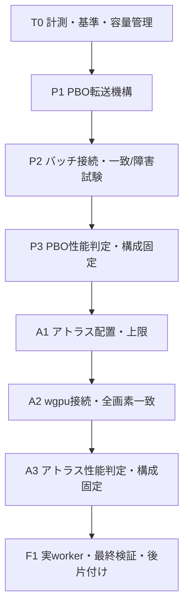

# Nico comment PBO → wGPU atlas 実行計画

作成日: 2026-09-25 / 最終更新: 2026-09-30 / 状態: T0/P1/P2/P3/A1/A3/F1完了。A2-C1/C2の実装・検証は完了。旧helperを使う変更前→候補separateの720p30/360f比較は再現できず、A2は完了扱いにしない。PBOは既定sync、Atlasは明示選択可能、既定Separate。

> **For agentic workers:** この計画の依存関係を守る。実行時は `parallel-task` で未ブロックの wave だけを扱い、各作業では `superpowers:executing-plans` の手順で実装・検証する。PBOとアトラスを同時に変更しない。統合、実機計測、成果物削除、採否判断はメインエージェントが担当する。

**Goal:** コメント付き動画の変換時間を、出力の画素・時刻・順序・画質を変えずに短縮する。PBOの採否を確定し、その構成を基準にアトラス化の採否を確定する。

**Architecture:** ブラウザーの固有コメント画像抽出をWebGL2 PBOでまとめて読み戻す。その後、Rust compositor内で複数画像を通常のwGPU 2Dテクスチャへ詰め、連続する同一ページの描画をまとめる。NCT1 wire protocolとFFmpegへのRGBA出力方式は維持する。

**Tech Stack:** Go / chromedp / WebGL2 / Rust / **wgpu 0.20.1固定** / WGSL / FFmpeg / x264・NVENC。

**Spec:** [既存設計](docs/superpowers/specs/2026-09-23-niconico-comment-timeline-wgpu-design.md)、[既存実行計画](docs/superpowers/plans/2026-09-23-niconico-comment-timeline-wgpu.md)、[最新の検証記録](docs/verification/niconico-comments/timeline-acceptance.md)。本計画は追加の性能改善に限る。

## Global Constraints

- 描画はwgpuを維持する。D3D12/Vulkan直実装、`as_hal`、CUDA interop、wgpu更新を持ち込まない。
- x264を選ぶ機能、GPU失敗時の通知付きCPUフォールバック、キャンセル処理を維持する。最適化の非対応とGPU経路全体の失敗を区別する。
- CPU20%は試験条件だけに使う。実運用のCPU上限を追加しない。ゲーム負荷あり・なし・模擬CPU20%を別集計する。
- コメント数、解像度、FPS、フォント、品質設定、描画順、半透明、動画時刻、単一アンカー抽出を変えない。読み戻しのバッチは転送の単位であり、コメント配置を固定時間幅に分割する変更ではない。
- [RTSP/H.264契約](docs/RTSP_H264_COMPATIBILITY_CONTRACT.md)を維持する。1フレーム1映像スライスを検査し、エンコーダー設定・許容差・既存テストを緩めない。
- 共有checkoutの既存変更を保護する。必要な未コミット実装があるため、HEADだけのworktreeを現状と同等とみなさない。commit / push / release / 稼働配信停止は本計画に含めない。
- WGPUとブラウザーの既知のstrict pixel差分は別課題として残す。性能改善だけでWGPU全体をdefault-onへ変更しない。
- 生成物の容量上限、証跡保存、削除確認までを各段階の完了条件にする。

## Review Focus

1. PBO転送を発行した直後、またはコメントごとに待って並列性を失っていないか。
2. 同期関数 `_createTexture` 内にawaitを要求していないか。GPU待機中にGL stateを保持していないか。
3. バッチの途中で応答上限に達しても、先行抽出したコメント・画像・IDが欠落／二重生成しないか。
4. アトラス内の整数座標と元画像サイズが維持され、隣の画像を参照しないか。
5. A→B→Aの重なり順、Rust/WGSL/debug用構造体のレイアウトが一致するか。
6. 待機、RAM/VRAM、一時ディスク、例外時の後片付けが有限か。
7. 変更前後の比較条件が揃い、skip・CPUフォールバックをGPU成功として扱っていないか。

## 1. 現状と改善対象

### 現在のデータ経路

```text
niconicommentsで配置・画像生成
  → sprites.js: 固有テクスチャごとに同期readPixels
  → timeline.js: 各コメントでawaitして画像を回収
  → lossless pack / deflate / CDP
  → Go: NCT1 scene
  → Rust/wgpu: 画像ごとのテクスチャ、隣接する同一画像をまとめて描画
  → 出力フレームのRGBA readback → FFmpeg → MP4/HLS
```

- `internal/nicorender/assets/sprites.js` の `_createTexture` は新しく作られたテクスチャを読み戻す。**1コメントにつき必ず1回ではない。** 同じ画像を使うコメントは共有される。既存設計には72コメント・13画像の記録があるが、今回の各runで実数を採る。
- `timeline.js` は現在、1コメントを抽出するたびに `await __nicoSpritesTake()` する。PBOをここへ単純に置き換えるだけでは、待機回数を十分に減らせない。
- 現在のCDPバッチは既定4件、最大32件、目標16MiB、1応答上限48MiB。1コメントの画像は32MiBまで。NCT1は画像1枚128MiB、合計256MiB、10,000画像、100,000描画が上限。
- `renderer.rs` はすでにinstancingと1秒単位のRenderBundleキャッシュを使っている。アトラスの狙いは、残っている画像の生成・upload・bind切替・draw runの費用を減らすこと。
- PBOは**ブラウザーから画像を抽出する段階**、アトラスは**wgpuで合成する段階**に作用する。どちらも出力フレームのGPU→CPU転送やFFmpeg encodeそのものを取り除かない。1080p30・6秒のRGBA出力は約1.493GBであり、この費用は残る。

### 過去の参考値と今回の基準

2026-09-25の最新記録、6秒・1080p30、FFmpeg 9.0.1、RTX 5070 Ti/Vulkan、CPU上限なし、direct MP4、各5組:

| 構成 | コメントなし中央値 | コメントあり中央値 / 最大 | 組ごとの追加時間の中央値 |
|---|---:|---:|---:|
| x264 / ring2 | 1.314秒 | 2.915 / 3.033秒 | 1.572秒 |
| NVENC / ring3 | 0.755秒 | 2.145 / 2.316秒 | 1.331秒 |

これは過去の参考値。今回T0で再計測する。最新runはゲーム稼働未確認であり、ゲーム負荷での合格根拠には使わない。別FFmpeg版、worker MP4+HLS、異なるFPSの結果を混ぜない。利用者の3秒目標と3秒台の受入れは尊重しつつ、本改善ではまず同条件の相対短縮を判定する。

## 2. 依存関係・順番・責任範囲



| ID | depends_on | description / owner | location | validation / 次に進む条件 |
|---|---|---|---|---|
| T0 | [] | 現状の保存と測定手順。main | capture report、実験スクリプト | 無変更相当の計測、入力/実行物hash、容量manifest |
| P1 | [T0] | PBOページの発行・回収・解放。PBO担当 | sprites.js、新規PBO helper | 状態機械・GL復元・byte上限の試験 |
| P2 | [P1] | バッチへの接続。PBO担当、main review | timeline.js / timeline_capture.go、Go試験 | seeded NCT1完全一致、障害/再試行/legacy回帰 |
| P3 | [P2] | PBO採否確定。main | 実験スクリプト、検証記録 | 性能比較と採用/不採用を記録、生成物削除 |
| A1 | [P3] | 決定的なpacking。atlas担当 | 新規atlas.rs / lib.rs | 配置・上限・退避の単体試験 |
| A2 | [A1] | GPUページ描画。atlas担当、main review | renderer.rs / timeline.wgsl / main.rs、Rust/Go試験 | 変更前wgpuとの全画素一致、境界と描画順 |
| A3 | [A2] | アトラス採否確定。main | 実験スクリプト、検証記録 | P3確定構成との比較、生成物削除 |
| F1 | [A3] | 選んだ組合せの実worker確認。main | worker E2E、payload検証、文書 | MP4/HLS・通知・CPU選択・容量確認 |

各waveは表の1段階。担当を分けてもPBOとatlasの実装は並行させない。作業者へ所有ファイルを渡し、「共有checkoutであり他者の変更を戻さない」を明示する。独立した読取レビューだけは実装後に委譲できる。

T0/P1/P2/P3を完了し、P3の証跡と採否を下記へ記録した。次はA1で、以降も段階ごとの変更、検証、採否、証跡を追記する。

**P3でPBO不採用になってもA1へ進む。** 同期版を基準として固定し、アトラス単独の価値を測る。各ゲートで正しさの不一致が出た候補は採用せず、原因修正か不採用記録によって段階を閉じる。

## 3. 共通の測定・採用規則

### 計測の固定条件

- 入力動画・snapshot・niconicomments bundle・フォント条件・Chrome/Edge・FFmpeg/ffprobe・helper/workerを固定し、パス、版、SHA-256、GPU/driver/backendをJSONへ保存する。snapshotの乱数seedも固定する。
- 既存実入力は `internal/nicorender/testdata/timeline/fixtures.json` のhashを参照する。保管場所は実行時に解決し、過去に削除されたTempの存在を仮定しない。入力欠落時は実入力未検証と明記し、synthetic結果を代用しない。
- 同じ候補binaryを切替モードで比較する。機能無効時とT0の差も測定し、計測追加による費用を混ぜない。性能用はrelease helper、検証用debugと混同しない。
- warm-upは各モード1回、集計外。各5組を初期評価とし、AB/BAを交互にする。改善が小さい、またはばらつきと区別しにくい場合は、候補と測定条件を固定して**追加の確認測定を10組×2セッション**行う。初期5組と確認20組は分けて保存し、確認中の途中結果で都合よく打ち切らない。外れ値、失敗、fallbackも記録する。
- 主条件は6秒1080p30・NVENC/ring3、併せてx264/ring2。PBOとatlas以外のbatch数4、compression、readback ring、encoder presetを固定する。
- CPU無制限を通常条件とする。ゲームが動いていれば停止せず、VRChat稼働・システムCPU・export process tree CPU・RAMと取得可能なGPU使用量を記録し、負荷が変わった組を分ける。CPU20%模擬を追加する場合は別ラベルにし、専用budget runnerの外側制約だけを使う。
- `capture_wall`、`helper_wall`、`convert_wall`、`worker_wall`、`ready_wall`、decode検査時間を分ける。並行するstageの時間を足して全体時間としない。初回起動／暖機後も分ける。

### 判定規則

以下は今回の**最適化選定基準**であり、既存の製品受入れ基準を置換しない。

**小さくても再現する改善は拾う。改善率・短縮秒数による固定の足切りは設けない。** PBO/atlasはそれぞれ実装して測り、改善幅が小さいという理由だけで採用候補から外さない。

1. **正しさ:** PBOはseeded scene全byte一致。atlasは同じsceneからの旧wgpu出力とRGBA全byte一致（tolerance 0）。フレーム数・時刻・順序・透過外領域を含む。1byteでも変われば性能に関係なく不採用。
2. **主効果:** PBOはcapture全体、atlasはhelper全体を主指標として測定前に固定し、両方ともconvert/worker全体も確認する。各組の短縮量は `基準時間 - 候補時間` で算出する。**数msや1%未満でも、繰返し確認できる短縮は採用対象**とする。処理内部の一部分やdraw数だけの改善では採用を決めない。主指標の改善が全体時間へ現れない場合も、全体の再現する退行がなく、資源使用量・安定性の条件を満たすなら採用できる。その場合は「段階の処理費用削減」と「全体の短縮未確認」を分けて報告する。
3. **全体の退行防止:** 必須の各性能セルでconvert時間の悪化が見えたら、絶対値が小さくても追試する。再現する全体の退行があれば候補を修正するか不採用にする。最大値も保持し、反復するstall/timeoutを中央値で隠さない。小さな改善を拾うために小さな退行を無視しない。
4. **僅差の確認:** 初期評価だけで誤差と断定しない。追加確認の各セッションで短縮量の中央値が正となり、確認20組のpaired差分中央値の95%信頼区間が0を上回るかを調べる。集計はセッション内の組を再標本化するbootstrap 10,000回、固定seed、percentile区間を使い、全標本と手法を保存する。A/A対照や順序別集計に系統的な偏りがあれば測定系を直して取り直す。確認しても区別できない場合は「改善未確認」とし、既存方式を既定値に残す。「効果ゼロ」とは断定しない。速度向上率を約束しない。
5. **容量・安定性:** 明示したbuffer上限内、反復後に未解放リソースが増えない、キャンセル・失敗後のchild/staging残留なしが必須。

5標本のp95は精密な分位点と扱わず、全標本と最大を示す。既知のブラウザーstrict差分（現行software参照352px、ANGLE診断19pxが許容差1超過）は別表で保持する。この不合格を候補同士の一致試験で上書きしない。

## Task 1: T0 — 基準と小さな計測器

- **depends_on:** []

**変更範囲:** `internal/nicorender/timeline_capture.go`、`assets/sprites.js`、`assets/timeline.js`、`internal/video/niconico_timeline_performance_test.go`、`scripts/experiments/nico-timeline/`。計測追加は動作を変えず、診断を無効化した計測も残す。

- [x] 現行JS/WGSL/Go/Rustのhashと測定入力をmanifestへ保存。基準helperを1個だけTempへ複製して `keep_until=F1` を記録した。
- [x] 固定seed `0x4e49434f`・実snapshot・1080p30/6秒条件でNCT1 scene JSONとSHA-256をF1まで保存した。
- [x] capture reportへ固有texture数、readPixels回数/bytes/time、draw、pack、deflate、serialize、CDP capture-call時間を追加した。PBO発行/待ち/copyはP1で実装後、同じreportへ足す。
- [x] capture metricsをGo encode report、worker result JSON、timeline/worker perf run JSONへ省略可能フィールドとして伝搬した。古いreportで欠落を0測定値と誤認しない。
- [x] 小改善判定と集計fixtureを追加した。1msの再現改善を確認でき、改善なし・単一sessionのみの効果は未確認となる。mode切替wrapperはPBO経路が存在するTask 4/P3へ移す。
- [x] 既存`benchmark.ps1`で固定入力・FFmpeg/helper・出力frame/decode検証と5組の条件を使用し、NVENC/x264別run manifestへhashと環境情報を保存した。
- [x] T0を各encoder 5組で測り、同期版A/Aも5組実施した。標本・中央値・最大・A/A差を下の実測記録へ記載する。
- [x] Temp artifact manifestとcleanup manifestを保存。生成MP4/test exe 38件・346,762,356 bytesを検証後に削除し、run JSON、scene/hash、helperだけを残した。

**validation:** `rtk proxy go test ./internal/nicorender -count=1` PASS; `rtk proxy go test ./internal/nicoexportworker -count=1` PASS; `rtk proxy go test ./internal/video -run '^Test(NicoTimeline|NicoRequiredTimeline|NicoNative)' -count=1` PASS; `rtk proxy go test ./internal/server -run 'Test.*Nico.*(Worker|Timeline|CPU|Fallback)' -count=1` PASS; timeline Python comparison/statistics suite PASS (26 tests). Seeded scene was written and hashed. NVENC and x264 direct-MP4 runs completed without CPU cap; generated media/test binaries were removed after verification. PBO parity remains gated in P2 before candidate performance evaluation.

**T0 measurements (2026-09-25):** 6s, 1920x1080@30, RTX 5070 Ti / Vulkan, FFmpeg 8.1.1, Chrome 153.0.8010.53; CPU cap disabled, VRChat absent during the host snapshot. NVENC/ring3: no-comment median 0.743s, timeline median 2.006s, paired additional time median 1.290s (max timeline 2.344s). x264/ring2: no-comment median 1.103s, timeline median 2.470s, paired additional time median 1.337s (max timeline 2.727s). Five NVENC A/A pairs had `timeline-a - timeline-b` median -14ms, absolute median 21ms and one +236ms outlier. Sync capture used 13 textures / 2,071,948 bytes; readPixels median 3.5ms, draw median 28.9ms, pack median 6.4ms, browser capture-call median 54.1ms. These are idle-host baselines, not game-load acceptance results.

Evidence: `%TEMP%/imagepad-nico-pbo-atlas-t0-20260925/t0-manifest.json`, `t0-cleanup-manifest.json`, `sync-scene.json.manifest.json`; benchmark run records remain in the three roots recorded by `t0-manifest.json`. Seeded scene hash: `dbbd2a75b9cdafe9d89081ee0d7448e27e607efbb91a67e59680af2459fd631a`.

## Task 2: P1 — byte上限付きPBO転送

- **depends_on:** [T0]

**depends_on:** [T0]

**変更範囲:** 新規 `internal/nicorender/assets/timeline_pbo.js`、`assets/sprites.js`、`timeline_capture.go`のembed/injection、PBO用browser test。PBO scriptはtimeline経路だけへ注入する。

### 実装する契約

```text
enqueue(texture, width, height, textureID) -> pending descriptor または同期pixels
seal() -> 未sealページの最後のwrite後にfenceを置き、flush
drain(deadline, cancellation) -> descriptor順にpixelsを確定
dispose() -> PBO / fence / FBO / JS参照を全て解放（再実行可）
```

- [x] `_createTexture`は同期関数のまま、IDを先に割り当ててdescriptorを登録する。同期版で直後に行っていたpackを、PBOではdrain後に行う。
- [x] **textureごとにPBOを増やさず、ページ内offsetへ複数のreadPixelsを発行**する。offsetは4byte境界。ページは必要量に応じて1/2/4/8/16MiB、live容量合計32MiB以下、最大32ページ。単一画像が16MiBを超える場合や同期フック内で空きが足りない場合は、GL stateを整えて当該画像を従来の同期readbackで回収する。
- [x] textureごとのfence/getBufferSubDataを避け、sealしたページごとにfenceを1個、使用範囲のgetBufferSubDataを1回にする。ページはGPU完了と全descriptor消費まで再利用しない。
- [x] waitは `clientWaitSync(..., 0, 0)` とevent loopへ戻るtimerを使う。同一taskでbusy loopしない。`Promise.resolve()`だけのmicrotask繰返しにも頼らない。Goの既存60秒deadlineを越えず、cancelで待機を解除する。
- [x] 変更するREAD/DRAW framebuffer、read buffer、PIXEL_PACK_BUFFER、PACK alignment/row length/skipsを保存・復元する。同期readPixelsではPBOをunbindする。GL stateの復元は各呼出しのfinally内で完了させ、awaitを跨いでbindingを保持しない。
- [x] textureの削除・retireは発行済み読み戻しを破壊しない寿命管理にする。必要な参照をdrainまで保有し、二重deleteを避ける。
- [x] PBO未対応・開始前の資源準備不可は同期抽出へ退避して理由を診断記録する。`WAIT_FAILED`、context lost、転送不整合は部分sceneを返さずcapture失敗として既存の通知付きCPU fallbackへ渡す。ユーザーキャンセルはfallback再試行せずキャンセルのまま返す。
- [x] `__nicoSpritesTake`の既存同期呼出し契約は維持する。legacy経路にPBOのpending stateを持ち込まない。

**validation:** 新規 `TestTimelinePBOReadbackState` を実browserで実行。複数画像を1ページへ配置、ページ切替、容量超過時sync、遅延fence、WAIT_FAILED、context lost、cancel、GL状態復元、dispose複数回、delete前後を検査する。小さな固有RGBAパターンで行方向と全byteを比較し、各失敗後のlive page/fence数0を確認する。

## Task 3: P2 — 抽出と回収を分けてバッチへ接続

- **depends_on:** [P1]

**depends_on:** [P1]

**変更範囲:** `assets/sprites.js`、`assets/timeline.js`、`timeline_capture.go`、`timeline_capture_test.go`、`timeline_capture_integration_test.go`、`sprite_test.go` / `sprite_codec_test.go`。

- [x] 抽出を `recordElement(index, probe) -> token` と `finalizeElement(token) -> existing result` に分ける。tokenはindex、vpos、x/y、commands、作成texture ID、retire情報を不変の値として持ち、共有のframes/textures配列を後から参照しない。
- [x] バッチ内ではrecordを先に進め、seal/drain後に順番どおりpack/deflate/finalizeする。画像ごと／コメントごとの即awaitをなくす。配置・draw呼出し順・1アンカーは保持する。
- [x] PBO32MiBとは別に、未返却pixel backing storeは最大64MiBでcredit管理する。次のコメントを始める前に既存の1コメント上限32MiBを予約し、実使用分以外を返す。入らなければコメント境界でdrain/finalizeする。creditはArrayBuffer単位で持ち、**そのbacking storeの最後の参照を解放した時だけ返す**。返却済みprefixと保持中suffixが共有する場合も全容量を計上し、subarrayを小さく数えない。FIFOがcreditを保持している場合は新規recordよりFIFOの消費を優先し、空き待ちの循環を作らない。
- [x] バッチ境界は既存の件数上限とbyte creditで決める。pending tokenも最大32件。pack/deflateは有限数で順番に実行し、全画像の追加コピーを同時に作らない。
- [x] 応答16MiBに達したとき、先行record済みのsuffixをbounded FIFOとして保持する。先頭は現在のpendingCaptureElement相当、続く未返却tokenも保持する。次のrequestのindex列がFIFOと一致することを検証し、再drawしない。既に返したtextureの再送・未送textureへの先行参照を防ぐ。
- [x] ここでのpending継続は、正常受信した応答の `consumed` に基づく進行だけを許す。CDP応答喪失・timeoutでJS側の消費位置が不明になったら同じ要求を再送しない。browser sessionとGo側の途中scene全体を破棄し、既存のcapture失敗処理へ渡す。キャンセルなら即終了し、それ以外の対象エラーは既存の通知付きCPU fallbackを使う。部分sceneを継ぎ足して復旧しない。
- [x] 最初の1件が目標16MiBを超える既存挙動と、CDP絶対上限48MiBを維持する。1件ずつserializeし、encode済み一時itemも48MiB以内。retained suffixには可能な限りraw/tokenを残し、大きなbase64文字列をバッチ全件分保持しない。
- [x] Go内の診断切替 `NICO_TIMELINE_ASSET_READBACK=sync|pbo` を追加する。未設定は採否確定までsync。不正値は曖昧に無視せず設定エラー。reportにはrequested/actual mode、sync退避回数・理由を残す。UI設定は増やさない。
- [x] T0保存sceneと候補sync、候補syncとPBOの二段階で、decoded texture hashと最終NCT1 byte列を比較する。seedと全capture条件を一致させ、scene一致を満たしてから性能を測る。

**validation:** 新規 `TestTimelineCapturePBOParity` と既存 `TestTimelineCaptureIntegration` で、実snapshot、空、同画像共有、多色/灰色/palette/deflate、半透明A→B→A、複数primitive、stage外、1byte response budget、複数pending suffix、prefix/suffix共有ArrayBufferのcredit、cancel、上限直前/直後を確認する。JS消費後の応答喪失を注入し、同じrequestを再送せず途中scene破棄・資源解放することも確認する。35コメントの既存batch試験とlegacy sprite試験も通す。forced sync退避のsceneも同一にする。

```powershell
# browserを実行するtestでは、opt-inを設定し未実行をPASSと扱わない。
rtk proxy pwsh -NoProfile -Command '$env:NICO_TIMELINE_INTEGRATION="1"; rtk proxy go test ./internal/nicorender -run "^Test(TimelinePBOReadbackState|TimelineCapturePBOParity|TimelineCaptureIntegration)$" -count=1 -v'
rtk proxy go test ./internal/nicorender -count=1
```

## Task 4: P3 — PBO採否を決める

- **depends_on:** [P2]

- [x] `optimization-benchmark.ps1`でsync/PBOを同一helper・同一test binary・同一encoder条件のAB/BA順に切替える。既存`benchmark.ps1`の必須入力とrun検証を再利用し、mode mismatch/fallback/skip/frame不足はsampleにしない。

- [x] 同じseed・batch4でsync/PBOのcapture単体を5組比較。固有texture数、GPU待機回数、drain bytes、pack/deflateを含むcapture全体、peak memoryを示す。
- [x] 同期版とPBO版の6秒1080p30、NVENC/ring3・x264/ring2をそれぞれ5組比較。コメントなしも同条件で測り、追加時間を残す。
- [x] 効果が小さい場合は共通規則の確認測定へ進み、readPixels待機削減がevent loop・コピー・pack費用で相殺されているかも調べる。小さいという理由だけで打ち切らない。batch数・圧縮方式など別最適化を同時に始めない。
- [x] 共通採用規則で `adopted` / `rejected` を決め、理由・全標本・既定値を記録する。採用した場合だけtimeline内の既定をpboへ変え、sync退避を維持する。不採用時の基準はsync。
- [x] 再現に必要なJSON/短いログを保存し、生成動画・raw・一時binaryを削除。**この段階の判断と後片付けが完了してからA1を開始する。**

### PBO実測結果・採否（2026-09-25）

- **決定: `sync`を既定に残し、PBOは不採用。** 速度向上を切り捨てない規則に従い、小さなx264の見かけ上の7ms短縮を別の2セッション・計20組で確認したが、どちらも同期版が速く、paired差中央値もPBO遅延側だった。
- 条件: 6秒・1080p30、RTX 5070 Ti/Vulkan、FFmpeg 8.1.1、CPU上限なし、同じ固定T0 scene、同じhelper/test binary/encoderをAB/BA交互に実行。ホスト状態ではVRChat不在。ゲーム稼働時の結果とは扱わない。
- capture単体5組: sync中央値0.731秒、PBO 0.770秒。paired `sync-PBO` 中央値−41ms。1実行のcapture reportは13 texture/2,071,948 bytes、PBO drain 39.3ms（fence wait 34.4ms、copy 2.6ms）で、同期 readPixels 3.2ms。非同期化費用が残り、capture段階も速くならなかった。
- NVENC/ring3の初期5組: no-comment中央値0.680秒、sync 1.822秒、PBO 1.838秒。コメント追加時間中央値はsync 1.111秒、PBO 1.109秒と約2ms PBO寄りだったため、この差も候補として追試した。
- NVENCの独立追試2セッション×10組では、paired全体 `sync-PBO` 中央値がA −3.117ms、B −117.953ms、計20組−69.841ms、bootstrap 95% CI [−138.879ms, +35.444ms]（seed 20260925）で改善未確認。コメント追加時間中央値もAでsync 1.051秒/PBO 1.092秒、Bでsync 1.070秒/PBO 1.203秒となり、双方でPBOが遅かった。初期5組の小さな優位は再現しなかった。
- x264/ring2の初期5組: no-comment 0.918秒、sync 2.096秒、PBO 2.089秒。初期の7ms差を捨てず追加確認を実施。session A/Bは各10組でpaired中央値がそれぞれ−14.850ms、−47.459ms（正値がPBO有利）。計20組の中央値−44.120ms、bootstrap 95% CI [−89.640ms, −21.193ms]、10,000 resamples、seed 20260925。PBOは別セッションでも遅く、差の区間も0を含まなかった。
- 画素検証: current syncとPBOおよび保存T0 sceneは全byte一致。GL state復元、PBO未対応・容量退避、cancel/error/dispose、pending pixel上限の対象試験を実行。最終回帰では `internal/nicorender` 全件、Nico関連 `internal/video`、`internal/nicoexportworker`、Nico関連 `internal/server`、比較用Python 19 testがすべて通過。
- 保持した証跡: `%TEMP%/imagepad-nico-pbo-atlas-p3-nvenc-20260925/`、`...p3-x264-20260925/`、`...p3-x264-confirm-a-20260925/`、`...p3-x264-confirm-b-20260925/`、`...p3-nvenc-confirm-a-20260925/`、`...p3-nvenc-confirm-b-20260925/` のJSON/短いlog。x264追試は `...x264-confirm-b.../pbo-confirmation.json`、NVENC追試は `...nvenc-confirm-b.../pbo-confirmation-nvenc.json`。mp4計150本と `video.test.exe` 6本、計1,199,783,087 bytesを削除し、2つのcleanup manifestへ削除対象とSHA-256を記録。削除後のC:空き容量は631,206,117,376 bytes、対象生成動画/実行物の残留0。

## Task 5: A1 — 決定的で容量制限のあるアトラス配置

- **depends_on:** [P3]

**depends_on:** [P3]

**変更範囲:** 新規 `gpu/nico-compositord/src/atlas.rs`、`src/lib.rs`。この段階はGPUを作らない純粋なpacking処理。

```rust
// helper内部だけで使用。NCT1 Asset/Drawは変更しない。
struct AtlasRegion { page: u32, x: u32, y: u32, width: u32, height: u32 }
struct AtlasPage { width: u32, height: u32 }
struct AtlasPlan {
    pages: Vec<AtlasPage>,
    regions: std::collections::BTreeMap<u32, AtlasRegion>, // key = asset ID
    allocated_bytes: u64,
}
```

- [x] 非回転・整数座標・deterministic shelf packingを実装。packing順だけを高さ/幅/asset IDで決定し、描画順は入力どおり別管理する。矩形を分割・縮小しない。
- [x] 通常ページの候補幅256/512/1024/2048/4096のうちdevice上限以下を比較し、occupied boundsへ切り詰めた実面積を採る。ページ高さも最大4096かdevice上限の小さい方。候補集合・tie-breakを固定し、無制限の探索をしない。
- [x] 総GPU asset bytesは `min(256MiB, 元画像合計の2倍 + 1MiB)` 以下。checked arithmeticと各画像の境界・重なり・参照先をGPU allocation前に検証する。
- [x] 通常ページに入らない有効な画像は単独ページへ置く。膨張率条件を満たせなければscene全体を従来の個別画像構成へ戻す。validな入力をatlasのためだけにunsupportedにしない。device自体の上限超過は既存のエラー経路を使う。

**validation:** 空、1画像、同サイズ多数、奇数幅、1×N/N×1、非正方形、multi-page、巨大単独画像、duplicate ID、不正寸法、計算overflow、上限直前/直後、同じ入力の完全決定性。10,000画像のmetadata stressでは巨大pixel fixtureを保存しない。新規 `atlas` module単体試験を `rtk proxy cargo test --manifest-path gpu/nico-compositord/Cargo.toml --locked atlas` で実行する。

**A1実装・検証結果:** 2026-09-25。`src/atlas.rs`と`src/lib.rs`だけを変更。TDDで期待APIのない状態の失敗を確認し、11件のatlas単体試験を追加した。`cargo test --manifest-path gpu/nico-compositord/Cargo.toml --locked` はlib 17、main 4、readback 3、render contract 5 pass / hardware限定5 ignored、doc tests 0で成功。`cargo fmt -- --check` と `git diff --check` も成功。render/GPU資源への接続はA2で行う。

## Task 6: A2 — wGPUへ接続し、画素と順序を保持する

- **depends_on:** [A1]

**depends_on:** [A1]

**変更範囲:** `src/renderer.rs`、`src/timeline.wgsl`、`src/main.rs`、`src/scene.rs`、`tests/render_contract.rs`、`internal/nicorender/timeline_wgpu_integration_test.go`。

- [x] Atlasではpacking検証後にページtextureだけを作り、巨大CPU atlas canvasを作らず、元asset RGBAを各page originへuploadする。Separateでは個別textureを作る。Atlas実機レポートとSeparate/Atlas全byte行列で確認。

- [x] helperの診断切替は環境変数ではなく `--asset-layout separate|atlas`。未指定はSeparate。self-testと通常描画に同じmode解決を使い、requested/actual layoutとfallback理由をreportへ追加する。
- [x] Goから `TimelineRuntimeOptions.AssetLayout` をhelperへ渡し、strict runtime report readerでrequested/actual layout、fallback理由、protocolを検証する。NCT2 Atlasは明示的なstreamed-layout fallbackを要求し、legacy Separate omissionは互換を保つ。telemetryを `NicoEncodeReport` へ伝播する。
- [x] `GpuAsset`をpage資源とasset→region参照に分け、pageごとのbind groupを作る。Rgba8Unorm、premultiplied alpha、既存blend、top-leftを維持する。
- [x] asset regionは既存の112-byte `GpuDraw` record内へpackする。recordを128 byteへ拡張せず、Rust/WGSL/debug経路のABIとstorage limitを維持し、region round-tripを試験する。
- [x] VertexOutputでregionを `@interpolate(flat)` の整数値としてfragmentへ渡す。UVと位置計算は既存の0..1 / f32式を維持する。
- [x] fragmentのsample positionと8bit補間weightは**元画像width/height**で既存式を使う。各textureLoad座標を元画像内へclampしてからatlas originを加える。hardware linear samplerに置き換えない。
- [x] page bind runを描画順に連続区間として作る。owner/comment/primitive順を保持し、ページIDで全体sortしない。A→B→Aは3runのまま。
- [x] NCT1 SeparateとAtlasの両方でページ寸法・使用/割当texel、upload call/bytes、描画順page-run、host CPU bundle-build wall timeをreportする。WGPU内部bundle bytesは取得できないためnullと理由を出し、GPU実行時間と混同しない。
- [x] 既知のresident-memory値（decoded scene pixels、論理texture allocation、renderer draw-buffer payload、readback ring）を分けてreportする。WGPU内部staging、bundle内部bytes、physical VRAMはnullと理由を出し、重複合算した総量を作らない。

**validation:** `atlas_render_is_byte_identical_and_batches_distinct_assets_on_one_page`、`alpha_compositing_preserves_owner_order_across_a_b_a_texture_runs`、`top_left_projection_keeps_distinct_texture_rows_in_place` を含む全6 ignored `render_contract` hardware testsを実行。RTX 5070 Ti/Vulkanで6/6 PASS。さらに保存sm9 sceneのSeparate/Atlas全byte比較を720p30/360f、720p30/180f、720p60/360f、1080p30/180f、1080p60/360f、1080p59.94/360f、4:3/180f、square/180fで実行し8/8 PASS。変更前helper legは未達。

```powershell
rtk proxy cargo test --manifest-path gpu/nico-compositord/Cargo.toml --locked
rtk proxy pwsh -NoProfile -Command '$env:NICO_TIMELINE_GPU_POSITION_TEST="1"; rtk proxy cargo test --manifest-path gpu/nico-compositord/Cargo.toml --locked --test render_contract -- --ignored --nocapture --test-threads=1'
```

実GPUのない環境でignored/skipになったものは未検証と記録する。利用可能なRTX/Vulkanを第一対象とし、D3D12は同じWindows機での別backend確認。AMD/Intel実GPU、Apple Silicon/Metalは実機がある場合だけ合格を記録する。

さらに同じ固定sceneについて **T0保存の変更前helper → 候補separate** と **候補separate → 候補atlas** の両方で720p30・12秒360frameを全byte比較する。共通shader変更が両候補に同じ誤りを入れても見逃さない。720/1080p×30/60fps、59.94fps、4:3、squareは6秒の全frame比較を1caseずつ行い都度rawを削除する。各caseで3本を同時に保存せず、最初の比較後に旧出力を削除してseparate/atlas比較へ進む。実装する `TestTimelineAtlasParity` は既存 `compare.py --tolerance 0 --require-transparent-exterior-exact` と同じ判定を使う。

既存 `TestNicoTimelineIntegrationBrowserWGPU` のstrict browser比較も別に再実行した。SeparateとAtlasは全360frame・全byte hash一致。双方ともbrowser比較は同一の既知FAIL（tolerance 1に対しmax channel diff 2、超過62px）で、透明領域は完全一致、draw order mismatch 0、positionは許容内。値を `docs/verification/niconico-comments/a2-browser-wgpu-parity-2026-09-30.json` に保存し、raw/diff画像は削除した。

### A2 evidence-closure addendum (2026-09-30)

A2 remains **in progress** because the exact old-helper 720p30/360f comparison is unavailable. The telemetry and current Separate/Atlas saved-scene matrix requirements below are now verified. Current checkout inspection found that the original checkbox list no longer matches the implementation in several details; do not infer completion from source presence alone.

#### Candidate and tolerance decision (2026-09-30)

- Correction: the user's 1 px tolerance refers to the count of pixels over the strict pixel gate, not spatial position error. The best recorded shader candidate is T13.3, `NCT1 double-double motion plus nearest-even 8-bit bilinear sample and weight quantization`: on the frozen 720p30/360f scene it reduced the baseline from 352 over-tolerance pixels to one, with maximum channel difference 2. The remaining pixel is frame 74 at (1076, 645), alpha 35 versus 37. Evidence: `docs/verification/niconico-comments/t13-double-double-even-sampler-candidate-2026-09-29.json`.
- The user accepts that one-pixel residual for candidate selection. T13.3 remains an isolated candidate, not a strict-gate pass or a production promotion: its record says `productionShaderChanged=false`, and the subsequent alpha-only ties-down candidate worsened the residual from 1 to 15 pixels. Requalify the exact T13.3 candidate before changing the production shader.
- Asset-layout selection is a separate decision: keep **Separate** as the default and Atlas as an explicit option. The eight-profile Vulkan matrix shows the layouts are byte-identical, while repeated A3 measurements did not establish a reproducible Atlas speed benefit.
- The current A2 browser comparison is a different profile/backend and still records 62 pixels over per-channel tolerance 1. The T13.3 result does not replace that evidence or waive the missing exact T0-helper 720p30/360f comparison, so A2 remains open.

Current evidence:

- Rust accepts `--asset-layout separate|atlas`; Go passes `TimelineRuntimeOptions.AssetLayout` to that argument. Separate remains the default. This is the implemented diagnostic boundary; the originally written `NICO_TIMELINE_ASSET_LAYOUT` environment-variable name is not present in the code.
- Atlas origins and dimensions are packed into the existing GPU draw record and round-trip tested. The record was not enlarged from 112 to 128 bytes; correct the obsolete checklist description rather than changing the ABI to match it.
- Rust reports static NCT1 page occupancy, actual asset upload calls/bytes, ordered page-run count, host render-bundle build wall time, and known logical memory categories. Opaque WGPU staging/bundle/physical-VRAM values remain null with reasons. The strict Go report reader and `NicoEncodeReport` propagation are implemented and covered by NCT1/NCT2 fixtures.
- `TestTimelineAtlasParity` compares current Separate against current Atlas over all eight profiles; it does not establish old-helper-to-candidate parity. The pinned old helper/source remains absent from the recorded T0 root and repository history. The historical three-way result remains 180-frame evidence.
- Fresh Vulkan evidence: the full locked Cargo suite passed 114 tests with 9 adapter-only tests ignored; all six ignored `render_contract` hardware tests passed on NVIDIA GeForce RTX 5070 Ti/Vulkan; both Go packages passed. The opt-in eight-profile saved-scene matrix passed 8/8 with no fallback and exact RGBA hashes.

#### Closure tasks

| ID | depends_on | Work | Acceptance |
|---|---|---|---|
| A2-C1 | [] | Implement and test labelled Rust runtime telemetry and propagate it through the strict Go runtime report reader into `NicoEncodeReport`. Report occupancy numerator/denominator, actual upload operations/bytes, maximal consecutive page runs in preserved draw order, host CPU bundle-build wall time, known logical allocations, and explicit null/reasons for opaque WGPU memory. | Locked Rust tests, strict Go NCT1/NCT2 fixtures, and real Vulkan Separate/Atlas saved-scene reports agree on effective layout, pages, uploads, nulls/reasons, and resident-memory scope. Existing pixels, order, queue ownership, and H.264 output remain unchanged. |
| A2-C2 | [] | Add an opt-in `TestTimelineAtlasParity` for the pinned T0 scene in Separate and Atlas modes. Hash output incrementally, run sequentially, preserve scene content except output header profile fields, and retain only compact metadata and hashes. | 720p30/360f and all seven additional resolution/FPS/aspect profiles pass exact RGBA hash equality, frame/byte counts, layout checks, and no-fallback assertions. Default test remains opt-in; no raw frame output is retained. |
| A2-C3 | [] | Search only the identified project, saved T0 root, and release/archive locations for the exact pre-change helper/source hash from the T0 manifest. Do not substitute the current helper or rebuild a different revision as the old baseline. | Recover and hash-verify the exact old helper for the 360-frame 720p30 leg, or record the leg as unreproducible with exact searched paths and keep that acceptance item open. The historical 180-frame result stays labelled 180-frame evidence. |
| A2-C4 | [A2-C1, A2-C2, A2-C3] | Re-read this plan, rerun required Rust/Go and real-Vulkan checks, save compact evidence, reconcile the original A2 checkboxes and implementation descriptions, then update the header status. | Mark only directly evidenced requirements complete. Do not claim A2 complete while any required parity leg is missing, a requested runtime metric is unavailable, or the GPU comparison falls back. |

**A2-C2 progress (2026-09-30):** The opt-in matrix and its strict NCT1 telemetry validation passed on RTX 5070 Ti/Vulkan for all eight profiles. The 720p30/360f Separate and Atlas outputs were 1,327,104,000 bytes each with SHA-256 `d834aa3cb948b31a17264652fc1701edd3e5c5c9dce7015c1ee99f55b4e8753a`; the other seven hashes and telemetry are in `docs/verification/niconico-comments/a2-atlas-parity-matrix-2026-09-30.json`. No raw RGBA files were retained. The old-helper 720p30/360f leg remains separate and open.

**A2-C1 progress (2026-09-30):** Rust telemetry, 2 MiB producer bound, NCT2 unknown-metric/fallback report, strict Go bounded reader, NCT1 geometry/occupancy validation, and encode-report propagation are complete. The Go production reader now also uses the shared strict JSON scanner, rejecting duplicate keys at the top level and inside nested telemetry before decoding. Review-added duplicate-key fixtures failed before the reader change and pass afterward. Cargo tests/fmt, Go `internal/nicorender` and `internal/video` packages, all six Vulkan render contracts, and the eight-profile Vulkan matrix passed. The matrix report validates Separate and Atlas telemetry under the actual runtime layout. C1 acceptance is complete.

**A2-C3 search result (2026-09-30):** The exact helper SHA from the T0 manifest was not recovered. The T0 cleanup manifest records deletion of `baseline-helper.exe` (8,094,720 bytes, SHA-256 `18c30a8cc0da989284709078fbc42dadec96ccbaf1e6c44e050f6259a20ef80e`). Fifteen same-name helper candidates across Temp and the current Cargo target were hash-checked; none matches. Four Temp files with the same byte length, one same-size workspace payload, and the only same-size Git blob were also checked; none matches. Seven of the nine T0 Rust crate source files were recovered by exact SHA-256 from Temp or Git objects; `src/main.rs` and `src/lib.rs` were not found by content hash in Temp, the 57 registered worktrees, or the Git object store. Fifty-two unreachable commits were inspected; none contains `gpu/nico-compositord`.

The public v1.8.0 tag tree and all nine public branch trees were checked through the GitHub API without downloading the full source archive; none contains `gpu/nico-compositord`. The v1.8.0 tree does contain `native/nico-compositor` C++/WARP sources and a `playlist-compositord` release asset, but no `nico-compositord` release asset. The `gpu/nico-compositord/src/renderer.rs` and `src/main.rs` GitHub path-history queries return zero commits. This corrects the earlier overly broad note that v1.8.0 had no compositor-related source or executable. Search evidence is saved in `docs/verification/niconico-comments/a2-old-helper-recovery-2026-09-30.json`. The exact 360-frame old-helper leg remains unreproducible and open; the historical 180-frame comparison remains labelled as 180-frame evidence.

#### Verification record (2026-09-30)

- Initial `rtk proxy cargo test --manifest-path gpu/nico-compositord/Cargo.toml --locked`: PASS (109 passed; 9 adapter-only tests ignored before telemetry changes).
- `NICO_TIMELINE_GPU_POSITION_TEST=1 rtk proxy cargo test --manifest-path gpu/nico-compositord/Cargo.toml --locked --test render_contract -- --ignored --nocapture --test-threads=1`: PASS (6/6 on NVIDIA GeForce RTX 5070 Ti / Vulkan; max reported projected position error 0.000179935 px against 0.003906250 px tolerance).
- `rtk proxy go test ./internal/nicorender -count=1`: PASS.
- The initial evidence pass changed no product source. The later A2-C2 harness implementation is recorded above; its matrix has not run yet. Jev authentication was unavailable; these records reflect deterministic local evidence only, not a Jev verdict.
- After Rust telemetry and NCT2 fallback changes, `rtk proxy cargo test --manifest-path gpu/nico-compositord/Cargo.toml --locked`: PASS (114 passed; 9 adapter-only tests ignored), with `cargo fmt --check` passing. Go integration and the full saved-scene Vulkan matrix remain pending.
- Fresh rerun: `rtk proxy cargo fmt --manifest-path gpu/nico-compositord/Cargo.toml -- --check` PASS; `rtk proxy cargo test --manifest-path gpu/nico-compositord/Cargo.toml --locked` PASS (114 passed, 9 adapter-only ignored); `rtk proxy cargo build --release --manifest-path gpu/nico-compositord/Cargo.toml --locked` PASS.
- Fresh Go verification: `rtk proxy go test ./internal/nicorender -count=1` PASS; `rtk proxy go test ./internal/video -count=1` PASS (73.523s); `rtk proxy gofmt -d` over the four changed Go files emitted no diff.
- Real Vulkan contract: all six ignored `render_contract` hardware tests PASS on NVIDIA GeForce RTX 5070 Ti / Vulkan, including exact Atlas/Separate pixels and A→B→A alpha ordering.
- Saved-scene matrix: opt-in `TestTimelineAtlasParity` PASS (8/8 profiles, 16 helper runs, no fallback; exact output hashes). Scene SHA-256 `dbbd2a75b9cdafe9d89081ee0d7448e27e607efbb91a67e59680af2459fd631a`; release helper SHA-256 `43ef78fe8ddc78efd2f054c001933e17b10bd6f97e0ad39977a1829c6d6c664cf`. The 720p30/360f Atlas report had 7 pages, 473,491 used texels, 489,147 allocated texels, 11 actual upload calls/1,893,964 bytes, 13 ordered page runs, 485,100 ns host CPU bundle-build wall time, and 11,059,200 logical readback-ring bytes. WGPU internal bundle/staging and physical VRAM values were null with reasons. Compact manifest SHA-256 `e52b677b89048f5663c6ee6c6587ff0611d9f55ff57f8e956d3a23c79bf40303` is saved as `docs/verification/niconico-comments/a2-atlas-parity-matrix-2026-09-30.json`.
- Browser reference: `TestNicoTimelineIntegrationBrowserWGPU` was rerun against the hash-pinned sm9 snapshot. Its browser capture used Headless Chrome 154 on Microsoft Basic Render Driver/D3D11; WGPU used RTX 5070 Ti/Vulkan. The test retains its known strict-pixel failure: 360/360 frames differ, max channel delta 2, 62 pixels exceed tolerance 1, transparent exterior exact, draw-order mismatch 0, 10,909 position samples with max X error 0.000228882 px under 1/256 px tolerance. Separate and Atlas WGPU outputs are byte-identical (SHA-256 `ae427e7a14fef6db37db710ab188e753cfeb0e8bceef1fe0ef3d60ac78fa46f7`). Compact evidence is saved as `docs/verification/niconico-comments/a2-browser-wgpu-parity-2026-09-30.json`.
- Cleanup: the task-owned browser comparison Temp tree contained 17 files/6,115,667,874 bytes, including 2,985,984,000-byte raw RGBA output; the verified tree was removed after saving compact JSON. The matrix Temp directory and its one-manifest copy were also removed. No raw RGBA or generated diff images remain from these A2 runs.
- Jev: the supplied-key request previously received HTTP 401 from the official TypeSafe endpoint, so no Jev verdict exists. TypeSafe's official docs specify the `Authorization: Bearer <API_KEY>` header. These are deterministic local test and runtime results, not a Jev judgment.
- Final review follow-up: duplicate JSON object keys were accepted by Go's default decoder in both top-level and nested telemetry fixtures. After wiring `nicorender.ValidateStrictJSONDocument` into the production reader, the two fixtures passed; the same focused test failed on both cases before the fix. `rtk proxy go test ./internal/nicorender -count=1` PASS (2.770s); `rtk proxy go test ./internal/video -count=1` PASS (73.946s). The old-helper 720p30/360f comparison remains open, so A2 is still in progress.
- Old-helper recovery follow-up: the exact T0 binary and a complete exact source set were not present in Temp, the workspace, registered worktrees, Git objects, or the inspected public v1.8.0/all-branches source trees. The compact path/hash search record is `docs/verification/niconico-comments/a2-old-helper-recovery-2026-09-30.json` (SHA-256 `f401bb4920cffa83d6490a850630e063d45411e54f9a024ca7befc2b9c55d56f`); do not substitute a similar binary or rebuild from mixed revisions.

## Task 7: A3 — PBO確定構成の上でアトラスを評価

- **depends_on:** [A2]

**depends_on:** [A2]

- [x] P3確定のsync/ring条件を固定し、6秒1080p30をNVENCとx264で各5組比較した。小差も対象とし、NVENCは独立10組×4セッション、x264は独立10組×2セッションで追試した。
- [x] 6秒720p30、720p60、1080p60を両encoder各5組比較した。初回中央値がAtlas寄りだった3セルは独立10組×2セッションで確認した。短尺測定は出力FPSを保ち、実時間へ丸めていない。
- [x] 保存済み154.955秒の実入力をNVENCで5組比較し、実時間倍率も算出した。
- [x] Atlas採否を確定。小差の確認区間はいずれも0をまたぐか、Separate寄りへ反転したため、Separateを既定に維持しAtlasは明示選択可能なまま残す。Atlasの速度効果を理由に既定化しない。
- [x] PBO/Atlasの採否、同条件比較とコメントなし対照、入力/実行物hash、frame/decode/audio/実modeをJSONに保存した。生成MP4とtest executableは各Temp rootのSHA付きcleanup manifest作成後に削除した。

**A3結果（2026-09-25）:** 比較差は`Separate - Atlas`で、正値がAtlas有利。1080p30初回5組はNVENC +7.831ms、x264 +8.168ms。NVENCの40組追試はA/B +8.682ms（CI95 −9.323〜+22.474ms）、C/D +1.127ms（CI95 −19.814〜+12.788ms）。x264は20組 −12.175ms（CI95 −41.086〜+22.299ms）。720p30/60・1080p60の初回中央値はNVENCで +21.207/−4.774/−6.147ms、x264で +53.572/+27.722/−6.382ms。Atlas寄りのNVENC720p30、x264720p30/60を各20組追試したが、中央値はそれぞれ −3.996ms（CI95 −11.025〜+1.436ms）、+4.163ms（CI95 −23.682〜+24.005ms）、−1.641ms（CI95 −31.864〜+19.099ms）。155秒NVENCはSeparate 14.165秒、Atlas 14.267秒、paired中央値 −142ms。よって再現するAtlas時間短縮は確認できなかった。実sceneのページ数は11→7に減ったが、割当byteは1,893,964→1,956,588（+62,624 byte）。saved T0 sceneの180 frameは旧helper、Separate、Atlasで全byte一致。A3実施時点では高密度synthetic profile未測定だったが、F1後に追加計測し、詳細を Task 15 に記録した。

## Task 8: F1 — 実worker・配布用payload・完了確認

- **depends_on:** [A3]

**depends_on:** [A3]

**変更範囲:** `scripts/build-nico-timeline-compositor.ps1`の既存手順を利用、payload/workerの既存試験、`docs/verification/niconico-comments/timeline-acceptance.md`、実験README。releaseは行わない。

- [x] 最新helperをbuildし、NCT1/Windows/amd64/wgpu 0.20.1 manifestとhelper SHAを照合した。Active配布物は触れていない。
- [x] 最新sourceから一時workerをbuildし、明示helperでE2Eを実施した。Worker SHAは各JSONに記録。
- [x] 実worker MP4+HLSを6秒1080p30のNVENC/x264各5回で測定。720p60/1080p60、4:3、square、59.94fpsも各1回確認し、convert/worker wallを記録。
- [x] 15本すべてのMP4/HLSをffprobeとFFmpeg `-xerror`全decodeで検査。frame count、MP4厳密PTS、HLS 90kHz半tick量子化、AAC/48kHz、H.264 1 frame/1 VCL sliceを検査し、NVENC/x264のcomment previewも確認。
- [x] PBO sync退避、atlas容量fallback、通知付きCPU renderer fallback、NVENC/x264選択、CPU選択、cancelの対象unit/integration試験を通した。fallbackをWGPU成功として数えていない。
- [x] 対象Go/Rust/Python/PowerShell試験とopt-in実GPU試験の結果を記録した。software browser strict pixel差分とAMD/Intel/Apple/Linux実機未検証は残し、WGPU default-offを維持する。
- [x] mode既定、採否、再現root、JSON/cleanup manifest、削除容量と終了空き容量を本書と検証記録へ追記した。

**F1結果（2026-09-25）:** RTX 5070 Ti/DX12、CPU上限なし。1080p30 NVENCのconvert/worker中央値2.099/2.168秒（最大2.224/2.292秒）、x264は2.405/2.552秒（最大2.486/2.575秒）、各n=5・fallback 0。720p60、1080p60、1440x1080/30、1080x1080/30、1080p60000/1001のNVENC runもすべてWGPU/no-fallbackで完走。実workerの15出力はframe/PTS/audio/slice/decode gateに合格。worker output validation reportとmatrix reportは`%TEMP%/imagepad-nico-pbo-atlas-f1-20260925/`に保持。F1+A3の追加cleanupでは生成media/test executable計6,133,163,791 bytesをSHA manifest作成後に削除し、対象31 Temp root内の残留MP4/TS/test executableは0。C:空き容量は検証終了時628,738,875,392 bytes。

基本の再確認コマンド:

```powershell
rtk proxy go test ./internal/nicorender -count=1
rtk proxy go test ./internal/video -run '^Test(NicoTimeline|NicoRequiredTimeline|NicoNative)' -count=1
rtk proxy go test ./internal/nicoexportworker -count=1
rtk proxy go test ./internal/server -run 'Test.*Nico.*(Worker|Timeline|CPU|Fallback)' -count=1
rtk proxy cargo test --manifest-path gpu/nico-compositord/Cargo.toml --locked
rtk proxy python -m pytest scripts/experiments/nico-timeline/test_compare.py scripts/experiments/nico-timeline/test_summarize.py scripts/experiments/nico-timeline/test_optimization_summary.py -q
```

実workerは既存READMEの `NICO_TIMELINE_WORKER_*` を**このrunで解決した実パス**へ設定し、`rtk proxy go test ./internal/server -run '^TestNicoTimelineWorkerPerformance$' -count=5 -v` を使用する。opt-inと実modeが出力に記録されなければ未実行扱い。無条件の `go test ./...` には過去build内の古いGo snapshotが混入するため、本計画の対象package成功を全repository成功と呼ばない。

## 12. 一時ファイル・メモリ・失敗時の管理

- 新規出力は専用 `%TEMP%/nct-pbo-atlas-<run-id>` 配下に限定する。入力・既存cache・稼働runtimeはmanifestへ削除対象として登録しない。
- **新規run成果物の合計上限12GiB**、次のcaseを始める前の空き容量下限20GiBを初期値とする。容量不足なら次の重いcaseを開始せず、すでに検証済みの自作出力を片付ける。ソース/cacheの無差別削除はしない。
- raw比較は同時に1caseの2streamまで。1080p60・6秒なら約5.97GB/2streamである。比較・hash保存直後に消し、全matrix分のrawを貯めない。MP4/HLSもdecode/PTS/slice/hashを保存したrunから消す。
- Cargo targetや既存Go cacheをrunごとに複製しない。共有cacheは削除対象外。専用一時worker/test exe/helperは再利用し、作成したものだけ終了時に削除する。
- T0の基準helperはF1完了まで途中削除から保護する。A2では変更前helperを実際のpixel oracleとして使う。F1で最終証跡を保存した後に当該コピーだけを削除し、元の実行物は触らない。
- 成功/失敗/cancelをtry/finallyで処理する。比較不一致は小さなcrop・該当frame・JSONを残し、何GBものrawを無期限保存しない。保存上限を越える場合はhashと再現条件を残す。
- 削除前にmanifest各項目の解決済み絶対パスがこのrun root配下にあることを確認する。WindowsではPowerShell `Remove-Item -LiteralPath` を使い、別shellへ文字列を渡して削除しない。共有プロセスや配信を止めない。
- browser PBO live容量32MiB、未返却pixels64MiB、単一serialized item48MiBを別々に計数する。既存scene上限256MiBとは別の追加一時容量としてpeakを報告する。GCで実際のRSSが即減るとは仮定しない。
- atlas GPU asset bytesの上限検査と、出力ringを含む実測RAM/VRAMを分ける。10回連続capture/render/cancel後にlive資源数・child数・一時ディレクトリが増えないことを確認する。

## 13. 完了時に残す成果物

1. PBO: 採用/不採用、同期退避条件、scene一致、固有画像数、capture短縮、全体短縮。
2. atlas: 採用/不採用、page数/使用量/draw run、全画素一致、helper短縮、全体短縮。
3. 同一条件のコメントなし／元の方式／PBO段階／最終方式の表。NVENCとx264を分ける。
4. 実worker MP4/HLS検証、fallback通知/CPU選択、未検証環境、既存strict pixel課題。
5. 小さなrun JSON・hash・試験ログ索引、削除した容量、残留ファイルと空き容量。

## 14. 技術資料と確認範囲

- [Khronos WebGL2仕様](https://registry.khronos.org/webgl/specs/latest/2.0/): PBO offset版readPixels、getBufferSubData、sync objectのevent loop条件。Context7で該当仕様を確認済み。
- [Mozilla WebGL best practices](https://developer.mozilla.org/en-US/docs/Web/API/WebGL_API/WebGL_best_practices): asynchronous readbackの参考。PBOはデータ転送量そのものをなくさない。
- [wgpu公式リポジトリ](https://github.com/gfx-rs/wgpu): Context7のAPI資料は現行版だったため、具体的な呼出しはworkspaceの固定0.20.1 APIとCargo.lockを基準にする。現行版の新機能を前提にしない。
- [WGSL textureLoad仕様](https://www.w3.org/TR/WGSL/#textureload): 整数texel座標による読取り。実際に採用する構文はwgpu 0.20.1のvalidationで確認する。

文書作成時点ではテスト・ビルド・性能測定を新規実行していない。上記は実装時の手順と合否条件であり、新しい速度結果ではない。

### 計画レビュー記録

読取専用の別エージェントによるレビューを実施。共有ArrayBufferのcredit解放、基準helperの保存期間と二段階pixel比較、応答喪失時の全capture破棄、性能追試を総数10組に統一する4点を反映した。主担当は現行ソースのAPI・上限・report経路と照合した。

その後の利用者の方針「小さな改善も拾って実装したい」を反映し、5%/20msの足切りを撤廃した。僅差は初期5組に加え、別セッションの確認10組×2で評価する方式へ更新した。上記レビュー時点の総数10組という規則は、この追加確認方式で置き換える。

## 15. F1後の小改善追試（2026-09-25）

「測定で再現する小さな改善も拾う」方針に沿い、出力行書込み、密集コメント時のAtlas、抽出CDPバッチ数を追加評価した。PBO既定sync、Atlas既定Separate、wGPU abstraction維持、3秒の既存目標は変更しない。

### RGBA行書込みのまとめ書き

`gpu/nico-compositord/src/readback.rs` は、各行にpaddingがない場合に、従来の行単位`write_all`をフレーム連続範囲への1回の`write_all`へ置き換える。paddingがある場合の行処理と境界検査は保持する。新しい`readback_contract`試験は、tight-packed 3行の出力が1回のwriter呼出しとなり、padding付きの既存条件は行ごとの動作を維持することを検査する。実装前の追加試験は3呼出しとなり失敗し、実装後は4件全てPASS。`cargo fmt --check`もPASS。

旧/候補release helperを同一のFFmpeg 9.0.1、RTX 5070 Ti/Vulkan、6秒1080p30、CPU上限なしで比較した。NVENCとx264はそれぞれ10組×2独立session。paired差分は旧−候補。NVENCの中央値+6.538ms・CI95 [−4.588,+12.575]ms、session中央値+12.609/−5.591ms。x264は+7.405ms・CI95 [−9.198,+19.251]ms、session中央値+14.940/−6.236ms。180frame/audio/decode検査は全run PASS。エンドツーエンド速度向上は確認できなかったため、速度値の改善とは主張しない。連続データのwrite call削減は小さく低リスクな変更として残し、効果は構造的削減に限定して記録する。証跡: `%TEMP%/imagepad-nico-readback-batch-20260925/readback-benchmark-summary.json`。

### 高密度AtlasとCDP capture batch

362コメントを6秒に均等配置した高密度synthetic profile（約60.3件/秒、asset RGBA合計188,062,116 bytes）を実行した。NVENC/Vulkan・CPU上限なしのAtlas/Separate比較はscreen5組の`Separate - Atlas`中央値−11.239ms。2独立session×10組の追試はsession中央値−4.467ms/+8.008ms、合算+8.008ms、CI95 [−25.105,+20.839]msで、Atlas差は未確認。両方式とも362 pages、割当byteはsource byteと同じ。各session30本、合計60 conversionでVulkan WGPU、180frame、audio、decodeがPASSし、fallbackなし。synthetic負荷の値を通常の実snapshot成績へ混ぜない。証跡は`%TEMP%/imagepad-nico-atlas-density362-20260925/`、`...-confirmA-20260925/`、`...-confirmB-20260925/`。

既存のopt-in browser batch試験に高密度profile生成と、比較サイズ/反復数の指定を追加した。基底はSHA検査済み実snapshotで、ベンチ時だけ362件の`vposMs`を0–5,999msへ等間隔に再配置する。各バッチ候補のseeded `CommentTimeline`は完全一致し、コメント抽出・draw呼出し・画素内容は変えない。初回3反復ではbatch4中央値1.848秒、batch16は1.817秒、batch8は1.852秒、batch32は1.819秒。

batch4対16の確認は独立10組×2 session。差分は`batch4 - batch16`。session A中央値+11.334ms、session B中央値−9.662ms、合算+1.820ms、CI95 [−21.348,+23.822]ms。両sessionの方向が揃わず改善未確認。Bではbatch16に8.602秒の突出が1回出た（同組batch4は1.878秒）。これを中央値だけで隠さず証跡ログへ残した。capture callは91→23へ減るが実測時間の短縮は再現しないため、既定4件を維持し製品経路は変更しない。証跡は`%TEMP%/imagepad-nico-capture-batch-confirmA-20260925/go-test-pass1.log`と`...confirmB-20260925/go-test.log`。

高密度Atlasのscreenと追試、batch captureの初回screen/二つの確認sessionはいずれも生成結果のframe/audio gateに合格した。単発の好ましい値や外れ値から採否を決めず、性能差が区別できない案はdefaultへ入れていない。今回の追加計測で作ったMP4/TS等とtest executableは7個の専用Temp rootごとにSHA-256/byte数をmanifestへ記録後に削除した。計185ファイル、1,849,034,428 bytesを削除し、同root内の対象拡張子は0件。cleanup時点のC:空きは628,539,043,840 bytes。小さなJSON/summary/logとcleanup manifestは各rootへ残す。
